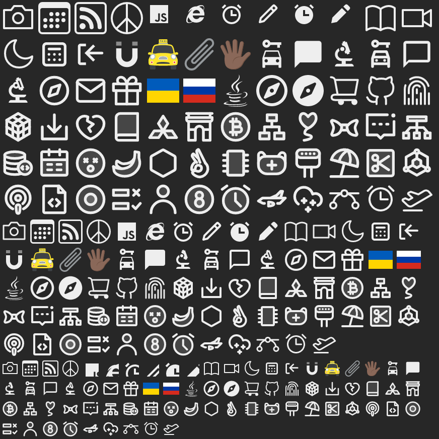

<h1>
icon-svg <a href="https://npmjs.org/package/icon-svg"></a> <a href="src"></a> <a href="https://cdn.jsdelivr.net/npm/icon-svg@3.0.6/dist/icon-svg.min.js"></a> <a href="LICENSE"></a>
</h1>

<p></p>

Memoized fetch SVG icons from many popular icon sets with editor autocomplete and a Web Component ready to use

<h4>
<table><tr><td title="Triple click to select and copy paste">
<code>npm i icon-svg </code>
</td><td title="Triple click to select and copy paste">
<code>pnpm add icon-svg </code>
</td><td title="Triple click to select and copy paste">
<code>yarn add icon-svg</code>
</td></tr></table>
</h4>

## Examples

<details id="example$app" title="app" open><summary><span><a href="#example$app">#</a></span>  <code><strong>app</strong></code></summary>  <ul><p></p>  <a href="https://stagas.github.io/icon-svg/example/app.html"></img>  <p><strong>Try it live</strong></p></a>    <details id="source$app" title="app source code" ><summary><span><a href="#source$app">#</a></span>  <code><strong>view source</strong></code></summary>  <a href="example/app.tsx">example/app.tsx</a>  <p>

```tsx
/** @jsxImportSource html-vdom */

import { render } from 'html-vdom'
import { IconSvg } from 'icon-svg'

document.body.className = 'dark'

const cssStyle = /*css*/ `
body {
  background: #eee;
  color: #222;
}

body.dark {
  background: #272727;
  color: #eee;
}

@media (prefers-color-scheme: dark) {
  body:not(.light) {
    background: #272727;
    color: #eee;
  }
}

${IconSvg} {
  width: 32px;
  height: 32px;
  margin: 2px;
  stroke-width: 2.5px;
}

.medium ${IconSvg} {
  width: 24px;
  height: 24px;
  stroke-width: 1.9px;
}

.small ${IconSvg} {
  width: 16px;
  height: 16px;
  stroke-width: 1.1px;
}
`
const style = document.createElement('style')
style.textContent = cssStyle
document.head.appendChild(style)

const AllSets = () => (
  <>
    <IconSvg set="bytesize" icon="camera" />
    <IconSvg set="bootstrap" icon="calendar3" />
    <IconSvg set="bootstrap" icon="rss" />
    <IconSvg set="bootstrap" icon="peace" />

    <IconSvg set="boxicons" type="logos" icon="javascript" />
    <IconSvg set="boxicons" type="logos" icon="internet-explorer" />
    <IconSvg set="boxicons" type="regular" icon="alarm" />
    <IconSvg set="boxicons" type="regular" icon="pencil" />
    <IconSvg set="boxicons" type="solid" icon="alarm" />
    <IconSvg set="boxicons" type="solid" icon="pencil" />

    <IconSvg set="bytesize" icon="book" />
    <IconSvg set="bytesize" icon="video" />
    <IconSvg set="bytesize" icon="moon" />

    <IconSvg set="cssgg" icon="calendar-dates" />
    <IconSvg set="cssgg" icon="log-out" />
    <IconSvg set="cssgg" icon="magnet" />

    <IconSvg set="emojicc" icon="oncomingTaxi" />
    <IconSvg set="emojicc" icon="paperclip" />
    <IconSvg set="emojicc" icon="handSplayedTone5" />

    <IconSvg set="eos" type="solid" icon="car_rental" />
    <IconSvg set="eos" type="solid" icon="chat_bubble" />
    <IconSvg set="eos" type="solid" icon="biotech" />
    <IconSvg set="eos" type="outlined" icon="car_rental" />
    <IconSvg set="eos" type="outlined" icon="chat_bubble" />
    <IconSvg set="eos" type="outlined" icon="biotech" />
    {/* <IconSvg set="eos" type="animated" icon="compass" /> */}

    <IconSvg set="feather" icon="compass" />
    <IconSvg set="feather" icon="mail" />
    <IconSvg set="feather" icon="gift" />

    <IconSvg set="flags" icon="ua" kind="4x3" />
    <IconSvg set="flags" icon="ru" kind="4x3" />

    <IconSvg set="fontawesome" type="brands" icon="java" />
    <IconSvg set="fontawesome" type="regular" icon="compass" />
    <IconSvg set="fontawesome" type="solid" icon="compass" />

    <IconSvg set="iconoir" icon="cart" />
    <IconSvg set="iconoir" icon="github" />
    <IconSvg set="iconoir" icon="fingerprint" />

    <IconSvg set="iconpark" type="Abstract" icon="cube" />
    <IconSvg set="iconpark" type="Arrows" icon="download" />
    <IconSvg set="iconpark" type="Base" icon="dislike" />
    <IconSvg set="iconpark" type="Books" icon="book" />
    <IconSvg set="iconpark" type="Brand" icon="mitsubishi" />
    <IconSvg set="iconpark" type="Build" icon="arc-de-triomphe" />
    <IconSvg set="iconpark" type="Character" icon="bitcoin" />
    <IconSvg set="iconpark" type="Charts" icon="chart-graph" />
    <IconSvg set="iconpark" type="Child" icon="heart-ballon" />
    <IconSvg set="iconpark" type="Clothes" icon="bow" />
    <IconSvg set="iconpark" type="Communicate" icon="message-unread" />
    <IconSvg set="iconpark" type="Connect" icon="branch-one" />
    <IconSvg set="iconpark" type="Datas" icon="database-code" />
    <IconSvg set="iconpark" type="Edit" icon="calendar" />
    <IconSvg set="iconpark" type="Emoji" icon="dizzy-face" />
    <IconSvg set="iconpark" type="Foods" icon="banana" />
    <IconSvg set="iconpark" type="Graphics" icon="hexagon-one" />
    <IconSvg set="iconpark" type="Hands" icon="spider-man" />
    <IconSvg set="iconpark" type="Hardware" icon="chip" />
    <IconSvg set="iconpark" type="Health" icon="mask" />
    <IconSvg set="iconpark" type="Industry" icon="oscillator" />
    <IconSvg set="iconpark" type="Life" icon="beach-umbrella" />
    <IconSvg set="iconpark" type="Makeups" icon="scissors" />
    <IconSvg set="iconpark" type="Money" icon="blockchain" />
    <IconSvg set="iconpark" type="Music" icon="fm" />
    <IconSvg set="iconpark" type="Office" icon="file-code" />
    <IconSvg set="iconpark" type="Operate" icon="radio-two" />
    <IconSvg set="iconpark" type="Others" icon="checklist" />
    <IconSvg set="iconpark" type="Peoples" icon="user" />
    <IconSvg set="iconpark" type="Sports" icon="black-eight" />
    <IconSvg set="iconpark" type="Time" icon="alarm-clock" />
    <IconSvg set="iconpark" type="Travel" icon="aviation" />
    <IconSvg set="iconpark" type="Weather" icon="snow" />

    <IconSvg set="phosphor" type="regular" icon="bezier-curve" />
    <IconSvg set="phosphor" type="regular" icon="alarm" />
    <IconSvg set="phosphor" type="regular" icon="airplane-takeoff" />
  </>
)

render(
  <>
    <button onclick={() => (document.body.className = 'light')}>light</button>
    <button onclick={() => (document.body.className = 'dark')}>dark</button>
    <div id="demo" style="width:435px">
      <div class="large">
        <AllSets />
      </div>
      <div class="medium">
        <AllSets />
      </div>
      <div class="small">
        <AllSets />
      </div>
    </div>
  </>,
  document.body
)
```

</p>
</details></ul></details>


## API

<p>  <details id="IconSvg$17" title="Namespace" ><summary><span><a href="#IconSvg$17">#</a></span>  <code><strong>IconSvg</strong></code>    </summary>  <a href=""></a>  <ul>        <p>  <details id="toString$18" title="Variable" ><summary><span><a href="#toString$18">#</a></span>  <code><strong>toString</strong></code>    </summary>  <a href=""></a>  <ul><p><details id="__type$19" title="Function" ><summary><span><a href="#__type$19">#</a></span>  <em>()</em>    </summary>    <ul>    <p>      <p><strong></strong><em>()</em>  &nbsp;=&gt;  <ul>string</ul></p></p>    </ul></details> &amp; <details id="__type$21" title="Function" ><summary><span><a href="#__type$21">#</a></span>  <em>()</em>    </summary>    <ul>    <p>      <p><strong></strong><em>()</em>  &nbsp;=&gt;  <ul>string</ul></p></p>    </ul></details></p>        </ul></details></p></ul></details><details id="IconSvgElement$51" title="Class" ><summary><span><a href="#IconSvgElement$51">#</a></span>  <code><strong>IconSvgElement</strong></code>    </summary>  <a href=""></a>  <ul>        <p>  <details id="constructor$52" title="Constructor" ><summary><span><a href="#constructor$52">#</a></span>  <code><strong>constructor</strong></code><em>()</em>    </summary>  <a href=""></a>  <ul>    <p>  <details id="new IconSvgElement$53" title="ConstructorSignature" ><summary><span><a href="#new IconSvgElement$53">#</a></span>  <code><strong>new IconSvgElement</strong></code><em>()</em>    </summary>    <ul><p><a href="#IconSvgElement$51">IconSvgElement</a></p>        </ul></details></p>    </ul></details><details id="$$80" title="Property" ><summary><span><a href="#$$80">#</a></span>  <code><strong>$</strong></code>    </summary>  <a href=""></a>  <ul><p><span>Context</span>&lt;<a href="#IconSvgElement$51">IconSvgElement</a> &amp; <span>JsxContext</span>&lt;<a href="#IconSvgElement$51">IconSvgElement</a>&gt; &amp; {<p>    <details id="ctor$84" title="Parameter" ><summary><span><a href="#ctor$84">#</a></span>  <code><strong>ctor</strong></code>    </summary>    <ul><p><a href="#T$83">T</a></p>        </ul></details>  <p><strong></strong>&lt;<span>T</span><span>&nbsp;extends&nbsp;</span>     <span>Class</span>&lt;<a href="#T$83">T</a>&gt;&gt;<em>(ctor)</em>  &nbsp;=&gt;  <ul><span>CleanClass</span>&lt;<a href="#T$83">T</a>&gt;</ul></p>  <details id="ctx$87" title="Parameter" ><summary><span><a href="#ctx$87">#</a></span>  <code><strong>ctx</strong></code>    </summary>    <ul><p><a href="#T$86">T</a></p>        </ul></details>  <p><strong></strong>&lt;<span>T</span>&gt;<em>(ctx)</em>  &nbsp;=&gt;  <ul><span>ElementWrapper</span>&lt;<a href="#T$86">T</a>&gt;</ul></p>  <details id="ctx$90" title="Parameter" ><summary><span><a href="#ctx$90">#</a></span>  <code><strong>ctx</strong></code>    </summary>    <ul><p><a href="#T$89">T</a></p>        </ul></details>  <p><strong></strong>&lt;<span>T</span><span>&nbsp;extends&nbsp;</span>     <span>Reactive</span>&lt;any&gt;&gt;<em>(ctx)</em>  &nbsp;=&gt;  <ul><span>ReactiveWrapper</span>&lt;<a href="#T$89">T</a>&gt;</ul></p></p>} &amp; <span>__module</span> &amp; {<p>  <details id="Boolean$94" title="Property" ><summary><span><a href="#Boolean$94">#</a></span>  <code><strong>Boolean</strong></code>    </summary>  <a href=""></a>  <ul><p>undefined | boolean</p>        </ul></details><details id="Number$93" title="Property" ><summary><span><a href="#Number$93">#</a></span>  <code><strong>Number</strong></code>    </summary>  <a href=""></a>  <ul><p>undefined | number</p>        </ul></details><details id="String$92" title="Property" ><summary><span><a href="#String$92">#</a></span>  <code><strong>String</strong></code>    </summary>  <a href=""></a>  <ul><p>undefined | string</p>        </ul></details></p>}&gt;</p>        </ul></details><details id="context$95" title="Property" ><summary><span><a href="#context$95">#</a></span>  <code><strong>context</strong></code>    </summary>  <a href=""></a>  <ul><p><span>ContextClass</span>&lt;<a href="#IconSvgElement$51">IconSvgElement</a> &amp; <span>JsxContext</span>&lt;<a href="#IconSvgElement$51">IconSvgElement</a>&gt; &amp; {<p>    <details id="ctor$99" title="Parameter" ><summary><span><a href="#ctor$99">#</a></span>  <code><strong>ctor</strong></code>    </summary>    <ul><p><a href="#T$83">T</a></p>        </ul></details>  <p><strong></strong>&lt;<span>T</span><span>&nbsp;extends&nbsp;</span>     <span>Class</span>&lt;<a href="#T$83">T</a>&gt;&gt;<em>(ctor)</em>  &nbsp;=&gt;  <ul><span>CleanClass</span>&lt;<a href="#T$83">T</a>&gt;</ul></p>  <details id="ctx$102" title="Parameter" ><summary><span><a href="#ctx$102">#</a></span>  <code><strong>ctx</strong></code>    </summary>    <ul><p><a href="#T$86">T</a></p>        </ul></details>  <p><strong></strong>&lt;<span>T</span>&gt;<em>(ctx)</em>  &nbsp;=&gt;  <ul><span>ElementWrapper</span>&lt;<a href="#T$86">T</a>&gt;</ul></p>  <details id="ctx$105" title="Parameter" ><summary><span><a href="#ctx$105">#</a></span>  <code><strong>ctx</strong></code>    </summary>    <ul><p><a href="#T$89">T</a></p>        </ul></details>  <p><strong></strong>&lt;<span>T</span><span>&nbsp;extends&nbsp;</span>     <span>Reactive</span>&lt;any&gt;&gt;<em>(ctx)</em>  &nbsp;=&gt;  <ul><span>ReactiveWrapper</span>&lt;<a href="#T$89">T</a>&gt;</ul></p></p>} &amp; <span>__module</span> &amp; {<p>  <details id="Boolean$109" title="Property" ><summary><span><a href="#Boolean$109">#</a></span>  <code><strong>Boolean</strong></code>    </summary>  <a href=""></a>  <ul><p>undefined | boolean</p>        </ul></details><details id="Number$108" title="Property" ><summary><span><a href="#Number$108">#</a></span>  <code><strong>Number</strong></code>    </summary>  <a href=""></a>  <ul><p>undefined | number</p>        </ul></details><details id="String$107" title="Property" ><summary><span><a href="#String$107">#</a></span>  <code><strong>String</strong></code>    </summary>  <a href=""></a>  <ul><p>undefined | string</p>        </ul></details></p>}&gt;</p>        </ul></details><details id="debug$144" title="Property" ><summary><span><a href="#debug$144">#</a></span>  <code><strong>debug</strong></code>    </summary>  <a href=""></a>  <ul><p>boolean</p>        </ul></details><details id="dispatch$65" title="Property" ><summary><span><a href="#dispatch$65">#</a></span>  <code><strong>dispatch</strong></code>    </summary>  <a href=""></a>  <ul><p><span>Dispatch</span>&lt;<details id="__type$66" title="Function" ><summary><span><a href="#__type$66">#</a></span>  <em>(name, detail, init)</em>    </summary>    <ul>    <p>    <details id="name$70" title="Parameter" ><summary><span><a href="#name$70">#</a></span>  <code><strong>name</strong></code>    </summary>    <ul><p><span>Event</span> | <span>Narrow</span>&lt;<a href="#K$68">K</a>, string&gt;</p>        </ul></details><details id="detail$71" title="Parameter" ><summary><span><a href="#detail$71">#</a></span>  <code><strong>detail</strong></code>    </summary>    <ul><p><a href="#E$69">E</a></p>        </ul></details><details id="init$72" title="Parameter" ><summary><span><a href="#init$72">#</a></span>  <code><strong>init</strong></code>    </summary>    <ul><p><span>CustomEventInit</span>&lt;any&gt;</p>        </ul></details>  <p><strong></strong>&lt;<span>K</span>, <span>E</span>&gt;<em>(name, detail, init)</em>  &nbsp;=&gt;  <ul>any</ul></p></p>    </ul></details>&gt;</p>        </ul></details><details id="host$79" title="Property" ><summary><span><a href="#host$79">#</a></span>  <code><strong>host</strong></code>    </summary>  <a href=""></a>  <ul><p><a href="#IconSvgElement$51">IconSvgElement</a></p>        </ul></details><details id="icon$54" title="Property" ><summary><span><a href="#icon$54">#</a></span>  <code><strong>icon</strong></code>  <span><span>&nbsp;=&nbsp;</span>  <code>$.String</code></span>  </summary>  <a href=""></a>  <ul><p>undefined | string</p>        </ul></details><details id="kind$57" title="Property" ><summary><span><a href="#kind$57">#</a></span>  <code><strong>kind</strong></code>  <span><span>&nbsp;=&nbsp;</span>  <code>$.String</code></span>  </summary>  <a href=""></a>  <ul><p>undefined | string</p>        </ul></details><details id="onmounted$77" title="Property" ><summary><span><a href="#onmounted$77">#</a></span>  <code><strong>onmounted</strong></code>    </summary>    <ul><p><span>EventHandler</span>&lt;<a href="#IconSvgElement$51">IconSvgElement</a>, <span>CustomEvent</span>&lt;any&gt;&gt;</p>        </ul></details><details id="onunmounted$78" title="Property" ><summary><span><a href="#onunmounted$78">#</a></span>  <code><strong>onunmounted</strong></code>    </summary>    <ul><p><span>EventHandler</span>&lt;<a href="#IconSvgElement$51">IconSvgElement</a>, <span>CustomEvent</span>&lt;any&gt;&gt;</p>        </ul></details><details id="preventUnmount$145" title="Property" ><summary><span><a href="#preventUnmount$145">#</a></span>  <code><strong>preventUnmount</strong></code>    </summary>  <a href=""></a>  <ul><p>boolean</p>        </ul></details><details id="raw$58" title="Property" ><summary><span><a href="#raw$58">#</a></span>  <code><strong>raw</strong></code>  <span><span>&nbsp;=&nbsp;</span>  <code>$.Boolean</code></span>  </summary>  <a href=""></a>  <ul><p>undefined | boolean</p>        </ul></details><details id="root$60" title="Property" ><summary><span><a href="#root$60">#</a></span>  <code><strong>root</strong></code>  <span><span>&nbsp;=&nbsp;</span>  <code>...</code></span>  </summary>  <a href=""></a>  <ul><p><span>ShadowRoot</span></p>        </ul></details><details id="set$55" title="Property" ><summary><span><a href="#set$55">#</a></span>  <code><strong>set</strong></code>  <span><span>&nbsp;=&nbsp;</span>  <code>$.String</code></span>  </summary>  <a href=""></a>  <ul><p>undefined | string</p>        </ul></details><details id="strokeWidth$59" title="Property" ><summary><span><a href="#strokeWidth$59">#</a></span>  <code><strong>strokeWidth</strong></code>  <span><span>&nbsp;=&nbsp;</span>  <code>$.Number</code></span>  </summary>  <a href=""></a>  <ul><p>undefined | number</p>        </ul></details><details id="type$56" title="Property" ><summary><span><a href="#type$56">#</a></span>  <code><strong>type</strong></code>  <span><span>&nbsp;=&nbsp;</span>  <code>$.String</code></span>  </summary>  <a href=""></a>  <ul><p>undefined | string</p>        </ul></details><details id="attributeChangedCallback$63" title="Method" ><summary><span><a href="#attributeChangedCallback$63">#</a></span>  <code><strong>attributeChangedCallback</strong></code><em>()</em>    </summary>  <a href=""></a>  <ul>    <p>      <p><strong>attributeChangedCallback</strong><em>()</em>  &nbsp;=&gt;  <ul>void</ul></p></p>    </ul></details><details id="created$127" title="Method" ><summary><span><a href="#created$127">#</a></span>  <code><strong>created</strong></code><em>(ctx)</em>    </summary>  <a href=""></a>  <ul>    <p>    <details id="ctx$129" title="Parameter" ><summary><span><a href="#ctx$129">#</a></span>  <code><strong>ctx</strong></code>    </summary>    <ul><p><span>Context</span>&lt;<a href="#IconSvgElement$51">IconSvgElement</a> &amp; <span>JsxContext</span>&lt;<a href="#IconSvgElement$51">IconSvgElement</a>&gt; &amp; {<p>    <details id="ctor$133" title="Parameter" ><summary><span><a href="#ctor$133">#</a></span>  <code><strong>ctor</strong></code>    </summary>    <ul><p><a href="#T$83">T</a></p>        </ul></details>  <p><strong></strong>&lt;<span>T</span><span>&nbsp;extends&nbsp;</span>     <span>Class</span>&lt;<a href="#T$83">T</a>&gt;&gt;<em>(ctor)</em>  &nbsp;=&gt;  <ul><span>CleanClass</span>&lt;<a href="#T$83">T</a>&gt;</ul></p>  <details id="ctx$136" title="Parameter" ><summary><span><a href="#ctx$136">#</a></span>  <code><strong>ctx</strong></code>    </summary>    <ul><p><a href="#T$86">T</a></p>        </ul></details>  <p><strong></strong>&lt;<span>T</span>&gt;<em>(ctx)</em>  &nbsp;=&gt;  <ul><span>ElementWrapper</span>&lt;<a href="#T$86">T</a>&gt;</ul></p>  <details id="ctx$139" title="Parameter" ><summary><span><a href="#ctx$139">#</a></span>  <code><strong>ctx</strong></code>    </summary>    <ul><p><a href="#T$89">T</a></p>        </ul></details>  <p><strong></strong>&lt;<span>T</span><span>&nbsp;extends&nbsp;</span>     <span>Reactive</span>&lt;any&gt;&gt;<em>(ctx)</em>  &nbsp;=&gt;  <ul><span>ReactiveWrapper</span>&lt;<a href="#T$89">T</a>&gt;</ul></p></p>} &amp; <span>__module</span> &amp; {<p>  <details id="Boolean$143" title="Property" ><summary><span><a href="#Boolean$143">#</a></span>  <code><strong>Boolean</strong></code>    </summary>  <a href=""></a>  <ul><p>undefined | boolean</p>        </ul></details><details id="Number$142" title="Property" ><summary><span><a href="#Number$142">#</a></span>  <code><strong>Number</strong></code>    </summary>  <a href=""></a>  <ul><p>undefined | number</p>        </ul></details><details id="String$141" title="Property" ><summary><span><a href="#String$141">#</a></span>  <code><strong>String</strong></code>    </summary>  <a href=""></a>  <ul><p>undefined | string</p>        </ul></details></p>}&gt;</p>        </ul></details>  <p><strong>created</strong><em>(ctx)</em>  &nbsp;=&gt;  <ul>void</ul></p></p>    </ul></details><details id="mounted$110" title="Method" ><summary><span><a href="#mounted$110">#</a></span>  <code><strong>mounted</strong></code><em>(ctx)</em>    </summary>  <a href=""></a>  <ul>    <p>    <details id="ctx$112" title="Parameter" ><summary><span><a href="#ctx$112">#</a></span>  <code><strong>ctx</strong></code>    </summary>    <ul><p><span>Context</span>&lt;<a href="#IconSvgElement$51">IconSvgElement</a> &amp; <span>JsxContext</span>&lt;<a href="#IconSvgElement$51">IconSvgElement</a>&gt; &amp; {<p>    <details id="ctor$116" title="Parameter" ><summary><span><a href="#ctor$116">#</a></span>  <code><strong>ctor</strong></code>    </summary>    <ul><p><a href="#T$83">T</a></p>        </ul></details>  <p><strong></strong>&lt;<span>T</span><span>&nbsp;extends&nbsp;</span>     <span>Class</span>&lt;<a href="#T$83">T</a>&gt;&gt;<em>(ctor)</em>  &nbsp;=&gt;  <ul><span>CleanClass</span>&lt;<a href="#T$83">T</a>&gt;</ul></p>  <details id="ctx$119" title="Parameter" ><summary><span><a href="#ctx$119">#</a></span>  <code><strong>ctx</strong></code>    </summary>    <ul><p><a href="#T$86">T</a></p>        </ul></details>  <p><strong></strong>&lt;<span>T</span>&gt;<em>(ctx)</em>  &nbsp;=&gt;  <ul><span>ElementWrapper</span>&lt;<a href="#T$86">T</a>&gt;</ul></p>  <details id="ctx$122" title="Parameter" ><summary><span><a href="#ctx$122">#</a></span>  <code><strong>ctx</strong></code>    </summary>    <ul><p><a href="#T$89">T</a></p>        </ul></details>  <p><strong></strong>&lt;<span>T</span><span>&nbsp;extends&nbsp;</span>     <span>Reactive</span>&lt;any&gt;&gt;<em>(ctx)</em>  &nbsp;=&gt;  <ul><span>ReactiveWrapper</span>&lt;<a href="#T$89">T</a>&gt;</ul></p></p>} &amp; <span>__module</span> &amp; {<p>  <details id="Boolean$126" title="Property" ><summary><span><a href="#Boolean$126">#</a></span>  <code><strong>Boolean</strong></code>    </summary>  <a href=""></a>  <ul><p>undefined | boolean</p>        </ul></details><details id="Number$125" title="Property" ><summary><span><a href="#Number$125">#</a></span>  <code><strong>Number</strong></code>    </summary>  <a href=""></a>  <ul><p>undefined | number</p>        </ul></details><details id="String$124" title="Property" ><summary><span><a href="#String$124">#</a></span>  <code><strong>String</strong></code>    </summary>  <a href=""></a>  <ul><p>undefined | string</p>        </ul></details></p>}&gt;</p>        </ul></details>  <p><strong>mounted</strong><em>(ctx)</em>  &nbsp;=&gt;  <ul>void</ul></p></p>    </ul></details><details id="on$73" title="Method" ><summary><span><a href="#on$73">#</a></span>  <code><strong>on</strong></code><em>(name)</em>    </summary>  <a href=""></a>  <ul>    <p>    <details id="name$76" title="Parameter" ><summary><span><a href="#name$76">#</a></span>  <code><strong>name</strong></code>    </summary>    <ul><p><a href="#K$75">K</a></p>        </ul></details>  <p><strong>on</strong>&lt;<span>K</span>&gt;<em>(name)</em>  &nbsp;=&gt;  <ul><span>On</span>&lt;<span>Fn</span>&lt;[  <span>EventHandler</span>&lt;<a href="#IconSvgElement$51">IconSvgElement</a>, <span>LifecycleEvents</span> &amp; object  [<a href="#K$75">K</a>]&gt;  ], <span>Off</span>&gt;&gt;</ul></p></p>    </ul></details><details id="toJSON$146" title="Method" ><summary><span><a href="#toJSON$146">#</a></span>  <code><strong>toJSON</strong></code><em>()</em>    </summary>  <a href=""></a>  <ul>    <p>      <p><strong>toJSON</strong><em>()</em>  &nbsp;=&gt;  <ul><span>Pick</span>&lt;<a href="#IconSvgElement$51">IconSvgElement</a>, keyof     <a href="#IconSvgElement$51">IconSvgElement</a>&gt;</ul></p></p>    </ul></details><details id="updateSvg$61" title="Method" ><summary><span><a href="#updateSvg$61">#</a></span>  <code><strong>updateSvg</strong></code><em>()</em>    </summary>  <a href=""></a>  <ul>    <p>      <p><strong>updateSvg</strong><em>()</em>  &nbsp;=&gt;  <ul><span>Promise</span>&lt;void&gt;</ul></p></p>    </ul></details></p></ul></details><details id="FetchProps$148" title="Interface" ><summary><span><a href="#FetchProps$148">#</a></span>  <code><strong>FetchProps</strong></code>    </summary>  <a href=""></a>  <ul>        <p>  <details id="raw$149" title="Property" ><summary><span><a href="#raw$149">#</a></span>  <code><strong>raw</strong></code>    </summary>  <a href=""></a>  <ul><p>boolean</p>        </ul></details><details id="strokeWidth$150" title="Property" ><summary><span><a href="#strokeWidth$150">#</a></span>  <code><strong>strokeWidth</strong></code>    </summary>  <a href=""></a>  <ul><p>string | number</p>        </ul></details></p></ul></details><details id="IconKinds$259" title="Interface" ><summary><span><a href="#IconKinds$259">#</a></span>  <code><strong>IconKinds</strong></code>    </summary>  <a href=""></a>  <ul>        <p>  <details id="flags$260" title="Property" ><summary><span><a href="#flags$260">#</a></span>  <code><strong>flags</strong></code>    </summary>  <a href=""></a>  <ul><p><code>"4x3"</code> | <code>"1x1"</code></p>        </ul></details><details id="material$261" title="Property" ><summary><span><a href="#material$261">#</a></span>  <code><strong>material</strong></code>    </summary>  <a href=""></a>  <ul><p><code>"outline"</code> | <code>"round"</code> | <code>"baseline"</code> | <code>"sharp"</code> | <code>"twotone"</code></p>        </ul></details></p></ul></details><details id="IconTypes$253" title="Interface" ><summary><span><a href="#IconTypes$253">#</a></span>  <code><strong>IconTypes</strong></code>    </summary>  <a href=""></a>  <ul>        <p>  <details id="boxicons$254" title="Property" ><summary><span><a href="#boxicons$254">#</a></span>  <code><strong>boxicons</strong></code>    </summary>  <a href=""></a>  <ul><p><code>"solid"</code> | <code>"regular"</code> | <code>"logos"</code></p>        </ul></details><details id="eos$255" title="Property" ><summary><span><a href="#eos$255">#</a></span>  <code><strong>eos</strong></code>    </summary>  <a href=""></a>  <ul><p><code>"solid"</code> | <code>"animated"</code> | <code>"outlined"</code></p>        </ul></details><details id="fontawesome$256" title="Property" ><summary><span><a href="#fontawesome$256">#</a></span>  <code><strong>fontawesome</strong></code>    </summary>  <a href=""></a>  <ul><p><code>"solid"</code> | <code>"regular"</code> | <code>"brands"</code></p>        </ul></details><details id="iconpark$257" title="Property" ><summary><span><a href="#iconpark$257">#</a></span>  <code><strong>iconpark</strong></code>    </summary>  <a href=""></a>  <ul><p><code>"Datas"</code> | <code>"Connect"</code> | <code>"Communicate"</code> | <code>"Clothes"</code> | <code>"Child"</code> | <code>"Charts"</code> | <code>"Character"</code> | <code>"Build"</code> | <code>"Brand"</code> | <code>"Books"</code> | <code>"Base"</code> | <code>"Arrows"</code> | <code>"Abstract"</code> | <code>"Edit"</code> | <code>"Emoji"</code> | <code>"Foods"</code> | <code>"Graphics"</code> | <code>"Hands"</code> | <code>"Hardware"</code> | <code>"Health"</code> | <code>"Industry"</code> | <code>"Life"</code> | <code>"Makeups"</code> | <code>"Money"</code> | <code>"Music"</code> | <code>"Office"</code> | <code>"Operate"</code> | <code>"Others"</code> | <code>"Peoples"</code> | <code>"Sports"</code> | <code>"Time"</code> | <code>"Travel"</code> | <code>"Weather"</code></p>        </ul></details><details id="phosphor$258" title="Property" ><summary><span><a href="#phosphor$258">#</a></span>  <code><strong>phosphor</strong></code>    </summary>  <a href=""></a>  <ul><p><code>"bold"</code> | <code>"light"</code> | <code>"fill"</code> | <code>"thin"</code> | <code>"regular"</code> | <code>"duotone"</code></p>        </ul></details></p></ul></details><details id="Icons$184" title="Interface" ><summary><span><a href="#Icons$184">#</a></span>  <code><strong>Icons</strong></code>    </summary>  <a href=""></a>  <ul>        <p>  <details id="bootstrap$185" title="Property" ><summary><span><a href="#bootstrap$185">#</a></span>  <code><strong>bootstrap</strong></code>    </summary>  <a href=""></a>  <ul><p><code>"123"</code> | <code>"activity"</code> | <code>"alarm"</code> | <code>"alarm-fill"</code> | <code>"align-bottom"</code> | <code>"align-center"</code> | <code>"align-end"</code> | <code>"align-middle"</code> | <code>"align-start"</code> | <code>"align-top"</code> | <code>"alt"</code> | <code>"app"</code> | <code>"app-indicator"</code> | <code>"apple"</code> | <code>"archive"</code> | <code>"archive-fill"</code> | <code>"arrow-90deg-down"</code> | <code>"arrow-90deg-left"</code> | <code>"arrow-90deg-right"</code> | <code>"arrow-90deg-up"</code> | <code>"arrow-bar-down"</code> | <code>"arrow-bar-left"</code> | <code>"arrow-bar-right"</code> | <code>"arrow-bar-up"</code> | <code>"arrow-clockwise"</code> | <code>"arrow-counterclockwise"</code> | <code>"arrow-down"</code> | <code>"arrow-down-circle"</code> | <code>"arrow-down-circle-fill"</code> | <code>"arrow-down-left"</code> | <code>"arrow-down-left-circle"</code> | <code>"arrow-down-left-circle-fill"</code> | <code>"arrow-down-left-square"</code> | <code>"arrow-down-left-square-fill"</code> | <code>"arrow-down-right"</code> | <code>"arrow-down-right-circle"</code> | <code>"arrow-down-right-circle-fill"</code> | <code>"arrow-down-right-square"</code> | <code>"arrow-down-right-square-fill"</code> | <code>"arrow-down-short"</code> | <code>"arrow-down-square"</code> | <code>"arrow-down-square-fill"</code> | <code>"arrow-down-up"</code> | <code>"arrow-left"</code> | <code>"arrow-left-circle"</code> | <code>"arrow-left-circle-fill"</code> | <code>"arrow-left-right"</code> | <code>"arrow-left-short"</code> | <code>"arrow-left-square"</code> | <code>"arrow-left-square-fill"</code> | <code>"arrow-repeat"</code> | <code>"arrow-return-left"</code> | <code>"arrow-return-right"</code> | <code>"arrow-right"</code> | <code>"arrow-right-circle"</code> | <code>"arrow-right-circle-fill"</code> | <code>"arrow-right-short"</code> | <code>"arrow-right-square"</code> | <code>"arrow-right-square-fill"</code> | <code>"arrow-through-heart"</code> | <code>"arrow-through-heart-fill"</code> | <code>"arrow-up"</code> | <code>"arrow-up-circle"</code> | <code>"arrow-up-circle-fill"</code> | <code>"arrow-up-left"</code> | <code>"arrow-up-left-circle"</code> | <code>"arrow-up-left-circle-fill"</code> | <code>"arrow-up-left-square"</code> | <code>"arrow-up-left-square-fill"</code> | <code>"arrow-up-right"</code> | <code>"arrow-up-right-circle"</code> | <code>"arrow-up-right-circle-fill"</code> | <code>"arrow-up-right-square"</code> | <code>"arrow-up-right-square-fill"</code> | <code>"arrow-up-short"</code> | <code>"arrow-up-square"</code> | <code>"arrow-up-square-fill"</code> | <code>"arrows-angle-contract"</code> | <code>"arrows-angle-expand"</code> | <code>"arrows-collapse"</code> | <code>"arrows-expand"</code> | <code>"arrows-fullscreen"</code> | <code>"arrows-move"</code> | <code>"aspect-ratio"</code> | <code>"aspect-ratio-fill"</code> | <code>"asterisk"</code> | <code>"at"</code> | <code>"award"</code> | <code>"award-fill"</code> | <code>"back"</code> | <code>"backspace"</code> | <code>"backspace-fill"</code> | <code>"backspace-reverse"</code> | <code>"backspace-reverse-fill"</code> | <code>"badge-3d"</code> | <code>"badge-3d-fill"</code> | <code>"badge-4k"</code> | <code>"badge-4k-fill"</code> | <code>"badge-8k"</code> | <code>"badge-8k-fill"</code> | <code>"badge-ad"</code> | <code>"badge-ad-fill"</code> | <code>"badge-ar"</code> | <code>"badge-ar-fill"</code> | <code>"badge-cc"</code> | <code>"badge-cc-fill"</code> | <code>"badge-hd"</code> | <code>"badge-hd-fill"</code> | <code>"badge-sd"</code> | <code>"badge-sd-fill"</code> | <code>"badge-tm"</code> | <code>"badge-tm-fill"</code> | <code>"badge-vo"</code> | <code>"badge-vo-fill"</code> | <code>"badge-vr"</code> | <code>"badge-vr-fill"</code> | <code>"badge-wc"</code> | <code>"badge-wc-fill"</code> | <code>"bag"</code> | <code>"bag-check"</code> | <code>"bag-check-fill"</code> | <code>"bag-dash"</code> | <code>"bag-dash-fill"</code> | <code>"bag-fill"</code> | <code>"bag-heart"</code> | <code>"bag-heart-fill"</code> | <code>"bag-plus"</code> | <code>"bag-plus-fill"</code> | <code>"bag-x"</code> | <code>"bag-x-fill"</code> | <code>"balloon"</code> | <code>"balloon-fill"</code> | <code>"balloon-heart"</code> | <code>"balloon-heart-fill"</code> | <code>"bandaid"</code> | <code>"bandaid-fill"</code> | <code>"bank"</code> | <code>"bank2"</code> | <code>"bar-chart"</code> | <code>"bar-chart-fill"</code> | <code>"bar-chart-line"</code> | <code>"bar-chart-line-fill"</code> | <code>"bar-chart-steps"</code> | <code>"basket"</code> | <code>"basket-fill"</code> | <code>"basket2"</code> | <code>"basket2-fill"</code> | <code>"basket3"</code> | <code>"basket3-fill"</code> | <code>"battery"</code> | <code>"battery-charging"</code> | <code>"battery-full"</code> | <code>"battery-half"</code> | <code>"behance"</code> | <code>"bell"</code> | <code>"bell-fill"</code> | <code>"bell-slash"</code> | <code>"bell-slash-fill"</code> | <code>"bezier"</code> | <code>"bezier2"</code> | <code>"bicycle"</code> | <code>"binoculars"</code> | <code>"binoculars-fill"</code> | <code>"blockquote-left"</code> | <code>"blockquote-right"</code> | <code>"bluetooth"</code> | <code>"body-text"</code> | <code>"book"</code> | <code>"book-fill"</code> | <code>"book-half"</code> | <code>"bookmark"</code> | <code>"bookmark-check"</code> | <code>"bookmark-check-fill"</code> | <code>"bookmark-dash"</code> | <code>"bookmark-dash-fill"</code> | <code>"bookmark-fill"</code> | <code>"bookmark-heart"</code> | <code>"bookmark-heart-fill"</code> | <code>"bookmark-plus"</code> | <code>"bookmark-plus-fill"</code> | <code>"bookmark-star"</code> | <code>"bookmark-star-fill"</code> | <code>"bookmark-x"</code> | <code>"bookmark-x-fill"</code> | <code>"bookmarks"</code> | <code>"bookmarks-fill"</code> | <code>"bookshelf"</code> | <code>"boombox"</code> | <code>"boombox-fill"</code> | <code>"bootstrap"</code> | <code>"bootstrap-fill"</code> | <code>"bootstrap-reboot"</code> | <code>"border"</code> | <code>"border-all"</code> | <code>"border-bottom"</code> | <code>"border-center"</code> | <code>"border-inner"</code> | <code>"border-left"</code> | <code>"border-middle"</code> | <code>"border-outer"</code> | <code>"border-right"</code> | <code>"border-style"</code> | <code>"border-top"</code> | <code>"border-width"</code> | <code>"bounding-box"</code> | <code>"bounding-box-circles"</code> | <code>"box"</code> | <code>"box-arrow-down"</code> | <code>"box-arrow-down-left"</code> | <code>"box-arrow-down-right"</code> | <code>"box-arrow-in-down"</code> | <code>"box-arrow-in-down-left"</code> | <code>"box-arrow-in-down-right"</code> | <code>"box-arrow-in-left"</code> | <code>"box-arrow-in-right"</code> | <code>"box-arrow-in-up"</code> | <code>"box-arrow-in-up-left"</code> | <code>"box-arrow-in-up-right"</code> | <code>"box-arrow-left"</code> | <code>"box-arrow-right"</code> | <code>"box-arrow-up"</code> | <code>"box-arrow-up-left"</code> | <code>"box-arrow-up-right"</code> | <code>"box-seam"</code> | <code>"box2"</code> | <code>"box2-fill"</code> | <code>"box2-heart"</code> | <code>"box2-heart-fill"</code> | <code>"boxes"</code> | <code>"braces"</code> | <code>"braces-asterisk"</code> | <code>"bricks"</code> | <code>"briefcase"</code> | <code>"briefcase-fill"</code> | <code>"brightness-alt-high"</code> | <code>"brightness-alt-high-fill"</code> | <code>"brightness-alt-low"</code> | <code>"brightness-alt-low-fill"</code> | <code>"brightness-high"</code> | <code>"brightness-high-fill"</code> | <code>"brightness-low"</code> | <code>"brightness-low-fill"</code> | <code>"broadcast"</code> | <code>"broadcast-pin"</code> | <code>"brush"</code> | <code>"brush-fill"</code> | <code>"bucket"</code> | <code>"bucket-fill"</code> | <code>"bug"</code> | <code>"bug-fill"</code> | <code>"building"</code> | <code>"bullseye"</code> | <code>"calculator"</code> | <code>"calculator-fill"</code> | <code>"calendar"</code> | <code>"calendar-check"</code> | <code>"calendar-check-fill"</code> | <code>"calendar-date"</code> | <code>"calendar-date-fill"</code> | <code>"calendar-day"</code> | <code>"calendar-day-fill"</code> | <code>"calendar-event"</code> | <code>"calendar-event-fill"</code> | <code>"calendar-fill"</code> | <code>"calendar-heart"</code> | <code>"calendar-heart-fill"</code> | <code>"calendar-minus"</code> | <code>"calendar-minus-fill"</code> | <code>"calendar-month"</code> | <code>"calendar-month-fill"</code> | <code>"calendar-plus"</code> | <code>"calendar-plus-fill"</code> | <code>"calendar-range"</code> | <code>"calendar-range-fill"</code> | <code>"calendar-week"</code> | <code>"calendar-week-fill"</code> | <code>"calendar-x"</code> | <code>"calendar-x-fill"</code> | <code>"calendar2"</code> | <code>"calendar2-check"</code> | <code>"calendar2-check-fill"</code> | <code>"calendar2-date"</code> | <code>"calendar2-date-fill"</code> | <code>"calendar2-day"</code> | <code>"calendar2-day-fill"</code> | <code>"calendar2-event"</code> | <code>"calendar2-event-fill"</code> | <code>"calendar2-fill"</code> | <code>"calendar2-heart"</code> | <code>"calendar2-heart-fill"</code> | <code>"calendar2-minus"</code> | <code>"calendar2-minus-fill"</code> | <code>"calendar2-month"</code> | <code>"calendar2-month-fill"</code> | <code>"calendar2-plus"</code> | <code>"calendar2-plus-fill"</code> | <code>"calendar2-range"</code> | <code>"calendar2-range-fill"</code> | <code>"calendar2-week"</code> | <code>"calendar2-week-fill"</code> | <code>"calendar2-x"</code> | <code>"calendar2-x-fill"</code> | <code>"calendar3"</code> | <code>"calendar3-event"</code> | <code>"calendar3-event-fill"</code> | <code>"calendar3-fill"</code> | <code>"calendar3-range"</code> | <code>"calendar3-range-fill"</code> | <code>"calendar3-week"</code> | <code>"calendar3-week-fill"</code> | <code>"calendar4"</code> | <code>"calendar4-event"</code> | <code>"calendar4-range"</code> | <code>"calendar4-week"</code> | <code>"camera"</code> | <code>"camera-fill"</code> | <code>"camera-reels"</code> | <code>"camera-reels-fill"</code> | <code>"camera-video"</code> | <code>"camera-video-fill"</code> | <code>"camera-video-off"</code> | <code>"camera-video-off-fill"</code> | <code>"camera2"</code> | <code>"capslock"</code> | <code>"capslock-fill"</code> | <code>"card-checklist"</code> | <code>"card-heading"</code> | <code>"card-image"</code> | <code>"card-list"</code> | <code>"card-text"</code> | <code>"caret-down"</code> | <code>"caret-down-fill"</code> | <code>"caret-down-square"</code> | <code>"caret-down-square-fill"</code> | <code>"caret-left"</code> | <code>"caret-left-fill"</code> | <code>"caret-left-square"</code> | <code>"caret-left-square-fill"</code> | <code>"caret-right"</code> | <code>"caret-right-fill"</code> | <code>"caret-right-square"</code> | <code>"caret-right-square-fill"</code> | <code>"caret-up"</code> | <code>"caret-up-fill"</code> | <code>"caret-up-square"</code> | <code>"caret-up-square-fill"</code> | <code>"cart"</code> | <code>"cart-check"</code> | <code>"cart-check-fill"</code> | <code>"cart-dash"</code> | <code>"cart-dash-fill"</code> | <code>"cart-fill"</code> | <code>"cart-plus"</code> | <code>"cart-plus-fill"</code> | <code>"cart-x"</code> | <code>"cart-x-fill"</code> | <code>"cart2"</code> | <code>"cart3"</code> | <code>"cart4"</code> | <code>"cash"</code> | <code>"cash-coin"</code> | <code>"cash-stack"</code> | <code>"cast"</code> | <code>"chat"</code> | <code>"chat-dots"</code> | <code>"chat-dots-fill"</code> | <code>"chat-fill"</code> | <code>"chat-heart"</code> | <code>"chat-heart-fill"</code> | <code>"chat-left"</code> | <code>"chat-left-dots"</code> | <code>"chat-left-dots-fill"</code> | <code>"chat-left-fill"</code> | <code>"chat-left-heart"</code> | <code>"chat-left-heart-fill"</code> | <code>"chat-left-quote"</code> | <code>"chat-left-quote-fill"</code> | <code>"chat-left-text"</code> | <code>"chat-left-text-fill"</code> | <code>"chat-quote"</code> | <code>"chat-quote-fill"</code> | <code>"chat-right"</code> | <code>"chat-right-dots"</code> | <code>"chat-right-dots-fill"</code> | <code>"chat-right-fill"</code> | <code>"chat-right-heart"</code> | <code>"chat-right-heart-fill"</code> | <code>"chat-right-quote"</code> | <code>"chat-right-quote-fill"</code> | <code>"chat-right-text"</code> | <code>"chat-right-text-fill"</code> | <code>"chat-square"</code> | <code>"chat-square-dots"</code> | <code>"chat-square-dots-fill"</code> | <code>"chat-square-fill"</code> | <code>"chat-square-heart"</code> | <code>"chat-square-heart-fill"</code> | <code>"chat-square-quote"</code> | <code>"chat-square-quote-fill"</code> | <code>"chat-square-text"</code> | <code>"chat-square-text-fill"</code> | <code>"chat-text"</code> | <code>"chat-text-fill"</code> | <code>"check"</code> | <code>"check-all"</code> | <code>"check-circle"</code> | <code>"check-circle-fill"</code> | <code>"check-lg"</code> | <code>"check-square"</code> | <code>"check-square-fill"</code> | <code>"check2"</code> | <code>"check2-all"</code> | <code>"check2-circle"</code> | <code>"check2-square"</code> | <code>"chevron-bar-contract"</code> | <code>"chevron-bar-down"</code> | <code>"chevron-bar-expand"</code> | <code>"chevron-bar-left"</code> | <code>"chevron-bar-right"</code> | <code>"chevron-bar-up"</code> | <code>"chevron-compact-down"</code> | <code>"chevron-compact-left"</code> | <code>"chevron-compact-right"</code> | <code>"chevron-compact-up"</code> | <code>"chevron-contract"</code> | <code>"chevron-double-down"</code> | <code>"chevron-double-left"</code> | <code>"chevron-double-right"</code> | <code>"chevron-double-up"</code> | <code>"chevron-down"</code> | <code>"chevron-expand"</code> | <code>"chevron-left"</code> | <code>"chevron-right"</code> | <code>"chevron-up"</code> | <code>"circle"</code> | <code>"circle-fill"</code> | <code>"circle-half"</code> | <code>"circle-square"</code> | <code>"clipboard"</code> | <code>"clipboard-check"</code> | <code>"clipboard-check-fill"</code> | <code>"clipboard-data"</code> | <code>"clipboard-data-fill"</code> | <code>"clipboard-fill"</code> | <code>"clipboard-heart"</code> | <code>"clipboard-heart-fill"</code> | <code>"clipboard-minus"</code> | <code>"clipboard-minus-fill"</code> | <code>"clipboard-plus"</code> | <code>"clipboard-plus-fill"</code> | <code>"clipboard-pulse"</code> | <code>"clipboard-x"</code> | <code>"clipboard-x-fill"</code> | <code>"clipboard2"</code> | <code>"clipboard2-check"</code> | <code>"clipboard2-check-fill"</code> | <code>"clipboard2-data"</code> | <code>"clipboard2-data-fill"</code> | <code>"clipboard2-fill"</code> | <code>"clipboard2-heart"</code> | <code>"clipboard2-heart-fill"</code> | <code>"clipboard2-minus"</code> | <code>"clipboard2-minus-fill"</code> | <code>"clipboard2-plus"</code> | <code>"clipboard2-plus-fill"</code> | <code>"clipboard2-pulse"</code> | <code>"clipboard2-pulse-fill"</code> | <code>"clipboard2-x"</code> | <code>"clipboard2-x-fill"</code> | <code>"clock"</code> | <code>"clock-fill"</code> | <code>"clock-history"</code> | <code>"cloud"</code> | <code>"cloud-arrow-down"</code> | <code>"cloud-arrow-down-fill"</code> | <code>"cloud-arrow-up"</code> | <code>"cloud-arrow-up-fill"</code> | <code>"cloud-check"</code> | <code>"cloud-check-fill"</code> | <code>"cloud-download"</code> | <code>"cloud-download-fill"</code> | <code>"cloud-drizzle"</code> | <code>"cloud-drizzle-fill"</code> | <code>"cloud-fill"</code> | <code>"cloud-fog"</code> | <code>"cloud-fog-fill"</code> | <code>"cloud-fog2"</code> | <code>"cloud-fog2-fill"</code> | <code>"cloud-hail"</code> | <code>"cloud-hail-fill"</code> | <code>"cloud-haze"</code> | <code>"cloud-haze-fill"</code> | <code>"cloud-haze2"</code> | <code>"cloud-haze2-fill"</code> | <code>"cloud-lightning"</code> | <code>"cloud-lightning-fill"</code> | <code>"cloud-lightning-rain"</code> | <code>"cloud-lightning-rain-fill"</code> | <code>"cloud-minus"</code> | <code>"cloud-minus-fill"</code> | <code>"cloud-moon"</code> | <code>"cloud-moon-fill"</code> | <code>"cloud-plus"</code> | <code>"cloud-plus-fill"</code> | <code>"cloud-rain"</code> | <code>"cloud-rain-fill"</code> | <code>"cloud-rain-heavy"</code> | <code>"cloud-rain-heavy-fill"</code> | <code>"cloud-slash"</code> | <code>"cloud-slash-fill"</code> | <code>"cloud-sleet"</code> | <code>"cloud-sleet-fill"</code> | <code>"cloud-snow"</code> | <code>"cloud-snow-fill"</code> | <code>"cloud-sun"</code> | <code>"cloud-sun-fill"</code> | <code>"cloud-upload"</code> | <code>"cloud-upload-fill"</code> | <code>"clouds"</code> | <code>"clouds-fill"</code> | <code>"cloudy"</code> | <code>"cloudy-fill"</code> | <code>"code"</code> | <code>"code-slash"</code> | <code>"code-square"</code> | <code>"coin"</code> | <code>"collection"</code> | <code>"collection-fill"</code> | <code>"collection-play"</code> | <code>"collection-play-fill"</code> | <code>"columns"</code> | <code>"columns-gap"</code> | <code>"command"</code> | <code>"compass"</code> | <code>"compass-fill"</code> | <code>"cone"</code> | <code>"cone-striped"</code> | <code>"controller"</code> | <code>"cpu"</code> | <code>"cpu-fill"</code> | <code>"credit-card"</code> | <code>"credit-card-2-back"</code> | <code>"credit-card-2-back-fill"</code> | <code>"credit-card-2-front"</code> | <code>"credit-card-2-front-fill"</code> | <code>"credit-card-fill"</code> | <code>"crop"</code> | <code>"cup"</code> | <code>"cup-fill"</code> | <code>"cup-straw"</code> | <code>"currency-bitcoin"</code> | <code>"currency-dollar"</code> | <code>"currency-euro"</code> | <code>"currency-exchange"</code> | <code>"currency-pound"</code> | <code>"currency-yen"</code> | <code>"cursor"</code> | <code>"cursor-fill"</code> | <code>"cursor-text"</code> | <code>"dash"</code> | <code>"dash-circle"</code> | <code>"dash-circle-dotted"</code> | <code>"dash-circle-fill"</code> | <code>"dash-lg"</code> | <code>"dash-square"</code> | <code>"dash-square-dotted"</code> | <code>"dash-square-fill"</code> | <code>"device-hdd"</code> | <code>"device-hdd-fill"</code> | <code>"device-ssd"</code> | <code>"device-ssd-fill"</code> | <code>"diagram-2"</code> | <code>"diagram-2-fill"</code> | <code>"diagram-3"</code> | <code>"diagram-3-fill"</code> | <code>"diamond"</code> | <code>"diamond-fill"</code> | <code>"diamond-half"</code> | <code>"dice-1"</code> | <code>"dice-1-fill"</code> | <code>"dice-2"</code> | <code>"dice-2-fill"</code> | <code>"dice-3"</code> | <code>"dice-3-fill"</code> | <code>"dice-4"</code> | <code>"dice-4-fill"</code> | <code>"dice-5"</code> | <code>"dice-5-fill"</code> | <code>"dice-6"</code> | <code>"dice-6-fill"</code> | <code>"disc"</code> | <code>"disc-fill"</code> | <code>"discord"</code> | <code>"display"</code> | <code>"display-fill"</code> | <code>"displayport"</code> | <code>"displayport-fill"</code> | <code>"distribute-horizontal"</code> | <code>"distribute-vertical"</code> | <code>"door-closed"</code> | <code>"door-closed-fill"</code> | <code>"door-open"</code> | <code>"door-open-fill"</code> | <code>"dot"</code> | <code>"download"</code> | <code>"dpad"</code> | <code>"dpad-fill"</code> | <code>"dribbble"</code> | <code>"droplet"</code> | <code>"droplet-fill"</code> | <code>"droplet-half"</code> | <code>"ear"</code> | <code>"ear-fill"</code> | <code>"earbuds"</code> | <code>"easel"</code> | <code>"easel-fill"</code> | <code>"easel2"</code> | <code>"easel2-fill"</code> | <code>"easel3"</code> | <code>"easel3-fill"</code> | <code>"egg"</code> | <code>"egg-fill"</code> | <code>"egg-fried"</code> | <code>"eject"</code> | <code>"eject-fill"</code> | <code>"emoji-angry"</code> | <code>"emoji-angry-fill"</code> | <code>"emoji-dizzy"</code> | <code>"emoji-dizzy-fill"</code> | <code>"emoji-expressionless"</code> | <code>"emoji-expressionless-fill"</code> | <code>"emoji-frown"</code> | <code>"emoji-frown-fill"</code> | <code>"emoji-heart-eyes"</code> | <code>"emoji-heart-eyes-fill"</code> | <code>"emoji-kiss"</code> | <code>"emoji-kiss-fill"</code> | <code>"emoji-laughing"</code> | <code>"emoji-laughing-fill"</code> | <code>"emoji-neutral"</code> | <code>"emoji-neutral-fill"</code> | <code>"emoji-smile"</code> | <code>"emoji-smile-fill"</code> | <code>"emoji-smile-upside-down"</code> | <code>"emoji-smile-upside-down-fill"</code> | <code>"emoji-sunglasses"</code> | <code>"emoji-sunglasses-fill"</code> | <code>"emoji-wink"</code> | <code>"emoji-wink-fill"</code> | <code>"envelope"</code> | <code>"envelope-check"</code> | <code>"envelope-check-fill"</code> | <code>"envelope-dash"</code> | <code>"envelope-dash-fill"</code> | <code>"envelope-exclamation"</code> | <code>"envelope-exclamation-fill"</code> | <code>"envelope-fill"</code> | <code>"envelope-heart"</code> | <code>"envelope-heart-fill"</code> | <code>"envelope-open"</code> | <code>"envelope-open-fill"</code> | <code>"envelope-open-heart"</code> | <code>"envelope-open-heart-fill"</code> | <code>"envelope-paper"</code> | <code>"envelope-paper-fill"</code> | <code>"envelope-paper-heart"</code> | <code>"envelope-paper-heart-fill"</code> | <code>"envelope-plus"</code> | <code>"envelope-plus-fill"</code> | <code>"envelope-slash"</code> | <code>"envelope-slash-fill"</code> | <code>"envelope-x"</code> | <code>"envelope-x-fill"</code> | <code>"eraser"</code> | <code>"eraser-fill"</code> | <code>"ethernet"</code> | <code>"exclamation"</code> | <code>"exclamation-circle"</code> | <code>"exclamation-circle-fill"</code> | <code>"exclamation-diamond"</code> | <code>"exclamation-diamond-fill"</code> | <code>"exclamation-lg"</code> | <code>"exclamation-octagon"</code> | <code>"exclamation-octagon-fill"</code> | <code>"exclamation-square"</code> | <code>"exclamation-square-fill"</code> | <code>"exclamation-triangle"</code> | <code>"exclamation-triangle-fill"</code> | <code>"exclude"</code> | <code>"explicit"</code> | <code>"explicit-fill"</code> | <code>"eye"</code> | <code>"eye-fill"</code> | <code>"eye-slash"</code> | <code>"eye-slash-fill"</code> | <code>"eyedropper"</code> | <code>"eyeglasses"</code> | <code>"facebook"</code> | <code>"fan"</code> | <code>"file"</code> | <code>"file-arrow-down"</code> | <code>"file-arrow-down-fill"</code> | <code>"file-arrow-up"</code> | <code>"file-arrow-up-fill"</code> | <code>"file-bar-graph"</code> | <code>"file-bar-graph-fill"</code> | <code>"file-binary"</code> | <code>"file-binary-fill"</code> | <code>"file-break"</code> | <code>"file-break-fill"</code> | <code>"file-check"</code> | <code>"file-check-fill"</code> | <code>"file-code"</code> | <code>"file-code-fill"</code> | <code>"file-diff"</code> | <code>"file-diff-fill"</code> | <code>"file-earmark"</code> | <code>"file-earmark-arrow-down"</code> | <code>"file-earmark-arrow-down-fill"</code> | <code>"file-earmark-arrow-up"</code> | <code>"file-earmark-arrow-up-fill"</code> | <code>"file-earmark-bar-graph"</code> | <code>"file-earmark-bar-graph-fill"</code> | <code>"file-earmark-binary"</code> | <code>"file-earmark-binary-fill"</code> | <code>"file-earmark-break"</code> | <code>"file-earmark-break-fill"</code> | <code>"file-earmark-check"</code> | <code>"file-earmark-check-fill"</code> | <code>"file-earmark-code"</code> | <code>"file-earmark-code-fill"</code> | <code>"file-earmark-diff"</code> | <code>"file-earmark-diff-fill"</code> | <code>"file-earmark-easel"</code> | <code>"file-earmark-easel-fill"</code> | <code>"file-earmark-excel"</code> | <code>"file-earmark-excel-fill"</code> | <code>"file-earmark-fill"</code> | <code>"file-earmark-font"</code> | <code>"file-earmark-font-fill"</code> | <code>"file-earmark-image"</code> | <code>"file-earmark-image-fill"</code> | <code>"file-earmark-lock"</code> | <code>"file-earmark-lock-fill"</code> | <code>"file-earmark-lock2"</code> | <code>"file-earmark-lock2-fill"</code> | <code>"file-earmark-medical"</code> | <code>"file-earmark-medical-fill"</code> | <code>"file-earmark-minus"</code> | <code>"file-earmark-minus-fill"</code> | <code>"file-earmark-music"</code> | <code>"file-earmark-music-fill"</code> | <code>"file-earmark-pdf"</code> | <code>"file-earmark-pdf-fill"</code> | <code>"file-earmark-person"</code> | <code>"file-earmark-person-fill"</code> | <code>"file-earmark-play"</code> | <code>"file-earmark-play-fill"</code> | <code>"file-earmark-plus"</code> | <code>"file-earmark-plus-fill"</code> | <code>"file-earmark-post"</code> | <code>"file-earmark-post-fill"</code> | <code>"file-earmark-ppt"</code> | <code>"file-earmark-ppt-fill"</code> | <code>"file-earmark-richtext"</code> | <code>"file-earmark-richtext-fill"</code> | <code>"file-earmark-ruled"</code> | <code>"file-earmark-ruled-fill"</code> | <code>"file-earmark-slides"</code> | <code>"file-earmark-slides-fill"</code> | <code>"file-earmark-spreadsheet"</code> | <code>"file-earmark-spreadsheet-fill"</code> | <code>"file-earmark-text"</code> | <code>"file-earmark-text-fill"</code> | <code>"file-earmark-word"</code> | <code>"file-earmark-word-fill"</code> | <code>"file-earmark-x"</code> | <code>"file-earmark-x-fill"</code> | <code>"file-earmark-zip"</code> | <code>"file-earmark-zip-fill"</code> | <code>"file-easel"</code> | <code>"file-easel-fill"</code> | <code>"file-excel"</code> | <code>"file-excel-fill"</code> | <code>"file-fill"</code> | <code>"file-font"</code> | <code>"file-font-fill"</code> | <code>"file-image"</code> | <code>"file-image-fill"</code> | <code>"file-lock"</code> | <code>"file-lock-fill"</code> | <code>"file-lock2"</code> | <code>"file-lock2-fill"</code> | <code>"file-medical"</code> | <code>"file-medical-fill"</code> | <code>"file-minus"</code> | <code>"file-minus-fill"</code> | <code>"file-music"</code> | <code>"file-music-fill"</code> | <code>"file-pdf"</code> | <code>"file-pdf-fill"</code> | <code>"file-person"</code> | <code>"file-person-fill"</code> | <code>"file-play"</code> | <code>"file-play-fill"</code> | <code>"file-plus"</code> | <code>"file-plus-fill"</code> | <code>"file-post"</code> | <code>"file-post-fill"</code> | <code>"file-ppt"</code> | <code>"file-ppt-fill"</code> | <code>"file-richtext"</code> | <code>"file-richtext-fill"</code> | <code>"file-ruled"</code> | <code>"file-ruled-fill"</code> | <code>"file-slides"</code> | <code>"file-slides-fill"</code> | <code>"file-spreadsheet"</code> | <code>"file-spreadsheet-fill"</code> | <code>"file-text"</code> | <code>"file-text-fill"</code> | <code>"file-word"</code> | <code>"file-word-fill"</code> | <code>"file-x"</code> | <code>"file-x-fill"</code> | <code>"file-zip"</code> | <code>"file-zip-fill"</code> | <code>"files"</code> | <code>"files-alt"</code> | <code>"filetype-aac"</code> | <code>"filetype-ai"</code> | <code>"filetype-bmp"</code> | <code>"filetype-cs"</code> | <code>"filetype-css"</code> | <code>"filetype-csv"</code> | <code>"filetype-doc"</code> | <code>"filetype-docx"</code> | <code>"filetype-exe"</code> | <code>"filetype-gif"</code> | <code>"filetype-heic"</code> | <code>"filetype-html"</code> | <code>"filetype-java"</code> | <code>"filetype-jpg"</code> | <code>"filetype-js"</code> | <code>"filetype-json"</code> | <code>"filetype-jsx"</code> | <code>"filetype-key"</code> | <code>"filetype-m4p"</code> | <code>"filetype-md"</code> | <code>"filetype-mdx"</code> | <code>"filetype-mov"</code> | <code>"filetype-mp3"</code> | <code>"filetype-mp4"</code> | <code>"filetype-otf"</code> | <code>"filetype-pdf"</code> | <code>"filetype-php"</code> | <code>"filetype-png"</code> | <code>"filetype-ppt"</code> | <code>"filetype-pptx"</code> | <code>"filetype-psd"</code> | <code>"filetype-py"</code> | <code>"filetype-raw"</code> | <code>"filetype-rb"</code> | <code>"filetype-sass"</code> | <code>"filetype-scss"</code> | <code>"filetype-sh"</code> | <code>"filetype-svg"</code> | <code>"filetype-tiff"</code> | <code>"filetype-tsx"</code> | <code>"filetype-ttf"</code> | <code>"filetype-txt"</code> | <code>"filetype-wav"</code> | <code>"filetype-woff"</code> | <code>"filetype-xls"</code> | <code>"filetype-xlsx"</code> | <code>"filetype-xml"</code> | <code>"filetype-yml"</code> | <code>"film"</code> | <code>"filter"</code> | <code>"filter-circle"</code> | <code>"filter-circle-fill"</code> | <code>"filter-left"</code> | <code>"filter-right"</code> | <code>"filter-square"</code> | <code>"filter-square-fill"</code> | <code>"fingerprint"</code> | <code>"flag"</code> | <code>"flag-fill"</code> | <code>"flower1"</code> | <code>"flower2"</code> | <code>"flower3"</code> | <code>"folder"</code> | <code>"folder-check"</code> | <code>"folder-fill"</code> | <code>"folder-minus"</code> | <code>"folder-plus"</code> | <code>"folder-symlink"</code> | <code>"folder-symlink-fill"</code> | <code>"folder-x"</code> | <code>"folder2"</code> | <code>"folder2-open"</code> | <code>"fonts"</code> | <code>"forward"</code> | <code>"forward-fill"</code> | <code>"front"</code> | <code>"fullscreen"</code> | <code>"fullscreen-exit"</code> | <code>"funnel"</code> | <code>"funnel-fill"</code> | <code>"gear"</code> | <code>"gear-fill"</code> | <code>"gear-wide"</code> | <code>"gear-wide-connected"</code> | <code>"gem"</code> | <code>"gender-ambiguous"</code> | <code>"gender-female"</code> | <code>"gender-male"</code> | <code>"gender-trans"</code> | <code>"geo"</code> | <code>"geo-alt"</code> | <code>"geo-alt-fill"</code> | <code>"geo-fill"</code> | <code>"gift"</code> | <code>"gift-fill"</code> | <code>"git"</code> | <code>"github"</code> | <code>"globe"</code> | <code>"globe2"</code> | <code>"google"</code> | <code>"gpu-card"</code> | <code>"graph-down"</code> | <code>"graph-down-arrow"</code> | <code>"graph-up"</code> | <code>"graph-up-arrow"</code> | <code>"grid"</code> | <code>"grid-1x2"</code> | <code>"grid-1x2-fill"</code> | <code>"grid-3x2"</code> | <code>"grid-3x2-gap"</code> | <code>"grid-3x2-gap-fill"</code> | <code>"grid-3x3"</code> | <code>"grid-3x3-gap"</code> | <code>"grid-3x3-gap-fill"</code> | <code>"grid-fill"</code> | <code>"grip-horizontal"</code> | <code>"grip-vertical"</code> | <code>"hammer"</code> | <code>"hand-index"</code> | <code>"hand-index-fill"</code> | <code>"hand-index-thumb"</code> | <code>"hand-index-thumb-fill"</code> | <code>"hand-thumbs-down"</code> | <code>"hand-thumbs-down-fill"</code> | <code>"hand-thumbs-up"</code> | <code>"hand-thumbs-up-fill"</code> | <code>"handbag"</code> | <code>"handbag-fill"</code> | <code>"hash"</code> | <code>"hdd"</code> | <code>"hdd-fill"</code> | <code>"hdd-network"</code> | <code>"hdd-network-fill"</code> | <code>"hdd-rack"</code> | <code>"hdd-rack-fill"</code> | <code>"hdd-stack"</code> | <code>"hdd-stack-fill"</code> | <code>"hdmi"</code> | <code>"hdmi-fill"</code> | <code>"headphones"</code> | <code>"headset"</code> | <code>"headset-vr"</code> | <code>"heart"</code> | <code>"heart-arrow"</code> | <code>"heart-fill"</code> | <code>"heart-half"</code> | <code>"heart-pulse"</code> | <code>"heart-pulse-fill"</code> | <code>"heartbreak"</code> | <code>"heartbreak-fill"</code> | <code>"hearts"</code> | <code>"heptagon"</code> | <code>"heptagon-fill"</code> | <code>"heptagon-half"</code> | <code>"hexagon"</code> | <code>"hexagon-fill"</code> | <code>"hexagon-half"</code> | <code>"hospital"</code> | <code>"hospital-fill"</code> | <code>"hourglass"</code> | <code>"hourglass-bottom"</code> | <code>"hourglass-split"</code> | <code>"hourglass-top"</code> | <code>"house"</code> | <code>"house-door"</code> | <code>"house-door-fill"</code> | <code>"house-fill"</code> | <code>"house-heart"</code> | <code>"house-heart-fill"</code> | <code>"hr"</code> | <code>"hurricane"</code> | <code>"hypnotize"</code> | <code>"image"</code> | <code>"image-alt"</code> | <code>"image-fill"</code> | <code>"images"</code> | <code>"inbox"</code> | <code>"inbox-fill"</code> | <code>"inboxes"</code> | <code>"inboxes-fill"</code> | <code>"incognito"</code> | <code>"infinity"</code> | <code>"info"</code> | <code>"info-circle"</code> | <code>"info-circle-fill"</code> | <code>"info-lg"</code> | <code>"info-square"</code> | <code>"info-square-fill"</code> | <code>"input-cursor"</code> | <code>"input-cursor-text"</code> | <code>"instagram"</code> | <code>"intersect"</code> | <code>"journal"</code> | <code>"journal-album"</code> | <code>"journal-arrow-down"</code> | <code>"journal-arrow-up"</code> | <code>"journal-bookmark"</code> | <code>"journal-bookmark-fill"</code> | <code>"journal-check"</code> | <code>"journal-code"</code> | <code>"journal-medical"</code> | <code>"journal-minus"</code> | <code>"journal-plus"</code> | <code>"journal-richtext"</code> | <code>"journal-text"</code> | <code>"journal-x"</code> | <code>"journals"</code> | <code>"joystick"</code> | <code>"justify"</code> | <code>"justify-left"</code> | <code>"justify-right"</code> | <code>"kanban"</code> | <code>"kanban-fill"</code> | <code>"key"</code> | <code>"key-fill"</code> | <code>"keyboard"</code> | <code>"keyboard-fill"</code> | <code>"ladder"</code> | <code>"lamp"</code> | <code>"lamp-fill"</code> | <code>"laptop"</code> | <code>"laptop-fill"</code> | <code>"layer-backward"</code> | <code>"layer-forward"</code> | <code>"layers"</code> | <code>"layers-fill"</code> | <code>"layers-half"</code> | <code>"layout-sidebar"</code> | <code>"layout-sidebar-inset"</code> | <code>"layout-sidebar-inset-reverse"</code> | <code>"layout-sidebar-reverse"</code> | <code>"layout-split"</code> | <code>"layout-text-sidebar"</code> | <code>"layout-text-sidebar-reverse"</code> | <code>"layout-text-window"</code> | <code>"layout-text-window-reverse"</code> | <code>"layout-three-columns"</code> | <code>"layout-wtf"</code> | <code>"life-preserver"</code> | <code>"lightbulb"</code> | <code>"lightbulb-fill"</code> | <code>"lightbulb-off"</code> | <code>"lightbulb-off-fill"</code> | <code>"lightning"</code> | <code>"lightning-charge"</code> | <code>"lightning-charge-fill"</code> | <code>"lightning-fill"</code> | <code>"line"</code> | <code>"link"</code> | <code>"link-45deg"</code> | <code>"linkedin"</code> | <code>"list"</code> | <code>"list-check"</code> | <code>"list-columns"</code> | <code>"list-columns-reverse"</code> | <code>"list-nested"</code> | <code>"list-ol"</code> | <code>"list-stars"</code> | <code>"list-task"</code> | <code>"list-ul"</code> | <code>"lock"</code> | <code>"lock-fill"</code> | <code>"magic"</code> | <code>"magnet"</code> | <code>"magnet-fill"</code> | <code>"mailbox"</code> | <code>"mailbox2"</code> | <code>"map"</code> | <code>"map-fill"</code> | <code>"markdown"</code> | <code>"markdown-fill"</code> | <code>"mask"</code> | <code>"mastodon"</code> | <code>"medium"</code> | <code>"megaphone"</code> | <code>"megaphone-fill"</code> | <code>"memory"</code> | <code>"menu-app"</code> | <code>"menu-app-fill"</code> | <code>"menu-button"</code> | <code>"menu-button-fill"</code> | <code>"menu-button-wide"</code> | <code>"menu-button-wide-fill"</code> | <code>"menu-down"</code> | <code>"menu-up"</code> | <code>"messenger"</code> | <code>"meta"</code> | <code>"mic"</code> | <code>"mic-fill"</code> | <code>"mic-mute"</code> | <code>"mic-mute-fill"</code> | <code>"microsoft"</code> | <code>"minecart"</code> | <code>"minecart-loaded"</code> | <code>"modem"</code> | <code>"modem-fill"</code> | <code>"moisture"</code> | <code>"moon"</code> | <code>"moon-fill"</code> | <code>"moon-stars"</code> | <code>"moon-stars-fill"</code> | <code>"mortarboard"</code> | <code>"mortarboard-fill"</code> | <code>"motherboard"</code> | <code>"motherboard-fill"</code> | <code>"mouse"</code> | <code>"mouse-fill"</code> | <code>"mouse2"</code> | <code>"mouse2-fill"</code> | <code>"mouse3"</code> | <code>"mouse3-fill"</code> | <code>"music-note"</code> | <code>"music-note-beamed"</code> | <code>"music-note-list"</code> | <code>"music-player"</code> | <code>"music-player-fill"</code> | <code>"newspaper"</code> | <code>"nintendo-switch"</code> | <code>"node-minus"</code> | <code>"node-minus-fill"</code> | <code>"node-plus"</code> | <code>"node-plus-fill"</code> | <code>"nut"</code> | <code>"nut-fill"</code> | <code>"octagon"</code> | <code>"octagon-fill"</code> | <code>"octagon-half"</code> | <code>"optical-audio"</code> | <code>"optical-audio-fill"</code> | <code>"option"</code> | <code>"outlet"</code> | <code>"paint-bucket"</code> | <code>"palette"</code> | <code>"palette-fill"</code> | <code>"palette2"</code> | <code>"paperclip"</code> | <code>"paragraph"</code> | <code>"patch-check"</code> | <code>"patch-check-fill"</code> | <code>"patch-exclamation"</code> | <code>"patch-exclamation-fill"</code> | <code>"patch-minus"</code> | <code>"patch-minus-fill"</code> | <code>"patch-plus"</code> | <code>"patch-plus-fill"</code> | <code>"patch-question"</code> | <code>"patch-question-fill"</code> | <code>"pause"</code> | <code>"pause-btn"</code> | <code>"pause-btn-fill"</code> | <code>"pause-circle"</code> | <code>"pause-circle-fill"</code> | <code>"pause-fill"</code> | <code>"paypal"</code> | <code>"pc"</code> | <code>"pc-display"</code> | <code>"pc-display-horizontal"</code> | <code>"pc-horizontal"</code> | <code>"pci-card"</code> | <code>"peace"</code> | <code>"peace-fill"</code> | <code>"pen"</code> | <code>"pen-fill"</code> | <code>"pencil"</code> | <code>"pencil-fill"</code> | <code>"pencil-square"</code> | <code>"pentagon"</code> | <code>"pentagon-fill"</code> | <code>"pentagon-half"</code> | <code>"people"</code> | <code>"people-fill"</code> | <code>"percent"</code> | <code>"person"</code> | <code>"person-badge"</code> | <code>"person-badge-fill"</code> | <code>"person-bounding-box"</code> | <code>"person-check"</code> | <code>"person-check-fill"</code> | <code>"person-circle"</code> | <code>"person-dash"</code> | <code>"person-dash-fill"</code> | <code>"person-fill"</code> | <code>"person-heart"</code> | <code>"person-hearts"</code> | <code>"person-lines-fill"</code> | <code>"person-plus"</code> | <code>"person-plus-fill"</code> | <code>"person-rolodex"</code> | <code>"person-square"</code> | <code>"person-video"</code> | <code>"person-video2"</code> | <code>"person-video3"</code> | <code>"person-workspace"</code> | <code>"person-x"</code> | <code>"person-x-fill"</code> | <code>"phone"</code> | <code>"phone-fill"</code> | <code>"phone-flip"</code> | <code>"phone-landscape"</code> | <code>"phone-landscape-fill"</code> | <code>"phone-vibrate"</code> | <code>"phone-vibrate-fill"</code> | <code>"pie-chart"</code> | <code>"pie-chart-fill"</code> | <code>"piggy-bank"</code> | <code>"piggy-bank-fill"</code> | <code>"pin"</code> | <code>"pin-angle"</code> | <code>"pin-angle-fill"</code> | <code>"pin-fill"</code> | <code>"pin-map"</code> | <code>"pin-map-fill"</code> | <code>"pinterest"</code> | <code>"pip"</code> | <code>"pip-fill"</code> | <code>"play"</code> | <code>"play-btn"</code> | <code>"play-btn-fill"</code> | <code>"play-circle"</code> | <code>"play-circle-fill"</code> | <code>"play-fill"</code> | <code>"playstation"</code> | <code>"plug"</code> | <code>"plug-fill"</code> | <code>"plugin"</code> | <code>"plus"</code> | <code>"plus-circle"</code> | <code>"plus-circle-dotted"</code> | <code>"plus-circle-fill"</code> | <code>"plus-lg"</code> | <code>"plus-slash-minus"</code> | <code>"plus-square"</code> | <code>"plus-square-dotted"</code> | <code>"plus-square-fill"</code> | <code>"postage"</code> | <code>"postage-fill"</code> | <code>"postage-heart"</code> | <code>"postage-heart-fill"</code> | <code>"postcard"</code> | <code>"postcard-fill"</code> | <code>"postcard-heart"</code> | <code>"postcard-heart-fill"</code> | <code>"power"</code> | <code>"printer"</code> | <code>"printer-fill"</code> | <code>"projector"</code> | <code>"projector-fill"</code> | <code>"puzzle"</code> | <code>"puzzle-fill"</code> | <code>"qr-code"</code> | <code>"qr-code-scan"</code> | <code>"question"</code> | <code>"question-circle"</code> | <code>"question-circle-fill"</code> | <code>"question-diamond"</code> | <code>"question-diamond-fill"</code> | <code>"question-lg"</code> | <code>"question-octagon"</code> | <code>"question-octagon-fill"</code> | <code>"question-square"</code> | <code>"question-square-fill"</code> | <code>"quora"</code> | <code>"quote"</code> | <code>"radioactive"</code> | <code>"rainbow"</code> | <code>"receipt"</code> | <code>"receipt-cutoff"</code> | <code>"reception-0"</code> | <code>"reception-1"</code> | <code>"reception-2"</code> | <code>"reception-3"</code> | <code>"reception-4"</code> | <code>"record"</code> | <code>"record-btn"</code> | <code>"record-btn-fill"</code> | <code>"record-circle"</code> | <code>"record-circle-fill"</code> | <code>"record-fill"</code> | <code>"record2"</code> | <code>"record2-fill"</code> | <code>"recycle"</code> | <code>"reddit"</code> | <code>"reply"</code> | <code>"reply-all"</code> | <code>"reply-all-fill"</code> | <code>"reply-fill"</code> | <code>"robot"</code> | <code>"router"</code> | <code>"router-fill"</code> | <code>"rss"</code> | <code>"rss-fill"</code> | <code>"rulers"</code> | <code>"safe"</code> | <code>"safe-fill"</code> | <code>"safe2"</code> | <code>"safe2-fill"</code> | <code>"save"</code> | <code>"save-fill"</code> | <code>"save2"</code> | <code>"save2-fill"</code> | <code>"scissors"</code> | <code>"screwdriver"</code> | <code>"sd-card"</code> | <code>"sd-card-fill"</code> | <code>"search"</code> | <code>"search-heart"</code> | <code>"search-heart-fill"</code> | <code>"segmented-nav"</code> | <code>"send"</code> | <code>"send-check"</code> | <code>"send-check-fill"</code> | <code>"send-dash"</code> | <code>"send-dash-fill"</code> | <code>"send-exclamation"</code> | <code>"send-exclamation-fill"</code> | <code>"send-fill"</code> | <code>"send-plus"</code> | <code>"send-plus-fill"</code> | <code>"send-slash"</code> | <code>"send-slash-fill"</code> | <code>"send-x"</code> | <code>"send-x-fill"</code> | <code>"server"</code> | <code>"share"</code> | <code>"share-fill"</code> | <code>"shield"</code> | <code>"shield-check"</code> | <code>"shield-exclamation"</code> | <code>"shield-fill"</code> | <code>"shield-fill-check"</code> | <code>"shield-fill-exclamation"</code> | <code>"shield-fill-minus"</code> | <code>"shield-fill-plus"</code> | <code>"shield-fill-x"</code> | <code>"shield-lock"</code> | <code>"shield-lock-fill"</code> | <code>"shield-minus"</code> | <code>"shield-plus"</code> | <code>"shield-shaded"</code> | <code>"shield-slash"</code> | <code>"shield-slash-fill"</code> | <code>"shield-x"</code> | <code>"shift"</code> | <code>"shift-fill"</code> | <code>"shop"</code> | <code>"shop-window"</code> | <code>"shuffle"</code> | <code>"signal"</code> | <code>"signpost"</code> | <code>"signpost-2"</code> | <code>"signpost-2-fill"</code> | <code>"signpost-fill"</code> | <code>"signpost-split"</code> | <code>"signpost-split-fill"</code> | <code>"sim"</code> | <code>"sim-fill"</code> | <code>"skip-backward"</code> | <code>"skip-backward-btn"</code> | <code>"skip-backward-btn-fill"</code> | <code>"skip-backward-circle"</code> | <code>"skip-backward-circle-fill"</code> | <code>"skip-backward-fill"</code> | <code>"skip-end"</code> | <code>"skip-end-btn"</code> | <code>"skip-end-btn-fill"</code> | <code>"skip-end-circle"</code> | <code>"skip-end-circle-fill"</code> | <code>"skip-end-fill"</code> | <code>"skip-forward"</code> | <code>"skip-forward-btn"</code> | <code>"skip-forward-btn-fill"</code> | <code>"skip-forward-circle"</code> | <code>"skip-forward-circle-fill"</code> | <code>"skip-forward-fill"</code> | <code>"skip-start"</code> | <code>"skip-start-btn"</code> | <code>"skip-start-btn-fill"</code> | <code>"skip-start-circle"</code> | <code>"skip-start-circle-fill"</code> | <code>"skip-start-fill"</code> | <code>"skype"</code> | <code>"slack"</code> | <code>"slash"</code> | <code>"slash-circle"</code> | <code>"slash-circle-fill"</code> | <code>"slash-lg"</code> | <code>"slash-square"</code> | <code>"slash-square-fill"</code> | <code>"sliders"</code> | <code>"sliders2"</code> | <code>"sliders2-vertical"</code> | <code>"smartwatch"</code> | <code>"snapchat"</code> | <code>"snow"</code> | <code>"snow2"</code> | <code>"snow3"</code> | <code>"sort-alpha-down"</code> | <code>"sort-alpha-down-alt"</code> | <code>"sort-alpha-up"</code> | <code>"sort-alpha-up-alt"</code> | <code>"sort-down"</code> | <code>"sort-down-alt"</code> | <code>"sort-numeric-down"</code> | <code>"sort-numeric-down-alt"</code> | <code>"sort-numeric-up"</code> | <code>"sort-numeric-up-alt"</code> | <code>"sort-up"</code> | <code>"sort-up-alt"</code> | <code>"soundwave"</code> | <code>"speaker"</code> | <code>"speaker-fill"</code> | <code>"speedometer"</code> | <code>"speedometer2"</code> | <code>"spellcheck"</code> | <code>"spotify"</code> | <code>"square"</code> | <code>"square-fill"</code> | <code>"square-half"</code> | <code>"stack"</code> | <code>"stack-overflow"</code> | <code>"star"</code> | <code>"star-fill"</code> | <code>"star-half"</code> | <code>"stars"</code> | <code>"steam"</code> | <code>"stickies"</code> | <code>"stickies-fill"</code> | <code>"sticky"</code> | <code>"sticky-fill"</code> | <code>"stop"</code> | <code>"stop-btn"</code> | <code>"stop-btn-fill"</code> | <code>"stop-circle"</code> | <code>"stop-circle-fill"</code> | <code>"stop-fill"</code> | <code>"stoplights"</code> | <code>"stoplights-fill"</code> | <code>"stopwatch"</code> | <code>"stopwatch-fill"</code> | <code>"strava"</code> | <code>"subtract"</code> | <code>"suit-club"</code> | <code>"suit-club-fill"</code> | <code>"suit-diamond"</code> | <code>"suit-diamond-fill"</code> | <code>"suit-heart"</code> | <code>"suit-heart-fill"</code> | <code>"suit-spade"</code> | <code>"suit-spade-fill"</code> | <code>"sun"</code> | <code>"sun-fill"</code> | <code>"sunglasses"</code> | <code>"sunrise"</code> | <code>"sunrise-fill"</code> | <code>"sunset"</code> | <code>"sunset-fill"</code> | <code>"symmetry-horizontal"</code> | <code>"symmetry-vertical"</code> | <code>"table"</code> | <code>"tablet"</code> | <code>"tablet-fill"</code> | <code>"tablet-landscape"</code> | <code>"tablet-landscape-fill"</code> | <code>"tag"</code> | <code>"tag-fill"</code> | <code>"tags"</code> | <code>"tags-fill"</code> | <code>"telegram"</code> | <code>"telephone"</code> | <code>"telephone-fill"</code> | <code>"telephone-forward"</code> | <code>"telephone-forward-fill"</code> | <code>"telephone-inbound"</code> | <code>"telephone-inbound-fill"</code> | <code>"telephone-minus"</code> | <code>"telephone-minus-fill"</code> | <code>"telephone-outbound"</code> | <code>"telephone-outbound-fill"</code> | <code>"telephone-plus"</code> | <code>"telephone-plus-fill"</code> | <code>"telephone-x"</code> | <code>"telephone-x-fill"</code> | <code>"terminal"</code> | <code>"terminal-dash"</code> | <code>"terminal-fill"</code> | <code>"terminal-plus"</code> | <code>"terminal-split"</code> | <code>"terminal-x"</code> | <code>"text-center"</code> | <code>"text-indent-left"</code> | <code>"text-indent-right"</code> | <code>"text-left"</code> | <code>"text-paragraph"</code> | <code>"text-right"</code> | <code>"textarea"</code> | <code>"textarea-resize"</code> | <code>"textarea-t"</code> | <code>"thermometer"</code> | <code>"thermometer-half"</code> | <code>"thermometer-high"</code> | <code>"thermometer-low"</code> | <code>"thermometer-snow"</code> | <code>"thermometer-sun"</code> | <code>"three-dots"</code> | <code>"three-dots-vertical"</code> | <code>"thunderbolt"</code> | <code>"thunderbolt-fill"</code> | <code>"ticket"</code> | <code>"ticket-detailed"</code> | <code>"ticket-detailed-fill"</code> | <code>"ticket-fill"</code> | <code>"ticket-perforated"</code> | <code>"ticket-perforated-fill"</code> | <code>"tiktok"</code> | <code>"toggle-off"</code> | <code>"toggle-on"</code> | <code>"toggle2-off"</code> | <code>"toggle2-on"</code> | <code>"toggles"</code> | <code>"toggles2"</code> | <code>"tools"</code> | <code>"tornado"</code> | <code>"translate"</code> | <code>"trash"</code> | <code>"trash-fill"</code> | <code>"trash2"</code> | <code>"trash2-fill"</code> | <code>"trash3"</code> | <code>"trash3-fill"</code> | <code>"tree"</code> | <code>"tree-fill"</code> | <code>"triangle"</code> | <code>"triangle-fill"</code> | <code>"triangle-half"</code> | <code>"trophy"</code> | <code>"trophy-fill"</code> | <code>"tropical-storm"</code> | <code>"truck"</code> | <code>"truck-flatbed"</code> | <code>"tsunami"</code> | <code>"tv"</code> | <code>"tv-fill"</code> | <code>"twitch"</code> | <code>"twitter"</code> | <code>"type"</code> | <code>"type-bold"</code> | <code>"type-h1"</code> | <code>"type-h2"</code> | <code>"type-h3"</code> | <code>"type-italic"</code> | <code>"type-strikethrough"</code> | <code>"type-underline"</code> | <code>"ui-checks"</code> | <code>"ui-checks-grid"</code> | <code>"ui-radios"</code> | <code>"ui-radios-grid"</code> | <code>"umbrella"</code> | <code>"umbrella-fill"</code> | <code>"union"</code> | <code>"unlock"</code> | <code>"unlock-fill"</code> | <code>"upc"</code> | <code>"upc-scan"</code> | <code>"upload"</code> | <code>"usb"</code> | <code>"usb-c"</code> | <code>"usb-c-fill"</code> | <code>"usb-drive"</code> | <code>"usb-drive-fill"</code> | <code>"usb-fill"</code> | <code>"usb-micro"</code> | <code>"usb-micro-fill"</code> | <code>"usb-mini"</code> | <code>"usb-mini-fill"</code> | <code>"usb-plug"</code> | <code>"usb-plug-fill"</code> | <code>"usb-symbol"</code> | <code>"valentine"</code> | <code>"valentine2"</code> | <code>"vector-pen"</code> | <code>"view-list"</code> | <code>"view-stacked"</code> | <code>"vimeo"</code> | <code>"vinyl"</code> | <code>"vinyl-fill"</code> | <code>"voicemail"</code> | <code>"volume-down"</code> | <code>"volume-down-fill"</code> | <code>"volume-mute"</code> | <code>"volume-mute-fill"</code> | <code>"volume-off"</code> | <code>"volume-off-fill"</code> | <code>"volume-up"</code> | <code>"volume-up-fill"</code> | <code>"vr"</code> | <code>"wallet"</code> | <code>"wallet-fill"</code> | <code>"wallet2"</code> | <code>"watch"</code> | <code>"water"</code> | <code>"webcam"</code> | <code>"webcam-fill"</code> | <code>"whatsapp"</code> | <code>"wifi"</code> | <code>"wifi-1"</code> | <code>"wifi-2"</code> | <code>"wifi-off"</code> | <code>"wind"</code> | <code>"window"</code> | <code>"window-dash"</code> | <code>"window-desktop"</code> | <code>"window-dock"</code> | <code>"window-fullscreen"</code> | <code>"window-plus"</code> | <code>"window-sidebar"</code> | <code>"window-split"</code> | <code>"window-stack"</code> | <code>"window-x"</code> | <code>"windows"</code> | <code>"wordpress"</code> | <code>"wrench"</code> | <code>"wrench-adjustable"</code> | <code>"wrench-adjustable-circle"</code> | <code>"wrench-adjustable-circle-fill"</code> | <code>"x"</code> | <code>"x-circle"</code> | <code>"x-circle-fill"</code> | <code>"x-diamond"</code> | <code>"x-diamond-fill"</code> | <code>"x-lg"</code> | <code>"x-octagon"</code> | <code>"x-octagon-fill"</code> | <code>"x-square"</code> | <code>"x-square-fill"</code> | <code>"xbox"</code> | <code>"yin-yang"</code> | <code>"youtube"</code> | <code>"zoom-in"</code> | <code>"zoom-out"</code></p>        </ul></details><details id="boxicons$186" title="Property" ><summary><span><a href="#boxicons$186">#</a></span>  <code><strong>boxicons</strong></code>    </summary>  <a href=""></a>  <ul><p>{<p>  <details id="logos$190" title="Property" ><summary><span><a href="#logos$190">#</a></span>  <code><strong>logos</strong></code>    </summary>  <a href=""></a>  <ul><p><code>"apple"</code> | <code>"behance"</code> | <code>"bootstrap"</code> | <code>"discord"</code> | <code>"dribbble"</code> | <code>"facebook"</code> | <code>"git"</code> | <code>"github"</code> | <code>"google"</code> | <code>"instagram"</code> | <code>"linkedin"</code> | <code>"markdown"</code> | <code>"mastodon"</code> | <code>"medium"</code> | <code>"messenger"</code> | <code>"meta"</code> | <code>"microsoft"</code> | <code>"paypal"</code> | <code>"pinterest"</code> | <code>"quora"</code> | <code>"reddit"</code> | <code>"skype"</code> | <code>"slack"</code> | <code>"snapchat"</code> | <code>"spotify"</code> | <code>"stack-overflow"</code> | <code>"steam"</code> | <code>"telegram"</code> | <code>"tiktok"</code> | <code>"twitch"</code> | <code>"twitter"</code> | <code>"vimeo"</code> | <code>"whatsapp"</code> | <code>"windows"</code> | <code>"wordpress"</code> | <code>"youtube"</code> | <code>"flask"</code> | <code>"bitcoin"</code> | <code>"99designs"</code> | <code>"500px"</code> | <code>"adobe"</code> | <code>"airbnb"</code> | <code>"algolia"</code> | <code>"amazon"</code> | <code>"android"</code> | <code>"angular"</code> | <code>"audible"</code> | <code>"aws"</code> | <code>"baidu"</code> | <code>"bing"</code> | <code>"blender"</code> | <code>"blogger"</code> | <code>"c-plus-plus"</code> | <code>"chrome"</code> | <code>"codepen"</code> | <code>"creative-commons"</code> | <code>"css3"</code> | <code>"dailymotion"</code> | <code>"deezer"</code> | <code>"dev-to"</code> | <code>"deviantart"</code> | <code>"digg"</code> | <code>"digitalocean"</code> | <code>"discord-alt"</code> | <code>"discourse"</code> | <code>"django"</code> | <code>"docker"</code> | <code>"dropbox"</code> | <code>"drupal"</code> | <code>"ebay"</code> | <code>"edge"</code> | <code>"etsy"</code> | <code>"facebook-circle"</code> | <code>"facebook-square"</code> | <code>"figma"</code> | <code>"firebase"</code> | <code>"firefox"</code> | <code>"flickr"</code> | <code>"flickr-square"</code> | <code>"flutter"</code> | <code>"foursquare"</code> | <code>"gitlab"</code> | <code>"gmail"</code> | <code>"go-lang"</code> | <code>"google-cloud"</code> | <code>"google-plus"</code> | <code>"google-plus-circle"</code> | <code>"heroku"</code> | <code>"html5"</code> | <code>"imdb"</code> | <code>"instagram-alt"</code> | <code>"internet-explorer"</code> | <code>"invision"</code> | <code>"java"</code> | <code>"javascript"</code> | <code>"joomla"</code> | <code>"jquery"</code> | <code>"jsfiddle"</code> | <code>"kickstarter"</code> | <code>"kubernetes"</code> | <code>"less"</code> | <code>"linkedin-square"</code> | <code>"magento"</code> | <code>"mailchimp"</code> | <code>"mastercard"</code> | <code>"medium-old"</code> | <code>"medium-square"</code> | <code>"microsoft-teams"</code> | <code>"mongodb"</code> | <code>"netlify"</code> | <code>"nodejs"</code> | <code>"ok-ru"</code> | <code>"opera"</code> | <code>"patreon"</code> | <code>"periscope"</code> | <code>"php"</code> | <code>"pinterest-alt"</code> | <code>"play-store"</code> | <code>"pocket"</code> | <code>"postgresql"</code> | <code>"product-hunt"</code> | <code>"python"</code> | <code>"react"</code> | <code>"redbubble"</code> | <code>"redux"</code> | <code>"sass"</code> | <code>"shopify"</code> | <code>"sketch"</code> | <code>"slack-old"</code> | <code>"soundcloud"</code> | <code>"spring-boot"</code> | <code>"squarespace"</code> | <code>"stripe"</code> | <code>"tailwind-css"</code> | <code>"trello"</code> | <code>"trip-advisor"</code> | <code>"tumblr"</code> | <code>"tux"</code> | <code>"unity"</code> | <code>"unsplash"</code> | <code>"upwork"</code> | <code>"venmo"</code> | <code>"visa"</code> | <code>"visual-studio"</code> | <code>"vk"</code> | <code>"vuejs"</code> | <code>"whatsapp-square"</code> | <code>"wikipedia"</code> | <code>"wix"</code> | <code>"xing"</code> | <code>"yahoo"</code> | <code>"yelp"</code> | <code>"zoom"</code></p>        </ul></details><details id="regular$189" title="Property" ><summary><span><a href="#regular$189">#</a></span>  <code><strong>regular</strong></code>    </summary>  <a href=""></a>  <ul><p><code>"alarm"</code> | <code>"align-middle"</code> | <code>"archive"</code> | <code>"at"</code> | <code>"award"</code> | <code>"bar-chart"</code> | <code>"basket"</code> | <code>"battery"</code> | <code>"bell"</code> | <code>"bluetooth"</code> | <code>"book"</code> | <code>"bookmark"</code> | <code>"bookmark-heart"</code> | <code>"bookmark-plus"</code> | <code>"bookmarks"</code> | <code>"border-all"</code> | <code>"border-bottom"</code> | <code>"border-inner"</code> | <code>"border-left"</code> | <code>"border-outer"</code> | <code>"border-right"</code> | <code>"border-top"</code> | <code>"box"</code> | <code>"briefcase"</code> | <code>"broadcast"</code> | <code>"brush"</code> | <code>"bug"</code> | <code>"building"</code> | <code>"bullseye"</code> | <code>"calculator"</code> | <code>"calendar"</code> | <code>"calendar-check"</code> | <code>"calendar-event"</code> | <code>"calendar-heart"</code> | <code>"calendar-minus"</code> | <code>"calendar-plus"</code> | <code>"calendar-week"</code> | <code>"calendar-x"</code> | <code>"camera"</code> | <code>"caret-down"</code> | <code>"caret-down-square"</code> | <code>"caret-left"</code> | <code>"caret-left-square"</code> | <code>"caret-right"</code> | <code>"caret-right-square"</code> | <code>"caret-up"</code> | <code>"caret-up-square"</code> | <code>"cart"</code> | <code>"cast"</code> | <code>"chat"</code> | <code>"check"</code> | <code>"check-circle"</code> | <code>"check-square"</code> | <code>"chevron-down"</code> | <code>"chevron-left"</code> | <code>"chevron-right"</code> | <code>"chevron-up"</code> | <code>"circle"</code> | <code>"circle-half"</code> | <code>"clipboard"</code> | <code>"cloud"</code> | <code>"cloud-download"</code> | <code>"cloud-drizzle"</code> | <code>"cloud-lightning"</code> | <code>"cloud-rain"</code> | <code>"cloud-snow"</code> | <code>"cloud-upload"</code> | <code>"code"</code> | <code>"coin"</code> | <code>"collection"</code> | <code>"columns"</code> | <code>"command"</code> | <code>"compass"</code> | <code>"credit-card"</code> | <code>"crop"</code> | <code>"diamond"</code> | <code>"dice-1"</code> | <code>"dice-2"</code> | <code>"dice-3"</code> | <code>"dice-4"</code> | <code>"dice-5"</code> | <code>"dice-6"</code> | <code>"disc"</code> | <code>"door-open"</code> | <code>"download"</code> | <code>"droplet"</code> | <code>"envelope"</code> | <code>"envelope-open"</code> | <code>"eraser"</code> | <code>"exclude"</code> | <code>"file"</code> | <code>"film"</code> | <code>"filter"</code> | <code>"fingerprint"</code> | <code>"flag"</code> | <code>"folder"</code> | <code>"folder-minus"</code> | <code>"folder-plus"</code> | <code>"fullscreen"</code> | <code>"gift"</code> | <code>"globe"</code> | <code>"grid"</code> | <code>"hash"</code> | <code>"hdd"</code> | <code>"heart"</code> | <code>"hourglass"</code> | <code>"image"</code> | <code>"image-alt"</code> | <code>"images"</code> | <code>"info-circle"</code> | <code>"info-square"</code> | <code>"intersect"</code> | <code>"joystick"</code> | <code>"key"</code> | <code>"laptop"</code> | <code>"link"</code> | <code>"list-check"</code> | <code>"list-ol"</code> | <code>"list-ul"</code> | <code>"lock"</code> | <code>"magnet"</code> | <code>"map"</code> | <code>"mask"</code> | <code>"moon"</code> | <code>"mouse"</code> | <code>"palette"</code> | <code>"paperclip"</code> | <code>"paragraph"</code> | <code>"pause"</code> | <code>"pause-circle"</code> | <code>"pen"</code> | <code>"pencil"</code> | <code>"phone"</code> | <code>"pie-chart"</code> | <code>"pin"</code> | <code>"play"</code> | <code>"play-circle"</code> | <code>"plug"</code> | <code>"plus"</code> | <code>"plus-circle"</code> | <code>"printer"</code> | <code>"receipt"</code> | <code>"recycle"</code> | <code>"reply"</code> | <code>"reply-all"</code> | <code>"rss"</code> | <code>"save"</code> | <code>"search"</code> | <code>"send"</code> | <code>"server"</code> | <code>"share"</code> | <code>"shield"</code> | <code>"shield-x"</code> | <code>"shuffle"</code> | <code>"sort-down"</code> | <code>"sort-up"</code> | <code>"speaker"</code> | <code>"square"</code> | <code>"star"</code> | <code>"stop"</code> | <code>"stop-circle"</code> | <code>"stopwatch"</code> | <code>"sun"</code> | <code>"table"</code> | <code>"tag"</code> | <code>"terminal"</code> | <code>"trash"</code> | <code>"trophy"</code> | <code>"tv"</code> | <code>"upload"</code> | <code>"usb"</code> | <code>"voicemail"</code> | <code>"volume-mute"</code> | <code>"wallet"</code> | <code>"water"</code> | <code>"webcam"</code> | <code>"wifi"</code> | <code>"wifi-1"</code> | <code>"wifi-2"</code> | <code>"wifi-off"</code> | <code>"wind"</code> | <code>"window"</code> | <code>"windows"</code> | <code>"wrench"</code> | <code>"x"</code> | <code>"x-circle"</code> | <code>"zoom-in"</code> | <code>"zoom-out"</code> | <code>"add-to-queue"</code> | <code>"adjust"</code> | <code>"alarm-add"</code> | <code>"alarm-exclamation"</code> | <code>"alarm-off"</code> | <code>"alarm-snooze"</code> | <code>"album"</code> | <code>"analyse"</code> | <code>"angry"</code> | <code>"arch"</code> | <code>"archive-in"</code> | <code>"archive-out"</code> | <code>"area"</code> | <code>"arrow-from-bottom"</code> | <code>"arrow-from-left"</code> | <code>"arrow-from-right"</code> | <code>"arrow-from-top"</code> | <code>"arrow-to-bottom"</code> | <code>"arrow-to-left"</code> | <code>"arrow-to-right"</code> | <code>"arrow-to-top"</code> | <code>"badge"</code> | <code>"badge-check"</code> | <code>"baguette"</code> | <code>"ball"</code> | <code>"band-aid"</code> | <code>"bar-chart-alt-2"</code> | <code>"bar-chart-square"</code> | <code>"barcode"</code> | <code>"baseball"</code> | <code>"basketball"</code> | <code>"bath"</code> | <code>"bed"</code> | <code>"been-here"</code> | <code>"beer"</code> | <code>"bell-minus"</code> | <code>"bell-off"</code> | <code>"bell-plus"</code> | <code>"bible"</code> | <code>"blanket"</code> | <code>"bolt-circle"</code> | <code>"bomb"</code> | <code>"bone"</code> | <code>"bong"</code> | <code>"book-add"</code> | <code>"book-alt"</code> | <code>"book-bookmark"</code> | <code>"book-content"</code> | <code>"book-heart"</code> | <code>"book-open"</code> | <code>"book-reader"</code> | <code>"bookmark-alt"</code> | <code>"bookmark-alt-minus"</code> | <code>"bookmark-alt-plus"</code> | <code>"bookmark-minus"</code> | <code>"bot"</code> | <code>"bowl-hot"</code> | <code>"bowl-rice"</code> | <code>"bowling-ball"</code> | <code>"brain"</code> | <code>"briefcase-alt"</code> | <code>"briefcase-alt-2"</code> | <code>"brightness"</code> | <code>"brightness-half"</code> | <code>"brush-alt"</code> | <code>"bug-alt"</code> | <code>"building-house"</code> | <code>"buildings"</code> | <code>"bulb"</code> | <code>"buoy"</code> | <code>"bus"</code> | <code>"bus-school"</code> | <code>"cabinet"</code> | <code>"cable-car"</code> | <code>"cake"</code> | <code>"calendar-alt"</code> | <code>"calendar-edit"</code> | <code>"calendar-exclamation"</code> | <code>"calendar-star"</code> | <code>"camera-home"</code> | <code>"camera-movie"</code> | <code>"camera-off"</code> | <code>"capsule"</code> | <code>"captions"</code> | <code>"car"</code> | <code>"card"</code> | <code>"caret-down-circle"</code> | <code>"caret-left-circle"</code> | <code>"caret-right-circle"</code> | <code>"caret-up-circle"</code> | <code>"carousel"</code> | <code>"cart-add"</code> | <code>"cart-alt"</code> | <code>"cart-download"</code> | <code>"category"</code> | <code>"category-alt"</code> | <code>"cctv"</code> | <code>"certification"</code> | <code>"chalkboard"</code> | <code>"chart"</code> | <code>"check-shield"</code> | <code>"checkbox"</code> | <code>"checkbox-checked"</code> | <code>"checkbox-minus"</code> | <code>"cheese"</code> | <code>"chevron-down-circle"</code> | <code>"chevron-down-square"</code> | <code>"chevron-left-circle"</code> | <code>"chevron-left-square"</code> | <code>"chevron-right-circle"</code> | <code>"chevron-right-square"</code> | <code>"chevron-up-circle"</code> | <code>"chevron-up-square"</code> | <code>"chevrons-down"</code> | <code>"chevrons-left"</code> | <code>"chevrons-right"</code> | <code>"chevrons-up"</code> | <code>"chip"</code> | <code>"church"</code> | <code>"circle-quarter"</code> | <code>"circle-three-quarter"</code> | <code>"clinic"</code> | <code>"coffee"</code> | <code>"coffee-togo"</code> | <code>"cog"</code> | <code>"coin-stack"</code> | <code>"color"</code> | <code>"color-fill"</code> | <code>"comment"</code> | <code>"comment-add"</code> | <code>"comment-check"</code> | <code>"comment-detail"</code> | <code>"comment-dots"</code> | <code>"comment-edit"</code> | <code>"comment-error"</code> | <code>"comment-minus"</code> | <code>"comment-x"</code> | <code>"confused"</code> | <code>"conversation"</code> | <code>"cookie"</code> | <code>"cool"</code> | <code>"copy"</code> | <code>"copy-alt"</code> | <code>"copyright"</code> | <code>"credit-card-alt"</code> | <code>"credit-card-front"</code> | <code>"cricket-ball"</code> | <code>"crown"</code> | <code>"cube"</code> | <code>"cube-alt"</code> | <code>"cuboid"</code> | <code>"customize"</code> | <code>"cylinder"</code> | <code>"data"</code> | <code>"detail"</code> | <code>"devices"</code> | <code>"directions"</code> | <code>"dish"</code> | <code>"dislike"</code> | <code>"dizzy"</code> | <code>"dock-bottom"</code> | <code>"dock-left"</code> | <code>"dock-right"</code> | <code>"dock-top"</code> | <code>"dollar-circle"</code> | <code>"donate-blood"</code> | <code>"donate-heart"</code> | <code>"doughnut-chart"</code> | <code>"down-arrow"</code> | <code>"down-arrow-alt"</code> | <code>"down-arrow-circle"</code> | <code>"downvote"</code> | <code>"drink"</code> | <code>"duplicate"</code> | <code>"edit"</code> | <code>"edit-alt"</code> | <code>"error"</code> | <code>"error-alt"</code> | <code>"error-circle"</code> | <code>"exit"</code> | <code>"extension"</code> | <code>"face"</code> | <code>"fast-forward-circle"</code> | <code>"file-blank"</code> | <code>"file-find"</code> | <code>"filter-alt"</code> | <code>"first-aid"</code> | <code>"folder-open"</code> | <code>"food-menu"</code> | <code>"fridge"</code> | <code>"game"</code> | <code>"gas-pump"</code> | <code>"ghost"</code> | <code>"grid-alt"</code> | <code>"group"</code> | <code>"happy"</code> | <code>"happy-alt"</code> | <code>"happy-beaming"</code> | <code>"happy-heart-eyes"</code> | <code>"hard-hat"</code> | <code>"heart-circle"</code> | <code>"heart-square"</code> | <code>"help-circle"</code> | <code>"hide"</code> | <code>"home"</code> | <code>"home-alt-2"</code> | <code>"home-circle"</code> | <code>"home-heart"</code> | <code>"home-smile"</code> | <code>"hotel"</code> | <code>"id-card"</code> | <code>"image-add"</code> | <code>"injection"</code> | <code>"joystick-alt"</code> | <code>"joystick-button"</code> | <code>"label"</code> | <code>"landscape"</code> | <code>"laugh"</code> | <code>"layer"</code> | <code>"layer-minus"</code> | <code>"layer-plus"</code> | <code>"layout"</code> | <code>"leaf"</code> | <code>"left-arrow"</code> | <code>"left-arrow-alt"</code> | <code>"left-arrow-circle"</code> | <code>"left-down-arrow-circle"</code> | <code>"left-top-arrow-circle"</code> | <code>"lemon"</code> | <code>"like"</code> | <code>"location-plus"</code> | <code>"lock-alt"</code> | <code>"lock-open"</code> | <code>"lock-open-alt"</code> | <code>"log-in"</code> | <code>"log-in-circle"</code> | <code>"log-out"</code> | <code>"log-out-circle"</code> | <code>"low-vision"</code> | <code>"map-alt"</code> | <code>"map-pin"</code> | <code>"medal"</code> | <code>"meh"</code> | <code>"meh-alt"</code> | <code>"meh-blank"</code> | <code>"memory-card"</code> | <code>"message"</code> | <code>"message-add"</code> | <code>"message-alt"</code> | <code>"message-alt-add"</code> | <code>"message-alt-check"</code> | <code>"message-alt-detail"</code> | <code>"message-alt-dots"</code> | <code>"message-alt-edit"</code> | <code>"message-alt-error"</code> | <code>"message-alt-minus"</code> | <code>"message-alt-x"</code> | <code>"message-check"</code> | <code>"message-detail"</code> | <code>"message-dots"</code> | <code>"message-edit"</code> | <code>"message-error"</code> | <code>"message-minus"</code> | <code>"message-rounded"</code> | <code>"message-rounded-add"</code> | <code>"message-rounded-check"</code> | <code>"message-rounded-detail"</code> | <code>"message-rounded-dots"</code> | <code>"message-rounded-edit"</code> | <code>"message-rounded-error"</code> | <code>"message-rounded-minus"</code> | <code>"message-rounded-x"</code> | <code>"message-square"</code> | <code>"message-square-add"</code> | <code>"message-square-check"</code> | <code>"message-square-detail"</code> | <code>"message-square-dots"</code> | <code>"message-square-edit"</code> | <code>"message-square-error"</code> | <code>"message-square-minus"</code> | <code>"message-square-x"</code> | <code>"message-x"</code> | <code>"meteor"</code> | <code>"microchip"</code> | <code>"microphone"</code> | <code>"microphone-off"</code> | <code>"minus-circle"</code> | <code>"mobile"</code> | <code>"mobile-vibration"</code> | <code>"mouse-alt"</code> | <code>"movie"</code> | <code>"movie-play"</code> | <code>"music"</code> | <code>"navigation"</code> | <code>"network-chart"</code> | <code>"news"</code> | <code>"no-entry"</code> | <code>"note"</code> | <code>"notepad"</code> | <code>"notification"</code> | <code>"notification-off"</code> | <code>"package"</code> | <code>"paint"</code> | <code>"paint-roll"</code> | <code>"paper-plane"</code> | <code>"party"</code> | <code>"paste"</code> | <code>"phone-call"</code> | <code>"phone-incoming"</code> | <code>"phone-off"</code> | <code>"phone-outgoing"</code> | <code>"photo-album"</code> | <code>"pie-chart-alt"</code> | <code>"pie-chart-alt-2"</code> | <code>"planet"</code> | <code>"pointer"</code> | <code>"polygon"</code> | <code>"popsicle"</code> | <code>"purchase-tag"</code> | <code>"purchase-tag-alt"</code> | <code>"pyramid"</code> | <code>"radio"</code> | <code>"rectangle"</code> | <code>"registered"</code> | <code>"rename"</code> | <code>"rewind-circle"</code> | <code>"right-arrow"</code> | <code>"right-arrow-alt"</code> | <code>"right-arrow-circle"</code> | <code>"right-down-arrow-circle"</code> | <code>"right-top-arrow-circle"</code> | <code>"rocket"</code> | <code>"ruler"</code> | <code>"sad"</code> | <code>"search-alt-2"</code> | <code>"select-multiple"</code> | <code>"share-alt"</code> | <code>"shield-alt-2"</code> | <code>"shocked"</code> | <code>"shopping-bag"</code> | <code>"show"</code> | <code>"skip-next-circle"</code> | <code>"skip-previous-circle"</code> | <code>"sleepy"</code> | <code>"slideshow"</code> | <code>"smile"</code> | <code>"spa"</code> | <code>"spray-can"</code> | <code>"spreadsheet"</code> | <code>"square-rounded"</code> | <code>"sticker"</code> | <code>"store"</code> | <code>"store-alt"</code> | <code>"tachometer"</code> | <code>"tag-alt"</code> | <code>"taxi"</code> | <code>"tennis-ball"</code> | <code>"time"</code> | <code>"time-five"</code> | <code>"timer"</code> | <code>"tired"</code> | <code>"toggle-left"</code> | <code>"toggle-right"</code> | <code>"tone"</code> | <code>"traffic-cone"</code> | <code>"train"</code> | <code>"trash-alt"</code> | <code>"up-arrow"</code> | <code>"up-arrow-alt"</code> | <code>"up-arrow-circle"</code> | <code>"upside-down"</code> | <code>"upvote"</code> | <code>"user"</code> | <code>"user-check"</code> | <code>"user-circle"</code> | <code>"user-minus"</code> | <code>"user-pin"</code> | <code>"user-plus"</code> | <code>"user-voice"</code> | <code>"user-x"</code> | <code>"vector"</code> | <code>"vial"</code> | <code>"video"</code> | <code>"video-off"</code> | <code>"video-plus"</code> | <code>"video-recording"</code> | <code>"volume"</code> | <code>"volume-full"</code> | <code>"volume-low"</code> | <code>"wallet-alt"</code> | <code>"window-alt"</code> | <code>"wine"</code> | <code>"wink-smile"</code> | <code>"wink-tongue"</code> | <code>"abacus"</code> | <code>"accessibility"</code> | <code>"align-justify"</code> | <code>"align-left"</code> | <code>"align-right"</code> | <code>"anchor"</code> | <code>"aperture"</code> | <code>"arrow-back"</code> | <code>"atom"</code> | <code>"bar-chart-alt"</code> | <code>"barcode-reader"</code> | <code>"bitcoin"</code> | <code>"block"</code> | <code>"body"</code> | <code>"bold"</code> | <code>"border-none"</code> | <code>"border-radius"</code> | <code>"bracket"</code> | <code>"braille"</code> | <code>"candles"</code> | <code>"chair"</code> | <code>"check-double"</code> | <code>"checkbox-square"</code> | <code>"closet"</code> | <code>"cloud-light-rain"</code> | <code>"code-alt"</code> | <code>"code-block"</code> | <code>"code-curly"</code> | <code>"collapse"</code> | <code>"collapse-alt"</code> | <code>"collapse-horizontal"</code> | <code>"collapse-vertical"</code> | <code>"cross"</code> | <code>"crosshair"</code> | <code>"current-location"</code> | <code>"cut"</code> | <code>"cycling"</code> | <code>"desktop"</code> | <code>"dialpad"</code> | <code>"dialpad-alt"</code> | <code>"dna"</code> | <code>"dollar"</code> | <code>"dots-horizontal"</code> | <code>"dots-horizontal-rounded"</code> | <code>"dots-vertical"</code> | <code>"dots-vertical-rounded"</code> | <code>"dumbbell"</code> | <code>"equalizer"</code> | <code>"euro"</code> | <code>"exit-fullscreen"</code> | <code>"expand"</code> | <code>"expand-alt"</code> | <code>"expand-horizontal"</code> | <code>"expand-vertical"</code> | <code>"export"</code> | <code>"fast-forward"</code> | <code>"female"</code> | <code>"female-sign"</code> | <code>"first-page"</code> | <code>"font"</code> | <code>"font-color"</code> | <code>"font-family"</code> | <code>"font-size"</code> | <code>"food-tag"</code> | <code>"football"</code> | <code>"fork"</code> | <code>"git-branch"</code> | <code>"git-commit"</code> | <code>"git-compare"</code> | <code>"git-merge"</code> | <code>"git-pull-request"</code> | <code>"git-repo-forked"</code> | <code>"glasses"</code> | <code>"glasses-alt"</code> | <code>"globe-alt"</code> | <code>"grid-horizontal"</code> | <code>"grid-small"</code> | <code>"grid-vertical"</code> | <code>"handicap"</code> | <code>"heading"</code> | <code>"headphone"</code> | <code>"health"</code> | <code>"highlight"</code> | <code>"history"</code> | <code>"hive"</code> | <code>"home-alt"</code> | <code>"horizontal-center"</code> | <code>"import"</code> | <code>"infinite"</code> | <code>"italic"</code> | <code>"knife"</code> | <code>"last-page"</code> | <code>"left-indent"</code> | <code>"library"</code> | <code>"line-chart"</code> | <code>"line-chart-down"</code> | <code>"link-alt"</code> | <code>"link-external"</code> | <code>"lira"</code> | <code>"list-minus"</code> | <code>"list-plus"</code> | <code>"loader"</code> | <code>"loader-alt"</code> | <code>"loader-circle"</code> | <code>"mail-send"</code> | <code>"male"</code> | <code>"male-female"</code> | <code>"male-sign"</code> | <code>"math"</code> | <code>"menu"</code> | <code>"menu-alt-left"</code> | <code>"menu-alt-right"</code> | <code>"merge"</code> | <code>"minus"</code> | <code>"minus-back"</code> | <code>"minus-front"</code> | <code>"mobile-alt"</code> | <code>"mobile-landscape"</code> | <code>"money"</code> | <code>"money-withdraw"</code> | <code>"move"</code> | <code>"move-horizontal"</code> | <code>"move-vertical"</code> | <code>"no-signal"</code> | <code>"outline"</code> | <code>"plus-medical"</code> | <code>"podcast"</code> | <code>"poll"</code> | <code>"pound"</code> | <code>"power-off"</code> | <code>"pulse"</code> | <code>"qr"</code> | <code>"qr-scan"</code> | <code>"question-mark"</code> | <code>"radar"</code> | <code>"radio-circle"</code> | <code>"radio-circle-marked"</code> | <code>"redo"</code> | <code>"reflect-horizontal"</code> | <code>"reflect-vertical"</code> | <code>"refresh"</code> | <code>"repeat"</code> | <code>"repost"</code> | <code>"reset"</code> | <code>"restaurant"</code> | <code>"revision"</code> | <code>"rewind"</code> | <code>"right-indent"</code> | <code>"rotate-left"</code> | <code>"rotate-right"</code> | <code>"ruble"</code> | <code>"run"</code> | <code>"rupee"</code> | <code>"scan"</code> | <code>"scatter-chart"</code> | <code>"screenshot"</code> | <code>"search-alt"</code> | <code>"selection"</code> | <code>"shape-circle"</code> | <code>"shape-polygon"</code> | <code>"shape-square"</code> | <code>"shape-triangle"</code> | <code>"shekel"</code> | <code>"shield-alt"</code> | <code>"shield-quarter"</code> | <code>"show-alt"</code> | <code>"sidebar"</code> | <code>"signal-1"</code> | <code>"signal-2"</code> | <code>"signal-3"</code> | <code>"signal-4"</code> | <code>"signal-5"</code> | <code>"sitemap"</code> | <code>"skip-next"</code> | <code>"skip-previous"</code> | <code>"slider"</code> | <code>"slider-alt"</code> | <code>"sort"</code> | <code>"sort-a-z"</code> | <code>"sort-alt-2"</code> | <code>"sort-z-a"</code> | <code>"space-bar"</code> | <code>"station"</code> | <code>"stats"</code> | <code>"street-view"</code> | <code>"strikethrough"</code> | <code>"subdirectory-left"</code> | <code>"subdirectory-right"</code> | <code>"support"</code> | <code>"swim"</code> | <code>"sync"</code> | <code>"tab"</code> | <code>"target-lock"</code> | <code>"task"</code> | <code>"task-x"</code> | <code>"test-tube"</code> | <code>"text"</code> | <code>"transfer"</code> | <code>"transfer-alt"</code> | <code>"trending-down"</code> | <code>"trending-up"</code> | <code>"trim"</code> | <code>"trip"</code> | <code>"underline"</code> | <code>"undo"</code> | <code>"unite"</code> | <code>"unlink"</code> | <code>"vertical-center"</code> | <code>"walk"</code> | <code>"wifi-0"</code> | <code>"window-close"</code> | <code>"window-open"</code> | <code>"won"</code> | <code>"world"</code> | <code>"yen"</code></p>        </ul></details><details id="solid$188" title="Property" ><summary><span><a href="#solid$188">#</a></span>  <code><strong>solid</strong></code>    </summary>  <a href=""></a>  <ul><p><code>"alarm"</code> | <code>"archive"</code> | <code>"award"</code> | <code>"bank"</code> | <code>"basket"</code> | <code>"battery"</code> | <code>"battery-charging"</code> | <code>"battery-full"</code> | <code>"bell"</code> | <code>"binoculars"</code> | <code>"book"</code> | <code>"bookmark"</code> | <code>"bookmark-heart"</code> | <code>"bookmark-plus"</code> | <code>"bookmark-star"</code> | <code>"bookmarks"</code> | <code>"box"</code> | <code>"briefcase"</code> | <code>"brush"</code> | <code>"bug"</code> | <code>"building"</code> | <code>"bullseye"</code> | <code>"calculator"</code> | <code>"calendar"</code> | <code>"calendar-check"</code> | <code>"calendar-event"</code> | <code>"calendar-heart"</code> | <code>"calendar-minus"</code> | <code>"calendar-plus"</code> | <code>"calendar-week"</code> | <code>"calendar-x"</code> | <code>"camera"</code> | <code>"caret-down-square"</code> | <code>"caret-left-square"</code> | <code>"caret-right-square"</code> | <code>"caret-up-square"</code> | <code>"cart"</code> | <code>"chat"</code> | <code>"check-circle"</code> | <code>"check-square"</code> | <code>"chevron-down"</code> | <code>"chevron-left"</code> | <code>"chevron-right"</code> | <code>"chevron-up"</code> | <code>"circle"</code> | <code>"circle-half"</code> | <code>"cloud"</code> | <code>"cloud-download"</code> | <code>"cloud-lightning"</code> | <code>"cloud-rain"</code> | <code>"cloud-upload"</code> | <code>"coin"</code> | <code>"collection"</code> | <code>"compass"</code> | <code>"credit-card"</code> | <code>"crop"</code> | <code>"diamond"</code> | <code>"dice-1"</code> | <code>"dice-2"</code> | <code>"dice-3"</code> | <code>"dice-4"</code> | <code>"dice-5"</code> | <code>"dice-6"</code> | <code>"disc"</code> | <code>"door-open"</code> | <code>"download"</code> | <code>"droplet"</code> | <code>"droplet-half"</code> | <code>"eject"</code> | <code>"envelope"</code> | <code>"envelope-open"</code> | <code>"eraser"</code> | <code>"eyedropper"</code> | <code>"file"</code> | <code>"file-image"</code> | <code>"file-pdf"</code> | <code>"file-plus"</code> | <code>"film"</code> | <code>"flag"</code> | <code>"folder"</code> | <code>"folder-minus"</code> | <code>"folder-plus"</code> | <code>"gift"</code> | <code>"grid"</code> | <code>"hdd"</code> | <code>"heart"</code> | <code>"hourglass"</code> | <code>"hourglass-bottom"</code> | <code>"hourglass-top"</code> | <code>"image"</code> | <code>"image-alt"</code> | <code>"inbox"</code> | <code>"info-circle"</code> | <code>"info-square"</code> | <code>"joystick"</code> | <code>"key"</code> | <code>"keyboard"</code> | <code>"lock"</code> | <code>"magnet"</code> | <code>"map"</code> | <code>"mask"</code> | <code>"megaphone"</code> | <code>"moon"</code> | <code>"mouse"</code> | <code>"palette"</code> | <code>"pen"</code> | <code>"pencil"</code> | <code>"phone"</code> | <code>"pie-chart"</code> | <code>"pin"</code> | <code>"plug"</code> | <code>"plus-circle"</code> | <code>"plus-square"</code> | <code>"printer"</code> | <code>"receipt"</code> | <code>"save"</code> | <code>"search"</code> | <code>"send"</code> | <code>"server"</code> | <code>"share"</code> | <code>"shield"</code> | <code>"shield-x"</code> | <code>"speaker"</code> | <code>"square"</code> | <code>"star"</code> | <code>"star-half"</code> | <code>"stopwatch"</code> | <code>"sun"</code> | <code>"tag"</code> | <code>"terminal"</code> | <code>"thermometer"</code> | <code>"trash"</code> | <code>"tree"</code> | <code>"trophy"</code> | <code>"truck"</code> | <code>"tv"</code> | <code>"volume-mute"</code> | <code>"wallet"</code> | <code>"watch"</code> | <code>"webcam"</code> | <code>"wrench"</code> | <code>"x-circle"</code> | <code>"x-square"</code> | <code>"yin-yang"</code> | <code>"zoom-in"</code> | <code>"zoom-out"</code> | <code>"add-to-queue"</code> | <code>"adjust"</code> | <code>"adjust-alt"</code> | <code>"alarm-add"</code> | <code>"alarm-exclamation"</code> | <code>"alarm-off"</code> | <code>"alarm-snooze"</code> | <code>"album"</code> | <code>"ambulance"</code> | <code>"analyse"</code> | <code>"angry"</code> | <code>"arch"</code> | <code>"archive-in"</code> | <code>"archive-out"</code> | <code>"area"</code> | <code>"arrow-from-bottom"</code> | <code>"arrow-from-left"</code> | <code>"arrow-from-right"</code> | <code>"arrow-from-top"</code> | <code>"arrow-to-bottom"</code> | <code>"arrow-to-left"</code> | <code>"arrow-to-right"</code> | <code>"arrow-to-top"</code> | <code>"baby-carriage"</code> | <code>"backpack"</code> | <code>"badge"</code> | <code>"badge-check"</code> | <code>"badge-dollar"</code> | <code>"baguette"</code> | <code>"ball"</code> | <code>"band-aid"</code> | <code>"bar-chart-alt-2"</code> | <code>"bar-chart-square"</code> | <code>"barcode"</code> | <code>"baseball"</code> | <code>"basketball"</code> | <code>"bath"</code> | <code>"battery-low"</code> | <code>"bed"</code> | <code>"been-here"</code> | <code>"beer"</code> | <code>"bell-minus"</code> | <code>"bell-off"</code> | <code>"bell-plus"</code> | <code>"bell-ring"</code> | <code>"bible"</code> | <code>"blanket"</code> | <code>"bolt"</code> | <code>"bolt-circle"</code> | <code>"bomb"</code> | <code>"bone"</code> | <code>"bong"</code> | <code>"book-add"</code> | <code>"book-alt"</code> | <code>"book-bookmark"</code> | <code>"book-content"</code> | <code>"book-heart"</code> | <code>"book-open"</code> | <code>"book-reader"</code> | <code>"bookmark-alt"</code> | <code>"bookmark-alt-minus"</code> | <code>"bookmark-alt-plus"</code> | <code>"bookmark-minus"</code> | <code>"bot"</code> | <code>"bowl-hot"</code> | <code>"bowl-rice"</code> | <code>"bowling-ball"</code> | <code>"brain"</code> | <code>"briefcase-alt"</code> | <code>"briefcase-alt-2"</code> | <code>"brightness"</code> | <code>"brightness-half"</code> | <code>"brush-alt"</code> | <code>"bug-alt"</code> | <code>"building-house"</code> | <code>"buildings"</code> | <code>"bulb"</code> | <code>"buoy"</code> | <code>"bus"</code> | <code>"bus-school"</code> | <code>"business"</code> | <code>"cabinet"</code> | <code>"cable-car"</code> | <code>"cake"</code> | <code>"calendar-alt"</code> | <code>"calendar-edit"</code> | <code>"calendar-exclamation"</code> | <code>"calendar-star"</code> | <code>"camera-home"</code> | <code>"camera-movie"</code> | <code>"camera-off"</code> | <code>"camera-plus"</code> | <code>"capsule"</code> | <code>"captions"</code> | <code>"car"</code> | <code>"car-battery"</code> | <code>"car-crash"</code> | <code>"car-garage"</code> | <code>"car-mechanic"</code> | <code>"car-wash"</code> | <code>"card"</code> | <code>"caret-down-circle"</code> | <code>"caret-left-circle"</code> | <code>"caret-right-circle"</code> | <code>"caret-up-circle"</code> | <code>"carousel"</code> | <code>"cart-add"</code> | <code>"cart-alt"</code> | <code>"cart-download"</code> | <code>"cat"</code> | <code>"category"</code> | <code>"category-alt"</code> | <code>"cctv"</code> | <code>"certification"</code> | <code>"chalkboard"</code> | <code>"chart"</code> | <code>"check-shield"</code> | <code>"checkbox"</code> | <code>"checkbox-checked"</code> | <code>"checkbox-minus"</code> | <code>"cheese"</code> | <code>"chess"</code> | <code>"chevron-down-circle"</code> | <code>"chevron-down-square"</code> | <code>"chevron-left-circle"</code> | <code>"chevron-left-square"</code> | <code>"chevron-right-circle"</code> | <code>"chevron-right-square"</code> | <code>"chevron-up-circle"</code> | <code>"chevron-up-square"</code> | <code>"chevrons-down"</code> | <code>"chevrons-left"</code> | <code>"chevrons-right"</code> | <code>"chevrons-up"</code> | <code>"chip"</code> | <code>"church"</code> | <code>"circle-quarter"</code> | <code>"circle-three-quarter"</code> | <code>"city"</code> | <code>"clinic"</code> | <code>"coffee"</code> | <code>"coffee-alt"</code> | <code>"coffee-togo"</code> | <code>"cog"</code> | <code>"coin-stack"</code> | <code>"color"</code> | <code>"color-fill"</code> | <code>"comment"</code> | <code>"comment-add"</code> | <code>"comment-check"</code> | <code>"comment-detail"</code> | <code>"comment-dots"</code> | <code>"comment-edit"</code> | <code>"comment-error"</code> | <code>"comment-minus"</code> | <code>"comment-x"</code> | <code>"component"</code> | <code>"confused"</code> | <code>"contact"</code> | <code>"conversation"</code> | <code>"cookie"</code> | <code>"cool"</code> | <code>"copy"</code> | <code>"copy-alt"</code> | <code>"copyright"</code> | <code>"coupon"</code> | <code>"credit-card-alt"</code> | <code>"credit-card-front"</code> | <code>"cricket-ball"</code> | <code>"crown"</code> | <code>"cube"</code> | <code>"cube-alt"</code> | <code>"cuboid"</code> | <code>"customize"</code> | <code>"cylinder"</code> | <code>"dashboard"</code> | <code>"data"</code> | <code>"detail"</code> | <code>"devices"</code> | <code>"direction-left"</code> | <code>"direction-right"</code> | <code>"directions"</code> | <code>"discount"</code> | <code>"dish"</code> | <code>"dislike"</code> | <code>"dizzy"</code> | <code>"dock-bottom"</code> | <code>"dock-left"</code> | <code>"dock-right"</code> | <code>"dock-top"</code> | <code>"dog"</code> | <code>"dollar-circle"</code> | <code>"donate-blood"</code> | <code>"donate-heart"</code> | <code>"doughnut-chart"</code> | <code>"down-arrow"</code> | <code>"down-arrow-alt"</code> | <code>"down-arrow-circle"</code> | <code>"down-arrow-square"</code> | <code>"downvote"</code> | <code>"drink"</code> | <code>"dryer"</code> | <code>"duplicate"</code> | <code>"edit"</code> | <code>"edit-alt"</code> | <code>"edit-location"</code> | <code>"error"</code> | <code>"error-alt"</code> | <code>"error-circle"</code> | <code>"ev-station"</code> | <code>"exit"</code> | <code>"extension"</code> | <code>"face"</code> | <code>"face-mask"</code> | <code>"factory"</code> | <code>"fast-forward-circle"</code> | <code>"file-archive"</code> | <code>"file-blank"</code> | <code>"file-css"</code> | <code>"file-doc"</code> | <code>"file-export"</code> | <code>"file-find"</code> | <code>"file-gif"</code> | <code>"file-html"</code> | <code>"file-import"</code> | <code>"file-jpg"</code> | <code>"file-js"</code> | <code>"file-json"</code> | <code>"file-md"</code> | <code>"file-png"</code> | <code>"file-txt"</code> | <code>"filter-alt"</code> | <code>"first-aid"</code> | <code>"flag-alt"</code> | <code>"flag-checkered"</code> | <code>"flame"</code> | <code>"flask"</code> | <code>"florist"</code> | <code>"folder-open"</code> | <code>"food-menu"</code> | <code>"fridge"</code> | <code>"game"</code> | <code>"gas-pump"</code> | <code>"ghost"</code> | <code>"graduation"</code> | <code>"grid-alt"</code> | <code>"group"</code> | <code>"guitar-amp"</code> | <code>"hand"</code> | <code>"hand-down"</code> | <code>"hand-left"</code> | <code>"hand-right"</code> | <code>"hand-up"</code> | <code>"happy"</code> | <code>"happy-alt"</code> | <code>"happy-beaming"</code> | <code>"happy-heart-eyes"</code> | <code>"hard-hat"</code> | <code>"heart-circle"</code> | <code>"heart-square"</code> | <code>"help-circle"</code> | <code>"hide"</code> | <code>"home"</code> | <code>"home-alt-2"</code> | <code>"home-circle"</code> | <code>"home-heart"</code> | <code>"home-smile"</code> | <code>"hot"</code> | <code>"hotel"</code> | <code>"id-card"</code> | <code>"image-add"</code> | <code>"injection"</code> | <code>"institution"</code> | <code>"invader"</code> | <code>"joystick-alt"</code> | <code>"joystick-button"</code> | <code>"label"</code> | <code>"landmark"</code> | <code>"landscape"</code> | <code>"laugh"</code> | <code>"layer"</code> | <code>"layer-minus"</code> | <code>"layer-plus"</code> | <code>"layout"</code> | <code>"leaf"</code> | <code>"left-arrow"</code> | <code>"left-arrow-alt"</code> | <code>"left-arrow-circle"</code> | <code>"left-arrow-square"</code> | <code>"left-down-arrow-circle"</code> | <code>"left-top-arrow-circle"</code> | <code>"lemon"</code> | <code>"like"</code> | <code>"location-plus"</code> | <code>"lock-alt"</code> | <code>"lock-open"</code> | <code>"lock-open-alt"</code> | <code>"log-in"</code> | <code>"log-in-circle"</code> | <code>"log-out"</code> | <code>"log-out-circle"</code> | <code>"low-vision"</code> | <code>"magic-wand"</code> | <code>"map-alt"</code> | <code>"map-pin"</code> | <code>"medal"</code> | <code>"meh"</code> | <code>"meh-alt"</code> | <code>"meh-blank"</code> | <code>"memory-card"</code> | <code>"message"</code> | <code>"message-add"</code> | <code>"message-alt"</code> | <code>"message-alt-add"</code> | <code>"message-alt-check"</code> | <code>"message-alt-detail"</code> | <code>"message-alt-dots"</code> | <code>"message-alt-edit"</code> | <code>"message-alt-error"</code> | <code>"message-alt-minus"</code> | <code>"message-alt-x"</code> | <code>"message-check"</code> | <code>"message-detail"</code> | <code>"message-dots"</code> | <code>"message-edit"</code> | <code>"message-error"</code> | <code>"message-minus"</code> | <code>"message-rounded"</code> | <code>"message-rounded-add"</code> | <code>"message-rounded-check"</code> | <code>"message-rounded-detail"</code> | <code>"message-rounded-dots"</code> | <code>"message-rounded-edit"</code> | <code>"message-rounded-error"</code> | <code>"message-rounded-minus"</code> | <code>"message-rounded-x"</code> | <code>"message-square"</code> | <code>"message-square-add"</code> | <code>"message-square-check"</code> | <code>"message-square-detail"</code> | <code>"message-square-dots"</code> | <code>"message-square-edit"</code> | <code>"message-square-error"</code> | <code>"message-square-minus"</code> | <code>"message-square-x"</code> | <code>"message-x"</code> | <code>"meteor"</code> | <code>"microchip"</code> | <code>"microphone"</code> | <code>"microphone-alt"</code> | <code>"microphone-off"</code> | <code>"minus-circle"</code> | <code>"minus-square"</code> | <code>"mobile"</code> | <code>"mobile-vibration"</code> | <code>"mouse-alt"</code> | <code>"movie"</code> | <code>"movie-play"</code> | <code>"music"</code> | <code>"navigation"</code> | <code>"network-chart"</code> | <code>"news"</code> | <code>"no-entry"</code> | <code>"note"</code> | <code>"notepad"</code> | <code>"notification"</code> | <code>"notification-off"</code> | <code>"offer"</code> | <code>"package"</code> | <code>"paint"</code> | <code>"paint-roll"</code> | <code>"paper-plane"</code> | <code>"parking"</code> | <code>"party"</code> | <code>"paste"</code> | <code>"phone-call"</code> | <code>"phone-incoming"</code> | <code>"phone-off"</code> | <code>"phone-outgoing"</code> | <code>"photo-album"</code> | <code>"piano"</code> | <code>"pie-chart-alt"</code> | <code>"pie-chart-alt-2"</code> | <code>"pizza"</code> | <code>"plane"</code> | <code>"plane-alt"</code> | <code>"plane-land"</code> | <code>"plane-take-off"</code> | <code>"planet"</code> | <code>"playlist"</code> | <code>"pointer"</code> | <code>"polygon"</code> | <code>"popsicle"</code> | <code>"purchase-tag"</code> | <code>"purchase-tag-alt"</code> | <code>"pyramid"</code> | <code>"quote-alt-left"</code> | <code>"quote-alt-right"</code> | <code>"quote-left"</code> | <code>"quote-right"</code> | <code>"quote-single-left"</code> | <code>"quote-single-right"</code> | <code>"radiation"</code> | <code>"radio"</code> | <code>"rectangle"</code> | <code>"registered"</code> | <code>"rename"</code> | <code>"report"</code> | <code>"rewind-circle"</code> | <code>"right-arrow"</code> | <code>"right-arrow-alt"</code> | <code>"right-arrow-circle"</code> | <code>"right-arrow-square"</code> | <code>"right-down-arrow-circle"</code> | <code>"right-top-arrow-circle"</code> | <code>"rocket"</code> | <code>"ruler"</code> | <code>"sad"</code> | <code>"school"</code> | <code>"search-alt-2"</code> | <code>"select-multiple"</code> | <code>"shapes"</code> | <code>"share-alt"</code> | <code>"shield-alt-2"</code> | <code>"ship"</code> | <code>"shocked"</code> | <code>"shopping-bag"</code> | <code>"shopping-bag-alt"</code> | <code>"shopping-bags"</code> | <code>"show"</code> | <code>"skip-next-circle"</code> | <code>"skip-previous-circle"</code> | <code>"skull"</code> | <code>"sleepy"</code> | <code>"slideshow"</code> | <code>"smile"</code> | <code>"sort-alt"</code> | <code>"spa"</code> | <code>"spray-can"</code> | <code>"spreadsheet"</code> | <code>"square-rounded"</code> | <code>"sticker"</code> | <code>"store"</code> | <code>"store-alt"</code> | <code>"t-shirt"</code> | <code>"tachometer"</code> | <code>"tag-alt"</code> | <code>"tag-x"</code> | <code>"taxi"</code> | <code>"tennis-ball"</code> | <code>"time"</code> | <code>"time-five"</code> | <code>"timer"</code> | <code>"tired"</code> | <code>"to-top"</code> | <code>"toggle-left"</code> | <code>"toggle-right"</code> | <code>"tone"</code> | <code>"torch"</code> | <code>"traffic"</code> | <code>"traffic-barrier"</code> | <code>"traffic-cone"</code> | <code>"train"</code> | <code>"trash-alt"</code> | <code>"tree-alt"</code> | <code>"up-arrow"</code> | <code>"up-arrow-alt"</code> | <code>"up-arrow-circle"</code> | <code>"up-arrow-square"</code> | <code>"upside-down"</code> | <code>"upvote"</code> | <code>"user"</code> | <code>"user-account"</code> | <code>"user-badge"</code> | <code>"user-check"</code> | <code>"user-circle"</code> | <code>"user-detail"</code> | <code>"user-minus"</code> | <code>"user-pin"</code> | <code>"user-plus"</code> | <code>"user-rectangle"</code> | <code>"user-voice"</code> | <code>"user-x"</code> | <code>"vector"</code> | <code>"vial"</code> | <code>"video"</code> | <code>"video-off"</code> | <code>"video-plus"</code> | <code>"video-recording"</code> | <code>"videos"</code> | <code>"virus"</code> | <code>"virus-block"</code> | <code>"volume"</code> | <code>"volume-full"</code> | <code>"volume-low"</code> | <code>"wallet-alt"</code> | <code>"washer"</code> | <code>"watch-alt"</code> | <code>"widget"</code> | <code>"window-alt"</code> | <code>"wine"</code> | <code>"wink-smile"</code> | <code>"wink-tongue"</code> | <code>"zap"</code></p>        </ul></details></p>}</p>        </ul></details><details id="bytesize$191" title="Property" ><summary><span><a href="#bytesize$191">#</a></span>  <code><strong>bytesize</strong></code>    </summary>  <a href=""></a>  <ul><p><code>"activity"</code> | <code>"archive"</code> | <code>"arrow-left"</code> | <code>"arrow-right"</code> | <code>"bag"</code> | <code>"bell"</code> | <code>"book"</code> | <code>"bookmark"</code> | <code>"calendar"</code> | <code>"camera"</code> | <code>"caret-left"</code> | <code>"caret-right"</code> | <code>"cart"</code> | <code>"chevron-left"</code> | <code>"chevron-right"</code> | <code>"clipboard"</code> | <code>"clock"</code> | <code>"code"</code> | <code>"download"</code> | <code>"eject"</code> | <code>"eye"</code> | <code>"file"</code> | <code>"filter"</code> | <code>"flag"</code> | <code>"folder"</code> | <code>"fullscreen"</code> | <code>"fullscreen-exit"</code> | <code>"gift"</code> | <code>"github"</code> | <code>"heart"</code> | <code>"inbox"</code> | <code>"info"</code> | <code>"lightning"</code> | <code>"link"</code> | <code>"lock"</code> | <code>"moon"</code> | <code>"paperclip"</code> | <code>"pause"</code> | <code>"play"</code> | <code>"plus"</code> | <code>"reply"</code> | <code>"search"</code> | <code>"send"</code> | <code>"star"</code> | <code>"tag"</code> | <code>"telephone"</code> | <code>"trash"</code> | <code>"twitter"</code> | <code>"unlock"</code> | <code>"upload"</code> | <code>"zoom-in"</code> | <code>"zoom-out"</code> | <code>"edit"</code> | <code>"folder-open"</code> | <code>"home"</code> | <code>"message"</code> | <code>"microphone"</code> | <code>"mobile"</code> | <code>"music"</code> | <code>"user"</code> | <code>"video"</code> | <code>"volume"</code> | <code>"desktop"</code> | <code>"export"</code> | <code>"import"</code> | <code>"menu"</code> | <code>"minus"</code> | <code>"move"</code> | <code>"alert"</code> | <code>"arrow-bottom"</code> | <code>"arrow-top"</code> | <code>"backwards"</code> | <code>"ban"</code> | <code>"caret-bottom"</code> | <code>"caret-top"</code> | <code>"checkmark"</code> | <code>"chevron-bottom"</code> | <code>"chevron-top"</code> | <code>"close"</code> | <code>"compose"</code> | <code>"creditcard"</code> | <code>"ellipsis-horizontal"</code> | <code>"ellipsis-vertical"</code> | <code>"end"</code> | <code>"external"</code> | <code>"feed"</code> | <code>"forwards"</code> | <code>"location"</code> | <code>"mail"</code> | <code>"mute"</code> | <code>"options"</code> | <code>"photo"</code> | <code>"portfolio"</code> | <code>"print"</code> | <code>"reload"</code> | <code>"settings"</code> | <code>"sign-in"</code> | <code>"sign-out"</code> | <code>"start"</code> | <code>"work"</code> | <code>"zoom-reset"</code></p>        </ul></details><details id="cssgg$192" title="Property" ><summary><span><a href="#cssgg$192">#</a></span>  <code><strong>cssgg</strong></code>    </summary>  <a href=""></a>  <ul><p><code>"alarm"</code> | <code>"align-bottom"</code> | <code>"align-center"</code> | <code>"align-middle"</code> | <code>"align-top"</code> | <code>"arrow-down"</code> | <code>"arrow-left"</code> | <code>"arrow-right"</code> | <code>"arrow-up"</code> | <code>"asterisk"</code> | <code>"backspace"</code> | <code>"battery"</code> | <code>"battery-full"</code> | <code>"bell"</code> | <code>"bookmark"</code> | <code>"border-all"</code> | <code>"border-bottom"</code> | <code>"border-left"</code> | <code>"border-right"</code> | <code>"border-top"</code> | <code>"box"</code> | <code>"briefcase"</code> | <code>"brush"</code> | <code>"calculator"</code> | <code>"calendar"</code> | <code>"camera"</code> | <code>"cast"</code> | <code>"check"</code> | <code>"chevron-double-down"</code> | <code>"chevron-double-left"</code> | <code>"chevron-double-right"</code> | <code>"chevron-double-up"</code> | <code>"chevron-down"</code> | <code>"chevron-left"</code> | <code>"chevron-right"</code> | <code>"chevron-up"</code> | <code>"clipboard"</code> | <code>"cloud"</code> | <code>"code"</code> | <code>"code-slash"</code> | <code>"controller"</code> | <code>"credit-card"</code> | <code>"crop"</code> | <code>"dice-1"</code> | <code>"dice-2"</code> | <code>"dice-3"</code> | <code>"dice-4"</code> | <code>"dice-5"</code> | <code>"dice-6"</code> | <code>"disc"</code> | <code>"distribute-horizontal"</code> | <code>"distribute-vertical"</code> | <code>"dribbble"</code> | <code>"eject"</code> | <code>"ethernet"</code> | <code>"eye"</code> | <code>"facebook"</code> | <code>"file"</code> | <code>"film"</code> | <code>"flag"</code> | <code>"folder"</code> | <code>"gender-female"</code> | <code>"gender-male"</code> | <code>"gift"</code> | <code>"globe"</code> | <code>"google"</code> | <code>"headset"</code> | <code>"heart"</code> | <code>"image"</code> | <code>"inbox"</code> | <code>"infinity"</code> | <code>"info"</code> | <code>"instagram"</code> | <code>"key"</code> | <code>"keyboard"</code> | <code>"laptop"</code> | <code>"link"</code> | <code>"list"</code> | <code>"lock"</code> | <code>"magnet"</code> | <code>"mic"</code> | <code>"microsoft"</code> | <code>"modem"</code> | <code>"moon"</code> | <code>"mouse"</code> | <code>"music-note"</code> | <code>"paypal"</code> | <code>"pen"</code> | <code>"phone"</code> | <code>"pin"</code> | <code>"plug"</code> | <code>"printer"</code> | <code>"quote"</code> | <code>"record"</code> | <code>"search"</code> | <code>"server"</code> | <code>"share"</code> | <code>"shield"</code> | <code>"signal"</code> | <code>"slack"</code> | <code>"square"</code> | <code>"stack"</code> | <code>"stopwatch"</code> | <code>"sun"</code> | <code>"tag"</code> | <code>"terminal"</code> | <code>"thermometer"</code> | <code>"toggle-off"</code> | <code>"toggle-on"</code> | <code>"trash"</code> | <code>"tree"</code> | <code>"trophy"</code> | <code>"tv"</code> | <code>"twitter"</code> | <code>"umbrella"</code> | <code>"usb"</code> | <code>"usb-c"</code> | <code>"view-list"</code> | <code>"vinyl"</code> | <code>"voicemail"</code> | <code>"webcam"</code> | <code>"windows"</code> | <code>"youtube"</code> | <code>"zoom-in"</code> | <code>"zoom-out"</code> | <code>"album"</code> | <code>"band-aid"</code> | <code>"bolt"</code> | <code>"bot"</code> | <code>"bulb"</code> | <code>"captions"</code> | <code>"carousel"</code> | <code>"chart"</code> | <code>"coffee"</code> | <code>"comment"</code> | <code>"copy"</code> | <code>"copyright"</code> | <code>"crown"</code> | <code>"data"</code> | <code>"dock-bottom"</code> | <code>"dock-left"</code> | <code>"dock-right"</code> | <code>"duplicate"</code> | <code>"extension"</code> | <code>"flag-alt"</code> | <code>"ghost"</code> | <code>"home"</code> | <code>"log-in"</code> | <code>"log-out"</code> | <code>"music"</code> | <code>"piano"</code> | <code>"rename"</code> | <code>"ruler"</code> | <code>"shopping-bag"</code> | <code>"smile"</code> | <code>"time"</code> | <code>"timer"</code> | <code>"user"</code> | <code>"volume"</code> | <code>"align-left"</code> | <code>"align-right"</code> | <code>"anchor"</code> | <code>"block"</code> | <code>"cross"</code> | <code>"desktop"</code> | <code>"dialpad"</code> | <code>"dollar"</code> | <code>"euro"</code> | <code>"expand"</code> | <code>"export"</code> | <code>"git-branch"</code> | <code>"git-commit"</code> | <code>"globe-alt"</code> | <code>"home-alt"</code> | <code>"import"</code> | <code>"menu"</code> | <code>"poll"</code> | <code>"qr"</code> | <code>"redo"</code> | <code>"repeat"</code> | <code>"scan"</code> | <code>"shape-circle"</code> | <code>"shape-square"</code> | <code>"shape-triangle"</code> | <code>"sidebar"</code> | <code>"support"</code> | <code>"sync"</code> | <code>"tab"</code> | <code>"trending-down"</code> | <code>"undo"</code> | <code>"c-plus-plus"</code> | <code>"digitalocean"</code> | <code>"figma"</code> | <code>"patreon"</code> | <code>"pocket"</code> | <code>"product-hunt"</code> | <code>"sketch"</code> | <code>"trello"</code> | <code>"unsplash"</code> | <code>"close"</code> | <code>"external"</code> | <code>"feed"</code> | <code>"mail"</code> | <code>"options"</code> | <code>"abstract"</code> | <code>"add"</code> | <code>"add-r"</code> | <code>"adidas"</code> | <code>"airplane"</code> | <code>"apple-watch"</code> | <code>"arrange-back"</code> | <code>"arrange-front"</code> | <code>"arrow-align-h"</code> | <code>"arrow-align-v"</code> | <code>"arrow-bottom-left"</code> | <code>"arrow-bottom-left-o"</code> | <code>"arrow-bottom-left-r"</code> | <code>"arrow-bottom-right"</code> | <code>"arrow-bottom-right-o"</code> | <code>"arrow-bottom-right-r"</code> | <code>"arrow-down-o"</code> | <code>"arrow-down-r"</code> | <code>"arrow-left-o"</code> | <code>"arrow-left-r"</code> | <code>"arrow-long-down"</code> | <code>"arrow-long-down-c"</code> | <code>"arrow-long-down-e"</code> | <code>"arrow-long-down-l"</code> | <code>"arrow-long-down-r"</code> | <code>"arrow-long-left"</code> | <code>"arrow-long-left-c"</code> | <code>"arrow-long-left-e"</code> | <code>"arrow-long-left-l"</code> | <code>"arrow-long-left-r"</code> | <code>"arrow-long-right"</code> | <code>"arrow-long-right-c"</code> | <code>"arrow-long-right-e"</code> | <code>"arrow-long-right-l"</code> | <code>"arrow-long-right-r"</code> | <code>"arrow-long-up"</code> | <code>"arrow-long-up-c"</code> | <code>"arrow-long-up-e"</code> | <code>"arrow-long-up-l"</code> | <code>"arrow-long-up-r"</code> | <code>"arrow-right-o"</code> | <code>"arrow-right-r"</code> | <code>"arrow-top-left"</code> | <code>"arrow-top-left-o"</code> | <code>"arrow-top-left-r"</code> | <code>"arrow-top-right"</code> | <code>"arrow-top-right-o"</code> | <code>"arrow-top-right-r"</code> | <code>"arrow-up-o"</code> | <code>"arrow-up-r"</code> | <code>"arrows-breake-h"</code> | <code>"arrows-breake-v"</code> | <code>"arrows-exchange"</code> | <code>"arrows-exchange-alt"</code> | <code>"arrows-exchange-alt-v"</code> | <code>"arrows-exchange-v"</code> | <code>"arrows-expand-down-left"</code> | <code>"arrows-expand-down-right"</code> | <code>"arrows-expand-left"</code> | <code>"arrows-expand-left-alt"</code> | <code>"arrows-expand-right"</code> | <code>"arrows-expand-right-alt"</code> | <code>"arrows-expand-up-left"</code> | <code>"arrows-expand-up-right"</code> | <code>"arrows-h"</code> | <code>"arrows-h-alt"</code> | <code>"arrows-merge-alt-h"</code> | <code>"arrows-merge-alt-v"</code> | <code>"arrows-scroll-h"</code> | <code>"arrows-scroll-v"</code> | <code>"arrows-shrink-h"</code> | <code>"arrows-shrink-v"</code> | <code>"arrows-v"</code> | <code>"arrows-v-alt"</code> | <code>"assign"</code> | <code>"atlasian"</code> | <code>"attachment"</code> | <code>"attribution"</code> | <code>"awards"</code> | <code>"battery-empty"</code> | <code>"bee"</code> | <code>"bitbucket"</code> | <code>"bmw"</code> | <code>"board"</code> | <code>"border-style-dashed"</code> | <code>"border-style-dotted"</code> | <code>"border-style-solid"</code> | <code>"bowl"</code> | <code>"boy"</code> | <code>"brackets"</code> | <code>"browse"</code> | <code>"browser"</code> | <code>"calendar-dates"</code> | <code>"calendar-due"</code> | <code>"calendar-next"</code> | <code>"calendar-today"</code> | <code>"calendar-two"</code> | <code>"calibrate"</code> | <code>"cap"</code> | <code>"card-clubs"</code> | <code>"card-diamonds"</code> | <code>"card-hearts"</code> | <code>"card-spades"</code> | <code>"chanel"</code> | <code>"check-o"</code> | <code>"check-r"</code> | <code>"chevron-double-down-o"</code> | <code>"chevron-double-down-r"</code> | <code>"chevron-double-left-o"</code> | <code>"chevron-double-left-r"</code> | <code>"chevron-double-right-o"</code> | <code>"chevron-double-right-r"</code> | <code>"chevron-double-up-o"</code> | <code>"chevron-double-up-r"</code> | <code>"chevron-down-o"</code> | <code>"chevron-down-r"</code> | <code>"chevron-left-o"</code> | <code>"chevron-left-r"</code> | <code>"chevron-right-o"</code> | <code>"chevron-right-r"</code> | <code>"chevron-up-o"</code> | <code>"chevron-up-r"</code> | <code>"circleci"</code> | <code>"clapper-board"</code> | <code>"close-o"</code> | <code>"close-r"</code> | <code>"code-climate"</code> | <code>"collage"</code> | <code>"color-bucket"</code> | <code>"color-picker"</code> | <code>"comedy-central"</code> | <code>"community"</code> | <code>"components"</code> | <code>"compress"</code> | <code>"compress-left"</code> | <code>"compress-right"</code> | <code>"compress-v"</code> | <code>"corner-double-down-left"</code> | <code>"corner-double-down-right"</code> | <code>"corner-double-left-down"</code> | <code>"corner-double-left-up"</code> | <code>"corner-double-right-down"</code> | <code>"corner-double-right-up"</code> | <code>"corner-double-up-left"</code> | <code>"corner-double-up-right"</code> | <code>"corner-down-left"</code> | <code>"corner-down-right"</code> | <code>"corner-left-down"</code> | <code>"corner-left-up"</code> | <code>"corner-right-down"</code> | <code>"corner-right-up"</code> | <code>"corner-up-left"</code> | <code>"corner-up-right"</code> | <code>"crowdfire"</code> | <code>"danger"</code> | <code>"dark-mode"</code> | <code>"database"</code> | <code>"debug"</code> | <code>"designmodo"</code> | <code>"details-less"</code> | <code>"details-more"</code> | <code>"display-flex"</code> | <code>"display-fullwidth"</code> | <code>"display-grid"</code> | <code>"display-spacing"</code> | <code>"dock-window"</code> | <code>"dolby"</code> | <code>"drive"</code> | <code>"drop"</code> | <code>"drop-invert"</code> | <code>"drop-opacity"</code> | <code>"edit-black-point"</code> | <code>"edit-contrast"</code> | <code>"edit-exposure"</code> | <code>"edit-fade"</code> | <code>"edit-flip-h"</code> | <code>"edit-flip-v"</code> | <code>"edit-highlight"</code> | <code>"edit-markup"</code> | <code>"edit-mask"</code> | <code>"edit-noise"</code> | <code>"edit-shadows"</code> | <code>"edit-straight"</code> | <code>"edit-unmask"</code> | <code>"enter"</code> | <code>"erase"</code> | <code>"ereader"</code> | <code>"ericsson"</code> | <code>"eventbrite"</code> | <code>"extension-add"</code> | <code>"extension-alt"</code> | <code>"extension-remove"</code> | <code>"eye-alt"</code> | <code>"file-add"</code> | <code>"file-document"</code> | <code>"file-remove"</code> | <code>"filters"</code> | <code>"folder-add"</code> | <code>"folder-remove"</code> | <code>"font-height"</code> | <code>"font-spacing"</code> | <code>"format-bold"</code> | <code>"format-center"</code> | <code>"format-color"</code> | <code>"format-heading"</code> | <code>"format-indent-decrease"</code> | <code>"format-indent-increase"</code> | <code>"format-italic"</code> | <code>"format-justify"</code> | <code>"format-left"</code> | <code>"format-line-height"</code> | <code>"format-right"</code> | <code>"format-separator"</code> | <code>"format-slash"</code> | <code>"format-strike"</code> | <code>"format-text"</code> | <code>"format-underline"</code> | <code>"format-uppercase"</code> | <code>"framer"</code> | <code>"games"</code> | <code>"ghost-character"</code> | <code>"girl"</code> | <code>"git-fork"</code> | <code>"git-pull"</code> | <code>"gitter"</code> | <code>"glass"</code> | <code>"glass-alt"</code> | <code>"google-tasks"</code> | <code>"gym"</code> | <code>"hashtag"</code> | <code>"hello"</code> | <code>"home-screen"</code> | <code>"icecream"</code> | <code>"if-design"</code> | <code>"indie-hackers"</code> | <code>"inpicture"</code> | <code>"insert-after"</code> | <code>"insert-after-o"</code> | <code>"insert-after-r"</code> | <code>"insert-before"</code> | <code>"insert-before-o"</code> | <code>"insert-before-r"</code> | <code>"insights"</code> | <code>"internal"</code> | <code>"keyhole"</code> | <code>"lastpass"</code> | <code>"layout-grid"</code> | <code>"layout-grid-small"</code> | <code>"layout-list"</code> | <code>"layout-pin"</code> | <code>"linear"</code> | <code>"list-tree"</code> | <code>"live-photo"</code> | <code>"loadbar"</code> | <code>"loadbar-alt"</code> | <code>"loadbar-doc"</code> | <code>"loadbar-sound"</code> | <code>"lock-unlock"</code> | <code>"log-off"</code> | <code>"loupe"</code> | <code>"mail-forward"</code> | <code>"mail-open"</code> | <code>"mail-reply"</code> | <code>"math-divide"</code> | <code>"math-equal"</code> | <code>"math-minus"</code> | <code>"math-percent"</code> | <code>"math-plus"</code> | <code>"maximize"</code> | <code>"maximize-alt"</code> | <code>"maze"</code> | <code>"media-live"</code> | <code>"media-podcast"</code> | <code>"menu-boxed"</code> | <code>"menu-cake"</code> | <code>"menu-cheese"</code> | <code>"menu-grid-o"</code> | <code>"menu-grid-r"</code> | <code>"menu-hotdog"</code> | <code>"menu-left"</code> | <code>"menu-left-alt"</code> | <code>"menu-motion"</code> | <code>"menu-oreos"</code> | <code>"menu-right"</code> | <code>"menu-right-alt"</code> | <code>"menu-round"</code> | <code>"merge-horizontal"</code> | <code>"merge-vertical"</code> | <code>"microbit"</code> | <code>"mini-player"</code> | <code>"minimize"</code> | <code>"minimize-alt"</code> | <code>"monday"</code> | <code>"more"</code> | <code>"more-alt"</code> | <code>"more-o"</code> | <code>"more-r"</code> | <code>"more-vertical"</code> | <code>"more-vertical-alt"</code> | <code>"more-vertical-o"</code> | <code>"more-vertical-r"</code> | <code>"move-down"</code> | <code>"move-left"</code> | <code>"move-right"</code> | <code>"move-task"</code> | <code>"move-up"</code> | <code>"music-speaker"</code> | <code>"nametag"</code> | <code>"notes"</code> | <code>"notifications"</code> | <code>"npm"</code> | <code>"oculus"</code> | <code>"open-collective"</code> | <code>"organisation"</code> | <code>"overflow"</code> | <code>"pacman"</code> | <code>"password"</code> | <code>"path-back"</code> | <code>"path-crop"</code> | <code>"path-divide"</code> | <code>"path-exclude"</code> | <code>"path-front"</code> | <code>"path-intersect"</code> | <code>"path-outline"</code> | <code>"path-trim"</code> | <code>"path-unite"</code> | <code>"pentagon-bottom-left"</code> | <code>"pentagon-bottom-right"</code> | <code>"pentagon-down"</code> | <code>"pentagon-left"</code> | <code>"pentagon-right"</code> | <code>"pentagon-top-left"</code> | <code>"pentagon-top-right"</code> | <code>"pentagon-up"</code> | <code>"performance"</code> | <code>"pexels"</code> | <code>"photoscan"</code> | <code>"pill"</code> | <code>"pin-alt"</code> | <code>"pin-bottom"</code> | <code>"pin-top"</code> | <code>"play-backwards"</code> | <code>"play-button"</code> | <code>"play-button-o"</code> | <code>"play-button-r"</code> | <code>"play-forwards"</code> | <code>"play-list"</code> | <code>"play-list-add"</code> | <code>"play-list-check"</code> | <code>"play-list-remove"</code> | <code>"play-list-search"</code> | <code>"play-pause"</code> | <code>"play-pause-o"</code> | <code>"play-pause-r"</code> | <code>"play-stop"</code> | <code>"play-stop-o"</code> | <code>"play-stop-r"</code> | <code>"play-track-next"</code> | <code>"play-track-next-o"</code> | <code>"play-track-next-r"</code> | <code>"play-track-prev"</code> | <code>"play-track-prev-o"</code> | <code>"play-track-prev-r"</code> | <code>"pokemon"</code> | <code>"polaroid"</code> | <code>"presentation"</code> | <code>"profile"</code> | <code>"pull-clear"</code> | <code>"push-chevron-down"</code> | <code>"push-chevron-down-o"</code> | <code>"push-chevron-down-r"</code> | <code>"push-chevron-left"</code> | <code>"push-chevron-left-o"</code> | <code>"push-chevron-left-r"</code> | <code>"push-chevron-right"</code> | <code>"push-chevron-right-o"</code> | <code>"push-chevron-right-r"</code> | <code>"push-chevron-up"</code> | <code>"push-chevron-up-o"</code> | <code>"push-chevron-up-r"</code> | <code>"push-down"</code> | <code>"push-left"</code> | <code>"push-right"</code> | <code>"push-up"</code> | <code>"quote-o"</code> | <code>"radio-check"</code> | <code>"radio-checked"</code> | <code>"ratio"</code> | <code>"read"</code> | <code>"readme"</code> | <code>"remote"</code> | <code>"remove"</code> | <code>"remove-r"</code> | <code>"reorder"</code> | <code>"ring"</code> | <code>"row-first"</code> | <code>"row-last"</code> | <code>"sand-clock"</code> | <code>"screen"</code> | <code>"screen-mirror"</code> | <code>"screen-shot"</code> | <code>"screen-wide"</code> | <code>"scroll-h"</code> | <code>"scroll-v"</code> | <code>"search-found"</code> | <code>"search-loading"</code> | <code>"select"</code> | <code>"select-o"</code> | <code>"select-r"</code> | <code>"serverless"</code> | <code>"shape-half-circle"</code> | <code>"shape-hexagon"</code> | <code>"shape-rhombus"</code> | <code>"shape-zigzag"</code> | <code>"shopping-cart"</code> | <code>"shortcut"</code> | <code>"shutterstock"</code> | <code>"sidebar-open"</code> | <code>"sidebar-right"</code> | <code>"size"</code> | <code>"sleep"</code> | <code>"smart-home-boiler"</code> | <code>"smart-home-cooker"</code> | <code>"smart-home-heat"</code> | <code>"smart-home-light"</code> | <code>"smart-home-refrigerator"</code> | <code>"smart-home-wash-machine"</code> | <code>"smartphone"</code> | <code>"smartphone-chip"</code> | <code>"smartphone-ram"</code> | <code>"smartphone-shake"</code> | <code>"smile-mouth-open"</code> | <code>"smile-neutral"</code> | <code>"smile-no-mouth"</code> | <code>"smile-none"</code> | <code>"smile-sad"</code> | <code>"smile-upside"</code> | <code>"software-download"</code> | <code>"software-upload"</code> | <code>"sort-az"</code> | <code>"sort-za"</code> | <code>"space-between"</code> | <code>"space-between-v"</code> | <code>"spectrum"</code> | <code>"spinner"</code> | <code>"spinner-alt"</code> | <code>"spinner-two"</code> | <code>"spinner-two-alt"</code> | <code>"stark"</code> | <code>"stories"</code> | <code>"studio"</code> | <code>"style"</code> | <code>"swap"</code> | <code>"swap-vertical"</code> | <code>"sweden"</code> | <code>"swiss"</code> | <code>"tally"</code> | <code>"tap-double"</code> | <code>"tap-single"</code> | <code>"template"</code> | <code>"tennis"</code> | <code>"terrain"</code> | <code>"thermostat"</code> | <code>"tikcode"</code> | <code>"timelapse"</code> | <code>"today"</code> | <code>"toggle-square"</code> | <code>"toggle-square-off"</code> | <code>"toolbar-bottom"</code> | <code>"toolbar-left"</code> | <code>"toolbar-right"</code> | <code>"toolbar-top"</code> | <code>"toolbox"</code> | <code>"touchpad"</code> | <code>"track"</code> | <code>"transcript"</code> | <code>"trash-empty"</code> | <code>"trees"</code> | <code>"trending"</code> | <code>"twilio"</code> | <code>"ui-kit"</code> | <code>"unavailable"</code> | <code>"unblock"</code> | <code>"unfold"</code> | <code>"user-add"</code> | <code>"user-list"</code> | <code>"user-remove"</code> | <code>"userlane"</code> | <code>"view-cols"</code> | <code>"view-comfortable"</code> | <code>"view-day"</code> | <code>"view-grid"</code> | <code>"view-month"</code> | <code>"view-split"</code> | <code>"voicemail-o"</code> | <code>"voicemail-r"</code> | <code>"website"</code> | <code>"work-alt"</code> | <code>"yinyang"</code> | <code>"zeit"</code></p>        </ul></details><details id="emojicc$193" title="Property" ><summary><span><a href="#emojicc$193">#</a></span>  <code><strong>emojicc</strong></code>    </summary>  <a href=""></a>  <ul><p><code>"apple"</code> | <code>"asterisk"</code> | <code>"back"</code> | <code>"balloon"</code> | <code>"bank"</code> | <code>"battery"</code> | <code>"bell"</code> | <code>"book"</code> | <code>"bookmark"</code> | <code>"briefcase"</code> | <code>"bug"</code> | <code>"calendar"</code> | <code>"camera"</code> | <code>"clipboard"</code> | <code>"clock"</code> | <code>"cloud"</code> | <code>"dash"</code> | <code>"droplet"</code> | <code>"ear"</code> | <code>"egg"</code> | <code>"eject"</code> | <code>"envelope"</code> | <code>"exclamation"</code> | <code>"eye"</code> | <code>"eyeglasses"</code> | <code>"gear"</code> | <code>"gem"</code> | <code>"gift"</code> | <code>"hammer"</code> | <code>"handbag"</code> | <code>"hash"</code> | <code>"headphones"</code> | <code>"heart"</code> | <code>"hearts"</code> | <code>"hospital"</code> | <code>"hourglass"</code> | <code>"house"</code> | <code>"joystick"</code> | <code>"key"</code> | <code>"keyboard"</code> | <code>"link"</code> | <code>"lock"</code> | <code>"mailbox"</code> | <code>"map"</code> | <code>"mask"</code> | <code>"mouse"</code> | <code>"mouse2"</code> | <code>"newspaper"</code> | <code>"paperclip"</code> | <code>"peace"</code> | <code>"pencil"</code> | <code>"printer"</code> | <code>"projector"</code> | <code>"question"</code> | <code>"radioactive"</code> | <code>"rainbow"</code> | <code>"recycle"</code> | <code>"robot"</code> | <code>"scissors"</code> | <code>"shield"</code> | <code>"speaker"</code> | <code>"star"</code> | <code>"stars"</code> | <code>"stopwatch"</code> | <code>"sunglasses"</code> | <code>"sunrise"</code> | <code>"telephone"</code> | <code>"thermometer"</code> | <code>"ticket"</code> | <code>"tools"</code> | <code>"trophy"</code> | <code>"truck"</code> | <code>"tv"</code> | <code>"umbrella"</code> | <code>"unlock"</code> | <code>"watch"</code> | <code>"wrench"</code> | <code>"x"</code> | <code>"ambulance"</code> | <code>"angry"</code> | <code>"baseball"</code> | <code>"basketball"</code> | <code>"bath"</code> | <code>"bed"</code> | <code>"beer"</code> | <code>"bomb"</code> | <code>"bulb"</code> | <code>"bus"</code> | <code>"cake"</code> | <code>"cat"</code> | <code>"chart"</code> | <code>"cheese"</code> | <code>"church"</code> | <code>"coffee"</code> | <code>"confused"</code> | <code>"cookie"</code> | <code>"cool"</code> | <code>"copyright"</code> | <code>"crown"</code> | <code>"dizzy"</code> | <code>"dog"</code> | <code>"factory"</code> | <code>"ghost"</code> | <code>"hotel"</code> | <code>"label"</code> | <code>"lemon"</code> | <code>"medal"</code> | <code>"microphone"</code> | <code>"package"</code> | <code>"parking"</code> | <code>"pizza"</code> | <code>"radio"</code> | <code>"registered"</code> | <code>"rocket"</code> | <code>"school"</code> | <code>"ship"</code> | <code>"skull"</code> | <code>"sleepy"</code> | <code>"smile"</code> | <code>"taxi"</code> | <code>"timer"</code> | <code>"train"</code> | <code>"zap"</code> | <code>"anchor"</code> | <code>"atom"</code> | <code>"cross"</code> | <code>"desktop"</code> | <code>"dollar"</code> | <code>"euro"</code> | <code>"football"</code> | <code>"knife"</code> | <code>"pound"</code> | <code>"repeat"</code> | <code>"rewind"</code> | <code>"station"</code> | <code>"yen"</code> | <code>"end"</code> | <code>"mute"</code> | <code>"airplane"</code> | <code>"bee"</code> | <code>"boy"</code> | <code>"girl"</code> | <code>"icecream"</code> | <code>"notes"</code> | <code>"pill"</code> | <code>"ring"</code> | <code>"tennis"</code> | <code>"a"</code> | <code>"ab"</code> | <code>"abc"</code> | <code>"abcd"</code> | <code>"accept"</code> | <code>"aerialTramway"</code> | <code>"airplaneArriving"</code> | <code>"airplaneDeparture"</code> | <code>"airplaneSmall"</code> | <code>"alarmClock"</code> | <code>"alembic"</code> | <code>"alien"</code> | <code>"amphora"</code> | <code>"angel"</code> | <code>"angelTone1"</code> | <code>"angelTone2"</code> | <code>"angelTone3"</code> | <code>"angelTone4"</code> | <code>"angelTone5"</code> | <code>"anger"</code> | <code>"angerRight"</code> | <code>"anguished"</code> | <code>"ant"</code> | <code>"aquarius"</code> | <code>"aries"</code> | <code>"arrowBackward"</code> | <code>"arrowDoubleDown"</code> | <code>"arrowDoubleUp"</code> | <code>"arrowDown"</code> | <code>"arrowDownSmall"</code> | <code>"arrowForward"</code> | <code>"arrowHeadingDown"</code> | <code>"arrowHeadingUp"</code> | <code>"arrowLeft"</code> | <code>"arrowLowerLeft"</code> | <code>"arrowLowerRight"</code> | <code>"arrowRight"</code> | <code>"arrowRightHook"</code> | <code>"arrowsClockwise"</code> | <code>"arrowsCounterclockwise"</code> | <code>"arrowUp"</code> | <code>"arrowUpDown"</code> | <code>"arrowUpperLeft"</code> | <code>"arrowUpperRight"</code> | <code>"arrowUpSmall"</code> | <code>"art"</code> | <code>"articulatedLorry"</code> | <code>"astonished"</code> | <code>"athleticShoe"</code> | <code>"atm"</code> | <code>"avocado"</code> | <code>"b"</code> | <code>"baby"</code> | <code>"babyBottle"</code> | <code>"babyChick"</code> | <code>"babySymbol"</code> | <code>"babyTone1"</code> | <code>"babyTone2"</code> | <code>"babyTone3"</code> | <code>"babyTone4"</code> | <code>"babyTone5"</code> | <code>"bacon"</code> | <code>"badminton"</code> | <code>"baggageClaim"</code> | <code>"ballotBox"</code> | <code>"ballotBoxWithCheck"</code> | <code>"bamboo"</code> | <code>"banana"</code> | <code>"bangbang"</code> | <code>"barber"</code> | <code>"barChart"</code> | <code>"basketballPlayer"</code> | <code>"basketballPlayerTone1"</code> | <code>"basketballPlayerTone2"</code> | <code>"basketballPlayerTone3"</code> | <code>"basketballPlayerTone4"</code> | <code>"basketballPlayerTone5"</code> | <code>"bat"</code> | <code>"bathTone1"</code> | <code>"bathTone2"</code> | <code>"bathTone3"</code> | <code>"bathTone4"</code> | <code>"bathTone5"</code> | <code>"bathtub"</code> | <code>"beach"</code> | <code>"beachUmbrella"</code> | <code>"bear"</code> | <code>"beers"</code> | <code>"beetle"</code> | <code>"beginner"</code> | <code>"bellhop"</code> | <code>"bento"</code> | <code>"bicyclist"</code> | <code>"bicyclistTone1"</code> | <code>"bicyclistTone2"</code> | <code>"bicyclistTone3"</code> | <code>"bicyclistTone4"</code> | <code>"bicyclistTone5"</code> | <code>"bike"</code> | <code>"bikini"</code> | <code>"biohazard"</code> | <code>"bird"</code> | <code>"birthday"</code> | <code>"blackCircle"</code> | <code>"blackHeart"</code> | <code>"blackJoker"</code> | <code>"blackLargeSquare"</code> | <code>"blackMediumSmallSquare"</code> | <code>"blackMediumSquare"</code> | <code>"blackNib"</code> | <code>"blackSmallSquare"</code> | <code>"blackSquareButton"</code> | <code>"blossom"</code> | <code>"blowfish"</code> | <code>"blueBook"</code> | <code>"blueCar"</code> | <code>"blueCircle"</code> | <code>"blueHeart"</code> | <code>"blush"</code> | <code>"boar"</code> | <code>"bookmarkTabs"</code> | <code>"books"</code> | <code>"boom"</code> | <code>"boot"</code> | <code>"bouquet"</code> | <code>"bow"</code> | <code>"bowAndArrow"</code> | <code>"bowling"</code> | <code>"bowTone1"</code> | <code>"bowTone2"</code> | <code>"bowTone3"</code> | <code>"bowTone4"</code> | <code>"bowTone5"</code> | <code>"boxingGlove"</code> | <code>"boyTone1"</code> | <code>"boyTone2"</code> | <code>"boyTone3"</code> | <code>"boyTone4"</code> | <code>"boyTone5"</code> | <code>"bread"</code> | <code>"brideWithVeil"</code> | <code>"brideWithVeilTone1"</code> | <code>"brideWithVeilTone2"</code> | <code>"brideWithVeilTone3"</code> | <code>"brideWithVeilTone4"</code> | <code>"brideWithVeilTone5"</code> | <code>"bridgeAtNight"</code> | <code>"brokenHeart"</code> | <code>"bullettrainFront"</code> | <code>"bullettrainSide"</code> | <code>"burrito"</code> | <code>"busstop"</code> | <code>"bustInSilhouette"</code> | <code>"bustsInSilhouette"</code> | <code>"butterfly"</code> | <code>"cactus"</code> | <code>"calendarSpiral"</code> | <code>"calling"</code> | <code>"callMe"</code> | <code>"callMeTone1"</code> | <code>"callMeTone2"</code> | <code>"callMeTone3"</code> | <code>"callMeTone4"</code> | <code>"callMeTone5"</code> | <code>"camel"</code> | <code>"cameraWithFlash"</code> | <code>"camping"</code> | <code>"cancer"</code> | <code>"candle"</code> | <code>"candy"</code> | <code>"canoe"</code> | <code>"capitalAbcd"</code> | <code>"capricorn"</code> | <code>"cardBox"</code> | <code>"cardIndex"</code> | <code>"carouselHorse"</code> | <code>"carrot"</code> | <code>"cartwheel"</code> | <code>"cartwheelTone1"</code> | <code>"cartwheelTone2"</code> | <code>"cartwheelTone3"</code> | <code>"cartwheelTone4"</code> | <code>"cartwheelTone5"</code> | <code>"cat2"</code> | <code>"cd"</code> | <code>"chains"</code> | <code>"champagne"</code> | <code>"champagneGlass"</code> | <code>"chartWithDownwardsTrend"</code> | <code>"chartWithUpwardsTrend"</code> | <code>"checkeredFlag"</code> | <code>"cherries"</code> | <code>"cherryBlossom"</code> | <code>"chestnut"</code> | <code>"chicken"</code> | <code>"childrenCrossing"</code> | <code>"chipmunk"</code> | <code>"chocolateBar"</code> | <code>"christmasTree"</code> | <code>"cinema"</code> | <code>"circusTent"</code> | <code>"cityDusk"</code> | <code>"cityscape"</code> | <code>"citySunset"</code> | <code>"cl"</code> | <code>"clap"</code> | <code>"clapper"</code> | <code>"clapTone1"</code> | <code>"clapTone2"</code> | <code>"clapTone3"</code> | <code>"clapTone4"</code> | <code>"clapTone5"</code> | <code>"classicalBuilding"</code> | <code>"clock1"</code> | <code>"clock2"</code> | <code>"clock3"</code> | <code>"clock4"</code> | <code>"clock5"</code> | <code>"clock6"</code> | <code>"clock7"</code> | <code>"clock8"</code> | <code>"clock9"</code> | <code>"clock10"</code> | <code>"clock11"</code> | <code>"clock12"</code> | <code>"clock130"</code> | <code>"clock230"</code> | <code>"clock330"</code> | <code>"clock430"</code> | <code>"clock530"</code> | <code>"clock630"</code> | <code>"clock730"</code> | <code>"clock830"</code> | <code>"clock930"</code> | <code>"clock1030"</code> | <code>"clock1130"</code> | <code>"clock1230"</code> | <code>"closedBook"</code> | <code>"closedLockWithKey"</code> | <code>"closedUmbrella"</code> | <code>"cloudLightning"</code> | <code>"cloudRain"</code> | <code>"cloudSnow"</code> | <code>"cloudTornado"</code> | <code>"clown"</code> | <code>"clubs"</code> | <code>"cocktail"</code> | <code>"coffin"</code> | <code>"coldSweat"</code> | <code>"comet"</code> | <code>"compression"</code> | <code>"computer"</code> | <code>"confettiBall"</code> | <code>"confounded"</code> | <code>"congratulations"</code> | <code>"construction"</code> | <code>"constructionSite"</code> | <code>"constructionWorker"</code> | <code>"constructionWorkerTone1"</code> | <code>"constructionWorkerTone2"</code> | <code>"constructionWorkerTone3"</code> | <code>"constructionWorkerTone4"</code> | <code>"constructionWorkerTone5"</code> | <code>"controlKnobs"</code> | <code>"convenienceStore"</code> | <code>"cooking"</code> | <code>"cop"</code> | <code>"copTone1"</code> | <code>"copTone2"</code> | <code>"copTone3"</code> | <code>"copTone4"</code> | <code>"copTone5"</code> | <code>"corn"</code> | <code>"couch"</code> | <code>"couple"</code> | <code>"couplekiss"</code> | <code>"coupleMm"</code> | <code>"coupleWithHeart"</code> | <code>"coupleWw"</code> | <code>"cow"</code> | <code>"cow2"</code> | <code>"cowboy"</code> | <code>"crab"</code> | <code>"crayon"</code> | <code>"creditCard"</code> | <code>"crescentMoon"</code> | <code>"cricket"</code> | <code>"crocodile"</code> | <code>"croissant"</code> | <code>"crossedFlags"</code> | <code>"crossedSwords"</code> | <code>"cruiseShip"</code> | <code>"cry"</code> | <code>"cryingCatFace"</code> | <code>"crystalBall"</code> | <code>"cucumber"</code> | <code>"cupid"</code> | <code>"curlyLoop"</code> | <code>"currencyExchange"</code> | <code>"curry"</code> | <code>"custard"</code> | <code>"customs"</code> | <code>"cyclone"</code> | <code>"dagger"</code> | <code>"dancer"</code> | <code>"dancers"</code> | <code>"dancerTone1"</code> | <code>"dancerTone2"</code> | <code>"dancerTone3"</code> | <code>"dancerTone4"</code> | <code>"dancerTone5"</code> | <code>"dango"</code> | <code>"darkSunglasses"</code> | <code>"dart"</code> | <code>"date"</code> | <code>"deciduousTree"</code> | <code>"deer"</code> | <code>"departmentStore"</code> | <code>"desert"</code> | <code>"diamonds"</code> | <code>"diamondShapeWithADotInside"</code> | <code>"disappointed"</code> | <code>"disappointedRelieved"</code> | <code>"dividers"</code> | <code>"dizzyFace"</code> | <code>"dog2"</code> | <code>"dolls"</code> | <code>"dolphin"</code> | <code>"doNotLitter"</code> | <code>"door"</code> | <code>"doughnut"</code> | <code>"dove"</code> | <code>"dragon"</code> | <code>"dragonFace"</code> | <code>"dress"</code> | <code>"dromedaryCamel"</code> | <code>"droolingFace"</code> | <code>"drum"</code> | <code>"duck"</code> | <code>"dvd"</code> | <code>"eagle"</code> | <code>"earOfRice"</code> | <code>"earthAfrica"</code> | <code>"earthAmericas"</code> | <code>"earthAsia"</code> | <code>"earTone1"</code> | <code>"earTone2"</code> | <code>"earTone3"</code> | <code>"earTone4"</code> | <code>"earTone5"</code> | <code>"eggplant"</code> | <code>"eight"</code> | <code>"eightBall"</code> | <code>"eightPointedBlackStar"</code> | <code>"eightSpokedAsterisk"</code> | <code>"electricPlug"</code> | <code>"elephant"</code> | <code>"eMail"</code> | <code>"envelopeWithArrow"</code> | <code>"europeanCastle"</code> | <code>"europeanPostOffice"</code> | <code>"evergreenTree"</code> | <code>"expressionless"</code> | <code>"eyeInSpeechBubble"</code> | <code>"eyes"</code> | <code>"facePalm"</code> | <code>"facePalmTone1"</code> | <code>"facePalmTone2"</code> | <code>"facePalmTone3"</code> | <code>"facePalmTone4"</code> | <code>"facePalmTone5"</code> | <code>"fallenLeaf"</code> | <code>"family"</code> | <code>"familyMmb"</code> | <code>"familyMmbb"</code> | <code>"familyMmg"</code> | <code>"familyMmgb"</code> | <code>"familyMmgg"</code> | <code>"familyMwbb"</code> | <code>"familyMwg"</code> | <code>"familyMwgb"</code> | <code>"familyMwgg"</code> | <code>"familyWwb"</code> | <code>"familyWwbb"</code> | <code>"familyWwg"</code> | <code>"familyWwgb"</code> | <code>"familyWwgg"</code> | <code>"fastForward"</code> | <code>"fax"</code> | <code>"fearful"</code> | <code>"feet"</code> | <code>"fencer"</code> | <code>"ferrisWheel"</code> | <code>"ferry"</code> | <code>"fieldHockey"</code> | <code>"fileCabinet"</code> | <code>"fileFolder"</code> | <code>"filmFrames"</code> | <code>"fingersCrossed"</code> | <code>"fingersCrossedTone1"</code> | <code>"fingersCrossedTone2"</code> | <code>"fingersCrossedTone3"</code> | <code>"fingersCrossedTone4"</code> | <code>"fingersCrossedTone5"</code> | <code>"fire"</code> | <code>"fireEngine"</code> | <code>"fireworks"</code> | <code>"firstPlace"</code> | <code>"firstQuarterMoon"</code> | <code>"firstQuarterMoonWithFace"</code> | <code>"fish"</code> | <code>"fishCake"</code> | <code>"fishingPoleAndFish"</code> | <code>"fist"</code> | <code>"fistTone1"</code> | <code>"fistTone2"</code> | <code>"fistTone3"</code> | <code>"fistTone4"</code> | <code>"fistTone5"</code> | <code>"five"</code> | <code>"flagAC"</code> | <code>"flagAD"</code> | <code>"flagAE"</code> | <code>"flagAF"</code> | <code>"flagAG"</code> | <code>"flagAI"</code> | <code>"flagAL"</code> | <code>"flagAM"</code> | <code>"flagAO"</code> | <code>"flagAQ"</code> | <code>"flagAR"</code> | <code>"flagAS"</code> | <code>"flagAT"</code> | <code>"flagAU"</code> | <code>"flagAW"</code> | <code>"flagAX"</code> | <code>"flagAZ"</code> | <code>"flagBA"</code> | <code>"flagBB"</code> | <code>"flagBD"</code> | <code>"flagBE"</code> | <code>"flagBF"</code> | <code>"flagBG"</code> | <code>"flagBH"</code> | <code>"flagBI"</code> | <code>"flagBJ"</code> | <code>"flagBL"</code> | <code>"flagBlack"</code> | <code>"flagBM"</code> | <code>"flagBN"</code> | <code>"flagBO"</code> | <code>"flagBQ"</code> | <code>"flagBR"</code> | <code>"flagBS"</code> | <code>"flagBT"</code> | <code>"flagBV"</code> | <code>"flagBW"</code> | <code>"flagBY"</code> | <code>"flagBZ"</code> | <code>"flagCA"</code> | <code>"flagCC"</code> | <code>"flagCD"</code> | <code>"flagCF"</code> | <code>"flagCG"</code> | <code>"flagCH"</code> | <code>"flagCI"</code> | <code>"flagCK"</code> | <code>"flagCL"</code> | <code>"flagCM"</code> | <code>"flagCN"</code> | <code>"flagCO"</code> | <code>"flagCP"</code> | <code>"flagCR"</code> | <code>"flagCU"</code> | <code>"flagCV"</code> | <code>"flagCW"</code> | <code>"flagCX"</code> | <code>"flagCY"</code> | <code>"flagCZ"</code> | <code>"flagDE"</code> | <code>"flagDG"</code> | <code>"flagDJ"</code> | <code>"flagDK"</code> | <code>"flagDM"</code> | <code>"flagDO"</code> | <code>"flagDZ"</code> | <code>"flagEA"</code> | <code>"flagEC"</code> | <code>"flagEE"</code> | <code>"flagEG"</code> | <code>"flagEH"</code> | <code>"flagER"</code> | <code>"flagES"</code> | <code>"flagET"</code> | <code>"flagEU"</code> | <code>"flagFI"</code> | <code>"flagFJ"</code> | <code>"flagFK"</code> | <code>"flagFM"</code> | <code>"flagFO"</code> | <code>"flagFR"</code> | <code>"flagGA"</code> | <code>"flagGB"</code> | <code>"flagGD"</code> | <code>"flagGE"</code> | <code>"flagGF"</code> | <code>"flagGG"</code> | <code>"flagGH"</code> | <code>"flagGI"</code> | <code>"flagGL"</code> | <code>"flagGM"</code> | <code>"flagGN"</code> | <code>"flagGP"</code> | <code>"flagGQ"</code> | <code>"flagGR"</code> | <code>"flagGS"</code> | <code>"flagGT"</code> | <code>"flagGU"</code> | <code>"flagGW"</code> | <code>"flagGY"</code> | <code>"flagHK"</code> | <code>"flagHM"</code> | <code>"flagHN"</code> | <code>"flagHR"</code> | <code>"flagHT"</code> | <code>"flagHU"</code> | <code>"flagIC"</code> | <code>"flagID"</code> | <code>"flagIE"</code> | <code>"flagIL"</code> | <code>"flagIM"</code> | <code>"flagIN"</code> | <code>"flagIO"</code> | <code>"flagIQ"</code> | <code>"flagIR"</code> | <code>"flagIS"</code> | <code>"flagIT"</code> | <code>"flagJE"</code> | <code>"flagJM"</code> | <code>"flagJO"</code> | <code>"flagJP"</code> | <code>"flagKE"</code> | <code>"flagKG"</code> | <code>"flagKH"</code> | <code>"flagKI"</code> | <code>"flagKM"</code> | <code>"flagKN"</code> | <code>"flagKP"</code> | <code>"flagKR"</code> | <code>"flagKW"</code> | <code>"flagKY"</code> | <code>"flagKZ"</code> | <code>"flagLA"</code> | <code>"flagLB"</code> | <code>"flagLC"</code> | <code>"flagLI"</code> | <code>"flagLK"</code> | <code>"flagLR"</code> | <code>"flagLS"</code> | <code>"flagLT"</code> | <code>"flagLU"</code> | <code>"flagLV"</code> | <code>"flagLY"</code> | <code>"flagMA"</code> | <code>"flagMC"</code> | <code>"flagMD"</code> | <code>"flagME"</code> | <code>"flagMF"</code> | <code>"flagMG"</code> | <code>"flagMH"</code> | <code>"flagMK"</code> | <code>"flagML"</code> | <code>"flagMM"</code> | <code>"flagMN"</code> | <code>"flagMO"</code> | <code>"flagMP"</code> | <code>"flagMQ"</code> | <code>"flagMR"</code> | <code>"flagMS"</code> | <code>"flagMT"</code> | <code>"flagMU"</code> | <code>"flagMV"</code> | <code>"flagMW"</code> | <code>"flagMX"</code> | <code>"flagMY"</code> | <code>"flagMZ"</code> | <code>"flagNA"</code> | <code>"flagNC"</code> | <code>"flagNE"</code> | <code>"flagNF"</code> | <code>"flagNG"</code> | <code>"flagNI"</code> | <code>"flagNL"</code> | <code>"flagNO"</code> | <code>"flagNP"</code> | <code>"flagNR"</code> | <code>"flagNU"</code> | <code>"flagNZ"</code> | <code>"flagOM"</code> | <code>"flagPA"</code> | <code>"flagPE"</code> | <code>"flagPF"</code> | <code>"flagPG"</code> | <code>"flagPH"</code> | <code>"flagPK"</code> | <code>"flagPL"</code> | <code>"flagPM"</code> | <code>"flagPN"</code> | <code>"flagPR"</code> | <code>"flagPS"</code> | <code>"flagPT"</code> | <code>"flagPW"</code> | <code>"flagPY"</code> | <code>"flagQA"</code> | <code>"flagRE"</code> | <code>"flagRO"</code> | <code>"flagRS"</code> | <code>"flagRU"</code> | <code>"flagRW"</code> | <code>"flags"</code> | <code>"flagSA"</code> | <code>"flagSB"</code> | <code>"flagSC"</code> | <code>"flagSD"</code> | <code>"flagSE"</code> | <code>"flagSG"</code> | <code>"flagSH"</code> | <code>"flagSI"</code> | <code>"flagSJ"</code> | <code>"flagSK"</code> | <code>"flagSL"</code> | <code>"flagSM"</code> | <code>"flagSN"</code> | <code>"flagSO"</code> | <code>"flagSR"</code> | <code>"flagSS"</code> | <code>"flagST"</code> | <code>"flagSV"</code> | <code>"flagSX"</code> | <code>"flagSY"</code> | <code>"flagSZ"</code> | <code>"flagTA"</code> | <code>"flagTC"</code> | <code>"flagTD"</code> | <code>"flagTF"</code> | <code>"flagTG"</code> | <code>"flagTH"</code> | <code>"flagTJ"</code> | <code>"flagTK"</code> | <code>"flagTL"</code> | <code>"flagTM"</code> | <code>"flagTN"</code> | <code>"flagTO"</code> | <code>"flagTR"</code> | <code>"flagTT"</code> | <code>"flagTV"</code> | <code>"flagTW"</code> | <code>"flagTZ"</code> | <code>"flagUA"</code> | <code>"flagUG"</code> | <code>"flagUM"</code> | <code>"flagUS"</code> | <code>"flagUY"</code> | <code>"flagUZ"</code> | <code>"flagVA"</code> | <code>"flagVC"</code> | <code>"flagVE"</code> | <code>"flagVG"</code> | <code>"flagVI"</code> | <code>"flagVN"</code> | <code>"flagVU"</code> | <code>"flagWF"</code> | <code>"flagWhite"</code> | <code>"flagWS"</code> | <code>"flagXK"</code> | <code>"flagYE"</code> | <code>"flagYT"</code> | <code>"flagZA"</code> | <code>"flagZM"</code> | <code>"flagZW"</code> | <code>"flashlight"</code> | <code>"fleurDeLis"</code> | <code>"floppyDisk"</code> | <code>"flowerPlayingCards"</code> | <code>"flushed"</code> | <code>"fog"</code> | <code>"foggy"</code> | <code>"footprints"</code> | <code>"forkAndKnife"</code> | <code>"forkKnifePlate"</code> | <code>"fountain"</code> | <code>"four"</code> | <code>"fourLeafClover"</code> | <code>"fox"</code> | <code>"framePhoto"</code> | <code>"free"</code> | <code>"frenchBread"</code> | <code>"friedShrimp"</code> | <code>"fries"</code> | <code>"frog"</code> | <code>"frowning"</code> | <code>"frowning2"</code> | <code>"fuelpump"</code> | <code>"fullMoon"</code> | <code>"fullMoonWithFace"</code> | <code>"gameDie"</code> | <code>"gemini"</code> | <code>"giftHeart"</code> | <code>"girlTone1"</code> | <code>"girlTone2"</code> | <code>"girlTone3"</code> | <code>"girlTone4"</code> | <code>"girlTone5"</code> | <code>"globeWithMeridians"</code> | <code>"goal"</code> | <code>"goat"</code> | <code>"golf"</code> | <code>"golfer"</code> | <code>"gorilla"</code> | <code>"grapes"</code> | <code>"greenApple"</code> | <code>"greenBook"</code> | <code>"greenHeart"</code> | <code>"greyExclamation"</code> | <code>"greyQuestion"</code> | <code>"grimacing"</code> | <code>"grin"</code> | <code>"grinning"</code> | <code>"guardsman"</code> | <code>"guardsmanTone1"</code> | <code>"guardsmanTone2"</code> | <code>"guardsmanTone3"</code> | <code>"guardsmanTone4"</code> | <code>"guardsmanTone5"</code> | <code>"guitar"</code> | <code>"gun"</code> | <code>"haircut"</code> | <code>"haircutTone1"</code> | <code>"haircutTone2"</code> | <code>"haircutTone3"</code> | <code>"haircutTone4"</code> | <code>"haircutTone5"</code> | <code>"hamburger"</code> | <code>"hammerPick"</code> | <code>"hamster"</code> | <code>"handball"</code> | <code>"handballTone1"</code> | <code>"handballTone2"</code> | <code>"handballTone3"</code> | <code>"handballTone4"</code> | <code>"handballTone5"</code> | <code>"handshake"</code> | <code>"handshakeTone1"</code> | <code>"handshakeTone2"</code> | <code>"handshakeTone3"</code> | <code>"handshakeTone4"</code> | <code>"handshakeTone5"</code> | <code>"handSplayed"</code> | <code>"handSplayedTone1"</code> | <code>"handSplayedTone2"</code> | <code>"handSplayedTone3"</code> | <code>"handSplayedTone4"</code> | <code>"handSplayedTone5"</code> | <code>"hatchedChick"</code> | <code>"hatchingChick"</code> | <code>"headBandage"</code> | <code>"hearNoEvil"</code> | <code>"heartbeat"</code> | <code>"heartDecoration"</code> | <code>"heartExclamation"</code> | <code>"heartEyes"</code> | <code>"heartEyesCat"</code> | <code>"heartpulse"</code> | <code>"heavyCheckMark"</code> | <code>"heavyDivisionSign"</code> | <code>"heavyDollarSign"</code> | <code>"heavyMinusSign"</code> | <code>"heavyMultiplicationX"</code> | <code>"heavyPlusSign"</code> | <code>"helicopter"</code> | <code>"helmetWithCross"</code> | <code>"herb"</code> | <code>"hibiscus"</code> | <code>"highBrightness"</code> | <code>"highHeel"</code> | <code>"hockey"</code> | <code>"hole"</code> | <code>"homes"</code> | <code>"honeyPot"</code> | <code>"horse"</code> | <code>"horseRacing"</code> | <code>"horseRacingTone1"</code> | <code>"horseRacingTone2"</code> | <code>"horseRacingTone3"</code> | <code>"horseRacingTone4"</code> | <code>"horseRacingTone5"</code> | <code>"hotdog"</code> | <code>"hotPepper"</code> | <code>"hotsprings"</code> | <code>"hourglassFlowingSand"</code> | <code>"houseAbandoned"</code> | <code>"houseWithGarden"</code> | <code>"hugging"</code> | <code>"hundred"</code> | <code>"hushed"</code> | <code>"iceSkate"</code> | <code>"id"</code> | <code>"ideographAdvantage"</code> | <code>"imp"</code> | <code>"inboxTray"</code> | <code>"incomingEnvelope"</code> | <code>"informationDeskPerson"</code> | <code>"informationDeskPersonTone1"</code> | <code>"informationDeskPersonTone2"</code> | <code>"informationDeskPersonTone3"</code> | <code>"informationDeskPersonTone4"</code> | <code>"informationDeskPersonTone5"</code> | <code>"informationSource"</code> | <code>"innocent"</code> | <code>"interrobang"</code> | <code>"iphone"</code> | <code>"island"</code> | <code>"izakayaLantern"</code> | <code>"jackOLantern"</code> | <code>"japan"</code> | <code>"japaneseCastle"</code> | <code>"japaneseGoblin"</code> | <code>"japaneseOgre"</code> | <code>"jeans"</code> | <code>"joy"</code> | <code>"joyCat"</code> | <code>"juggling"</code> | <code>"jugglingTone1"</code> | <code>"jugglingTone2"</code> | <code>"jugglingTone3"</code> | <code>"jugglingTone4"</code> | <code>"jugglingTone5"</code> | <code>"kaaba"</code> | <code>"key2"</code> | <code>"keycapTen"</code> | <code>"kimono"</code> | <code>"kiss"</code> | <code>"kissing"</code> | <code>"kissingCat"</code> | <code>"kissingClosedEyes"</code> | <code>"kissingHeart"</code> | <code>"kissingSmilingEyes"</code> | <code>"kissMm"</code> | <code>"kissWw"</code> | <code>"kiwi"</code> | <code>"koala"</code> | <code>"koko"</code> | <code>"largeBlueDiamond"</code> | <code>"largeOrangeDiamond"</code> | <code>"lastQuarterMoon"</code> | <code>"lastQuarterMoonWithFace"</code> | <code>"laughing"</code> | <code>"leaves"</code> | <code>"ledger"</code> | <code>"leftFacingFist"</code> | <code>"leftFacingFistTone1"</code> | <code>"leftFacingFistTone2"</code> | <code>"leftFacingFistTone3"</code> | <code>"leftFacingFistTone4"</code> | <code>"leftFacingFistTone5"</code> | <code>"leftLuggage"</code> | <code>"leftRightArrow"</code> | <code>"leftwardsArrowWithHook"</code> | <code>"leo"</code> | <code>"leopard"</code> | <code>"levelSlider"</code> | <code>"levitate"</code> | <code>"libra"</code> | <code>"lifter"</code> | <code>"lifterTone1"</code> | <code>"lifterTone2"</code> | <code>"lifterTone3"</code> | <code>"lifterTone4"</code> | <code>"lifterTone5"</code> | <code>"lightRail"</code> | <code>"lionFace"</code> | <code>"lips"</code> | <code>"lipstick"</code> | <code>"lizard"</code> | <code>"lockWithInkPen"</code> | <code>"lollipop"</code> | <code>"loop"</code> | <code>"loudSound"</code> | <code>"loudspeaker"</code> | <code>"loveHotel"</code> | <code>"loveLetter"</code> | <code>"lowBrightness"</code> | <code>"lyingFace"</code> | <code>"m"</code> | <code>"mag"</code> | <code>"magRight"</code> | <code>"mahjong"</code> | <code>"mailboxClosed"</code> | <code>"mailboxWithMail"</code> | <code>"mailboxWithNoMail"</code> | <code>"man"</code> | <code>"manDancing"</code> | <code>"manDancingTone1"</code> | <code>"manDancingTone2"</code> | <code>"manDancingTone3"</code> | <code>"manDancingTone4"</code> | <code>"manDancingTone5"</code> | <code>"manInTuxedo"</code> | <code>"manInTuxedoTone1"</code> | <code>"manInTuxedoTone2"</code> | <code>"manInTuxedoTone3"</code> | <code>"manInTuxedoTone4"</code> | <code>"manInTuxedoTone5"</code> | <code>"mansShoe"</code> | <code>"manTone1"</code> | <code>"manTone2"</code> | <code>"manTone3"</code> | <code>"manTone4"</code> | <code>"manTone5"</code> | <code>"manWithGuaPiMao"</code> | <code>"manWithGuaPiMaoTone1"</code> | <code>"manWithGuaPiMaoTone2"</code> | <code>"manWithGuaPiMaoTone3"</code> | <code>"manWithGuaPiMaoTone4"</code> | <code>"manWithGuaPiMaoTone5"</code> | <code>"manWithTurban"</code> | <code>"manWithTurbanTone1"</code> | <code>"manWithTurbanTone2"</code> | <code>"manWithTurbanTone3"</code> | <code>"manWithTurbanTone4"</code> | <code>"manWithTurbanTone5"</code> | <code>"mapleLeaf"</code> | <code>"martialArtsUniform"</code> | <code>"massage"</code> | <code>"massageTone1"</code> | <code>"massageTone2"</code> | <code>"massageTone3"</code> | <code>"massageTone4"</code> | <code>"massageTone5"</code> | <code>"meatOnBone"</code> | <code>"mega"</code> | <code>"melon"</code> | <code>"menorah"</code> | <code>"mens"</code> | <code>"metal"</code> | <code>"metalTone1"</code> | <code>"metalTone2"</code> | <code>"metalTone3"</code> | <code>"metalTone4"</code> | <code>"metalTone5"</code> | <code>"metro"</code> | <code>"microphone2"</code> | <code>"microscope"</code> | <code>"middleFinger"</code> | <code>"middleFingerTone1"</code> | <code>"middleFingerTone2"</code> | <code>"middleFingerTone3"</code> | <code>"middleFingerTone4"</code> | <code>"middleFingerTone5"</code> | <code>"militaryMedal"</code> | <code>"milk"</code> | <code>"milkyWay"</code> | <code>"minibus"</code> | <code>"minidisc"</code> | <code>"mobilePhoneOff"</code> | <code>"moneybag"</code> | <code>"moneyMouth"</code> | <code>"moneyWithWings"</code> | <code>"monkey"</code> | <code>"monkeyFace"</code> | <code>"monorail"</code> | <code>"mortarBoard"</code> | <code>"mosque"</code> | <code>"motorboat"</code> | <code>"motorcycle"</code> | <code>"motorScooter"</code> | <code>"motorway"</code> | <code>"mountain"</code> | <code>"mountainBicyclist"</code> | <code>"mountainBicyclistTone1"</code> | <code>"mountainBicyclistTone2"</code> | <code>"mountainBicyclistTone3"</code> | <code>"mountainBicyclistTone4"</code> | <code>"mountainBicyclistTone5"</code> | <code>"mountainCableway"</code> | <code>"mountainRailway"</code> | <code>"mountainSnow"</code> | <code>"mountFuji"</code> | <code>"mouseThreeButton"</code> | <code>"movieCamera"</code> | <code>"moyai"</code> | <code>"mrsClaus"</code> | <code>"mrsClausTone1"</code> | <code>"mrsClausTone2"</code> | <code>"mrsClausTone3"</code> | <code>"mrsClausTone4"</code> | <code>"mrsClausTone5"</code> | <code>"muscle"</code> | <code>"muscleTone1"</code> | <code>"muscleTone2"</code> | <code>"muscleTone3"</code> | <code>"muscleTone4"</code> | <code>"muscleTone5"</code> | <code>"mushroom"</code> | <code>"musicalKeyboard"</code> | <code>"musicalNote"</code> | <code>"musicalScore"</code> | <code>"nailCare"</code> | <code>"nailCareTone1"</code> | <code>"nailCareTone2"</code> | <code>"nailCareTone3"</code> | <code>"nailCareTone4"</code> | <code>"nailCareTone5"</code> | <code>"nameBadge"</code> | <code>"nauseatedFace"</code> | <code>"necktie"</code> | <code>"negativeSquaredCrossMark"</code> | <code>"nerd"</code> | <code>"neutralFace"</code> | <code>"new"</code> | <code>"newMoon"</code> | <code>"newMoonWithFace"</code> | <code>"newspaper2"</code> | <code>"ng"</code> | <code>"nightWithStars"</code> | <code>"nine"</code> | <code>"noBell"</code> | <code>"noBicycles"</code> | <code>"noEntry"</code> | <code>"noEntrySign"</code> | <code>"noGood"</code> | <code>"noGoodTone1"</code> | <code>"noGoodTone2"</code> | <code>"noGoodTone3"</code> | <code>"noGoodTone4"</code> | <code>"noGoodTone5"</code> | <code>"noMobilePhones"</code> | <code>"noMouth"</code> | <code>"nonPotableWater"</code> | <code>"noPedestrians"</code> | <code>"nose"</code> | <code>"noseTone1"</code> | <code>"noseTone2"</code> | <code>"noseTone3"</code> | <code>"noseTone4"</code> | <code>"noseTone5"</code> | <code>"noSmoking"</code> | <code>"notebook"</code> | <code>"notebookWithDecorativeCover"</code> | <code>"notepadSpiral"</code> | <code>"nutAndBolt"</code> | <code>"o"</code> | <code>"o2"</code> | <code>"ocean"</code> | <code>"octagonalSign"</code> | <code>"octopus"</code> | <code>"oden"</code> | <code>"office"</code> | <code>"oil"</code> | <code>"ok"</code> | <code>"okHand"</code> | <code>"okHandTone1"</code> | <code>"okHandTone2"</code> | <code>"okHandTone3"</code> | <code>"okHandTone4"</code> | <code>"okHandTone5"</code> | <code>"okWoman"</code> | <code>"okWomanTone1"</code> | <code>"okWomanTone2"</code> | <code>"okWomanTone3"</code> | <code>"okWomanTone4"</code> | <code>"okWomanTone5"</code> | <code>"olderMan"</code> | <code>"olderManTone1"</code> | <code>"olderManTone2"</code> | <code>"olderManTone3"</code> | <code>"olderManTone4"</code> | <code>"olderManTone5"</code> | <code>"olderWoman"</code> | <code>"olderWomanTone1"</code> | <code>"olderWomanTone2"</code> | <code>"olderWomanTone3"</code> | <code>"olderWomanTone4"</code> | <code>"olderWomanTone5"</code> | <code>"omSymbol"</code> | <code>"on"</code> | <code>"oncomingAutomobile"</code> | <code>"oncomingBus"</code> | <code>"oncomingPoliceCar"</code> | <code>"oncomingTaxi"</code> | <code>"one"</code> | <code>"oneTwoThreeFour"</code> | <code>"openFileFolder"</code> | <code>"openHands"</code> | <code>"openHandsTone1"</code> | <code>"openHandsTone2"</code> | <code>"openHandsTone3"</code> | <code>"openHandsTone4"</code> | <code>"openHandsTone5"</code> | <code>"openMouth"</code> | <code>"ophiuchus"</code> | <code>"orangeBook"</code> | <code>"orthodoxCross"</code> | <code>"outboxTray"</code> | <code>"owl"</code> | <code>"ox"</code> | <code>"pageFacingUp"</code> | <code>"pager"</code> | <code>"pageWithCurl"</code> | <code>"paintbrush"</code> | <code>"palmTree"</code> | <code>"pancakes"</code> | <code>"pandaFace"</code> | <code>"paperclips"</code> | <code>"park"</code> | <code>"partAlternationMark"</code> | <code>"partlySunny"</code> | <code>"passportControl"</code> | <code>"pauseButton"</code> | <code>"peach"</code> | <code>"peanuts"</code> | <code>"pear"</code> | <code>"penBallpoint"</code> | <code>"pencil2"</code> | <code>"penFountain"</code> | <code>"penguin"</code> | <code>"pensive"</code> | <code>"performingArts"</code> | <code>"persevere"</code> | <code>"personFrowning"</code> | <code>"personFrowningTone1"</code> | <code>"personFrowningTone2"</code> | <code>"personFrowningTone3"</code> | <code>"personFrowningTone4"</code> | <code>"personFrowningTone5"</code> | <code>"personWithBlondHair"</code> | <code>"personWithBlondHairTone1"</code> | <code>"personWithBlondHairTone2"</code> | <code>"personWithBlondHairTone3"</code> | <code>"personWithBlondHairTone4"</code> | <code>"personWithBlondHairTone5"</code> | <code>"personWithPoutingFace"</code> | <code>"personWithPoutingFaceTone1"</code> | <code>"personWithPoutingFaceTone2"</code> | <code>"personWithPoutingFaceTone3"</code> | <code>"personWithPoutingFaceTone4"</code> | <code>"personWithPoutingFaceTone5"</code> | <code>"pick"</code> | <code>"pig"</code> | <code>"pig2"</code> | <code>"pigNose"</code> | <code>"pineapple"</code> | <code>"pingPong"</code> | <code>"pisces"</code> | <code>"placeOfWorship"</code> | <code>"playPause"</code> | <code>"pointDown"</code> | <code>"pointDownTone1"</code> | <code>"pointDownTone2"</code> | <code>"pointDownTone3"</code> | <code>"pointDownTone4"</code> | <code>"pointDownTone5"</code> | <code>"pointLeft"</code> | <code>"pointLeftTone1"</code> | <code>"pointLeftTone2"</code> | <code>"pointLeftTone3"</code> | <code>"pointLeftTone4"</code> | <code>"pointLeftTone5"</code> | <code>"pointRight"</code> | <code>"pointRightTone1"</code> | <code>"pointRightTone2"</code> | <code>"pointRightTone3"</code> | <code>"pointRightTone4"</code> | <code>"pointRightTone5"</code> | <code>"pointUp"</code> | <code>"pointUp2"</code> | <code>"pointUp2Tone1"</code> | <code>"pointUp2Tone2"</code> | <code>"pointUp2Tone3"</code> | <code>"pointUp2Tone4"</code> | <code>"pointUp2Tone5"</code> | <code>"pointUpTone1"</code> | <code>"pointUpTone2"</code> | <code>"pointUpTone3"</code> | <code>"pointUpTone4"</code> | <code>"pointUpTone5"</code> | <code>"policeCar"</code> | <code>"poodle"</code> | <code>"poop"</code> | <code>"popcorn"</code> | <code>"postalHorn"</code> | <code>"postbox"</code> | <code>"postOffice"</code> | <code>"potableWater"</code> | <code>"potato"</code> | <code>"pouch"</code> | <code>"poultryLeg"</code> | <code>"poutingCat"</code> | <code>"pray"</code> | <code>"prayerBeads"</code> | <code>"prayTone1"</code> | <code>"prayTone2"</code> | <code>"prayTone3"</code> | <code>"prayTone4"</code> | <code>"prayTone5"</code> | <code>"pregnantWoman"</code> | <code>"pregnantWomanTone1"</code> | <code>"pregnantWomanTone2"</code> | <code>"pregnantWomanTone3"</code> | <code>"pregnantWomanTone4"</code> | <code>"pregnantWomanTone5"</code> | <code>"prince"</code> | <code>"princess"</code> | <code>"princessTone1"</code> | <code>"princessTone2"</code> | <code>"princessTone3"</code> | <code>"princessTone4"</code> | <code>"princessTone5"</code> | <code>"princeTone1"</code> | <code>"princeTone2"</code> | <code>"princeTone3"</code> | <code>"princeTone4"</code> | <code>"princeTone5"</code> | <code>"punch"</code> | <code>"punchTone1"</code> | <code>"punchTone2"</code> | <code>"punchTone3"</code> | <code>"punchTone4"</code> | <code>"punchTone5"</code> | <code>"purpleHeart"</code> | <code>"purse"</code> | <code>"pushpin"</code> | <code>"putLitterInItsPlace"</code> | <code>"rabbit"</code> | <code>"rabbit2"</code> | <code>"raceCar"</code> | <code>"racehorse"</code> | <code>"radioButton"</code> | <code>"rage"</code> | <code>"railwayCar"</code> | <code>"railwayTrack"</code> | <code>"rainbowFlag"</code> | <code>"raisedBackOfHand"</code> | <code>"raisedBackOfHandTone1"</code> | <code>"raisedBackOfHandTone2"</code> | <code>"raisedBackOfHandTone3"</code> | <code>"raisedBackOfHandTone4"</code> | <code>"raisedBackOfHandTone5"</code> | <code>"raisedHand"</code> | <code>"raisedHands"</code> | <code>"raisedHandsTone1"</code> | <code>"raisedHandsTone2"</code> | <code>"raisedHandsTone3"</code> | <code>"raisedHandsTone4"</code> | <code>"raisedHandsTone5"</code> | <code>"raisedHandTone1"</code> | <code>"raisedHandTone2"</code> | <code>"raisedHandTone3"</code> | <code>"raisedHandTone4"</code> | <code>"raisedHandTone5"</code> | <code>"raisingHand"</code> | <code>"raisingHandTone1"</code> | <code>"raisingHandTone2"</code> | <code>"raisingHandTone3"</code> | <code>"raisingHandTone4"</code> | <code>"raisingHandTone5"</code> | <code>"ram"</code> | <code>"ramen"</code> | <code>"rat"</code> | <code>"recordButton"</code> | <code>"redCar"</code> | <code>"redCircle"</code> | <code>"regionalIndicatorA"</code> | <code>"regionalIndicatorB"</code> | <code>"regionalIndicatorC"</code> | <code>"regionalIndicatorD"</code> | <code>"regionalIndicatorE"</code> | <code>"regionalIndicatorF"</code> | <code>"regionalIndicatorG"</code> | <code>"regionalIndicatorH"</code> | <code>"regionalIndicatorI"</code> | <code>"regionalIndicatorJ"</code> | <code>"regionalIndicatorK"</code> | <code>"regionalIndicatorL"</code> | <code>"regionalIndicatorM"</code> | <code>"regionalIndicatorN"</code> | <code>"regionalIndicatorO"</code> | <code>"regionalIndicatorP"</code> | <code>"regionalIndicatorQ"</code> | <code>"regionalIndicatorR"</code> | <code>"regionalIndicatorS"</code> | <code>"regionalIndicatorT"</code> | <code>"regionalIndicatorU"</code> | <code>"regionalIndicatorV"</code> | <code>"regionalIndicatorW"</code> | <code>"regionalIndicatorX"</code> | <code>"regionalIndicatorY"</code> | <code>"regionalIndicatorZ"</code> | <code>"relaxed"</code> | <code>"relieved"</code> | <code>"reminderRibbon"</code> | <code>"repeatOne"</code> | <code>"restroom"</code> | <code>"revolvingHearts"</code> | <code>"rhino"</code> | <code>"ribbon"</code> | <code>"rice"</code> | <code>"riceBall"</code> | <code>"riceCracker"</code> | <code>"riceScene"</code> | <code>"rightFacingFist"</code> | <code>"rightFacingFistTone1"</code> | <code>"rightFacingFistTone2"</code> | <code>"rightFacingFistTone3"</code> | <code>"rightFacingFistTone4"</code> | <code>"rightFacingFistTone5"</code> | <code>"rofl"</code> | <code>"rollerCoaster"</code> | <code>"rollingEyes"</code> | <code>"rooster"</code> | <code>"rose"</code> | <code>"rosette"</code> | <code>"rotatingLight"</code> | <code>"roundPushpin"</code> | <code>"rowboat"</code> | <code>"rowboatTone1"</code> | <code>"rowboatTone2"</code> | <code>"rowboatTone3"</code> | <code>"rowboatTone4"</code> | <code>"rowboatTone5"</code> | <code>"rugbyFootball"</code> | <code>"runner"</code> | <code>"runnerTone1"</code> | <code>"runnerTone2"</code> | <code>"runnerTone3"</code> | <code>"runnerTone4"</code> | <code>"runnerTone5"</code> | <code>"runningShirtWithSash"</code> | <code>"sa"</code> | <code>"sagittarius"</code> | <code>"sailboat"</code> | <code>"sake"</code> | <code>"salad"</code> | <code>"sandal"</code> | <code>"santa"</code> | <code>"santaTone1"</code> | <code>"santaTone2"</code> | <code>"santaTone3"</code> | <code>"santaTone4"</code> | <code>"santaTone5"</code> | <code>"satellite"</code> | <code>"satelliteOrbital"</code> | <code>"saxophone"</code> | <code>"scales"</code> | <code>"schoolSatchel"</code> | <code>"scooter"</code> | <code>"scorpion"</code> | <code>"scorpius"</code> | <code>"scream"</code> | <code>"screamCat"</code> | <code>"scroll"</code> | <code>"seat"</code> | <code>"secondPlace"</code> | <code>"secret"</code> | <code>"seedling"</code> | <code>"seeNoEvil"</code> | <code>"selfie"</code> | <code>"selfieTone1"</code> | <code>"selfieTone2"</code> | <code>"selfieTone3"</code> | <code>"selfieTone4"</code> | <code>"selfieTone5"</code> | <code>"seven"</code> | <code>"shallowPanOfFood"</code> | <code>"shamrock"</code> | <code>"shark"</code> | <code>"shavedIce"</code> | <code>"sheep"</code> | <code>"shell"</code> | <code>"shintoShrine"</code> | <code>"shirt"</code> | <code>"shoppingBags"</code> | <code>"shoppingCart"</code> | <code>"shower"</code> | <code>"shrimp"</code> | <code>"shrug"</code> | <code>"shrugTone1"</code> | <code>"shrugTone2"</code> | <code>"shrugTone3"</code> | <code>"shrugTone4"</code> | <code>"shrugTone5"</code> | <code>"signalStrength"</code> | <code>"six"</code> | <code>"sixPointedStar"</code> | <code>"ski"</code> | <code>"skier"</code> | <code>"skullCrossbones"</code> | <code>"sleeping"</code> | <code>"sleepingAccommodation"</code> | <code>"slightFrown"</code> | <code>"slightSmile"</code> | <code>"slotMachine"</code> | <code>"smallBlueDiamond"</code> | <code>"smallOrangeDiamond"</code> | <code>"smallRedTriangle"</code> | <code>"smallRedTriangleDown"</code> | <code>"smileCat"</code> | <code>"smiley"</code> | <code>"smileyCat"</code> | <code>"smilingImp"</code> | <code>"smirk"</code> | <code>"smirkCat"</code> | <code>"smoking"</code> | <code>"snail"</code> | <code>"snake"</code> | <code>"sneezingFace"</code> | <code>"snowboarder"</code> | <code>"snowflake"</code> | <code>"snowman"</code> | <code>"snowman2"</code> | <code>"sob"</code> | <code>"soccer"</code> | <code>"soon"</code> | <code>"sos"</code> | <code>"sound"</code> | <code>"spaceInvader"</code> | <code>"spades"</code> | <code>"spaghetti"</code> | <code>"sparkle"</code> | <code>"sparkler"</code> | <code>"sparkles"</code> | <code>"sparklingHeart"</code> | <code>"speakingHead"</code> | <code>"speakNoEvil"</code> | <code>"speechBalloon"</code> | <code>"speechLeft"</code> | <code>"speedboat"</code> | <code>"spider"</code> | <code>"spiderWeb"</code> | <code>"spoon"</code> | <code>"spy"</code> | <code>"spyTone1"</code> | <code>"spyTone2"</code> | <code>"spyTone3"</code> | <code>"spyTone4"</code> | <code>"spyTone5"</code> | <code>"squid"</code> | <code>"stadium"</code> | <code>"star2"</code> | <code>"starAndCrescent"</code> | <code>"starOfDavid"</code> | <code>"statueOfLiberty"</code> | <code>"steamLocomotive"</code> | <code>"stew"</code> | <code>"stopButton"</code> | <code>"straightRuler"</code> | <code>"strawberry"</code> | <code>"stuckOutTongue"</code> | <code>"stuckOutTongueClosedEyes"</code> | <code>"stuckOutTongueWinkingEye"</code> | <code>"stuffedFlatbread"</code> | <code>"sunflower"</code> | <code>"sunny"</code> | <code>"sunriseOverMountains"</code> | <code>"sunWithFace"</code> | <code>"surfer"</code> | <code>"surferTone1"</code> | <code>"surferTone2"</code> | <code>"surferTone3"</code> | <code>"surferTone4"</code> | <code>"surferTone5"</code> | <code>"sushi"</code> | <code>"suspensionRailway"</code> | <code>"sweat"</code> | <code>"sweatDrops"</code> | <code>"sweatSmile"</code> | <code>"sweetPotato"</code> | <code>"swimmer"</code> | <code>"swimmerTone1"</code> | <code>"swimmerTone2"</code> | <code>"swimmerTone3"</code> | <code>"swimmerTone4"</code> | <code>"swimmerTone5"</code> | <code>"symbols"</code> | <code>"synagogue"</code> | <code>"syringe"</code> | <code>"taco"</code> | <code>"tada"</code> | <code>"tanabataTree"</code> | <code>"tangerine"</code> | <code>"taurus"</code> | <code>"tea"</code> | <code>"telephoneReceiver"</code> | <code>"telescope"</code> | <code>"tent"</code> | <code>"thermometerFace"</code> | <code>"thinking"</code> | <code>"thirdPlace"</code> | <code>"thoughtBalloon"</code> | <code>"three"</code> | <code>"thumbsdown"</code> | <code>"thumbsdownTone1"</code> | <code>"thumbsdownTone2"</code> | <code>"thumbsdownTone3"</code> | <code>"thumbsdownTone4"</code> | <code>"thumbsdownTone5"</code> | <code>"thumbsup"</code> | <code>"thumbsupTone1"</code> | <code>"thumbsupTone2"</code> | <code>"thumbsupTone3"</code> | <code>"thumbsupTone4"</code> | <code>"thumbsupTone5"</code> | <code>"thunderCloudRain"</code> | <code>"tickets"</code> | <code>"tiger"</code> | <code>"tiger2"</code> | <code>"tiredFace"</code> | <code>"tm"</code> | <code>"toilet"</code> | <code>"tokyoTower"</code> | <code>"tomato"</code> | <code>"tone1"</code> | <code>"tone2"</code> | <code>"tone3"</code> | <code>"tone4"</code> | <code>"tone5"</code> | <code>"tongue"</code> | <code>"top"</code> | <code>"tophat"</code> | <code>"trackball"</code> | <code>"trackNext"</code> | <code>"trackPrevious"</code> | <code>"tractor"</code> | <code>"trafficLight"</code> | <code>"train2"</code> | <code>"tram"</code> | <code>"triangularFlagOnPost"</code> | <code>"triangularRuler"</code> | <code>"trident"</code> | <code>"triumph"</code> | <code>"trolleybus"</code> | <code>"tropicalDrink"</code> | <code>"tropicalFish"</code> | <code>"trumpet"</code> | <code>"tulip"</code> | <code>"tumblerGlass"</code> | <code>"turkey"</code> | <code>"turtle"</code> | <code>"twistedRightwardsArrows"</code> | <code>"two"</code> | <code>"twoHearts"</code> | <code>"twoMenHoldingHands"</code> | <code>"twoWomenHoldingHands"</code> | <code>"u6e80"</code> | <code>"u7a7a"</code> | <code>"u55b6"</code> | <code>"u5272"</code> | <code>"u5408"</code> | <code>"u6307"</code> | <code>"u6708"</code> | <code>"u6709"</code> | <code>"u7121"</code> | <code>"u7533"</code> | <code>"u7981"</code> | <code>"umbrella2"</code> | <code>"unamused"</code> | <code>"underage"</code> | <code>"unicorn"</code> | <code>"up"</code> | <code>"upsideDown"</code> | <code>"urn"</code> | <code>"v"</code> | <code>"verticalTrafficLight"</code> | <code>"vhs"</code> | <code>"vibrationMode"</code> | <code>"videoCamera"</code> | <code>"videoGame"</code> | <code>"violin"</code> | <code>"virgo"</code> | <code>"volcano"</code> | <code>"volleyball"</code> | <code>"vs"</code> | <code>"vTone1"</code> | <code>"vTone2"</code> | <code>"vTone3"</code> | <code>"vTone4"</code> | <code>"vTone5"</code> | <code>"vulcan"</code> | <code>"vulcanTone1"</code> | <code>"vulcanTone2"</code> | <code>"vulcanTone3"</code> | <code>"vulcanTone4"</code> | <code>"vulcanTone5"</code> | <code>"walking"</code> | <code>"walkingTone1"</code> | <code>"walkingTone2"</code> | <code>"walkingTone3"</code> | <code>"walkingTone4"</code> | <code>"walkingTone5"</code> | <code>"waningCrescentMoon"</code> | <code>"waningGibbousMoon"</code> | <code>"warning"</code> | <code>"wastebasket"</code> | <code>"waterBuffalo"</code> | <code>"watermelon"</code> | <code>"waterPolo"</code> | <code>"waterPoloTone1"</code> | <code>"waterPoloTone2"</code> | <code>"waterPoloTone3"</code> | <code>"waterPoloTone4"</code> | <code>"waterPoloTone5"</code> | <code>"wave"</code> | <code>"waveTone1"</code> | <code>"waveTone2"</code> | <code>"waveTone3"</code> | <code>"waveTone4"</code> | <code>"waveTone5"</code> | <code>"wavyDash"</code> | <code>"waxingCrescentMoon"</code> | <code>"waxingGibbousMoon"</code> | <code>"wc"</code> | <code>"weary"</code> | <code>"wedding"</code> | <code>"whale"</code> | <code>"whale2"</code> | <code>"wheelchair"</code> | <code>"wheelOfDharma"</code> | <code>"whiteCheckMark"</code> | <code>"whiteCircle"</code> | <code>"whiteFlower"</code> | <code>"whiteLargeSquare"</code> | <code>"whiteMediumSmallSquare"</code> | <code>"whiteMediumSquare"</code> | <code>"whiteSmallSquare"</code> | <code>"whiteSquareButton"</code> | <code>"whiteSunCloud"</code> | <code>"whiteSunRainCloud"</code> | <code>"whiteSunSmallCloud"</code> | <code>"wiltedRose"</code> | <code>"windBlowingFace"</code> | <code>"windChime"</code> | <code>"wineGlass"</code> | <code>"wink"</code> | <code>"wolf"</code> | <code>"woman"</code> | <code>"womansClothes"</code> | <code>"womansHat"</code> | <code>"womanTone1"</code> | <code>"womanTone2"</code> | <code>"womanTone3"</code> | <code>"womanTone4"</code> | <code>"womanTone5"</code> | <code>"womens"</code> | <code>"worried"</code> | <code>"wrestlers"</code> | <code>"wrestlersTone1"</code> | <code>"wrestlersTone2"</code> | <code>"wrestlersTone3"</code> | <code>"wrestlersTone4"</code> | <code>"wrestlersTone5"</code> | <code>"writingHand"</code> | <code>"writingHandTone1"</code> | <code>"writingHandTone2"</code> | <code>"writingHandTone3"</code> | <code>"writingHandTone4"</code> | <code>"writingHandTone5"</code> | <code>"yellowHeart"</code> | <code>"yinYang"</code> | <code>"yum"</code> | <code>"zero"</code> | <code>"zipperMouth"</code> | <code>"zzz"</code></p>        </ul></details><details id="eos$194" title="Property" ><summary><span><a href="#eos$194">#</a></span>  <code><strong>eos</strong></code>    </summary>  <a href=""></a>  <ul><p>{<p>  <details id="animated$196" title="Property" ><summary><span><a href="#animated$196">#</a></span>  <code><strong>animated</strong></code>    </summary>  <a href=""></a>  <ul><p><code>"compass"</code> | <code>"hourglass"</code> | <code>"arrow_rotate"</code> | <code>"atom_electron"</code> | <code>"bubble_loading"</code> | <code>"installing"</code> | <code>"loading"</code> | <code>"rotating_gear"</code> | <code>"three_dots_loading"</code> | <code>"typing"</code></p>        </ul></details><details id="outlined$197" title="Property" ><summary><span><a href="#outlined$197">#</a></span>  <code><strong>outlined</strong></code>    </summary>  <a href=""></a>  <ul><p><code>"alarm"</code> | <code>"archive"</code> | <code>"backspace"</code> | <code>"bluetooth"</code> | <code>"book"</code> | <code>"bookmark"</code> | <code>"bookmarks"</code> | <code>"brush"</code> | <code>"camera"</code> | <code>"cast"</code> | <code>"chat"</code> | <code>"check"</code> | <code>"cloud"</code> | <code>"code"</code> | <code>"crop"</code> | <code>"download"</code> | <code>"earbuds"</code> | <code>"eject"</code> | <code>"explicit"</code> | <code>"filter"</code> | <code>"fingerprint"</code> | <code>"flag"</code> | <code>"folder"</code> | <code>"forward"</code> | <code>"fullscreen"</code> | <code>"headset"</code> | <code>"house"</code> | <code>"image"</code> | <code>"inbox"</code> | <code>"info"</code> | <code>"keyboard"</code> | <code>"layers"</code> | <code>"lightbulb"</code> | <code>"link"</code> | <code>"list"</code> | <code>"lock"</code> | <code>"map"</code> | <code>"memory"</code> | <code>"mic"</code> | <code>"mouse"</code> | <code>"outlet"</code> | <code>"palette"</code> | <code>"pause"</code> | <code>"person"</code> | <code>"phone"</code> | <code>"pin"</code> | <code>"power"</code> | <code>"receipt"</code> | <code>"reply"</code> | <code>"router"</code> | <code>"save"</code> | <code>"search"</code> | <code>"send"</code> | <code>"share"</code> | <code>"shield"</code> | <code>"shop"</code> | <code>"shuffle"</code> | <code>"speaker"</code> | <code>"spellcheck"</code> | <code>"star"</code> | <code>"stars"</code> | <code>"stop"</code> | <code>"tablet"</code> | <code>"tag"</code> | <code>"terminal"</code> | <code>"translate"</code> | <code>"tv"</code> | <code>"umbrella"</code> | <code>"upload"</code> | <code>"usb"</code> | <code>"voicemail"</code> | <code>"watch"</code> | <code>"water"</code> | <code>"wifi"</code> | <code>"window"</code> | <code>"adjust"</code> | <code>"album"</code> | <code>"backpack"</code> | <code>"badge"</code> | <code>"bed"</code> | <code>"bolt"</code> | <code>"business"</code> | <code>"cake"</code> | <code>"category"</code> | <code>"coffee"</code> | <code>"comment"</code> | <code>"copyright"</code> | <code>"dashboard"</code> | <code>"devices"</code> | <code>"directions"</code> | <code>"edit"</code> | <code>"error"</code> | <code>"extension"</code> | <code>"face"</code> | <code>"group"</code> | <code>"home"</code> | <code>"hotel"</code> | <code>"label"</code> | <code>"landscape"</code> | <code>"message"</code> | <code>"movie"</code> | <code>"navigation"</code> | <code>"note"</code> | <code>"package"</code> | <code>"piano"</code> | <code>"radio"</code> | <code>"report"</code> | <code>"school"</code> | <code>"slideshow"</code> | <code>"spa"</code> | <code>"store"</code> | <code>"timer"</code> | <code>"traffic"</code> | <code>"train"</code> | <code>"volume"</code> | <code>"accessibility"</code> | <code>"anchor"</code> | <code>"block"</code> | <code>"chair"</code> | <code>"dialpad"</code> | <code>"equalizer"</code> | <code>"euro"</code> | <code>"expand"</code> | <code>"female"</code> | <code>"fork"</code> | <code>"highlight"</code> | <code>"history"</code> | <code>"male"</code> | <code>"menu"</code> | <code>"merge"</code> | <code>"money"</code> | <code>"radar"</code> | <code>"redo"</code> | <code>"refresh"</code> | <code>"repeat"</code> | <code>"restaurant"</code> | <code>"screenshot"</code> | <code>"sort"</code> | <code>"support"</code> | <code>"sync"</code> | <code>"tab"</code> | <code>"task"</code> | <code>"undo"</code> | <code>"android"</code> | <code>"blender"</code> | <code>"close"</code> | <code>"feed"</code> | <code>"photo"</code> | <code>"print"</code> | <code>"settings"</code> | <code>"work"</code> | <code>"abstract"</code> | <code>"add"</code> | <code>"attachment"</code> | <code>"attribution"</code> | <code>"compress"</code> | <code>"games"</code> | <code>"icecream"</code> | <code>"insights"</code> | <code>"loupe"</code> | <code>"maximize"</code> | <code>"minimize"</code> | <code>"more"</code> | <code>"notes"</code> | <code>"notifications"</code> | <code>"password"</code> | <code>"remove"</code> | <code>"reorder"</code> | <code>"shortcut"</code> | <code>"smartphone"</code> | <code>"style"</code> | <code>"terrain"</code> | <code>"thermostat"</code> | <code>"timelapse"</code> | <code>"today"</code> | <code>"atm"</code> | <code>"bathtub"</code> | <code>"bento"</code> | <code>"computer"</code> | <code>"construction"</code> | <code>"loop"</code> | <code>"park"</code> | <code>"satellite"</code> | <code>"secret"</code> | <code>"shower"</code> | <code>"tram"</code> | <code>"warning"</code> | <code>"wc"</code> | <code>"1k"</code> | <code>"1k_plus"</code> | <code>"1x_mobiledata"</code> | <code>"2k"</code> | <code>"2k_plus"</code> | <code>"2mp"</code> | <code>"3d_rotation"</code> | <code>"3g_mobiledata"</code> | <code>"3k"</code> | <code>"3k_plus"</code> | <code>"3mp"</code> | <code>"3p"</code> | <code>"4g_mobiledata"</code> | <code>"4g_plus_mobiledata"</code> | <code>"4k"</code> | <code>"4k_plus"</code> | <code>"4mp"</code> | <code>"5g"</code> | <code>"5k"</code> | <code>"5k_plus"</code> | <code>"5mp"</code> | <code>"6_ft_apart"</code> | <code>"6k"</code> | <code>"6k_plus"</code> | <code>"6mp"</code> | <code>"7k"</code> | <code>"7k_plus"</code> | <code>"7mp"</code> | <code>"8k"</code> | <code>"8k_plus"</code> | <code>"8mp"</code> | <code>"9k"</code> | <code>"9k_plus"</code> | <code>"9mp"</code> | <code>"10k"</code> | <code>"10mp"</code> | <code>"11mp"</code> | <code>"12mp"</code> | <code>"13mp"</code> | <code>"14mp"</code> | <code>"15mp"</code> | <code>"16mp"</code> | <code>"17mp"</code> | <code>"18mp"</code> | <code>"19mp"</code> | <code>"20mp"</code> | <code>"21mp"</code> | <code>"22mp"</code> | <code>"23mp"</code> | <code>"24mp"</code> | <code>"30fps"</code> | <code>"30fps_select"</code> | <code>"60fps"</code> | <code>"60fps_select"</code> | <code>"360"</code> | <code>"abstract_instance"</code> | <code>"ac_unit"</code> | <code>"access_alarm"</code> | <code>"access_time_filled"</code> | <code>"accessibility_new"</code> | <code>"accessible"</code> | <code>"accessible_forward"</code> | <code>"account_balance"</code> | <code>"account_balance_wallet"</code> | <code>"account_box"</code> | <code>"account_circle"</code> | <code>"account_tree"</code> | <code>"action_chains"</code> | <code>"activate_subscriptions"</code> | <code>"ad_units"</code> | <code>"adb"</code> | <code>"add_a_photo"</code> | <code>"add_alarm"</code> | <code>"add_alert"</code> | <code>"add_box"</code> | <code>"add_business"</code> | <code>"add_chart"</code> | <code>"add_circle"</code> | <code>"add_comment"</code> | <code>"add_ic_call"</code> | <code>"add_link"</code> | <code>"add_location"</code> | <code>"add_location_alt"</code> | <code>"add_moderator"</code> | <code>"add_photo_alternate"</code> | <code>"add_reaction"</code> | <code>"add_road"</code> | <code>"add_shopping_cart"</code> | <code>"add_task"</code> | <code>"add_to_drive"</code> | <code>"add_to_home_screen"</code> | <code>"add_to_queue"</code> | <code>"addchart"</code> | <code>"admin"</code> | <code>"admin_panel_settings"</code> | <code>"ads_click"</code> | <code>"agriculture"</code> | <code>"ai_healing"</code> | <code>"air"</code> | <code>"airline_seat_flat"</code> | <code>"airline_seat_flat_angled"</code> | <code>"airline_seat_individual_suite"</code> | <code>"airline_seat_legroom_extra"</code> | <code>"airline_seat_legroom_normal"</code> | <code>"airline_seat_legroom_reduced"</code> | <code>"airline_seat_recline_extra"</code> | <code>"airline_seat_recline_normal"</code> | <code>"airplane_ticket"</code> | <code>"airplanemode_inactive"</code> | <code>"airplay"</code> | <code>"airport_shuttle"</code> | <code>"alarm_off"</code> | <code>"alarm_on"</code> | <code>"align_horizontal_center"</code> | <code>"align_horizontal_left"</code> | <code>"align_horizontal_right"</code> | <code>"align_vertical_bottom"</code> | <code>"align_vertical_center"</code> | <code>"align_vertical_top"</code> | <code>"all_inbox"</code> | <code>"all_inclusive"</code> | <code>"all_out"</code> | <code>"alt_route"</code> | <code>"alternate_email"</code> | <code>"analytics"</code> | <code>"animation"</code> | <code>"announcement"</code> | <code>"aod"</code> | <code>"apartment"</code> | <code>"api"</code> | <code>"api_alt"</code> | <code>"app_blocking"</code> | <code>"app_registration"</code> | <code>"app_settings_alt"</code> | <code>"application"</code> | <code>"application_incomplete"</code> | <code>"application_instance"</code> | <code>"application_window"</code> | <code>"approval"</code> | <code>"apps"</code> | <code>"architecture"</code> | <code>"area_chart"</code> | <code>"arrow_back"</code> | <code>"arrow_back_ios"</code> | <code>"arrow_circle_down"</code> | <code>"arrow_circle_up"</code> | <code>"arrow_downward"</code> | <code>"arrow_drop_down"</code> | <code>"arrow_drop_down_circle"</code> | <code>"arrow_drop_up"</code> | <code>"arrow_forward"</code> | <code>"arrow_forward_ios"</code> | <code>"arrow_left"</code> | <code>"arrow_right"</code> | <code>"arrow_right_alt"</code> | <code>"arrow_upward"</code> | <code>"art_track"</code> | <code>"article"</code> | <code>"aspect_ratio"</code> | <code>"assignment"</code> | <code>"assignment_ind"</code> | <code>"assignment_late"</code> | <code>"assignment_return"</code> | <code>"assignment_returned"</code> | <code>"assignment_turned_in"</code> | <code>"assistant"</code> | <code>"assistant_direction"</code> | <code>"assistant_photo"</code> | <code>"attach_email"</code> | <code>"attach_file"</code> | <code>"attach_money"</code> | <code>"attractions"</code> | <code>"audiotrack"</code> | <code>"auto_awesome"</code> | <code>"auto_awesome_mosaic"</code> | <code>"auto_awesome_motion"</code> | <code>"auto_delete"</code> | <code>"auto_fix_high"</code> | <code>"auto_fix_normal"</code> | <code>"auto_fix_off"</code> | <code>"auto_graph"</code> | <code>"auto_stories"</code> | <code>"autofps_select"</code> | <code>"autorenew"</code> | <code>"av_timer"</code> | <code>"baby_changing_station"</code> | <code>"back_hand"</code> | <code>"backup_table"</code> | <code>"bakery_dining"</code> | <code>"balcony"</code> | <code>"ballot"</code> | <code>"bar_chart"</code> | <code>"batch_prediction"</code> | <code>"bathroom"</code> | <code>"battery_alert"</code> | <code>"battery_charging_full"</code> | <code>"battery_full"</code> | <code>"battery_saver"</code> | <code>"battery_unknown"</code> | <code>"beach_access"</code> | <code>"bedroom_baby"</code> | <code>"bedroom_child"</code> | <code>"bedroom_parent"</code> | <code>"bedtime"</code> | <code>"beenhere"</code> | <code>"bike_scooter"</code> | <code>"biotech"</code> | <code>"bloodtype"</code> | <code>"bluetooth_connected"</code> | <code>"bluetooth_disabled"</code> | <code>"bluetooth_drive"</code> | <code>"bluetooth_searching"</code> | <code>"blur_circular"</code> | <code>"blur_linear"</code> | <code>"blur_off"</code> | <code>"blur_on"</code> | <code>"book_online"</code> | <code>"bookmark_add"</code> | <code>"bookmark_added"</code> | <code>"bookmark_remove"</code> | <code>"bootstrapping"</code> | <code>"border_all"</code> | <code>"border_bottom"</code> | <code>"border_clear"</code> | <code>"border_color"</code> | <code>"border_horizontal"</code> | <code>"border_inner"</code> | <code>"border_left"</code> | <code>"border_outer"</code> | <code>"border_right"</code> | <code>"border_style"</code> | <code>"border_top"</code> | <code>"border_vertical"</code> | <code>"branch"</code> | <code>"branding_watermark"</code> | <code>"breakfast_dining"</code> | <code>"brightness_2"</code> | <code>"brightness_3"</code> | <code>"brightness_4"</code> | <code>"brightness_auto"</code> | <code>"brightness_high"</code> | <code>"brightness_low"</code> | <code>"brightness_medium"</code> | <code>"broken_image"</code> | <code>"browser_not_supported"</code> | <code>"brunch_dining"</code> | <code>"bubble_chart"</code> | <code>"bug_report"</code> | <code>"build"</code> | <code>"build_circle"</code> | <code>"bungalow"</code> | <code>"burst_mode"</code> | <code>"bus_alert"</code> | <code>"business_center"</code> | <code>"cabin"</code> | <code>"cable"</code> | <code>"cached"</code> | <code>"calculate"</code> | <code>"calendar_today"</code> | <code>"calendar_view_day"</code> | <code>"calendar_view_month"</code> | <code>"calendar_view_week"</code> | <code>"call"</code> | <code>"call_end"</code> | <code>"call_made"</code> | <code>"call_merge"</code> | <code>"call_missed"</code> | <code>"call_missed_outgoing"</code> | <code>"call_received"</code> | <code>"call_split"</code> | <code>"call_to_action"</code> | <code>"camera_alt"</code> | <code>"camera_enhance"</code> | <code>"camera_front"</code> | <code>"camera_indoor"</code> | <code>"camera_outdoor"</code> | <code>"camera_rear"</code> | <code>"camera_roll"</code> | <code>"cameraswitch"</code> | <code>"campaign"</code> | <code>"cancel"</code> | <code>"cancel_presentation"</code> | <code>"cancel_schedule_send"</code> | <code>"car_rental"</code> | <code>"car_repair"</code> | <code>"card_giftcard"</code> | <code>"card_membership"</code> | <code>"card_travel"</code> | <code>"carpenter"</code> | <code>"cases"</code> | <code>"casino"</code> | <code>"cast_connected"</code> | <code>"cast_for_education"</code> | <code>"catching_pokemon"</code> | <code>"celebration"</code> | <code>"cell_wifi"</code> | <code>"center_focus_strong"</code> | <code>"center_focus_weak"</code> | <code>"chair_alt"</code> | <code>"chalet"</code> | <code>"change_circle"</code> | <code>"change_history"</code> | <code>"charging_station"</code> | <code>"chat_bubble"</code> | <code>"check_box"</code> | <code>"check_box_blank"</code> | <code>"check_circle"</code> | <code>"check_circle_outline"</code> | <code>"checklist"</code> | <code>"checklist_rtl"</code> | <code>"checkroom"</code> | <code>"child_care"</code> | <code>"child_friendly"</code> | <code>"chrome_reader_mode"</code> | <code>"circle_notifications"</code> | <code>"clean_hands"</code> | <code>"cleaning_services"</code> | <code>"clear_all"</code> | <code>"close_fullscreen"</code> | <code>"closed_caption"</code> | <code>"closed_caption_disabled"</code> | <code>"closed_caption_off"</code> | <code>"cloud_circle"</code> | <code>"cloud_done"</code> | <code>"cloud_download"</code> | <code>"cloud_off"</code> | <code>"cloud_queue"</code> | <code>"cloud_upload"</code> | <code>"code_off"</code> | <code>"coffee_maker"</code> | <code>"collections"</code> | <code>"collections_bookmark"</code> | <code>"color_lens"</code> | <code>"colorize"</code> | <code>"comment_bank"</code> | <code>"commit"</code> | <code>"commute"</code> | <code>"compare"</code> | <code>"compare_arrows"</code> | <code>"compare_states"</code> | <code>"compass_calibration"</code> | <code>"compost"</code> | <code>"configuration_file"</code> | <code>"confirmation_number"</code> | <code>"connect_without_contact"</code> | <code>"connected_tv"</code> | <code>"contact_mail"</code> | <code>"contact_page"</code> | <code>"contact_phone"</code> | <code>"contact_support"</code> | <code>"contactless"</code> | <code>"contacts"</code> | <code>"container"</code> | <code>"content_copy"</code> | <code>"content_cut"</code> | <code>"content_paste"</code> | <code>"content_paste_off"</code> | <code>"control_camera"</code> | <code>"control_point_duplicate"</code> | <code>"copy_all"</code> | <code>"coronavirus"</code> | <code>"corporate_fare"</code> | <code>"cottage"</code> | <code>"countertops"</code> | <code>"create_new_folder"</code> | <code>"credit_card"</code> | <code>"credit_card_off"</code> | <code>"credit_score"</code> | <code>"crib"</code> | <code>"critical_bug"</code> | <code>"crop_3_2"</code> | <code>"crop_5_4"</code> | <code>"crop_7_5"</code> | <code>"crop_16_9"</code> | <code>"crop_din"</code> | <code>"crop_free"</code> | <code>"crop_landscape"</code> | <code>"crop_original"</code> | <code>"crop_portrait"</code> | <code>"crop_rotate"</code> | <code>"crop_square"</code> | <code>"cruelty_free"</code> | <code>"daemon"</code> | <code>"daemon_set"</code> | <code>"dangerous"</code> | <code>"dark_mode"</code> | <code>"dashboard_customize"</code> | <code>"data_exploration"</code> | <code>"data_saver_on"</code> | <code>"data_scientist"</code> | <code>"data_usage"</code> | <code>"date_range"</code> | <code>"deck"</code> | <code>"dehaze"</code> | <code>"delete"</code> | <code>"delete_forever"</code> | <code>"delete_outline"</code> | <code>"delete_sweep"</code> | <code>"delivery_dining"</code> | <code>"departure_board"</code> | <code>"description"</code> | <code>"design_services"</code> | <code>"desktop_access_disabled"</code> | <code>"desktop_mac"</code> | <code>"desktop_windows"</code> | <code>"details"</code> | <code>"developer_board"</code> | <code>"developer_board_off"</code> | <code>"developer_mode"</code> | <code>"device_hub"</code> | <code>"device_thermostat"</code> | <code>"device_unknown"</code> | <code>"devices_other"</code> | <code>"dialer_sip"</code> | <code>"diff_modified"</code> | <code>"dining"</code> | <code>"dinner_dining"</code> | <code>"directions_bike"</code> | <code>"directions_boat"</code> | <code>"directions_bus"</code> | <code>"directions_car"</code> | <code>"directions_off"</code> | <code>"directions_railway"</code> | <code>"directions_run"</code> | <code>"directions_subway"</code> | <code>"directions_transit"</code> | <code>"directions_walk"</code> | <code>"dirty_lens"</code> | <code>"disabled_by_default"</code> | <code>"disabled_visible"</code> | <code>"disc_full"</code> | <code>"do_disturb_off"</code> | <code>"do_not_disturb"</code> | <code>"do_not_disturb_alt"</code> | <code>"do_not_disturb_off"</code> | <code>"do_not_disturb_on"</code> | <code>"do_not_disturb_on_total_silence"</code> | <code>"do_not_step"</code> | <code>"do_not_touch"</code> | <code>"dock"</code> | <code>"document_scanner"</code> | <code>"domain"</code> | <code>"domain_disabled"</code> | <code>"domain_verification"</code> | <code>"done"</code> | <code>"done_all"</code> | <code>"donut_large"</code> | <code>"donut_small"</code> | <code>"door_back"</code> | <code>"door_front"</code> | <code>"door_sliding"</code> | <code>"doorbell"</code> | <code>"double_arrow"</code> | <code>"downhill_skiing"</code> | <code>"download_done"</code> | <code>"download_for_offline"</code> | <code>"downloading"</code> | <code>"drafts"</code> | <code>"drag_handle"</code> | <code>"drag_indicator"</code> | <code>"draw"</code> | <code>"drive_eta"</code> | <code>"drive_file_move"</code> | <code>"drive_file_move_rtl"</code> | <code>"drive_file_rename"</code> | <code>"drive_folder_upload"</code> | <code>"dry"</code> | <code>"dry_cleaning"</code> | <code>"duo"</code> | <code>"dvr"</code> | <code>"dynamic_feed"</code> | <code>"dynamic_form"</code> | <code>"e_mobiledata"</code> | <code>"earbuds_battery"</code> | <code>"eco"</code> | <code>"edgesensor_high"</code> | <code>"edgesensor_low"</code> | <code>"edit_attributes"</code> | <code>"edit_calendar"</code> | <code>"edit_location"</code> | <code>"edit_location_alt"</code> | <code>"edit_note"</code> | <code>"edit_notifications"</code> | <code>"edit_off"</code> | <code>"edit_road"</code> | <code>"elderly"</code> | <code>"electric_bike"</code> | <code>"electric_car"</code> | <code>"electric_moped"</code> | <code>"electric_rickshaw"</code> | <code>"electric_scooter"</code> | <code>"electrical_services"</code> | <code>"elevator"</code> | <code>"email"</code> | <code>"emergency"</code> | <code>"emoji_emotions"</code> | <code>"emoji_events"</code> | <code>"emoji_flags"</code> | <code>"emoji_food_beverage"</code> | <code>"emoji_nature"</code> | <code>"emoji_objects"</code> | <code>"emoji_people"</code> | <code>"emoji_symbols"</code> | <code>"emoji_transportation"</code> | <code>"engineering"</code> | <code>"enhanced_encryption"</code> | <code>"escalator"</code> | <code>"escalator_warning"</code> | <code>"euro_symbol"</code> | <code>"ev_station"</code> | <code>"event"</code> | <code>"event_available"</code> | <code>"event_busy"</code> | <code>"event_note"</code> | <code>"event_seat"</code> | <code>"exit_to_app"</code> | <code>"explore"</code> | <code>"explore_off"</code> | <code>"exposure"</code> | <code>"exposure_neg_1"</code> | <code>"exposure_neg_2"</code> | <code>"exposure_plus_1"</code> | <code>"exposure_plus_2"</code> | <code>"exposure_zero"</code> | <code>"extension_off"</code> | <code>"face_retouching_natural"</code> | <code>"face_retouching_off"</code> | <code>"fact_check"</code> | <code>"family_restroom"</code> | <code>"fast_forward"</code> | <code>"fast_rewind"</code> | <code>"fastfood"</code> | <code>"favorite"</code> | <code>"featured_play_list"</code> | <code>"featured_video"</code> | <code>"feedback"</code> | <code>"fence"</code> | <code>"festival"</code> | <code>"fiber_dvr"</code> | <code>"fiber_manual_record"</code> | <code>"fiber_new"</code> | <code>"fiber_pin"</code> | <code>"fiber_smart_record"</code> | <code>"file_copy"</code> | <code>"file_download_done"</code> | <code>"file_download_off"</code> | <code>"file_present"</code> | <code>"file_system"</code> | <code>"filter_1"</code> | <code>"filter_2"</code> | <code>"filter_3"</code> | <code>"filter_4"</code> | <code>"filter_5"</code> | <code>"filter_6"</code> | <code>"filter_7"</code> | <code>"filter_8"</code> | <code>"filter_9"</code> | <code>"filter_9_plus"</code> | <code>"filter_alt"</code> | <code>"filter_b_and_w"</code> | <code>"filter_center_focus"</code> | <code>"filter_drama"</code> | <code>"filter_frames"</code> | <code>"filter_hdr"</code> | <code>"filter_list"</code> | <code>"filter_none"</code> | <code>"filter_tilt_shift"</code> | <code>"filter_vintage"</code> | <code>"find_in_page"</code> | <code>"find_replace"</code> | <code>"fire_extinguisher"</code> | <code>"fireplace"</code> | <code>"first_page"</code> | <code>"fit_screen"</code> | <code>"fitness_center"</code> | <code>"flaky"</code> | <code>"flare"</code> | <code>"flash_auto"</code> | <code>"flash_off"</code> | <code>"flash_on"</code> | <code>"flashlight_off"</code> | <code>"flashlight_on"</code> | <code>"flatware"</code> | <code>"flight_land"</code> | <code>"flight_takeoff"</code> | <code>"flip"</code> | <code>"flip_camera_android"</code> | <code>"flip_camera_ios"</code> | <code>"flip_to_back"</code> | <code>"flip_to_front"</code> | <code>"flourescent"</code> | <code>"flutter_dash"</code> | <code>"fmd_bad"</code> | <code>"fmd_good"</code> | <code>"folder_open"</code> | <code>"folder_shared"</code> | <code>"folder_special"</code> | <code>"follow_the_signs"</code> | <code>"font_download"</code> | <code>"font_download_off"</code> | <code>"food_bank"</code> | <code>"format_align_center"</code> | <code>"format_align_justify"</code> | <code>"format_align_left"</code> | <code>"format_align_right"</code> | <code>"format_bold"</code> | <code>"format_clear"</code> | <code>"format_color_fill"</code> | <code>"format_color_reset"</code> | <code>"format_color_text"</code> | <code>"format_indent_decrease"</code> | <code>"format_indent_increase"</code> | <code>"format_italic"</code> | <code>"format_line_spacing"</code> | <code>"format_list_bulleted"</code> | <code>"format_list_numbered"</code> | <code>"format_list_numbered_rtl"</code> | <code>"format_paint"</code> | <code>"format_quote"</code> | <code>"format_shapes"</code> | <code>"format_size"</code> | <code>"format_strikethrough"</code> | <code>"format_textdirection_l_to_r"</code> | <code>"format_textdirection_r_to_l"</code> | <code>"format_underlined"</code> | <code>"forum"</code> | <code>"forward_5"</code> | <code>"forward_10"</code> | <code>"forward_30"</code> | <code>"forward_to_inbox"</code> | <code>"foundation"</code> | <code>"free_breakfast"</code> | <code>"free_cancellation"</code> | <code>"front_hand"</code> | <code>"fullscreen_exit"</code> | <code>"functions"</code> | <code>"g_mobiledata"</code> | <code>"g_translate"</code> | <code>"gamepad"</code> | <code>"garage"</code> | <code>"gavel"</code> | <code>"generating_tokens"</code> | <code>"gesture"</code> | <code>"gif"</code> | <code>"gite"</code> | <code>"golf_course"</code> | <code>"gpp_bad"</code> | <code>"gpp_good"</code> | <code>"gpp_maybe"</code> | <code>"gps_fixed"</code> | <code>"gps_not_fixed"</code> | <code>"gps_off"</code> | <code>"grade"</code> | <code>"gradient"</code> | <code>"grading"</code> | <code>"grain"</code> | <code>"graphic_eq"</code> | <code>"grass"</code> | <code>"grid_3x3"</code> | <code>"grid_4x4"</code> | <code>"grid_goldenratio"</code> | <code>"grid_off"</code> | <code>"grid_on"</code> | <code>"grid_view"</code> | <code>"group_add"</code> | <code>"group_off"</code> | <code>"group_work"</code> | <code>"groups"</code> | <code>"h_mobiledata"</code> | <code>"h_plus_mobiledata"</code> | <code>"hail"</code> | <code>"handyman"</code> | <code>"hardware"</code> | <code>"hd"</code> | <code>"hdr_auto"</code> | <code>"hdr_auto_select"</code> | <code>"hdr_enhanced_select"</code> | <code>"hdr_off"</code> | <code>"hdr_off_select"</code> | <code>"hdr_on"</code> | <code>"hdr_on_select"</code> | <code>"hdr_plus"</code> | <code>"hdr_strong"</code> | <code>"hdr_weak"</code> | <code>"headphones_battery"</code> | <code>"headset_mic"</code> | <code>"headset_off"</code> | <code>"healing"</code> | <code>"health_and_safety"</code> | <code>"hearing"</code> | <code>"hearing_disabled"</code> | <code>"height"</code> | <code>"help"</code> | <code>"help_center"</code> | <code>"hevc"</code> | <code>"hide_image"</code> | <code>"hide_source"</code> | <code>"high_quality"</code> | <code>"highlight_alt"</code> | <code>"highlight_off"</code> | <code>"hiking"</code> | <code>"history_edu"</code> | <code>"history_toggle_off"</code> | <code>"holiday_village"</code> | <code>"home_max"</code> | <code>"home_mini"</code> | <code>"home_repair_service"</code> | <code>"home_work"</code> | <code>"horizontal_distribute"</code> | <code>"horizontal_rule"</code> | <code>"horizontal_split"</code> | <code>"hot_tub"</code> | <code>"hotel_class"</code> | <code>"hourglass_bottom"</code> | <code>"hourglass_disabled"</code> | <code>"hourglass_empty"</code> | <code>"hourglass_full"</code> | <code>"hourglass_top"</code> | <code>"house_siding"</code> | <code>"houseboat"</code> | <code>"how_to_reg"</code> | <code>"how_to_vote"</code> | <code>"http"</code> | <code>"https"</code> | <code>"hvac"</code> | <code>"ice_skating"</code> | <code>"image_aspect_ratio"</code> | <code>"image_not_supported"</code> | <code>"image_search"</code> | <code>"imagesearch_roller"</code> | <code>"import_contacts"</code> | <code>"import_export"</code> | <code>"important_devices"</code> | <code>"incomplete_circle"</code> | <code>"indeterminate_check_box"</code> | <code>"init_container"</code> | <code>"input"</code> | <code>"insert_chart"</code> | <code>"insert_chart_outlined"</code> | <code>"insert_comment"</code> | <code>"insert_drive_file"</code> | <code>"insert_emoticon"</code> | <code>"insert_invitation"</code> | <code>"insert_link"</code> | <code>"insert_photo"</code> | <code>"integration_instructions"</code> | <code>"inventory"</code> | <code>"invert_colors"</code> | <code>"invert_colors_off"</code> | <code>"ios_share"</code> | <code>"ip"</code> | <code>"iron"</code> | <code>"iso"</code> | <code>"kayaking"</code> | <code>"keyboard_alt"</code> | <code>"keyboard_arrow_down"</code> | <code>"keyboard_arrow_left"</code> | <code>"keyboard_arrow_right"</code> | <code>"keyboard_arrow_up"</code> | <code>"keyboard_backspace"</code> | <code>"keyboard_capslock"</code> | <code>"keyboard_hide"</code> | <code>"keyboard_return"</code> | <code>"keyboard_tab"</code> | <code>"keyboard_voice"</code> | <code>"king_bed"</code> | <code>"kitchen"</code> | <code>"kitesurfing"</code> | <code>"kubelet"</code> | <code>"label_important"</code> | <code>"label_off"</code> | <code>"language"</code> | <code>"laptop_chromebook"</code> | <code>"laptop_mac"</code> | <code>"laptop_windows"</code> | <code>"last_page"</code> | <code>"launch"</code> | <code>"layers_clear"</code> | <code>"leaderboard"</code> | <code>"leak_add"</code> | <code>"leak_remove"</code> | <code>"legend_toggle"</code> | <code>"lens"</code> | <code>"lens_blur"</code> | <code>"library_add"</code> | <code>"library_add_check"</code> | <code>"library_books"</code> | <code>"library_music"</code> | <code>"light"</code> | <code>"light_mode"</code> | <code>"line_style"</code> | <code>"line_weight"</code> | <code>"linear_scale"</code> | <code>"link_off"</code> | <code>"linked_camera"</code> | <code>"liquor"</code> | <code>"list_alt"</code> | <code>"live_help"</code> | <code>"live_tv"</code> | <code>"living"</code> | <code>"local_activity"</code> | <code>"local_atm"</code> | <code>"local_bar"</code> | <code>"local_cafe"</code> | <code>"local_car_wash"</code> | <code>"local_convenience_store"</code> | <code>"local_dining"</code> | <code>"local_drink"</code> | <code>"local_fire_department"</code> | <code>"local_florist"</code> | <code>"local_gas_station"</code> | <code>"local_hospital"</code> | <code>"local_laundry_service"</code> | <code>"local_library"</code> | <code>"local_mall"</code> | <code>"local_parking"</code> | <code>"local_pharmacy"</code> | <code>"local_phone"</code> | <code>"local_pizza"</code> | <code>"local_play"</code> | <code>"local_police"</code> | <code>"local_post_office"</code> | <code>"local_printshop"</code> | <code>"local_see"</code> | <code>"local_shipping"</code> | <code>"local_taxi"</code> | <code>"location_city"</code> | <code>"location_off"</code> | <code>"location_on"</code> | <code>"lock_clock"</code> | <code>"lock_open"</code> | <code>"login"</code> | <code>"logout"</code> | <code>"looks"</code> | <code>"looks_3"</code> | <code>"looks_4"</code> | <code>"looks_5"</code> | <code>"looks_6"</code> | <code>"looks_one"</code> | <code>"looks_two"</code> | <code>"low_priority"</code> | <code>"loyalty"</code> | <code>"lte_mobiledata"</code> | <code>"lte_plus_mobiledata"</code> | <code>"luggage"</code> | <code>"lunch_dining"</code> | <code>"machine_learning"</code> | <code>"manage_accounts"</code> | <code>"manage_search"</code> | <code>"maps_home_work"</code> | <code>"maps_ugc"</code> | <code>"margin"</code> | <code>"mark_as_unread"</code> | <code>"mark_chat_read"</code> | <code>"mark_chat_unread"</code> | <code>"mark_email_read"</code> | <code>"mark_email_unread"</code> | <code>"markunread_mailbox"</code> | <code>"masks"</code> | <code>"master"</code> | <code>"media_bluetooth_off"</code> | <code>"media_bluetooth_on"</code> | <code>"mediation"</code> | <code>"medical_services"</code> | <code>"medication"</code> | <code>"meeting_room"</code> | <code>"menu_book"</code> | <code>"menu_open"</code> | <code>"merge_type"</code> | <code>"mic_external_off"</code> | <code>"mic_external_on"</code> | <code>"mic_none"</code> | <code>"mic_off"</code> | <code>"microwave"</code> | <code>"military_tech"</code> | <code>"miscellaneous"</code> | <code>"miscellaneous_services"</code> | <code>"missed_video_call"</code> | <code>"mms"</code> | <code>"mobile_friendly"</code> | <code>"mobile_off"</code> | <code>"mobile_screen_share"</code> | <code>"mobiledata_off"</code> | <code>"mode_comment"</code> | <code>"mode_edit"</code> | <code>"mode_night"</code> | <code>"mode_standby"</code> | <code>"model_training"</code> | <code>"modified_date"</code> | <code>"molecules"</code> | <code>"monetization_on"</code> | <code>"money_off"</code> | <code>"monitor"</code> | <code>"monitor_weight"</code> | <code>"monochrome_photos"</code> | <code>"mood"</code> | <code>"mood_bad"</code> | <code>"moped"</code> | <code>"more_horiz"</code> | <code>"more_time"</code> | <code>"more_vert"</code> | <code>"motion_photos_auto"</code> | <code>"motion_photos_off"</code> | <code>"motion_photos_on"</code> | <code>"motion_photos_pause"</code> | <code>"motion_photos_paused"</code> | <code>"move_to_inbox"</code> | <code>"movie_filter"</code> | <code>"moving"</code> | <code>"mp"</code> | <code>"multiline_chart"</code> | <code>"multiple_stop"</code> | <code>"museum"</code> | <code>"music_note"</code> | <code>"music_off"</code> | <code>"music_video"</code> | <code>"nat"</code> | <code>"nature"</code> | <code>"nature_people"</code> | <code>"near_me"</code> | <code>"near_me_disabled"</code> | <code>"nearby_error"</code> | <code>"nearby_off"</code> | <code>"network_cell"</code> | <code>"network_check"</code> | <code>"network_file_system"</code> | <code>"network_locked"</code> | <code>"network_policy"</code> | <code>"network_wifi"</code> | <code>"new_label"</code> | <code>"new_releases"</code> | <code>"next_plan"</code> | <code>"next_week"</code> | <code>"nfc"</code> | <code>"night_shelter"</code> | <code>"nightlife"</code> | <code>"nightlight"</code> | <code>"nightlight_round"</code> | <code>"nights_stay"</code> | <code>"no_accounts"</code> | <code>"no_backpack"</code> | <code>"no_cell"</code> | <code>"no_drinks"</code> | <code>"no_encryption"</code> | <code>"no_encryption_gmailerrorred"</code> | <code>"no_flash"</code> | <code>"no_food"</code> | <code>"no_luggage"</code> | <code>"no_meals"</code> | <code>"no_meeting_room"</code> | <code>"no_photography"</code> | <code>"no_sim"</code> | <code>"no_stroller"</code> | <code>"no_transfer"</code> | <code>"node"</code> | <code>"nordic_walking"</code> | <code>"north"</code> | <code>"north_east"</code> | <code>"north_west"</code> | <code>"not_accessible"</code> | <code>"not_interested"</code> | <code>"not_listed_location"</code> | <code>"not_started"</code> | <code>"note_add"</code> | <code>"note_alt"</code> | <code>"notification_add"</code> | <code>"notification_important"</code> | <code>"notifications_active"</code> | <code>"notifications_none"</code> | <code>"notifications_off"</code> | <code>"notifications_paused"</code> | <code>"offline_bolt"</code> | <code>"offline_pin"</code> | <code>"offline_share"</code> | <code>"ondemand_video"</code> | <code>"online_prediction"</code> | <code>"opacity"</code> | <code>"open_in_browser"</code> | <code>"open_in_full"</code> | <code>"open_in_new"</code> | <code>"open_in_new_off"</code> | <code>"open_with"</code> | <code>"organisms"</code> | <code>"organization"</code> | <code>"other_houses"</code> | <code>"outbox"</code> | <code>"outdoor_grill"</code> | <code>"outlined_flag"</code> | <code>"package_upgrade"</code> | <code>"packages"</code> | <code>"padding"</code> | <code>"pages"</code> | <code>"pageview"</code> | <code>"paid"</code> | <code>"pan_tool"</code> | <code>"panorama"</code> | <code>"panorama_horizontal"</code> | <code>"panorama_horizontal_select"</code> | <code>"panorama_photosphere"</code> | <code>"panorama_photosphere_select"</code> | <code>"panorama_vertical"</code> | <code>"panorama_vertical_select"</code> | <code>"panorama_wide_angle"</code> | <code>"panorama_wide_angle_select"</code> | <code>"paragliding"</code> | <code>"party_mode"</code> | <code>"patch_fixes"</code> | <code>"pattern"</code> | <code>"patterns"</code> | <code>"pause_circle"</code> | <code>"pause_presentation"</code> | <code>"payments"</code> | <code>"pedal_bike"</code> | <code>"pending"</code> | <code>"pending_actions"</code> | <code>"people_outline"</code> | <code>"perm_camera_mic"</code> | <code>"perm_contact_calendar"</code> | <code>"perm_data_setting"</code> | <code>"perm_device_information"</code> | <code>"perm_media"</code> | <code>"perm_phone_msg"</code> | <code>"perm_scan_wifi"</code> | <code>"person_add"</code> | <code>"person_add_alt"</code> | <code>"person_add_disabled"</code> | <code>"person_off"</code> | <code>"person_outline"</code> | <code>"person_pin"</code> | <code>"person_pin_circle"</code> | <code>"person_remove"</code> | <code>"person_search"</code> | <code>"pest_control"</code> | <code>"pest_control_rodent"</code> | <code>"pets"</code> | <code>"phone_android"</code> | <code>"phone_bluetooth_speaker"</code> | <code>"phone_callback"</code> | <code>"phone_disabled"</code> | <code>"phone_enabled"</code> | <code>"phone_forwarded"</code> | <code>"phone_in_talk"</code> | <code>"phone_iphone"</code> | <code>"phone_locked"</code> | <code>"phone_missed"</code> | <code>"phone_paused"</code> | <code>"phonelink"</code> | <code>"phonelink_erase"</code> | <code>"phonelink_lock"</code> | <code>"phonelink_off"</code> | <code>"phonelink_ring"</code> | <code>"phonelink_setup"</code> | <code>"photo_album"</code> | <code>"photo_camera_back"</code> | <code>"photo_camera_front"</code> | <code>"photo_filter"</code> | <code>"photo_library"</code> | <code>"photo_size_select_actual"</code> | <code>"photo_size_select_large"</code> | <code>"photo_size_select_small"</code> | <code>"piano_off"</code> | <code>"picture_as_pdf"</code> | <code>"picture_in_picture"</code> | <code>"picture_in_picture_alt"</code> | <code>"pie_chart"</code> | <code>"pin_drop"</code> | <code>"pin_end"</code> | <code>"pin_invoke"</code> | <code>"pin_number"</code> | <code>"pipeline"</code> | <code>"pivot_table_chart"</code> | <code>"plagiarism"</code> | <code>"play_arrow"</code> | <code>"play_circle"</code> | <code>"play_disabled"</code> | <code>"play_for_work"</code> | <code>"play_lesson"</code> | <code>"playlist_add"</code> | <code>"playlist_add_check"</code> | <code>"playlist_play"</code> | <code>"plumbing"</code> | <code>"pod"</code> | <code>"pod_autoscaler"</code> | <code>"pod_security"</code> | <code>"podcasts"</code> | <code>"point_of_sale"</code> | <code>"policy"</code> | <code>"polymer"</code> | <code>"pool"</code> | <code>"portable_wifi_off"</code> | <code>"portrait"</code> | <code>"post_add"</code> | <code>"power_input"</code> | <code>"power_off"</code> | <code>"power_settings_new"</code> | <code>"precision_manufacturing"</code> | <code>"pregnant_woman"</code> | <code>"present_to_all"</code> | <code>"preview"</code> | <code>"price_change"</code> | <code>"price_check"</code> | <code>"print_disabled"</code> | <code>"priority_high"</code> | <code>"privacy_tip"</code> | <code>"private_connectivity"</code> | <code>"product_classes"</code> | <code>"product_subscriptions"</code> | <code>"production_quantity_limits"</code> | <code>"products"</code> | <code>"project"</code> | <code>"proxy"</code> | <code>"psychology"</code> | <code>"public"</code> | <code>"public_off"</code> | <code>"publish"</code> | <code>"published_with_changes"</code> | <code>"pull_request"</code> | <code>"push_pin"</code> | <code>"qr_code"</code> | <code>"qr_code_scanner"</code> | <code>"query_stats"</code> | <code>"question_answer"</code> | <code>"queue_music"</code> | <code>"queue_play_next"</code> | <code>"quickreply"</code> | <code>"quiz"</code> | <code>"quota"</code> | <code>"r_mobiledata"</code> | <code>"radio_button_checked"</code> | <code>"radio_button_unchecked"</code> | <code>"railway_alert"</code> | <code>"ramen_dining"</code> | <code>"rate_review"</code> | <code>"raw_off"</code> | <code>"raw_on"</code> | <code>"read_more"</code> | <code>"receipt_long"</code> | <code>"recent_actors"</code> | <code>"recommend"</code> | <code>"record_voice_over"</code> | <code>"recycling"</code> | <code>"reduce_capacity"</code> | <code>"remember_me"</code> | <code>"remove_circle"</code> | <code>"remove_done"</code> | <code>"remove_from_queue"</code> | <code>"remove_moderator"</code> | <code>"remove_red_eye"</code> | <code>"remove_shopping_cart"</code> | <code>"repeat_on"</code> | <code>"repeat_one"</code> | <code>"repeat_one_on"</code> | <code>"replay"</code> | <code>"replay_5"</code> | <code>"replay_10"</code> | <code>"replay_30"</code> | <code>"replay_circle"</code> | <code>"reply_all"</code> | <code>"report_gmailerrorred"</code> | <code>"report_off"</code> | <code>"request_quote"</code> | <code>"reset_tv"</code> | <code>"restart_alt"</code> | <code>"restaurant_menu"</code> | <code>"restore"</code> | <code>"restore_from_trash"</code> | <code>"restore_page"</code> | <code>"reviews"</code> | <code>"rice_bowl"</code> | <code>"ring_volume"</code> | <code>"role_binding"</code> | <code>"roofing"</code> | <code>"room_preferences"</code> | <code>"room_service"</code> | <code>"rotate_90_degrees_ccw"</code> | <code>"rotate_left"</code> | <code>"rotate_right"</code> | <code>"rounded_corner"</code> | <code>"rowing"</code> | <code>"rss_feed"</code> | <code>"rsvp"</code> | <code>"rtt"</code> | <code>"rule"</code> | <code>"rule_folder"</code> | <code>"run_circle"</code> | <code>"running_with_errors"</code> | <code>"rv_hookup"</code> | <code>"safety_divider"</code> | <code>"sailing"</code> | <code>"sandbox"</code> | <code>"sanitizer"</code> | <code>"save_alt"</code> | <code>"saved_search"</code> | <code>"savings"</code> | <code>"scanner"</code> | <code>"scatter_plot"</code> | <code>"schedule"</code> | <code>"schedule_send"</code> | <code>"schema"</code> | <code>"science"</code> | <code>"scientist"</code> | <code>"score"</code> | <code>"screen_lock_landscape"</code> | <code>"screen_lock_portrait"</code> | <code>"screen_lock_rotation"</code> | <code>"screen_rotation"</code> | <code>"screen_search_desktop"</code> | <code>"screen_share"</code> | <code>"sd"</code> | <code>"sd_card"</code> | <code>"sd_storage"</code> | <code>"search_off"</code> | <code>"secure_data"</code> | <code>"security"</code> | <code>"security_update"</code> | <code>"security_update_good"</code> | <code>"security_update_warning"</code> | <code>"segment"</code> | <code>"select_all"</code> | <code>"self_improvement"</code> | <code>"sell"</code> | <code>"send_and_archive"</code> | <code>"send_to_mobile"</code> | <code>"sensor_door"</code> | <code>"sensor_window"</code> | <code>"sensors"</code> | <code>"sensors_off"</code> | <code>"sentiment_dissatisfied"</code> | <code>"sentiment_neutral"</code> | <code>"sentiment_satisfied"</code> | <code>"sentiment_very_dissatisfied"</code> | <code>"sentiment_very_satisfied"</code> | <code>"service"</code> | <code>"service_instance"</code> | <code>"service_plan"</code> | <code>"set_meal"</code> | <code>"settings_accessibility"</code> | <code>"settings_applications"</code> | <code>"settings_backup_restore"</code> | <code>"settings_bluetooth"</code> | <code>"settings_brightness"</code> | <code>"settings_cell"</code> | <code>"settings_ethernet"</code> | <code>"settings_input_antenna"</code> | <code>"settings_input_component"</code> | <code>"settings_input_hdmi"</code> | <code>"settings_input_svideo"</code> | <code>"settings_overscan"</code> | <code>"settings_phone"</code> | <code>"settings_power"</code> | <code>"settings_remote"</code> | <code>"settings_suggest"</code> | <code>"settings_system_daydream"</code> | <code>"settings_voice"</code> | <code>"share_location"</code> | <code>"shop_two"</code> | <code>"shopping_bag"</code> | <code>"shopping_basket"</code> | <code>"shopping_cart"</code> | <code>"short_text"</code> | <code>"show_chart"</code> | <code>"shuffle_on"</code> | <code>"shutter_speed"</code> | <code>"sick"</code> | <code>"signal_cellular_alt"</code> | <code>"signal_cellular_no_sim"</code> | <code>"signal_cellular_nodata"</code> | <code>"signal_cellular_null"</code> | <code>"signal_cellular_off"</code> | <code>"signal_wifi_bad"</code> | <code>"signal_wifi_off"</code> | <code>"signal_wifi_statusbar_4_bar"</code> | <code>"signal_wifi_statusbar_connected_no_internet_4"</code> | <code>"signal_wifi_statusbar_null"</code> | <code>"sim_card"</code> | <code>"sim_card_alert"</code> | <code>"sim_card_download"</code> | <code>"single_bed"</code> | <code>"sip"</code> | <code>"skateboarding"</code> | <code>"skip_next"</code> | <code>"skip_previous"</code> | <code>"sledding"</code> | <code>"slow_motion_video"</code> | <code>"smart_button"</code> | <code>"smart_display"</code> | <code>"smart_screen"</code> | <code>"smart_toy"</code> | <code>"smoke_free"</code> | <code>"smoking_rooms"</code> | <code>"sms"</code> | <code>"sms_failed"</code> | <code>"snippet_folder"</code> | <code>"snooze"</code> | <code>"snowboarding"</code> | <code>"snowmobile"</code> | <code>"snowshoeing"</code> | <code>"soap"</code> | <code>"social_distance"</code> | <code>"software"</code> | <code>"sort_by_alpha"</code> | <code>"source"</code> | <code>"south"</code> | <code>"south_east"</code> | <code>"south_west"</code> | <code>"space_bar"</code> | <code>"speaker_group"</code> | <code>"speaker_notes"</code> | <code>"speaker_notes_off"</code> | <code>"speaker_phone"</code> | <code>"speed"</code> | <code>"splitscreen"</code> | <code>"sports"</code> | <code>"sports_bar"</code> | <code>"sports_baseball"</code> | <code>"sports_basketball"</code> | <code>"sports_cricket"</code> | <code>"sports_esports"</code> | <code>"sports_football"</code> | <code>"sports_golf"</code> | <code>"sports_handball"</code> | <code>"sports_hockey"</code> | <code>"sports_kabaddi"</code> | <code>"sports_mma"</code> | <code>"sports_motorsports"</code> | <code>"sports_rugby"</code> | <code>"sports_score"</code> | <code>"sports_soccer"</code> | <code>"sports_tennis"</code> | <code>"sports_volleyball"</code> | <code>"square_foot"</code> | <code>"stacked_bar_chart"</code> | <code>"stacked_line_chart"</code> | <code>"stairs"</code> | <code>"star_half"</code> | <code>"star_purple500"</code> | <code>"stateful_set"</code> | <code>"stay_current_landscape"</code> | <code>"stay_current_portrait"</code> | <code>"sticky_note"</code> | <code>"stop_circle"</code> | <code>"stop_screen_share"</code> | <code>"storage"</code> | <code>"storage_class"</code> | <code>"storefront"</code> | <code>"storm"</code> | <code>"straighten"</code> | <code>"stream"</code> | <code>"streetview"</code> | <code>"strikethrough_s"</code> | <code>"stroller"</code> | <code>"subdirectory_arrow_left"</code> | <code>"subdirectory_arrow_right"</code> | <code>"subject"</code> | <code>"subscript"</code> | <code>"subscriptions"</code> | <code>"subscriptions_created"</code> | <code>"subtitles"</code> | <code>"subtitles_off"</code> | <code>"subway"</code> | <code>"summarize"</code> | <code>"superscript"</code> | <code>"supervised_user_circle"</code> | <code>"supervisor_account"</code> | <code>"support_agent"</code> | <code>"surfing"</code> | <code>"surround_sound"</code> | <code>"swap_calls"</code> | <code>"swap_horiz"</code> | <code>"swap_horizontal_circle"</code> | <code>"swap_vert"</code> | <code>"swap_vertical_circle"</code> | <code>"swipe"</code> | <code>"switch_account"</code> | <code>"switch_camera"</code> | <code>"switch_left"</code> | <code>"switch_right"</code> | <code>"switch_video"</code> | <code>"symlink"</code> | <code>"sync_alt"</code> | <code>"sync_disabled"</code> | <code>"sync_problem"</code> | <code>"system_image"</code> | <code>"system_ok"</code> | <code>"system_security_update"</code> | <code>"system_security_update_warning"</code> | <code>"system_update"</code> | <code>"system_update_alt"</code> | <code>"tab_unselected"</code> | <code>"table_chart"</code> | <code>"table_rows"</code> | <code>"table_view"</code> | <code>"tablet_android"</code> | <code>"tablet_mac"</code> | <code>"tag_faces"</code> | <code>"takeout_dining"</code> | <code>"tap_and_play"</code> | <code>"tapas"</code> | <code>"task_alt"</code> | <code>"taxi_alert"</code> | <code>"templates"</code> | <code>"text_fields"</code> | <code>"text_format"</code> | <code>"text_rotate_up"</code> | <code>"text_rotate_vertical"</code> | <code>"text_rotation_angledown"</code> | <code>"text_rotation_angleup"</code> | <code>"text_rotation_down"</code> | <code>"text_rotation_none"</code> | <code>"text_snippet"</code> | <code>"textsms"</code> | <code>"texture"</code> | <code>"theater_comedy"</code> | <code>"theaters"</code> | <code>"thermostat_auto"</code> | <code>"thumb_down"</code> | <code>"thumb_down_off_alt"</code> | <code>"thumb_up"</code> | <code>"thumb_up_off_alt"</code> | <code>"thumbs_up_down"</code> | <code>"time_to_leave"</code> | <code>"timeline"</code> | <code>"timer_3"</code> | <code>"timer_3_select"</code> | <code>"timer_10"</code> | <code>"timer_10_select"</code> | <code>"timer_off"</code> | <code>"tips_and_updates"</code> | <code>"title"</code> | <code>"toc"</code> | <code>"toggle_off"</code> | <code>"toggle_on"</code> | <code>"toll"</code> | <code>"tonality"</code> | <code>"touch_app"</code> | <code>"tour"</code> | <code>"toys"</code> | <code>"track_changes"</code> | <code>"transfer_within_a_station"</code> | <code>"transform"</code> | <code>"transgender"</code> | <code>"transit_enterexit"</code> | <code>"travel_explore"</code> | <code>"trending_down"</code> | <code>"trending_flat"</code> | <code>"trending_up"</code> | <code>"trip_origin"</code> | <code>"try"</code> | <code>"tty"</code> | <code>"tune"</code> | <code>"tungsten"</code> | <code>"tv_off"</code> | <code>"two_wheeler"</code> | <code>"unarchive"</code> | <code>"unfold_less"</code> | <code>"unfold_more"</code> | <code>"unpublished"</code> | <code>"unsubscribe"</code> | <code>"upcoming"</code> | <code>"update"</code> | <code>"update_disabled"</code> | <code>"upgrade"</code> | <code>"upload_file"</code> | <code>"usb_off"</code> | <code>"verified"</code> | <code>"verified_user"</code> | <code>"vertical_align_bottom"</code> | <code>"vertical_align_center"</code> | <code>"vertical_align_top"</code> | <code>"vertical_distribute"</code> | <code>"vertical_split"</code> | <code>"vibration"</code> | <code>"video_call"</code> | <code>"video_camera_back"</code> | <code>"video_camera_front"</code> | <code>"video_label"</code> | <code>"video_library"</code> | <code>"video_settings"</code> | <code>"video_stable"</code> | <code>"videocam"</code> | <code>"videocam_off"</code> | <code>"videogame_asset"</code> | <code>"videogame_asset_off"</code> | <code>"view_agenda"</code> | <code>"view_array"</code> | <code>"view_carousel"</code> | <code>"view_column"</code> | <code>"view_comfy"</code> | <code>"view_compact"</code> | <code>"view_day"</code> | <code>"view_headline"</code> | <code>"view_in_ar"</code> | <code>"view_list"</code> | <code>"view_module"</code> | <code>"view_quilt"</code> | <code>"view_sidebar"</code> | <code>"view_stream"</code> | <code>"view_week"</code> | <code>"vignette"</code> | <code>"villa"</code> | <code>"virtual_reality"</code> | <code>"visibility"</code> | <code>"visibility_off"</code> | <code>"voice_chat"</code> | <code>"voice_over_off"</code> | <code>"volume_binding"</code> | <code>"volume_down"</code> | <code>"volume_mute"</code> | <code>"volume_off"</code> | <code>"volume_up"</code> | <code>"volunteer_activism"</code> | <code>"vpn_key"</code> | <code>"vpn_lock"</code> | <code>"vrpano"</code> | <code>"wallpaper"</code> | <code>"wash"</code> | <code>"water_damage"</code> | <code>"water_drop"</code> | <code>"waterfall_chart"</code> | <code>"waves"</code> | <code>"waving_hand"</code> | <code>"wb_auto"</code> | <code>"wb_incandescent"</code> | <code>"wb_iridescent"</code> | <code>"wb_shade"</code> | <code>"wb_sunny"</code> | <code>"wb_twilight"</code> | <code>"web"</code> | <code>"web_asset"</code> | <code>"web_asset_off"</code> | <code>"weekend"</code> | <code>"west"</code> | <code>"whatshot"</code> | <code>"wheelchair_pickup"</code> | <code>"where_to_vote"</code> | <code>"widgets"</code> | <code>"wifi_calling"</code> | <code>"wifi_calling_3"</code> | <code>"wifi_lock"</code> | <code>"wifi_off"</code> | <code>"wifi_protected_setup"</code> | <code>"wifi_tethering"</code> | <code>"wifi_tethering_error_rounded"</code> | <code>"wifi_tethering_off"</code> | <code>"wine_bar"</code> | <code>"work_off"</code> | <code>"workspaces"</code> | <code>"wrap_text"</code> | <code>"wrong_location"</code> | <code>"wysiwyg"</code> | <code>"yard"</code> | <code>"youtube_searched_for"</code> | <code>"zoom_in"</code> | <code>"zoom_out"</code> | <code>"zoom_out_map"</code></p>        </ul></details><details id="solid$198" title="Property" ><summary><span><a href="#solid$198">#</a></span>  <code><strong>solid</strong></code>    </summary>  <a href=""></a>  <ul><p><code>"alarm"</code> | <code>"archive"</code> | <code>"backspace"</code> | <code>"bluetooth"</code> | <code>"book"</code> | <code>"bookmark"</code> | <code>"bookmarks"</code> | <code>"brush"</code> | <code>"camera"</code> | <code>"cast"</code> | <code>"chat"</code> | <code>"check"</code> | <code>"cloud"</code> | <code>"code"</code> | <code>"crop"</code> | <code>"download"</code> | <code>"earbuds"</code> | <code>"eject"</code> | <code>"explicit"</code> | <code>"filter"</code> | <code>"fingerprint"</code> | <code>"flag"</code> | <code>"folder"</code> | <code>"forward"</code> | <code>"fullscreen"</code> | <code>"headset"</code> | <code>"house"</code> | <code>"image"</code> | <code>"inbox"</code> | <code>"info"</code> | <code>"keyboard"</code> | <code>"layers"</code> | <code>"lightbulb"</code> | <code>"link"</code> | <code>"list"</code> | <code>"lock"</code> | <code>"map"</code> | <code>"memory"</code> | <code>"mic"</code> | <code>"mouse"</code> | <code>"outlet"</code> | <code>"palette"</code> | <code>"pause"</code> | <code>"person"</code> | <code>"phone"</code> | <code>"pin"</code> | <code>"power"</code> | <code>"receipt"</code> | <code>"reply"</code> | <code>"router"</code> | <code>"save"</code> | <code>"search"</code> | <code>"send"</code> | <code>"share"</code> | <code>"shield"</code> | <code>"shop"</code> | <code>"shuffle"</code> | <code>"speaker"</code> | <code>"spellcheck"</code> | <code>"star"</code> | <code>"stars"</code> | <code>"stop"</code> | <code>"tablet"</code> | <code>"tag"</code> | <code>"terminal"</code> | <code>"translate"</code> | <code>"tv"</code> | <code>"umbrella"</code> | <code>"upload"</code> | <code>"usb"</code> | <code>"voicemail"</code> | <code>"watch"</code> | <code>"water"</code> | <code>"wifi"</code> | <code>"window"</code> | <code>"adjust"</code> | <code>"album"</code> | <code>"backpack"</code> | <code>"badge"</code> | <code>"bed"</code> | <code>"bolt"</code> | <code>"business"</code> | <code>"cake"</code> | <code>"category"</code> | <code>"coffee"</code> | <code>"comment"</code> | <code>"copyright"</code> | <code>"dashboard"</code> | <code>"devices"</code> | <code>"directions"</code> | <code>"edit"</code> | <code>"error"</code> | <code>"extension"</code> | <code>"face"</code> | <code>"flask"</code> | <code>"group"</code> | <code>"home"</code> | <code>"hotel"</code> | <code>"label"</code> | <code>"landscape"</code> | <code>"message"</code> | <code>"movie"</code> | <code>"navigation"</code> | <code>"note"</code> | <code>"package"</code> | <code>"piano"</code> | <code>"radio"</code> | <code>"report"</code> | <code>"school"</code> | <code>"slideshow"</code> | <code>"spa"</code> | <code>"store"</code> | <code>"timer"</code> | <code>"traffic"</code> | <code>"train"</code> | <code>"volume"</code> | <code>"accessibility"</code> | <code>"anchor"</code> | <code>"block"</code> | <code>"chair"</code> | <code>"dialpad"</code> | <code>"equalizer"</code> | <code>"euro"</code> | <code>"expand"</code> | <code>"female"</code> | <code>"fork"</code> | <code>"highlight"</code> | <code>"history"</code> | <code>"male"</code> | <code>"menu"</code> | <code>"merge"</code> | <code>"money"</code> | <code>"move"</code> | <code>"radar"</code> | <code>"redo"</code> | <code>"refresh"</code> | <code>"repeat"</code> | <code>"restaurant"</code> | <code>"screenshot"</code> | <code>"sort"</code> | <code>"support"</code> | <code>"sync"</code> | <code>"tab"</code> | <code>"task"</code> | <code>"undo"</code> | <code>"android"</code> | <code>"blender"</code> | <code>"close"</code> | <code>"feed"</code> | <code>"photo"</code> | <code>"print"</code> | <code>"settings"</code> | <code>"work"</code> | <code>"abstract"</code> | <code>"add"</code> | <code>"attachment"</code> | <code>"attribution"</code> | <code>"compress"</code> | <code>"games"</code> | <code>"icecream"</code> | <code>"insights"</code> | <code>"loupe"</code> | <code>"maximize"</code> | <code>"minimize"</code> | <code>"more"</code> | <code>"notes"</code> | <code>"notifications"</code> | <code>"password"</code> | <code>"performance"</code> | <code>"remove"</code> | <code>"reorder"</code> | <code>"shortcut"</code> | <code>"smartphone"</code> | <code>"style"</code> | <code>"terrain"</code> | <code>"thermostat"</code> | <code>"timelapse"</code> | <code>"today"</code> | <code>"atm"</code> | <code>"bathtub"</code> | <code>"bento"</code> | <code>"computer"</code> | <code>"construction"</code> | <code>"loop"</code> | <code>"park"</code> | <code>"satellite"</code> | <code>"secret"</code> | <code>"shower"</code> | <code>"tram"</code> | <code>"warning"</code> | <code>"wc"</code> | <code>"1k"</code> | <code>"1k_plus"</code> | <code>"1x_mobiledata"</code> | <code>"2k"</code> | <code>"2k_plus"</code> | <code>"2mp"</code> | <code>"3d_rotation"</code> | <code>"3g_mobiledata"</code> | <code>"3k"</code> | <code>"3k_plus"</code> | <code>"3mp"</code> | <code>"3p"</code> | <code>"4g_mobiledata"</code> | <code>"4g_plus_mobiledata"</code> | <code>"4k"</code> | <code>"4k_plus"</code> | <code>"4mp"</code> | <code>"5g"</code> | <code>"5k"</code> | <code>"5k_plus"</code> | <code>"5mp"</code> | <code>"6_ft_apart"</code> | <code>"6k"</code> | <code>"6k_plus"</code> | <code>"6mp"</code> | <code>"7k"</code> | <code>"7k_plus"</code> | <code>"7mp"</code> | <code>"8k"</code> | <code>"8k_plus"</code> | <code>"8mp"</code> | <code>"9k"</code> | <code>"9k_plus"</code> | <code>"9mp"</code> | <code>"10k"</code> | <code>"10mp"</code> | <code>"11mp"</code> | <code>"12mp"</code> | <code>"13mp"</code> | <code>"14mp"</code> | <code>"15mp"</code> | <code>"16mp"</code> | <code>"17mp"</code> | <code>"18mp"</code> | <code>"19mp"</code> | <code>"20mp"</code> | <code>"21mp"</code> | <code>"22mp"</code> | <code>"23mp"</code> | <code>"24mp"</code> | <code>"30fps"</code> | <code>"30fps_select"</code> | <code>"60fps"</code> | <code>"60fps_select"</code> | <code>"360"</code> | <code>"abstract_instance"</code> | <code>"ac_unit"</code> | <code>"access_alarm"</code> | <code>"accessibility_new"</code> | <code>"accessible"</code> | <code>"accessible_forward"</code> | <code>"account_balance"</code> | <code>"account_balance_wallet"</code> | <code>"account_box"</code> | <code>"account_circle"</code> | <code>"account_tree"</code> | <code>"action_chains"</code> | <code>"activate_subscriptions"</code> | <code>"ad_units"</code> | <code>"adb"</code> | <code>"add_a_photo"</code> | <code>"add_alarm"</code> | <code>"add_alert"</code> | <code>"add_box"</code> | <code>"add_business"</code> | <code>"add_chart"</code> | <code>"add_circle"</code> | <code>"add_comment"</code> | <code>"add_ic_call"</code> | <code>"add_link"</code> | <code>"add_location"</code> | <code>"add_location_alt"</code> | <code>"add_moderator"</code> | <code>"add_photo_alternate"</code> | <code>"add_reaction"</code> | <code>"add_road"</code> | <code>"add_shopping_cart"</code> | <code>"add_task"</code> | <code>"add_to_drive"</code> | <code>"add_to_home_screen"</code> | <code>"add_to_queue"</code> | <code>"addchart"</code> | <code>"admin"</code> | <code>"admin_panel_settings"</code> | <code>"ads_click"</code> | <code>"agriculture"</code> | <code>"ai_healing"</code> | <code>"air"</code> | <code>"airline_seat_flat"</code> | <code>"airline_seat_flat_angled"</code> | <code>"airline_seat_individual_suite"</code> | <code>"airline_seat_legroom_extra"</code> | <code>"airline_seat_legroom_normal"</code> | <code>"airline_seat_legroom_reduced"</code> | <code>"airline_seat_recline_extra"</code> | <code>"airline_seat_recline_normal"</code> | <code>"airplane_ticket"</code> | <code>"airplanemode_inactive"</code> | <code>"airplay"</code> | <code>"airport_shuttle"</code> | <code>"alarm_off"</code> | <code>"alarm_on"</code> | <code>"align_horizontal_center"</code> | <code>"align_horizontal_left"</code> | <code>"align_horizontal_right"</code> | <code>"align_vertical_bottom"</code> | <code>"align_vertical_center"</code> | <code>"align_vertical_top"</code> | <code>"all_inbox"</code> | <code>"all_inclusive"</code> | <code>"all_out"</code> | <code>"alt_route"</code> | <code>"alternate_email"</code> | <code>"analytics"</code> | <code>"animation"</code> | <code>"announcement"</code> | <code>"aod"</code> | <code>"apartment"</code> | <code>"api"</code> | <code>"api_alt"</code> | <code>"app_blocking"</code> | <code>"app_registration"</code> | <code>"app_settings_alt"</code> | <code>"application"</code> | <code>"application_incomplete"</code> | <code>"application_instance"</code> | <code>"application_window"</code> | <code>"approval"</code> | <code>"apps"</code> | <code>"architecture"</code> | <code>"area_chart"</code> | <code>"arrow_back"</code> | <code>"arrow_back_ios"</code> | <code>"arrow_circle_down"</code> | <code>"arrow_circle_up"</code> | <code>"arrow_downward"</code> | <code>"arrow_drop_down"</code> | <code>"arrow_drop_down_circle"</code> | <code>"arrow_drop_up"</code> | <code>"arrow_forward"</code> | <code>"arrow_forward_ios"</code> | <code>"arrow_left"</code> | <code>"arrow_right"</code> | <code>"arrow_right_alt"</code> | <code>"arrow_upward"</code> | <code>"art_track"</code> | <code>"article"</code> | <code>"aspect_ratio"</code> | <code>"assignment"</code> | <code>"assignment_ind"</code> | <code>"assignment_late"</code> | <code>"assignment_return"</code> | <code>"assignment_returned"</code> | <code>"assignment_turned_in"</code> | <code>"assistant"</code> | <code>"assistant_direction"</code> | <code>"assistant_photo"</code> | <code>"attach_email"</code> | <code>"attach_file"</code> | <code>"attach_money"</code> | <code>"attractions"</code> | <code>"audiotrack"</code> | <code>"auto_awesome"</code> | <code>"auto_awesome_mosaic"</code> | <code>"auto_awesome_motion"</code> | <code>"auto_delete"</code> | <code>"auto_fix_high"</code> | <code>"auto_fix_normal"</code> | <code>"auto_fix_off"</code> | <code>"auto_graph"</code> | <code>"auto_stories"</code> | <code>"autofps_select"</code> | <code>"autorenew"</code> | <code>"av_timer"</code> | <code>"baby_changing_station"</code> | <code>"back_hand"</code> | <code>"backup_table"</code> | <code>"bakery_dining"</code> | <code>"balcony"</code> | <code>"ballot"</code> | <code>"bar_chart"</code> | <code>"batch_prediction"</code> | <code>"bathroom"</code> | <code>"battery_alert"</code> | <code>"battery_charging_full"</code> | <code>"battery_full"</code> | <code>"battery_saver"</code> | <code>"battery_unknown"</code> | <code>"beach_access"</code> | <code>"bedroom_baby"</code> | <code>"bedroom_child"</code> | <code>"bedroom_parent"</code> | <code>"bedtime"</code> | <code>"beenhere"</code> | <code>"bike_scooter"</code> | <code>"biotech"</code> | <code>"bloodtype"</code> | <code>"bluetooth_connected"</code> | <code>"bluetooth_disabled"</code> | <code>"bluetooth_drive"</code> | <code>"bluetooth_searching"</code> | <code>"blur_circular"</code> | <code>"blur_linear"</code> | <code>"blur_off"</code> | <code>"blur_on"</code> | <code>"book_online"</code> | <code>"bookmark_add"</code> | <code>"bookmark_added"</code> | <code>"bookmark_remove"</code> | <code>"bootstrapping"</code> | <code>"border_all"</code> | <code>"border_bottom"</code> | <code>"border_clear"</code> | <code>"border_color"</code> | <code>"border_horizontal"</code> | <code>"border_inner"</code> | <code>"border_left"</code> | <code>"border_outer"</code> | <code>"border_right"</code> | <code>"border_style"</code> | <code>"border_top"</code> | <code>"border_vertical"</code> | <code>"branch"</code> | <code>"branding_watermark"</code> | <code>"breakfast_dining"</code> | <code>"brightness_2"</code> | <code>"brightness_3"</code> | <code>"brightness_4"</code> | <code>"brightness_auto"</code> | <code>"brightness_high"</code> | <code>"brightness_low"</code> | <code>"brightness_medium"</code> | <code>"broken_image"</code> | <code>"browser_not_supported"</code> | <code>"brunch_dining"</code> | <code>"bubble_chart"</code> | <code>"bug_report"</code> | <code>"build"</code> | <code>"build_circle"</code> | <code>"bungalow"</code> | <code>"burst_mode"</code> | <code>"bus_alert"</code> | <code>"business_center"</code> | <code>"cabin"</code> | <code>"cable"</code> | <code>"cached"</code> | <code>"calculate"</code> | <code>"calendar_today"</code> | <code>"calendar_view_day"</code> | <code>"calendar_view_month"</code> | <code>"calendar_view_week"</code> | <code>"call"</code> | <code>"call_end"</code> | <code>"call_made"</code> | <code>"call_merge"</code> | <code>"call_missed"</code> | <code>"call_missed_outgoing"</code> | <code>"call_received"</code> | <code>"call_split"</code> | <code>"call_to_action"</code> | <code>"camera_alt"</code> | <code>"camera_enhance"</code> | <code>"camera_front"</code> | <code>"camera_indoor"</code> | <code>"camera_outdoor"</code> | <code>"camera_rear"</code> | <code>"camera_roll"</code> | <code>"cameraswitch"</code> | <code>"campaign"</code> | <code>"cancel"</code> | <code>"cancel_presentation"</code> | <code>"cancel_schedule_send"</code> | <code>"car_rental"</code> | <code>"car_repair"</code> | <code>"card_giftcard"</code> | <code>"card_membership"</code> | <code>"card_travel"</code> | <code>"carpenter"</code> | <code>"cases"</code> | <code>"casino"</code> | <code>"cast_connected"</code> | <code>"cast_for_education"</code> | <code>"catching_pokemon"</code> | <code>"celebration"</code> | <code>"cell_wifi"</code> | <code>"center_focus_strong"</code> | <code>"center_focus_weak"</code> | <code>"chair_alt"</code> | <code>"chalet"</code> | <code>"change_circle"</code> | <code>"change_history"</code> | <code>"charging_station"</code> | <code>"chat_bubble"</code> | <code>"check_box"</code> | <code>"check_box_blank"</code> | <code>"check_circle"</code> | <code>"checklist"</code> | <code>"checklist_rtl"</code> | <code>"checkroom"</code> | <code>"child_care"</code> | <code>"child_friendly"</code> | <code>"chrome_reader_mode"</code> | <code>"circle_notifications"</code> | <code>"clean_hands"</code> | <code>"cleaning_services"</code> | <code>"clear_all"</code> | <code>"close_fullscreen"</code> | <code>"closed_caption"</code> | <code>"closed_caption_disabled"</code> | <code>"closed_caption_off"</code> | <code>"cloud_circle"</code> | <code>"cloud_done"</code> | <code>"cloud_download"</code> | <code>"cloud_off"</code> | <code>"cloud_upload"</code> | <code>"code_off"</code> | <code>"coffee_maker"</code> | <code>"collections"</code> | <code>"collections_bookmark"</code> | <code>"color_lens"</code> | <code>"colorize"</code> | <code>"comment_bank"</code> | <code>"commit"</code> | <code>"commute"</code> | <code>"compare"</code> | <code>"compare_arrows"</code> | <code>"compare_states"</code> | <code>"compass_calibration"</code> | <code>"compost"</code> | <code>"configuration_file"</code> | <code>"confirmation_number"</code> | <code>"connect_without_contact"</code> | <code>"connected_tv"</code> | <code>"contact_mail"</code> | <code>"contact_page"</code> | <code>"contact_phone"</code> | <code>"contact_support"</code> | <code>"contactless"</code> | <code>"contacts"</code> | <code>"container"</code> | <code>"content_copy"</code> | <code>"content_cut"</code> | <code>"content_paste"</code> | <code>"content_paste_off"</code> | <code>"control_camera"</code> | <code>"control_point_duplicate"</code> | <code>"copy_all"</code> | <code>"coronavirus"</code> | <code>"corporate_fare"</code> | <code>"cottage"</code> | <code>"countertops"</code> | <code>"create_new_folder"</code> | <code>"credit_card"</code> | <code>"credit_card_off"</code> | <code>"credit_score"</code> | <code>"crib"</code> | <code>"critical_bug"</code> | <code>"crop_3_2"</code> | <code>"crop_5_4"</code> | <code>"crop_7_5"</code> | <code>"crop_16_9"</code> | <code>"crop_din"</code> | <code>"crop_free"</code> | <code>"crop_landscape"</code> | <code>"crop_original"</code> | <code>"crop_portrait"</code> | <code>"crop_rotate"</code> | <code>"crop_square"</code> | <code>"cruelty_free"</code> | <code>"daemon"</code> | <code>"daemon_set"</code> | <code>"dangerous"</code> | <code>"dark_mode"</code> | <code>"dashboard_customize"</code> | <code>"data_exploration"</code> | <code>"data_saver_on"</code> | <code>"data_scientist"</code> | <code>"data_usage"</code> | <code>"date_range"</code> | <code>"deck"</code> | <code>"dehaze"</code> | <code>"delete"</code> | <code>"delete_forever"</code> | <code>"delete_sweep"</code> | <code>"delivery_dining"</code> | <code>"departure_board"</code> | <code>"description"</code> | <code>"design_services"</code> | <code>"desktop_access_disabled"</code> | <code>"desktop_mac"</code> | <code>"desktop_windows"</code> | <code>"details"</code> | <code>"developer_board"</code> | <code>"developer_board_off"</code> | <code>"developer_mode"</code> | <code>"device_hub"</code> | <code>"device_thermostat"</code> | <code>"device_unknown"</code> | <code>"devices_other"</code> | <code>"dialer_sip"</code> | <code>"diff_modified"</code> | <code>"dining"</code> | <code>"dinner_dining"</code> | <code>"directions_bike"</code> | <code>"directions_boat"</code> | <code>"directions_bus"</code> | <code>"directions_car"</code> | <code>"directions_off"</code> | <code>"directions_railway"</code> | <code>"directions_run"</code> | <code>"directions_subway"</code> | <code>"directions_walk"</code> | <code>"dirty_lens"</code> | <code>"disabled_by_default"</code> | <code>"disabled_visible"</code> | <code>"disc_full"</code> | <code>"do_not_disturb"</code> | <code>"do_not_disturb_alt"</code> | <code>"do_not_disturb_off"</code> | <code>"do_not_disturb_on"</code> | <code>"do_not_disturb_on_total_silence"</code> | <code>"do_not_step"</code> | <code>"do_not_touch"</code> | <code>"dock"</code> | <code>"document_scanner"</code> | <code>"domain"</code> | <code>"domain_disabled"</code> | <code>"domain_verification"</code> | <code>"done"</code> | <code>"done_all"</code> | <code>"donut_large"</code> | <code>"donut_small"</code> | <code>"door_back"</code> | <code>"door_front"</code> | <code>"door_sliding"</code> | <code>"doorbell"</code> | <code>"double_arrow"</code> | <code>"downhill_skiing"</code> | <code>"download_done"</code> | <code>"download_for_offline"</code> | <code>"downloading"</code> | <code>"drafts"</code> | <code>"drag_handle"</code> | <code>"drag_indicator"</code> | <code>"draw"</code> | <code>"drive_eta"</code> | <code>"drive_file_move"</code> | <code>"drive_file_move_rtl"</code> | <code>"drive_file_rename"</code> | <code>"drive_folder_upload"</code> | <code>"dry"</code> | <code>"dry_cleaning"</code> | <code>"duo"</code> | <code>"dvr"</code> | <code>"dynamic_feed"</code> | <code>"dynamic_form"</code> | <code>"e_mobiledata"</code> | <code>"earbuds_battery"</code> | <code>"eco"</code> | <code>"edgesensor_high"</code> | <code>"edgesensor_low"</code> | <code>"edit_attributes"</code> | <code>"edit_calendar"</code> | <code>"edit_location"</code> | <code>"edit_location_alt"</code> | <code>"edit_note"</code> | <code>"edit_notifications"</code> | <code>"edit_off"</code> | <code>"edit_road"</code> | <code>"elderly"</code> | <code>"electric_bike"</code> | <code>"electric_car"</code> | <code>"electric_moped"</code> | <code>"electric_rickshaw"</code> | <code>"electric_scooter"</code> | <code>"electrical_services"</code> | <code>"elevator"</code> | <code>"email"</code> | <code>"emergency"</code> | <code>"emoji_emotions"</code> | <code>"emoji_events"</code> | <code>"emoji_flags"</code> | <code>"emoji_food_beverage"</code> | <code>"emoji_nature"</code> | <code>"emoji_objects"</code> | <code>"emoji_people"</code> | <code>"emoji_symbols"</code> | <code>"emoji_transportation"</code> | <code>"engineering"</code> | <code>"enhanced_encryption"</code> | <code>"escalator"</code> | <code>"escalator_warning"</code> | <code>"ev_station"</code> | <code>"event"</code> | <code>"event_available"</code> | <code>"event_busy"</code> | <code>"event_note"</code> | <code>"event_seat"</code> | <code>"exit_to_app"</code> | <code>"explore"</code> | <code>"explore_off"</code> | <code>"exposure"</code> | <code>"exposure_neg_1"</code> | <code>"exposure_neg_2"</code> | <code>"exposure_plus_1"</code> | <code>"exposure_plus_2"</code> | <code>"exposure_zero"</code> | <code>"extension_off"</code> | <code>"face_retouching_natural"</code> | <code>"face_retouching_off"</code> | <code>"fact_check"</code> | <code>"family_restroom"</code> | <code>"fast_forward"</code> | <code>"fast_rewind"</code> | <code>"fastfood"</code> | <code>"favorite"</code> | <code>"featured_play_list"</code> | <code>"featured_video"</code> | <code>"feedback"</code> | <code>"fence"</code> | <code>"festival"</code> | <code>"fiber_dvr"</code> | <code>"fiber_manual_record"</code> | <code>"fiber_new"</code> | <code>"fiber_pin"</code> | <code>"fiber_smart_record"</code> | <code>"file_copy"</code> | <code>"file_download_done"</code> | <code>"file_download_off"</code> | <code>"file_present"</code> | <code>"file_system"</code> | <code>"filter_1"</code> | <code>"filter_2"</code> | <code>"filter_3"</code> | <code>"filter_4"</code> | <code>"filter_5"</code> | <code>"filter_6"</code> | <code>"filter_7"</code> | <code>"filter_8"</code> | <code>"filter_9"</code> | <code>"filter_9_plus"</code> | <code>"filter_alt"</code> | <code>"filter_b_and_w"</code> | <code>"filter_center_focus"</code> | <code>"filter_drama"</code> | <code>"filter_frames"</code> | <code>"filter_hdr"</code> | <code>"filter_list"</code> | <code>"filter_none"</code> | <code>"filter_tilt_shift"</code> | <code>"filter_vintage"</code> | <code>"find_in_page"</code> | <code>"find_replace"</code> | <code>"fire_extinguisher"</code> | <code>"fireplace"</code> | <code>"first_page"</code> | <code>"fit_screen"</code> | <code>"fitness_center"</code> | <code>"flaky"</code> | <code>"flare"</code> | <code>"flash_auto"</code> | <code>"flash_off"</code> | <code>"flash_on"</code> | <code>"flashlight_off"</code> | <code>"flashlight_on"</code> | <code>"flatware"</code> | <code>"flight_land"</code> | <code>"flight_takeoff"</code> | <code>"flip"</code> | <code>"flip_camera_android"</code> | <code>"flip_camera_ios"</code> | <code>"flip_to_back"</code> | <code>"flip_to_front"</code> | <code>"flourescent"</code> | <code>"flutter_dash"</code> | <code>"fmd_bad"</code> | <code>"fmd_good"</code> | <code>"folder_open"</code> | <code>"folder_shared"</code> | <code>"folder_special"</code> | <code>"follow_the_signs"</code> | <code>"font_download"</code> | <code>"font_download_off"</code> | <code>"food_bank"</code> | <code>"format_align_center"</code> | <code>"format_align_justify"</code> | <code>"format_align_left"</code> | <code>"format_align_right"</code> | <code>"format_bold"</code> | <code>"format_clear"</code> | <code>"format_color_fill"</code> | <code>"format_color_reset"</code> | <code>"format_color_text"</code> | <code>"format_indent_decrease"</code> | <code>"format_indent_increase"</code> | <code>"format_italic"</code> | <code>"format_line_spacing"</code> | <code>"format_list_bulleted"</code> | <code>"format_list_numbered"</code> | <code>"format_list_numbered_rtl"</code> | <code>"format_paint"</code> | <code>"format_quote"</code> | <code>"format_shapes"</code> | <code>"format_size"</code> | <code>"format_strikethrough"</code> | <code>"format_textdirection_l_to_r"</code> | <code>"format_textdirection_r_to_l"</code> | <code>"format_underlined"</code> | <code>"forum"</code> | <code>"forward_5"</code> | <code>"forward_10"</code> | <code>"forward_30"</code> | <code>"forward_to_inbox"</code> | <code>"foundation"</code> | <code>"free_breakfast"</code> | <code>"free_cancellation"</code> | <code>"front_hand"</code> | <code>"fullscreen_exit"</code> | <code>"functions"</code> | <code>"g_mobiledata"</code> | <code>"g_translate"</code> | <code>"garage"</code> | <code>"gavel"</code> | <code>"generating_tokens"</code> | <code>"gesture"</code> | <code>"gif"</code> | <code>"gite"</code> | <code>"golf_course"</code> | <code>"gpp_bad"</code> | <code>"gpp_good"</code> | <code>"gpp_maybe"</code> | <code>"gps_fixed"</code> | <code>"gps_not_fixed"</code> | <code>"gps_off"</code> | <code>"grade"</code> | <code>"gradient"</code> | <code>"grading"</code> | <code>"grain"</code> | <code>"graphic_eq"</code> | <code>"grass"</code> | <code>"grid_3x3"</code> | <code>"grid_4x4"</code> | <code>"grid_goldenratio"</code> | <code>"grid_off"</code> | <code>"grid_on"</code> | <code>"grid_view"</code> | <code>"group_add"</code> | <code>"group_off"</code> | <code>"group_work"</code> | <code>"groups"</code> | <code>"h_mobiledata"</code> | <code>"h_plus_mobiledata"</code> | <code>"hail"</code> | <code>"handyman"</code> | <code>"hardware"</code> | <code>"hd"</code> | <code>"hdr_auto"</code> | <code>"hdr_auto_select"</code> | <code>"hdr_enhanced_select"</code> | <code>"hdr_off"</code> | <code>"hdr_off_select"</code> | <code>"hdr_on"</code> | <code>"hdr_on_select"</code> | <code>"hdr_plus"</code> | <code>"hdr_strong"</code> | <code>"hdr_weak"</code> | <code>"headphones_battery"</code> | <code>"headset_mic"</code> | <code>"headset_off"</code> | <code>"healing"</code> | <code>"health_and_safety"</code> | <code>"hearing"</code> | <code>"hearing_disabled"</code> | <code>"height"</code> | <code>"help"</code> | <code>"help_center"</code> | <code>"hevc"</code> | <code>"hide_image"</code> | <code>"hide_source"</code> | <code>"high_quality"</code> | <code>"highlight_alt"</code> | <code>"highlight_off"</code> | <code>"hiking"</code> | <code>"history_edu"</code> | <code>"history_toggle_off"</code> | <code>"holiday_village"</code> | <code>"home_max"</code> | <code>"home_mini"</code> | <code>"home_repair_service"</code> | <code>"home_work"</code> | <code>"horizontal_distribute"</code> | <code>"horizontal_rule"</code> | <code>"horizontal_split"</code> | <code>"hot_tub"</code> | <code>"hotel_class"</code> | <code>"hourglass_bottom"</code> | <code>"hourglass_disabled"</code> | <code>"hourglass_empty"</code> | <code>"hourglass_full"</code> | <code>"hourglass_top"</code> | <code>"house_siding"</code> | <code>"houseboat"</code> | <code>"how_to_reg"</code> | <code>"how_to_vote"</code> | <code>"http"</code> | <code>"hvac"</code> | <code>"ice_skating"</code> | <code>"image_aspect_ratio"</code> | <code>"image_not_supported"</code> | <code>"image_search"</code> | <code>"imagesearch_roller"</code> | <code>"import_contacts"</code> | <code>"import_export"</code> | <code>"important_devices"</code> | <code>"incomplete_circle"</code> | <code>"indeterminate_check_box"</code> | <code>"init_container"</code> | <code>"input"</code> | <code>"insert_chart"</code> | <code>"insert_comment"</code> | <code>"insert_drive_file"</code> | <code>"insert_emoticon"</code> | <code>"insert_invitation"</code> | <code>"insert_link"</code> | <code>"insert_photo"</code> | <code>"integration_instructions"</code> | <code>"inventory"</code> | <code>"invert_colors"</code> | <code>"invert_colors_off"</code> | <code>"ios_share"</code> | <code>"ip"</code> | <code>"iron"</code> | <code>"iso"</code> | <code>"kayaking"</code> | <code>"keyboard_alt"</code> | <code>"keyboard_arrow_down"</code> | <code>"keyboard_arrow_left"</code> | <code>"keyboard_arrow_right"</code> | <code>"keyboard_arrow_up"</code> | <code>"keyboard_backspace"</code> | <code>"keyboard_capslock"</code> | <code>"keyboard_hide"</code> | <code>"keyboard_return"</code> | <code>"keyboard_tab"</code> | <code>"keyboard_voice"</code> | <code>"king_bed"</code> | <code>"kitchen"</code> | <code>"kitesurfing"</code> | <code>"kubelet"</code> | <code>"label_important"</code> | <code>"label_off"</code> | <code>"language"</code> | <code>"laptop_chromebook"</code> | <code>"laptop_mac"</code> | <code>"laptop_windows"</code> | <code>"last_page"</code> | <code>"launch"</code> | <code>"layers_clear"</code> | <code>"leaderboard"</code> | <code>"leak_add"</code> | <code>"leak_remove"</code> | <code>"legend_toggle"</code> | <code>"lens"</code> | <code>"lens_blur"</code> | <code>"library_add"</code> | <code>"library_add_check"</code> | <code>"library_books"</code> | <code>"library_music"</code> | <code>"light"</code> | <code>"light_mode"</code> | <code>"line_style"</code> | <code>"line_weight"</code> | <code>"linear_scale"</code> | <code>"link_off"</code> | <code>"linked_camera"</code> | <code>"liquor"</code> | <code>"list_alt"</code> | <code>"live_help"</code> | <code>"live_tv"</code> | <code>"living"</code> | <code>"local_activity"</code> | <code>"local_atm"</code> | <code>"local_bar"</code> | <code>"local_cafe"</code> | <code>"local_car_wash"</code> | <code>"local_convenience_store"</code> | <code>"local_dining"</code> | <code>"local_drink"</code> | <code>"local_fire_department"</code> | <code>"local_florist"</code> | <code>"local_gas_station"</code> | <code>"local_hospital"</code> | <code>"local_laundry_service"</code> | <code>"local_library"</code> | <code>"local_mall"</code> | <code>"local_parking"</code> | <code>"local_pharmacy"</code> | <code>"local_phone"</code> | <code>"local_pizza"</code> | <code>"local_play"</code> | <code>"local_police"</code> | <code>"local_post_office"</code> | <code>"local_printshop"</code> | <code>"local_see"</code> | <code>"local_shipping"</code> | <code>"local_taxi"</code> | <code>"location_city"</code> | <code>"location_off"</code> | <code>"location_on"</code> | <code>"lock_clock"</code> | <code>"lock_open"</code> | <code>"login"</code> | <code>"logout"</code> | <code>"looks"</code> | <code>"looks_3"</code> | <code>"looks_4"</code> | <code>"looks_5"</code> | <code>"looks_6"</code> | <code>"looks_one"</code> | <code>"looks_two"</code> | <code>"low_priority"</code> | <code>"loyalty"</code> | <code>"lte_mobiledata"</code> | <code>"lte_plus_mobiledata"</code> | <code>"luggage"</code> | <code>"lunch_dining"</code> | <code>"machine_learning"</code> | <code>"manage_accounts"</code> | <code>"manage_search"</code> | <code>"maps_ugc"</code> | <code>"margin"</code> | <code>"mark_as_unread"</code> | <code>"mark_chat_read"</code> | <code>"mark_chat_unread"</code> | <code>"mark_email_read"</code> | <code>"mark_email_unread"</code> | <code>"markunread_mailbox"</code> | <code>"masks"</code> | <code>"master"</code> | <code>"media_bluetooth_off"</code> | <code>"media_bluetooth_on"</code> | <code>"mediation"</code> | <code>"medical_services"</code> | <code>"medication"</code> | <code>"meeting_room"</code> | <code>"menu_book"</code> | <code>"menu_open"</code> | <code>"merge_type"</code> | <code>"mic_external_off"</code> | <code>"mic_external_on"</code> | <code>"mic_none"</code> | <code>"mic_off"</code> | <code>"microwave"</code> | <code>"military_tech"</code> | <code>"miscellaneous"</code> | <code>"miscellaneous_services"</code> | <code>"missed_video_call"</code> | <code>"mms"</code> | <code>"mobile_friendly"</code> | <code>"mobile_off"</code> | <code>"mobile_screen_share"</code> | <code>"mobiledata_off"</code> | <code>"mode_comment"</code> | <code>"mode_edit"</code> | <code>"mode_night"</code> | <code>"mode_standby"</code> | <code>"model_training"</code> | <code>"modified_date"</code> | <code>"molecules"</code> | <code>"monetization_on"</code> | <code>"money_off"</code> | <code>"monitor"</code> | <code>"monitor_weight"</code> | <code>"monochrome_photos"</code> | <code>"mood"</code> | <code>"mood_bad"</code> | <code>"moped"</code> | <code>"more_horiz"</code> | <code>"more_time"</code> | <code>"more_vert"</code> | <code>"motion_photos_auto"</code> | <code>"motion_photos_off"</code> | <code>"motion_photos_on"</code> | <code>"motion_photos_pause"</code> | <code>"move_to_inbox"</code> | <code>"movie_filter"</code> | <code>"moving"</code> | <code>"mp"</code> | <code>"multiline_chart"</code> | <code>"multiple_stop"</code> | <code>"museum"</code> | <code>"music_note"</code> | <code>"music_off"</code> | <code>"music_video"</code> | <code>"nat"</code> | <code>"nature"</code> | <code>"nature_people"</code> | <code>"near_me"</code> | <code>"near_me_disabled"</code> | <code>"nearby_error"</code> | <code>"nearby_off"</code> | <code>"network_cell"</code> | <code>"network_check"</code> | <code>"network_file_system"</code> | <code>"network_locked"</code> | <code>"network_policy"</code> | <code>"network_wifi"</code> | <code>"new_label"</code> | <code>"new_releases"</code> | <code>"next_plan"</code> | <code>"next_week"</code> | <code>"nfc"</code> | <code>"night_shelter"</code> | <code>"nightlife"</code> | <code>"nightlight"</code> | <code>"nightlight_round"</code> | <code>"nights_stay"</code> | <code>"no_accounts"</code> | <code>"no_backpack"</code> | <code>"no_cell"</code> | <code>"no_drinks"</code> | <code>"no_encryption"</code> | <code>"no_flash"</code> | <code>"no_food"</code> | <code>"no_luggage"</code> | <code>"no_meals"</code> | <code>"no_meeting_room"</code> | <code>"no_photography"</code> | <code>"no_sim"</code> | <code>"no_stroller"</code> | <code>"no_transfer"</code> | <code>"node"</code> | <code>"nordic_walking"</code> | <code>"north"</code> | <code>"north_east"</code> | <code>"north_west"</code> | <code>"not_accessible"</code> | <code>"not_interested"</code> | <code>"not_listed_location"</code> | <code>"not_started"</code> | <code>"note_add"</code> | <code>"note_alt"</code> | <code>"notification_add"</code> | <code>"notification_important"</code> | <code>"notifications_active"</code> | <code>"notifications_none"</code> | <code>"notifications_off"</code> | <code>"notifications_paused"</code> | <code>"offline_bolt"</code> | <code>"offline_pin"</code> | <code>"offline_share"</code> | <code>"ondemand_video"</code> | <code>"online_prediction"</code> | <code>"opacity"</code> | <code>"open_in_browser"</code> | <code>"open_in_full"</code> | <code>"open_in_new"</code> | <code>"open_in_new_off"</code> | <code>"open_with"</code> | <code>"organisms"</code> | <code>"organization"</code> | <code>"other_houses"</code> | <code>"outbox"</code> | <code>"outdoor_grill"</code> | <code>"package_upgrade"</code> | <code>"packages"</code> | <code>"padding"</code> | <code>"pages"</code> | <code>"pageview"</code> | <code>"paid"</code> | <code>"pan_tool"</code> | <code>"panorama"</code> | <code>"panorama_horizontal"</code> | <code>"panorama_photosphere"</code> | <code>"panorama_vertical"</code> | <code>"panorama_wide_angle"</code> | <code>"paragliding"</code> | <code>"party_mode"</code> | <code>"patch_fixes"</code> | <code>"pattern"</code> | <code>"patterns"</code> | <code>"pause_circle"</code> | <code>"pause_presentation"</code> | <code>"payments"</code> | <code>"pedal_bike"</code> | <code>"pending"</code> | <code>"pending_actions"</code> | <code>"perm_camera_mic"</code> | <code>"perm_contact_calendar"</code> | <code>"perm_data_setting"</code> | <code>"perm_device_information"</code> | <code>"perm_media"</code> | <code>"perm_phone_msg"</code> | <code>"perm_scan_wifi"</code> | <code>"person_add"</code> | <code>"person_add_alt"</code> | <code>"person_add_disabled"</code> | <code>"person_off"</code> | <code>"person_pin"</code> | <code>"person_pin_circle"</code> | <code>"person_remove"</code> | <code>"person_search"</code> | <code>"pest_control"</code> | <code>"pest_control_rodent"</code> | <code>"pets"</code> | <code>"phone_android"</code> | <code>"phone_bluetooth_speaker"</code> | <code>"phone_callback"</code> | <code>"phone_disabled"</code> | <code>"phone_enabled"</code> | <code>"phone_forwarded"</code> | <code>"phone_in_talk"</code> | <code>"phone_iphone"</code> | <code>"phone_locked"</code> | <code>"phone_missed"</code> | <code>"phone_paused"</code> | <code>"phonelink"</code> | <code>"phonelink_erase"</code> | <code>"phonelink_lock"</code> | <code>"phonelink_off"</code> | <code>"phonelink_ring"</code> | <code>"phonelink_setup"</code> | <code>"photo_album"</code> | <code>"photo_camera_back"</code> | <code>"photo_camera_front"</code> | <code>"photo_filter"</code> | <code>"photo_library"</code> | <code>"photo_size_select_actual"</code> | <code>"photo_size_select_large"</code> | <code>"photo_size_select_small"</code> | <code>"piano_off"</code> | <code>"picture_as_pdf"</code> | <code>"picture_in_picture"</code> | <code>"picture_in_picture_alt"</code> | <code>"pie_chart"</code> | <code>"pin_drop"</code> | <code>"pin_end"</code> | <code>"pin_invoke"</code> | <code>"pin_number"</code> | <code>"pipeline"</code> | <code>"pivot_table_chart"</code> | <code>"plagiarism"</code> | <code>"play_arrow"</code> | <code>"play_circle"</code> | <code>"play_disabled"</code> | <code>"play_for_work"</code> | <code>"play_lesson"</code> | <code>"playlist_add"</code> | <code>"playlist_add_check"</code> | <code>"playlist_play"</code> | <code>"plumbing"</code> | <code>"pod"</code> | <code>"pod_autoscaler"</code> | <code>"pod_security"</code> | <code>"podcasts"</code> | <code>"point_of_sale"</code> | <code>"policy"</code> | <code>"polymer"</code> | <code>"pool"</code> | <code>"portable_wifi_off"</code> | <code>"portrait"</code> | <code>"post_add"</code> | <code>"power_input"</code> | <code>"power_off"</code> | <code>"power_settings_new"</code> | <code>"precision_manufacturing"</code> | <code>"pregnant_woman"</code> | <code>"present_to_all"</code> | <code>"preview"</code> | <code>"price_change"</code> | <code>"price_check"</code> | <code>"print_disabled"</code> | <code>"priority_high"</code> | <code>"privacy_tip"</code> | <code>"private_connectivity"</code> | <code>"product_classes"</code> | <code>"product_subscriptions"</code> | <code>"production_quantity_limits"</code> | <code>"products"</code> | <code>"project"</code> | <code>"proxy"</code> | <code>"psychology"</code> | <code>"public"</code> | <code>"public_off"</code> | <code>"publish"</code> | <code>"published_with_changes"</code> | <code>"pull_request"</code> | <code>"push_pin"</code> | <code>"qr_code"</code> | <code>"qr_code_scanner"</code> | <code>"query_stats"</code> | <code>"question_answer"</code> | <code>"queue_music"</code> | <code>"queue_play_next"</code> | <code>"quickreply"</code> | <code>"quiz"</code> | <code>"quota"</code> | <code>"r_mobiledata"</code> | <code>"radio_button_checked"</code> | <code>"radio_button_unchecked"</code> | <code>"railway_alert"</code> | <code>"ramen_dining"</code> | <code>"rate_review"</code> | <code>"raw_off"</code> | <code>"raw_on"</code> | <code>"read_more"</code> | <code>"receipt_long"</code> | <code>"recent_actors"</code> | <code>"recommend"</code> | <code>"record_voice_over"</code> | <code>"recycling"</code> | <code>"reduce_capacity"</code> | <code>"remember_me"</code> | <code>"remove_circle"</code> | <code>"remove_done"</code> | <code>"remove_from_queue"</code> | <code>"remove_moderator"</code> | <code>"remove_red_eye"</code> | <code>"remove_shopping_cart"</code> | <code>"repeat_on"</code> | <code>"repeat_one"</code> | <code>"repeat_one_on"</code> | <code>"replay"</code> | <code>"replay_5"</code> | <code>"replay_10"</code> | <code>"replay_30"</code> | <code>"replay_circle"</code> | <code>"reply_all"</code> | <code>"report_off"</code> | <code>"request_quote"</code> | <code>"reset_tv"</code> | <code>"restart_alt"</code> | <code>"restaurant_menu"</code> | <code>"restore"</code> | <code>"restore_from_trash"</code> | <code>"restore_page"</code> | <code>"reviews"</code> | <code>"rice_bowl"</code> | <code>"ring_volume"</code> | <code>"role_binding"</code> | <code>"roofing"</code> | <code>"room_preferences"</code> | <code>"room_service"</code> | <code>"rotate_90_degrees_ccw"</code> | <code>"rotate_left"</code> | <code>"rotate_right"</code> | <code>"rounded_corner"</code> | <code>"rowing"</code> | <code>"rss_feed"</code> | <code>"rsvp"</code> | <code>"rtt"</code> | <code>"rule"</code> | <code>"rule_folder"</code> | <code>"run_circle"</code> | <code>"running_with_errors"</code> | <code>"rv_hookup"</code> | <code>"safety_divider"</code> | <code>"sailing"</code> | <code>"sandbox"</code> | <code>"sanitizer"</code> | <code>"save_alt"</code> | <code>"saved_search"</code> | <code>"savings"</code> | <code>"scanner"</code> | <code>"scatter_plot"</code> | <code>"schedule"</code> | <code>"schedule_send"</code> | <code>"schema"</code> | <code>"science"</code> | <code>"scientist"</code> | <code>"score"</code> | <code>"screen_lock_landscape"</code> | <code>"screen_lock_portrait"</code> | <code>"screen_lock_rotation"</code> | <code>"screen_rotation"</code> | <code>"screen_search_desktop"</code> | <code>"screen_share"</code> | <code>"sd"</code> | <code>"sd_card"</code> | <code>"search_off"</code> | <code>"secure_data"</code> | <code>"security"</code> | <code>"security_update"</code> | <code>"security_update_good"</code> | <code>"security_update_warning"</code> | <code>"segment"</code> | <code>"select_all"</code> | <code>"self_improvement"</code> | <code>"sell"</code> | <code>"send_and_archive"</code> | <code>"send_to_mobile"</code> | <code>"sensor_door"</code> | <code>"sensor_window"</code> | <code>"sensors"</code> | <code>"sensors_off"</code> | <code>"sentiment_dissatisfied"</code> | <code>"sentiment_neutral"</code> | <code>"sentiment_satisfied"</code> | <code>"sentiment_very_dissatisfied"</code> | <code>"sentiment_very_satisfied"</code> | <code>"service"</code> | <code>"service_instance"</code> | <code>"service_plan"</code> | <code>"set_meal"</code> | <code>"settings_accessibility"</code> | <code>"settings_applications"</code> | <code>"settings_backup_restore"</code> | <code>"settings_bluetooth"</code> | <code>"settings_brightness"</code> | <code>"settings_cell"</code> | <code>"settings_ethernet"</code> | <code>"settings_input_antenna"</code> | <code>"settings_input_component"</code> | <code>"settings_input_hdmi"</code> | <code>"settings_input_svideo"</code> | <code>"settings_overscan"</code> | <code>"settings_phone"</code> | <code>"settings_power"</code> | <code>"settings_remote"</code> | <code>"settings_suggest"</code> | <code>"settings_system_daydream"</code> | <code>"settings_voice"</code> | <code>"share_location"</code> | <code>"shop_two"</code> | <code>"shopping_bag"</code> | <code>"shopping_basket"</code> | <code>"shopping_cart"</code> | <code>"short_text"</code> | <code>"show_chart"</code> | <code>"shuffle_on"</code> | <code>"shutter_speed"</code> | <code>"sick"</code> | <code>"signal_cellular_alt"</code> | <code>"signal_cellular_no_sim"</code> | <code>"signal_cellular_nodata"</code> | <code>"signal_cellular_null"</code> | <code>"signal_cellular_off"</code> | <code>"signal_wifi_bad"</code> | <code>"signal_wifi_off"</code> | <code>"signal_wifi_statusbar_4_bar"</code> | <code>"signal_wifi_statusbar_connected_no_internet_4"</code> | <code>"signal_wifi_statusbar_null"</code> | <code>"sim_card"</code> | <code>"sim_card_alert"</code> | <code>"sim_card_download"</code> | <code>"single_bed"</code> | <code>"sip"</code> | <code>"skateboarding"</code> | <code>"skip_next"</code> | <code>"skip_previous"</code> | <code>"sledding"</code> | <code>"slow_motion_video"</code> | <code>"smart_button"</code> | <code>"smart_display"</code> | <code>"smart_screen"</code> | <code>"smart_toy"</code> | <code>"smoke_free"</code> | <code>"smoking_rooms"</code> | <code>"sms"</code> | <code>"sms_failed"</code> | <code>"snippet_folder"</code> | <code>"snooze"</code> | <code>"snowboarding"</code> | <code>"snowmobile"</code> | <code>"snowshoeing"</code> | <code>"soap"</code> | <code>"social_distance"</code> | <code>"software"</code> | <code>"sort_by_alpha"</code> | <code>"source"</code> | <code>"south"</code> | <code>"south_east"</code> | <code>"south_west"</code> | <code>"space_bar"</code> | <code>"speaker_group"</code> | <code>"speaker_notes"</code> | <code>"speaker_notes_off"</code> | <code>"speaker_phone"</code> | <code>"speed"</code> | <code>"splitscreen"</code> | <code>"sports"</code> | <code>"sports_bar"</code> | <code>"sports_baseball"</code> | <code>"sports_basketball"</code> | <code>"sports_cricket"</code> | <code>"sports_esports"</code> | <code>"sports_football"</code> | <code>"sports_golf"</code> | <code>"sports_handball"</code> | <code>"sports_hockey"</code> | <code>"sports_kabaddi"</code> | <code>"sports_mma"</code> | <code>"sports_motorsports"</code> | <code>"sports_rugby"</code> | <code>"sports_score"</code> | <code>"sports_soccer"</code> | <code>"sports_tennis"</code> | <code>"sports_volleyball"</code> | <code>"square_foot"</code> | <code>"stacked_bar_chart"</code> | <code>"stacked_line_chart"</code> | <code>"stairs"</code> | <code>"star_half"</code> | <code>"stateful_set"</code> | <code>"stay_current_landscape"</code> | <code>"stay_current_portrait"</code> | <code>"sticky_note"</code> | <code>"stop_circle"</code> | <code>"stop_screen_share"</code> | <code>"storage"</code> | <code>"storage_class"</code> | <code>"storefront"</code> | <code>"storm"</code> | <code>"straighten"</code> | <code>"stream"</code> | <code>"streetview"</code> | <code>"strikethrough_s"</code> | <code>"stroller"</code> | <code>"subdirectory_arrow_left"</code> | <code>"subdirectory_arrow_right"</code> | <code>"subject"</code> | <code>"subscript"</code> | <code>"subscriptions"</code> | <code>"subscriptions_created"</code> | <code>"subtitles"</code> | <code>"subtitles_off"</code> | <code>"subway"</code> | <code>"summarize"</code> | <code>"superscript"</code> | <code>"supervised_user_circle"</code> | <code>"supervisor_account"</code> | <code>"support_agent"</code> | <code>"surfing"</code> | <code>"surround_sound"</code> | <code>"swap_calls"</code> | <code>"swap_horiz"</code> | <code>"swap_horizontal_circle"</code> | <code>"swap_vert"</code> | <code>"swap_vertical_circle"</code> | <code>"swipe"</code> | <code>"switch_account"</code> | <code>"switch_camera"</code> | <code>"switch_left"</code> | <code>"switch_right"</code> | <code>"switch_video"</code> | <code>"symlink"</code> | <code>"sync_alt"</code> | <code>"sync_disabled"</code> | <code>"sync_problem"</code> | <code>"system_image"</code> | <code>"system_ok"</code> | <code>"system_security_update"</code> | <code>"system_security_update_warning"</code> | <code>"system_update"</code> | <code>"system_update_alt"</code> | <code>"tab_unselected"</code> | <code>"table_chart"</code> | <code>"table_rows"</code> | <code>"table_view"</code> | <code>"tablet_android"</code> | <code>"tablet_mac"</code> | <code>"tag_faces"</code> | <code>"takeout_dining"</code> | <code>"tap_and_play"</code> | <code>"tapas"</code> | <code>"task_alt"</code> | <code>"taxi_alert"</code> | <code>"templates"</code> | <code>"text_fields"</code> | <code>"text_format"</code> | <code>"text_rotate_up"</code> | <code>"text_rotate_vertical"</code> | <code>"text_rotation_angledown"</code> | <code>"text_rotation_angleup"</code> | <code>"text_rotation_down"</code> | <code>"text_rotation_none"</code> | <code>"text_snippet"</code> | <code>"textsms"</code> | <code>"texture"</code> | <code>"theater_comedy"</code> | <code>"theaters"</code> | <code>"thermostat_auto"</code> | <code>"thumb_down"</code> | <code>"thumb_up"</code> | <code>"thumbs_up_down"</code> | <code>"time_to_leave"</code> | <code>"timeline"</code> | <code>"timer_3"</code> | <code>"timer_3_select"</code> | <code>"timer_10"</code> | <code>"timer_10_select"</code> | <code>"timer_off"</code> | <code>"tips_and_updates"</code> | <code>"title"</code> | <code>"toc"</code> | <code>"toggle_off"</code> | <code>"toggle_on"</code> | <code>"toll"</code> | <code>"tonality"</code> | <code>"touch_app"</code> | <code>"tour"</code> | <code>"toys"</code> | <code>"track_changes"</code> | <code>"transfer_within_a_station"</code> | <code>"transform"</code> | <code>"transgender"</code> | <code>"transit_enterexit"</code> | <code>"travel_explore"</code> | <code>"trending_down"</code> | <code>"trending_flat"</code> | <code>"trending_up"</code> | <code>"trip_origin"</code> | <code>"try"</code> | <code>"tty"</code> | <code>"tune"</code> | <code>"tungsten"</code> | <code>"tv_off"</code> | <code>"two_wheeler"</code> | <code>"unarchive"</code> | <code>"unfold_less"</code> | <code>"unfold_more"</code> | <code>"unpublished"</code> | <code>"unsubscribe"</code> | <code>"upcoming"</code> | <code>"update"</code> | <code>"update_disabled"</code> | <code>"upgrade"</code> | <code>"upload_file"</code> | <code>"usb_off"</code> | <code>"verified"</code> | <code>"verified_user"</code> | <code>"vertical_align_bottom"</code> | <code>"vertical_align_center"</code> | <code>"vertical_align_top"</code> | <code>"vertical_distribute"</code> | <code>"vertical_split"</code> | <code>"vibration"</code> | <code>"video_call"</code> | <code>"video_camera_back"</code> | <code>"video_camera_front"</code> | <code>"video_label"</code> | <code>"video_library"</code> | <code>"video_settings"</code> | <code>"video_stable"</code> | <code>"videocam"</code> | <code>"videocam_off"</code> | <code>"videogame_asset"</code> | <code>"videogame_asset_off"</code> | <code>"view_agenda"</code> | <code>"view_array"</code> | <code>"view_carousel"</code> | <code>"view_column"</code> | <code>"view_comfy"</code> | <code>"view_compact"</code> | <code>"view_day"</code> | <code>"view_headline"</code> | <code>"view_in_ar"</code> | <code>"view_list"</code> | <code>"view_module"</code> | <code>"view_quilt"</code> | <code>"view_sidebar"</code> | <code>"view_stream"</code> | <code>"view_week"</code> | <code>"vignette"</code> | <code>"villa"</code> | <code>"virtual_reality"</code> | <code>"visibility"</code> | <code>"visibility_off"</code> | <code>"voice_chat"</code> | <code>"voice_over_off"</code> | <code>"volume_binding"</code> | <code>"volume_down"</code> | <code>"volume_mute"</code> | <code>"volume_off"</code> | <code>"volume_up"</code> | <code>"volunteer_activism"</code> | <code>"vpn_key"</code> | <code>"vpn_lock"</code> | <code>"vrpano"</code> | <code>"wallpaper"</code> | <code>"wash"</code> | <code>"water_damage"</code> | <code>"water_drop"</code> | <code>"waterfall_chart"</code> | <code>"waves"</code> | <code>"waving_hand"</code> | <code>"wb_auto"</code> | <code>"wb_incandescent"</code> | <code>"wb_iridescent"</code> | <code>"wb_shade"</code> | <code>"wb_sunny"</code> | <code>"wb_twilight"</code> | <code>"web"</code> | <code>"web_asset"</code> | <code>"web_asset_off"</code> | <code>"weekend"</code> | <code>"west"</code> | <code>"whatshot"</code> | <code>"wheelchair_pickup"</code> | <code>"where_to_vote"</code> | <code>"widgets"</code> | <code>"wifi_calling"</code> | <code>"wifi_calling_3"</code> | <code>"wifi_lock"</code> | <code>"wifi_off"</code> | <code>"wifi_protected_setup"</code> | <code>"wifi_tethering"</code> | <code>"wifi_tethering_error_rounded"</code> | <code>"wifi_tethering_off"</code> | <code>"wine_bar"</code> | <code>"work_off"</code> | <code>"workspaces"</code> | <code>"wrap_text"</code> | <code>"wrong_location"</code> | <code>"wysiwyg"</code> | <code>"yard"</code> | <code>"youtube_searched_for"</code> | <code>"zoom_in"</code> | <code>"zoom_out"</code> | <code>"zoom_out_map"</code> | <code>"abstract_incomplete"</code> | <code>"ai"</code> | <code>"ai_operator"</code> | <code>"autoinstallation"</code> | <code>"background_tasks"</code> | <code>"cleanup"</code> | <code>"cloud_controller_manager"</code> | <code>"cluster_role"</code> | <code>"cluster_role_binding"</code> | <code>"collocation"</code> | <code>"config_map"</code> | <code>"constraint"</code> | <code>"content_deleted"</code> | <code>"content_lifecycle_management"</code> | <code>"content_modified"</code> | <code>"content_new"</code> | <code>"counting"</code> | <code>"cronjob"</code> | <code>"csv_file"</code> | <code>"data_mining"</code> | <code>"deploy"</code> | <code>"dns"</code> | <code>"endpoints"</code> | <code>"endpoints_connected"</code> | <code>"endpoints_disconnected"</code> | <code>"enhancement"</code> | <code>"inbound"</code> | <code>"ingress"</code> | <code>"job"</code> | <code>"monitoring"</code> | <code>"multistate"</code> | <code>"namespace"</code> | <code>"network"</code> | <code>"neural_network"</code> | <code>"outbound"</code> | <code>"persistent_volume"</code> | <code>"primitive"</code> | <code>"replica"</code> | <code>"replica_set"</code> | <code>"repositories"</code> | <code>"route"</code> | <code>"self_healing"</code> | <code>"snapshot_rollback"</code> | <code>"state"</code> | <code>"subscription_management"</code> | <code>"system_group"</code> | <code>"system_re_registered"</code> | <code>"system_warning"</code> | <code>"test_tube"</code> | <code>"timeout"</code> | <code>"troubleshooting"</code> | <code>"trusted_organization"</code> | <code>"virtual_guest"</code> | <code>"virtual_host_manager"</code> | <code>"virtual_space"</code> | <code>"workload"</code></p>        </ul></details></p>}</p>        </ul></details><details id="feather$199" title="Property" ><summary><span><a href="#feather$199">#</a></span>  <code><strong>feather</strong></code>    </summary>  <a href=""></a>  <ul><p><code>"activity"</code> | <code>"align-center"</code> | <code>"archive"</code> | <code>"arrow-down"</code> | <code>"arrow-down-circle"</code> | <code>"arrow-down-left"</code> | <code>"arrow-down-right"</code> | <code>"arrow-left"</code> | <code>"arrow-left-circle"</code> | <code>"arrow-right"</code> | <code>"arrow-right-circle"</code> | <code>"arrow-up"</code> | <code>"arrow-up-circle"</code> | <code>"arrow-up-left"</code> | <code>"arrow-up-right"</code> | <code>"award"</code> | <code>"bar-chart"</code> | <code>"battery"</code> | <code>"battery-charging"</code> | <code>"bell"</code> | <code>"bluetooth"</code> | <code>"book"</code> | <code>"bookmark"</code> | <code>"box"</code> | <code>"briefcase"</code> | <code>"calendar"</code> | <code>"camera"</code> | <code>"cast"</code> | <code>"check"</code> | <code>"check-circle"</code> | <code>"check-square"</code> | <code>"chevron-down"</code> | <code>"chevron-left"</code> | <code>"chevron-right"</code> | <code>"chevron-up"</code> | <code>"circle"</code> | <code>"clipboard"</code> | <code>"clock"</code> | <code>"cloud"</code> | <code>"cloud-drizzle"</code> | <code>"cloud-lightning"</code> | <code>"cloud-rain"</code> | <code>"cloud-snow"</code> | <code>"code"</code> | <code>"columns"</code> | <code>"command"</code> | <code>"compass"</code> | <code>"cpu"</code> | <code>"credit-card"</code> | <code>"crop"</code> | <code>"disc"</code> | <code>"download"</code> | <code>"dribbble"</code> | <code>"droplet"</code> | <code>"eye"</code> | <code>"facebook"</code> | <code>"file"</code> | <code>"file-minus"</code> | <code>"file-plus"</code> | <code>"file-text"</code> | <code>"film"</code> | <code>"filter"</code> | <code>"flag"</code> | <code>"folder"</code> | <code>"folder-minus"</code> | <code>"folder-plus"</code> | <code>"gift"</code> | <code>"github"</code> | <code>"globe"</code> | <code>"grid"</code> | <code>"hash"</code> | <code>"headphones"</code> | <code>"heart"</code> | <code>"hexagon"</code> | <code>"image"</code> | <code>"inbox"</code> | <code>"info"</code> | <code>"instagram"</code> | <code>"key"</code> | <code>"layers"</code> | <code>"link"</code> | <code>"linkedin"</code> | <code>"list"</code> | <code>"lock"</code> | <code>"map"</code> | <code>"mic"</code> | <code>"moon"</code> | <code>"octagon"</code> | <code>"paperclip"</code> | <code>"pause"</code> | <code>"pause-circle"</code> | <code>"percent"</code> | <code>"phone"</code> | <code>"pie-chart"</code> | <code>"play"</code> | <code>"play-circle"</code> | <code>"plus"</code> | <code>"plus-circle"</code> | <code>"plus-square"</code> | <code>"power"</code> | <code>"printer"</code> | <code>"rss"</code> | <code>"save"</code> | <code>"scissors"</code> | <code>"search"</code> | <code>"send"</code> | <code>"server"</code> | <code>"share"</code> | <code>"shield"</code> | <code>"shuffle"</code> | <code>"skip-forward"</code> | <code>"slack"</code> | <code>"slash"</code> | <code>"sliders"</code> | <code>"speaker"</code> | <code>"square"</code> | <code>"star"</code> | <code>"stop-circle"</code> | <code>"sun"</code> | <code>"sunrise"</code> | <code>"sunset"</code> | <code>"tablet"</code> | <code>"tag"</code> | <code>"terminal"</code> | <code>"thermometer"</code> | <code>"trash"</code> | <code>"triangle"</code> | <code>"truck"</code> | <code>"tv"</code> | <code>"twitch"</code> | <code>"twitter"</code> | <code>"type"</code> | <code>"umbrella"</code> | <code>"unlock"</code> | <code>"upload"</code> | <code>"voicemail"</code> | <code>"watch"</code> | <code>"wifi"</code> | <code>"wifi-off"</code> | <code>"wind"</code> | <code>"x"</code> | <code>"x-circle"</code> | <code>"x-octagon"</code> | <code>"x-square"</code> | <code>"youtube"</code> | <code>"zoom-in"</code> | <code>"zoom-out"</code> | <code>"bell-off"</code> | <code>"book-open"</code> | <code>"camera-off"</code> | <code>"chevrons-down"</code> | <code>"chevrons-left"</code> | <code>"chevrons-right"</code> | <code>"chevrons-up"</code> | <code>"coffee"</code> | <code>"copy"</code> | <code>"edit"</code> | <code>"help-circle"</code> | <code>"home"</code> | <code>"layout"</code> | <code>"log-in"</code> | <code>"log-out"</code> | <code>"map-pin"</code> | <code>"meh"</code> | <code>"message-square"</code> | <code>"minus-circle"</code> | <code>"minus-square"</code> | <code>"music"</code> | <code>"navigation"</code> | <code>"package"</code> | <code>"phone-call"</code> | <code>"phone-incoming"</code> | <code>"phone-off"</code> | <code>"phone-outgoing"</code> | <code>"radio"</code> | <code>"shopping-bag"</code> | <code>"smile"</code> | <code>"toggle-left"</code> | <code>"toggle-right"</code> | <code>"user"</code> | <code>"user-check"</code> | <code>"user-minus"</code> | <code>"user-plus"</code> | <code>"user-x"</code> | <code>"video"</code> | <code>"video-off"</code> | <code>"volume"</code> | <code>"zap"</code> | <code>"align-justify"</code> | <code>"align-left"</code> | <code>"align-right"</code> | <code>"anchor"</code> | <code>"aperture"</code> | <code>"bold"</code> | <code>"crosshair"</code> | <code>"fast-forward"</code> | <code>"git-branch"</code> | <code>"git-commit"</code> | <code>"git-merge"</code> | <code>"git-pull-request"</code> | <code>"italic"</code> | <code>"loader"</code> | <code>"menu"</code> | <code>"minus"</code> | <code>"move"</code> | <code>"repeat"</code> | <code>"rewind"</code> | <code>"sidebar"</code> | <code>"trending-down"</code> | <code>"trending-up"</code> | <code>"underline"</code> | <code>"chrome"</code> | <code>"codepen"</code> | <code>"figma"</code> | <code>"gitlab"</code> | <code>"pocket"</code> | <code>"trello"</code> | <code>"mail"</code> | <code>"settings"</code> | <code>"corner-down-left"</code> | <code>"corner-down-right"</code> | <code>"corner-left-down"</code> | <code>"corner-left-up"</code> | <code>"corner-right-down"</code> | <code>"corner-right-up"</code> | <code>"corner-up-left"</code> | <code>"corner-up-right"</code> | <code>"database"</code> | <code>"framer"</code> | <code>"maximize"</code> | <code>"minimize"</code> | <code>"more-vertical"</code> | <code>"shopping-cart"</code> | <code>"smartphone"</code> | <code>"airplay"</code> | <code>"delete"</code> | <code>"monitor"</code> | <code>"alert-circle"</code> | <code>"alert-octagon"</code> | <code>"alert-triangle"</code> | <code>"at-sign"</code> | <code>"bar-chart-2"</code> | <code>"cloud-off"</code> | <code>"codesandbox"</code> | <code>"divide"</code> | <code>"divide-circle"</code> | <code>"divide-square"</code> | <code>"dollar-sign"</code> | <code>"download-cloud"</code> | <code>"edit-2"</code> | <code>"edit-3"</code> | <code>"external-link"</code> | <code>"eye-off"</code> | <code>"feather"</code> | <code>"frown"</code> | <code>"hard-drive"</code> | <code>"life-buoy"</code> | <code>"link-2"</code> | <code>"maximize-2"</code> | <code>"message-circle"</code> | <code>"mic-off"</code> | <code>"minimize-2"</code> | <code>"more-horizontal"</code> | <code>"mouse-pointer"</code> | <code>"navigation-2"</code> | <code>"pen-tool"</code> | <code>"phone-forwarded"</code> | <code>"phone-missed"</code> | <code>"refresh-ccw"</code> | <code>"refresh-cw"</code> | <code>"rotate-ccw"</code> | <code>"rotate-cw"</code> | <code>"share-2"</code> | <code>"shield-off"</code> | <code>"skip-back"</code> | <code>"target"</code> | <code>"thumbs-down"</code> | <code>"thumbs-up"</code> | <code>"tool"</code> | <code>"trash-2"</code> | <code>"upload-cloud"</code> | <code>"users"</code> | <code>"volume-1"</code> | <code>"volume-2"</code> | <code>"volume-x"</code> | <code>"zap-off"</code></p>        </ul></details><details id="flags$200" title="Property" ><summary><span><a href="#flags$200">#</a></span>  <code><strong>flags</strong></code>    </summary>  <a href=""></a>  <ul><p><code>"at"</code> | <code>"hr"</code> | <code>"tv"</code> | <code>"cd"</code> | <code>"cl"</code> | <code>"id"</code> | <code>"ng"</code> | <code>"sa"</code> | <code>"tm"</code> | <code>"mp"</code> | <code>"sd"</code> | <code>"ai"</code> | <code>"ad"</code> | <code>"ae"</code> | <code>"af"</code> | <code>"ag"</code> | <code>"al"</code> | <code>"am"</code> | <code>"ao"</code> | <code>"aq"</code> | <code>"ar"</code> | <code>"as"</code> | <code>"au"</code> | <code>"aw"</code> | <code>"ax"</code> | <code>"az"</code> | <code>"ba"</code> | <code>"bb"</code> | <code>"bd"</code> | <code>"be"</code> | <code>"bf"</code> | <code>"bg"</code> | <code>"bh"</code> | <code>"bi"</code> | <code>"bj"</code> | <code>"bl"</code> | <code>"bm"</code> | <code>"bn"</code> | <code>"bo"</code> | <code>"bq"</code> | <code>"br"</code> | <code>"bs"</code> | <code>"bt"</code> | <code>"bv"</code> | <code>"bw"</code> | <code>"by"</code> | <code>"bz"</code> | <code>"ca"</code> | <code>"cc"</code> | <code>"cf"</code> | <code>"cg"</code> | <code>"ch"</code> | <code>"ci"</code> | <code>"ck"</code> | <code>"cm"</code> | <code>"cn"</code> | <code>"co"</code> | <code>"cr"</code> | <code>"cu"</code> | <code>"cv"</code> | <code>"cw"</code> | <code>"cx"</code> | <code>"cy"</code> | <code>"cz"</code> | <code>"de"</code> | <code>"dj"</code> | <code>"dk"</code> | <code>"dm"</code> | <code>"do"</code> | <code>"dz"</code> | <code>"ec"</code> | <code>"ee"</code> | <code>"eg"</code> | <code>"eh"</code> | <code>"er"</code> | <code>"es"</code> | <code>"et"</code> | <code>"eu"</code> | <code>"fi"</code> | <code>"fj"</code> | <code>"fk"</code> | <code>"fm"</code> | <code>"fo"</code> | <code>"fr"</code> | <code>"ga"</code> | <code>"gb"</code> | <code>"gb-eng"</code> | <code>"gb-nir"</code> | <code>"gb-sct"</code> | <code>"gb-wls"</code> | <code>"gd"</code> | <code>"ge"</code> | <code>"gf"</code> | <code>"gg"</code> | <code>"gh"</code> | <code>"gi"</code> | <code>"gl"</code> | <code>"gm"</code> | <code>"gn"</code> | <code>"gp"</code> | <code>"gq"</code> | <code>"gr"</code> | <code>"gs"</code> | <code>"gt"</code> | <code>"gu"</code> | <code>"gw"</code> | <code>"gy"</code> | <code>"hk"</code> | <code>"hm"</code> | <code>"hn"</code> | <code>"ht"</code> | <code>"hu"</code> | <code>"ie"</code> | <code>"il"</code> | <code>"im"</code> | <code>"in"</code> | <code>"io"</code> | <code>"iq"</code> | <code>"ir"</code> | <code>"is"</code> | <code>"it"</code> | <code>"je"</code> | <code>"jm"</code> | <code>"jo"</code> | <code>"jp"</code> | <code>"ke"</code> | <code>"kg"</code> | <code>"kh"</code> | <code>"ki"</code> | <code>"km"</code> | <code>"kn"</code> | <code>"kp"</code> | <code>"kr"</code> | <code>"kw"</code> | <code>"ky"</code> | <code>"kz"</code> | <code>"la"</code> | <code>"lb"</code> | <code>"lc"</code> | <code>"li"</code> | <code>"lk"</code> | <code>"lr"</code> | <code>"ls"</code> | <code>"lt"</code> | <code>"lu"</code> | <code>"lv"</code> | <code>"ly"</code> | <code>"ma"</code> | <code>"mc"</code> | <code>"md"</code> | <code>"me"</code> | <code>"mf"</code> | <code>"mg"</code> | <code>"mh"</code> | <code>"mk"</code> | <code>"ml"</code> | <code>"mm"</code> | <code>"mn"</code> | <code>"mo"</code> | <code>"mq"</code> | <code>"mr"</code> | <code>"ms"</code> | <code>"mt"</code> | <code>"mu"</code> | <code>"mv"</code> | <code>"mw"</code> | <code>"mx"</code> | <code>"my"</code> | <code>"mz"</code> | <code>"na"</code> | <code>"nc"</code> | <code>"ne"</code> | <code>"nf"</code> | <code>"ni"</code> | <code>"nl"</code> | <code>"no"</code> | <code>"np"</code> | <code>"nr"</code> | <code>"nu"</code> | <code>"nz"</code> | <code>"om"</code> | <code>"pa"</code> | <code>"pe"</code> | <code>"pf"</code> | <code>"pg"</code> | <code>"ph"</code> | <code>"pk"</code> | <code>"pl"</code> | <code>"pm"</code> | <code>"pn"</code> | <code>"pr"</code> | <code>"ps"</code> | <code>"pt"</code> | <code>"pw"</code> | <code>"py"</code> | <code>"qa"</code> | <code>"re"</code> | <code>"ro"</code> | <code>"rs"</code> | <code>"ru"</code> | <code>"rw"</code> | <code>"sb"</code> | <code>"sc"</code> | <code>"se"</code> | <code>"sg"</code> | <code>"sh"</code> | <code>"si"</code> | <code>"sj"</code> | <code>"sk"</code> | <code>"sl"</code> | <code>"sm"</code> | <code>"sn"</code> | <code>"so"</code> | <code>"sr"</code> | <code>"ss"</code> | <code>"st"</code> | <code>"sv"</code> | <code>"sx"</code> | <code>"sy"</code> | <code>"sz"</code> | <code>"tc"</code> | <code>"td"</code> | <code>"tf"</code> | <code>"tg"</code> | <code>"th"</code> | <code>"tj"</code> | <code>"tk"</code> | <code>"tl"</code> | <code>"tn"</code> | <code>"to"</code> | <code>"tr"</code> | <code>"tt"</code> | <code>"tw"</code> | <code>"tz"</code> | <code>"ua"</code> | <code>"ug"</code> | <code>"um"</code> | <code>"un"</code> | <code>"us"</code> | <code>"uy"</code> | <code>"uz"</code> | <code>"va"</code> | <code>"vc"</code> | <code>"ve"</code> | <code>"vg"</code> | <code>"vi"</code> | <code>"vn"</code> | <code>"vu"</code> | <code>"wf"</code> | <code>"ws"</code> | <code>"ye"</code> | <code>"yt"</code> | <code>"za"</code> | <code>"zm"</code> | <code>"zw"</code></p>        </ul></details><details id="fontawesome$201" title="Property" ><summary><span><a href="#fontawesome$201">#</a></span>  <code><strong>fontawesome</strong></code>    </summary>  <a href=""></a>  <ul><p>{<p>  <details id="brands$205" title="Property" ><summary><span><a href="#brands$205">#</a></span>  <code><strong>brands</strong></code>    </summary>  <a href=""></a>  <ul><p><code>"apple"</code> | <code>"behance"</code> | <code>"bluetooth"</code> | <code>"bootstrap"</code> | <code>"discord"</code> | <code>"dribbble"</code> | <code>"facebook"</code> | <code>"git"</code> | <code>"github"</code> | <code>"google"</code> | <code>"instagram"</code> | <code>"line"</code> | <code>"linkedin"</code> | <code>"markdown"</code> | <code>"mastodon"</code> | <code>"medium"</code> | <code>"microsoft"</code> | <code>"paypal"</code> | <code>"pinterest"</code> | <code>"playstation"</code> | <code>"quora"</code> | <code>"reddit"</code> | <code>"skype"</code> | <code>"slack"</code> | <code>"snapchat"</code> | <code>"spotify"</code> | <code>"stack-overflow"</code> | <code>"steam"</code> | <code>"strava"</code> | <code>"telegram"</code> | <code>"tiktok"</code> | <code>"twitch"</code> | <code>"twitter"</code> | <code>"usb"</code> | <code>"vimeo"</code> | <code>"whatsapp"</code> | <code>"windows"</code> | <code>"wordpress"</code> | <code>"xbox"</code> | <code>"youtube"</code> | <code>"bitcoin"</code> | <code>"hive"</code> | <code>"500px"</code> | <code>"airbnb"</code> | <code>"algolia"</code> | <code>"amazon"</code> | <code>"android"</code> | <code>"angular"</code> | <code>"audible"</code> | <code>"aws"</code> | <code>"blogger"</code> | <code>"chrome"</code> | <code>"codepen"</code> | <code>"creative-commons"</code> | <code>"css3"</code> | <code>"dailymotion"</code> | <code>"deezer"</code> | <code>"deviantart"</code> | <code>"digg"</code> | <code>"discourse"</code> | <code>"docker"</code> | <code>"dropbox"</code> | <code>"drupal"</code> | <code>"ebay"</code> | <code>"edge"</code> | <code>"etsy"</code> | <code>"facebook-square"</code> | <code>"figma"</code> | <code>"firefox"</code> | <code>"flickr"</code> | <code>"foursquare"</code> | <code>"gitlab"</code> | <code>"google-plus"</code> | <code>"html5"</code> | <code>"imdb"</code> | <code>"internet-explorer"</code> | <code>"invision"</code> | <code>"java"</code> | <code>"joomla"</code> | <code>"jsfiddle"</code> | <code>"kickstarter"</code> | <code>"less"</code> | <code>"magento"</code> | <code>"mailchimp"</code> | <code>"opera"</code> | <code>"patreon"</code> | <code>"periscope"</code> | <code>"php"</code> | <code>"product-hunt"</code> | <code>"python"</code> | <code>"react"</code> | <code>"sass"</code> | <code>"shopify"</code> | <code>"sketch"</code> | <code>"soundcloud"</code> | <code>"squarespace"</code> | <code>"stripe"</code> | <code>"trello"</code> | <code>"tumblr"</code> | <code>"unity"</code> | <code>"unsplash"</code> | <code>"vk"</code> | <code>"vuejs"</code> | <code>"whatsapp-square"</code> | <code>"wix"</code> | <code>"xing"</code> | <code>"yahoo"</code> | <code>"yelp"</code> | <code>"bitbucket"</code> | <code>"gitter"</code> | <code>"npm"</code> | <code>"readme"</code> | <code>"node"</code> | <code>"gg"</code> | <code>"font-awesome-logo-full"</code> | <code>"accessible-icon"</code> | <code>"accusoft"</code> | <code>"acquisitions-incorporated"</code> | <code>"adn"</code> | <code>"adversal"</code> | <code>"affiliatetheme"</code> | <code>"alipay"</code> | <code>"amazon-pay"</code> | <code>"amilia"</code> | <code>"angellist"</code> | <code>"angrycreative"</code> | <code>"app-store"</code> | <code>"app-store-ios"</code> | <code>"apper"</code> | <code>"apple-pay"</code> | <code>"artstation"</code> | <code>"asymmetrik"</code> | <code>"atlassian"</code> | <code>"autoprefixer"</code> | <code>"avianex"</code> | <code>"aviato"</code> | <code>"bandcamp"</code> | <code>"battle-net"</code> | <code>"behance-square"</code> | <code>"bimobject"</code> | <code>"bity"</code> | <code>"black-tie"</code> | <code>"blackberry"</code> | <code>"blogger-b"</code> | <code>"bluetooth-b"</code> | <code>"btc"</code> | <code>"buffer"</code> | <code>"buromobelexperte"</code> | <code>"buy-n-large"</code> | <code>"buysellads"</code> | <code>"canadian-maple-leaf"</code> | <code>"cc-amazon-pay"</code> | <code>"cc-amex"</code> | <code>"cc-apple-pay"</code> | <code>"cc-diners-club"</code> | <code>"cc-discover"</code> | <code>"cc-jcb"</code> | <code>"cc-mastercard"</code> | <code>"cc-paypal"</code> | <code>"cc-stripe"</code> | <code>"cc-visa"</code> | <code>"centercode"</code> | <code>"centos"</code> | <code>"chromecast"</code> | <code>"cloudflare"</code> | <code>"cloudscale"</code> | <code>"cloudsmith"</code> | <code>"cloudversify"</code> | <code>"codiepie"</code> | <code>"confluence"</code> | <code>"connectdevelop"</code> | <code>"contao"</code> | <code>"cotton-bureau"</code> | <code>"cpanel"</code> | <code>"creative-commons-by"</code> | <code>"creative-commons-nc"</code> | <code>"creative-commons-nc-eu"</code> | <code>"creative-commons-nc-jp"</code> | <code>"creative-commons-nd"</code> | <code>"creative-commons-pd"</code> | <code>"creative-commons-pd-alt"</code> | <code>"creative-commons-remix"</code> | <code>"creative-commons-sa"</code> | <code>"creative-commons-sampling"</code> | <code>"creative-commons-sampling-plus"</code> | <code>"creative-commons-share"</code> | <code>"creative-commons-zero"</code> | <code>"critical-role"</code> | <code>"css3-alt"</code> | <code>"cuttlefish"</code> | <code>"d-and-d"</code> | <code>"d-and-d-beyond"</code> | <code>"dashcube"</code> | <code>"delicious"</code> | <code>"deploydog"</code> | <code>"deskpro"</code> | <code>"dev"</code> | <code>"dhl"</code> | <code>"diaspora"</code> | <code>"digital-ocean"</code> | <code>"dochub"</code> | <code>"draft2digital"</code> | <code>"dribbble-square"</code> | <code>"dyalog"</code> | <code>"earlybirds"</code> | <code>"edge-legacy"</code> | <code>"elementor"</code> | <code>"ello"</code> | <code>"ember"</code> | <code>"empire"</code> | <code>"envira"</code> | <code>"erlang"</code> | <code>"ethereum"</code> | <code>"evernote"</code> | <code>"expeditedssl"</code> | <code>"facebook-f"</code> | <code>"facebook-messenger"</code> | <code>"fantasy-flight-games"</code> | <code>"fedex"</code> | <code>"fedora"</code> | <code>"firefox-browser"</code> | <code>"first-order"</code> | <code>"first-order-alt"</code> | <code>"firstdraft"</code> | <code>"flipboard"</code> | <code>"fly"</code> | <code>"font-awesome"</code> | <code>"font-awesome-alt"</code> | <code>"font-awesome-flag"</code> | <code>"fonticons"</code> | <code>"fonticons-fi"</code> | <code>"fort-awesome"</code> | <code>"fort-awesome-alt"</code> | <code>"forumbee"</code> | <code>"free-code-camp"</code> | <code>"freebsd"</code> | <code>"fulcrum"</code> | <code>"galactic-republic"</code> | <code>"galactic-senate"</code> | <code>"get-pocket"</code> | <code>"gg-circle"</code> | <code>"git-alt"</code> | <code>"git-square"</code> | <code>"github-alt"</code> | <code>"github-square"</code> | <code>"gitkraken"</code> | <code>"glide"</code> | <code>"glide-g"</code> | <code>"gofore"</code> | <code>"goodreads"</code> | <code>"goodreads-g"</code> | <code>"google-drive"</code> | <code>"google-pay"</code> | <code>"google-play"</code> | <code>"google-plus-g"</code> | <code>"google-plus-square"</code> | <code>"google-wallet"</code> | <code>"gratipay"</code> | <code>"grav"</code> | <code>"gripfire"</code> | <code>"grunt"</code> | <code>"guilded"</code> | <code>"gulp"</code> | <code>"hacker-news"</code> | <code>"hacker-news-square"</code> | <code>"hackerrank"</code> | <code>"hips"</code> | <code>"hire-a-helper"</code> | <code>"hooli"</code> | <code>"hornbill"</code> | <code>"hotjar"</code> | <code>"houzz"</code> | <code>"hubspot"</code> | <code>"ideal"</code> | <code>"innosoft"</code> | <code>"instagram-square"</code> | <code>"instalod"</code> | <code>"intercom"</code> | <code>"ioxhost"</code> | <code>"itch-io"</code> | <code>"itunes"</code> | <code>"itunes-note"</code> | <code>"jedi-order"</code> | <code>"jenkins"</code> | <code>"jira"</code> | <code>"joget"</code> | <code>"js"</code> | <code>"js-square"</code> | <code>"kaggle"</code> | <code>"keybase"</code> | <code>"keycdn"</code> | <code>"kickstarter-k"</code> | <code>"korvue"</code> | <code>"laravel"</code> | <code>"lastfm"</code> | <code>"lastfm-square"</code> | <code>"leanpub"</code> | <code>"linkedin-in"</code> | <code>"linode"</code> | <code>"linux"</code> | <code>"lyft"</code> | <code>"mandalorian"</code> | <code>"maxcdn"</code> | <code>"mdb"</code> | <code>"medapps"</code> | <code>"medium-m"</code> | <code>"medrt"</code> | <code>"meetup"</code> | <code>"megaport"</code> | <code>"mendeley"</code> | <code>"microblog"</code> | <code>"mix"</code> | <code>"mixcloud"</code> | <code>"mixer"</code> | <code>"mizuni"</code> | <code>"modx"</code> | <code>"monero"</code> | <code>"napster"</code> | <code>"neos"</code> | <code>"nimblr"</code> | <code>"node-js"</code> | <code>"ns8"</code> | <code>"nutritionix"</code> | <code>"octopus-deploy"</code> | <code>"odnoklassniki"</code> | <code>"odnoklassniki-square"</code> | <code>"old-republic"</code> | <code>"opencart"</code> | <code>"openid"</code> | <code>"optin-monster"</code> | <code>"orcid"</code> | <code>"osi"</code> | <code>"page4"</code> | <code>"pagelines"</code> | <code>"palfed"</code> | <code>"penny-arcade"</code> | <code>"perbyte"</code> | <code>"phabricator"</code> | <code>"phoenix-framework"</code> | <code>"phoenix-squadron"</code> | <code>"pied-piper"</code> | <code>"pied-piper-alt"</code> | <code>"pied-piper-hat"</code> | <code>"pied-piper-pp"</code> | <code>"pied-piper-square"</code> | <code>"pinterest-p"</code> | <code>"pinterest-square"</code> | <code>"pushed"</code> | <code>"qq"</code> | <code>"quinscape"</code> | <code>"r-project"</code> | <code>"raspberry-pi"</code> | <code>"ravelry"</code> | <code>"reacteurope"</code> | <code>"rebel"</code> | <code>"red-river"</code> | <code>"reddit-alien"</code> | <code>"reddit-square"</code> | <code>"redhat"</code> | <code>"renren"</code> | <code>"replyd"</code> | <code>"researchgate"</code> | <code>"resolving"</code> | <code>"rev"</code> | <code>"rocketchat"</code> | <code>"rockrms"</code> | <code>"rust"</code> | <code>"safari"</code> | <code>"salesforce"</code> | <code>"schlix"</code> | <code>"scribd"</code> | <code>"searchengin"</code> | <code>"sellcast"</code> | <code>"sellsy"</code> | <code>"servicestack"</code> | <code>"shirtsinbulk"</code> | <code>"shopware"</code> | <code>"simplybuilt"</code> | <code>"sistrix"</code> | <code>"sith"</code> | <code>"skyatlas"</code> | <code>"slack-hash"</code> | <code>"slideshare"</code> | <code>"snapchat-ghost"</code> | <code>"snapchat-square"</code> | <code>"sourcetree"</code> | <code>"speakap"</code> | <code>"speaker-deck"</code> | <code>"stack-exchange"</code> | <code>"stackpath"</code> | <code>"staylinked"</code> | <code>"steam-square"</code> | <code>"steam-symbol"</code> | <code>"sticker-mule"</code> | <code>"stripe-s"</code> | <code>"studiovinari"</code> | <code>"stumbleupon"</code> | <code>"stumbleupon-circle"</code> | <code>"superpowers"</code> | <code>"supple"</code> | <code>"suse"</code> | <code>"swift"</code> | <code>"symfony"</code> | <code>"teamspeak"</code> | <code>"telegram-plane"</code> | <code>"tencent-weibo"</code> | <code>"the-red-yeti"</code> | <code>"themeco"</code> | <code>"themeisle"</code> | <code>"think-peaks"</code> | <code>"trade-federation"</code> | <code>"tumblr-square"</code> | <code>"twitter-square"</code> | <code>"typo3"</code> | <code>"uber"</code> | <code>"ubuntu"</code> | <code>"uikit"</code> | <code>"umbraco"</code> | <code>"uncharted"</code> | <code>"uniregistry"</code> | <code>"untappd"</code> | <code>"ups"</code> | <code>"usps"</code> | <code>"ussunnah"</code> | <code>"vaadin"</code> | <code>"viacoin"</code> | <code>"viadeo"</code> | <code>"viadeo-square"</code> | <code>"viber"</code> | <code>"vimeo-square"</code> | <code>"vimeo-v"</code> | <code>"vine"</code> | <code>"vnv"</code> | <code>"watchman-monitoring"</code> | <code>"waze"</code> | <code>"weebly"</code> | <code>"weibo"</code> | <code>"weixin"</code> | <code>"whmcs"</code> | <code>"wikipedia-w"</code> | <code>"wizards-of-the-coast"</code> | <code>"wodu"</code> | <code>"wolf-pack-battalion"</code> | <code>"wordpress-simple"</code> | <code>"wpbeginner"</code> | <code>"wpexplorer"</code> | <code>"wpforms"</code> | <code>"wpressr"</code> | <code>"xing-square"</code> | <code>"y-combinator"</code> | <code>"yammer"</code> | <code>"yandex"</code> | <code>"yandex-international"</code> | <code>"yarn"</code> | <code>"yoast"</code> | <code>"youtube-square"</code> | <code>"zhihu"</code></p>        </ul></details><details id="regular$204" title="Property" ><summary><span><a href="#regular$204">#</a></span>  <code><strong>regular</strong></code>    </summary>  <a href=""></a>  <ul><p><code>"bell"</code> | <code>"bell-slash"</code> | <code>"bookmark"</code> | <code>"building"</code> | <code>"calendar"</code> | <code>"calendar-check"</code> | <code>"calendar-minus"</code> | <code>"calendar-plus"</code> | <code>"check-circle"</code> | <code>"check-square"</code> | <code>"circle"</code> | <code>"clipboard"</code> | <code>"clock"</code> | <code>"compass"</code> | <code>"credit-card"</code> | <code>"envelope"</code> | <code>"envelope-open"</code> | <code>"eye"</code> | <code>"eye-slash"</code> | <code>"file"</code> | <code>"file-code"</code> | <code>"file-excel"</code> | <code>"file-image"</code> | <code>"file-pdf"</code> | <code>"file-word"</code> | <code>"flag"</code> | <code>"folder"</code> | <code>"gem"</code> | <code>"hdd"</code> | <code>"heart"</code> | <code>"hospital"</code> | <code>"hourglass"</code> | <code>"image"</code> | <code>"images"</code> | <code>"keyboard"</code> | <code>"lightbulb"</code> | <code>"map"</code> | <code>"moon"</code> | <code>"newspaper"</code> | <code>"pause-circle"</code> | <code>"play-circle"</code> | <code>"plus-square"</code> | <code>"question-circle"</code> | <code>"save"</code> | <code>"square"</code> | <code>"star"</code> | <code>"star-half"</code> | <code>"stop-circle"</code> | <code>"sun"</code> | <code>"angry"</code> | <code>"calendar-alt"</code> | <code>"comment"</code> | <code>"comment-dots"</code> | <code>"copy"</code> | <code>"copyright"</code> | <code>"dizzy"</code> | <code>"edit"</code> | <code>"file-archive"</code> | <code>"folder-open"</code> | <code>"id-card"</code> | <code>"laugh"</code> | <code>"lemon"</code> | <code>"meh"</code> | <code>"meh-blank"</code> | <code>"minus-square"</code> | <code>"paper-plane"</code> | <code>"registered"</code> | <code>"smile"</code> | <code>"tired"</code> | <code>"trash-alt"</code> | <code>"user"</code> | <code>"user-circle"</code> | <code>"window-close"</code> | <code>"flushed"</code> | <code>"grin"</code> | <code>"handshake"</code> | <code>"kiss"</code> | <code>"snowflake"</code> | <code>"frown"</code> | <code>"thumbs-down"</code> | <code>"thumbs-up"</code> | <code>"address-book"</code> | <code>"address-card"</code> | <code>"arrow-alt-circle-down"</code> | <code>"arrow-alt-circle-left"</code> | <code>"arrow-alt-circle-right"</code> | <code>"arrow-alt-circle-up"</code> | <code>"calendar-times"</code> | <code>"caret-square-down"</code> | <code>"caret-square-left"</code> | <code>"caret-square-right"</code> | <code>"caret-square-up"</code> | <code>"chart-bar"</code> | <code>"clone"</code> | <code>"closed-captioning"</code> | <code>"comment-alt"</code> | <code>"comments"</code> | <code>"dot-circle"</code> | <code>"file-alt"</code> | <code>"file-audio"</code> | <code>"file-powerpoint"</code> | <code>"file-video"</code> | <code>"font-awesome-logo-full"</code> | <code>"frown-open"</code> | <code>"futbol"</code> | <code>"grimace"</code> | <code>"grin-alt"</code> | <code>"grin-beam"</code> | <code>"grin-beam-sweat"</code> | <code>"grin-hearts"</code> | <code>"grin-squint"</code> | <code>"grin-squint-tears"</code> | <code>"grin-stars"</code> | <code>"grin-tears"</code> | <code>"grin-tongue"</code> | <code>"grin-tongue-squint"</code> | <code>"grin-tongue-wink"</code> | <code>"grin-wink"</code> | <code>"hand-lizard"</code> | <code>"hand-paper"</code> | <code>"hand-peace"</code> | <code>"hand-point-down"</code> | <code>"hand-point-left"</code> | <code>"hand-point-right"</code> | <code>"hand-point-up"</code> | <code>"hand-pointer"</code> | <code>"hand-rock"</code> | <code>"hand-scissors"</code> | <code>"hand-spock"</code> | <code>"id-badge"</code> | <code>"kiss-beam"</code> | <code>"kiss-wink-heart"</code> | <code>"laugh-beam"</code> | <code>"laugh-squint"</code> | <code>"laugh-wink"</code> | <code>"life-ring"</code> | <code>"list-alt"</code> | <code>"meh-rolling-eyes"</code> | <code>"money-bill-alt"</code> | <code>"object-group"</code> | <code>"object-ungroup"</code> | <code>"sad-cry"</code> | <code>"sad-tear"</code> | <code>"share-square"</code> | <code>"smile-beam"</code> | <code>"smile-wink"</code> | <code>"sticky-note"</code> | <code>"surprise"</code> | <code>"times-circle"</code> | <code>"window-maximize"</code> | <code>"window-minimize"</code> | <code>"window-restore"</code></p>        </ul></details><details id="solid$203" title="Property" ><summary><span><a href="#solid$203">#</a></span>  <code><strong>solid</strong></code>    </summary>  <a href=""></a>  <ul><p><code>"align-center"</code> | <code>"archive"</code> | <code>"arrow-down"</code> | <code>"arrow-left"</code> | <code>"arrow-right"</code> | <code>"arrow-up"</code> | <code>"asterisk"</code> | <code>"at"</code> | <code>"award"</code> | <code>"backspace"</code> | <code>"battery-full"</code> | <code>"battery-half"</code> | <code>"bell"</code> | <code>"bell-slash"</code> | <code>"bicycle"</code> | <code>"binoculars"</code> | <code>"book"</code> | <code>"bookmark"</code> | <code>"border-all"</code> | <code>"border-style"</code> | <code>"box"</code> | <code>"boxes"</code> | <code>"briefcase"</code> | <code>"brush"</code> | <code>"bug"</code> | <code>"building"</code> | <code>"bullseye"</code> | <code>"calculator"</code> | <code>"calendar"</code> | <code>"calendar-check"</code> | <code>"calendar-day"</code> | <code>"calendar-minus"</code> | <code>"calendar-plus"</code> | <code>"calendar-week"</code> | <code>"camera"</code> | <code>"caret-down"</code> | <code>"caret-left"</code> | <code>"caret-right"</code> | <code>"caret-up"</code> | <code>"cart-plus"</code> | <code>"check"</code> | <code>"check-circle"</code> | <code>"check-square"</code> | <code>"chevron-down"</code> | <code>"chevron-left"</code> | <code>"chevron-right"</code> | <code>"chevron-up"</code> | <code>"circle"</code> | <code>"clipboard"</code> | <code>"clipboard-check"</code> | <code>"clock"</code> | <code>"cloud"</code> | <code>"cloud-moon"</code> | <code>"cloud-rain"</code> | <code>"cloud-sun"</code> | <code>"code"</code> | <code>"columns"</code> | <code>"compass"</code> | <code>"credit-card"</code> | <code>"crop"</code> | <code>"door-closed"</code> | <code>"door-open"</code> | <code>"download"</code> | <code>"egg"</code> | <code>"eject"</code> | <code>"envelope"</code> | <code>"envelope-open"</code> | <code>"eraser"</code> | <code>"ethernet"</code> | <code>"exclamation"</code> | <code>"exclamation-circle"</code> | <code>"exclamation-triangle"</code> | <code>"eye"</code> | <code>"eye-slash"</code> | <code>"fan"</code> | <code>"file"</code> | <code>"file-code"</code> | <code>"file-excel"</code> | <code>"file-image"</code> | <code>"file-medical"</code> | <code>"file-pdf"</code> | <code>"file-word"</code> | <code>"film"</code> | <code>"filter"</code> | <code>"fingerprint"</code> | <code>"flag"</code> | <code>"folder"</code> | <code>"folder-minus"</code> | <code>"folder-plus"</code> | <code>"forward"</code> | <code>"gem"</code> | <code>"gift"</code> | <code>"globe"</code> | <code>"grip-horizontal"</code> | <code>"grip-vertical"</code> | <code>"hammer"</code> | <code>"hdd"</code> | <code>"headphones"</code> | <code>"headset"</code> | <code>"heart"</code> | <code>"hospital"</code> | <code>"hourglass"</code> | <code>"image"</code> | <code>"images"</code> | <code>"inbox"</code> | <code>"infinity"</code> | <code>"info"</code> | <code>"info-circle"</code> | <code>"key"</code> | <code>"keyboard"</code> | <code>"laptop"</code> | <code>"lightbulb"</code> | <code>"link"</code> | <code>"list"</code> | <code>"list-ol"</code> | <code>"list-ul"</code> | <code>"lock"</code> | <code>"magic"</code> | <code>"magnet"</code> | <code>"map"</code> | <code>"mask"</code> | <code>"memory"</code> | <code>"moon"</code> | <code>"mouse"</code> | <code>"newspaper"</code> | <code>"palette"</code> | <code>"paperclip"</code> | <code>"paragraph"</code> | <code>"pause"</code> | <code>"pause-circle"</code> | <code>"peace"</code> | <code>"pen"</code> | <code>"percent"</code> | <code>"phone"</code> | <code>"piggy-bank"</code> | <code>"play"</code> | <code>"play-circle"</code> | <code>"plug"</code> | <code>"plus"</code> | <code>"plus-circle"</code> | <code>"plus-square"</code> | <code>"question"</code> | <code>"question-circle"</code> | <code>"rainbow"</code> | <code>"receipt"</code> | <code>"recycle"</code> | <code>"reply"</code> | <code>"reply-all"</code> | <code>"robot"</code> | <code>"rss"</code> | <code>"save"</code> | <code>"screwdriver"</code> | <code>"sd-card"</code> | <code>"search"</code> | <code>"server"</code> | <code>"share"</code> | <code>"signal"</code> | <code>"slash"</code> | <code>"sort-alpha-down"</code> | <code>"sort-alpha-down-alt"</code> | <code>"sort-alpha-up"</code> | <code>"sort-alpha-up-alt"</code> | <code>"sort-down"</code> | <code>"sort-numeric-down"</code> | <code>"sort-numeric-down-alt"</code> | <code>"sort-numeric-up"</code> | <code>"sort-numeric-up-alt"</code> | <code>"sort-up"</code> | <code>"square"</code> | <code>"star"</code> | <code>"star-half"</code> | <code>"stop"</code> | <code>"stop-circle"</code> | <code>"stopwatch"</code> | <code>"sun"</code> | <code>"table"</code> | <code>"tablet"</code> | <code>"tag"</code> | <code>"tags"</code> | <code>"terminal"</code> | <code>"thermometer"</code> | <code>"thermometer-half"</code> | <code>"toggle-off"</code> | <code>"toggle-on"</code> | <code>"tools"</code> | <code>"trash"</code> | <code>"tree"</code> | <code>"trophy"</code> | <code>"truck"</code> | <code>"tv"</code> | <code>"umbrella"</code> | <code>"unlock"</code> | <code>"upload"</code> | <code>"voicemail"</code> | <code>"volume-down"</code> | <code>"volume-mute"</code> | <code>"volume-off"</code> | <code>"volume-up"</code> | <code>"wallet"</code> | <code>"water"</code> | <code>"wifi"</code> | <code>"wind"</code> | <code>"wrench"</code> | <code>"yin-yang"</code> | <code>"adjust"</code> | <code>"ambulance"</code> | <code>"angry"</code> | <code>"baby-carriage"</code> | <code>"band-aid"</code> | <code>"barcode"</code> | <code>"bath"</code> | <code>"bed"</code> | <code>"beer"</code> | <code>"bible"</code> | <code>"bolt"</code> | <code>"bomb"</code> | <code>"bone"</code> | <code>"bong"</code> | <code>"book-open"</code> | <code>"book-reader"</code> | <code>"bowling-ball"</code> | <code>"brain"</code> | <code>"bus"</code> | <code>"calendar-alt"</code> | <code>"car"</code> | <code>"car-battery"</code> | <code>"car-crash"</code> | <code>"cat"</code> | <code>"chalkboard"</code> | <code>"cheese"</code> | <code>"chess"</code> | <code>"church"</code> | <code>"city"</code> | <code>"coffee"</code> | <code>"cog"</code> | <code>"comment"</code> | <code>"comment-dots"</code> | <code>"cookie"</code> | <code>"copy"</code> | <code>"copyright"</code> | <code>"crown"</code> | <code>"cube"</code> | <code>"directions"</code> | <code>"dizzy"</code> | <code>"dog"</code> | <code>"edit"</code> | <code>"file-archive"</code> | <code>"file-export"</code> | <code>"file-import"</code> | <code>"first-aid"</code> | <code>"flag-checkered"</code> | <code>"flask"</code> | <code>"folder-open"</code> | <code>"gas-pump"</code> | <code>"ghost"</code> | <code>"hard-hat"</code> | <code>"home"</code> | <code>"hotel"</code> | <code>"id-card"</code> | <code>"landmark"</code> | <code>"laugh"</code> | <code>"leaf"</code> | <code>"lemon"</code> | <code>"lock-open"</code> | <code>"low-vision"</code> | <code>"map-pin"</code> | <code>"medal"</code> | <code>"meh"</code> | <code>"meh-blank"</code> | <code>"meteor"</code> | <code>"microchip"</code> | <code>"microphone"</code> | <code>"microphone-alt"</code> | <code>"minus-circle"</code> | <code>"minus-square"</code> | <code>"mobile"</code> | <code>"music"</code> | <code>"paper-plane"</code> | <code>"parking"</code> | <code>"paste"</code> | <code>"plane"</code> | <code>"quote-left"</code> | <code>"quote-right"</code> | <code>"radiation"</code> | <code>"registered"</code> | <code>"rocket"</code> | <code>"ruler"</code> | <code>"school"</code> | <code>"shapes"</code> | <code>"share-alt"</code> | <code>"ship"</code> | <code>"shopping-bag"</code> | <code>"skull"</code> | <code>"smile"</code> | <code>"spa"</code> | <code>"spray-can"</code> | <code>"store"</code> | <code>"store-alt"</code> | <code>"taxi"</code> | <code>"tired"</code> | <code>"train"</code> | <code>"trash-alt"</code> | <code>"user"</code> | <code>"user-check"</code> | <code>"user-circle"</code> | <code>"user-minus"</code> | <code>"user-plus"</code> | <code>"vial"</code> | <code>"video"</code> | <code>"virus"</code> | <code>"align-justify"</code> | <code>"align-left"</code> | <code>"align-right"</code> | <code>"anchor"</code> | <code>"atom"</code> | <code>"bold"</code> | <code>"border-none"</code> | <code>"braille"</code> | <code>"chair"</code> | <code>"check-double"</code> | <code>"cross"</code> | <code>"cut"</code> | <code>"desktop"</code> | <code>"dna"</code> | <code>"dumbbell"</code> | <code>"expand"</code> | <code>"expand-alt"</code> | <code>"fast-forward"</code> | <code>"female"</code> | <code>"font"</code> | <code>"glasses"</code> | <code>"heading"</code> | <code>"history"</code> | <code>"italic"</code> | <code>"male"</code> | <code>"minus"</code> | <code>"mobile-alt"</code> | <code>"podcast"</code> | <code>"poll"</code> | <code>"power-off"</code> | <code>"redo"</code> | <code>"shield-alt"</code> | <code>"sitemap"</code> | <code>"sort"</code> | <code>"street-view"</code> | <code>"strikethrough"</code> | <code>"sync"</code> | <code>"underline"</code> | <code>"undo"</code> | <code>"unlink"</code> | <code>"window-close"</code> | <code>"blender"</code> | <code>"ban"</code> | <code>"print"</code> | <code>"battery-empty"</code> | <code>"compress"</code> | <code>"database"</code> | <code>"hashtag"</code> | <code>"ring"</code> | <code>"shopping-cart"</code> | <code>"spinner"</code> | <code>"toolbox"</code> | <code>"baby"</code> | <code>"bacon"</code> | <code>"biohazard"</code> | <code>"carrot"</code> | <code>"cocktail"</code> | <code>"couch"</code> | <code>"dove"</code> | <code>"dragon"</code> | <code>"drum"</code> | <code>"fax"</code> | <code>"fire"</code> | <code>"fish"</code> | <code>"flushed"</code> | <code>"frog"</code> | <code>"grin"</code> | <code>"guitar"</code> | <code>"hamburger"</code> | <code>"handshake"</code> | <code>"heartbeat"</code> | <code>"helicopter"</code> | <code>"horse"</code> | <code>"hotdog"</code> | <code>"kaaba"</code> | <code>"kiss"</code> | <code>"menorah"</code> | <code>"microscope"</code> | <code>"mosque"</code> | <code>"motorcycle"</code> | <code>"mountain"</code> | <code>"pager"</code> | <code>"poop"</code> | <code>"pray"</code> | <code>"restroom"</code> | <code>"ribbon"</code> | <code>"satellite"</code> | <code>"scroll"</code> | <code>"seedling"</code> | <code>"shower"</code> | <code>"smoking"</code> | <code>"snowflake"</code> | <code>"snowman"</code> | <code>"spider"</code> | <code>"swimmer"</code> | <code>"synagogue"</code> | <code>"syringe"</code> | <code>"toilet"</code> | <code>"tractor"</code> | <code>"tram"</code> | <code>"walking"</code> | <code>"wheelchair"</code> | <code>"gamepad"</code> | <code>"gavel"</code> | <code>"hiking"</code> | <code>"language"</code> | <code>"portrait"</code> | <code>"sms"</code> | <code>"snowboarding"</code> | <code>"soap"</code> | <code>"stream"</code> | <code>"subscript"</code> | <code>"subway"</code> | <code>"superscript"</code> | <code>"transgender"</code> | <code>"tty"</code> | <code>"route"</code> | <code>"divide"</code> | <code>"dollar-sign"</code> | <code>"feather"</code> | <code>"frown"</code> | <code>"mouse-pointer"</code> | <code>"thumbs-down"</code> | <code>"thumbs-up"</code> | <code>"users"</code> | <code>"ad"</code> | <code>"om"</code> | <code>"th"</code> | <code>"address-book"</code> | <code>"address-card"</code> | <code>"air-freshener"</code> | <code>"allergies"</code> | <code>"american-sign-language-interpreting"</code> | <code>"angle-double-down"</code> | <code>"angle-double-left"</code> | <code>"angle-double-right"</code> | <code>"angle-double-up"</code> | <code>"angle-down"</code> | <code>"angle-left"</code> | <code>"angle-right"</code> | <code>"angle-up"</code> | <code>"ankh"</code> | <code>"apple-alt"</code> | <code>"archway"</code> | <code>"arrow-alt-circle-down"</code> | <code>"arrow-alt-circle-left"</code> | <code>"arrow-alt-circle-right"</code> | <code>"arrow-alt-circle-up"</code> | <code>"arrow-circle-down"</code> | <code>"arrow-circle-left"</code> | <code>"arrow-circle-right"</code> | <code>"arrow-circle-up"</code> | <code>"arrows-alt"</code> | <code>"arrows-alt-h"</code> | <code>"arrows-alt-v"</code> | <code>"assistive-listening-systems"</code> | <code>"atlas"</code> | <code>"audio-description"</code> | <code>"backward"</code> | <code>"bacteria"</code> | <code>"bacterium"</code> | <code>"bahai"</code> | <code>"balance-scale"</code> | <code>"balance-scale-left"</code> | <code>"balance-scale-right"</code> | <code>"bars"</code> | <code>"baseball-ball"</code> | <code>"basketball-ball"</code> | <code>"battery-quarter"</code> | <code>"battery-three-quarters"</code> | <code>"bezier-curve"</code> | <code>"biking"</code> | <code>"birthday-cake"</code> | <code>"blender-phone"</code> | <code>"blind"</code> | <code>"blog"</code> | <code>"book-dead"</code> | <code>"book-medical"</code> | <code>"box-open"</code> | <code>"box-tissue"</code> | <code>"bread-slice"</code> | <code>"briefcase-medical"</code> | <code>"broadcast-tower"</code> | <code>"broom"</code> | <code>"bullhorn"</code> | <code>"burn"</code> | <code>"bus-alt"</code> | <code>"business-time"</code> | <code>"calendar-times"</code> | <code>"camera-retro"</code> | <code>"campground"</code> | <code>"candy-cane"</code> | <code>"cannabis"</code> | <code>"capsules"</code> | <code>"car-alt"</code> | <code>"car-side"</code> | <code>"caravan"</code> | <code>"caret-square-down"</code> | <code>"caret-square-left"</code> | <code>"caret-square-right"</code> | <code>"caret-square-up"</code> | <code>"cart-arrow-down"</code> | <code>"cash-register"</code> | <code>"certificate"</code> | <code>"chalkboard-teacher"</code> | <code>"charging-station"</code> | <code>"chart-area"</code> | <code>"chart-bar"</code> | <code>"chart-line"</code> | <code>"chart-pie"</code> | <code>"chess-bishop"</code> | <code>"chess-board"</code> | <code>"chess-king"</code> | <code>"chess-knight"</code> | <code>"chess-pawn"</code> | <code>"chess-queen"</code> | <code>"chess-rook"</code> | <code>"chevron-circle-down"</code> | <code>"chevron-circle-left"</code> | <code>"chevron-circle-right"</code> | <code>"chevron-circle-up"</code> | <code>"child"</code> | <code>"circle-notch"</code> | <code>"clinic-medical"</code> | <code>"clipboard-list"</code> | <code>"clone"</code> | <code>"closed-captioning"</code> | <code>"cloud-download-alt"</code> | <code>"cloud-meatball"</code> | <code>"cloud-moon-rain"</code> | <code>"cloud-showers-heavy"</code> | <code>"cloud-sun-rain"</code> | <code>"cloud-upload-alt"</code> | <code>"code-branch"</code> | <code>"cogs"</code> | <code>"coins"</code> | <code>"comment-alt"</code> | <code>"comment-dollar"</code> | <code>"comment-medical"</code> | <code>"comment-slash"</code> | <code>"comments"</code> | <code>"comments-dollar"</code> | <code>"compact-disc"</code> | <code>"compress-alt"</code> | <code>"compress-arrows-alt"</code> | <code>"concierge-bell"</code> | <code>"cookie-bite"</code> | <code>"crop-alt"</code> | <code>"crosshairs"</code> | <code>"crow"</code> | <code>"crutch"</code> | <code>"cubes"</code> | <code>"deaf"</code> | <code>"democrat"</code> | <code>"dharmachakra"</code> | <code>"diagnoses"</code> | <code>"dice"</code> | <code>"dice-d6"</code> | <code>"dice-d20"</code> | <code>"dice-five"</code> | <code>"dice-four"</code> | <code>"dice-one"</code> | <code>"dice-six"</code> | <code>"dice-three"</code> | <code>"dice-two"</code> | <code>"digital-tachograph"</code> | <code>"disease"</code> | <code>"dolly"</code> | <code>"dolly-flatbed"</code> | <code>"donate"</code> | <code>"dot-circle"</code> | <code>"drafting-compass"</code> | <code>"draw-polygon"</code> | <code>"drum-steelpan"</code> | <code>"drumstick-bite"</code> | <code>"dumpster"</code> | <code>"dumpster-fire"</code> | <code>"dungeon"</code> | <code>"ellipsis-h"</code> | <code>"ellipsis-v"</code> | <code>"envelope-open-text"</code> | <code>"envelope-square"</code> | <code>"equals"</code> | <code>"euro-sign"</code> | <code>"exchange-alt"</code> | <code>"expand-arrows-alt"</code> | <code>"external-link-alt"</code> | <code>"external-link-square-alt"</code> | <code>"eye-dropper"</code> | <code>"fast-backward"</code> | <code>"faucet"</code> | <code>"feather-alt"</code> | <code>"fighter-jet"</code> | <code>"file-alt"</code> | <code>"file-audio"</code> | <code>"file-contract"</code> | <code>"file-csv"</code> | <code>"file-download"</code> | <code>"file-invoice"</code> | <code>"file-invoice-dollar"</code> | <code>"file-medical-alt"</code> | <code>"file-powerpoint"</code> | <code>"file-prescription"</code> | <code>"file-signature"</code> | <code>"file-upload"</code> | <code>"file-video"</code> | <code>"fill"</code> | <code>"fill-drip"</code> | <code>"fire-alt"</code> | <code>"fire-extinguisher"</code> | <code>"fist-raised"</code> | <code>"flag-usa"</code> | <code>"font-awesome-logo-full"</code> | <code>"football-ball"</code> | <code>"frown-open"</code> | <code>"funnel-dollar"</code> | <code>"futbol"</code> | <code>"genderless"</code> | <code>"gifts"</code> | <code>"glass-cheers"</code> | <code>"glass-martini"</code> | <code>"glass-martini-alt"</code> | <code>"glass-whiskey"</code> | <code>"globe-africa"</code> | <code>"globe-americas"</code> | <code>"globe-asia"</code> | <code>"globe-europe"</code> | <code>"golf-ball"</code> | <code>"gopuram"</code> | <code>"graduation-cap"</code> | <code>"greater-than"</code> | <code>"greater-than-equal"</code> | <code>"grimace"</code> | <code>"grin-alt"</code> | <code>"grin-beam"</code> | <code>"grin-beam-sweat"</code> | <code>"grin-hearts"</code> | <code>"grin-squint"</code> | <code>"grin-squint-tears"</code> | <code>"grin-stars"</code> | <code>"grin-tears"</code> | <code>"grin-tongue"</code> | <code>"grin-tongue-squint"</code> | <code>"grin-tongue-wink"</code> | <code>"grin-wink"</code> | <code>"grip-lines"</code> | <code>"grip-lines-vertical"</code> | <code>"h-square"</code> | <code>"hamsa"</code> | <code>"hand-holding"</code> | <code>"hand-holding-heart"</code> | <code>"hand-holding-medical"</code> | <code>"hand-holding-usd"</code> | <code>"hand-holding-water"</code> | <code>"hand-lizard"</code> | <code>"hand-middle-finger"</code> | <code>"hand-paper"</code> | <code>"hand-peace"</code> | <code>"hand-point-down"</code> | <code>"hand-point-left"</code> | <code>"hand-point-right"</code> | <code>"hand-point-up"</code> | <code>"hand-pointer"</code> | <code>"hand-rock"</code> | <code>"hand-scissors"</code> | <code>"hand-sparkles"</code> | <code>"hand-spock"</code> | <code>"hands"</code> | <code>"hands-helping"</code> | <code>"hands-wash"</code> | <code>"handshake-alt-slash"</code> | <code>"handshake-slash"</code> | <code>"hanukiah"</code> | <code>"hat-cowboy"</code> | <code>"hat-cowboy-side"</code> | <code>"hat-wizard"</code> | <code>"head-side-cough"</code> | <code>"head-side-cough-slash"</code> | <code>"head-side-mask"</code> | <code>"head-side-virus"</code> | <code>"headphones-alt"</code> | <code>"heart-broken"</code> | <code>"highlighter"</code> | <code>"hippo"</code> | <code>"hockey-puck"</code> | <code>"holly-berry"</code> | <code>"horse-head"</code> | <code>"hospital-alt"</code> | <code>"hospital-symbol"</code> | <code>"hospital-user"</code> | <code>"hot-tub"</code> | <code>"hourglass-end"</code> | <code>"hourglass-half"</code> | <code>"hourglass-start"</code> | <code>"house-damage"</code> | <code>"house-user"</code> | <code>"hryvnia"</code> | <code>"i-cursor"</code> | <code>"ice-cream"</code> | <code>"icicles"</code> | <code>"icons"</code> | <code>"id-badge"</code> | <code>"id-card-alt"</code> | <code>"igloo"</code> | <code>"indent"</code> | <code>"industry"</code> | <code>"jedi"</code> | <code>"joint"</code> | <code>"journal-whills"</code> | <code>"khanda"</code> | <code>"kiss-beam"</code> | <code>"kiss-wink-heart"</code> | <code>"kiwi-bird"</code> | <code>"laptop-code"</code> | <code>"laptop-house"</code> | <code>"laptop-medical"</code> | <code>"laugh-beam"</code> | <code>"laugh-squint"</code> | <code>"laugh-wink"</code> | <code>"layer-group"</code> | <code>"less-than"</code> | <code>"less-than-equal"</code> | <code>"level-down-alt"</code> | <code>"level-up-alt"</code> | <code>"life-ring"</code> | <code>"lira-sign"</code> | <code>"list-alt"</code> | <code>"location-arrow"</code> | <code>"long-arrow-alt-down"</code> | <code>"long-arrow-alt-left"</code> | <code>"long-arrow-alt-right"</code> | <code>"long-arrow-alt-up"</code> | <code>"luggage-cart"</code> | <code>"lungs"</code> | <code>"lungs-virus"</code> | <code>"mail-bulk"</code> | <code>"map-marked"</code> | <code>"map-marked-alt"</code> | <code>"map-marker"</code> | <code>"map-marker-alt"</code> | <code>"map-signs"</code> | <code>"marker"</code> | <code>"mars"</code> | <code>"mars-double"</code> | <code>"mars-stroke"</code> | <code>"mars-stroke-h"</code> | <code>"mars-stroke-v"</code> | <code>"medkit"</code> | <code>"meh-rolling-eyes"</code> | <code>"mercury"</code> | <code>"microphone-alt-slash"</code> | <code>"microphone-slash"</code> | <code>"mitten"</code> | <code>"money-bill"</code> | <code>"money-bill-alt"</code> | <code>"money-bill-wave"</code> | <code>"money-bill-wave-alt"</code> | <code>"money-check"</code> | <code>"money-check-alt"</code> | <code>"monument"</code> | <code>"mortar-pestle"</code> | <code>"mug-hot"</code> | <code>"network-wired"</code> | <code>"neuter"</code> | <code>"not-equal"</code> | <code>"notes-medical"</code> | <code>"object-group"</code> | <code>"object-ungroup"</code> | <code>"oil-can"</code> | <code>"otter"</code> | <code>"outdent"</code> | <code>"paint-brush"</code> | <code>"paint-roller"</code> | <code>"pallet"</code> | <code>"parachute-box"</code> | <code>"passport"</code> | <code>"pastafarianism"</code> | <code>"paw"</code> | <code>"pen-alt"</code> | <code>"pen-fancy"</code> | <code>"pen-nib"</code> | <code>"pen-square"</code> | <code>"pencil-alt"</code> | <code>"pencil-ruler"</code> | <code>"people-arrows"</code> | <code>"people-carry"</code> | <code>"pepper-hot"</code> | <code>"percentage"</code> | <code>"person-booth"</code> | <code>"phone-alt"</code> | <code>"phone-slash"</code> | <code>"phone-square"</code> | <code>"phone-square-alt"</code> | <code>"phone-volume"</code> | <code>"photo-video"</code> | <code>"pills"</code> | <code>"pizza-slice"</code> | <code>"place-of-worship"</code> | <code>"plane-arrival"</code> | <code>"plane-departure"</code> | <code>"plane-slash"</code> | <code>"poll-h"</code> | <code>"poo"</code> | <code>"poo-storm"</code> | <code>"pound-sign"</code> | <code>"praying-hands"</code> | <code>"prescription"</code> | <code>"prescription-bottle"</code> | <code>"prescription-bottle-alt"</code> | <code>"procedures"</code> | <code>"project-diagram"</code> | <code>"pump-medical"</code> | <code>"pump-soap"</code> | <code>"puzzle-piece"</code> | <code>"qrcode"</code> | <code>"quidditch"</code> | <code>"quran"</code> | <code>"radiation-alt"</code> | <code>"random"</code> | <code>"record-vinyl"</code> | <code>"redo-alt"</code> | <code>"remove-format"</code> | <code>"republican"</code> | <code>"retweet"</code> | <code>"road"</code> | <code>"rss-square"</code> | <code>"ruble-sign"</code> | <code>"ruler-combined"</code> | <code>"ruler-horizontal"</code> | <code>"ruler-vertical"</code> | <code>"running"</code> | <code>"rupee-sign"</code> | <code>"sad-cry"</code> | <code>"sad-tear"</code> | <code>"satellite-dish"</code> | <code>"search-dollar"</code> | <code>"search-location"</code> | <code>"search-minus"</code> | <code>"search-plus"</code> | <code>"share-alt-square"</code> | <code>"share-square"</code> | <code>"shekel-sign"</code> | <code>"shield-virus"</code> | <code>"shipping-fast"</code> | <code>"shoe-prints"</code> | <code>"shopping-basket"</code> | <code>"shuttle-van"</code> | <code>"sign"</code> | <code>"sign-in-alt"</code> | <code>"sign-language"</code> | <code>"sign-out-alt"</code> | <code>"signature"</code> | <code>"sim-card"</code> | <code>"sink"</code> | <code>"skating"</code> | <code>"skiing"</code> | <code>"skiing-nordic"</code> | <code>"skull-crossbones"</code> | <code>"sleigh"</code> | <code>"sliders-h"</code> | <code>"smile-beam"</code> | <code>"smile-wink"</code> | <code>"smog"</code> | <code>"smoking-ban"</code> | <code>"snowplow"</code> | <code>"socks"</code> | <code>"solar-panel"</code> | <code>"sort-amount-down"</code> | <code>"sort-amount-down-alt"</code> | <code>"sort-amount-up"</code> | <code>"sort-amount-up-alt"</code> | <code>"space-shuttle"</code> | <code>"spell-check"</code> | <code>"splotch"</code> | <code>"square-full"</code> | <code>"square-root-alt"</code> | <code>"stamp"</code> | <code>"star-and-crescent"</code> | <code>"star-half-alt"</code> | <code>"star-of-david"</code> | <code>"star-of-life"</code> | <code>"step-backward"</code> | <code>"step-forward"</code> | <code>"stethoscope"</code> | <code>"sticky-note"</code> | <code>"stopwatch-20"</code> | <code>"store-alt-slash"</code> | <code>"store-slash"</code> | <code>"stroopwafel"</code> | <code>"suitcase"</code> | <code>"suitcase-rolling"</code> | <code>"surprise"</code> | <code>"swatchbook"</code> | <code>"swimming-pool"</code> | <code>"sync-alt"</code> | <code>"table-tennis"</code> | <code>"tablet-alt"</code> | <code>"tablets"</code> | <code>"tachometer-alt"</code> | <code>"tape"</code> | <code>"tasks"</code> | <code>"teeth"</code> | <code>"teeth-open"</code> | <code>"temperature-high"</code> | <code>"temperature-low"</code> | <code>"tenge"</code> | <code>"text-height"</code> | <code>"text-width"</code> | <code>"th-large"</code> | <code>"th-list"</code> | <code>"theater-masks"</code> | <code>"thermometer-empty"</code> | <code>"thermometer-full"</code> | <code>"thermometer-quarter"</code> | <code>"thermometer-three-quarters"</code> | <code>"thumbtack"</code> | <code>"ticket-alt"</code> | <code>"times"</code> | <code>"times-circle"</code> | <code>"tint"</code> | <code>"tint-slash"</code> | <code>"toilet-paper"</code> | <code>"toilet-paper-slash"</code> | <code>"tooth"</code> | <code>"torah"</code> | <code>"torii-gate"</code> | <code>"trademark"</code> | <code>"traffic-light"</code> | <code>"trailer"</code> | <code>"transgender-alt"</code> | <code>"trash-restore"</code> | <code>"trash-restore-alt"</code> | <code>"truck-loading"</code> | <code>"truck-monster"</code> | <code>"truck-moving"</code> | <code>"truck-pickup"</code> | <code>"tshirt"</code> | <code>"umbrella-beach"</code> | <code>"undo-alt"</code> | <code>"universal-access"</code> | <code>"university"</code> | <code>"unlock-alt"</code> | <code>"user-alt"</code> | <code>"user-alt-slash"</code> | <code>"user-astronaut"</code> | <code>"user-clock"</code> | <code>"user-cog"</code> | <code>"user-edit"</code> | <code>"user-friends"</code> | <code>"user-graduate"</code> | <code>"user-injured"</code> | <code>"user-lock"</code> | <code>"user-md"</code> | <code>"user-ninja"</code> | <code>"user-nurse"</code> | <code>"user-secret"</code> | <code>"user-shield"</code> | <code>"user-slash"</code> | <code>"user-tag"</code> | <code>"user-tie"</code> | <code>"user-times"</code> | <code>"users-cog"</code> | <code>"users-slash"</code> | <code>"utensil-spoon"</code> | <code>"utensils"</code> | <code>"vector-square"</code> | <code>"venus"</code> | <code>"venus-double"</code> | <code>"venus-mars"</code> | <code>"vest"</code> | <code>"vest-patches"</code> | <code>"vials"</code> | <code>"video-slash"</code> | <code>"vihara"</code> | <code>"virus-slash"</code> | <code>"viruses"</code> | <code>"volleyball-ball"</code> | <code>"vote-yea"</code> | <code>"vr-cardboard"</code> | <code>"warehouse"</code> | <code>"wave-square"</code> | <code>"weight"</code> | <code>"weight-hanging"</code> | <code>"window-maximize"</code> | <code>"window-minimize"</code> | <code>"window-restore"</code> | <code>"wine-bottle"</code> | <code>"wine-glass"</code> | <code>"wine-glass-alt"</code> | <code>"won-sign"</code> | <code>"x-ray"</code> | <code>"yen-sign"</code></p>        </ul></details></p>}</p>        </ul></details><details id="iconoir$206" title="Property" ><summary><span><a href="#iconoir$206">#</a></span>  <code><strong>iconoir</strong></code>    </summary>  <a href=""></a>  <ul><p><code>"activity"</code> | <code>"alarm"</code> | <code>"align-center"</code> | <code>"apple"</code> | <code>"archive"</code> | <code>"arrow-down"</code> | <code>"arrow-left"</code> | <code>"arrow-right"</code> | <code>"arrow-up"</code> | <code>"bag"</code> | <code>"bank"</code> | <code>"battery-charging"</code> | <code>"battery-full"</code> | <code>"bell"</code> | <code>"bicycle"</code> | <code>"bluetooth"</code> | <code>"book"</code> | <code>"border-bottom"</code> | <code>"border-inner"</code> | <code>"border-left"</code> | <code>"border-right"</code> | <code>"border-top"</code> | <code>"box"</code> | <code>"building"</code> | <code>"calculator"</code> | <code>"calendar"</code> | <code>"camera"</code> | <code>"cart"</code> | <code>"cash"</code> | <code>"check"</code> | <code>"circle"</code> | <code>"cloud"</code> | <code>"cloud-check"</code> | <code>"cloud-download"</code> | <code>"cloud-upload"</code> | <code>"code"</code> | <code>"coin"</code> | <code>"cpu"</code> | <code>"credit-card"</code> | <code>"crop"</code> | <code>"download"</code> | <code>"dribbble"</code> | <code>"droplet"</code> | <code>"droplet-half"</code> | <code>"egg"</code> | <code>"eject"</code> | <code>"exclude"</code> | <code>"facebook"</code> | <code>"filter"</code> | <code>"fingerprint"</code> | <code>"folder"</code> | <code>"gift"</code> | <code>"github"</code> | <code>"google"</code> | <code>"graph-down"</code> | <code>"graph-up"</code> | <code>"handbag"</code> | <code>"headset"</code> | <code>"heart"</code> | <code>"heptagon"</code> | <code>"hexagon"</code> | <code>"hospital"</code> | <code>"hourglass"</code> | <code>"instagram"</code> | <code>"intersect"</code> | <code>"journal"</code> | <code>"lamp"</code> | <code>"laptop"</code> | <code>"link"</code> | <code>"linkedin"</code> | <code>"list"</code> | <code>"lock"</code> | <code>"magnet"</code> | <code>"map"</code> | <code>"medium"</code> | <code>"megaphone"</code> | <code>"mic"</code> | <code>"mic-mute"</code> | <code>"octagon"</code> | <code>"palette"</code> | <code>"pentagon"</code> | <code>"phone"</code> | <code>"piggy-bank"</code> | <code>"pin"</code> | <code>"plus"</code> | <code>"printer"</code> | <code>"qr-code"</code> | <code>"search"</code> | <code>"server"</code> | <code>"shield"</code> | <code>"shield-check"</code> | <code>"shield-minus"</code> | <code>"shop"</code> | <code>"shuffle"</code> | <code>"snapchat"</code> | <code>"snow"</code> | <code>"sort-down"</code> | <code>"sort-up"</code> | <code>"square"</code> | <code>"table"</code> | <code>"telegram"</code> | <code>"tiktok"</code> | <code>"translate"</code> | <code>"trash"</code> | <code>"triangle"</code> | <code>"trophy"</code> | <code>"tv"</code> | <code>"twitter"</code> | <code>"type"</code> | <code>"union"</code> | <code>"upload"</code> | <code>"usb"</code> | <code>"wallet"</code> | <code>"wifi"</code> | <code>"wifi-off"</code> | <code>"wind"</code> | <code>"windows"</code> | <code>"youtube"</code> | <code>"zoom-in"</code> | <code>"zoom-out"</code> | <code>"album"</code> | <code>"bell-off"</code> | <code>"bowling-ball"</code> | <code>"cart-alt"</code> | <code>"church"</code> | <code>"city"</code> | <code>"cookie"</code> | <code>"copy"</code> | <code>"copyright"</code> | <code>"dashboard"</code> | <code>"edit"</code> | <code>"ev-station"</code> | <code>"filter-alt"</code> | <code>"flask"</code> | <code>"fridge"</code> | <code>"group"</code> | <code>"home"</code> | <code>"log-in"</code> | <code>"log-out"</code> | <code>"medal"</code> | <code>"message"</code> | <code>"minus-square"</code> | <code>"movie"</code> | <code>"parking"</code> | <code>"planet"</code> | <code>"playlist"</code> | <code>"ruler"</code> | <code>"shopping-bag"</code> | <code>"shopping-bag-alt"</code> | <code>"tennis-ball"</code> | <code>"timer"</code> | <code>"user"</code> | <code>"accessibility"</code> | <code>"align-justify"</code> | <code>"align-left"</code> | <code>"align-right"</code> | <code>"atom"</code> | <code>"bold"</code> | <code>"closet"</code> | <code>"collapse"</code> | <code>"cut"</code> | <code>"cycling"</code> | <code>"dialpad"</code> | <code>"dollar"</code> | <code>"euro"</code> | <code>"expand"</code> | <code>"female"</code> | <code>"font-size"</code> | <code>"football"</code> | <code>"git-branch"</code> | <code>"git-commit"</code> | <code>"git-merge"</code> | <code>"glasses"</code> | <code>"home-alt"</code> | <code>"import"</code> | <code>"italic"</code> | <code>"male"</code> | <code>"menu"</code> | <code>"minus"</code> | <code>"pound"</code> | <code>"question-mark"</code> | <code>"redo"</code> | <code>"refresh"</code> | <code>"repeat"</code> | <code>"selection"</code> | <code>"shield-alt"</code> | <code>"test-tube"</code> | <code>"text"</code> | <code>"underline"</code> | <code>"undo"</code> | <code>"yen"</code> | <code>"codepen"</code> | <code>"creative-commons"</code> | <code>"css3"</code> | <code>"figma"</code> | <code>"html5"</code> | <code>"pocket"</code> | <code>"trello"</code> | <code>"unity"</code> | <code>"mail"</code> | <code>"settings"</code> | <code>"airplane"</code> | <code>"attachment"</code> | <code>"battery-empty"</code> | <code>"color-picker"</code> | <code>"compress"</code> | <code>"eye-alt"</code> | <code>"gym"</code> | <code>"linear"</code> | <code>"maximize"</code> | <code>"move-down"</code> | <code>"move-left"</code> | <code>"move-right"</code> | <code>"move-up"</code> | <code>"notes"</code> | <code>"pin-alt"</code> | <code>"view-grid"</code> | <code>"computer"</code> | <code>"fog"</code> | <code>"golf"</code> | <code>"metro"</code> | <code>"smoking"</code> | <code>"tram"</code> | <code>"walking"</code> | <code>"airplay"</code> | <code>"cancel"</code> | <code>"flare"</code> | <code>"flip"</code> | <code>"garage"</code> | <code>"hd"</code> | <code>"language"</code> | <code>"leaderboard"</code> | <code>"lens"</code> | <code>"skateboarding"</code> | <code>"soap"</code> | <code>"stroller"</code> | <code>"network"</code> | <code>"eye-off"</code> | <code>"hard-drive"</code> | <code>"compact-disc"</code> | <code>"donate"</code> | <code>"football-ball"</code> | <code>"industry"</code> | <code>"percentage"</code> | <code>"pizza-slice"</code> | <code>"running"</code> | <code>"trademark"</code> | <code>"weight"</code> | <code>"chromecast"</code> | <code>"google-drive"</code> | <code>"linux"</code> | <code>"safari"</code> | <code>"1st-medal"</code> | <code>"4k-display"</code> | <code>"4x4-cell"</code> | <code>"360-view"</code> | <code>"accessibility-sign"</code> | <code>"accessibility-tech"</code> | <code>"add-circled-outline"</code> | <code>"add-database-script"</code> | <code>"add-folder"</code> | <code>"add-frame"</code> | <code>"add-hexagon"</code> | <code>"add-keyframe"</code> | <code>"add-keyframe-alt"</code> | <code>"add-keyframes"</code> | <code>"add-lens"</code> | <code>"add-media-image"</code> | <code>"add-media-video"</code> | <code>"add-page"</code> | <code>"add-pin-alt"</code> | <code>"add-selection"</code> | <code>"add-square"</code> | <code>"add-to-cart"</code> | <code>"add-user"</code> | <code>"air-conditioner"</code> | <code>"airplane-helix"</code> | <code>"airplane-helix-45deg"</code> | <code>"airplane-off"</code> | <code>"airplane-rotation"</code> | <code>"album-carousel"</code> | <code>"album-list"</code> | <code>"album-open"</code> | <code>"align-bottom-box"</code> | <code>"align-left-box"</code> | <code>"align-right-box"</code> | <code>"align-top-box"</code> | <code>"antenna"</code> | <code>"antenna-off"</code> | <code>"antenna-signal"</code> | <code>"antenna-signal-rounded"</code> | <code>"app-notification"</code> | <code>"apple-half"</code> | <code>"apple-half-alt"</code> | <code>"apple-imac-2021"</code> | <code>"apple-imac-2021-side"</code> | <code>"apple-mac"</code> | <code>"apple-swift"</code> | <code>"apple-wallet"</code> | <code>"ar-symbol"</code> | <code>"archery"</code> | <code>"area-search"</code> | <code>"arrow-archery"</code> | <code>"arrow-down-circled"</code> | <code>"arrow-left-circled"</code> | <code>"arrow-right-circled"</code> | <code>"arrow-separate"</code> | <code>"arrow-separate-vertical"</code> | <code>"arrow-union"</code> | <code>"arrow-union-vertical"</code> | <code>"arrow-up-circled"</code> | <code>"asana"</code> | <code>"auto-flash"</code> | <code>"backward-15-seconds"</code> | <code>"basket-ball"</code> | <code>"basket-ball-alt"</code> | <code>"basketball-field"</code> | <code>"battery-25"</code> | <code>"battery-50"</code> | <code>"battery-75"</code> | <code>"battery-indicator"</code> | <code>"battery-warning"</code> | <code>"bbq"</code> | <code>"beach-bag"</code> | <code>"beach-bag-big"</code> | <code>"bell-notification"</code> | <code>"bin"</code> | <code>"bin-add"</code> | <code>"bin-full"</code> | <code>"bin-half"</code> | <code>"bin-minus"</code> | <code>"bluetooth-rounded"</code> | <code>"bold-square-outline"</code> | <code>"bonfire"</code> | <code>"book-stack"</code> | <code>"bookmark-book"</code> | <code>"bookmark-circled"</code> | <code>"bookmark-empty"</code> | <code>"border-bl"</code> | <code>"border-br"</code> | <code>"border-out"</code> | <code>"border-tl"</code> | <code>"border-tr"</code> | <code>"bounce-left"</code> | <code>"bounce-right"</code> | <code>"box-iso"</code> | <code>"boxing-glove"</code> | <code>"bubble-download"</code> | <code>"bubble-error"</code> | <code>"bubble-income"</code> | <code>"bubble-outcome"</code> | <code>"bubble-search"</code> | <code>"bubble-star"</code> | <code>"bubble-upload"</code> | <code>"bubble-warning"</code> | <code>"bus-outline"</code> | <code>"bus-stop"</code> | <code>"cable-rounded"</code> | <code>"car-outline"</code> | <code>"carbon"</code> | <code>"card-wallet"</code> | <code>"center-align"</code> | <code>"chat-add"</code> | <code>"chat-bubble"</code> | <code>"chat-bubble-check"</code> | <code>"chat-bubble-check-1"</code> | <code>"chat-bubble-empty"</code> | <code>"chat-bubble-error"</code> | <code>"chat-bubble-question"</code> | <code>"chat-bubble-translate"</code> | <code>"chat-bubble-warning"</code> | <code>"chat-lines"</code> | <code>"chat-remove"</code> | <code>"check-circled-outline"</code> | <code>"chocolate"</code> | <code>"chromecast-active"</code> | <code>"church-alt"</code> | <code>"cinema-old"</code> | <code>"clock-outline"</code> | <code>"cloud-book-alt"</code> | <code>"cloud-desync"</code> | <code>"cloud-error"</code> | <code>"cloud-sunny"</code> | <code>"cloud-sync"</code> | <code>"code-brackets"</code> | <code>"code-brackets-square"</code> | <code>"collage-frame"</code> | <code>"color-filter"</code> | <code>"color-picker-empty"</code> | <code>"combine"</code> | <code>"compress-lines"</code> | <code>"control-slider"</code> | <code>"corner-bottom-left"</code> | <code>"corner-bottom-right"</code> | <code>"corner-top-left"</code> | <code>"corner-top-right"</code> | <code>"cpu-warning"</code> | <code>"cracked-egg"</code> | <code>"credit-card-2"</code> | <code>"crop-rotate-bl"</code> | <code>"crop-rotate-br"</code> | <code>"crop-rotate-tl"</code> | <code>"crop-rotate-tr"</code> | <code>"cursor-pointer"</code> | <code>"cut-alt"</code> | <code>"dash-flag"</code> | <code>"dashboard-dots"</code> | <code>"dashboard-speed"</code> | <code>"data-transfer-both"</code> | <code>"data-transfer-check"</code> | <code>"data-transfer-down"</code> | <code>"data-transfer-up"</code> | <code>"data-transfer-warning"</code> | <code>"database-backup"</code> | <code>"database-export"</code> | <code>"database-monitor"</code> | <code>"database-restore"</code> | <code>"database-rounded"</code> | <code>"database-script"</code> | <code>"database-settings"</code> | <code>"database-star"</code> | <code>"database-stats"</code> | <code>"db"</code> | <code>"db-check"</code> | <code>"db-error"</code> | <code>"db-search"</code> | <code>"db-star"</code> | <code>"db-warning"</code> | <code>"de-compress"</code> | <code>"delete-circled-outline"</code> | <code>"design-pencil"</code> | <code>"divide-selection-1"</code> | <code>"divide-selection-2"</code> | <code>"doc-search"</code> | <code>"doc-search-alt"</code> | <code>"doc-star"</code> | <code>"doc-star-alt"</code> | <code>"domotic-issue"</code> | <code>"double-check"</code> | <code>"down-round-arrow"</code> | <code>"download-circled-outline"</code> | <code>"download-square-outline"</code> | <code>"drag-hand-gesture"</code> | <code>"drawer"</code> | <code>"ease-curve-control-points"</code> | <code>"ease-in"</code> | <code>"ease-in-control-point"</code> | <code>"ease-in-out"</code> | <code>"ease-out"</code> | <code>"ease-out-control-point"</code> | <code>"edit-pencil"</code> | <code>"electronics-chip"</code> | <code>"electronics-transister"</code> | <code>"emoji"</code> | <code>"emoji-ball"</code> | <code>"emoji-blink-left"</code> | <code>"emoji-blink-right"</code> | <code>"emoji-look-bottom"</code> | <code>"emoji-look-left"</code> | <code>"emoji-look-right"</code> | <code>"emoji-look-top"</code> | <code>"emoji-quite"</code> | <code>"emoji-really"</code> | <code>"emoji-sad"</code> | <code>"emoji-satisfied"</code> | <code>"emoji-sing-left"</code> | <code>"emoji-sing-left-note"</code> | <code>"emoji-sing-right"</code> | <code>"emoji-sing-right-note"</code> | <code>"emoji-surprise"</code> | <code>"emoji-surprise-alt"</code> | <code>"emoji-talking-angry"</code> | <code>"emoji-talking-happy"</code> | <code>"emoji-think-left"</code> | <code>"emoji-think-right"</code> | <code>"empty-page"</code> | <code>"enlarge"</code> | <code>"enlarge-round-arrow"</code> | <code>"euro-square"</code> | <code>"ev-charge"</code> | <code>"ev-charge-alt"</code> | <code>"ev-plug"</code> | <code>"ev-plug-charging"</code> | <code>"ev-plug-error"</code> | <code>"ev-rounded"</code> | <code>"expand-lines"</code> | <code>"eye-close"</code> | <code>"eye-empty"</code> | <code>"face-id"</code> | <code>"facebook-squared"</code> | <code>"facetime"</code> | <code>"farm"</code> | <code>"fast-arrow-down"</code> | <code>"fast-arrow-down-box"</code> | <code>"fast-arrow-left"</code> | <code>"fast-arrow-left-box"</code> | <code>"fast-arrow-right"</code> | <code>"fast-arrow-right-box"</code> | <code>"fast-arrow-top"</code> | <code>"fast-arrow-up-box"</code> | <code>"fast-bottom-circle"</code> | <code>"fast-left-circle"</code> | <code>"fast-right-circle"</code> | <code>"fast-top-circle"</code> | <code>"favourite-book"</code> | <code>"file-not-found"</code> | <code>"finder"</code> | <code>"fingerprint-circled"</code> | <code>"fingerprint-circled-error"</code> | <code>"fingerprint-circled-lock"</code> | <code>"fingerprint-circled-ok"</code> | <code>"fingerprint-phone"</code> | <code>"fingerprint-scan"</code> | <code>"fingerprint-squared"</code> | <code>"fire-flame"</code> | <code>"Fishing"</code> | <code>"flash"</code> | <code>"flash-off"</code> | <code>"flip-reverse"</code> | <code>"flower"</code> | <code>"fluorine"</code> | <code>"folder-alert"</code> | <code>"forward-15-seconds"</code> | <code>"forward-outline"</code> | <code>"frame"</code> | <code>"frame-alt"</code> | <code>"frame-alt-empty"</code> | <code>"frame-select"</code> | <code>"frame-simple"</code> | <code>"frame-tool"</code> | <code>"fx"</code> | <code>"fx-rounded"</code> | <code>"gas"</code> | <code>"gas-tank"</code> | <code>"gas-tank-drop"</code> | <code>"github-outline"</code> | <code>"gitlab-full"</code> | <code>"glass-empty"</code> | <code>"glass-half"</code> | <code>"glass-half-alt"</code> | <code>"google-circled"</code> | <code>"google-docs"</code> | <code>"google-drive-check"</code> | <code>"google-drive-sync"</code> | <code>"google-drive-warning"</code> | <code>"google-home"</code> | <code>"google-one"</code> | <code>"gps"</code> | <code>"grid-add"</code> | <code>"grid-minus"</code> | <code>"grid-remove"</code> | <code>"half-cookie"</code> | <code>"half-moon"</code> | <code>"hand-brake"</code> | <code>"hat"</code> | <code>"hd-display"</code> | <code>"hdr"</code> | <code>"headset-charge"</code> | <code>"headset-help"</code> | <code>"headset-issue"</code> | <code>"health-shield"</code> | <code>"healthcare"</code> | <code>"heavy-rain"</code> | <code>"her-slips"</code> | <code>"hesa-warning-outline"</code> | <code>"hexagon-alt"</code> | <code>"high-priority"</code> | <code>"historic-shield"</code> | <code>"historic-shield-alt"</code> | <code>"home-alt-slim"</code> | <code>"home-alt-slim-horiz"</code> | <code>"home-hospital"</code> | <code>"home-simple"</code> | <code>"home-simple-door"</code> | <code>"home-user"</code> | <code>"horiz-distribution-left"</code> | <code>"horiz-distribution-right"</code> | <code>"hospital-sign"</code> | <code>"hydrogen"</code> | <code>"iconoir"</code> | <code>"info-empty"</code> | <code>"input-field"</code> | <code>"input-search"</code> | <code>"intersect-alt"</code> | <code>"ios-settings"</code> | <code>"iris-scan"</code> | <code>"italic-square-outline"</code> | <code>"journal-page"</code> | <code>"key-alt"</code> | <code>"key-alt-back"</code> | <code>"key-alt-minus"</code> | <code>"key-alt-plus"</code> | <code>"key-alt-remove"</code> | <code>"keyframe"</code> | <code>"keyframe-align-center"</code> | <code>"keyframe-align-horizontal"</code> | <code>"keyframe-align-horizontal-1"</code> | <code>"keyframe-position"</code> | <code>"keyframes"</code> | <code>"keyframes-couple"</code> | <code>"label-outline"</code> | <code>"laptop-charging"</code> | <code>"laptop-fix"</code> | <code>"laptop-issue"</code> | <code>"large-suitcase"</code> | <code>"layout-left"</code> | <code>"layout-right"</code> | <code>"leaderboard-star"</code> | <code>"left-round-arrow"</code> | <code>"lifebelt"</code> | <code>"light-bulb"</code> | <code>"light-bulb-off"</code> | <code>"light-bulb-on"</code> | <code>"line-space"</code> | <code>"load-action-floppy"</code> | <code>"lock-key"</code> | <code>"locked-book"</code> | <code>"log-denied"</code> | <code>"long-arrow-down-left"</code> | <code>"long-arrow-down-right"</code> | <code>"long-arrow-left-down"</code> | <code>"long-arrow-left-up"</code> | <code>"long-arrow-right-down"</code> | <code>"long-arrow-right-up"</code> | <code>"long-arrow-right-up-1"</code> | <code>"long-arrow-up-left"</code> | <code>"long-arrow-up-right"</code> | <code>"lot-of-cash"</code> | <code>"mac-control-key"</code> | <code>"mac-dock"</code> | <code>"mac-option-key"</code> | <code>"mac-os-window"</code> | <code>"magnet-energy"</code> | <code>"mail-opened"</code> | <code>"map-issue"</code> | <code>"maps-arrow"</code> | <code>"maps-arrow-diagonal"</code> | <code>"maps-arrow-issue"</code> | <code>"maps-go-straight"</code> | <code>"maps-turn-back"</code> | <code>"maps-turn-left"</code> | <code>"maps-turn-right"</code> | <code>"mask-square"</code> | <code>"math-book"</code> | <code>"media-image"</code> | <code>"media-image-folder"</code> | <code>"media-image-list"</code> | <code>"media-video"</code> | <code>"media-video-folder"</code> | <code>"media-video-list"</code> | <code>"menu-scale"</code> | <code>"message-alert"</code> | <code>"message-text"</code> | <code>"mic-add"</code> | <code>"mic-check"</code> | <code>"mic-remove"</code> | <code>"mic-speaking"</code> | <code>"mic-warning"</code> | <code>"minus-1"</code> | <code>"minus-hexagon"</code> | <code>"minus-pin-alt"</code> | <code>"missing-font"</code> | <code>"modern-tv"</code> | <code>"modern-tv-4k"</code> | <code>"money-square"</code> | <code>"moon-sat"</code> | <code>"more-horiz"</code> | <code>"more-horiz-circled-outline"</code> | <code>"more-vert"</code> | <code>"more-vert-circled-outline"</code> | <code>"mouse-button-left"</code> | <code>"mouse-button-right"</code> | <code>"mouse-scroll-wheel"</code> | <code>"move-ruler"</code> | <code>"multi-bubble"</code> | <code>"multi-mac-os-window"</code> | <code>"multi-window"</code> | <code>"multiple-pages"</code> | <code>"multiple-pages-add"</code> | <code>"multiple-pages-delete"</code> | <code>"multiple-pages-empty"</code> | <code>"multiple-pages-remove"</code> | <code>"music-1"</code> | <code>"music-1-add"</code> | <code>"music-2"</code> | <code>"music-2-add"</code> | <code>"nav-arrow-down"</code> | <code>"nav-arrow-left"</code> | <code>"nav-arrow-right"</code> | <code>"nav-arrow-up"</code> | <code>"navigator"</code> | <code>"navigator-alt"</code> | <code>"network-alt"</code> | <code>"network-left"</code> | <code>"network-right"</code> | <code>"nitrogen"</code> | <code>"no-battery"</code> | <code>"no-coin"</code> | <code>"no-credit-card"</code> | <code>"no-lock"</code> | <code>"no-smoking"</code> | <code>"numbered-list-left"</code> | <code>"numbered-list-right"</code> | <code>"off-rounded"</code> | <code>"oil-industry"</code> | <code>"on-rounded"</code> | <code>"one-finger-select-hand-gesture"</code> | <code>"open-in-browser"</code> | <code>"open-in-window"</code> | <code>"open-select-hand-gesture"</code> | <code>"open-vpn"</code> | <code>"orange-half"</code> | <code>"orange-slice"</code> | <code>"orange-slice-alt"</code> | <code>"oxygen"</code> | <code>"page"</code> | <code>"page-edit"</code> | <code>"page-flip"</code> | <code>"page-search"</code> | <code>"page-star"</code> | <code>"panorama-enlarge"</code> | <code>"panorama-reduce"</code> | <code>"pants"</code> | <code>"pants-alt"</code> | <code>"password-cursor"</code> | <code>"password-error"</code> | <code>"password-pass"</code> | <code>"pause-outline"</code> | <code>"pc-mouse"</code> | <code>"pen-connect-bluetooth"</code> | <code>"pen-connect-wifi"</code> | <code>"pen-tablet"</code> | <code>"pen-tablet-connect-usb"</code> | <code>"pen-tablet-connect-wifi"</code> | <code>"people-rounded"</code> | <code>"percentage-round"</code> | <code>"percentage-square"</code> | <code>"pharmacy-circled-cross"</code> | <code>"pharmacy-squared-cross"</code> | <code>"phone-add"</code> | <code>"phone-delete"</code> | <code>"phone-disabled"</code> | <code>"phone-income"</code> | <code>"phone-outcome"</code> | <code>"phone-paused"</code> | <code>"phone-remove"</code> | <code>"planet-alt"</code> | <code>"planet-sat"</code> | <code>"play-outline"</code> | <code>"playlist-add"</code> | <code>"playlist-play"</code> | <code>"plug-type-a"</code> | <code>"plug-type-c"</code> | <code>"plug-type-g"</code> | <code>"plug-type-l"</code> | <code>"position"</code> | <code>"position-align"</code> | <code>"precision-tool"</code> | <code>"printer-alt"</code> | <code>"printing-page"</code> | <code>"priority-down"</code> | <code>"priority-up"</code> | <code>"profile-circled"</code> | <code>"prohibition"</code> | <code>"question-mark-circle"</code> | <code>"question-square-outline"</code> | <code>"rain"</code> | <code>"receive-dollars"</code> | <code>"receive-euros"</code> | <code>"receive-pounds"</code> | <code>"receive-yens"</code> | <code>"redo-action"</code> | <code>"redo-circle"</code> | <code>"reduce"</code> | <code>"reduce-round-arrow"</code> | <code>"refresh-circular"</code> | <code>"refresh-double"</code> | <code>"reminder-hand-gesture"</code> | <code>"remove-database-script"</code> | <code>"remove-empty"</code> | <code>"remove-folder"</code> | <code>"remove-frame"</code> | <code>"remove-from-cart"</code> | <code>"remove-keyframe"</code> | <code>"remove-keyframe-alt"</code> | <code>"remove-keyframes"</code> | <code>"remove-media-image"</code> | <code>"remove-media-video"</code> | <code>"remove-page"</code> | <code>"remove-pin-alt"</code> | <code>"remove-selection"</code> | <code>"remove-square"</code> | <code>"remove-user"</code> | <code>"repeat-once"</code> | <code>"report-columns"</code> | <code>"reports"</code> | <code>"rewind-outline"</code> | <code>"rhombus"</code> | <code>"right-round-arrow"</code> | <code>"rings"</code> | <code>"rotate-camera-left"</code> | <code>"rotate-camera-right"</code> | <code>"round-flask"</code> | <code>"rss-feed"</code> | <code>"rss-feed-squared"</code> | <code>"ruler-add"</code> | <code>"ruler-combine"</code> | <code>"ruler-remove"</code> | <code>"sandals"</code> | <code>"save-action-floppy"</code> | <code>"save-floppy-disk"</code> | <code>"scale-frame-enlarge"</code> | <code>"scale-frame-reduce"</code> | <code>"scan-qr-code"</code> | <code>"scanning"</code> | <code>"scarf"</code> | <code>"scissor"</code> | <code>"scissor-alt"</code> | <code>"sea-and-sun"</code> | <code>"sea-waves"</code> | <code>"search-font"</code> | <code>"security-pass"</code> | <code>"selective-tool"</code> | <code>"send-dollars"</code> | <code>"send-euros"</code> | <code>"send-pounds"</code> | <code>"send-yens"</code> | <code>"server-connection"</code> | <code>"settings-cloud"</code> | <code>"settings-profiles"</code> | <code>"share-android"</code> | <code>"share-ios"</code> | <code>"shield-add"</code> | <code>"shield-alert"</code> | <code>"shield-broken"</code> | <code>"shield-cross"</code> | <code>"shield-download"</code> | <code>"shield-eye"</code> | <code>"shield-loading"</code> | <code>"shield-question"</code> | <code>"shield-search"</code> | <code>"shield-upload"</code> | <code>"shop-alt"</code> | <code>"shopping-bag-add"</code> | <code>"shopping-bag-arrow-down"</code> | <code>"shopping-bag-arrow-up"</code> | <code>"shopping-bag-check"</code> | <code>"shopping-bag-issue"</code> | <code>"shopping-bag-remove"</code> | <code>"shopping-code"</code> | <code>"shopping-code-check"</code> | <code>"shopping-code-error"</code> | <code>"short-pants"</code> | <code>"short-pants-alt"</code> | <code>"sidebar-collapse"</code> | <code>"sidebar-expand"</code> | <code>"simple-cart"</code> | <code>"single-tap-gesture"</code> | <code>"skateboard"</code> | <code>"skip-next-outline"</code> | <code>"skip-prev-outline"</code> | <code>"small-shop"</code> | <code>"small-shop-alt"</code> | <code>"smartphone-device"</code> | <code>"snow-flake"</code> | <code>"soccer-ball"</code> | <code>"sound-high"</code> | <code>"sound-low"</code> | <code>"sound-min"</code> | <code>"sound-off"</code> | <code>"spock-hand-gesture"</code> | <code>"star-dashed"</code> | <code>"star-half-dashed"</code> | <code>"star-outline"</code> | <code>"stat-down"</code> | <code>"stat-up"</code> | <code>"stats-report"</code> | <code>"stats-square-down"</code> | <code>"stats-square-up"</code> | <code>"stretching"</code> | <code>"style-border"</code> | <code>"substract"</code> | <code>"suggestion"</code> | <code>"sun-light"</code> | <code>"swimming"</code> | <code>"swipe-down-gesture"</code> | <code>"swipe-left-gesture"</code> | <code>"swipe-right-gesture"</code> | <code>"swipe-two-fingers-down-gesture"</code> | <code>"swipe-two-fingers-left-gesture"</code> | <code>"swipe-two-fingers-right-gesture"</code> | <code>"swipe-two-fingers-up-gesture"</code> | <code>"swipe-up-gesture"</code> | <code>"switch-off-outline"</code> | <code>"switch-on-outline"</code> | <code>"system-restart"</code> | <code>"system-shut"</code> | <code>"table-2-columns"</code> | <code>"table-rows"</code> | <code>"task-list"</code> | <code>"telegram-circled"</code> | <code>"tennis-ball-alt"</code> | <code>"terminal-outline"</code> | <code>"terminal-simple"</code> | <code>"text-alt"</code> | <code>"text-size"</code> | <code>"three-stars"</code> | <code>"thunderstorm"</code> | <code>"timer-off"</code> | <code>"tower"</code> | <code>"tower-check"</code> | <code>"tower-no-access"</code> | <code>"tower-warning"</code> | <code>"train-outline"</code> | <code>"transition-bottom"</code> | <code>"transition-left"</code> | <code>"transition-right"</code> | <code>"transition-top"</code> | <code>"treadmill"</code> | <code>"trekking"</code> | <code>"triangle-flag"</code> | <code>"triangle-flag-circle"</code> | <code>"triangle-flag-full"</code> | <code>"tunnel"</code> | <code>"tv-fix"</code> | <code>"tv-issue"</code> | <code>"twitter-verified-badge"</code> | <code>"umbrella-full"</code> | <code>"underline-square-outline"</code> | <code>"undo-action"</code> | <code>"undo-circle"</code> | <code>"union-alt"</code> | <code>"union-horiz-alt"</code> | <code>"unity-5"</code> | <code>"up-round-arrow"</code> | <code>"upload-square-outline"</code> | <code>"user-bag"</code> | <code>"user-cart"</code> | <code>"user-circle-alt"</code> | <code>"user-scan"</code> | <code>"user-square-alt"</code> | <code>"verified-badge"</code> | <code>"verified-user"</code> | <code>"video-camera"</code> | <code>"video-camera-off"</code> | <code>"view-columns-2"</code> | <code>"view-columns-3"</code> | <code>"view-structure-down"</code> | <code>"view-structure-up"</code> | <code>"voice"</code> | <code>"voice-circled"</code> | <code>"voice-circled-lock"</code> | <code>"voice-error"</code> | <code>"voice-ok"</code> | <code>"voice-phone"</code> | <code>"voice-scan"</code> | <code>"voice-squared"</code> | <code>"vr-symbol"</code> | <code>"waist"</code> | <code>"warning-circled-outline"</code> | <code>"warning-square-outline"</code> | <code>"warning-triangle-outline"</code> | <code>"web-window"</code> | <code>"web-window-close"</code> | <code>"web-window-energy-consumption"</code> | <code>"weight-alt"</code> | <code>"white-flag"</code> | <code>"wifi-issue"</code> | <code>"wifi-rounded"</code> | <code>"wifi-signal-none"</code> | <code>"wrap-text"</code> | <code>"wristwatch"</code> | <code>"yen-square"</code> | <code>"yoga"</code></p>        </ul></details><details id="iconpark$207" title="Property" ><summary><span><a href="#iconpark$207">#</a></span>  <code><strong>iconpark</strong></code>    </summary>  <a href=""></a>  <ul><p>{<p>  <details id="Abstract$221" title="Property" ><summary><span><a href="#Abstract$221">#</a></span>  <code><strong>Abstract</strong></code>    </summary>  <a href=""></a>  <ul><p><code>"asterisk"</code> | <code>"cone"</code> | <code>"display"</code> | <code>"badge"</code> | <code>"cube"</code> | <code>"cylinder"</code> | <code>"export"</code> | <code>"sync"</code> | <code>"texture"</code> | <code>"outbound"</code> | <code>"ad-product"</code> | <code>"api-app"</code> | <code>"app-switch"</code> | <code>"application-one"</code> | <code>"association"</code> | <code>"benz"</code> | <code>"blocks-and-arrows"</code> | <code>"category-management"</code> | <code>"circle-five-line"</code> | <code>"circle-four"</code> | <code>"circle-four-line"</code> | <code>"circle-three"</code> | <code>"circle-two-line"</code> | <code>"circles-and-triangles"</code> | <code>"circles-seven"</code> | <code>"circular-connection"</code> | <code>"cones"</code> | <code>"converging-gateway"</code> | <code>"coordinate-system"</code> | <code>"cross-ring-two"</code> | <code>"crown-two"</code> | <code>"cube-five"</code> | <code>"cube-four"</code> | <code>"cube-three"</code> | <code>"cube-two"</code> | <code>"cycle-arrow"</code> | <code>"cycle-one"</code> | <code>"error-prompt"</code> | <code>"exclusive-gateway"</code> | <code>"external-transmission"</code> | <code>"figma-component"</code> | <code>"figma-reset-instance"</code> | <code>"five-ellipses"</code> | <code>"four-arrows"</code> | <code>"four-leaves"</code> | <code>"four-point-connection"</code> | <code>"four-round-point-connection"</code> | <code>"game-emoji"</code> | <code>"geometric-flowers"</code> | <code>"graphic-design"</code> | <code>"graphic-design-two"</code> | <code>"graphic-stitching"</code> | <code>"graphic-stitching-four"</code> | <code>"graphic-stitching-three"</code> | <code>"halo"</code> | <code>"hexagon-strip"</code> | <code>"hexagonal"</code> | <code>"inclusive-gateway"</code> | <code>"internal-data"</code> | <code>"internal-transmission"</code> | <code>"keyline"</code> | <code>"misaligned-semicircle"</code> | <code>"multi-circular"</code> | <code>"multi-rectangle"</code> | <code>"multi-ring"</code> | <code>"multi-triangular"</code> | <code>"multi-triangular-four"</code> | <code>"multi-triangular-three"</code> | <code>"multi-triangular-two"</code> | <code>"multilayer-sphere"</code> | <code>"nested-arrows"</code> | <code>"nine-points-connected"</code> | <code>"one-third-rotation"</code> | <code>"open-one"</code> | <code>"oval-love"</code> | <code>"oval-love-two"</code> | <code>"parallel-gateway"</code> | <code>"process-line"</code> | <code>"quadrangular-pyramid"</code> | <code>"rectangle-tear"</code> | <code>"rectangle-x"</code> | <code>"rectangular-circular-connection"</code> | <code>"rectangular-circular-separation"</code> | <code>"rectangular-vertebra"</code> | <code>"refraction"</code> | <code>"reverse-operation-in"</code> | <code>"reverse-operation-out"</code> | <code>"right-run"</code> | <code>"round-caliper"</code> | <code>"round-distortion"</code> | <code>"round-mask"</code> | <code>"run-left"</code> | <code>"sales-report"</code> | <code>"seo"</code> | <code>"six-circular-connection"</code> | <code>"six-points"</code> | <code>"smart-optimization"</code> | <code>"sphere"</code> | <code>"split-branch"</code> | <code>"stereo-nesting"</code> | <code>"stereo-perspective"</code> | <code>"switch-contrast"</code> | <code>"symbol-double-x"</code> | <code>"symmetry"</code> | <code>"table-report"</code> | <code>"texture-two"</code> | <code>"three-hexagons"</code> | <code>"three-slashes"</code> | <code>"three-triangles"</code> | <code>"treasure-chest"</code> | <code>"triangle-round-rectangle"</code> | <code>"triangular-pyramid"</code> | <code>"two-ellipses"</code> | <code>"two-semicircles"</code> | <code>"two-triangles"</code> | <code>"two-triangles-two"</code> | <code>"update-rotation"</code> | <code>"warehousing"</code> | <code>"whirlwind"</code></p>        </ul></details><details id="Arrows$220" title="Property" ><summary><span><a href="#Arrows$220">#</a></span>  <code><strong>Arrows</strong></code>    </summary>  <a href=""></a>  <ul><p><code>"arrow-down"</code> | <code>"arrow-left"</code> | <code>"arrow-right"</code> | <code>"arrow-up"</code> | <code>"download"</code> | <code>"send"</code> | <code>"shuffle"</code> | <code>"upload"</code> | <code>"to-top"</code> | <code>"redo"</code> | <code>"sort"</code> | <code>"trending-down"</code> | <code>"trending-up"</code> | <code>"undo"</code> | <code>"corner-down-left"</code> | <code>"corner-down-right"</code> | <code>"corner-left-down"</code> | <code>"corner-left-up"</code> | <code>"corner-right-down"</code> | <code>"corner-right-up"</code> | <code>"corner-up-left"</code> | <code>"corner-up-right"</code> | <code>"up"</code> | <code>"login"</code> | <code>"logout"</code> | <code>"recycling"</code> | <code>"arrow-circle-down"</code> | <code>"arrow-circle-left"</code> | <code>"arrow-circle-right"</code> | <code>"arrow-circle-up"</code> | <code>"arrow-left-down"</code> | <code>"arrow-left-up"</code> | <code>"arrow-right-down"</code> | <code>"arrow-right-up"</code> | <code>"change"</code> | <code>"circle-double-down"</code> | <code>"circle-double-left"</code> | <code>"circle-double-right"</code> | <code>"circle-double-up"</code> | <code>"circle-left-down"</code> | <code>"circle-left-up"</code> | <code>"circle-right-down"</code> | <code>"circle-right-up"</code> | <code>"click-to-fold"</code> | <code>"collapse-text-input"</code> | <code>"connection-arrow"</code> | <code>"cycle"</code> | <code>"cycle-movement"</code> | <code>"double-down"</code> | <code>"double-left"</code> | <code>"double-right"</code> | <code>"double-up"</code> | <code>"down"</code> | <code>"down-c"</code> | <code>"down-one"</code> | <code>"down-small"</code> | <code>"down-square"</code> | <code>"down-two"</code> | <code>"download-one"</code> | <code>"download-three"</code> | <code>"download-two"</code> | <code>"expand-down-one"</code> | <code>"expand-text-input"</code> | <code>"figma-flatten-selection"</code> | <code>"fold-up-one"</code> | <code>"full-screen-one"</code> | <code>"full-screen-two"</code> | <code>"go-end"</code> | <code>"go-start"</code> | <code>"incoming"</code> | <code>"install"</code> | <code>"left"</code> | <code>"left-c"</code> | <code>"left-one"</code> | <code>"left-small"</code> | <code>"left-small-down"</code> | <code>"left-small-up"</code> | <code>"left-square"</code> | <code>"left-two"</code> | <code>"loop-once"</code> | <code>"menu-fold"</code> | <code>"menu-fold-one"</code> | <code>"menu-unfold"</code> | <code>"menu-unfold-one"</code> | <code>"move-in"</code> | <code>"off-screen-one"</code> | <code>"off-screen-two"</code> | <code>"outgoing"</code> | <code>"play-cycle"</code> | <code>"play-once"</code> | <code>"recycling-pool"</code> | <code>"reject"</code> | <code>"right"</code> | <code>"right-c"</code> | <code>"right-one"</code> | <code>"right-small"</code> | <code>"right-small-down"</code> | <code>"right-small-up"</code> | <code>"right-square"</code> | <code>"right-two"</code> | <code>"rotate"</code> | <code>"rotation-horizontal"</code> | <code>"rotation-vertical"</code> | <code>"send-one"</code> | <code>"shuffle-one"</code> | <code>"sort-four"</code> | <code>"sort-one"</code> | <code>"sort-three"</code> | <code>"sort-two"</code> | <code>"switch"</code> | <code>"to-bottom"</code> | <code>"to-bottom-one"</code> | <code>"to-left"</code> | <code>"to-right"</code> | <code>"to-top-one"</code> | <code>"transfer-data"</code> | <code>"up-c"</code> | <code>"up-one"</code> | <code>"up-small"</code> | <code>"up-square"</code> | <code>"up-two"</code> | <code>"upload-one"</code> | <code>"upload-three"</code> | <code>"upload-two"</code></p>        </ul></details><details id="Base$219" title="Property" ><summary><span><a href="#Base$219">#</a></span>  <code><strong>Base</strong></code>    </summary>  <a href=""></a>  <ul><p><code>"alarm"</code> | <code>"bluetooth"</code> | <code>"bookmark"</code> | <code>"box"</code> | <code>"broadcast"</code> | <code>"bug"</code> | <code>"camera"</code> | <code>"compass"</code> | <code>"filter"</code> | <code>"folder"</code> | <code>"gift"</code> | <code>"inbox"</code> | <code>"key"</code> | <code>"laptop"</code> | <code>"lightning"</code> | <code>"link"</code> | <code>"lock"</code> | <code>"mouse"</code> | <code>"pause"</code> | <code>"play"</code> | <code>"projector"</code> | <code>"puzzle"</code> | <code>"rss"</code> | <code>"save"</code> | <code>"search"</code> | <code>"share"</code> | <code>"shield"</code> | <code>"tag"</code> | <code>"terminal"</code> | <code>"trophy"</code> | <code>"umbrella"</code> | <code>"unlock"</code> | <code>"zoom-in"</code> | <code>"zoom-out"</code> | <code>"coupon"</code> | <code>"devices"</code> | <code>"dislike"</code> | <code>"home"</code> | <code>"like"</code> | <code>"movie"</code> | <code>"parking"</code> | <code>"phone-call"</code> | <code>"phone-incoming"</code> | <code>"phone-off"</code> | <code>"phone-outgoing"</code> | <code>"radiation"</code> | <code>"report"</code> | <code>"rocket"</code> | <code>"ruler"</code> | <code>"shopping-bag"</code> | <code>"video"</code> | <code>"equalizer"</code> | <code>"female"</code> | <code>"glasses"</code> | <code>"male"</code> | <code>"pound"</code> | <code>"radar"</code> | <code>"refresh"</code> | <code>"scan"</code> | <code>"screenshot"</code> | <code>"test-tube"</code> | <code>"mail"</code> | <code>"browser"</code> | <code>"mail-open"</code> | <code>"sleep"</code> | <code>"flashlight"</code> | <code>"telescope"</code> | <code>"loading"</code> | <code>"airplay"</code> | <code>"api"</code> | <code>"delete"</code> | <code>"monitor"</code> | <code>"phone-missed"</code> | <code>"tool"</code> | <code>"fire-extinguisher"</code> | <code>"page"</code> | <code>"shield-add"</code> | <code>"accept-email"</code> | <code>"aiming"</code> | <code>"balance-two"</code> | <code>"bill"</code> | <code>"bookmark-one"</code> | <code>"broadcast-radio"</code> | <code>"carousel-video"</code> | <code>"caution"</code> | <code>"clear"</code> | <code>"click-tap"</code> | <code>"color-card"</code> | <code>"config"</code> | <code>"consume"</code> | <code>"cuvette"</code> | <code>"delete-one"</code> | <code>"delete-two"</code> | <code>"dislike-two"</code> | <code>"document-folder"</code> | <code>"drone"</code> | <code>"electrocardiogram"</code> | <code>"email-block"</code> | <code>"email-delect"</code> | <code>"email-down"</code> | <code>"email-fail"</code> | <code>"email-lock"</code> | <code>"email-push"</code> | <code>"email-search"</code> | <code>"email-security"</code> | <code>"email-successfully"</code> | <code>"endless"</code> | <code>"envelope-one"</code> | <code>"expand-down"</code> | <code>"expand-left"</code> | <code>"expand-right"</code> | <code>"expand-up"</code> | <code>"experiment"</code> | <code>"experiment-one"</code> | <code>"game-ps"</code> | <code>"gift-box"</code> | <code>"hamburger-button"</code> | <code>"harm"</code> | <code>"imbalance"</code> | <code>"inbox-in"</code> | <code>"inbox-out"</code> | <code>"inbox-success"</code> | <code>"inspection"</code> | <code>"loading-four"</code> | <code>"loading-three"</code> | <code>"mail-edit"</code> | <code>"mail-package"</code> | <code>"mail-review"</code> | <code>"mail-unpacking"</code> | <code>"map-distance"</code> | <code>"micro-slr-camera"</code> | <code>"mirror-one"</code> | <code>"monitor-off"</code> | <code>"parachute"</code> | <code>"pause-one"</code> | <code>"phone-incoming-one"</code> | <code>"phone-outgoing-one"</code> | <code>"phone-telephone"</code> | <code>"phone-video-call"</code> | <code>"pic"</code> | <code>"platte"</code> | <code>"play-one"</code> | <code>"playback-progress"</code> | <code>"preview-close"</code> | <code>"preview-close-one"</code> | <code>"preview-open"</code> | <code>"protect"</code> | <code>"protection"</code> | <code>"red-cross"</code> | <code>"road-sign-both"</code> | <code>"round-socket"</code> | <code>"ruler-one"</code> | <code>"save-one"</code> | <code>"scan-code"</code> | <code>"send-email"</code> | <code>"setting"</code> | <code>"setting-config"</code> | <code>"setting-one"</code> | <code>"setting-three"</code> | <code>"setting-two"</code> | <code>"shopping-cart-one"</code> | <code>"slide"</code> | <code>"stopwatch-start"</code> | <code>"success"</code> | <code>"table-lamp"</code> | <code>"tag-one"</code> | <code>"timed-mail"</code> | <code>"tips"</code> | <code>"triangle-ruler"</code> | <code>"turn-off-bluetooth"</code> | <code>"umbrella-one"</code> | <code>"umbrella-two"</code> | <code>"unlike"</code> | <code>"view-grid-card"</code> | <code>"view-grid-detail"</code> | <code>"view-grid-list"</code> | <code>"voice-message"</code> | <code>"waterfalls-h"</code> | <code>"waterfalls-v"</code> | <code>"windmill"</code></p>        </ul></details><details id="Books$218" title="Property" ><summary><span><a href="#Books$218">#</a></span>  <code><strong>Books</strong></code>    </summary>  <a href=""></a>  <ul><p><code>"book"</code> | <code>"bookshelf"</code> | <code>"clipboard"</code> | <code>"envelope"</code> | <code>"folder-minus"</code> | <code>"folder-plus"</code> | <code>"table"</code> | <code>"view-list"</code> | <code>"book-open"</code> | <code>"folder-open"</code> | <code>"notepad"</code> | <code>"notes"</code> | <code>"notebook"</code> | <code>"doc-search"</code> | <code>"book-one"</code> | <code>"doc-add"</code> | <code>"doc-detail"</code> | <code>"doc-fail"</code> | <code>"doc-search-two"</code> | <code>"doc-success"</code> | <code>"folder-block"</code> | <code>"folder-block-one"</code> | <code>"folder-close"</code> | <code>"folder-code"</code> | <code>"folder-code-one"</code> | <code>"folder-conversion"</code> | <code>"folder-conversion-one"</code> | <code>"folder-download"</code> | <code>"folder-failed"</code> | <code>"folder-failed-one"</code> | <code>"folder-focus"</code> | <code>"folder-focus-one"</code> | <code>"folder-lock"</code> | <code>"folder-lock-one"</code> | <code>"folder-music"</code> | <code>"folder-music-one"</code> | <code>"folder-protection"</code> | <code>"folder-protection-one"</code> | <code>"folder-quality"</code> | <code>"folder-quality-one"</code> | <code>"folder-search"</code> | <code>"folder-search-one"</code> | <code>"folder-settings"</code> | <code>"folder-settings-one"</code> | <code>"folder-success"</code> | <code>"folder-success-one"</code> | <code>"folder-upload"</code> | <code>"folder-withdrawal"</code> | <code>"folder-withdrawal-one"</code> | <code>"inbox-download-r"</code> | <code>"inbox-r"</code> | <code>"inbox-success-r"</code> | <code>"inbox-upload-r"</code> | <code>"log"</code> | <code>"mail-download"</code> | <code>"newspaper-folding"</code> | <code>"notebook-and-pen"</code> | <code>"notebook-one"</code> | <code>"order"</code> | <code>"seo-folder"</code></p>        </ul></details><details id="Brand$217" title="Property" ><summary><span><a href="#Brand$217">#</a></span>  <code><strong>Brand</strong></code>    </summary>  <a href=""></a>  <ul><p><code>"apple"</code> | <code>"behance"</code> | <code>"facebook"</code> | <code>"github"</code> | <code>"google"</code> | <code>"instagram"</code> | <code>"paypal"</code> | <code>"telegram"</code> | <code>"tiktok"</code> | <code>"twitter"</code> | <code>"windows"</code> | <code>"youtube"</code> | <code>"health"</code> | <code>"android"</code> | <code>"dropbox"</code> | <code>"figma"</code> | <code>"foursquare"</code> | <code>"gitlab"</code> | <code>"sketch"</code> | <code>"tumblr"</code> | <code>"cc"</code> | <code>"alipay"</code> | <code>"app-store"</code> | <code>"weibo"</code> | <code>"facetime"</code> | <code>"adobe-illustrate"</code> | <code>"adobe-indesign"</code> | <code>"adobe-lightroom"</code> | <code>"adobe-photoshop"</code> | <code>"browser-chrome"</code> | <code>"browser-safari"</code> | <code>"bydesign"</code> | <code>"bytedance"</code> | <code>"customer"</code> | <code>"dianziqian"</code> | <code>"dongchedi"</code> | <code>"dribble"</code> | <code>"facebook-one"</code> | <code>"faceu"</code> | <code>"fanqiexiaoshuo"</code> | <code>"feelgood"</code> | <code>"feelgood-one"</code> | <code>"feiyu"</code> | <code>"friends-circle"</code> | <code>"github-one"</code> | <code>"google-ads"</code> | <code>"html-five"</code> | <code>"huoshanzhibo"</code> | <code>"instagram-one"</code> | <code>"jinritoutiao"</code> | <code>"lark"</code> | <code>"lark-one"</code> | <code>"lincoln"</code> | <code>"maill-one"</code> | <code>"market"</code> | <code>"mediaeditor"</code> | <code>"messages"</code> | <code>"messages-one"</code> | <code>"mitsubishi"</code> | <code>"oceanengine"</code> | <code>"orange-station"</code> | <code>"pangle"</code> | <code>"phone-two"</code> | <code>"qingniao-clue"</code> | <code>"qiyehao"</code> | <code>"renault"</code> | <code>"star-one"</code> | <code>"taobao"</code> | <code>"tencent-qq"</code> | <code>"topbuzz"</code> | <code>"tuchong"</code> | <code>"ulikecam"</code> | <code>"vigo"</code> | <code>"volkswagen"</code> | <code>"wechat"</code> | <code>"xigua"</code> | <code>"xingfuli"</code> | <code>"xingtu"</code> | <code>"youtobe"</code> | <code>"zijinyunying"</code></p>        </ul></details><details id="Build$216" title="Property" ><summary><span><a href="#Build$216">#</a></span>  <code><strong>Build</strong></code>    </summary>  <a href=""></a>  <ul><p><code>"shop"</code> | <code>"city"</code> | <code>"hotel"</code> | <code>"pyramid"</code> | <code>"school"</code> | <code>"application"</code> | <code>"elevator"</code> | <code>"garage"</code> | <code>"tower"</code> | <code>"arc-de-triomphe"</code> | <code>"booth"</code> | <code>"brdige-three"</code> | <code>"bridge-one"</code> | <code>"bridge-two"</code> | <code>"building-four"</code> | <code>"building-one"</code> | <code>"building-three"</code> | <code>"building-two"</code> | <code>"castle"</code> | <code>"chimney"</code> | <code>"chinese-pavilion"</code> | <code>"church-one"</code> | <code>"church-two"</code> | <code>"circle-house"</code> | <code>"circus"</code> | <code>"city-gate"</code> | <code>"city-one"</code> | <code>"clock-tower"</code> | <code>"death-star"</code> | <code>"dome"</code> | <code>"dubai"</code> | <code>"eiffel-tower"</code> | <code>"escalators"</code> | <code>"factory-building"</code> | <code>"fence-one"</code> | <code>"fence-two"</code> | <code>"ferris-wheel"</code> | <code>"future-build-one"</code> | <code>"future-build-three"</code> | <code>"future-build-two"</code> | <code>"gate"</code> | <code>"great-wall"</code> | <code>"green-house"</code> | <code>"home-two"</code> | <code>"hospital-two"</code> | <code>"light-house"</code> | <code>"maya"</code> | <code>"monument-one"</code> | <code>"monument-two"</code> | <code>"museum-one"</code> | <code>"museum-two"</code> | <code>"nuclear-plant"</code> | <code>"open-door"</code> | <code>"pagoda"</code> | <code>"palace"</code> | <code>"pearl-of-the-orient"</code> | <code>"phone-booth"</code> | <code>"prison"</code> | <code>"pull-door"</code> | <code>"push-door"</code> | <code>"security-stall"</code> | <code>"shopping-mall"</code> | <code>"signal-tower-one"</code> | <code>"space-colony"</code> | <code>"taj-mahal"</code> | <code>"tower-of-babel"</code> | <code>"tower-of-pisa"</code> | <code>"up-and-down"</code> | <code>"windmill-one"</code> | <code>"xiaodu-home"</code></p>        </ul></details><details id="Character$215" title="Property" ><summary><span><a href="#Character$215">#</a></span>  <code><strong>Character</strong></code>    </summary>  <a href=""></a>  <ul><p><code>"symbol"</code> | <code>"check"</code> | <code>"info"</code> | <code>"plus"</code> | <code>"copyright"</code> | <code>"error"</code> | <code>"bitcoin"</code> | <code>"minus"</code> | <code>"close"</code> | <code>"add"</code> | <code>"help"</code> | <code>"at-sign"</code> | <code>"ad"</code> | <code>"percentage"</code> | <code>"trademark"</code> | <code>"reduce"</code> | <code>"add-one"</code> | <code>"attention"</code> | <code>"big-x"</code> | <code>"ce-marking"</code> | <code>"check-one"</code> | <code>"check-small"</code> | <code>"close-one"</code> | <code>"close-small"</code> | <code>"correct"</code> | <code>"division"</code> | <code>"font-size-two"</code> | <code>"forbid"</code> | <code>"more-three"</code> | <code>"plus-cross"</code> | <code>"reduce-one"</code> | <code>"vip"</code></p>        </ul></details><details id="Charts$214" title="Property" ><summary><span><a href="#Charts$214">#</a></span>  <code><strong>Charts</strong></code>    </summary>  <a href=""></a>  <ul><p><code>"data"</code> | <code>"timeline"</code> | <code>"chart-line"</code> | <code>"chart-pie"</code> | <code>"activity-source"</code> | <code>"analysis"</code> | <code>"area-map"</code> | <code>"arithmetic"</code> | <code>"arithmetic-one"</code> | <code>"average"</code> | <code>"broadcast-one"</code> | <code>"bubble-chart"</code> | <code>"bullet-map"</code> | <code>"change-date-sort"</code> | <code>"chart-graph"</code> | <code>"chart-histogram"</code> | <code>"chart-histogram-one"</code> | <code>"chart-histogram-two"</code> | <code>"chart-line-area"</code> | <code>"chart-proportion"</code> | <code>"chart-ring"</code> | <code>"chart-scatter"</code> | <code>"chart-stock"</code> | <code>"creation-date-sort"</code> | <code>"data-all"</code> | <code>"data-arrival"</code> | <code>"data-four"</code> | <code>"data-null"</code> | <code>"data-one"</code> | <code>"data-screen"</code> | <code>"data-sheet"</code> | <code>"data-three"</code> | <code>"data-two"</code> | <code>"deadline-sort"</code> | <code>"end-time-sort"</code> | <code>"follow-up-date-sort"</code> | <code>"form"</code> | <code>"histogram"</code> | <code>"kagi-map"</code> | <code>"maslow-pyramids"</code> | <code>"material-three"</code> | <code>"maximum"</code> | <code>"min"</code> | <code>"multicast"</code> | <code>"negative-dynamics"</code> | <code>"pie"</code> | <code>"pie-five"</code> | <code>"pie-four"</code> | <code>"pie-one"</code> | <code>"pie-seven"</code> | <code>"pie-six"</code> | <code>"pie-three"</code> | <code>"pie-two"</code> | <code>"pivot-table"</code> | <code>"positive-dynamics"</code> | <code>"recent-views-sort"</code> | <code>"start-time-sort"</code> | <code>"unicast"</code> | <code>"vertical-timeline"</code> | <code>"viencharts"</code></p>        </ul></details><details id="Child$213" title="Property" ><summary><span><a href="#Child$213">#</a></span>  <code><strong>Child</strong></code>    </summary>  <a href=""></a>  <ul><p><code>"chair"</code> | <code>"boy"</code> | <code>"girl"</code> | <code>"family"</code> | <code>"crib"</code> | <code>"baby-app"</code> | <code>"baby-car-seat"</code> | <code>"baby-feet"</code> | <code>"baby-meal"</code> | <code>"baby-mobile"</code> | <code>"baby-one"</code> | <code>"baby-pants"</code> | <code>"baby-sling"</code> | <code>"baby-taste"</code> | <code>"bib"</code> | <code>"booster-car-seat"</code> | <code>"boy-one"</code> | <code>"boy-stroller"</code> | <code>"boy-two"</code> | <code>"breast-pump"</code> | <code>"chair-one"</code> | <code>"child-with-pacifier"</code> | <code>"children-pyramid"</code> | <code>"crying-baby"</code> | <code>"float"</code> | <code>"girl-one"</code> | <code>"girl-two"</code> | <code>"heart-ballon"</code> | <code>"holding-hands"</code> | <code>"onesies"</code> | <code>"pacifier"</code> | <code>"paper-ship"</code> | <code>"parenting-book"</code> | <code>"party-balloon"</code> | <code>"pokeball-one"</code> | <code>"powder"</code> | <code>"preschool"</code> | <code>"radio-nanny"</code> | <code>"rattle"</code> | <code>"rattle-one"</code> | <code>"rocking-horse"</code> | <code>"romper"</code> | <code>"sippy-cup"</code> | <code>"sleep-one"</code> | <code>"steoller"</code> | <code>"tire-swing"</code></p>        </ul></details><details id="Clothes$212" title="Property" ><summary><span><a href="#Clothes$212">#</a></span>  <code><strong>Clothes</strong></code>    </summary>  <a href=""></a>  <ul><p><code>"briefcase"</code> | <code>"handbag"</code> | <code>"backpack"</code> | <code>"t-shirt"</code> | <code>"bow"</code> | <code>"diamonds"</code> | <code>"necktie"</code> | <code>"socks"</code> | <code>"vest"</code> | <code>"hat"</code> | <code>"a-cane"</code> | <code>"bachelor-cap"</code> | <code>"baseball-cap"</code> | <code>"basketball-clothes"</code> | <code>"belt"</code> | <code>"boots"</code> | <code>"chef-hat"</code> | <code>"children-cap"</code> | <code>"clothes-briefs"</code> | <code>"clothes-cardigan"</code> | <code>"clothes-crew-neck"</code> | <code>"clothes-diapers"</code> | <code>"clothes-gloves"</code> | <code>"clothes-gloves-two"</code> | <code>"clothes-hoodie"</code> | <code>"clothes-pants"</code> | <code>"clothes-pants-short"</code> | <code>"clothes-pants-sweat"</code> | <code>"clothes-short-sleeve"</code> | <code>"clothes-skates"</code> | <code>"clothes-suit"</code> | <code>"clothes-sweater"</code> | <code>"clothes-turtleneck"</code> | <code>"clothes-windbreaker"</code> | <code>"coat-hanger"</code> | <code>"commuter-bag"</code> | <code>"crown-three"</code> | <code>"diamond-necklace"</code> | <code>"diamond-ring"</code> | <code>"diapers-one"</code> | <code>"full-dress-longuette"</code> | <code>"glasses-one"</code> | <code>"hanfu-chinese-style"</code> | <code>"hanger-one"</code> | <code>"headwear"</code> | <code>"high-heeled-shoes"</code> | <code>"holy-sword"</code> | <code>"magic-hat"</code> | <code>"men-jacket"</code> | <code>"panties"</code> | <code>"perfume"</code> | <code>"retro-bag"</code> | <code>"short-skirt"</code> | <code>"shorts"</code> | <code>"skates"</code> | <code>"slippers"</code> | <code>"slippers-one"</code> | <code>"sorcerer-hat"</code> | <code>"straw-hat"</code> | <code>"sun-hat"</code> | <code>"sweater"</code> | <code>"swimsuit"</code> | <code>"the-single-shoulder-bag"</code> | <code>"trousers-bell-bottoms"</code> | <code>"trunk"</code> | <code>"women-coat"</code> | <code>"woolen-hat"</code></p>        </ul></details><details id="Communicate$211" title="Property" ><summary><span><a href="#Communicate$211">#</a></span>  <code><strong>Communicate</strong></code>    </summary>  <a href=""></a>  <ul><p><code>"comment"</code> | <code>"message"</code> | <code>"comments"</code> | <code>"comment-one"</code> | <code>"communication"</code> | <code>"message-emoji"</code> | <code>"message-failed"</code> | <code>"message-one"</code> | <code>"message-privacy"</code> | <code>"message-search"</code> | <code>"message-security"</code> | <code>"message-sent"</code> | <code>"message-success"</code> | <code>"message-unread"</code> | <code>"online-meeting"</code> | <code>"tips-one"</code> | <code>"topic"</code> | <code>"topic-discussion"</code></p>        </ul></details><details id="Connect$210" title="Property" ><summary><span><a href="#Connect$210">#</a></span>  <code><strong>Connect</strong></code>    </summary>  <a href=""></a>  <ul><p><code>"command"</code> | <code>"anchor"</code> | <code>"ring"</code> | <code>"bezier-curve"</code> | <code>"anchor-one"</code> | <code>"anchor-round"</code> | <code>"anchor-squre"</code> | <code>"assembly-line"</code> | <code>"branch-one"</code> | <code>"branch-two"</code> | <code>"bring-to-front-one"</code> | <code>"clue"</code> | <code>"connect"</code> | <code>"connect-address-one"</code> | <code>"connect-address-two"</code> | <code>"connection"</code> | <code>"connection-point"</code> | <code>"connection-point-two"</code> | <code>"difference-set"</code> | <code>"intersection"</code> | <code>"link-break"</code> | <code>"link-cloud"</code> | <code>"link-cloud-faild"</code> | <code>"link-cloud-sucess"</code> | <code>"link-four"</code> | <code>"link-in"</code> | <code>"link-interrupt"</code> | <code>"link-left"</code> | <code>"link-out"</code> | <code>"link-right"</code> | <code>"link-three"</code> | <code>"minus-the-bottom"</code> | <code>"minus-the-top"</code> | <code>"network-tree"</code> | <code>"relational-graph"</code> | <code>"ring-one"</code> | <code>"s-turn-down"</code> | <code>"s-turn-left"</code> | <code>"s-turn-right"</code> | <code>"s-turn-up"</code> | <code>"send-to-back"</code> | <code>"share-one"</code> | <code>"split-turn-down-left"</code> | <code>"split-turn-down-right"</code> | <code>"sum"</code> | <code>"tree-diagram"</code> | <code>"u-turn-down"</code> | <code>"u-turn-left"</code> | <code>"u-turn-right"</code> | <code>"u-turn-up"</code> | <code>"whole-site-accelerator"</code></p>        </ul></details><details id="Datas$209" title="Property" ><summary><span><a href="#Datas$209">#</a></span>  <code><strong>Datas</strong></code>    </summary>  <a href=""></a>  <ul><p><code>"data-display"</code> | <code>"data-lock"</code> | <code>"data-switching"</code> | <code>"data-user"</code> | <code>"database-alert"</code> | <code>"database-code"</code> | <code>"database-config"</code> | <code>"database-download"</code> | <code>"database-enter"</code> | <code>"database-fail"</code> | <code>"database-first"</code> | <code>"database-forbid"</code> | <code>"database-lock"</code> | <code>"database-network"</code> | <code>"database-network-point"</code> | <code>"database-point"</code> | <code>"database-position"</code> | <code>"database-power"</code> | <code>"database-proportion"</code> | <code>"database-search"</code> | <code>"database-setting"</code> | <code>"database-success"</code> | <code>"database-sync"</code> | <code>"database-time"</code></p>        </ul></details><details id="Edit$222" title="Property" ><summary><span><a href="#Edit$222">#</a></span>  <code><strong>Edit</strong></code>    </summary>  <a href=""></a>  <ul><p><code>"align-bottom"</code> | <code>"align-top"</code> | <code>"back"</code> | <code>"calendar"</code> | <code>"code"</code> | <code>"dot"</code> | <code>"file-excel"</code> | <code>"file-pdf"</code> | <code>"file-word"</code> | <code>"list"</code> | <code>"quote"</code> | <code>"star"</code> | <code>"brightness"</code> | <code>"copy"</code> | <code>"edit"</code> | <code>"file-gif"</code> | <code>"file-jpg"</code> | <code>"file-txt"</code> | <code>"group"</code> | <code>"magic-wand"</code> | <code>"align-left"</code> | <code>"align-right"</code> | <code>"block"</code> | <code>"font-size"</code> | <code>"merge"</code> | <code>"strikethrough"</code> | <code>"text"</code> | <code>"unlink"</code> | <code>"components"</code> | <code>"more"</code> | <code>"margin"</code> | <code>"fill"</code> | <code>"pound-sign"</code> | <code>"sort-amount-down"</code> | <code>"sort-amount-up"</code> | <code>"stamp"</code> | <code>"code-brackets"</code> | <code>"scanning"</code> | <code>"stretching"</code> | <code>"add-four"</code> | <code>"add-item"</code> | <code>"add-subset"</code> | <code>"add-text"</code> | <code>"add-text-two"</code> | <code>"add-three"</code> | <code>"adjacent-item"</code> | <code>"adjustment"</code> | <code>"afferent"</code> | <code>"afferent-two"</code> | <code>"align-bottom-two"</code> | <code>"align-horizontal-center-two"</code> | <code>"align-horizontally"</code> | <code>"align-left-one"</code> | <code>"align-left-two"</code> | <code>"align-right-one"</code> | <code>"align-right-two"</code> | <code>"align-text-both"</code> | <code>"align-text-both-one"</code> | <code>"align-text-bottom"</code> | <code>"align-text-bottom-one"</code> | <code>"align-text-center"</code> | <code>"align-text-center-one"</code> | <code>"align-text-left"</code> | <code>"align-text-left-one"</code> | <code>"align-text-middle"</code> | <code>"align-text-middle-one"</code> | <code>"align-text-right"</code> | <code>"align-text-right-one"</code> | <code>"align-text-top"</code> | <code>"align-text-top-one"</code> | <code>"align-top-two"</code> | <code>"align-vertical-center-two"</code> | <code>"align-vertically"</code> | <code>"alignment-bottom-center"</code> | <code>"alignment-bottom-left"</code> | <code>"alignment-bottom-right"</code> | <code>"alignment-horizontal-bottom"</code> | <code>"alignment-horizontal-center"</code> | <code>"alignment-horizontal-top"</code> | <code>"alignment-left-bottom"</code> | <code>"alignment-left-center"</code> | <code>"alignment-left-top"</code> | <code>"alignment-right-bottom"</code> | <code>"alignment-right-center"</code> | <code>"alignment-right-top"</code> | <code>"alignment-top-center"</code> | <code>"alignment-top-left"</code> | <code>"alignment-top-right"</code> | <code>"alignment-vertical-center"</code> | <code>"alignment-vertical-left"</code> | <code>"alignment-vertical-right"</code> | <code>"alphabetical-sorting"</code> | <code>"alphabetical-sorting-two"</code> | <code>"application-two"</code> | <code>"auto-focus"</code> | <code>"auto-height-one"</code> | <code>"auto-line-height"</code> | <code>"auto-line-width"</code> | <code>"auto-width"</code> | <code>"auto-width-one"</code> | <code>"background-color"</code> | <code>"bottom-bar"</code> | <code>"bring-forward"</code> | <code>"bring-to-front"</code> | <code>"center-alignment"</code> | <code>"chart-pie-one"</code> | <code>"check-correct"</code> | <code>"clear-format"</code> | <code>"code-download"</code> | <code>"column"</code> | <code>"copy-link"</code> | <code>"cutting"</code> | <code>"cutting-one"</code> | <code>"deeplink"</code> | <code>"delete-themes"</code> | <code>"delete-three"</code> | <code>"direction"</code> | <code>"direction-adjustment"</code> | <code>"direction-adjustment-three"</code> | <code>"direction-adjustment-two"</code> | <code>"distortion"</code> | <code>"distribute-horizontal-spacing"</code> | <code>"distribute-horizontally"</code> | <code>"distribute-vertical-spacing"</code> | <code>"distribute-vertically"</code> | <code>"dividing-line"</code> | <code>"done-all"</code> | <code>"download-four"</code> | <code>"drag"</code> | <code>"drop-down-list"</code> | <code>"drop-shadow-down"</code> | <code>"drop-shadow-left"</code> | <code>"drop-shadow-right"</code> | <code>"drop-shadow-up"</code> | <code>"edit-movie"</code> | <code>"edit-one"</code> | <code>"edit-two"</code> | <code>"electric-wave"</code> | <code>"endpoint-displacement"</code> | <code>"endpoint-flat"</code> | <code>"endpoint-round"</code> | <code>"endpoint-square"</code> | <code>"enter-the-keyboard"</code> | <code>"equal-ratio"</code> | <code>"excel-one"</code> | <code>"exclude-selection"</code> | <code>"expand-left-and-right"</code> | <code>"extend"</code> | <code>"filter-one"</code> | <code>"find"</code> | <code>"flashlamp"</code> | <code>"flip-horizontally"</code> | <code>"flip-vertically"</code> | <code>"focus"</code> | <code>"format-brush"</code> | <code>"formula"</code> | <code>"freeze-column"</code> | <code>"freeze-line"</code> | <code>"freezing-line-column"</code> | <code>"full-screen"</code> | <code>"full-selection"</code> | <code>"fullwidth"</code> | <code>"go-on"</code> | <code>"grid-four"</code> | <code>"grid-nine"</code> | <code>"grid-sixteen"</code> | <code>"grid-three"</code> | <code>"grid-two"</code> | <code>"h"</code> | <code>"h1"</code> | <code>"h2"</code> | <code>"h3"</code> | <code>"helpcenter"</code> | <code>"high-light"</code> | <code>"horizontal-spacing-between-items"</code> | <code>"horizontal-tidy-up"</code> | <code>"horizontally-centered"</code> | <code>"increase-the-scale"</code> | <code>"indent-left"</code> | <code>"indent-right"</code> | <code>"inline"</code> | <code>"inner-shadow-bottom-left"</code> | <code>"inner-shadow-bottom-right"</code> | <code>"inner-shadow-down"</code> | <code>"inner-shadow-left"</code> | <code>"inner-shadow-right"</code> | <code>"inner-shadow-top-left"</code> | <code>"inner-shadow-top-right"</code> | <code>"inner-shadow-up"</code> | <code>"insert-table"</code> | <code>"internal-expansion"</code> | <code>"internal-reduction"</code> | <code>"intersect-selection"</code> | <code>"invert-camera"</code> | <code>"layout-five"</code> | <code>"layout-four"</code> | <code>"layout-one"</code> | <code>"layout-three"</code> | <code>"layout-two"</code> | <code>"left-alignment"</code> | <code>"left-bar"</code> | <code>"left-expand"</code> | <code>"lens-alignment"</code> | <code>"level-adjustment"</code> | <code>"level-eight-title"</code> | <code>"level-five-title"</code> | <code>"level-four-title"</code> | <code>"level-nine-title"</code> | <code>"level-seven-title"</code> | <code>"level-six-title"</code> | <code>"link-one"</code> | <code>"link-two"</code> | <code>"list-alphabet"</code> | <code>"list-bottom"</code> | <code>"list-checkbox"</code> | <code>"list-fail"</code> | <code>"list-middle"</code> | <code>"list-numbers"</code> | <code>"list-one"</code> | <code>"list-success"</code> | <code>"list-top"</code> | <code>"list-two"</code> | <code>"many-to-many"</code> | <code>"margin-one"</code> | <code>"mask-two"</code> | <code>"merge-cells"</code> | <code>"mind-mapping"</code> | <code>"mindmap-list"</code> | <code>"mindmap-map"</code> | <code>"modify"</code> | <code>"modify-two"</code> | <code>"more-four"</code> | <code>"more-one"</code> | <code>"more-two"</code> | <code>"mosaic"</code> | <code>"move-in-one"</code> | <code>"move-one"</code> | <code>"multi-picture-carousel"</code> | <code>"newlybuild"</code> | <code>"next"</code> | <code>"node-flat"</code> | <code>"node-round"</code> | <code>"node-square"</code> | <code>"off-screen"</code> | <code>"one-to-many"</code> | <code>"one-to-one"</code> | <code>"ordered-list"</code> | <code>"overall-reduction"</code> | <code>"paragraph-alphabet"</code> | <code>"paragraph-break"</code> | <code>"paragraph-break-two"</code> | <code>"paragraph-cut"</code> | <code>"paragraph-rectangle"</code> | <code>"paragraph-round"</code> | <code>"paragraph-triangle"</code> | <code>"paragraph-unfold"</code> | <code>"perspective"</code> | <code>"picture-one"</code> | <code>"plan"</code> | <code>"powerpoint"</code> | <code>"proportional-scaling"</code> | <code>"reduce-decimal-places"</code> | <code>"reduce-two"</code> | <code>"refresh-one"</code> | <code>"repair"</code> | <code>"return"</code> | <code>"right-bar"</code> | <code>"right-expand"</code> | <code>"rotate-one"</code> | <code>"rotation"</code> | <code>"rotation-one"</code> | <code>"row-height"</code> | <code>"scale"</code> | <code>"scanning-two"</code> | <code>"scatter-alignment"</code> | <code>"screenshot-one"</code> | <code>"screenshot-two"</code> | <code>"selected"</code> | <code>"selected-focus"</code> | <code>"send-backward"</code> | <code>"sent-to-back"</code> | <code>"share-three"</code> | <code>"share-two"</code> | <code>"split"</code> | <code>"split-cells"</code> | <code>"subtract-selection"</code> | <code>"subtract-selection-one"</code> | <code>"switch-themes"</code> | <code>"switching-done"</code> | <code>"tailoring"</code> | <code>"tailoring-two"</code> | <code>"text-bold"</code> | <code>"text-italic"</code> | <code>"text-rotation-down"</code> | <code>"text-rotation-left"</code> | <code>"text-rotation-none"</code> | <code>"text-rotation-up"</code> | <code>"text-style"</code> | <code>"text-style-one"</code> | <code>"text-underline"</code> | <code>"text-wrap-overflow"</code> | <code>"text-wrap-truncation"</code> | <code>"title-level"</code> | <code>"top-bar"</code> | <code>"translation"</code> | <code>"two-dimensional-code"</code> | <code>"two-dimensional-code-one"</code> | <code>"two-dimensional-code-two"</code> | <code>"ungroup"</code> | <code>"union-selection"</code> | <code>"unordered-list"</code> | <code>"upload-logs"</code> | <code>"vertical-spacing-between-items"</code> | <code>"vertical-tidy-up"</code> | <code>"vertically-centered"</code> | <code>"video-two"</code> | <code>"word"</code> | <code>"write"</code> | <code>"writing-fluently"</code> | <code>"zip"</code></p>        </ul></details><details id="Emoji$223" title="Property" ><summary><span><a href="#Emoji$223">#</a></span>  <code><strong>Emoji</strong></code>    </summary>  <a href=""></a>  <ul><p><code>"angry-face"</code> | <code>"anguished-face"</code> | <code>"astonished-face"</code> | <code>"confounded-face"</code> | <code>"confused-face"</code> | <code>"disappointed-face"</code> | <code>"distraught-face"</code> | <code>"dizzy-face"</code> | <code>"emotion-happy"</code> | <code>"emotion-unhappy"</code> | <code>"expressionless-face"</code> | <code>"face-with-smiling-open-eyes"</code> | <code>"face-without-mouth"</code> | <code>"frowning-face-whit-open-mouth"</code> | <code>"grimacing-face"</code> | <code>"grinning-face"</code> | <code>"grinning-face-with-open-mouth"</code> | <code>"grinning-face-with-squinting-eyes"</code> | <code>"grinning-face-with-tightly-closed-eyes"</code> | <code>"grinning-face-with-tightly-closed-eyes-open-mouth"</code> | <code>"loudly-crying-face"</code> | <code>"loudly-crying-face-whit-open-mouth"</code> | <code>"neutral-face"</code> | <code>"pouting-face"</code> | <code>"relieved-face"</code> | <code>"slightly-frowning-face-whit-open-mouth"</code> | <code>"slightly-smiling-face"</code> | <code>"sly-face-whit-smile"</code> | <code>"smiling-face"</code> | <code>"smiling-face-with-squinting-eyes"</code> | <code>"surprised-face-with-open-big-mouth"</code> | <code>"surprised-face-with-open-mouth"</code> | <code>"upside-down-face"</code> | <code>"weary-face"</code> | <code>"winking-face"</code> | <code>"winking-face-with-open-eyes"</code> | <code>"worried-face"</code></p>        </ul></details><details id="Foods$224" title="Property" ><summary><span><a href="#Foods$224">#</a></span>  <code><strong>Foods</strong></code>    </summary>  <a href=""></a>  <ul><p><code>"egg"</code> | <code>"nut"</code> | <code>"beer"</code> | <code>"bone"</code> | <code>"cake"</code> | <code>"cheese"</code> | <code>"drink"</code> | <code>"lemon"</code> | <code>"bowl"</code> | <code>"icecream"</code> | <code>"avocado"</code> | <code>"banana"</code> | <code>"bread"</code> | <code>"candy"</code> | <code>"carrot"</code> | <code>"chicken"</code> | <code>"cooking"</code> | <code>"crab"</code> | <code>"croissant"</code> | <code>"doughnut"</code> | <code>"eggplant"</code> | <code>"fish"</code> | <code>"hamburger"</code> | <code>"lollipop"</code> | <code>"milk"</code> | <code>"peach"</code> | <code>"pear"</code> | <code>"pineapple"</code> | <code>"popcorn"</code> | <code>"rice"</code> | <code>"shrimp"</code> | <code>"spoon"</code> | <code>"tea"</code> | <code>"tomato"</code> | <code>"turkey"</code> | <code>"watermelon"</code> | <code>"birthday-cake"</code> | <code>"apple-one"</code> | <code>"avocado-one"</code> | <code>"barbecue"</code> | <code>"beer-mug"</code> | <code>"bottle-one"</code> | <code>"bottle-three"</code> | <code>"bottle-two"</code> | <code>"bowl-one"</code> | <code>"bread-machine"</code> | <code>"bread-one"</code> | <code>"cake-five"</code> | <code>"cake-four"</code> | <code>"cake-one"</code> | <code>"cake-three"</code> | <code>"cake-two"</code> | <code>"canned-fruit"</code> | <code>"chafing-dish"</code> | <code>"chafing-dish-one"</code> | <code>"chef-hat-one"</code> | <code>"cherry"</code> | <code>"chicken-leg"</code> | <code>"chili"</code> | <code>"chopping-board"</code> | <code>"chopsticks-fork"</code> | <code>"cola"</code> | <code>"cook"</code> | <code>"cup-four"</code> | <code>"cup-one"</code> | <code>"drumstick"</code> | <code>"egg-one"</code> | <code>"fork-spoon"</code> | <code>"french-fries"</code> | <code>"garlic"</code> | <code>"glove"</code> | <code>"goblet"</code> | <code>"goblet-cracking"</code> | <code>"goblet-full"</code> | <code>"goblet-one"</code> | <code>"hamburger-one"</code> | <code>"honey-one"</code> | <code>"hot-pot"</code> | <code>"hot-pot-one"</code> | <code>"icecream-five"</code> | <code>"icecream-four"</code> | <code>"icecream-one"</code> | <code>"icecream-three"</code> | <code>"icecream-two"</code> | <code>"juice"</code> | <code>"kettle-one"</code> | <code>"kitchen-knife"</code> | <code>"knife-fork"</code> | <code>"liqueur"</code> | <code>"macadamia-nut"</code> | <code>"measuring-cup"</code> | <code>"milk-one"</code> | <code>"noodles"</code> | <code>"orange"</code> | <code>"orange-one"</code> | <code>"oven"</code> | <code>"oven-tray"</code> | <code>"painted-eggshell"</code> | <code>"peas"</code> | <code>"popcorn-one"</code> | <code>"pot"</code> | <code>"pumpkin"</code> | <code>"radish"</code> | <code>"radish-one"</code> | <code>"refrigerator"</code> | <code>"sandwich"</code> | <code>"sandwich-one"</code> | <code>"scallion"</code> | <code>"shovel"</code> | <code>"shovel-one"</code> | <code>"soybean-milk-maker"</code> | <code>"tea-drink"</code> | <code>"teapot"</code> | <code>"thermos-cup"</code> | <code>"tray"</code> | <code>"vegetable-basket"</code> | <code>"vegetables"</code> | <code>"vicia-faba"</code> | <code>"watermelon-one"</code></p>        </ul></details><details id="Graphics$225" title="Property" ><summary><span><a href="#Graphics$225">#</a></span>  <code><strong>Graphics</strong></code>    </summary>  <a href=""></a>  <ul><p><code>"octagon"</code> | <code>"square"</code> | <code>"triangle"</code> | <code>"rectangle"</code> | <code>"diamond-one"</code> | <code>"diamond-three"</code> | <code>"diamond-two"</code> | <code>"hexagon-one"</code> | <code>"oval-one"</code> | <code>"parallelogram"</code> | <code>"pentagon-one"</code> | <code>"quadrilateral"</code> | <code>"rectangle-one"</code> | <code>"rectangle-small"</code> | <code>"right-angle"</code> | <code>"round"</code> | <code>"square-small"</code> | <code>"trapezoid"</code></p>        </ul></details><details id="Hands$226" title="Property" ><summary><span><a href="#Hands$226">#</a></span>  <code><strong>Hands</strong></code>    </summary>  <a href=""></a>  <ul><p><code>"fingerprint"</code> | <code>"cool"</code> | <code>"hand-down"</code> | <code>"hand-left"</code> | <code>"hand-right"</code> | <code>"hand-up"</code> | <code>"move"</code> | <code>"zoom"</code> | <code>"reload"</code> | <code>"clap"</code> | <code>"fist"</code> | <code>"five"</code> | <code>"four"</code> | <code>"one"</code> | <code>"six"</code> | <code>"three"</code> | <code>"two"</code> | <code>"thumbs-down"</code> | <code>"thumbs-up"</code> | <code>"bad"</code> | <code>"bad-one"</code> | <code>"bad-two"</code> | <code>"bless"</code> | <code>"bye"</code> | <code>"click-tap-two"</code> | <code>"come"</code> | <code>"concept-sharing"</code> | <code>"delivery"</code> | <code>"easy"</code> | <code>"empty"</code> | <code>"fingerprint-three"</code> | <code>"fingerprint-two"</code> | <code>"first"</code> | <code>"five-five"</code> | <code>"flirt"</code> | <code>"four-four"</code> | <code>"good"</code> | <code>"good-one"</code> | <code>"good-two"</code> | <code>"hand-drag"</code> | <code>"hi"</code> | <code>"hold"</code> | <code>"hold-interface"</code> | <code>"hold-seeds"</code> | <code>"index-finger"</code> | <code>"mayura-gesture"</code> | <code>"middle-finger"</code> | <code>"okay"</code> | <code>"one-one"</code> | <code>"open"</code> | <code>"palm"</code> | <code>"point"</code> | <code>"point-out"</code> | <code>"press"</code> | <code>"respect"</code> | <code>"rock"</code> | <code>"rock-gesture"</code> | <code>"spider-man"</code> | <code>"swing"</code> | <code>"three-three"</code> | <code>"turn-on"</code> | <code>"two-fingers"</code> | <code>"two-hands"</code> | <code>"two-two"</code> | <code>"yep"</code></p>        </ul></details><details id="Hardware$227" title="Property" ><summary><span><a href="#Hardware$227">#</a></span>  <code><strong>Hardware</strong></code>    </summary>  <a href=""></a>  <ul><p><code>"calculator"</code> | <code>"cpu"</code> | <code>"cup"</code> | <code>"hdd"</code> | <code>"keyboard"</code> | <code>"lamp"</code> | <code>"memory"</code> | <code>"phone"</code> | <code>"printer"</code> | <code>"robot"</code> | <code>"router"</code> | <code>"sd-card"</code> | <code>"server"</code> | <code>"speaker"</code> | <code>"thunderbolt"</code> | <code>"truck"</code> | <code>"tv"</code> | <code>"webcam"</code> | <code>"bus"</code> | <code>"car"</code> | <code>"chip"</code> | <code>"memory-card"</code> | <code>"microphone"</code> | <code>"radio"</code> | <code>"timer"</code> | <code>"bike"</code> | <code>"cd"</code> | <code>"computer"</code> | <code>"iphone"</code> | <code>"sound"</code> | <code>"toilet"</code> | <code>"trumpet"</code> | <code>"master"</code> | <code>"sd"</code> | <code>"subway"</code> | <code>"sim-card"</code> | <code>"intercom"</code> | <code>"air-conditioning"</code> | <code>"asterisk-key"</code> | <code>"battery-working-one"</code> | <code>"bolt-one"</code> | <code>"calculator-one"</code> | <code>"camera-five"</code> | <code>"camera-four"</code> | <code>"camera-one"</code> | <code>"camera-three"</code> | <code>"camera-two"</code> | <code>"charging-treasure"</code> | <code>"cloud-storage"</code> | <code>"computer-one"</code> | <code>"control"</code> | <code>"dashboard-one"</code> | <code>"delete-key"</code> | <code>"desk-lamp"</code> | <code>"digital-watches"</code> | <code>"disk-one"</code> | <code>"disk-two"</code> | <code>"dome-light"</code> | <code>"drone-one"</code> | <code>"dvi"</code> | <code>"eight-key"</code> | <code>"electric-iron"</code> | <code>"electronic-door-lock"</code> | <code>"electronic-locks-close"</code> | <code>"electronic-locks-open"</code> | <code>"electronic-pen"</code> | <code>"enter-key-one"</code> | <code>"ethernet-off"</code> | <code>"ethernet-on"</code> | <code>"f-eight-key"</code> | <code>"f-five-key"</code> | <code>"f-four-key"</code> | <code>"f-n-key"</code> | <code>"f-nine-key"</code> | <code>"f-one-key"</code> | <code>"f-seven-key"</code> | <code>"f-six-key"</code> | <code>"f-three-key"</code> | <code>"f-two-key"</code> | <code>"f-zero-key"</code> | <code>"five-key"</code> | <code>"four-key"</code> | <code>"game-console"</code> | <code>"game-console-one"</code> | <code>"game-three"</code> | <code>"gopro"</code> | <code>"hair-dryer-one"</code> | <code>"hand-painted-plate"</code> | <code>"hard-disk"</code> | <code>"hard-disk-one"</code> | <code>"hashtag-key"</code> | <code>"hdmi-cable"</code> | <code>"hdmi-connector"</code> | <code>"headset-two"</code> | <code>"hunting-gear"</code> | <code>"i-mac"</code> | <code>"induction-lock"</code> | <code>"ipad"</code> | <code>"ipad-one"</code> | <code>"iwatch-one"</code> | <code>"iwatch-two"</code> | <code>"kettle"</code> | <code>"keyboard-one"</code> | <code>"laptop-computer"</code> | <code>"memory-one"</code> | <code>"micro-sd"</code> | <code>"microphone-one"</code> | <code>"microscope-one"</code> | <code>"microwave-oven"</code> | <code>"microwaves"</code> | <code>"mini-sd-card"</code> | <code>"monitor-camera"</code> | <code>"monitor-one"</code> | <code>"mouse-one"</code> | <code>"network-drive"</code> | <code>"nine-key"</code> | <code>"one-key"</code> | <code>"pad"</code> | <code>"painted-screen"</code> | <code>"phone-one"</code> | <code>"phonograph"</code> | <code>"plug-one"</code> | <code>"power-supply"</code> | <code>"power-supply-one"</code> | <code>"printer-one"</code> | <code>"printer-two"</code> | <code>"projector-one"</code> | <code>"projector-three"</code> | <code>"projector-two"</code> | <code>"radio-one"</code> | <code>"record-player"</code> | <code>"remote-control"</code> | <code>"remote-control-one"</code> | <code>"robot-one"</code> | <code>"rocket-one"</code> | <code>"router-one"</code> | <code>"rs-male"</code> | <code>"seal"</code> | <code>"seven-key"</code> | <code>"shaver"</code> | <code>"signal-tower"</code> | <code>"six-key"</code> | <code>"slave"</code> | <code>"solar-energy"</code> | <code>"solid-state-disk"</code> | <code>"sound-one"</code> | <code>"speaker-one"</code> | <code>"ssd"</code> | <code>"stapler"</code> | <code>"stereo-one"</code> | <code>"storage-card-one"</code> | <code>"storage-card-two"</code> | <code>"surveillance-cameras-one"</code> | <code>"switch-nintendo"</code> | <code>"switch-one"</code> | <code>"three-key"</code> | <code>"tv-one"</code> | <code>"two-key"</code> | <code>"type-drive"</code> | <code>"u-disk"</code> | <code>"usb-memory-stick"</code> | <code>"usb-micro-one"</code> | <code>"usb-micro-two"</code> | <code>"usb-type-c"</code> | <code>"vacuum-cleaner"</code> | <code>"videocamera"</code> | <code>"videocamera-one"</code> | <code>"virtual-reality-glasses"</code> | <code>"vr-glasses"</code> | <code>"washing-machine"</code> | <code>"washing-machine-one"</code> | <code>"watch-one"</code> | <code>"zero-key"</code></p>        </ul></details><details id="Health$228" title="Property" ><summary><span><a href="#Health$228">#</a></span>  <code><strong>Health</strong></code>    </summary>  <a href=""></a>  <ul><p><code>"heart"</code> | <code>"hospital"</code> | <code>"mask"</code> | <code>"brain"</code> | <code>"injection"</code> | <code>"eyes"</code> | <code>"microscope"</code> | <code>"pills"</code> | <code>"prescription"</code> | <code>"teeth"</code> | <code>"weight"</code> | <code>"abdominal"</code> | <code>"anti-corrosion"</code> | <code>"bottle"</code> | <code>"cardioelectric"</code> | <code>"cell"</code> | <code>"chest"</code> | <code>"composition"</code> | <code>"detection"</code> | <code>"endocrine"</code> | <code>"gastrointestinal"</code> | <code>"general-branch"</code> | <code>"germs"</code> | <code>"lung"</code> | <code>"medical-box"</code> | <code>"medical-files"</code> | <code>"medicine-bottle"</code> | <code>"nasal"</code> | <code>"nests"</code> | <code>"neural"</code> | <code>"nmr"</code> | <code>"nutrition"</code> | <code>"orthopedic"</code> | <code>"other"</code> | <code>"period"</code> | <code>"pesticide"</code> | <code>"plastic-surgery"</code> | <code>"pregnant-women"</code> | <code>"pure-natural"</code> | <code>"renal"</code> | <code>"sperm"</code> | <code>"swallow"</code> | <code>"toxins"</code> | <code>"traditional-chinese-medicine"</code> | <code>"uterus"</code></p>        </ul></details><details id="Industry$229" title="Property" ><summary><span><a href="#Industry$229">#</a></span>  <code><strong>Industry</strong></code>    </summary>  <a href=""></a>  <ul><p><code>"ladder"</code> | <code>"oil-industry"</code> | <code>"fire-extinguisher-one"</code> | <code>"hammer-and-anvil"</code> | <code>"heater-resistor"</code> | <code>"helmet-one"</code> | <code>"industrial-scales"</code> | <code>"land-surveying"</code> | <code>"led-diode"</code> | <code>"oscillator"</code> | <code>"petrol"</code> | <code>"potentiometer"</code> | <code>"resistor"</code> | <code>"robot-two"</code> | <code>"solar-energy-one"</code> | <code>"stack-light"</code> | <code>"wind-turbine"</code> | <code>"worker"</code></p>        </ul></details><details id="Life$230" title="Property" ><summary><span><a href="#Life$230">#</a></span>  <code><strong>Life</strong></code>    </summary>  <a href=""></a>  <ul><p><code>"iron"</code> | <code>"beach-umbrella"</code> | <code>"bedside"</code> | <code>"bedside-two"</code> | <code>"door-handle"</code> | <code>"double-bed"</code> | <code>"hair-dryer"</code> | <code>"hanger"</code> | <code>"hanger-two"</code> | <code>"hotel-do-not-clean"</code> | <code>"hotel-please-clean"</code> | <code>"iron-disable"</code> | <code>"iron-three"</code> | <code>"iron-two"</code> | <code>"shower-head"</code> | <code>"single-bed"</code> | <code>"sofa-two"</code></p>        </ul></details><details id="Makeups$231" title="Property" ><summary><span><a href="#Makeups$231">#</a></span>  <code><strong>Makeups</strong></code>    </summary>  <a href=""></a>  <ul><p><code>"scissors"</code> | <code>"paint"</code> | <code>"lipstick"</code> | <code>"afro-pick"</code> | <code>"barber-brush"</code> | <code>"barber-clippers"</code> | <code>"beauty-instrument"</code> | <code>"blade"</code> | <code>"comb"</code> | <code>"conditioner"</code> | <code>"cosmetic-brush"</code> | <code>"english-mustache"</code> | <code>"eyebrow"</code> | <code>"face-powder"</code> | <code>"facial-cleanser"</code> | <code>"fingernail"</code> | <code>"foundation-makeup"</code> | <code>"hair-brush"</code> | <code>"hair-clip"</code> | <code>"hand-cream"</code> | <code>"handwashing"</code> | <code>"handwashing-fluid"</code> | <code>"health-products"</code> | <code>"jewelry"</code> | <code>"lip-gloss"</code> | <code>"lip-tattoo"</code> | <code>"lipstick-one"</code> | <code>"lotion"</code> | <code>"makeups"</code> | <code>"mascara"</code> | <code>"massage-chair"</code> | <code>"massage-chair-one"</code> | <code>"massage-table"</code> | <code>"mirror"</code> | <code>"mirror-two"</code> | <code>"nail-polish"</code> | <code>"nail-polish-one"</code> | <code>"perfumer-bottle"</code> | <code>"razor"</code> | <code>"reel"</code> | <code>"shaver-one"</code> | <code>"shaving"</code> | <code>"soap-bubble"</code> | <code>"spa-candle"</code> | <code>"straight-razor"</code></p>        </ul></details><details id="Money$232" title="Property" ><summary><span><a href="#Money$232">#</a></span>  <code><strong>Money</strong></code>    </summary>  <a href=""></a>  <ul><p><code>"bank"</code> | <code>"wallet"</code> | <code>"dollar"</code> | <code>"shopping-cart"</code> | <code>"swipe"</code> | <code>"add-subtract"</code> | <code>"bank-card"</code> | <code>"bank-card-one"</code> | <code>"bank-transfer"</code> | <code>"blockchain"</code> | <code>"commodity"</code> | <code>"credit"</code> | <code>"currency"</code> | <code>"deposit"</code> | <code>"discovery-index"</code> | <code>"exchange"</code> | <code>"exchange-four"</code> | <code>"exchange-one"</code> | <code>"exchange-three"</code> | <code>"exchange-two"</code> | <code>"expenses"</code> | <code>"expenses-one"</code> | <code>"finance"</code> | <code>"financing"</code> | <code>"financing-one"</code> | <code>"financing-two"</code> | <code>"flash-payment"</code> | <code>"funds"</code> | <code>"heavy-metal"</code> | <code>"history-query"</code> | <code>"income"</code> | <code>"income-one"</code> | <code>"insert-card"</code> | <code>"ipo"</code> | <code>"mall-bag"</code> | <code>"medication-time"</code> | <code>"open-an-account"</code> | <code>"optional"</code> | <code>"paper-money-two"</code> | <code>"pay-code-one"</code> | <code>"pay-code-two"</code> | <code>"payment-method"</code> | <code>"red-envelope"</code> | <code>"shopping"</code> | <code>"shopping-cart-add"</code> | <code>"shopping-cart-del"</code> | <code>"stock-market"</code> | <code>"transaction"</code> | <code>"transaction-order"</code> | <code>"wallet-one"</code> | <code>"wallet-two"</code></p>        </ul></details><details id="Music$233" title="Property" ><summary><span><a href="#Music$233">#</a></span>  <code><strong>Music</strong></code>    </summary>  <a href=""></a>  <ul><p><code>"headset"</code> | <code>"record"</code> | <code>"voicemail"</code> | <code>"volume-down"</code> | <code>"volume-mute"</code> | <code>"volume-up"</code> | <code>"bell-ring"</code> | <code>"music"</code> | <code>"piano"</code> | <code>"mute"</code> | <code>"performance"</code> | <code>"fm"</code> | <code>"tape"</code> | <code>"voice"</code> | <code>"acoustic"</code> | <code>"add-music"</code> | <code>"airpods"</code> | <code>"close-remind"</code> | <code>"collection-records"</code> | <code>"concern"</code> | <code>"entertainment"</code> | <code>"headphone-sound"</code> | <code>"headset-one"</code> | <code>"list-add"</code> | <code>"monitor-two"</code> | <code>"music-cd"</code> | <code>"music-list"</code> | <code>"music-menu"</code> | <code>"music-one"</code> | <code>"music-rhythm"</code> | <code>"play-wrong"</code> | <code>"record-disc"</code> | <code>"remind"</code> | <code>"remind-disable"</code> | <code>"replay-five"</code> | <code>"replay-music"</code> | <code>"signal-strength"</code> | <code>"sound-wave"</code> | <code>"voice-off"</code> | <code>"voice-one"</code> | <code>"volume-notice"</code> | <code>"volume-small"</code> | <code>"waves-left"</code> | <code>"waves-right"</code></p>        </ul></details><details id="Office$234" title="Property" ><summary><span><a href="#Office$234">#</a></span>  <code><strong>Office</strong></code>    </summary>  <a href=""></a>  <ul><p><code>"file-code"</code> | <code>"file-lock"</code> | <code>"file-music"</code> | <code>"file-ppt"</code> | <code>"file-text"</code> | <code>"file-zip"</code> | <code>"hourglass"</code> | <code>"paperclip"</code> | <code>"ticket"</code> | <code>"file-doc"</code> | <code>"label"</code> | <code>"compression"</code> | <code>"schedule"</code> | <code>"security"</code> | <code>"transform"</code> | <code>"abnormal"</code> | <code>"add-print"</code> | <code>"agreement"</code> | <code>"application-effect"</code> | <code>"audio-file"</code> | <code>"chinese"</code> | <code>"chinese-one"</code> | <code>"collection-files"</code> | <code>"copy-one"</code> | <code>"data-file"</code> | <code>"date-comes-back"</code> | <code>"editor"</code> | <code>"english"</code> | <code>"excel"</code> | <code>"file-addition"</code> | <code>"file-addition-one"</code> | <code>"file-code-one"</code> | <code>"file-collection"</code> | <code>"file-collection-one"</code> | <code>"file-conversion"</code> | <code>"file-conversion-one"</code> | <code>"file-date"</code> | <code>"file-date-one"</code> | <code>"file-display"</code> | <code>"file-display-one"</code> | <code>"file-editing"</code> | <code>"file-editing-one"</code> | <code>"file-failed"</code> | <code>"file-failed-one"</code> | <code>"file-focus"</code> | <code>"file-focus-one"</code> | <code>"file-hash"</code> | <code>"file-hash-one"</code> | <code>"file-hiding"</code> | <code>"file-hiding-one"</code> | <code>"file-lock-one"</code> | <code>"file-music-one"</code> | <code>"file-pdf-one"</code> | <code>"file-protection"</code> | <code>"file-protection-one"</code> | <code>"file-quality"</code> | <code>"file-quality-one"</code> | <code>"file-question"</code> | <code>"file-removal"</code> | <code>"file-removal-one"</code> | <code>"file-search"</code> | <code>"file-search-one"</code> | <code>"file-search-two"</code> | <code>"file-settings"</code> | <code>"file-settings-one"</code> | <code>"file-staff"</code> | <code>"file-staff-one"</code> | <code>"file-success"</code> | <code>"file-success-one"</code> | <code>"file-text-one"</code> | <code>"file-tips"</code> | <code>"file-tips-one"</code> | <code>"file-txt-one"</code> | <code>"file-withdrawal"</code> | <code>"file-withdrawal-one"</code> | <code>"find-one"</code> | <code>"font-search"</code> | <code>"form-one"</code> | <code>"format"</code> | <code>"healthy-recognition"</code> | <code>"image-files"</code> | <code>"increase"</code> | <code>"instruction"</code> | <code>"invalid-files"</code> | <code>"level"</code> | <code>"list-view"</code> | <code>"market-analysis"</code> | <code>"optimize"</code> | <code>"permissions"</code> | <code>"picture"</code> | <code>"play-two"</code> | <code>"receive"</code> | <code>"termination-file"</code> | <code>"text-message"</code> | <code>"text-recognition"</code> | <code>"ticket-one"</code> | <code>"video-file"</code> | <code>"video-one"</code></p>        </ul></details><details id="Operate$235" title="Property" ><summary><span><a href="#Operate$235">#</a></span>  <code><strong>Operate</strong></code>    </summary>  <a href=""></a>  <ul><p><code>"magnet"</code> | <code>"pin"</code> | <code>"textarea"</code> | <code>"checkbox"</code> | <code>"dark-mode"</code> | <code>"erase"</code> | <code>"color-filter"</code> | <code>"add-mode"</code> | <code>"add-pic"</code> | <code>"aperture-priority"</code> | <code>"application-menu"</code> | <code>"beauty"</code> | <code>"bytedance-mini-app"</code> | <code>"click"</code> | <code>"contrast"</code> | <code>"contrast-view"</code> | <code>"contrast-view-circle"</code> | <code>"damage-map"</code> | <code>"delete-mode"</code> | <code>"effects"</code> | <code>"face-recognition"</code> | <code>"figma-mask"</code> | <code>"flip-camera"</code> | <code>"focus-one"</code> | <code>"game-two"</code> | <code>"handle-a"</code> | <code>"handle-b"</code> | <code>"handle-c"</code> | <code>"handle-down"</code> | <code>"handle-left"</code> | <code>"handle-right"</code> | <code>"handle-round"</code> | <code>"handle-square"</code> | <code>"handle-triangle"</code> | <code>"handle-up"</code> | <code>"handle-x"</code> | <code>"handle-y"</code> | <code>"handle-z"</code> | <code>"import-and-export"</code> | <code>"intermediate-mode"</code> | <code>"lattice-pattern"</code> | <code>"loading-one"</code> | <code>"loading-two"</code> | <code>"mask-one"</code> | <code>"material-two"</code> | <code>"natural-mode"</code> | <code>"no-shooting"</code> | <code>"pic-one"</code> | <code>"radio-two"</code> | <code>"recycle-bin"</code> | <code>"reverse-lens"</code> | <code>"reverse-lens-one"</code> | <code>"reverse-rotation"</code> | <code>"rotating-add"</code> | <code>"rotating-forward"</code> | <code>"scan-setting"</code> | <code>"screen-rotation"</code> | <code>"shutter-priority"</code> | <code>"stickers"</code> | <code>"switch-track"</code> | <code>"viewfinder"</code></p>        </ul></details><details id="Others$236" title="Property" ><summary><span><a href="#Others$236">#</a></span>  <code><strong>Others</strong></code>    </summary>  <a href=""></a>  <ul><p><code>"battery-full"</code> | <code>"diamond"</code> | <code>"fan"</code> | <code>"flag"</code> | <code>"globe"</code> | <code>"joystick"</code> | <code>"layers"</code> | <code>"magic"</code> | <code>"nintendo-switch"</code> | <code>"plug"</code> | <code>"power"</code> | <code>"signal"</code> | <code>"sim"</code> | <code>"thermometer"</code> | <code>"translate"</code> | <code>"tree"</code> | <code>"usb"</code> | <code>"water"</code> | <code>"wifi"</code> | <code>"baseball"</code> | <code>"basketball"</code> | <code>"car-battery"</code> | <code>"carousel"</code> | <code>"crown"</code> | <code>"flask"</code> | <code>"game"</code> | <code>"ghost"</code> | <code>"id-card"</code> | <code>"leaf"</code> | <code>"navigation"</code> | <code>"planet"</code> | <code>"ship"</code> | <code>"skull"</code> | <code>"taxi"</code> | <code>"vial"</code> | <code>"football"</code> | <code>"fork"</code> | <code>"world"</code> | <code>"battery-empty"</code> | <code>"keyhole"</code> | <code>"fire"</code> | <code>"fireworks"</code> | <code>"leaves"</code> | <code>"tent"</code> | <code>"wheelchair"</code> | <code>"branch"</code> | <code>"checklist"</code> | <code>"coronavirus"</code> | <code>"light"</code> | <code>"waves"</code> | <code>"target"</code> | <code>"certificate"</code> | <code>"road"</code> | <code>"stethoscope"</code> | <code>"gps"</code> | <code>"all-application"</code> | <code>"anchor-two"</code> | <code>"applet-closed"</code> | <code>"arithmetic-buttons"</code> | <code>"arrow-keys"</code> | <code>"audit"</code> | <code>"baby-bottle"</code> | <code>"balance"</code> | <code>"bank-card-two"</code> | <code>"bar-code"</code> | <code>"battery-charge"</code> | <code>"battery-working"</code> | <code>"block-eight"</code> | <code>"block-five"</code> | <code>"block-four"</code> | <code>"block-nine"</code> | <code>"block-one"</code> | <code>"block-seven"</code> | <code>"block-six"</code> | <code>"block-ten"</code> | <code>"block-three"</code> | <code>"block-two"</code> | <code>"brake-pads"</code> | <code>"bus-two"</code> | <code>"buy"</code> | <code>"card-two"</code> | <code>"cast-screen"</code> | <code>"christmas-tree"</code> | <code>"close-wifi"</code> | <code>"connection-box"</code> | <code>"cooking-pot"</code> | <code>"cooperative-handshake"</code> | <code>"creative"</code> | <code>"cross-ring"</code> | <code>"curve-adjustment"</code> | <code>"dashboard-car"</code> | <code>"dashboard-two"</code> | <code>"data-server"</code> | <code>"degree-hat"</code> | <code>"disk"</code> | <code>"earth"</code> | <code>"energy-socket"</code> | <code>"enter-key"</code> | <code>"express-delivery"</code> | <code>"file-cabinet"</code> | <code>"fire-two"</code> | <code>"full-screen-play"</code> | <code>"game-handle"</code> | <code>"green-new-energy"</code> | <code>"guide-board"</code> | <code>"handheld"</code> | <code>"honey"</code> | <code>"hourglass-full"</code> | <code>"hourglass-null"</code> | <code>"international"</code> | <code>"ios-face-recognition"</code> | <code>"lifebuoy"</code> | <code>"light-member"</code> | <code>"local"</code> | <code>"local-pin"</code> | <code>"local-two"</code> | <code>"luminous"</code> | <code>"mac-finder"</code> | <code>"manual-gear"</code> | <code>"map-draw"</code> | <code>"map-road"</code> | <code>"map-road-two"</code> | <code>"map-two"</code> | <code>"mark"</code> | <code>"material"</code> | <code>"more-app"</code> | <code>"mouth"</code> | <code>"movie-board"</code> | <code>"multi-function-knife"</code> | <code>"outdoor"</code> | <code>"page-template"</code> | <code>"panorama-horizontal"</code> | <code>"paper-money"</code> | <code>"parabola"</code> | <code>"pay-code"</code> | <code>"pennant"</code> | <code>"pinwheel"</code> | <code>"poker"</code> | <code>"ppt"</code> | <code>"pull-requests"</code> | <code>"radar-chart"</code> | <code>"ranking"</code> | <code>"ranking-list"</code> | <code>"receiver"</code> | <code>"red-envelopes"</code> | <code>"ripple"</code> | <code>"road-cone"</code> | <code>"road-sign"</code> | <code>"rugby"</code> | <code>"sapling"</code> | <code>"shake"</code> | <code>"share-sys"</code> | <code>"signal-one"</code> | <code>"sinusoid"</code> | <code>"sleaves"</code> | <code>"slide-two"</code> | <code>"sliding-horizontal"</code> | <code>"sliding-vertical"</code> | <code>"snacks"</code> | <code>"sofa"</code> | <code>"steering-wheel"</code> | <code>"strongbox"</code> | <code>"surveillance-cameras"</code> | <code>"surveillance-cameras-two"</code> | <code>"switch-button"</code> | <code>"system"</code> | <code>"table-file"</code> | <code>"tent-banner"</code> | <code>"theater"</code> | <code>"theme"</code> | <code>"thinking-problem"</code> | <code>"three-d-glasses"</code> | <code>"trace"</code> | <code>"transporter"</code> | <code>"tree-list"</code> | <code>"trend"</code> | <code>"trend-two"</code> | <code>"usb-one"</code> | <code>"voice-input"</code> | <code>"water-level"</code> | <code>"water-no"</code> | <code>"water-rate"</code> | <code>"water-rate-two"</code> | <code>"weixin-cards-offers"</code> | <code>"weixin-favorites"</code> | <code>"weixin-games"</code> | <code>"weixin-market"</code> | <code>"weixin-mini-app"</code> | <code>"weixin-scan"</code> | <code>"weixin-search"</code> | <code>"weixin-shake"</code> | <code>"weixin-top-stories"</code> | <code>"windmill-two"</code> | <code>"workbench"</code> | <code>"xiaodu"</code> | <code>"zoom-internal"</code></p>        </ul></details><details id="Peoples$237" title="Property" ><summary><span><a href="#Peoples$237">#</a></span>  <code><strong>Peoples</strong></code>    </summary>  <a href=""></a>  <ul><p><code>"people"</code> | <code>"user"</code> | <code>"baby"</code> | <code>"woman"</code> | <code>"me"</code> | <code>"address-book"</code> | <code>"hands"</code> | <code>"passport"</code> | <code>"add-user"</code> | <code>"appointment"</code> | <code>"avatar"</code> | <code>"classroom"</code> | <code>"edit-name"</code> | <code>"every-user"</code> | <code>"id-card-h"</code> | <code>"id-card-v"</code> | <code>"people-bottom"</code> | <code>"people-bottom-card"</code> | <code>"people-delete"</code> | <code>"people-delete-one"</code> | <code>"people-download"</code> | <code>"people-left"</code> | <code>"people-minus"</code> | <code>"people-minus-one"</code> | <code>"people-plus"</code> | <code>"people-plus-one"</code> | <code>"people-right"</code> | <code>"people-safe"</code> | <code>"people-safe-one"</code> | <code>"people-search"</code> | <code>"people-search-one"</code> | <code>"people-speak"</code> | <code>"people-top"</code> | <code>"people-top-card"</code> | <code>"people-unknown"</code> | <code>"people-upload"</code> | <code>"peoples"</code> | <code>"peoples-two"</code> | <code>"personal-collection"</code> | <code>"personal-privacy"</code> | <code>"public-toilet"</code> | <code>"reduce-user"</code> | <code>"right-user"</code> | <code>"turn-around"</code> | <code>"user-business"</code> | <code>"user-positioning"</code> | <code>"user-to-user-transmission"</code> | <code>"weixin-people-nearby"</code> | <code>"wrong-user"</code></p>        </ul></details><details id="Sports$238" title="Property" ><summary><span><a href="#Sports$238">#</a></span>  <code><strong>Sports</strong></code>    </summary>  <a href=""></a>  <ul><p><code>"chess"</code> | <code>"torch"</code> | <code>"dumbbell"</code> | <code>"tennis"</code> | <code>"badminton"</code> | <code>"bowling"</code> | <code>"heartbeat"</code> | <code>"hockey"</code> | <code>"muscle"</code> | <code>"sailboat"</code> | <code>"soccer"</code> | <code>"volleyball"</code> | <code>"rowing"</code> | <code>"skating"</code> | <code>"skiing-nordic"</code> | <code>"swimming-pool"</code> | <code>"rings"</code> | <code>"treadmill"</code> | <code>"archers-bow"</code> | <code>"arena"</code> | <code>"badge-two"</code> | <code>"balance-one"</code> | <code>"baokemeng"</code> | <code>"basketball-one"</code> | <code>"basketball-stand"</code> | <code>"black-eight"</code> | <code>"bottom-bar-one"</code> | <code>"boxing"</code> | <code>"boxing-one"</code> | <code>"checkerboard"</code> | <code>"chess-one"</code> | <code>"court"</code> | <code>"curling"</code> | <code>"diving-bottle"</code> | <code>"diving-suit"</code> | <code>"five-star-badge"</code> | <code>"gold-medal"</code> | <code>"gold-medal-two"</code> | <code>"golf-course"</code> | <code>"gymnastics"</code> | <code>"gymnastics-one"</code> | <code>"helmet"</code> | <code>"kungfu"</code> | <code>"play-basketball"</code> | <code>"play-volleyball"</code> | <code>"riding"</code> | <code>"rollerskates"</code> | <code>"rope-skipping"</code> | <code>"rope-skipping-one"</code> | <code>"rugby-one"</code> | <code>"scoreboard"</code> | <code>"skate"</code> | <code>"soccer-one"</code> | <code>"softball"</code> | <code>"spikedshoes"</code> | <code>"spinning-top"</code> | <code>"sport"</code> | <code>"swimming-ring"</code> | <code>"tabletennis"</code> | <code>"target-one"</code> | <code>"target-two"</code> | <code>"thin"</code> | <code>"towel"</code> | <code>"treadmill-one"</code> | <code>"waterpolo"</code> | <code>"waterpolo-one"</code> | <code>"weightlifting"</code> | <code>"whistling"</code> | <code>"wingsuit-flying"</code></p>        </ul></details><details id="Time$239" title="Property" ><summary><span><a href="#Time$239">#</a></span>  <code><strong>Time</strong></code>    </summary>  <a href=""></a>  <ul><p><code>"stopwatch"</code> | <code>"watch"</code> | <code>"dashboard"</code> | <code>"time"</code> | <code>"history"</code> | <code>"speed"</code> | <code>"alarm-clock"</code> | <code>"big-clock"</code> | <code>"calendar-dot"</code> | <code>"calendar-thirty"</code> | <code>"calendar-thirty-two"</code> | <code>"calendar-three"</code> | <code>"iwatch"</code> | <code>"radar-two"</code> | <code>"speed-one"</code></p>        </ul></details><details id="Travel$240" title="Property" ><summary><span><a href="#Travel$240">#</a></span>  <code><strong>Travel</strong></code>    </summary>  <a href=""></a>  <ul><p><code>"sunrise"</code> | <code>"cable-car"</code> | <code>"landscape"</code> | <code>"transfer"</code> | <code>"cocktail"</code> | <code>"selfie"</code> | <code>"luggage"</code> | <code>"sailing"</code> | <code>"sandals"</code> | <code>"acceleration"</code> | <code>"airplane-window"</code> | <code>"airplane-window-one"</code> | <code>"aviation"</code> | <code>"baggage-delay"</code> | <code>"camp"</code> | <code>"check-in"</code> | <code>"coconut-tree"</code> | <code>"compass-one"</code> | <code>"consignment"</code> | <code>"cruise"</code> | <code>"descend"</code> | <code>"diving"</code> | <code>"enquire"</code> | <code>"fishing"</code> | <code>"flight-airflow"</code> | <code>"flight-safety"</code> | <code>"gate-machine"</code> | <code>"homestay"</code> | <code>"hot-air-balloon"</code> | <code>"in-flight"</code> | <code>"journey"</code> | <code>"passport-one"</code> | <code>"photograph"</code> | <code>"pyramid-one"</code> | <code>"railway"</code> | <code>"repositioning"</code> | <code>"resting"</code> | <code>"riding-one"</code> | <code>"round-trip"</code> | <code>"set-off"</code> | <code>"shade"</code> | <code>"sunbath"</code> | <code>"sunshade"</code> | <code>"take-off"</code> | <code>"tickets-checked"</code> | <code>"tickets-one"</code> | <code>"tickets-two"</code> | <code>"tour-bus"</code> | <code>"transport"</code> | <code>"universal"</code></p>        </ul></details><details id="Weather$241" title="Property" ><summary><span><a href="#Weather$241">#</a></span>  <code><strong>Weather</strong></code>    </summary>  <a href=""></a>  <ul><p><code>"cloudy"</code> | <code>"moon"</code> | <code>"snow"</code> | <code>"sun"</code> | <code>"wind"</code> | <code>"fog"</code> | <code>"snowflake"</code> | <code>"sunny"</code> | <code>"heavy-rain"</code> | <code>"thunderstorm"</code> | <code>"cloudy-night"</code> | <code>"heavy-wind"</code> | <code>"light-rain"</code> | <code>"sandstorm"</code> | <code>"sun-one"</code> | <code>"thunderstorm-one"</code></p>        </ul></details></p>}</p>        </ul></details><details id="material$242" title="Property" ><summary><span><a href="#material$242">#</a></span>  <code><strong>material</strong></code>    </summary>  <a href=""></a>  <ul><p><code>"123"</code> | <code>"alarm"</code> | <code>"apple"</code> | <code>"archive"</code> | <code>"backspace"</code> | <code>"bluetooth"</code> | <code>"book"</code> | <code>"bookmark"</code> | <code>"bookmarks"</code> | <code>"brush"</code> | <code>"camera"</code> | <code>"cast"</code> | <code>"chat"</code> | <code>"check"</code> | <code>"circle"</code> | <code>"cloud"</code> | <code>"code"</code> | <code>"crop"</code> | <code>"diamond"</code> | <code>"discord"</code> | <code>"download"</code> | <code>"earbuds"</code> | <code>"egg"</code> | <code>"eject"</code> | <code>"explicit"</code> | <code>"facebook"</code> | <code>"filter"</code> | <code>"fingerprint"</code> | <code>"flag"</code> | <code>"folder"</code> | <code>"forward"</code> | <code>"fullscreen"</code> | <code>"headphones"</code> | <code>"headset"</code> | <code>"hexagon"</code> | <code>"house"</code> | <code>"image"</code> | <code>"inbox"</code> | <code>"info"</code> | <code>"key"</code> | <code>"keyboard"</code> | <code>"laptop"</code> | <code>"layers"</code> | <code>"lightbulb"</code> | <code>"link"</code> | <code>"list"</code> | <code>"lock"</code> | <code>"map"</code> | <code>"memory"</code> | <code>"mic"</code> | <code>"mouse"</code> | <code>"newspaper"</code> | <code>"outlet"</code> | <code>"palette"</code> | <code>"pause"</code> | <code>"paypal"</code> | <code>"pentagon"</code> | <code>"people"</code> | <code>"percent"</code> | <code>"person"</code> | <code>"phone"</code> | <code>"pin"</code> | <code>"plus"</code> | <code>"power"</code> | <code>"quora"</code> | <code>"receipt"</code> | <code>"reddit"</code> | <code>"reply"</code> | <code>"router"</code> | <code>"save"</code> | <code>"search"</code> | <code>"send"</code> | <code>"share"</code> | <code>"shield"</code> | <code>"shop"</code> | <code>"shuffle"</code> | <code>"signpost"</code> | <code>"snapchat"</code> | <code>"speaker"</code> | <code>"spellcheck"</code> | <code>"square"</code> | <code>"star"</code> | <code>"stars"</code> | <code>"stop"</code> | <code>"tablet"</code> | <code>"tag"</code> | <code>"telegram"</code> | <code>"terminal"</code> | <code>"tiktok"</code> | <code>"tornado"</code> | <code>"translate"</code> | <code>"tsunami"</code> | <code>"tv"</code> | <code>"umbrella"</code> | <code>"upload"</code> | <code>"usb"</code> | <code>"voicemail"</code> | <code>"wallet"</code> | <code>"watch"</code> | <code>"water"</code> | <code>"whatsapp"</code> | <code>"wifi"</code> | <code>"window"</code> | <code>"wordpress"</code> | <code>"adjust"</code> | <code>"album"</code> | <code>"backpack"</code> | <code>"badge"</code> | <code>"barcode"</code> | <code>"bed"</code> | <code>"bolt"</code> | <code>"business"</code> | <code>"cake"</code> | <code>"category"</code> | <code>"church"</code> | <code>"coffee"</code> | <code>"comment"</code> | <code>"cookie"</code> | <code>"copyright"</code> | <code>"dashboard"</code> | <code>"devices"</code> | <code>"directions"</code> | <code>"discount"</code> | <code>"edit"</code> | <code>"error"</code> | <code>"extension"</code> | <code>"face"</code> | <code>"factory"</code> | <code>"group"</code> | <code>"home"</code> | <code>"hotel"</code> | <code>"label"</code> | <code>"landscape"</code> | <code>"message"</code> | <code>"movie"</code> | <code>"navigation"</code> | <code>"note"</code> | <code>"piano"</code> | <code>"radio"</code> | <code>"rectangle"</code> | <code>"report"</code> | <code>"rocket"</code> | <code>"school"</code> | <code>"slideshow"</code> | <code>"spa"</code> | <code>"store"</code> | <code>"timer"</code> | <code>"traffic"</code> | <code>"train"</code> | <code>"accessibility"</code> | <code>"anchor"</code> | <code>"block"</code> | <code>"chair"</code> | <code>"dialpad"</code> | <code>"equalizer"</code> | <code>"euro"</code> | <code>"expand"</code> | <code>"female"</code> | <code>"highlight"</code> | <code>"history"</code> | <code>"hive"</code> | <code>"male"</code> | <code>"menu"</code> | <code>"merge"</code> | <code>"minus"</code> | <code>"money"</code> | <code>"poll"</code> | <code>"radar"</code> | <code>"redo"</code> | <code>"refresh"</code> | <code>"repeat"</code> | <code>"restaurant"</code> | <code>"screenshot"</code> | <code>"sort"</code> | <code>"support"</code> | <code>"sync"</code> | <code>"tab"</code> | <code>"task"</code> | <code>"undo"</code> | <code>"adobe"</code> | <code>"android"</code> | <code>"blender"</code> | <code>"javascript"</code> | <code>"php"</code> | <code>"shopify"</code> | <code>"close"</code> | <code>"feed"</code> | <code>"mail"</code> | <code>"photo"</code> | <code>"print"</code> | <code>"settings"</code> | <code>"start"</code> | <code>"work"</code> | <code>"add"</code> | <code>"attachment"</code> | <code>"attribution"</code> | <code>"boy"</code> | <code>"compress"</code> | <code>"games"</code> | <code>"girl"</code> | <code>"icecream"</code> | <code>"insights"</code> | <code>"loupe"</code> | <code>"maximize"</code> | <code>"minimize"</code> | <code>"more"</code> | <code>"notes"</code> | <code>"notifications"</code> | <code>"password"</code> | <code>"remove"</code> | <code>"reorder"</code> | <code>"shortcut"</code> | <code>"smartphone"</code> | <code>"style"</code> | <code>"terrain"</code> | <code>"thermostat"</code> | <code>"timelapse"</code> | <code>"today"</code> | <code>"abc"</code> | <code>"atm"</code> | <code>"bathtub"</code> | <code>"bento"</code> | <code>"computer"</code> | <code>"construction"</code> | <code>"cyclone"</code> | <code>"fax"</code> | <code>"handshake"</code> | <code>"loop"</code> | <code>"man"</code> | <code>"mosque"</code> | <code>"motorcycle"</code> | <code>"park"</code> | <code>"satellite"</code> | <code>"shower"</code> | <code>"sos"</code> | <code>"stadium"</code> | <code>"synagogue"</code> | <code>"tram"</code> | <code>"volcano"</code> | <code>"warning"</code> | <code>"wc"</code> | <code>"woman"</code> | <code>"1k"</code> | <code>"1k_plus"</code> | <code>"1x_mobiledata"</code> | <code>"2k"</code> | <code>"2k_plus"</code> | <code>"2mp"</code> | <code>"3d_rotation"</code> | <code>"3g_mobiledata"</code> | <code>"3k"</code> | <code>"3k_plus"</code> | <code>"3mp"</code> | <code>"3p"</code> | <code>"4g_mobiledata"</code> | <code>"4g_plus_mobiledata"</code> | <code>"4k"</code> | <code>"4k_plus"</code> | <code>"4mp"</code> | <code>"5g"</code> | <code>"5k"</code> | <code>"5k_plus"</code> | <code>"5mp"</code> | <code>"6_ft_apart"</code> | <code>"6k"</code> | <code>"6k_plus"</code> | <code>"6mp"</code> | <code>"7k"</code> | <code>"7k_plus"</code> | <code>"7mp"</code> | <code>"8k"</code> | <code>"8k_plus"</code> | <code>"8mp"</code> | <code>"9k"</code> | <code>"9k_plus"</code> | <code>"9mp"</code> | <code>"10k"</code> | <code>"10mp"</code> | <code>"11mp"</code> | <code>"12mp"</code> | <code>"13mp"</code> | <code>"14mp"</code> | <code>"15mp"</code> | <code>"16mp"</code> | <code>"17mp"</code> | <code>"18mp"</code> | <code>"19mp"</code> | <code>"20mp"</code> | <code>"21mp"</code> | <code>"22mp"</code> | <code>"23mp"</code> | <code>"24mp"</code> | <code>"30fps"</code> | <code>"30fps_select"</code> | <code>"60fps"</code> | <code>"60fps_select"</code> | <code>"360"</code> | <code>"ac_unit"</code> | <code>"access_alarm"</code> | <code>"access_time_filled"</code> | <code>"accessibility_new"</code> | <code>"accessible"</code> | <code>"accessible_forward"</code> | <code>"account_balance"</code> | <code>"account_balance_wallet"</code> | <code>"account_box"</code> | <code>"account_circle"</code> | <code>"account_tree"</code> | <code>"ad_units"</code> | <code>"adb"</code> | <code>"add_a_photo"</code> | <code>"add_alarm"</code> | <code>"add_alert"</code> | <code>"add_box"</code> | <code>"add_business"</code> | <code>"add_chart"</code> | <code>"add_circle"</code> | <code>"add_comment"</code> | <code>"add_ic_call"</code> | <code>"add_link"</code> | <code>"add_location"</code> | <code>"add_location_alt"</code> | <code>"add_moderator"</code> | <code>"add_photo_alternate"</code> | <code>"add_reaction"</code> | <code>"add_road"</code> | <code>"add_shopping_cart"</code> | <code>"add_task"</code> | <code>"add_to_drive"</code> | <code>"add_to_home_screen"</code> | <code>"add_to_queue"</code> | <code>"addchart"</code> | <code>"admin_panel_settings"</code> | <code>"ads_click"</code> | <code>"agriculture"</code> | <code>"air"</code> | <code>"airline_seat_flat"</code> | <code>"airline_seat_flat_angled"</code> | <code>"airline_seat_individual_suite"</code> | <code>"airline_seat_legroom_extra"</code> | <code>"airline_seat_legroom_normal"</code> | <code>"airline_seat_legroom_reduced"</code> | <code>"airline_seat_recline_extra"</code> | <code>"airline_seat_recline_normal"</code> | <code>"airplane_ticket"</code> | <code>"airplanemode_inactive"</code> | <code>"airplay"</code> | <code>"airport_shuttle"</code> | <code>"alarm_off"</code> | <code>"alarm_on"</code> | <code>"align_horizontal_center"</code> | <code>"align_horizontal_left"</code> | <code>"align_horizontal_right"</code> | <code>"align_vertical_bottom"</code> | <code>"align_vertical_center"</code> | <code>"align_vertical_top"</code> | <code>"all_inbox"</code> | <code>"all_inclusive"</code> | <code>"all_out"</code> | <code>"alt_route"</code> | <code>"alternate_email"</code> | <code>"analytics"</code> | <code>"animation"</code> | <code>"announcement"</code> | <code>"aod"</code> | <code>"apartment"</code> | <code>"api"</code> | <code>"app_blocking"</code> | <code>"app_registration"</code> | <code>"app_settings_alt"</code> | <code>"approval"</code> | <code>"apps"</code> | <code>"architecture"</code> | <code>"area_chart"</code> | <code>"arrow_back"</code> | <code>"arrow_back_ios"</code> | <code>"arrow_circle_down"</code> | <code>"arrow_circle_up"</code> | <code>"arrow_downward"</code> | <code>"arrow_drop_down"</code> | <code>"arrow_drop_down_circle"</code> | <code>"arrow_drop_up"</code> | <code>"arrow_forward"</code> | <code>"arrow_forward_ios"</code> | <code>"arrow_left"</code> | <code>"arrow_right"</code> | <code>"arrow_right_alt"</code> | <code>"arrow_upward"</code> | <code>"art_track"</code> | <code>"article"</code> | <code>"aspect_ratio"</code> | <code>"assignment"</code> | <code>"assignment_ind"</code> | <code>"assignment_late"</code> | <code>"assignment_return"</code> | <code>"assignment_returned"</code> | <code>"assignment_turned_in"</code> | <code>"assistant"</code> | <code>"assistant_direction"</code> | <code>"assistant_photo"</code> | <code>"attach_email"</code> | <code>"attach_file"</code> | <code>"attach_money"</code> | <code>"attractions"</code> | <code>"audiotrack"</code> | <code>"auto_awesome"</code> | <code>"auto_awesome_mosaic"</code> | <code>"auto_awesome_motion"</code> | <code>"auto_delete"</code> | <code>"auto_fix_high"</code> | <code>"auto_fix_normal"</code> | <code>"auto_fix_off"</code> | <code>"auto_graph"</code> | <code>"auto_stories"</code> | <code>"autofps_select"</code> | <code>"autorenew"</code> | <code>"av_timer"</code> | <code>"baby_changing_station"</code> | <code>"back_hand"</code> | <code>"backup_table"</code> | <code>"bakery_dining"</code> | <code>"balcony"</code> | <code>"ballot"</code> | <code>"bar_chart"</code> | <code>"batch_prediction"</code> | <code>"bathroom"</code> | <code>"battery_alert"</code> | <code>"battery_charging_full"</code> | <code>"battery_full"</code> | <code>"battery_saver"</code> | <code>"battery_unknown"</code> | <code>"beach_access"</code> | <code>"bedroom_baby"</code> | <code>"bedroom_child"</code> | <code>"bedroom_parent"</code> | <code>"bedtime"</code> | <code>"beenhere"</code> | <code>"bike_scooter"</code> | <code>"biotech"</code> | <code>"bloodtype"</code> | <code>"bluetooth_connected"</code> | <code>"bluetooth_disabled"</code> | <code>"bluetooth_drive"</code> | <code>"bluetooth_searching"</code> | <code>"blur_circular"</code> | <code>"blur_linear"</code> | <code>"blur_off"</code> | <code>"blur_on"</code> | <code>"book_online"</code> | <code>"bookmark_add"</code> | <code>"bookmark_added"</code> | <code>"bookmark_remove"</code> | <code>"border_all"</code> | <code>"border_bottom"</code> | <code>"border_clear"</code> | <code>"border_color"</code> | <code>"border_horizontal"</code> | <code>"border_inner"</code> | <code>"border_left"</code> | <code>"border_outer"</code> | <code>"border_right"</code> | <code>"border_style"</code> | <code>"border_top"</code> | <code>"border_vertical"</code> | <code>"branding_watermark"</code> | <code>"breakfast_dining"</code> | <code>"brightness_2"</code> | <code>"brightness_3"</code> | <code>"brightness_4"</code> | <code>"brightness_auto"</code> | <code>"brightness_high"</code> | <code>"brightness_low"</code> | <code>"brightness_medium"</code> | <code>"broken_image"</code> | <code>"browser_not_supported"</code> | <code>"brunch_dining"</code> | <code>"bubble_chart"</code> | <code>"bug_report"</code> | <code>"build"</code> | <code>"build_circle"</code> | <code>"bungalow"</code> | <code>"burst_mode"</code> | <code>"bus_alert"</code> | <code>"business_center"</code> | <code>"cabin"</code> | <code>"cable"</code> | <code>"cached"</code> | <code>"calculate"</code> | <code>"calendar_today"</code> | <code>"calendar_view_day"</code> | <code>"calendar_view_month"</code> | <code>"calendar_view_week"</code> | <code>"call"</code> | <code>"call_end"</code> | <code>"call_made"</code> | <code>"call_merge"</code> | <code>"call_missed"</code> | <code>"call_missed_outgoing"</code> | <code>"call_received"</code> | <code>"call_split"</code> | <code>"call_to_action"</code> | <code>"camera_alt"</code> | <code>"camera_enhance"</code> | <code>"camera_front"</code> | <code>"camera_indoor"</code> | <code>"camera_outdoor"</code> | <code>"camera_rear"</code> | <code>"camera_roll"</code> | <code>"cameraswitch"</code> | <code>"campaign"</code> | <code>"cancel"</code> | <code>"cancel_presentation"</code> | <code>"cancel_schedule_send"</code> | <code>"car_rental"</code> | <code>"car_repair"</code> | <code>"card_giftcard"</code> | <code>"card_membership"</code> | <code>"card_travel"</code> | <code>"carpenter"</code> | <code>"cases"</code> | <code>"casino"</code> | <code>"cast_connected"</code> | <code>"cast_for_education"</code> | <code>"catching_pokemon"</code> | <code>"celebration"</code> | <code>"cell_wifi"</code> | <code>"center_focus_strong"</code> | <code>"center_focus_weak"</code> | <code>"chair_alt"</code> | <code>"chalet"</code> | <code>"change_circle"</code> | <code>"change_history"</code> | <code>"charging_station"</code> | <code>"chat_bubble"</code> | <code>"check_box"</code> | <code>"check_circle"</code> | <code>"check_circle_outline"</code> | <code>"checklist"</code> | <code>"checklist_rtl"</code> | <code>"checkroom"</code> | <code>"child_care"</code> | <code>"child_friendly"</code> | <code>"chrome_reader_mode"</code> | <code>"circle_notifications"</code> | <code>"clean_hands"</code> | <code>"cleaning_services"</code> | <code>"clear_all"</code> | <code>"close_fullscreen"</code> | <code>"closed_caption"</code> | <code>"closed_caption_disabled"</code> | <code>"closed_caption_off"</code> | <code>"cloud_circle"</code> | <code>"cloud_done"</code> | <code>"cloud_download"</code> | <code>"cloud_off"</code> | <code>"cloud_queue"</code> | <code>"cloud_upload"</code> | <code>"code_off"</code> | <code>"coffee_maker"</code> | <code>"collections"</code> | <code>"collections_bookmark"</code> | <code>"color_lens"</code> | <code>"colorize"</code> | <code>"comment_bank"</code> | <code>"commit"</code> | <code>"commute"</code> | <code>"compare"</code> | <code>"compare_arrows"</code> | <code>"compass_calibration"</code> | <code>"compost"</code> | <code>"confirmation_number"</code> | <code>"connect_without_contact"</code> | <code>"connected_tv"</code> | <code>"contact_mail"</code> | <code>"contact_page"</code> | <code>"contact_phone"</code> | <code>"contact_support"</code> | <code>"contactless"</code> | <code>"contacts"</code> | <code>"content_copy"</code> | <code>"content_cut"</code> | <code>"content_paste"</code> | <code>"content_paste_off"</code> | <code>"control_camera"</code> | <code>"control_point_duplicate"</code> | <code>"copy_all"</code> | <code>"coronavirus"</code> | <code>"corporate_fare"</code> | <code>"cottage"</code> | <code>"countertops"</code> | <code>"create_new_folder"</code> | <code>"credit_card"</code> | <code>"credit_card_off"</code> | <code>"credit_score"</code> | <code>"crib"</code> | <code>"crop_3_2"</code> | <code>"crop_5_4"</code> | <code>"crop_7_5"</code> | <code>"crop_16_9"</code> | <code>"crop_din"</code> | <code>"crop_free"</code> | <code>"crop_landscape"</code> | <code>"crop_original"</code> | <code>"crop_portrait"</code> | <code>"crop_rotate"</code> | <code>"crop_square"</code> | <code>"cruelty_free"</code> | <code>"dangerous"</code> | <code>"dark_mode"</code> | <code>"dashboard_customize"</code> | <code>"data_exploration"</code> | <code>"data_saver_on"</code> | <code>"data_usage"</code> | <code>"date_range"</code> | <code>"deck"</code> | <code>"dehaze"</code> | <code>"delete"</code> | <code>"delete_forever"</code> | <code>"delete_outline"</code> | <code>"delete_sweep"</code> | <code>"delivery_dining"</code> | <code>"departure_board"</code> | <code>"description"</code> | <code>"design_services"</code> | <code>"desktop_access_disabled"</code> | <code>"desktop_mac"</code> | <code>"desktop_windows"</code> | <code>"details"</code> | <code>"developer_board"</code> | <code>"developer_board_off"</code> | <code>"developer_mode"</code> | <code>"device_hub"</code> | <code>"device_thermostat"</code> | <code>"device_unknown"</code> | <code>"devices_other"</code> | <code>"dialer_sip"</code> | <code>"dining"</code> | <code>"dinner_dining"</code> | <code>"directions_bike"</code> | <code>"directions_boat"</code> | <code>"directions_bus"</code> | <code>"directions_car"</code> | <code>"directions_off"</code> | <code>"directions_railway"</code> | <code>"directions_run"</code> | <code>"directions_subway"</code> | <code>"directions_transit"</code> | <code>"directions_walk"</code> | <code>"dirty_lens"</code> | <code>"disabled_by_default"</code> | <code>"disabled_visible"</code> | <code>"disc_full"</code> | <code>"do_disturb_off"</code> | <code>"do_not_disturb"</code> | <code>"do_not_disturb_alt"</code> | <code>"do_not_disturb_off"</code> | <code>"do_not_disturb_on"</code> | <code>"do_not_disturb_on_total_silence"</code> | <code>"do_not_step"</code> | <code>"do_not_touch"</code> | <code>"dock"</code> | <code>"document_scanner"</code> | <code>"domain"</code> | <code>"domain_disabled"</code> | <code>"domain_verification"</code> | <code>"done"</code> | <code>"done_all"</code> | <code>"donut_large"</code> | <code>"donut_small"</code> | <code>"door_back"</code> | <code>"door_front"</code> | <code>"door_sliding"</code> | <code>"doorbell"</code> | <code>"double_arrow"</code> | <code>"downhill_skiing"</code> | <code>"download_done"</code> | <code>"download_for_offline"</code> | <code>"downloading"</code> | <code>"drafts"</code> | <code>"drag_handle"</code> | <code>"drag_indicator"</code> | <code>"draw"</code> | <code>"drive_eta"</code> | <code>"drive_file_move"</code> | <code>"drive_file_move_rtl"</code> | <code>"drive_folder_upload"</code> | <code>"dry"</code> | <code>"dry_cleaning"</code> | <code>"duo"</code> | <code>"dvr"</code> | <code>"dynamic_feed"</code> | <code>"dynamic_form"</code> | <code>"e_mobiledata"</code> | <code>"earbuds_battery"</code> | <code>"eco"</code> | <code>"edgesensor_high"</code> | <code>"edgesensor_low"</code> | <code>"edit_attributes"</code> | <code>"edit_calendar"</code> | <code>"edit_location"</code> | <code>"edit_location_alt"</code> | <code>"edit_note"</code> | <code>"edit_notifications"</code> | <code>"edit_off"</code> | <code>"edit_road"</code> | <code>"elderly"</code> | <code>"electric_bike"</code> | <code>"electric_car"</code> | <code>"electric_moped"</code> | <code>"electric_rickshaw"</code> | <code>"electric_scooter"</code> | <code>"electrical_services"</code> | <code>"elevator"</code> | <code>"email"</code> | <code>"emergency"</code> | <code>"emoji_emotions"</code> | <code>"emoji_events"</code> | <code>"emoji_flags"</code> | <code>"emoji_food_beverage"</code> | <code>"emoji_nature"</code> | <code>"emoji_objects"</code> | <code>"emoji_people"</code> | <code>"emoji_symbols"</code> | <code>"emoji_transportation"</code> | <code>"engineering"</code> | <code>"enhanced_encryption"</code> | <code>"escalator"</code> | <code>"escalator_warning"</code> | <code>"euro_symbol"</code> | <code>"ev_station"</code> | <code>"event"</code> | <code>"event_available"</code> | <code>"event_busy"</code> | <code>"event_note"</code> | <code>"event_seat"</code> | <code>"exit_to_app"</code> | <code>"explore"</code> | <code>"explore_off"</code> | <code>"exposure"</code> | <code>"exposure_neg_1"</code> | <code>"exposure_neg_2"</code> | <code>"exposure_plus_1"</code> | <code>"exposure_plus_2"</code> | <code>"exposure_zero"</code> | <code>"extension_off"</code> | <code>"face_retouching_natural"</code> | <code>"face_retouching_off"</code> | <code>"fact_check"</code> | <code>"family_restroom"</code> | <code>"fast_forward"</code> | <code>"fast_rewind"</code> | <code>"fastfood"</code> | <code>"favorite"</code> | <code>"featured_play_list"</code> | <code>"featured_video"</code> | <code>"feedback"</code> | <code>"fence"</code> | <code>"festival"</code> | <code>"fiber_dvr"</code> | <code>"fiber_manual_record"</code> | <code>"fiber_new"</code> | <code>"fiber_pin"</code> | <code>"fiber_smart_record"</code> | <code>"file_copy"</code> | <code>"file_download_done"</code> | <code>"file_download_off"</code> | <code>"file_present"</code> | <code>"filter_1"</code> | <code>"filter_2"</code> | <code>"filter_3"</code> | <code>"filter_4"</code> | <code>"filter_5"</code> | <code>"filter_6"</code> | <code>"filter_7"</code> | <code>"filter_8"</code> | <code>"filter_9"</code> | <code>"filter_9_plus"</code> | <code>"filter_alt"</code> | <code>"filter_b_and_w"</code> | <code>"filter_center_focus"</code> | <code>"filter_drama"</code> | <code>"filter_frames"</code> | <code>"filter_hdr"</code> | <code>"filter_list"</code> | <code>"filter_none"</code> | <code>"filter_tilt_shift"</code> | <code>"filter_vintage"</code> | <code>"find_in_page"</code> | <code>"find_replace"</code> | <code>"fire_extinguisher"</code> | <code>"fireplace"</code> | <code>"first_page"</code> | <code>"fit_screen"</code> | <code>"fitness_center"</code> | <code>"flaky"</code> | <code>"flare"</code> | <code>"flash_auto"</code> | <code>"flash_off"</code> | <code>"flash_on"</code> | <code>"flashlight_off"</code> | <code>"flashlight_on"</code> | <code>"flatware"</code> | <code>"flight_land"</code> | <code>"flight_takeoff"</code> | <code>"flip"</code> | <code>"flip_camera_android"</code> | <code>"flip_camera_ios"</code> | <code>"flip_to_back"</code> | <code>"flip_to_front"</code> | <code>"flourescent"</code> | <code>"flutter_dash"</code> | <code>"fmd_bad"</code> | <code>"fmd_good"</code> | <code>"folder_open"</code> | <code>"folder_shared"</code> | <code>"folder_special"</code> | <code>"follow_the_signs"</code> | <code>"font_download"</code> | <code>"font_download_off"</code> | <code>"food_bank"</code> | <code>"format_align_center"</code> | <code>"format_align_justify"</code> | <code>"format_align_left"</code> | <code>"format_align_right"</code> | <code>"format_bold"</code> | <code>"format_clear"</code> | <code>"format_color_fill"</code> | <code>"format_color_reset"</code> | <code>"format_color_text"</code> | <code>"format_indent_decrease"</code> | <code>"format_indent_increase"</code> | <code>"format_italic"</code> | <code>"format_line_spacing"</code> | <code>"format_list_bulleted"</code> | <code>"format_list_numbered"</code> | <code>"format_list_numbered_rtl"</code> | <code>"format_paint"</code> | <code>"format_quote"</code> | <code>"format_shapes"</code> | <code>"format_size"</code> | <code>"format_strikethrough"</code> | <code>"format_textdirection_l_to_r"</code> | <code>"format_textdirection_r_to_l"</code> | <code>"format_underlined"</code> | <code>"forum"</code> | <code>"forward_5"</code> | <code>"forward_10"</code> | <code>"forward_30"</code> | <code>"forward_to_inbox"</code> | <code>"foundation"</code> | <code>"free_breakfast"</code> | <code>"free_cancellation"</code> | <code>"front_hand"</code> | <code>"fullscreen_exit"</code> | <code>"functions"</code> | <code>"g_mobiledata"</code> | <code>"g_translate"</code> | <code>"gamepad"</code> | <code>"garage"</code> | <code>"gavel"</code> | <code>"generating_tokens"</code> | <code>"gesture"</code> | <code>"gif"</code> | <code>"gite"</code> | <code>"golf_course"</code> | <code>"gpp_bad"</code> | <code>"gpp_good"</code> | <code>"gpp_maybe"</code> | <code>"gps_fixed"</code> | <code>"gps_not_fixed"</code> | <code>"gps_off"</code> | <code>"grade"</code> | <code>"gradient"</code> | <code>"grading"</code> | <code>"grain"</code> | <code>"graphic_eq"</code> | <code>"grass"</code> | <code>"grid_3x3"</code> | <code>"grid_4x4"</code> | <code>"grid_goldenratio"</code> | <code>"grid_off"</code> | <code>"grid_on"</code> | <code>"grid_view"</code> | <code>"group_add"</code> | <code>"group_off"</code> | <code>"group_work"</code> | <code>"groups"</code> | <code>"h_mobiledata"</code> | <code>"h_plus_mobiledata"</code> | <code>"hail"</code> | <code>"handyman"</code> | <code>"hardware"</code> | <code>"hd"</code> | <code>"hdr_auto"</code> | <code>"hdr_auto_select"</code> | <code>"hdr_enhanced_select"</code> | <code>"hdr_off"</code> | <code>"hdr_off_select"</code> | <code>"hdr_on"</code> | <code>"hdr_on_select"</code> | <code>"hdr_plus"</code> | <code>"hdr_strong"</code> | <code>"hdr_weak"</code> | <code>"headphones_battery"</code> | <code>"headset_mic"</code> | <code>"headset_off"</code> | <code>"healing"</code> | <code>"health_and_safety"</code> | <code>"hearing"</code> | <code>"hearing_disabled"</code> | <code>"height"</code> | <code>"help"</code> | <code>"help_center"</code> | <code>"hevc"</code> | <code>"hide_image"</code> | <code>"hide_source"</code> | <code>"high_quality"</code> | <code>"highlight_alt"</code> | <code>"highlight_off"</code> | <code>"hiking"</code> | <code>"history_edu"</code> | <code>"history_toggle_off"</code> | <code>"holiday_village"</code> | <code>"home_max"</code> | <code>"home_mini"</code> | <code>"home_repair_service"</code> | <code>"home_work"</code> | <code>"horizontal_distribute"</code> | <code>"horizontal_rule"</code> | <code>"horizontal_split"</code> | <code>"hot_tub"</code> | <code>"hotel_class"</code> | <code>"hourglass_bottom"</code> | <code>"hourglass_disabled"</code> | <code>"hourglass_empty"</code> | <code>"hourglass_full"</code> | <code>"hourglass_top"</code> | <code>"house_siding"</code> | <code>"houseboat"</code> | <code>"how_to_reg"</code> | <code>"how_to_vote"</code> | <code>"http"</code> | <code>"https"</code> | <code>"hvac"</code> | <code>"ice_skating"</code> | <code>"image_aspect_ratio"</code> | <code>"image_not_supported"</code> | <code>"image_search"</code> | <code>"imagesearch_roller"</code> | <code>"import_contacts"</code> | <code>"import_export"</code> | <code>"important_devices"</code> | <code>"incomplete_circle"</code> | <code>"indeterminate_check_box"</code> | <code>"input"</code> | <code>"insert_chart"</code> | <code>"insert_chart_outlined"</code> | <code>"insert_comment"</code> | <code>"insert_drive_file"</code> | <code>"insert_emoticon"</code> | <code>"insert_invitation"</code> | <code>"insert_link"</code> | <code>"insert_photo"</code> | <code>"integration_instructions"</code> | <code>"inventory"</code> | <code>"invert_colors"</code> | <code>"invert_colors_off"</code> | <code>"ios_share"</code> | <code>"iron"</code> | <code>"iso"</code> | <code>"kayaking"</code> | <code>"keyboard_alt"</code> | <code>"keyboard_arrow_down"</code> | <code>"keyboard_arrow_left"</code> | <code>"keyboard_arrow_right"</code> | <code>"keyboard_arrow_up"</code> | <code>"keyboard_backspace"</code> | <code>"keyboard_capslock"</code> | <code>"keyboard_hide"</code> | <code>"keyboard_return"</code> | <code>"keyboard_tab"</code> | <code>"keyboard_voice"</code> | <code>"king_bed"</code> | <code>"kitchen"</code> | <code>"kitesurfing"</code> | <code>"label_important"</code> | <code>"label_off"</code> | <code>"language"</code> | <code>"laptop_chromebook"</code> | <code>"laptop_mac"</code> | <code>"laptop_windows"</code> | <code>"last_page"</code> | <code>"launch"</code> | <code>"layers_clear"</code> | <code>"leaderboard"</code> | <code>"leak_add"</code> | <code>"leak_remove"</code> | <code>"legend_toggle"</code> | <code>"lens"</code> | <code>"lens_blur"</code> | <code>"library_add"</code> | <code>"library_add_check"</code> | <code>"library_books"</code> | <code>"library_music"</code> | <code>"light"</code> | <code>"light_mode"</code> | <code>"line_style"</code> | <code>"line_weight"</code> | <code>"linear_scale"</code> | <code>"link_off"</code> | <code>"linked_camera"</code> | <code>"liquor"</code> | <code>"list_alt"</code> | <code>"live_help"</code> | <code>"live_tv"</code> | <code>"living"</code> | <code>"local_activity"</code> | <code>"local_atm"</code> | <code>"local_bar"</code> | <code>"local_cafe"</code> | <code>"local_car_wash"</code> | <code>"local_convenience_store"</code> | <code>"local_dining"</code> | <code>"local_drink"</code> | <code>"local_fire_department"</code> | <code>"local_florist"</code> | <code>"local_gas_station"</code> | <code>"local_hospital"</code> | <code>"local_laundry_service"</code> | <code>"local_library"</code> | <code>"local_mall"</code> | <code>"local_parking"</code> | <code>"local_pharmacy"</code> | <code>"local_phone"</code> | <code>"local_pizza"</code> | <code>"local_play"</code> | <code>"local_police"</code> | <code>"local_post_office"</code> | <code>"local_printshop"</code> | <code>"local_see"</code> | <code>"local_shipping"</code> | <code>"local_taxi"</code> | <code>"location_city"</code> | <code>"location_off"</code> | <code>"location_on"</code> | <code>"lock_clock"</code> | <code>"lock_open"</code> | <code>"login"</code> | <code>"logout"</code> | <code>"looks"</code> | <code>"looks_3"</code> | <code>"looks_4"</code> | <code>"looks_5"</code> | <code>"looks_6"</code> | <code>"looks_one"</code> | <code>"looks_two"</code> | <code>"low_priority"</code> | <code>"loyalty"</code> | <code>"lte_mobiledata"</code> | <code>"lte_plus_mobiledata"</code> | <code>"luggage"</code> | <code>"lunch_dining"</code> | <code>"manage_accounts"</code> | <code>"manage_search"</code> | <code>"maps_home_work"</code> | <code>"maps_ugc"</code> | <code>"margin"</code> | <code>"mark_as_unread"</code> | <code>"mark_chat_read"</code> | <code>"mark_chat_unread"</code> | <code>"mark_email_read"</code> | <code>"mark_email_unread"</code> | <code>"markunread_mailbox"</code> | <code>"masks"</code> | <code>"media_bluetooth_off"</code> | <code>"media_bluetooth_on"</code> | <code>"mediation"</code> | <code>"medical_services"</code> | <code>"medication"</code> | <code>"meeting_room"</code> | <code>"menu_book"</code> | <code>"menu_open"</code> | <code>"merge_type"</code> | <code>"mic_external_off"</code> | <code>"mic_external_on"</code> | <code>"mic_none"</code> | <code>"mic_off"</code> | <code>"microwave"</code> | <code>"military_tech"</code> | <code>"miscellaneous_services"</code> | <code>"missed_video_call"</code> | <code>"mms"</code> | <code>"mobile_friendly"</code> | <code>"mobile_off"</code> | <code>"mobile_screen_share"</code> | <code>"mobiledata_off"</code> | <code>"mode_comment"</code> | <code>"mode_edit"</code> | <code>"mode_night"</code> | <code>"mode_standby"</code> | <code>"model_training"</code> | <code>"monetization_on"</code> | <code>"money_off"</code> | <code>"monitor"</code> | <code>"monitor_weight"</code> | <code>"monochrome_photos"</code> | <code>"mood"</code> | <code>"mood_bad"</code> | <code>"moped"</code> | <code>"more_horiz"</code> | <code>"more_time"</code> | <code>"more_vert"</code> | <code>"motion_photos_auto"</code> | <code>"motion_photos_off"</code> | <code>"motion_photos_on"</code> | <code>"motion_photos_pause"</code> | <code>"motion_photos_paused"</code> | <code>"move_to_inbox"</code> | <code>"movie_filter"</code> | <code>"moving"</code> | <code>"mp"</code> | <code>"multiline_chart"</code> | <code>"multiple_stop"</code> | <code>"museum"</code> | <code>"music_note"</code> | <code>"music_off"</code> | <code>"music_video"</code> | <code>"nat"</code> | <code>"nature"</code> | <code>"nature_people"</code> | <code>"near_me"</code> | <code>"near_me_disabled"</code> | <code>"nearby_error"</code> | <code>"nearby_off"</code> | <code>"network_cell"</code> | <code>"network_check"</code> | <code>"network_locked"</code> | <code>"network_wifi"</code> | <code>"new_label"</code> | <code>"new_releases"</code> | <code>"next_plan"</code> | <code>"next_week"</code> | <code>"nfc"</code> | <code>"night_shelter"</code> | <code>"nightlife"</code> | <code>"nightlight"</code> | <code>"nightlight_round"</code> | <code>"nights_stay"</code> | <code>"no_accounts"</code> | <code>"no_backpack"</code> | <code>"no_cell"</code> | <code>"no_drinks"</code> | <code>"no_encryption"</code> | <code>"no_encryption_gmailerrorred"</code> | <code>"no_flash"</code> | <code>"no_food"</code> | <code>"no_luggage"</code> | <code>"no_meals"</code> | <code>"no_meeting_room"</code> | <code>"no_photography"</code> | <code>"no_sim"</code> | <code>"no_stroller"</code> | <code>"no_transfer"</code> | <code>"nordic_walking"</code> | <code>"north"</code> | <code>"north_east"</code> | <code>"north_west"</code> | <code>"not_accessible"</code> | <code>"not_interested"</code> | <code>"not_listed_location"</code> | <code>"not_started"</code> | <code>"note_add"</code> | <code>"note_alt"</code> | <code>"notification_add"</code> | <code>"notification_important"</code> | <code>"notifications_active"</code> | <code>"notifications_none"</code> | <code>"notifications_off"</code> | <code>"notifications_paused"</code> | <code>"offline_bolt"</code> | <code>"offline_pin"</code> | <code>"offline_share"</code> | <code>"ondemand_video"</code> | <code>"online_prediction"</code> | <code>"opacity"</code> | <code>"open_in_browser"</code> | <code>"open_in_full"</code> | <code>"open_in_new"</code> | <code>"open_in_new_off"</code> | <code>"open_with"</code> | <code>"other_houses"</code> | <code>"outbox"</code> | <code>"outdoor_grill"</code> | <code>"outlined_flag"</code> | <code>"padding"</code> | <code>"pages"</code> | <code>"pageview"</code> | <code>"paid"</code> | <code>"pan_tool"</code> | <code>"panorama"</code> | <code>"panorama_horizontal"</code> | <code>"panorama_horizontal_select"</code> | <code>"panorama_photosphere"</code> | <code>"panorama_photosphere_select"</code> | <code>"panorama_vertical"</code> | <code>"panorama_vertical_select"</code> | <code>"panorama_wide_angle"</code> | <code>"panorama_wide_angle_select"</code> | <code>"paragliding"</code> | <code>"party_mode"</code> | <code>"pattern"</code> | <code>"pause_circle"</code> | <code>"pause_presentation"</code> | <code>"payments"</code> | <code>"pedal_bike"</code> | <code>"pending"</code> | <code>"pending_actions"</code> | <code>"people_outline"</code> | <code>"perm_camera_mic"</code> | <code>"perm_contact_calendar"</code> | <code>"perm_data_setting"</code> | <code>"perm_device_information"</code> | <code>"perm_media"</code> | <code>"perm_phone_msg"</code> | <code>"perm_scan_wifi"</code> | <code>"person_add"</code> | <code>"person_add_alt"</code> | <code>"person_add_disabled"</code> | <code>"person_off"</code> | <code>"person_outline"</code> | <code>"person_pin"</code> | <code>"person_pin_circle"</code> | <code>"person_remove"</code> | <code>"person_search"</code> | <code>"pest_control"</code> | <code>"pest_control_rodent"</code> | <code>"pets"</code> | <code>"phone_android"</code> | <code>"phone_bluetooth_speaker"</code> | <code>"phone_callback"</code> | <code>"phone_disabled"</code> | <code>"phone_enabled"</code> | <code>"phone_forwarded"</code> | <code>"phone_in_talk"</code> | <code>"phone_iphone"</code> | <code>"phone_locked"</code> | <code>"phone_missed"</code> | <code>"phone_paused"</code> | <code>"phonelink"</code> | <code>"phonelink_erase"</code> | <code>"phonelink_lock"</code> | <code>"phonelink_off"</code> | <code>"phonelink_ring"</code> | <code>"phonelink_setup"</code> | <code>"photo_album"</code> | <code>"photo_camera_back"</code> | <code>"photo_camera_front"</code> | <code>"photo_filter"</code> | <code>"photo_library"</code> | <code>"photo_size_select_actual"</code> | <code>"photo_size_select_large"</code> | <code>"photo_size_select_small"</code> | <code>"piano_off"</code> | <code>"picture_as_pdf"</code> | <code>"picture_in_picture"</code> | <code>"picture_in_picture_alt"</code> | <code>"pie_chart"</code> | <code>"pin_drop"</code> | <code>"pin_end"</code> | <code>"pin_invoke"</code> | <code>"pivot_table_chart"</code> | <code>"plagiarism"</code> | <code>"play_arrow"</code> | <code>"play_circle"</code> | <code>"play_disabled"</code> | <code>"play_for_work"</code> | <code>"play_lesson"</code> | <code>"playlist_add"</code> | <code>"playlist_add_check"</code> | <code>"playlist_play"</code> | <code>"plumbing"</code> | <code>"podcasts"</code> | <code>"point_of_sale"</code> | <code>"policy"</code> | <code>"polymer"</code> | <code>"pool"</code> | <code>"portable_wifi_off"</code> | <code>"portrait"</code> | <code>"post_add"</code> | <code>"power_input"</code> | <code>"power_off"</code> | <code>"power_settings_new"</code> | <code>"precision_manufacturing"</code> | <code>"pregnant_woman"</code> | <code>"present_to_all"</code> | <code>"preview"</code> | <code>"price_change"</code> | <code>"price_check"</code> | <code>"print_disabled"</code> | <code>"priority_high"</code> | <code>"privacy_tip"</code> | <code>"private_connectivity"</code> | <code>"production_quantity_limits"</code> | <code>"psychology"</code> | <code>"public"</code> | <code>"public_off"</code> | <code>"publish"</code> | <code>"published_with_changes"</code> | <code>"push_pin"</code> | <code>"qr_code"</code> | <code>"qr_code_scanner"</code> | <code>"query_stats"</code> | <code>"question_answer"</code> | <code>"queue_music"</code> | <code>"queue_play_next"</code> | <code>"quickreply"</code> | <code>"quiz"</code> | <code>"r_mobiledata"</code> | <code>"radio_button_checked"</code> | <code>"radio_button_unchecked"</code> | <code>"railway_alert"</code> | <code>"ramen_dining"</code> | <code>"rate_review"</code> | <code>"raw_off"</code> | <code>"raw_on"</code> | <code>"read_more"</code> | <code>"receipt_long"</code> | <code>"recent_actors"</code> | <code>"recommend"</code> | <code>"record_voice_over"</code> | <code>"recycling"</code> | <code>"reduce_capacity"</code> | <code>"remember_me"</code> | <code>"remove_circle"</code> | <code>"remove_done"</code> | <code>"remove_from_queue"</code> | <code>"remove_moderator"</code> | <code>"remove_red_eye"</code> | <code>"remove_shopping_cart"</code> | <code>"repeat_on"</code> | <code>"repeat_one"</code> | <code>"repeat_one_on"</code> | <code>"replay"</code> | <code>"replay_5"</code> | <code>"replay_10"</code> | <code>"replay_30"</code> | <code>"reply_all"</code> | <code>"report_gmailerrorred"</code> | <code>"report_off"</code> | <code>"request_quote"</code> | <code>"reset_tv"</code> | <code>"restart_alt"</code> | <code>"restaurant_menu"</code> | <code>"restore"</code> | <code>"restore_from_trash"</code> | <code>"restore_page"</code> | <code>"reviews"</code> | <code>"rice_bowl"</code> | <code>"ring_volume"</code> | <code>"roofing"</code> | <code>"room_preferences"</code> | <code>"room_service"</code> | <code>"rotate_90_degrees_ccw"</code> | <code>"rotate_left"</code> | <code>"rotate_right"</code> | <code>"rounded_corner"</code> | <code>"rowing"</code> | <code>"rss_feed"</code> | <code>"rsvp"</code> | <code>"rtt"</code> | <code>"rule"</code> | <code>"rule_folder"</code> | <code>"run_circle"</code> | <code>"running_with_errors"</code> | <code>"rv_hookup"</code> | <code>"safety_divider"</code> | <code>"sailing"</code> | <code>"sanitizer"</code> | <code>"save_alt"</code> | <code>"saved_search"</code> | <code>"savings"</code> | <code>"scanner"</code> | <code>"scatter_plot"</code> | <code>"schedule"</code> | <code>"schedule_send"</code> | <code>"schema"</code> | <code>"science"</code> | <code>"score"</code> | <code>"screen_lock_landscape"</code> | <code>"screen_lock_portrait"</code> | <code>"screen_lock_rotation"</code> | <code>"screen_rotation"</code> | <code>"screen_search_desktop"</code> | <code>"screen_share"</code> | <code>"sd"</code> | <code>"sd_card"</code> | <code>"sd_storage"</code> | <code>"search_off"</code> | <code>"security"</code> | <code>"security_update"</code> | <code>"security_update_good"</code> | <code>"security_update_warning"</code> | <code>"segment"</code> | <code>"select_all"</code> | <code>"self_improvement"</code> | <code>"sell"</code> | <code>"send_and_archive"</code> | <code>"send_to_mobile"</code> | <code>"sensor_door"</code> | <code>"sensor_window"</code> | <code>"sensors"</code> | <code>"sensors_off"</code> | <code>"sentiment_dissatisfied"</code> | <code>"sentiment_neutral"</code> | <code>"sentiment_satisfied"</code> | <code>"sentiment_very_dissatisfied"</code> | <code>"sentiment_very_satisfied"</code> | <code>"set_meal"</code> | <code>"settings_accessibility"</code> | <code>"settings_applications"</code> | <code>"settings_backup_restore"</code> | <code>"settings_bluetooth"</code> | <code>"settings_brightness"</code> | <code>"settings_cell"</code> | <code>"settings_ethernet"</code> | <code>"settings_input_antenna"</code> | <code>"settings_input_component"</code> | <code>"settings_input_hdmi"</code> | <code>"settings_input_svideo"</code> | <code>"settings_overscan"</code> | <code>"settings_phone"</code> | <code>"settings_power"</code> | <code>"settings_remote"</code> | <code>"settings_suggest"</code> | <code>"settings_system_daydream"</code> | <code>"settings_voice"</code> | <code>"share_location"</code> | <code>"shop_two"</code> | <code>"shopping_bag"</code> | <code>"shopping_basket"</code> | <code>"shopping_cart"</code> | <code>"short_text"</code> | <code>"show_chart"</code> | <code>"shuffle_on"</code> | <code>"shutter_speed"</code> | <code>"sick"</code> | <code>"signal_cellular_alt"</code> | <code>"signal_cellular_no_sim"</code> | <code>"signal_cellular_nodata"</code> | <code>"signal_cellular_null"</code> | <code>"signal_cellular_off"</code> | <code>"signal_wifi_bad"</code> | <code>"signal_wifi_off"</code> | <code>"signal_wifi_statusbar_4_bar"</code> | <code>"signal_wifi_statusbar_connected_no_internet_4"</code> | <code>"signal_wifi_statusbar_null"</code> | <code>"sim_card"</code> | <code>"sim_card_alert"</code> | <code>"sim_card_download"</code> | <code>"single_bed"</code> | <code>"sip"</code> | <code>"skateboarding"</code> | <code>"skip_next"</code> | <code>"skip_previous"</code> | <code>"sledding"</code> | <code>"slow_motion_video"</code> | <code>"smart_button"</code> | <code>"smart_display"</code> | <code>"smart_screen"</code> | <code>"smart_toy"</code> | <code>"smoke_free"</code> | <code>"smoking_rooms"</code> | <code>"sms"</code> | <code>"sms_failed"</code> | <code>"snippet_folder"</code> | <code>"snooze"</code> | <code>"snowboarding"</code> | <code>"snowmobile"</code> | <code>"snowshoeing"</code> | <code>"soap"</code> | <code>"social_distance"</code> | <code>"sort_by_alpha"</code> | <code>"source"</code> | <code>"south"</code> | <code>"south_east"</code> | <code>"south_west"</code> | <code>"space_bar"</code> | <code>"speaker_group"</code> | <code>"speaker_notes"</code> | <code>"speaker_notes_off"</code> | <code>"speaker_phone"</code> | <code>"speed"</code> | <code>"splitscreen"</code> | <code>"sports"</code> | <code>"sports_bar"</code> | <code>"sports_baseball"</code> | <code>"sports_basketball"</code> | <code>"sports_cricket"</code> | <code>"sports_esports"</code> | <code>"sports_football"</code> | <code>"sports_golf"</code> | <code>"sports_handball"</code> | <code>"sports_hockey"</code> | <code>"sports_kabaddi"</code> | <code>"sports_mma"</code> | <code>"sports_motorsports"</code> | <code>"sports_rugby"</code> | <code>"sports_score"</code> | <code>"sports_soccer"</code> | <code>"sports_tennis"</code> | <code>"sports_volleyball"</code> | <code>"square_foot"</code> | <code>"stacked_bar_chart"</code> | <code>"stacked_line_chart"</code> | <code>"stairs"</code> | <code>"star_half"</code> | <code>"star_purple500"</code> | <code>"stay_current_landscape"</code> | <code>"stay_current_portrait"</code> | <code>"stop_circle"</code> | <code>"stop_screen_share"</code> | <code>"storage"</code> | <code>"storefront"</code> | <code>"storm"</code> | <code>"straighten"</code> | <code>"stream"</code> | <code>"streetview"</code> | <code>"strikethrough_s"</code> | <code>"stroller"</code> | <code>"subdirectory_arrow_left"</code> | <code>"subdirectory_arrow_right"</code> | <code>"subject"</code> | <code>"subscript"</code> | <code>"subscriptions"</code> | <code>"subtitles"</code> | <code>"subtitles_off"</code> | <code>"subway"</code> | <code>"summarize"</code> | <code>"superscript"</code> | <code>"supervised_user_circle"</code> | <code>"supervisor_account"</code> | <code>"support_agent"</code> | <code>"surfing"</code> | <code>"surround_sound"</code> | <code>"swap_calls"</code> | <code>"swap_horiz"</code> | <code>"swap_horizontal_circle"</code> | <code>"swap_vert"</code> | <code>"swap_vertical_circle"</code> | <code>"swipe"</code> | <code>"switch_account"</code> | <code>"switch_camera"</code> | <code>"switch_left"</code> | <code>"switch_right"</code> | <code>"switch_video"</code> | <code>"sync_alt"</code> | <code>"sync_disabled"</code> | <code>"sync_problem"</code> | <code>"system_security_update"</code> | <code>"system_security_update_warning"</code> | <code>"system_update"</code> | <code>"system_update_alt"</code> | <code>"tab_unselected"</code> | <code>"table_chart"</code> | <code>"table_rows"</code> | <code>"table_view"</code> | <code>"tablet_android"</code> | <code>"tablet_mac"</code> | <code>"tag_faces"</code> | <code>"takeout_dining"</code> | <code>"tap_and_play"</code> | <code>"tapas"</code> | <code>"task_alt"</code> | <code>"taxi_alert"</code> | <code>"text_fields"</code> | <code>"text_format"</code> | <code>"text_rotate_up"</code> | <code>"text_rotate_vertical"</code> | <code>"text_rotation_angledown"</code> | <code>"text_rotation_angleup"</code> | <code>"text_rotation_down"</code> | <code>"text_rotation_none"</code> | <code>"text_snippet"</code> | <code>"textsms"</code> | <code>"texture"</code> | <code>"theater_comedy"</code> | <code>"theaters"</code> | <code>"thermostat_auto"</code> | <code>"thumb_down"</code> | <code>"thumb_down_off_alt"</code> | <code>"thumb_up"</code> | <code>"thumb_up_off_alt"</code> | <code>"thumbs_up_down"</code> | <code>"time_to_leave"</code> | <code>"timeline"</code> | <code>"timer_3"</code> | <code>"timer_3_select"</code> | <code>"timer_10"</code> | <code>"timer_10_select"</code> | <code>"timer_off"</code> | <code>"tips_and_updates"</code> | <code>"title"</code> | <code>"toc"</code> | <code>"toggle_off"</code> | <code>"toggle_on"</code> | <code>"toll"</code> | <code>"tonality"</code> | <code>"touch_app"</code> | <code>"tour"</code> | <code>"toys"</code> | <code>"track_changes"</code> | <code>"transfer_within_a_station"</code> | <code>"transform"</code> | <code>"transgender"</code> | <code>"transit_enterexit"</code> | <code>"travel_explore"</code> | <code>"trending_down"</code> | <code>"trending_flat"</code> | <code>"trending_up"</code> | <code>"trip_origin"</code> | <code>"try"</code> | <code>"tty"</code> | <code>"tune"</code> | <code>"tungsten"</code> | <code>"tv_off"</code> | <code>"two_wheeler"</code> | <code>"unarchive"</code> | <code>"unfold_less"</code> | <code>"unfold_more"</code> | <code>"unpublished"</code> | <code>"unsubscribe"</code> | <code>"upcoming"</code> | <code>"update"</code> | <code>"update_disabled"</code> | <code>"upgrade"</code> | <code>"upload_file"</code> | <code>"usb_off"</code> | <code>"verified"</code> | <code>"verified_user"</code> | <code>"vertical_align_bottom"</code> | <code>"vertical_align_center"</code> | <code>"vertical_align_top"</code> | <code>"vertical_distribute"</code> | <code>"vertical_split"</code> | <code>"vibration"</code> | <code>"video_call"</code> | <code>"video_camera_back"</code> | <code>"video_camera_front"</code> | <code>"video_label"</code> | <code>"video_library"</code> | <code>"video_settings"</code> | <code>"video_stable"</code> | <code>"videocam"</code> | <code>"videocam_off"</code> | <code>"videogame_asset"</code> | <code>"videogame_asset_off"</code> | <code>"view_agenda"</code> | <code>"view_array"</code> | <code>"view_carousel"</code> | <code>"view_column"</code> | <code>"view_comfy"</code> | <code>"view_compact"</code> | <code>"view_day"</code> | <code>"view_headline"</code> | <code>"view_in_ar"</code> | <code>"view_list"</code> | <code>"view_module"</code> | <code>"view_quilt"</code> | <code>"view_sidebar"</code> | <code>"view_stream"</code> | <code>"view_week"</code> | <code>"vignette"</code> | <code>"villa"</code> | <code>"visibility"</code> | <code>"visibility_off"</code> | <code>"voice_chat"</code> | <code>"voice_over_off"</code> | <code>"volume_down"</code> | <code>"volume_mute"</code> | <code>"volume_off"</code> | <code>"volume_up"</code> | <code>"volunteer_activism"</code> | <code>"vpn_key"</code> | <code>"vpn_lock"</code> | <code>"vrpano"</code> | <code>"wallpaper"</code> | <code>"wash"</code> | <code>"water_damage"</code> | <code>"water_drop"</code> | <code>"waterfall_chart"</code> | <code>"waves"</code> | <code>"waving_hand"</code> | <code>"wb_auto"</code> | <code>"wb_incandescent"</code> | <code>"wb_iridescent"</code> | <code>"wb_shade"</code> | <code>"wb_sunny"</code> | <code>"wb_twilight"</code> | <code>"web"</code> | <code>"web_asset"</code> | <code>"web_asset_off"</code> | <code>"weekend"</code> | <code>"west"</code> | <code>"whatshot"</code> | <code>"wheelchair_pickup"</code> | <code>"where_to_vote"</code> | <code>"widgets"</code> | <code>"wifi_calling"</code> | <code>"wifi_calling_3"</code> | <code>"wifi_lock"</code> | <code>"wifi_off"</code> | <code>"wifi_protected_setup"</code> | <code>"wifi_tethering"</code> | <code>"wifi_tethering_error_rounded"</code> | <code>"wifi_tethering_off"</code> | <code>"wine_bar"</code> | <code>"work_off"</code> | <code>"workspaces"</code> | <code>"wrap_text"</code> | <code>"wrong_location"</code> | <code>"wysiwyg"</code> | <code>"yard"</code> | <code>"youtube_searched_for"</code> | <code>"zoom_in"</code> | <code>"zoom_out"</code> | <code>"zoom_out_map"</code> | <code>"dns"</code> | <code>"outbound"</code> | <code>"route"</code> | <code>"divide"</code> | <code>"equals"</code> | <code>"percentage"</code> | <code>"qrcode"</code> | <code>"warehouse"</code> | <code>"thunderstorm"</code> | <code>"topic"</code> | <code>"castle"</code> | <code>"wechat"</code> | <code>"clear"</code> | <code>"scale"</code> | <code>"contrast"</code> | <code>"balance"</code> | <code>"scoreboard"</code> | <code>"zoom_in_map"</code> | <code>"workspace_premium"</code> | <code>"work_outline"</code> | <code>"work_history"</code> | <code>"woo_commerce"</code> | <code>"wind_power"</code> | <code>"wifi_tethering_error"</code> | <code>"wifi_password"</code> | <code>"wifi_find"</code> | <code>"wifi_channel"</code> | <code>"wifi_2_bar"</code> | <code>"wifi_1_bar"</code> | <code>"width_wide"</code> | <code>"width_normal"</code> | <code>"width_full"</code> | <code>"webhook"</code> | <code>"wb_cloudy"</code> | <code>"watch_off"</code> | <code>"watch_later"</code> | <code>"warning_amber"</code> | <code>"vpn_key_off"</code> | <code>"view_timeline"</code> | <code>"view_kanban"</code> | <code>"view_cozy"</code> | <code>"view_compact_alt"</code> | <code>"view_comfy_alt"</code> | <code>"video_file"</code> | <code>"vertical_shades_closed"</code> | <code>"vertical_shades"</code> | <code>"vaping_rooms"</code> | <code>"vape_free"</code> | <code>"vaccines"</code> | <code>"u_turn_right"</code> | <code>"u_turn_left"</code> | <code>"turned_in_not"</code> | <code>"turned_in"</code> | <code>"turn_slight_right"</code> | <code>"turn_slight_left"</code> | <code>"turn_sharp_right"</code> | <code>"turn_sharp_left"</code> | <code>"turn_right"</code> | <code>"turn_left"</code> | <code>"token"</code> | <code>"tire_repair"</code> | <code>"thumb_up_alt"</code> | <code>"thumb_down_alt"</code> | <code>"text_increase"</code> | <code>"text_decrease"</code> | <code>"temple_hindu"</code> | <code>"temple_buddhist"</code> | <code>"table_restaurant"</code> | <code>"table_bar"</code> | <code>"system_security_update_good"</code> | <code>"sync_lock"</code> | <code>"switch_access_shortcut_add"</code> | <code>"switch_access_shortcut"</code> | <code>"swipe_vertical"</code> | <code>"swipe_up_alt"</code> | <code>"swipe_up"</code> | <code>"swipe_right_alt"</code> | <code>"swipe_right"</code> | <code>"swipe_left_alt"</code> | <code>"swipe_left"</code> | <code>"swipe_down_alt"</code> | <code>"swipe_down"</code> | <code>"straight"</code> | <code>"store_mall_directory"</code> | <code>"sticky_note_2"</code> | <code>"stay_primary_portrait"</code> | <code>"stay_primary_landscape"</code> | <code>"star_rate"</code> | <code>"star_outline"</code> | <code>"star_border_purple500"</code> | <code>"star_border"</code> | <code>"ssid_chart"</code> | <code>"sports_martial_arts"</code> | <code>"sports_gymnastics"</code> | <code>"spoke"</code> | <code>"spatial_tracking"</code> | <code>"spatial_audio_off"</code> | <code>"spatial_audio"</code> | <code>"space_dashboard"</code> | <code>"south_america"</code> | <code>"soup_kitchen"</code> | <code>"solar_power"</code> | <code>"signal_wifi_connected_no_internet_4"</code> | <code>"signal_wifi_4_bar_lock"</code> | <code>"signal_wifi_4_bar"</code> | <code>"signal_wifi_3_bar_lock"</code> | <code>"signal_wifi_3_bar"</code> | <code>"signal_wifi_2_bar_lock"</code> | <code>"signal_wifi_2_bar"</code> | <code>"signal_wifi_1_bar_lock"</code> | <code>"signal_wifi_1_bar"</code> | <code>"signal_wifi_0_bar"</code> | <code>"signal_cellular_connected_no_internet_4_bar"</code> | <code>"signal_cellular_connected_no_internet_3_bar"</code> | <code>"signal_cellular_connected_no_internet_2_bar"</code> | <code>"signal_cellular_connected_no_internet_1_bar"</code> | <code>"signal_cellular_connected_no_internet_0_bar"</code> | <code>"signal_cellular_alt_2_bar"</code> | <code>"signal_cellular_alt_1_bar"</code> | <code>"signal_cellular_4_bar"</code> | <code>"signal_cellular_3_bar"</code> | <code>"signal_cellular_2_bar"</code> | <code>"signal_cellular_1_bar"</code> | <code>"signal_cellular_0_bar"</code> | <code>"sign_language"</code> | <code>"shopping_cart_checkout"</code> | <code>"shop_2"</code> | <code>"shield_moon"</code> | <code>"share_arrival_time"</code> | <code>"severe_cold"</code> | <code>"settings_input_composite"</code> | <code>"sentiment_slightly_dissatisfied"</code> | <code>"sentiment_satisfied_alt"</code> | <code>"sensor_occupied"</code> | <code>"send_time_extension"</code> | <code>"sd_card_alert"</code> | <code>"scuba_diving"</code> | <code>"screenshot_monitor"</code> | <code>"screen_rotation_alt"</code> | <code>"save_as"</code> | <code>"save_all"</code> | <code>"satellite_alt"</code> | <code>"safety_check"</code> | <code>"roundabout_right"</code> | <code>"roundabout_left"</code> | <code>"rotate_90_degrees_cw"</code> | <code>"room"</code> | <code>"roller_skating"</code> | <code>"roller_shades_closed"</code> | <code>"roller_shades"</code> | <code>"rocket_launch"</code> | <code>"request_page"</code> | <code>"report_problem"</code> | <code>"replay_circle_filled"</code> | <code>"remove_road"</code> | <code>"remove_circle_outline"</code> | <code>"redeem"</code> | <code>"real_estate_agent"</code> | <code>"ramp_right"</code> | <code>"ramp_left"</code> | <code>"queue"</code> | <code>"question_mark"</code> | <code>"query_builder"</code> | <code>"qr_code_2"</code> | <code>"punch_clock"</code> | <code>"propane_tank"</code> | <code>"propane"</code> | <code>"polyline"</code> | <code>"plus_one"</code> | <code>"plus_minus_alt"</code> | <code>"plus_minus"</code> | <code>"playlist_remove"</code> | <code>"playlist_add_circle"</code> | <code>"playlist_add_check_circle"</code> | <code>"play_circle_outline"</code> | <code>"play_circle_filled_white"</code> | <code>"play_circle_filled"</code> | <code>"place"</code> | <code>"pix"</code> | <code>"pinch"</code> | <code>"pin_off"</code> | <code>"pie_chart_outline"</code> | <code>"photo_camera"</code> | <code>"phishing"</code> | <code>"personal_video"</code> | <code>"personal_injury"</code> | <code>"person_remove_alt_1"</code> | <code>"person_add_alt_1"</code> | <code>"perm_identity"</code> | <code>"people_alt"</code> | <code>"payment"</code> | <code>"pause_circle_outline"</code> | <code>"pause_circle_filled"</code> | <code>"panorama_fish_eye"</code> | <code>"pan_tool_alt"</code> | <code>"output"</code> | <code>"outbond"</code> | <code>"on_device_training"</code> | <code>"oil_barrel"</code> | <code>"numbers"</code> | <code>"not_equal"</code> | <code>"noise_control_off"</code> | <code>"noise_aware"</code> | <code>"no_crash"</code> | <code>"no_adult_content"</code> | <code>"network_wifi_3_bar"</code> | <code>"network_wifi_2_bar"</code> | <code>"network_wifi_1_bar"</code> | <code>"network_ping"</code> | <code>"nest_cam_wired_stand"</code> | <code>"navigate_next"</code> | <code>"navigate_before"</code> | <code>"my_location"</code> | <code>"movie_creation"</code> | <code>"move_up"</code> | <code>"move_down"</code> | <code>"monitor_heart"</code> | <code>"money_off_csred"</code> | <code>"mode_of_travel"</code> | <code>"mode_fan_off"</code> | <code>"mode_edit_outline"</code> | <code>"mode"</code> | <code>"minor_crash"</code> | <code>"medication_liquid"</code> | <code>"medical_information"</code> | <code>"markunread"</code> | <code>"mark_unread_chat_alt"</code> | <code>"manage_history"</code> | <code>"mail_outline"</code> | <code>"mail_lock"</code> | <code>"lyrics"</code> | <code>"logo_dev"</code> | <code>"log_out"</code> | <code>"log_in"</code> | <code>"lock_reset"</code> | <code>"lock_person"</code> | <code>"location_searching"</code> | <code>"location_disabled"</code> | <code>"local_offer"</code> | <code>"local_movies"</code> | <code>"local_hotel"</code> | <code>"local_grocery_store"</code> | <code>"local_airport"</code> | <code>"line_axis"</code> | <code>"lightbulb_circle"</code> | <code>"less_than_equal"</code> | <code>"less_than"</code> | <code>"leave_bags_at_home"</code> | <code>"landslide"</code> | <code>"lan"</code> | <code>"keyboard_option_key"</code> | <code>"keyboard_double_arrow_up"</code> | <code>"keyboard_double_arrow_right"</code> | <code>"keyboard_double_arrow_left"</code> | <code>"keyboard_double_arrow_down"</code> | <code>"keyboard_control_key"</code> | <code>"keyboard_command_key"</code> | <code>"key_off"</code> | <code>"kebab_dining"</code> | <code>"join_right"</code> | <code>"join_left"</code> | <code>"join_inner"</code> | <code>"join_full"</code> | <code>"inventory_2"</code> | <code>"interpreter_mode"</code> | <code>"interests"</code> | <code>"install_mobile"</code> | <code>"install_desktop"</code> | <code>"insert_page_break"</code> | <code>"hub"</code> | <code>"html"</code> | <code>"hls_off"</code> | <code>"hls"</code> | <code>"help_outline"</code> | <code>"heat_pump"</code> | <code>"heart_broken"</code> | <code>"group_remove"</code> | <code>"greater_than_equal"</code> | <code>"greater_than"</code> | <code>"gif_box"</code> | <code>"get_app"</code> | <code>"gas_meter"</code> | <code>"fort"</code> | <code>"format_overline"</code> | <code>"fork_right"</code> | <code>"fork_left"</code> | <code>"forest"</code> | <code>"folder_zip"</code> | <code>"folder_off"</code> | <code>"folder_delete"</code> | <code>"folder_copy"</code> | <code>"flood"</code> | <code>"flight_class"</code> | <code>"flight"</code> | <code>"flag_circle"</code> | <code>"fitbit"</code> | <code>"filter_list_off"</code> | <code>"filter_alt_off"</code> | <code>"file_upload"</code> | <code>"file_open"</code> | <code>"file_download"</code> | <code>"favorite_border"</code> | <code>"expand_more"</code> | <code>"expand_less"</code> | <code>"expand_circle_down"</code> | <code>"event_repeat"</code> | <code>"error_outline"</code> | <code>"energy_savings_leaf"</code> | <code>"emergency_share"</code> | <code>"emergency_recording"</code> | <code>"electric_meter"</code> | <code>"electric_bolt"</code> | <code>"elderly_woman"</code> | <code>"egg_alt"</code> | <code>"east"</code> | <code>"drive_file_rename_outline"</code> | <code>"done_outline"</code> | <code>"domain_add"</code> | <code>"do_disturb_on"</code> | <code>"do_disturb_alt"</code> | <code>"do_disturb"</code> | <code>"display_settings"</code> | <code>"directions_transit_filled"</code> | <code>"directions_subway_filled"</code> | <code>"directions_railway_filled"</code> | <code>"directions_car_filled"</code> | <code>"directions_bus_filled"</code> | <code>"directions_boat_filled"</code> | <code>"difference"</code> | <code>"devices_fold"</code> | <code>"desk"</code> | <code>"deselect"</code> | <code>"density_small"</code> | <code>"density_medium"</code> | <code>"density_large"</code> | <code>"deblur"</code> | <code>"data_thresholding"</code> | <code>"data_saver_off"</code> | <code>"data_object"</code> | <code>"data_array"</code> | <code>"curtains_closed"</code> | <code>"curtains"</code> | <code>"currency_yuan"</code> | <code>"currency_yen"</code> | <code>"currency_rupee"</code> | <code>"currency_ruble"</code> | <code>"currency_pound"</code> | <code>"currency_lira"</code> | <code>"currency_franc"</code> | <code>"currency_exchange"</code> | <code>"currency_bitcoin"</code> | <code>"css"</code> | <code>"crisis_alert"</code> | <code>"create"</code> | <code>"control_point"</code> | <code>"content_paste_search"</code> | <code>"content_paste_go"</code> | <code>"connecting_airports"</code> | <code>"comments_disabled"</code> | <code>"co2"</code> | <code>"co_present"</code> | <code>"cloud_sync"</code> | <code>"class"</code> | <code>"chevron_right"</code> | <code>"chevron_left"</code> | <code>"check_box_outline_blank"</code> | <code>"chat_bubble_outline"</code> | <code>"cell_tower"</code> | <code>"car_crash"</code> | <code>"candlestick_chart"</code> | <code>"calendar_month"</code> | <code>"browser_updated"</code> | <code>"browse_gallery"</code> | <code>"broadcast_on_personal"</code> | <code>"broadcast_on_home"</code> | <code>"brightness_7"</code> | <code>"brightness_6"</code> | <code>"brightness_5"</code> | <code>"brightness_1"</code> | <code>"bookmark_border"</code> | <code>"bluetooth_audio"</code> | <code>"blinds_closed"</code> | <code>"blinds"</code> | <code>"bedtime_off"</code> | <code>"battery_std"</code> | <code>"battery_charging_90"</code> | <code>"battery_charging_80"</code> | <code>"battery_charging_60"</code> | <code>"battery_charging_50"</code> | <code>"battery_charging_30"</code> | <code>"battery_charging_20"</code> | <code>"battery_90"</code> | <code>"battery_80"</code> | <code>"battery_60"</code> | <code>"battery_50"</code> | <code>"battery_30"</code> | <code>"battery_20"</code> | <code>"battery_6_bar"</code> | <code>"battery_5_bar"</code> | <code>"battery_4_bar"</code> | <code>"battery_3_bar"</code> | <code>"battery_2_bar"</code> | <code>"battery_1_bar"</code> | <code>"battery_0_bar"</code> | <code>"backup"</code> | <code>"auto_mode"</code> | <code>"audio_file"</code> | <code>"assured_workload"</code> | <code>"assessment"</code> | <code>"arrow_circle_right"</code> | <code>"arrow_circle_left"</code> | <code>"arrow_back_ios_new"</code> | <code>"apps_outage"</code> | <code>"app_shortcut"</code> | <code>"amp_stories"</code> | <code>"alarm_add"</code> | <code>"airplanemode_active"</code> | <code>"airlines"</code> | <code>"airline_stops"</code> | <code>"adf_scanner"</code> | <code>"add_to_photos"</code> | <code>"add_circle_outline"</code> | <code>"add_card"</code> | <code>"access_time"</code> | <code>"access_alarms"</code> | <code>"18_up_rating"</code></p>        </ul></details><details id="phosphor$243" title="Property" ><summary><span><a href="#phosphor$243">#</a></span>  <code><strong>phosphor</strong></code>    </summary>  <a href=""></a>  <ul><p>{<p>  <details id="bold$250" title="Property" ><summary><span><a href="#bold$250">#</a></span>  <code><strong>bold</strong></code>    </summary>  <a href=""></a>  <ul><p><code>"function"</code> | <code>"activity"</code> | <code>"alarm"</code> | <code>"align-bottom"</code> | <code>"align-top"</code> | <code>"archive"</code> | <code>"arrow-clockwise"</code> | <code>"arrow-down"</code> | <code>"arrow-down-left"</code> | <code>"arrow-down-right"</code> | <code>"arrow-left"</code> | <code>"arrow-right"</code> | <code>"arrow-up"</code> | <code>"arrow-up-left"</code> | <code>"arrow-up-right"</code> | <code>"asterisk"</code> | <code>"at"</code> | <code>"backspace"</code> | <code>"bag"</code> | <code>"balloon"</code> | <code>"bank"</code> | <code>"battery-charging"</code> | <code>"battery-full"</code> | <code>"bell"</code> | <code>"bell-slash"</code> | <code>"bicycle"</code> | <code>"binoculars"</code> | <code>"bluetooth"</code> | <code>"book"</code> | <code>"bookmark"</code> | <code>"bookmarks"</code> | <code>"bounding-box"</code> | <code>"briefcase"</code> | <code>"broadcast"</code> | <code>"bug"</code> | <code>"calculator"</code> | <code>"calendar"</code> | <code>"calendar-check"</code> | <code>"calendar-plus"</code> | <code>"calendar-x"</code> | <code>"camera"</code> | <code>"caret-down"</code> | <code>"caret-left"</code> | <code>"caret-right"</code> | <code>"caret-up"</code> | <code>"chat"</code> | <code>"chat-dots"</code> | <code>"chat-text"</code> | <code>"check"</code> | <code>"check-circle"</code> | <code>"check-square"</code> | <code>"circle"</code> | <code>"circle-half"</code> | <code>"clipboard"</code> | <code>"clock"</code> | <code>"cloud"</code> | <code>"cloud-arrow-down"</code> | <code>"cloud-arrow-up"</code> | <code>"cloud-check"</code> | <code>"cloud-fog"</code> | <code>"cloud-lightning"</code> | <code>"cloud-moon"</code> | <code>"cloud-rain"</code> | <code>"cloud-slash"</code> | <code>"cloud-snow"</code> | <code>"cloud-sun"</code> | <code>"code"</code> | <code>"coin"</code> | <code>"columns"</code> | <code>"command"</code> | <code>"compass"</code> | <code>"cpu"</code> | <code>"credit-card"</code> | <code>"crop"</code> | <code>"currency-dollar"</code> | <code>"cursor"</code> | <code>"cursor-text"</code> | <code>"diamond"</code> | <code>"disc"</code> | <code>"download"</code> | <code>"ear"</code> | <code>"egg"</code> | <code>"eject"</code> | <code>"envelope"</code> | <code>"envelope-open"</code> | <code>"eraser"</code> | <code>"eye"</code> | <code>"eye-slash"</code> | <code>"eyedropper"</code> | <code>"eyeglasses"</code> | <code>"file"</code> | <code>"file-arrow-down"</code> | <code>"file-arrow-up"</code> | <code>"file-code"</code> | <code>"file-image"</code> | <code>"file-lock"</code> | <code>"file-minus"</code> | <code>"file-pdf"</code> | <code>"file-plus"</code> | <code>"file-ppt"</code> | <code>"file-text"</code> | <code>"file-x"</code> | <code>"file-zip"</code> | <code>"files"</code> | <code>"fingerprint"</code> | <code>"flag"</code> | <code>"folder"</code> | <code>"folder-minus"</code> | <code>"folder-plus"</code> | <code>"funnel"</code> | <code>"gear"</code> | <code>"gender-female"</code> | <code>"gender-male"</code> | <code>"gift"</code> | <code>"globe"</code> | <code>"handbag"</code> | <code>"hash"</code> | <code>"headphones"</code> | <code>"headset"</code> | <code>"heart"</code> | <code>"hexagon"</code> | <code>"hourglass"</code> | <code>"house"</code> | <code>"image"</code> | <code>"infinity"</code> | <code>"info"</code> | <code>"intersect"</code> | <code>"kanban"</code> | <code>"key"</code> | <code>"keyboard"</code> | <code>"ladder"</code> | <code>"lamp"</code> | <code>"laptop"</code> | <code>"lightbulb"</code> | <code>"lightning"</code> | <code>"link"</code> | <code>"list"</code> | <code>"lock"</code> | <code>"magnet"</code> | <code>"megaphone"</code> | <code>"moon"</code> | <code>"moon-stars"</code> | <code>"mouse"</code> | <code>"music-note"</code> | <code>"newspaper"</code> | <code>"nut"</code> | <code>"octagon"</code> | <code>"option"</code> | <code>"paint-bucket"</code> | <code>"palette"</code> | <code>"paperclip"</code> | <code>"pause"</code> | <code>"pause-circle"</code> | <code>"peace"</code> | <code>"pen"</code> | <code>"pencil"</code> | <code>"percent"</code> | <code>"person"</code> | <code>"phone"</code> | <code>"play"</code> | <code>"play-circle"</code> | <code>"plug"</code> | <code>"plus"</code> | <code>"plus-circle"</code> | <code>"power"</code> | <code>"printer"</code> | <code>"qr-code"</code> | <code>"question"</code> | <code>"rainbow"</code> | <code>"receipt"</code> | <code>"record"</code> | <code>"recycle"</code> | <code>"robot"</code> | <code>"rss"</code> | <code>"scissors"</code> | <code>"share"</code> | <code>"shield"</code> | <code>"shield-check"</code> | <code>"shield-plus"</code> | <code>"shield-slash"</code> | <code>"shuffle"</code> | <code>"signpost"</code> | <code>"skip-forward"</code> | <code>"skip-forward-circle"</code> | <code>"sliders"</code> | <code>"square"</code> | <code>"square-half"</code> | <code>"stack"</code> | <code>"star"</code> | <code>"star-half"</code> | <code>"stop"</code> | <code>"stop-circle"</code> | <code>"sun"</code> | <code>"sunglasses"</code> | <code>"table"</code> | <code>"tag"</code> | <code>"terminal"</code> | <code>"thermometer"</code> | <code>"ticket"</code> | <code>"translate"</code> | <code>"trash"</code> | <code>"tree"</code> | <code>"triangle"</code> | <code>"trophy"</code> | <code>"truck"</code> | <code>"umbrella"</code> | <code>"upload"</code> | <code>"voicemail"</code> | <code>"wallet"</code> | <code>"watch"</code> | <code>"webcam"</code> | <code>"wind"</code> | <code>"wrench"</code> | <code>"x"</code> | <code>"x-circle"</code> | <code>"x-square"</code> | <code>"yin-yang"</code> | <code>"backpack"</code> | <code>"barcode"</code> | <code>"baseball"</code> | <code>"basketball"</code> | <code>"battery-low"</code> | <code>"bed"</code> | <code>"book-bookmark"</code> | <code>"book-open"</code> | <code>"brain"</code> | <code>"buildings"</code> | <code>"bus"</code> | <code>"cake"</code> | <code>"car"</code> | <code>"cat"</code> | <code>"chalkboard"</code> | <code>"coffee"</code> | <code>"cookie"</code> | <code>"copy"</code> | <code>"copyright"</code> | <code>"crown"</code> | <code>"cube"</code> | <code>"cylinder"</code> | <code>"dog"</code> | <code>"face-mask"</code> | <code>"factory"</code> | <code>"fast-forward-circle"</code> | <code>"file-css"</code> | <code>"file-doc"</code> | <code>"file-html"</code> | <code>"file-jpg"</code> | <code>"file-js"</code> | <code>"file-png"</code> | <code>"first-aid"</code> | <code>"flag-checkered"</code> | <code>"flame"</code> | <code>"flask"</code> | <code>"folder-open"</code> | <code>"gas-pump"</code> | <code>"ghost"</code> | <code>"hand"</code> | <code>"layout"</code> | <code>"leaf"</code> | <code>"lock-open"</code> | <code>"magic-wand"</code> | <code>"map-pin"</code> | <code>"medal"</code> | <code>"microphone"</code> | <code>"minus-circle"</code> | <code>"note"</code> | <code>"notepad"</code> | <code>"notification"</code> | <code>"package"</code> | <code>"paper-plane"</code> | <code>"phone-call"</code> | <code>"phone-incoming"</code> | <code>"phone-outgoing"</code> | <code>"pizza"</code> | <code>"planet"</code> | <code>"playlist"</code> | <code>"polygon"</code> | <code>"radio"</code> | <code>"rectangle"</code> | <code>"rewind-circle"</code> | <code>"rocket"</code> | <code>"ruler"</code> | <code>"shopping-bag"</code> | <code>"skull"</code> | <code>"sticker"</code> | <code>"t-shirt"</code> | <code>"taxi"</code> | <code>"tennis-ball"</code> | <code>"timer"</code> | <code>"toggle-left"</code> | <code>"toggle-right"</code> | <code>"traffic-cone"</code> | <code>"train"</code> | <code>"user"</code> | <code>"user-circle"</code> | <code>"user-minus"</code> | <code>"user-plus"</code> | <code>"user-rectangle"</code> | <code>"wine"</code> | <code>"align-left"</code> | <code>"align-right"</code> | <code>"anchor"</code> | <code>"aperture"</code> | <code>"atom"</code> | <code>"crosshair"</code> | <code>"desktop"</code> | <code>"equalizer"</code> | <code>"export"</code> | <code>"fast-forward"</code> | <code>"football"</code> | <code>"git-branch"</code> | <code>"git-commit"</code> | <code>"git-merge"</code> | <code>"git-pull-request"</code> | <code>"knife"</code> | <code>"list-plus"</code> | <code>"minus"</code> | <code>"money"</code> | <code>"repeat"</code> | <code>"rewind"</code> | <code>"scan"</code> | <code>"selection"</code> | <code>"sidebar"</code> | <code>"test-tube"</code> | <code>"sign-in"</code> | <code>"sign-out"</code> | <code>"airplane"</code> | <code>"battery-empty"</code> | <code>"browser"</code> | <code>"database"</code> | <code>"drop"</code> | <code>"git-fork"</code> | <code>"keyhole"</code> | <code>"password"</code> | <code>"pill"</code> | <code>"presentation"</code> | <code>"shopping-cart"</code> | <code>"spinner"</code> | <code>"swap"</code> | <code>"user-list"</code> | <code>"alien"</code> | <code>"baby"</code> | <code>"bathtub"</code> | <code>"bird"</code> | <code>"books"</code> | <code>"butterfly"</code> | <code>"cactus"</code> | <code>"door"</code> | <code>"fire"</code> | <code>"fish"</code> | <code>"flashlight"</code> | <code>"hamburger"</code> | <code>"handshake"</code> | <code>"heartbeat"</code> | <code>"horse"</code> | <code>"notebook"</code> | <code>"popcorn"</code> | <code>"scales"</code> | <code>"scroll"</code> | <code>"shower"</code> | <code>"smiley"</code> | <code>"snowflake"</code> | <code>"sparkle"</code> | <code>"syringe"</code> | <code>"toilet"</code> | <code>"volleyball"</code> | <code>"warning"</code> | <code>"wheelchair"</code> | <code>"airplay"</code> | <code>"article"</code> | <code>"gif"</code> | <code>"gradient"</code> | <code>"monitor"</code> | <code>"storefront"</code> | <code>"vignette"</code> | <code>"waves"</code> | <code>"divide"</code> | <code>"hard-drive"</code> | <code>"skip-back"</code> | <code>"target"</code> | <code>"thumbs-down"</code> | <code>"thumbs-up"</code> | <code>"users"</code> | <code>"address-book"</code> | <code>"arrow-circle-down"</code> | <code>"arrow-circle-left"</code> | <code>"arrow-circle-right"</code> | <code>"arrow-circle-up"</code> | <code>"bezier-curve"</code> | <code>"chalkboard-teacher"</code> | <code>"chart-bar"</code> | <code>"chart-line"</code> | <code>"chart-pie"</code> | <code>"circle-notch"</code> | <code>"closed-captioning"</code> | <code>"coins"</code> | <code>"dice-five"</code> | <code>"dice-four"</code> | <code>"dice-one"</code> | <code>"dice-six"</code> | <code>"dice-three"</code> | <code>"dice-two"</code> | <code>"equals"</code> | <code>"file-audio"</code> | <code>"file-csv"</code> | <code>"file-video"</code> | <code>"graduation-cap"</code> | <code>"microphone-slash"</code> | <code>"paint-brush"</code> | <code>"paint-roller"</code> | <code>"pen-nib"</code> | <code>"phone-slash"</code> | <code>"prescription"</code> | <code>"puzzle-piece"</code> | <code>"sim-card"</code> | <code>"stamp"</code> | <code>"suitcase"</code> | <code>"toilet-paper"</code> | <code>"wave-square"</code> | <code>"battery-warning"</code> | <code>"flower"</code> | <code>"lock-key"</code> | <code>"repeat-once"</code> | <code>"soccer-ball"</code> | <code>"video-camera"</code> | <code>"link-break"</code> | <code>"coat-hanger"</code> | <code>"folder-lock"</code> | <code>"parachute"</code> | <code>"grid-four"</code> | <code>"list-numbers"</code> | <code>"perspective"</code> | <code>"text-italic"</code> | <code>"text-underline"</code> | <code>"tray"</code> | <code>"file-search"</code> | <code>"cooking-pot"</code> | <code>"lifebuoy"</code> | <code>"pinwheel"</code> | <code>"queue"</code> | <code>"airplane-in-flight"</code> | <code>"airplane-landing"</code> | <code>"airplane-takeoff"</code> | <code>"airplane-tilt"</code> | <code>"align-bottom-simple"</code> | <code>"align-center-horizontal-simple"</code> | <code>"align-center-horizontal"</code> | <code>"align-center-vertical-simple"</code> | <code>"align-center-vertical"</code> | <code>"align-left-simple"</code> | <code>"align-right-simple"</code> | <code>"align-top-simple"</code> | <code>"anchor-simple"</code> | <code>"android-logo"</code> | <code>"angular-logo"</code> | <code>"app-store-logo"</code> | <code>"app-window"</code> | <code>"apple-logo"</code> | <code>"apple-podcasts-logo"</code> | <code>"archive-box"</code> | <code>"archive-tray"</code> | <code>"armchair"</code> | <code>"arrow-arc-left"</code> | <code>"arrow-arc-right"</code> | <code>"arrow-bend-double-up-left"</code> | <code>"arrow-bend-double-up-right"</code> | <code>"arrow-bend-down-left"</code> | <code>"arrow-bend-down-right"</code> | <code>"arrow-bend-left-down"</code> | <code>"arrow-bend-left-up"</code> | <code>"arrow-bend-right-down"</code> | <code>"arrow-bend-right-up"</code> | <code>"arrow-bend-up-left"</code> | <code>"arrow-bend-up-right"</code> | <code>"arrow-circle-down-left"</code> | <code>"arrow-circle-down-right"</code> | <code>"arrow-circle-up-left"</code> | <code>"arrow-circle-up-right"</code> | <code>"arrow-counter-clockwise"</code> | <code>"arrow-elbow-down-left"</code> | <code>"arrow-elbow-down-right"</code> | <code>"arrow-elbow-left-down"</code> | <code>"arrow-elbow-left"</code> | <code>"arrow-elbow-left-up"</code> | <code>"arrow-elbow-right-down"</code> | <code>"arrow-elbow-right"</code> | <code>"arrow-elbow-right-up"</code> | <code>"arrow-elbow-up-left"</code> | <code>"arrow-elbow-up-right"</code> | <code>"arrow-fat-down"</code> | <code>"arrow-fat-left"</code> | <code>"arrow-fat-line-down"</code> | <code>"arrow-fat-line-left"</code> | <code>"arrow-fat-line-right"</code> | <code>"arrow-fat-line-up"</code> | <code>"arrow-fat-lines-down"</code> | <code>"arrow-fat-lines-left"</code> | <code>"arrow-fat-lines-right"</code> | <code>"arrow-fat-lines-up"</code> | <code>"arrow-fat-right"</code> | <code>"arrow-fat-up"</code> | <code>"arrow-line-down-left"</code> | <code>"arrow-line-down-right"</code> | <code>"arrow-line-down"</code> | <code>"arrow-line-left"</code> | <code>"arrow-line-right"</code> | <code>"arrow-line-up-left"</code> | <code>"arrow-line-up-right"</code> | <code>"arrow-line-up"</code> | <code>"arrow-square-down-left"</code> | <code>"arrow-square-down-right"</code> | <code>"arrow-square-down"</code> | <code>"arrow-square-in"</code> | <code>"arrow-square-left"</code> | <code>"arrow-square-out"</code> | <code>"arrow-square-right"</code> | <code>"arrow-square-up-left"</code> | <code>"arrow-square-up-right"</code> | <code>"arrow-square-up"</code> | <code>"arrow-u-down-left"</code> | <code>"arrow-u-down-right"</code> | <code>"arrow-u-left-down"</code> | <code>"arrow-u-left-up"</code> | <code>"arrow-u-right-down"</code> | <code>"arrow-u-right-up"</code> | <code>"arrow-u-up-left"</code> | <code>"arrow-u-up-right"</code> | <code>"arrows-clockwise"</code> | <code>"arrows-counter-clockwise"</code> | <code>"arrows-down-up"</code> | <code>"arrows-horizontal"</code> | <code>"arrows-in-cardinal"</code> | <code>"arrows-in-line-horizontal"</code> | <code>"arrows-in-line-vertical"</code> | <code>"arrows-in-simple"</code> | <code>"arrows-in"</code> | <code>"arrows-left-right"</code> | <code>"arrows-out-cardinal"</code> | <code>"arrows-out-line-horizontal"</code> | <code>"arrows-out-line-vertical"</code> | <code>"arrows-out-simple"</code> | <code>"arrows-out"</code> | <code>"arrows-vertical"</code> | <code>"article-medium"</code> | <code>"article-ny-times"</code> | <code>"asterisk-simple"</code> | <code>"bag-simple"</code> | <code>"bandaids"</code> | <code>"barbell"</code> | <code>"barricade"</code> | <code>"battery-charging-vertical"</code> | <code>"battery-high"</code> | <code>"battery-medium"</code> | <code>"battery-plus"</code> | <code>"battery-warning-vertical"</code> | <code>"beer-bottle"</code> | <code>"behance-logo"</code> | <code>"bell-ringing"</code> | <code>"bell-simple-ringing"</code> | <code>"bell-simple-slash"</code> | <code>"bell-simple"</code> | <code>"bell-simple-z"</code> | <code>"bell-z"</code> | <code>"bluetooth-connected"</code> | <code>"bluetooth-slash"</code> | <code>"bluetooth-x"</code> | <code>"boat"</code> | <code>"bookmark-simple"</code> | <code>"bookmarks-simple"</code> | <code>"brackets-angle"</code> | <code>"brackets-curly"</code> | <code>"brackets-round"</code> | <code>"brackets-square"</code> | <code>"brandy"</code> | <code>"briefcase-metal"</code> | <code>"browsers"</code> | <code>"bug-beetle"</code> | <code>"bug-droid"</code> | <code>"calendar-blank"</code> | <code>"camera-rotate"</code> | <code>"camera-slash"</code> | <code>"campfire"</code> | <code>"car-simple"</code> | <code>"cardholder"</code> | <code>"cards"</code> | <code>"caret-circle-double-down"</code> | <code>"caret-circle-double-left"</code> | <code>"caret-circle-double-right"</code> | <code>"caret-circle-double-up"</code> | <code>"caret-circle-down"</code> | <code>"caret-circle-left"</code> | <code>"caret-circle-right"</code> | <code>"caret-circle-up"</code> | <code>"caret-double-down"</code> | <code>"caret-double-left"</code> | <code>"caret-double-right"</code> | <code>"caret-double-up"</code> | <code>"cell-signal-full"</code> | <code>"cell-signal-high"</code> | <code>"cell-signal-low"</code> | <code>"cell-signal-medium"</code> | <code>"cell-signal-none"</code> | <code>"cell-signal-slash"</code> | <code>"cell-signal-x"</code> | <code>"chalkboard-simple"</code> | <code>"chart-bar-horizontal"</code> | <code>"chart-line-up"</code> | <code>"chart-pie-slice"</code> | <code>"chat-centered-dots"</code> | <code>"chat-centered-text"</code> | <code>"chat-centered"</code> | <code>"chat-circle-dots"</code> | <code>"chat-circle-text"</code> | <code>"chat-circle"</code> | <code>"chat-teardrop-dots"</code> | <code>"chat-teardrop-text"</code> | <code>"chat-teardrop"</code> | <code>"chats-circle"</code> | <code>"chats-teardrop"</code> | <code>"chats"</code> | <code>"check-square-offset"</code> | <code>"checks"</code> | <code>"circle-dashed"</code> | <code>"circle-half-tilt"</code> | <code>"circle-wavy-check"</code> | <code>"circle-wavy-question"</code> | <code>"circle-wavy"</code> | <code>"circle-wavy-warning"</code> | <code>"circles-four"</code> | <code>"circles-three-plus"</code> | <code>"circles-three"</code> | <code>"clipboard-text"</code> | <code>"clock-afternoon"</code> | <code>"clock-clockwise"</code> | <code>"clock-counter-clockwise"</code> | <code>"club"</code> | <code>"code-simple"</code> | <code>"codepen-logo"</code> | <code>"codesandbox-logo"</code> | <code>"coin-vertical"</code> | <code>"computer-tower"</code> | <code>"confetti"</code> | <code>"copy-simple"</code> | <code>"copyleft"</code> | <code>"corners-in"</code> | <code>"corners-out"</code> | <code>"crosshair-simple"</code> | <code>"crown-simple"</code> | <code>"currency-btc"</code> | <code>"currency-circle-dollar"</code> | <code>"currency-cny"</code> | <code>"currency-dollar-simple"</code> | <code>"currency-eth"</code> | <code>"currency-eur"</code> | <code>"currency-gbp"</code> | <code>"currency-inr"</code> | <code>"currency-jpy"</code> | <code>"currency-krw"</code> | <code>"currency-kzt"</code> | <code>"currency-ngn"</code> | <code>"currency-rub"</code> | <code>"desktop-tower"</code> | <code>"detective"</code> | <code>"device-mobile-camera"</code> | <code>"device-mobile-speaker"</code> | <code>"device-mobile"</code> | <code>"device-tablet-camera"</code> | <code>"device-tablet-speaker"</code> | <code>"device-tablet"</code> | <code>"diamonds-four"</code> | <code>"discord-logo"</code> | <code>"dots-nine"</code> | <code>"dots-six"</code> | <code>"dots-six-vertical"</code> | <code>"dots-three-circle"</code> | <code>"dots-three-circle-vertical"</code> | <code>"dots-three-outline"</code> | <code>"dots-three-outline-vertical"</code> | <code>"dots-three"</code> | <code>"dots-three-vertical"</code> | <code>"download-simple"</code> | <code>"dribbble-logo"</code> | <code>"drop-half-bottom"</code> | <code>"drop-half"</code> | <code>"ear-slash"</code> | <code>"egg-crack"</code> | <code>"eject-simple"</code> | <code>"envelope-simple-open"</code> | <code>"envelope-simple"</code> | <code>"exam"</code> | <code>"eye-closed"</code> | <code>"eyedropper-sample"</code> | <code>"facebook-logo"</code> | <code>"faders-horizontal"</code> | <code>"faders"</code> | <code>"figma-logo"</code> | <code>"file-cloud"</code> | <code>"file-dotted"</code> | <code>"file-jsx"</code> | <code>"file-rs"</code> | <code>"file-ts"</code> | <code>"file-tsx"</code> | <code>"file-vue"</code> | <code>"file-xls"</code> | <code>"film-script"</code> | <code>"film-slate"</code> | <code>"film-strip"</code> | <code>"fingerprint-simple"</code> | <code>"finn-the-human"</code> | <code>"fire-simple"</code> | <code>"first-aid-kit"</code> | <code>"fish-simple"</code> | <code>"flag-banner"</code> | <code>"floppy-disk-back"</code> | <code>"floppy-disk"</code> | <code>"flow-arrow"</code> | <code>"flower-lotus"</code> | <code>"flying-saucer"</code> | <code>"folder-dotted"</code> | <code>"folder-notch-minus"</code> | <code>"folder-notch-open"</code> | <code>"folder-notch-plus"</code> | <code>"folder-notch"</code> | <code>"folder-simple-dotted"</code> | <code>"folder-simple-lock"</code> | <code>"folder-simple-minus"</code> | <code>"folder-simple-plus"</code> | <code>"folder-simple-star"</code> | <code>"folder-simple"</code> | <code>"folder-simple-user"</code> | <code>"folder-star"</code> | <code>"folder-user"</code> | <code>"folders"</code> | <code>"fork-knife"</code> | <code>"frame-corners"</code> | <code>"framer-logo"</code> | <code>"funnel-simple"</code> | <code>"game-controller"</code> | <code>"gauge"</code> | <code>"gear-six"</code> | <code>"gender-intersex"</code> | <code>"gender-neuter"</code> | <code>"gender-nonbinary"</code> | <code>"gender-transgender"</code> | <code>"git-diff"</code> | <code>"github-logo"</code> | <code>"gitlab-logo-simple"</code> | <code>"gitlab-logo"</code> | <code>"globe-hemisphere-east"</code> | <code>"globe-hemisphere-west"</code> | <code>"globe-simple"</code> | <code>"globe-stand"</code> | <code>"google-chrome-logo"</code> | <code>"google-logo"</code> | <code>"google-photos-logo"</code> | <code>"google-play-logo"</code> | <code>"google-podcasts-logo"</code> | <code>"graph"</code> | <code>"hand-eye"</code> | <code>"hand-fist"</code> | <code>"hand-grabbing"</code> | <code>"hand-palm"</code> | <code>"hand-pointing"</code> | <code>"hand-soap"</code> | <code>"hand-waving"</code> | <code>"handbag-simple"</code> | <code>"hands-clapping"</code> | <code>"hard-drives"</code> | <code>"hash-straight"</code> | <code>"headlights"</code> | <code>"heart-break"</code> | <code>"heart-straight-break"</code> | <code>"heart-straight"</code> | <code>"highlighter-circle"</code> | <code>"hourglass-high"</code> | <code>"hourglass-low"</code> | <code>"hourglass-medium"</code> | <code>"hourglass-simple-high"</code> | <code>"hourglass-simple-low"</code> | <code>"hourglass-simple-medium"</code> | <code>"hourglass-simple"</code> | <code>"house-line"</code> | <code>"house-simple"</code> | <code>"identification-badge"</code> | <code>"identification-card"</code> | <code>"image-square"</code> | <code>"instagram-logo"</code> | <code>"jeep"</code> | <code>"key-return"</code> | <code>"ladder-simple"</code> | <code>"lightbulb-filament"</code> | <code>"lightning-slash"</code> | <code>"line-segment"</code> | <code>"line-segments"</code> | <code>"link-simple-break"</code> | <code>"link-simple-horizontal-break"</code> | <code>"link-simple-horizontal"</code> | <code>"link-simple"</code> | <code>"linkedin-logo"</code> | <code>"linux-logo"</code> | <code>"list-bullets"</code> | <code>"list-checks"</code> | <code>"list-dashes"</code> | <code>"lock-key-open"</code> | <code>"lock-laminated-open"</code> | <code>"lock-laminated"</code> | <code>"lock-simple-open"</code> | <code>"lock-simple"</code> | <code>"magnet-straight"</code> | <code>"magnifying-glass-minus"</code> | <code>"magnifying-glass-plus"</code> | <code>"magnifying-glass"</code> | <code>"map-pin-line"</code> | <code>"map-trifold"</code> | <code>"marker-circle"</code> | <code>"martini"</code> | <code>"mask-happy"</code> | <code>"mask-sad"</code> | <code>"math-operations"</code> | <code>"medium-logo"</code> | <code>"megaphone-simple"</code> | <code>"messenger-logo"</code> | <code>"microphone-stage"</code> | <code>"microsoft-excel-logo"</code> | <code>"microsoft-powerpoint-logo"</code> | <code>"microsoft-teams-logo"</code> | <code>"microsoft-word-logo"</code> | <code>"monitor-play"</code> | <code>"mountains"</code> | <code>"mouse-simple"</code> | <code>"music-note-simple"</code> | <code>"music-notes-plus"</code> | <code>"music-notes-simple"</code> | <code>"music-notes"</code> | <code>"navigation-arrow"</code> | <code>"needle"</code> | <code>"newspaper-clipping"</code> | <code>"note-blank"</code> | <code>"note-pencil"</code> | <code>"number-circle-eight"</code> | <code>"number-circle-five"</code> | <code>"number-circle-four"</code> | <code>"number-circle-nine"</code> | <code>"number-circle-one"</code> | <code>"number-circle-seven"</code> | <code>"number-circle-six"</code> | <code>"number-circle-three"</code> | <code>"number-circle-two"</code> | <code>"number-circle-zero"</code> | <code>"number-eight"</code> | <code>"number-five"</code> | <code>"number-four"</code> | <code>"number-nine"</code> | <code>"number-one"</code> | <code>"number-seven"</code> | <code>"number-six"</code> | <code>"number-square-eight"</code> | <code>"number-square-five"</code> | <code>"number-square-four"</code> | <code>"number-square-nine"</code> | <code>"number-square-one"</code> | <code>"number-square-seven"</code> | <code>"number-square-six"</code> | <code>"number-square-three"</code> | <code>"number-square-two"</code> | <code>"number-square-zero"</code> | <code>"number-three"</code> | <code>"number-two"</code> | <code>"number-zero"</code> | <code>"ny-times-logo"</code> | <code>"paint-brush-broad"</code> | <code>"paint-brush-household"</code> | <code>"paper-plane-right"</code> | <code>"paper-plane-tilt"</code> | <code>"paperclip-horizontal"</code> | <code>"path"</code> | <code>"paw-print"</code> | <code>"pen-nib-straight"</code> | <code>"pencil-circle"</code> | <code>"pencil-line"</code> | <code>"pencil-simple-line"</code> | <code>"pencil-simple"</code> | <code>"person-simple-run"</code> | <code>"person-simple"</code> | <code>"person-simple-walk"</code> | <code>"phone-disconnect"</code> | <code>"phone-x"</code> | <code>"phosphor-logo"</code> | <code>"piano-keys"</code> | <code>"picture-in-picture"</code> | <code>"pinterest-logo"</code> | <code>"placeholder"</code> | <code>"plugs-connected"</code> | <code>"plugs"</code> | <code>"plus-minus"</code> | <code>"poker-chip"</code> | <code>"police-car"</code> | <code>"presentation-chart"</code> | <code>"prohibit-inset"</code> | <code>"prohibit"</code> | <code>"projector-screen-chart"</code> | <code>"projector-screen"</code> | <code>"push-pin-simple-slash"</code> | <code>"push-pin-simple"</code> | <code>"push-pin-slash"</code> | <code>"push-pin"</code> | <code>"quotes"</code> | <code>"radical"</code> | <code>"radio-button"</code> | <code>"rainbow-cloud"</code> | <code>"reddit-logo"</code> | <code>"rocket-launch"</code> | <code>"rows"</code> | <code>"rss-simple"</code> | <code>"rug"</code> | <code>"screencast"</code> | <code>"scribble-loop"</code> | <code>"selection-all"</code> | <code>"selection-background"</code> | <code>"selection-foreground"</code> | <code>"selection-inverse"</code> | <code>"selection-plus"</code> | <code>"selection-slash"</code> | <code>"share-network"</code> | <code>"shield-checkered"</code> | <code>"shield-chevron"</code> | <code>"shield-star"</code> | <code>"shield-warning"</code> | <code>"shopping-bag-open"</code> | <code>"shopping-cart-simple"</code> | <code>"shuffle-angular"</code> | <code>"shuffle-simple"</code> | <code>"sidebar-simple"</code> | <code>"sketch-logo"</code> | <code>"skip-back-circle"</code> | <code>"slack-logo"</code> | <code>"sliders-horizontal"</code> | <code>"smiley-blank"</code> | <code>"smiley-meh"</code> | <code>"smiley-nervous"</code> | <code>"smiley-sad"</code> | <code>"smiley-sticker"</code> | <code>"smiley-wink"</code> | <code>"smiley-x-eyes"</code> | <code>"snapchat-logo"</code> | <code>"sort-ascending"</code> | <code>"sort-descending"</code> | <code>"spade"</code> | <code>"speaker-high"</code> | <code>"speaker-low"</code> | <code>"speaker-none"</code> | <code>"speaker-simple-high"</code> | <code>"speaker-simple-low"</code> | <code>"speaker-simple-none"</code> | <code>"speaker-simple-slash"</code> | <code>"speaker-simple-x"</code> | <code>"speaker-slash"</code> | <code>"speaker-x"</code> | <code>"spinner-gap"</code> | <code>"spiral"</code> | <code>"spotify-logo"</code> | <code>"square-half-bottom"</code> | <code>"square-logo"</code> | <code>"squares-four"</code> | <code>"stack-overflow-logo"</code> | <code>"stack-simple"</code> | <code>"star-four"</code> | <code>"strategy"</code> | <code>"stripe-logo"</code> | <code>"student"</code> | <code>"suitcase-simple"</code> | <code>"sun-dim"</code> | <code>"sun-horizon"</code> | <code>"swatches"</code> | <code>"sword"</code> | <code>"tabs"</code> | <code>"tag-chevron"</code> | <code>"tag-simple"</code> | <code>"telegram-logo"</code> | <code>"television-simple"</code> | <code>"television"</code> | <code>"terminal-window"</code> | <code>"text-aa"</code> | <code>"text-align-center"</code> | <code>"text-align-justify"</code> | <code>"text-align-left"</code> | <code>"text-align-right"</code> | <code>"text-h-five"</code> | <code>"text-h-four"</code> | <code>"text-h-one"</code> | <code>"text-h-six"</code> | <code>"text-h"</code> | <code>"text-h-three"</code> | <code>"text-h-two"</code> | <code>"text-indent"</code> | <code>"text-outdent"</code> | <code>"text-strikethrough"</code> | <code>"text-t"</code> | <code>"textbox"</code> | <code>"thermometer-cold"</code> | <code>"thermometer-hot"</code> | <code>"thermometer-simple"</code> | <code>"tiktok-logo"</code> | <code>"tote-simple"</code> | <code>"tote"</code> | <code>"trademark-registered"</code> | <code>"traffic-sign"</code> | <code>"traffic-signal"</code> | <code>"train-regional"</code> | <code>"train-simple"</code> | <code>"trash-simple"</code> | <code>"tree-evergreen"</code> | <code>"tree-structure"</code> | <code>"trend-down"</code> | <code>"trend-up"</code> | <code>"twitch-logo"</code> | <code>"twitter-logo"</code> | <code>"umbrella-simple"</code> | <code>"upload-simple"</code> | <code>"user-circle-gear"</code> | <code>"user-circle-minus"</code> | <code>"user-circle-plus"</code> | <code>"user-focus"</code> | <code>"user-gear"</code> | <code>"user-square"</code> | <code>"user-switch"</code> | <code>"users-four"</code> | <code>"users-three"</code> | <code>"vault"</code> | <code>"vibrate"</code> | <code>"video-camera-slash"</code> | <code>"wall"</code> | <code>"warning-circle"</code> | <code>"warning-octagon"</code> | <code>"wave-sawtooth"</code> | <code>"wave-sine"</code> | <code>"wave-triangle"</code> | <code>"whatsapp-logo"</code> | <code>"wifi-high"</code> | <code>"wifi-low"</code> | <code>"wifi-medium"</code> | <code>"wifi-none"</code> | <code>"wifi-slash"</code> | <code>"wifi-x"</code> | <code>"windows-logo"</code> | <code>"youtube-logo"</code> | <code>"texter-bold"</code></p>        </ul></details><details id="duotone$249" title="Property" ><summary><span><a href="#duotone$249">#</a></span>  <code><strong>duotone</strong></code>    </summary>  <a href=""></a>  <ul><p><code>"function"</code> | <code>"activity"</code> | <code>"alarm"</code> | <code>"align-bottom"</code> | <code>"align-top"</code> | <code>"archive"</code> | <code>"arrow-clockwise"</code> | <code>"arrow-down"</code> | <code>"arrow-down-left"</code> | <code>"arrow-down-right"</code> | <code>"arrow-left"</code> | <code>"arrow-right"</code> | <code>"arrow-up"</code> | <code>"arrow-up-left"</code> | <code>"arrow-up-right"</code> | <code>"asterisk"</code> | <code>"at"</code> | <code>"backspace"</code> | <code>"bag"</code> | <code>"balloon"</code> | <code>"bank"</code> | <code>"battery-charging"</code> | <code>"battery-full"</code> | <code>"bell"</code> | <code>"bell-slash"</code> | <code>"bicycle"</code> | <code>"binoculars"</code> | <code>"bluetooth"</code> | <code>"book"</code> | <code>"bookmark"</code> | <code>"bookmarks"</code> | <code>"bounding-box"</code> | <code>"briefcase"</code> | <code>"broadcast"</code> | <code>"bug"</code> | <code>"calculator"</code> | <code>"calendar"</code> | <code>"calendar-check"</code> | <code>"calendar-plus"</code> | <code>"calendar-x"</code> | <code>"camera"</code> | <code>"caret-down"</code> | <code>"caret-left"</code> | <code>"caret-right"</code> | <code>"caret-up"</code> | <code>"chat"</code> | <code>"chat-dots"</code> | <code>"chat-text"</code> | <code>"check"</code> | <code>"check-circle"</code> | <code>"check-square"</code> | <code>"circle"</code> | <code>"circle-half"</code> | <code>"clipboard"</code> | <code>"clock"</code> | <code>"cloud"</code> | <code>"cloud-arrow-down"</code> | <code>"cloud-arrow-up"</code> | <code>"cloud-check"</code> | <code>"cloud-fog"</code> | <code>"cloud-lightning"</code> | <code>"cloud-moon"</code> | <code>"cloud-rain"</code> | <code>"cloud-slash"</code> | <code>"cloud-snow"</code> | <code>"cloud-sun"</code> | <code>"code"</code> | <code>"coin"</code> | <code>"columns"</code> | <code>"command"</code> | <code>"compass"</code> | <code>"cpu"</code> | <code>"credit-card"</code> | <code>"crop"</code> | <code>"currency-dollar"</code> | <code>"cursor"</code> | <code>"cursor-text"</code> | <code>"diamond"</code> | <code>"disc"</code> | <code>"download"</code> | <code>"ear"</code> | <code>"egg"</code> | <code>"eject"</code> | <code>"envelope"</code> | <code>"envelope-open"</code> | <code>"eraser"</code> | <code>"eye"</code> | <code>"eye-slash"</code> | <code>"eyedropper"</code> | <code>"eyeglasses"</code> | <code>"file"</code> | <code>"file-arrow-down"</code> | <code>"file-arrow-up"</code> | <code>"file-code"</code> | <code>"file-image"</code> | <code>"file-lock"</code> | <code>"file-minus"</code> | <code>"file-pdf"</code> | <code>"file-plus"</code> | <code>"file-ppt"</code> | <code>"file-text"</code> | <code>"file-x"</code> | <code>"file-zip"</code> | <code>"files"</code> | <code>"fingerprint"</code> | <code>"flag"</code> | <code>"folder"</code> | <code>"folder-minus"</code> | <code>"folder-plus"</code> | <code>"funnel"</code> | <code>"gear"</code> | <code>"gender-female"</code> | <code>"gender-male"</code> | <code>"gift"</code> | <code>"globe"</code> | <code>"handbag"</code> | <code>"hash"</code> | <code>"headphones"</code> | <code>"headset"</code> | <code>"heart"</code> | <code>"hexagon"</code> | <code>"hourglass"</code> | <code>"house"</code> | <code>"image"</code> | <code>"infinity"</code> | <code>"info"</code> | <code>"intersect"</code> | <code>"kanban"</code> | <code>"key"</code> | <code>"keyboard"</code> | <code>"ladder"</code> | <code>"lamp"</code> | <code>"laptop"</code> | <code>"lightbulb"</code> | <code>"lightning"</code> | <code>"link"</code> | <code>"list"</code> | <code>"lock"</code> | <code>"magnet"</code> | <code>"megaphone"</code> | <code>"moon"</code> | <code>"moon-stars"</code> | <code>"mouse"</code> | <code>"music-note"</code> | <code>"newspaper"</code> | <code>"nut"</code> | <code>"octagon"</code> | <code>"option"</code> | <code>"paint-bucket"</code> | <code>"palette"</code> | <code>"paperclip"</code> | <code>"pause"</code> | <code>"pause-circle"</code> | <code>"peace"</code> | <code>"pen"</code> | <code>"pencil"</code> | <code>"percent"</code> | <code>"person"</code> | <code>"phone"</code> | <code>"play"</code> | <code>"play-circle"</code> | <code>"plug"</code> | <code>"plus"</code> | <code>"plus-circle"</code> | <code>"power"</code> | <code>"printer"</code> | <code>"qr-code"</code> | <code>"question"</code> | <code>"rainbow"</code> | <code>"receipt"</code> | <code>"record"</code> | <code>"recycle"</code> | <code>"robot"</code> | <code>"rss"</code> | <code>"scissors"</code> | <code>"share"</code> | <code>"shield"</code> | <code>"shield-check"</code> | <code>"shield-plus"</code> | <code>"shield-slash"</code> | <code>"shuffle"</code> | <code>"signpost"</code> | <code>"skip-forward"</code> | <code>"skip-forward-circle"</code> | <code>"sliders"</code> | <code>"square"</code> | <code>"square-half"</code> | <code>"stack"</code> | <code>"star"</code> | <code>"star-half"</code> | <code>"stop"</code> | <code>"stop-circle"</code> | <code>"sun"</code> | <code>"sunglasses"</code> | <code>"table"</code> | <code>"tag"</code> | <code>"terminal"</code> | <code>"thermometer"</code> | <code>"ticket"</code> | <code>"translate"</code> | <code>"trash"</code> | <code>"tree"</code> | <code>"triangle"</code> | <code>"trophy"</code> | <code>"truck"</code> | <code>"umbrella"</code> | <code>"upload"</code> | <code>"voicemail"</code> | <code>"wallet"</code> | <code>"watch"</code> | <code>"webcam"</code> | <code>"wind"</code> | <code>"wrench"</code> | <code>"x"</code> | <code>"x-circle"</code> | <code>"x-square"</code> | <code>"yin-yang"</code> | <code>"backpack"</code> | <code>"barcode"</code> | <code>"baseball"</code> | <code>"basketball"</code> | <code>"battery-low"</code> | <code>"bed"</code> | <code>"book-bookmark"</code> | <code>"book-open"</code> | <code>"brain"</code> | <code>"buildings"</code> | <code>"bus"</code> | <code>"cake"</code> | <code>"car"</code> | <code>"cat"</code> | <code>"chalkboard"</code> | <code>"coffee"</code> | <code>"cookie"</code> | <code>"copy"</code> | <code>"copyright"</code> | <code>"crown"</code> | <code>"cube"</code> | <code>"cylinder"</code> | <code>"dog"</code> | <code>"face-mask"</code> | <code>"factory"</code> | <code>"fast-forward-circle"</code> | <code>"file-css"</code> | <code>"file-doc"</code> | <code>"file-html"</code> | <code>"file-jpg"</code> | <code>"file-js"</code> | <code>"file-png"</code> | <code>"first-aid"</code> | <code>"flag-checkered"</code> | <code>"flame"</code> | <code>"flask"</code> | <code>"folder-open"</code> | <code>"gas-pump"</code> | <code>"ghost"</code> | <code>"hand"</code> | <code>"layout"</code> | <code>"leaf"</code> | <code>"lock-open"</code> | <code>"magic-wand"</code> | <code>"map-pin"</code> | <code>"medal"</code> | <code>"microphone"</code> | <code>"minus-circle"</code> | <code>"note"</code> | <code>"notepad"</code> | <code>"notification"</code> | <code>"package"</code> | <code>"paper-plane"</code> | <code>"phone-call"</code> | <code>"phone-incoming"</code> | <code>"phone-outgoing"</code> | <code>"pizza"</code> | <code>"planet"</code> | <code>"playlist"</code> | <code>"polygon"</code> | <code>"radio"</code> | <code>"rectangle"</code> | <code>"rewind-circle"</code> | <code>"rocket"</code> | <code>"ruler"</code> | <code>"shopping-bag"</code> | <code>"skull"</code> | <code>"sticker"</code> | <code>"t-shirt"</code> | <code>"taxi"</code> | <code>"tennis-ball"</code> | <code>"timer"</code> | <code>"toggle-left"</code> | <code>"toggle-right"</code> | <code>"traffic-cone"</code> | <code>"train"</code> | <code>"user"</code> | <code>"user-circle"</code> | <code>"user-minus"</code> | <code>"user-plus"</code> | <code>"user-rectangle"</code> | <code>"wine"</code> | <code>"align-left"</code> | <code>"align-right"</code> | <code>"anchor"</code> | <code>"aperture"</code> | <code>"atom"</code> | <code>"crosshair"</code> | <code>"desktop"</code> | <code>"equalizer"</code> | <code>"export"</code> | <code>"fast-forward"</code> | <code>"football"</code> | <code>"git-branch"</code> | <code>"git-commit"</code> | <code>"git-merge"</code> | <code>"git-pull-request"</code> | <code>"knife"</code> | <code>"list-plus"</code> | <code>"minus"</code> | <code>"money"</code> | <code>"repeat"</code> | <code>"rewind"</code> | <code>"scan"</code> | <code>"selection"</code> | <code>"sidebar"</code> | <code>"test-tube"</code> | <code>"sign-in"</code> | <code>"sign-out"</code> | <code>"airplane"</code> | <code>"battery-empty"</code> | <code>"browser"</code> | <code>"database"</code> | <code>"drop"</code> | <code>"git-fork"</code> | <code>"keyhole"</code> | <code>"password"</code> | <code>"pill"</code> | <code>"presentation"</code> | <code>"shopping-cart"</code> | <code>"spinner"</code> | <code>"swap"</code> | <code>"user-list"</code> | <code>"alien"</code> | <code>"baby"</code> | <code>"bathtub"</code> | <code>"bird"</code> | <code>"books"</code> | <code>"butterfly"</code> | <code>"cactus"</code> | <code>"door"</code> | <code>"fire"</code> | <code>"fish"</code> | <code>"flashlight"</code> | <code>"hamburger"</code> | <code>"handshake"</code> | <code>"heartbeat"</code> | <code>"horse"</code> | <code>"notebook"</code> | <code>"popcorn"</code> | <code>"scales"</code> | <code>"scroll"</code> | <code>"shower"</code> | <code>"smiley"</code> | <code>"snowflake"</code> | <code>"sparkle"</code> | <code>"syringe"</code> | <code>"toilet"</code> | <code>"volleyball"</code> | <code>"warning"</code> | <code>"wheelchair"</code> | <code>"airplay"</code> | <code>"article"</code> | <code>"gif"</code> | <code>"gradient"</code> | <code>"monitor"</code> | <code>"storefront"</code> | <code>"vignette"</code> | <code>"waves"</code> | <code>"divide"</code> | <code>"hard-drive"</code> | <code>"skip-back"</code> | <code>"target"</code> | <code>"thumbs-down"</code> | <code>"thumbs-up"</code> | <code>"users"</code> | <code>"address-book"</code> | <code>"arrow-circle-down"</code> | <code>"arrow-circle-left"</code> | <code>"arrow-circle-right"</code> | <code>"arrow-circle-up"</code> | <code>"bezier-curve"</code> | <code>"chalkboard-teacher"</code> | <code>"chart-bar"</code> | <code>"chart-line"</code> | <code>"chart-pie"</code> | <code>"circle-notch"</code> | <code>"closed-captioning"</code> | <code>"coins"</code> | <code>"dice-five"</code> | <code>"dice-four"</code> | <code>"dice-one"</code> | <code>"dice-six"</code> | <code>"dice-three"</code> | <code>"dice-two"</code> | <code>"equals"</code> | <code>"file-audio"</code> | <code>"file-csv"</code> | <code>"file-video"</code> | <code>"graduation-cap"</code> | <code>"microphone-slash"</code> | <code>"paint-brush"</code> | <code>"paint-roller"</code> | <code>"pen-nib"</code> | <code>"phone-slash"</code> | <code>"prescription"</code> | <code>"puzzle-piece"</code> | <code>"sim-card"</code> | <code>"stamp"</code> | <code>"suitcase"</code> | <code>"toilet-paper"</code> | <code>"wave-square"</code> | <code>"battery-warning"</code> | <code>"flower"</code> | <code>"lock-key"</code> | <code>"repeat-once"</code> | <code>"soccer-ball"</code> | <code>"video-camera"</code> | <code>"link-break"</code> | <code>"coat-hanger"</code> | <code>"folder-lock"</code> | <code>"parachute"</code> | <code>"grid-four"</code> | <code>"list-numbers"</code> | <code>"perspective"</code> | <code>"text-italic"</code> | <code>"text-underline"</code> | <code>"tray"</code> | <code>"file-search"</code> | <code>"cooking-pot"</code> | <code>"lifebuoy"</code> | <code>"pinwheel"</code> | <code>"queue"</code> | <code>"airplane-in-flight"</code> | <code>"airplane-landing"</code> | <code>"airplane-takeoff"</code> | <code>"airplane-tilt"</code> | <code>"align-bottom-simple"</code> | <code>"align-center-horizontal-simple"</code> | <code>"align-center-horizontal"</code> | <code>"align-center-vertical-simple"</code> | <code>"align-center-vertical"</code> | <code>"align-left-simple"</code> | <code>"align-right-simple"</code> | <code>"align-top-simple"</code> | <code>"anchor-simple"</code> | <code>"android-logo"</code> | <code>"angular-logo"</code> | <code>"app-store-logo"</code> | <code>"app-window"</code> | <code>"apple-logo"</code> | <code>"apple-podcasts-logo"</code> | <code>"archive-box"</code> | <code>"archive-tray"</code> | <code>"armchair"</code> | <code>"arrow-arc-left"</code> | <code>"arrow-arc-right"</code> | <code>"arrow-bend-double-up-left"</code> | <code>"arrow-bend-double-up-right"</code> | <code>"arrow-bend-down-left"</code> | <code>"arrow-bend-down-right"</code> | <code>"arrow-bend-left-down"</code> | <code>"arrow-bend-left-up"</code> | <code>"arrow-bend-right-down"</code> | <code>"arrow-bend-right-up"</code> | <code>"arrow-bend-up-left"</code> | <code>"arrow-bend-up-right"</code> | <code>"arrow-circle-down-left"</code> | <code>"arrow-circle-down-right"</code> | <code>"arrow-circle-up-left"</code> | <code>"arrow-circle-up-right"</code> | <code>"arrow-counter-clockwise"</code> | <code>"arrow-elbow-down-left"</code> | <code>"arrow-elbow-down-right"</code> | <code>"arrow-elbow-left-down"</code> | <code>"arrow-elbow-left"</code> | <code>"arrow-elbow-left-up"</code> | <code>"arrow-elbow-right-down"</code> | <code>"arrow-elbow-right"</code> | <code>"arrow-elbow-right-up"</code> | <code>"arrow-elbow-up-left"</code> | <code>"arrow-elbow-up-right"</code> | <code>"arrow-fat-down"</code> | <code>"arrow-fat-left"</code> | <code>"arrow-fat-line-down"</code> | <code>"arrow-fat-line-left"</code> | <code>"arrow-fat-line-right"</code> | <code>"arrow-fat-line-up"</code> | <code>"arrow-fat-lines-down"</code> | <code>"arrow-fat-lines-left"</code> | <code>"arrow-fat-lines-right"</code> | <code>"arrow-fat-lines-up"</code> | <code>"arrow-fat-right"</code> | <code>"arrow-fat-up"</code> | <code>"arrow-line-down-left"</code> | <code>"arrow-line-down-right"</code> | <code>"arrow-line-down"</code> | <code>"arrow-line-left"</code> | <code>"arrow-line-right"</code> | <code>"arrow-line-up-left"</code> | <code>"arrow-line-up-right"</code> | <code>"arrow-line-up"</code> | <code>"arrow-square-down-left"</code> | <code>"arrow-square-down-right"</code> | <code>"arrow-square-down"</code> | <code>"arrow-square-in"</code> | <code>"arrow-square-left"</code> | <code>"arrow-square-out"</code> | <code>"arrow-square-right"</code> | <code>"arrow-square-up-left"</code> | <code>"arrow-square-up-right"</code> | <code>"arrow-square-up"</code> | <code>"arrow-u-down-left"</code> | <code>"arrow-u-down-right"</code> | <code>"arrow-u-left-down"</code> | <code>"arrow-u-left-up"</code> | <code>"arrow-u-right-down"</code> | <code>"arrow-u-right-up"</code> | <code>"arrow-u-up-left"</code> | <code>"arrow-u-up-right"</code> | <code>"arrows-clockwise"</code> | <code>"arrows-counter-clockwise"</code> | <code>"arrows-down-up"</code> | <code>"arrows-horizontal"</code> | <code>"arrows-in-cardinal"</code> | <code>"arrows-in-line-horizontal"</code> | <code>"arrows-in-line-vertical"</code> | <code>"arrows-in-simple"</code> | <code>"arrows-in"</code> | <code>"arrows-left-right"</code> | <code>"arrows-out-cardinal"</code> | <code>"arrows-out-line-horizontal"</code> | <code>"arrows-out-line-vertical"</code> | <code>"arrows-out-simple"</code> | <code>"arrows-out"</code> | <code>"arrows-vertical"</code> | <code>"article-medium"</code> | <code>"article-ny-times"</code> | <code>"asterisk-simple"</code> | <code>"bag-simple"</code> | <code>"bandaids"</code> | <code>"barbell"</code> | <code>"barricade"</code> | <code>"battery-charging-vertical"</code> | <code>"battery-high"</code> | <code>"battery-medium"</code> | <code>"battery-plus"</code> | <code>"battery-warning-vertical"</code> | <code>"beer-bottle"</code> | <code>"behance-logo"</code> | <code>"bell-ringing"</code> | <code>"bell-simple-ringing"</code> | <code>"bell-simple-slash"</code> | <code>"bell-simple"</code> | <code>"bell-simple-z"</code> | <code>"bell-z"</code> | <code>"bluetooth-connected"</code> | <code>"bluetooth-slash"</code> | <code>"bluetooth-x"</code> | <code>"boat"</code> | <code>"bookmark-simple"</code> | <code>"bookmarks-simple"</code> | <code>"brackets-angle"</code> | <code>"brackets-curly"</code> | <code>"brackets-round"</code> | <code>"brackets-square"</code> | <code>"brandy"</code> | <code>"briefcase-metal"</code> | <code>"browsers"</code> | <code>"bug-beetle"</code> | <code>"bug-droid"</code> | <code>"calendar-blank"</code> | <code>"camera-rotate"</code> | <code>"camera-slash"</code> | <code>"campfire"</code> | <code>"car-simple"</code> | <code>"cardholder"</code> | <code>"cards"</code> | <code>"caret-circle-double-down"</code> | <code>"caret-circle-double-left"</code> | <code>"caret-circle-double-right"</code> | <code>"caret-circle-double-up"</code> | <code>"caret-circle-down"</code> | <code>"caret-circle-left"</code> | <code>"caret-circle-right"</code> | <code>"caret-circle-up"</code> | <code>"caret-double-down"</code> | <code>"caret-double-left"</code> | <code>"caret-double-right"</code> | <code>"caret-double-up"</code> | <code>"cell-signal-full"</code> | <code>"cell-signal-high"</code> | <code>"cell-signal-low"</code> | <code>"cell-signal-medium"</code> | <code>"cell-signal-none"</code> | <code>"cell-signal-slash"</code> | <code>"cell-signal-x"</code> | <code>"chalkboard-simple"</code> | <code>"chart-bar-horizontal"</code> | <code>"chart-line-up"</code> | <code>"chart-pie-slice"</code> | <code>"chat-centered-dots"</code> | <code>"chat-centered-text"</code> | <code>"chat-centered"</code> | <code>"chat-circle-dots"</code> | <code>"chat-circle-text"</code> | <code>"chat-circle"</code> | <code>"chat-teardrop-dots"</code> | <code>"chat-teardrop-text"</code> | <code>"chat-teardrop"</code> | <code>"chats-circle"</code> | <code>"chats-teardrop"</code> | <code>"chats"</code> | <code>"check-square-offset"</code> | <code>"checks"</code> | <code>"circle-dashed"</code> | <code>"circle-half-tilt"</code> | <code>"circle-wavy-check"</code> | <code>"circle-wavy-question"</code> | <code>"circle-wavy"</code> | <code>"circle-wavy-warning"</code> | <code>"circles-four"</code> | <code>"circles-three-plus"</code> | <code>"circles-three"</code> | <code>"clipboard-text"</code> | <code>"clock-afternoon"</code> | <code>"clock-clockwise"</code> | <code>"clock-counter-clockwise"</code> | <code>"club"</code> | <code>"code-simple"</code> | <code>"codepen-logo"</code> | <code>"codesandbox-logo"</code> | <code>"coin-vertical"</code> | <code>"computer-tower"</code> | <code>"confetti"</code> | <code>"copy-simple"</code> | <code>"copyleft"</code> | <code>"corners-in"</code> | <code>"corners-out"</code> | <code>"crosshair-simple"</code> | <code>"crown-simple"</code> | <code>"currency-btc"</code> | <code>"currency-circle-dollar"</code> | <code>"currency-cny"</code> | <code>"currency-dollar-simple"</code> | <code>"currency-eth"</code> | <code>"currency-eur"</code> | <code>"currency-gbp"</code> | <code>"currency-inr"</code> | <code>"currency-jpy"</code> | <code>"currency-krw"</code> | <code>"currency-kzt"</code> | <code>"currency-ngn"</code> | <code>"currency-rub"</code> | <code>"desktop-tower"</code> | <code>"detective"</code> | <code>"device-mobile-camera"</code> | <code>"device-mobile-speaker"</code> | <code>"device-mobile"</code> | <code>"device-tablet-camera"</code> | <code>"device-tablet-speaker"</code> | <code>"device-tablet"</code> | <code>"diamonds-four"</code> | <code>"discord-logo"</code> | <code>"dots-nine"</code> | <code>"dots-six"</code> | <code>"dots-six-vertical"</code> | <code>"dots-three-circle"</code> | <code>"dots-three-circle-vertical"</code> | <code>"dots-three-outline"</code> | <code>"dots-three-outline-vertical"</code> | <code>"dots-three"</code> | <code>"dots-three-vertical"</code> | <code>"download-simple"</code> | <code>"dribbble-logo"</code> | <code>"drop-half-bottom"</code> | <code>"drop-half"</code> | <code>"ear-slash"</code> | <code>"egg-crack"</code> | <code>"eject-simple"</code> | <code>"envelope-simple-open"</code> | <code>"envelope-simple"</code> | <code>"exam"</code> | <code>"eye-closed"</code> | <code>"eyedropper-sample"</code> | <code>"facebook-logo"</code> | <code>"faders-horizontal"</code> | <code>"faders"</code> | <code>"figma-logo"</code> | <code>"file-cloud"</code> | <code>"file-dotted"</code> | <code>"file-jsx"</code> | <code>"file-rs"</code> | <code>"file-ts"</code> | <code>"file-tsx"</code> | <code>"file-vue"</code> | <code>"file-xls"</code> | <code>"film-script"</code> | <code>"film-slate"</code> | <code>"film-strip"</code> | <code>"fingerprint-simple"</code> | <code>"finn-the-human"</code> | <code>"fire-simple"</code> | <code>"first-aid-kit"</code> | <code>"fish-simple"</code> | <code>"flag-banner"</code> | <code>"floppy-disk-back"</code> | <code>"floppy-disk"</code> | <code>"flow-arrow"</code> | <code>"flower-lotus"</code> | <code>"flying-saucer"</code> | <code>"folder-dotted"</code> | <code>"folder-notch-minus"</code> | <code>"folder-notch-open"</code> | <code>"folder-notch-plus"</code> | <code>"folder-notch"</code> | <code>"folder-simple-dotted"</code> | <code>"folder-simple-lock"</code> | <code>"folder-simple-minus"</code> | <code>"folder-simple-plus"</code> | <code>"folder-simple-star"</code> | <code>"folder-simple"</code> | <code>"folder-simple-user"</code> | <code>"folder-star"</code> | <code>"folder-user"</code> | <code>"folders"</code> | <code>"fork-knife"</code> | <code>"frame-corners"</code> | <code>"framer-logo"</code> | <code>"funnel-simple"</code> | <code>"game-controller"</code> | <code>"gauge"</code> | <code>"gear-six"</code> | <code>"gender-intersex"</code> | <code>"gender-neuter"</code> | <code>"gender-nonbinary"</code> | <code>"gender-transgender"</code> | <code>"git-diff"</code> | <code>"github-logo"</code> | <code>"gitlab-logo-simple"</code> | <code>"gitlab-logo"</code> | <code>"globe-hemisphere-east"</code> | <code>"globe-hemisphere-west"</code> | <code>"globe-simple"</code> | <code>"globe-stand"</code> | <code>"google-chrome-logo"</code> | <code>"google-logo"</code> | <code>"google-photos-logo"</code> | <code>"google-play-logo"</code> | <code>"google-podcasts-logo"</code> | <code>"graph"</code> | <code>"hand-eye"</code> | <code>"hand-fist"</code> | <code>"hand-grabbing"</code> | <code>"hand-palm"</code> | <code>"hand-pointing"</code> | <code>"hand-soap"</code> | <code>"hand-waving"</code> | <code>"handbag-simple"</code> | <code>"hands-clapping"</code> | <code>"hard-drives"</code> | <code>"hash-straight"</code> | <code>"headlights"</code> | <code>"heart-break"</code> | <code>"heart-straight-break"</code> | <code>"heart-straight"</code> | <code>"highlighter-circle"</code> | <code>"hourglass-high"</code> | <code>"hourglass-low"</code> | <code>"hourglass-medium"</code> | <code>"hourglass-simple-high"</code> | <code>"hourglass-simple-low"</code> | <code>"hourglass-simple-medium"</code> | <code>"hourglass-simple"</code> | <code>"house-line"</code> | <code>"house-simple"</code> | <code>"identification-badge"</code> | <code>"identification-card"</code> | <code>"image-square"</code> | <code>"instagram-logo"</code> | <code>"jeep"</code> | <code>"key-return"</code> | <code>"ladder-simple"</code> | <code>"lightbulb-filament"</code> | <code>"lightning-slash"</code> | <code>"line-segment"</code> | <code>"line-segments"</code> | <code>"link-simple-break"</code> | <code>"link-simple-horizontal-break"</code> | <code>"link-simple-horizontal"</code> | <code>"link-simple"</code> | <code>"linkedin-logo"</code> | <code>"linux-logo"</code> | <code>"list-bullets"</code> | <code>"list-checks"</code> | <code>"list-dashes"</code> | <code>"lock-key-open"</code> | <code>"lock-laminated-open"</code> | <code>"lock-laminated"</code> | <code>"lock-simple-open"</code> | <code>"lock-simple"</code> | <code>"magnet-straight"</code> | <code>"magnifying-glass-minus"</code> | <code>"magnifying-glass-plus"</code> | <code>"magnifying-glass"</code> | <code>"map-pin-line"</code> | <code>"map-trifold"</code> | <code>"marker-circle"</code> | <code>"martini"</code> | <code>"mask-happy"</code> | <code>"mask-sad"</code> | <code>"math-operations"</code> | <code>"medium-logo"</code> | <code>"megaphone-simple"</code> | <code>"messenger-logo"</code> | <code>"microphone-stage"</code> | <code>"microsoft-excel-logo"</code> | <code>"microsoft-powerpoint-logo"</code> | <code>"microsoft-teams-logo"</code> | <code>"microsoft-word-logo"</code> | <code>"monitor-play"</code> | <code>"mountains"</code> | <code>"mouse-simple"</code> | <code>"music-note-simple"</code> | <code>"music-notes-plus"</code> | <code>"music-notes-simple"</code> | <code>"music-notes"</code> | <code>"navigation-arrow"</code> | <code>"needle"</code> | <code>"newspaper-clipping"</code> | <code>"note-blank"</code> | <code>"note-pencil"</code> | <code>"number-circle-eight"</code> | <code>"number-circle-five"</code> | <code>"number-circle-four"</code> | <code>"number-circle-nine"</code> | <code>"number-circle-one"</code> | <code>"number-circle-seven"</code> | <code>"number-circle-six"</code> | <code>"number-circle-three"</code> | <code>"number-circle-two"</code> | <code>"number-circle-zero"</code> | <code>"number-eight"</code> | <code>"number-five"</code> | <code>"number-four"</code> | <code>"number-nine"</code> | <code>"number-one"</code> | <code>"number-seven"</code> | <code>"number-six"</code> | <code>"number-square-eight"</code> | <code>"number-square-five"</code> | <code>"number-square-four"</code> | <code>"number-square-nine"</code> | <code>"number-square-one"</code> | <code>"number-square-seven"</code> | <code>"number-square-six"</code> | <code>"number-square-three"</code> | <code>"number-square-two"</code> | <code>"number-square-zero"</code> | <code>"number-three"</code> | <code>"number-two"</code> | <code>"number-zero"</code> | <code>"ny-times-logo"</code> | <code>"paint-brush-broad"</code> | <code>"paint-brush-household"</code> | <code>"paper-plane-right"</code> | <code>"paper-plane-tilt"</code> | <code>"paperclip-horizontal"</code> | <code>"path"</code> | <code>"paw-print"</code> | <code>"pen-nib-straight"</code> | <code>"pencil-circle"</code> | <code>"pencil-line"</code> | <code>"pencil-simple-line"</code> | <code>"pencil-simple"</code> | <code>"person-simple-run"</code> | <code>"person-simple"</code> | <code>"person-simple-walk"</code> | <code>"phone-disconnect"</code> | <code>"phone-x"</code> | <code>"phosphor-logo"</code> | <code>"piano-keys"</code> | <code>"picture-in-picture"</code> | <code>"pinterest-logo"</code> | <code>"placeholder"</code> | <code>"plugs-connected"</code> | <code>"plugs"</code> | <code>"plus-minus"</code> | <code>"poker-chip"</code> | <code>"police-car"</code> | <code>"presentation-chart"</code> | <code>"prohibit-inset"</code> | <code>"prohibit"</code> | <code>"projector-screen-chart"</code> | <code>"projector-screen"</code> | <code>"push-pin-simple-slash"</code> | <code>"push-pin-simple"</code> | <code>"push-pin-slash"</code> | <code>"push-pin"</code> | <code>"quotes"</code> | <code>"radical"</code> | <code>"radio-button"</code> | <code>"rainbow-cloud"</code> | <code>"reddit-logo"</code> | <code>"rocket-launch"</code> | <code>"rows"</code> | <code>"rss-simple"</code> | <code>"rug"</code> | <code>"screencast"</code> | <code>"scribble-loop"</code> | <code>"selection-all"</code> | <code>"selection-background"</code> | <code>"selection-foreground"</code> | <code>"selection-inverse"</code> | <code>"selection-plus"</code> | <code>"selection-slash"</code> | <code>"share-network"</code> | <code>"shield-checkered"</code> | <code>"shield-chevron"</code> | <code>"shield-star"</code> | <code>"shield-warning"</code> | <code>"shopping-bag-open"</code> | <code>"shopping-cart-simple"</code> | <code>"shuffle-angular"</code> | <code>"shuffle-simple"</code> | <code>"sidebar-simple"</code> | <code>"sketch-logo"</code> | <code>"skip-back-circle"</code> | <code>"slack-logo"</code> | <code>"sliders-horizontal"</code> | <code>"smiley-blank"</code> | <code>"smiley-meh"</code> | <code>"smiley-nervous"</code> | <code>"smiley-sad"</code> | <code>"smiley-sticker"</code> | <code>"smiley-wink"</code> | <code>"smiley-x-eyes"</code> | <code>"snapchat-logo"</code> | <code>"sort-ascending"</code> | <code>"sort-descending"</code> | <code>"spade"</code> | <code>"speaker-high"</code> | <code>"speaker-low"</code> | <code>"speaker-none"</code> | <code>"speaker-simple-high"</code> | <code>"speaker-simple-low"</code> | <code>"speaker-simple-none"</code> | <code>"speaker-simple-slash"</code> | <code>"speaker-simple-x"</code> | <code>"speaker-slash"</code> | <code>"speaker-x"</code> | <code>"spinner-gap"</code> | <code>"spiral"</code> | <code>"spotify-logo"</code> | <code>"square-half-bottom"</code> | <code>"square-logo"</code> | <code>"squares-four"</code> | <code>"stack-overflow-logo"</code> | <code>"stack-simple"</code> | <code>"star-four"</code> | <code>"strategy"</code> | <code>"stripe-logo"</code> | <code>"student"</code> | <code>"suitcase-simple"</code> | <code>"sun-dim"</code> | <code>"sun-horizon"</code> | <code>"swatches"</code> | <code>"sword"</code> | <code>"tabs"</code> | <code>"tag-chevron"</code> | <code>"tag-simple"</code> | <code>"telegram-logo"</code> | <code>"television-simple"</code> | <code>"television"</code> | <code>"terminal-window"</code> | <code>"text-aa"</code> | <code>"text-align-center"</code> | <code>"text-align-justify"</code> | <code>"text-align-left"</code> | <code>"text-align-right"</code> | <code>"text-bolder"</code> | <code>"text-h-five"</code> | <code>"text-h-four"</code> | <code>"text-h-one"</code> | <code>"text-h-six"</code> | <code>"text-h"</code> | <code>"text-h-three"</code> | <code>"text-h-two"</code> | <code>"text-indent"</code> | <code>"text-outdent"</code> | <code>"text-strikethrough"</code> | <code>"text-t"</code> | <code>"textbox"</code> | <code>"thermometer-cold"</code> | <code>"thermometer-hot"</code> | <code>"thermometer-simple"</code> | <code>"tiktok-logo"</code> | <code>"tote-simple"</code> | <code>"tote"</code> | <code>"trademark-registered"</code> | <code>"traffic-sign"</code> | <code>"traffic-signal"</code> | <code>"train-regional"</code> | <code>"train-simple"</code> | <code>"trash-simple"</code> | <code>"tree-evergreen"</code> | <code>"tree-structure"</code> | <code>"trend-down"</code> | <code>"trend-up"</code> | <code>"twitch-logo"</code> | <code>"twitter-logo"</code> | <code>"umbrella-simple"</code> | <code>"upload-simple"</code> | <code>"user-circle-gear"</code> | <code>"user-circle-minus"</code> | <code>"user-circle-plus"</code> | <code>"user-focus"</code> | <code>"user-gear"</code> | <code>"user-square"</code> | <code>"user-switch"</code> | <code>"users-four"</code> | <code>"users-three"</code> | <code>"vault"</code> | <code>"vibrate"</code> | <code>"video-camera-slash"</code> | <code>"wall"</code> | <code>"warning-circle"</code> | <code>"warning-octagon"</code> | <code>"wave-sawtooth"</code> | <code>"wave-sine"</code> | <code>"wave-triangle"</code> | <code>"whatsapp-logo"</code> | <code>"wifi-high"</code> | <code>"wifi-low"</code> | <code>"wifi-medium"</code> | <code>"wifi-none"</code> | <code>"wifi-slash"</code> | <code>"wifi-x"</code> | <code>"windows-logo"</code> | <code>"youtube-logo"</code></p>        </ul></details><details id="fill$248" title="Property" ><summary><span><a href="#fill$248">#</a></span>  <code><strong>fill</strong></code>    </summary>  <a href=""></a>  <ul><p><code>"function"</code> | <code>"activity"</code> | <code>"alarm"</code> | <code>"align-bottom"</code> | <code>"align-top"</code> | <code>"archive"</code> | <code>"arrow-clockwise"</code> | <code>"arrow-down"</code> | <code>"arrow-down-left"</code> | <code>"arrow-down-right"</code> | <code>"arrow-left"</code> | <code>"arrow-right"</code> | <code>"arrow-up"</code> | <code>"arrow-up-left"</code> | <code>"arrow-up-right"</code> | <code>"asterisk"</code> | <code>"at"</code> | <code>"backspace"</code> | <code>"bag"</code> | <code>"balloon"</code> | <code>"bank"</code> | <code>"battery-charging"</code> | <code>"battery-full"</code> | <code>"bell"</code> | <code>"bell-slash"</code> | <code>"bicycle"</code> | <code>"binoculars"</code> | <code>"bluetooth"</code> | <code>"book"</code> | <code>"bookmark"</code> | <code>"bookmarks"</code> | <code>"bounding-box"</code> | <code>"briefcase"</code> | <code>"broadcast"</code> | <code>"bug"</code> | <code>"calculator"</code> | <code>"calendar"</code> | <code>"calendar-check"</code> | <code>"calendar-plus"</code> | <code>"calendar-x"</code> | <code>"camera"</code> | <code>"caret-down"</code> | <code>"caret-left"</code> | <code>"caret-right"</code> | <code>"caret-up"</code> | <code>"chat"</code> | <code>"chat-dots"</code> | <code>"chat-text"</code> | <code>"check"</code> | <code>"check-circle"</code> | <code>"check-square"</code> | <code>"circle"</code> | <code>"circle-half"</code> | <code>"clipboard"</code> | <code>"clock"</code> | <code>"cloud"</code> | <code>"cloud-arrow-down"</code> | <code>"cloud-arrow-up"</code> | <code>"cloud-check"</code> | <code>"cloud-fog"</code> | <code>"cloud-lightning"</code> | <code>"cloud-moon"</code> | <code>"cloud-rain"</code> | <code>"cloud-slash"</code> | <code>"cloud-snow"</code> | <code>"cloud-sun"</code> | <code>"code"</code> | <code>"coin"</code> | <code>"columns"</code> | <code>"command"</code> | <code>"compass"</code> | <code>"cpu"</code> | <code>"credit-card"</code> | <code>"crop"</code> | <code>"currency-dollar"</code> | <code>"cursor"</code> | <code>"cursor-text"</code> | <code>"diamond"</code> | <code>"disc"</code> | <code>"download"</code> | <code>"ear"</code> | <code>"egg"</code> | <code>"eject"</code> | <code>"envelope"</code> | <code>"envelope-open"</code> | <code>"eraser"</code> | <code>"eye"</code> | <code>"eye-slash"</code> | <code>"eyedropper"</code> | <code>"eyeglasses"</code> | <code>"file"</code> | <code>"file-arrow-down"</code> | <code>"file-arrow-up"</code> | <code>"file-code"</code> | <code>"file-image"</code> | <code>"file-lock"</code> | <code>"file-minus"</code> | <code>"file-pdf"</code> | <code>"file-plus"</code> | <code>"file-ppt"</code> | <code>"file-text"</code> | <code>"file-x"</code> | <code>"file-zip"</code> | <code>"files"</code> | <code>"fingerprint"</code> | <code>"flag"</code> | <code>"folder"</code> | <code>"folder-minus"</code> | <code>"folder-plus"</code> | <code>"funnel"</code> | <code>"gear"</code> | <code>"gender-female"</code> | <code>"gender-male"</code> | <code>"gift"</code> | <code>"globe"</code> | <code>"handbag"</code> | <code>"hash"</code> | <code>"headphones"</code> | <code>"headset"</code> | <code>"heart"</code> | <code>"hexagon"</code> | <code>"hourglass"</code> | <code>"house"</code> | <code>"image"</code> | <code>"infinity"</code> | <code>"info"</code> | <code>"intersect"</code> | <code>"kanban"</code> | <code>"key"</code> | <code>"keyboard"</code> | <code>"ladder"</code> | <code>"lamp"</code> | <code>"laptop"</code> | <code>"lightbulb"</code> | <code>"lightning"</code> | <code>"link"</code> | <code>"list"</code> | <code>"lock"</code> | <code>"magnet"</code> | <code>"megaphone"</code> | <code>"moon"</code> | <code>"moon-stars"</code> | <code>"mouse"</code> | <code>"music-note"</code> | <code>"newspaper"</code> | <code>"nut"</code> | <code>"octagon"</code> | <code>"option"</code> | <code>"paint-bucket"</code> | <code>"palette"</code> | <code>"paperclip"</code> | <code>"pause"</code> | <code>"pause-circle"</code> | <code>"peace"</code> | <code>"pen"</code> | <code>"pencil"</code> | <code>"percent"</code> | <code>"person"</code> | <code>"phone"</code> | <code>"play"</code> | <code>"play-circle"</code> | <code>"plug"</code> | <code>"plus"</code> | <code>"plus-circle"</code> | <code>"power"</code> | <code>"printer"</code> | <code>"qr-code"</code> | <code>"question"</code> | <code>"rainbow"</code> | <code>"receipt"</code> | <code>"record"</code> | <code>"recycle"</code> | <code>"robot"</code> | <code>"rss"</code> | <code>"scissors"</code> | <code>"share"</code> | <code>"shield"</code> | <code>"shield-check"</code> | <code>"shield-plus"</code> | <code>"shield-slash"</code> | <code>"shuffle"</code> | <code>"signpost"</code> | <code>"skip-forward"</code> | <code>"skip-forward-circle"</code> | <code>"sliders"</code> | <code>"square"</code> | <code>"square-half"</code> | <code>"stack"</code> | <code>"star"</code> | <code>"star-half"</code> | <code>"stop"</code> | <code>"stop-circle"</code> | <code>"sun"</code> | <code>"sunglasses"</code> | <code>"table"</code> | <code>"tag"</code> | <code>"terminal"</code> | <code>"thermometer"</code> | <code>"ticket"</code> | <code>"translate"</code> | <code>"trash"</code> | <code>"tree"</code> | <code>"triangle"</code> | <code>"trophy"</code> | <code>"truck"</code> | <code>"umbrella"</code> | <code>"upload"</code> | <code>"voicemail"</code> | <code>"wallet"</code> | <code>"watch"</code> | <code>"webcam"</code> | <code>"wind"</code> | <code>"wrench"</code> | <code>"x"</code> | <code>"x-circle"</code> | <code>"x-square"</code> | <code>"yin-yang"</code> | <code>"backpack"</code> | <code>"barcode"</code> | <code>"baseball"</code> | <code>"basketball"</code> | <code>"battery-low"</code> | <code>"bed"</code> | <code>"book-bookmark"</code> | <code>"book-open"</code> | <code>"brain"</code> | <code>"buildings"</code> | <code>"bus"</code> | <code>"cake"</code> | <code>"car"</code> | <code>"cat"</code> | <code>"chalkboard"</code> | <code>"coffee"</code> | <code>"cookie"</code> | <code>"copy"</code> | <code>"copyright"</code> | <code>"crown"</code> | <code>"cube"</code> | <code>"cylinder"</code> | <code>"dog"</code> | <code>"face-mask"</code> | <code>"factory"</code> | <code>"fast-forward-circle"</code> | <code>"file-css"</code> | <code>"file-doc"</code> | <code>"file-html"</code> | <code>"file-jpg"</code> | <code>"file-js"</code> | <code>"file-png"</code> | <code>"first-aid"</code> | <code>"flag-checkered"</code> | <code>"flame"</code> | <code>"flask"</code> | <code>"folder-open"</code> | <code>"gas-pump"</code> | <code>"ghost"</code> | <code>"hand"</code> | <code>"layout"</code> | <code>"leaf"</code> | <code>"lock-open"</code> | <code>"magic-wand"</code> | <code>"map-pin"</code> | <code>"medal"</code> | <code>"microphone"</code> | <code>"minus-circle"</code> | <code>"note"</code> | <code>"notepad"</code> | <code>"notification"</code> | <code>"package"</code> | <code>"paper-plane"</code> | <code>"phone-call"</code> | <code>"phone-incoming"</code> | <code>"phone-outgoing"</code> | <code>"pizza"</code> | <code>"planet"</code> | <code>"playlist"</code> | <code>"polygon"</code> | <code>"radio"</code> | <code>"rectangle"</code> | <code>"rewind-circle"</code> | <code>"rocket"</code> | <code>"ruler"</code> | <code>"shopping-bag"</code> | <code>"skull"</code> | <code>"sticker"</code> | <code>"t-shirt"</code> | <code>"taxi"</code> | <code>"tennis-ball"</code> | <code>"timer"</code> | <code>"toggle-left"</code> | <code>"toggle-right"</code> | <code>"traffic-cone"</code> | <code>"train"</code> | <code>"user"</code> | <code>"user-circle"</code> | <code>"user-minus"</code> | <code>"user-plus"</code> | <code>"user-rectangle"</code> | <code>"wine"</code> | <code>"align-left"</code> | <code>"align-right"</code> | <code>"anchor"</code> | <code>"aperture"</code> | <code>"atom"</code> | <code>"crosshair"</code> | <code>"desktop"</code> | <code>"equalizer"</code> | <code>"export"</code> | <code>"fast-forward"</code> | <code>"football"</code> | <code>"git-branch"</code> | <code>"git-commit"</code> | <code>"git-merge"</code> | <code>"git-pull-request"</code> | <code>"knife"</code> | <code>"list-plus"</code> | <code>"minus"</code> | <code>"money"</code> | <code>"repeat"</code> | <code>"rewind"</code> | <code>"scan"</code> | <code>"selection"</code> | <code>"sidebar"</code> | <code>"test-tube"</code> | <code>"sign-in"</code> | <code>"sign-out"</code> | <code>"airplane"</code> | <code>"battery-empty"</code> | <code>"browser"</code> | <code>"database"</code> | <code>"drop"</code> | <code>"git-fork"</code> | <code>"keyhole"</code> | <code>"password"</code> | <code>"pill"</code> | <code>"presentation"</code> | <code>"shopping-cart"</code> | <code>"spinner"</code> | <code>"swap"</code> | <code>"user-list"</code> | <code>"alien"</code> | <code>"baby"</code> | <code>"bathtub"</code> | <code>"bird"</code> | <code>"books"</code> | <code>"butterfly"</code> | <code>"cactus"</code> | <code>"door"</code> | <code>"fire"</code> | <code>"fish"</code> | <code>"flashlight"</code> | <code>"hamburger"</code> | <code>"handshake"</code> | <code>"heartbeat"</code> | <code>"horse"</code> | <code>"notebook"</code> | <code>"popcorn"</code> | <code>"scales"</code> | <code>"scroll"</code> | <code>"shower"</code> | <code>"smiley"</code> | <code>"snowflake"</code> | <code>"sparkle"</code> | <code>"syringe"</code> | <code>"toilet"</code> | <code>"volleyball"</code> | <code>"warning"</code> | <code>"wheelchair"</code> | <code>"airplay"</code> | <code>"article"</code> | <code>"gif"</code> | <code>"gradient"</code> | <code>"monitor"</code> | <code>"storefront"</code> | <code>"vignette"</code> | <code>"waves"</code> | <code>"divide"</code> | <code>"hard-drive"</code> | <code>"skip-back"</code> | <code>"target"</code> | <code>"thumbs-down"</code> | <code>"thumbs-up"</code> | <code>"users"</code> | <code>"address-book"</code> | <code>"arrow-circle-down"</code> | <code>"arrow-circle-left"</code> | <code>"arrow-circle-right"</code> | <code>"arrow-circle-up"</code> | <code>"bezier-curve"</code> | <code>"chalkboard-teacher"</code> | <code>"chart-bar"</code> | <code>"chart-line"</code> | <code>"chart-pie"</code> | <code>"circle-notch"</code> | <code>"closed-captioning"</code> | <code>"coins"</code> | <code>"dice-five"</code> | <code>"dice-four"</code> | <code>"dice-one"</code> | <code>"dice-six"</code> | <code>"dice-three"</code> | <code>"dice-two"</code> | <code>"equals"</code> | <code>"file-audio"</code> | <code>"file-csv"</code> | <code>"file-video"</code> | <code>"graduation-cap"</code> | <code>"microphone-slash"</code> | <code>"paint-brush"</code> | <code>"paint-roller"</code> | <code>"pen-nib"</code> | <code>"phone-slash"</code> | <code>"prescription"</code> | <code>"puzzle-piece"</code> | <code>"sim-card"</code> | <code>"stamp"</code> | <code>"suitcase"</code> | <code>"toilet-paper"</code> | <code>"wave-square"</code> | <code>"battery-warning"</code> | <code>"flower"</code> | <code>"lock-key"</code> | <code>"repeat-once"</code> | <code>"soccer-ball"</code> | <code>"video-camera"</code> | <code>"link-break"</code> | <code>"coat-hanger"</code> | <code>"folder-lock"</code> | <code>"parachute"</code> | <code>"grid-four"</code> | <code>"list-numbers"</code> | <code>"perspective"</code> | <code>"text-italic"</code> | <code>"text-underline"</code> | <code>"tray"</code> | <code>"file-search"</code> | <code>"cooking-pot"</code> | <code>"lifebuoy"</code> | <code>"pinwheel"</code> | <code>"queue"</code> | <code>"airplane-in-flight"</code> | <code>"airplane-landing"</code> | <code>"airplane-takeoff"</code> | <code>"airplane-tilt"</code> | <code>"align-bottom-simple"</code> | <code>"align-center-horizontal-simple"</code> | <code>"align-center-horizontal"</code> | <code>"align-center-vertical-simple"</code> | <code>"align-center-vertical"</code> | <code>"align-left-simple"</code> | <code>"align-right-simple"</code> | <code>"align-top-simple"</code> | <code>"anchor-simple"</code> | <code>"android-logo"</code> | <code>"angular-logo"</code> | <code>"app-store-logo"</code> | <code>"app-window"</code> | <code>"apple-logo"</code> | <code>"apple-podcasts-logo"</code> | <code>"archive-box"</code> | <code>"archive-tray"</code> | <code>"armchair"</code> | <code>"arrow-arc-left"</code> | <code>"arrow-arc-right"</code> | <code>"arrow-bend-double-up-left"</code> | <code>"arrow-bend-double-up-right"</code> | <code>"arrow-bend-down-left"</code> | <code>"arrow-bend-down-right"</code> | <code>"arrow-bend-left-down"</code> | <code>"arrow-bend-left-up"</code> | <code>"arrow-bend-right-down"</code> | <code>"arrow-bend-right-up"</code> | <code>"arrow-bend-up-left"</code> | <code>"arrow-bend-up-right"</code> | <code>"arrow-circle-down-left"</code> | <code>"arrow-circle-down-right"</code> | <code>"arrow-circle-up-left"</code> | <code>"arrow-circle-up-right"</code> | <code>"arrow-counter-clockwise"</code> | <code>"arrow-elbow-down-left"</code> | <code>"arrow-elbow-down-right"</code> | <code>"arrow-elbow-left-down"</code> | <code>"arrow-elbow-left"</code> | <code>"arrow-elbow-left-up"</code> | <code>"arrow-elbow-right-down"</code> | <code>"arrow-elbow-right"</code> | <code>"arrow-elbow-right-up"</code> | <code>"arrow-elbow-up-left"</code> | <code>"arrow-elbow-up-right"</code> | <code>"arrow-fat-down"</code> | <code>"arrow-fat-left"</code> | <code>"arrow-fat-line-down"</code> | <code>"arrow-fat-line-left"</code> | <code>"arrow-fat-line-right"</code> | <code>"arrow-fat-line-up"</code> | <code>"arrow-fat-lines-down"</code> | <code>"arrow-fat-lines-left"</code> | <code>"arrow-fat-lines-right"</code> | <code>"arrow-fat-lines-up"</code> | <code>"arrow-fat-right"</code> | <code>"arrow-fat-up"</code> | <code>"arrow-line-down-left"</code> | <code>"arrow-line-down-right"</code> | <code>"arrow-line-down"</code> | <code>"arrow-line-left"</code> | <code>"arrow-line-right"</code> | <code>"arrow-line-up-left"</code> | <code>"arrow-line-up-right"</code> | <code>"arrow-line-up"</code> | <code>"arrow-square-down-left"</code> | <code>"arrow-square-down-right"</code> | <code>"arrow-square-down"</code> | <code>"arrow-square-in"</code> | <code>"arrow-square-left"</code> | <code>"arrow-square-out"</code> | <code>"arrow-square-right"</code> | <code>"arrow-square-up-left"</code> | <code>"arrow-square-up-right"</code> | <code>"arrow-square-up"</code> | <code>"arrow-u-down-left"</code> | <code>"arrow-u-down-right"</code> | <code>"arrow-u-left-down"</code> | <code>"arrow-u-left-up"</code> | <code>"arrow-u-right-down"</code> | <code>"arrow-u-right-up"</code> | <code>"arrow-u-up-left"</code> | <code>"arrow-u-up-right"</code> | <code>"arrows-clockwise"</code> | <code>"arrows-counter-clockwise"</code> | <code>"arrows-down-up"</code> | <code>"arrows-horizontal"</code> | <code>"arrows-in-cardinal"</code> | <code>"arrows-in-line-horizontal"</code> | <code>"arrows-in-line-vertical"</code> | <code>"arrows-in-simple"</code> | <code>"arrows-in"</code> | <code>"arrows-left-right"</code> | <code>"arrows-out-cardinal"</code> | <code>"arrows-out-line-horizontal"</code> | <code>"arrows-out-line-vertical"</code> | <code>"arrows-out-simple"</code> | <code>"arrows-out"</code> | <code>"arrows-vertical"</code> | <code>"article-medium"</code> | <code>"article-ny-times"</code> | <code>"asterisk-simple"</code> | <code>"bag-simple"</code> | <code>"bandaids"</code> | <code>"barbell"</code> | <code>"barricade"</code> | <code>"battery-charging-vertical"</code> | <code>"battery-high"</code> | <code>"battery-medium"</code> | <code>"battery-plus"</code> | <code>"battery-warning-vertical"</code> | <code>"beer-bottle"</code> | <code>"behance-logo"</code> | <code>"bell-ringing"</code> | <code>"bell-simple-ringing"</code> | <code>"bell-simple-slash"</code> | <code>"bell-simple"</code> | <code>"bell-simple-z"</code> | <code>"bell-z"</code> | <code>"bluetooth-connected"</code> | <code>"bluetooth-slash"</code> | <code>"bluetooth-x"</code> | <code>"boat"</code> | <code>"bookmark-simple"</code> | <code>"bookmarks-simple"</code> | <code>"brackets-angle"</code> | <code>"brackets-curly"</code> | <code>"brackets-round"</code> | <code>"brackets-square"</code> | <code>"brandy"</code> | <code>"briefcase-metal"</code> | <code>"browsers"</code> | <code>"bug-beetle"</code> | <code>"bug-droid"</code> | <code>"calendar-blank"</code> | <code>"camera-rotate"</code> | <code>"camera-slash"</code> | <code>"campfire"</code> | <code>"car-simple"</code> | <code>"cardholder"</code> | <code>"cards"</code> | <code>"caret-circle-double-down"</code> | <code>"caret-circle-double-left"</code> | <code>"caret-circle-double-right"</code> | <code>"caret-circle-double-up"</code> | <code>"caret-circle-down"</code> | <code>"caret-circle-left"</code> | <code>"caret-circle-right"</code> | <code>"caret-circle-up"</code> | <code>"caret-double-down"</code> | <code>"caret-double-left"</code> | <code>"caret-double-right"</code> | <code>"caret-double-up"</code> | <code>"cell-signal-full"</code> | <code>"cell-signal-high"</code> | <code>"cell-signal-low"</code> | <code>"cell-signal-medium"</code> | <code>"cell-signal-none"</code> | <code>"cell-signal-slash"</code> | <code>"cell-signal-x"</code> | <code>"chalkboard-simple"</code> | <code>"chart-bar-horizontal"</code> | <code>"chart-line-up"</code> | <code>"chart-pie-slice"</code> | <code>"chat-centered-dots"</code> | <code>"chat-centered-text"</code> | <code>"chat-centered"</code> | <code>"chat-circle-dots"</code> | <code>"chat-circle-text"</code> | <code>"chat-circle"</code> | <code>"chat-teardrop-dots"</code> | <code>"chat-teardrop-text"</code> | <code>"chat-teardrop"</code> | <code>"chats-circle"</code> | <code>"chats-teardrop"</code> | <code>"chats"</code> | <code>"check-square-offset"</code> | <code>"checks"</code> | <code>"circle-dashed"</code> | <code>"circle-half-tilt"</code> | <code>"circle-wavy-check"</code> | <code>"circle-wavy-question"</code> | <code>"circle-wavy"</code> | <code>"circle-wavy-warning"</code> | <code>"circles-four"</code> | <code>"circles-three-plus"</code> | <code>"circles-three"</code> | <code>"clipboard-text"</code> | <code>"clock-afternoon"</code> | <code>"clock-clockwise"</code> | <code>"clock-counter-clockwise"</code> | <code>"club"</code> | <code>"code-simple"</code> | <code>"codepen-logo"</code> | <code>"codesandbox-logo"</code> | <code>"coin-vertical"</code> | <code>"computer-tower"</code> | <code>"confetti"</code> | <code>"copy-simple"</code> | <code>"copyleft"</code> | <code>"corners-in"</code> | <code>"corners-out"</code> | <code>"crosshair-simple"</code> | <code>"crown-simple"</code> | <code>"currency-btc"</code> | <code>"currency-circle-dollar"</code> | <code>"currency-cny"</code> | <code>"currency-dollar-simple"</code> | <code>"currency-eth"</code> | <code>"currency-eur"</code> | <code>"currency-gbp"</code> | <code>"currency-inr"</code> | <code>"currency-jpy"</code> | <code>"currency-krw"</code> | <code>"currency-kzt"</code> | <code>"currency-ngn"</code> | <code>"currency-rub"</code> | <code>"desktop-tower"</code> | <code>"detective"</code> | <code>"device-mobile-camera"</code> | <code>"device-mobile-speaker"</code> | <code>"device-mobile"</code> | <code>"device-tablet-camera"</code> | <code>"device-tablet-speaker"</code> | <code>"device-tablet"</code> | <code>"diamonds-four"</code> | <code>"discord-logo"</code> | <code>"dots-nine"</code> | <code>"dots-six"</code> | <code>"dots-six-vertical"</code> | <code>"dots-three-circle"</code> | <code>"dots-three-circle-vertical"</code> | <code>"dots-three-outline"</code> | <code>"dots-three-outline-vertical"</code> | <code>"dots-three"</code> | <code>"dots-three-vertical"</code> | <code>"download-simple"</code> | <code>"dribbble-logo"</code> | <code>"drop-half-bottom"</code> | <code>"drop-half"</code> | <code>"ear-slash"</code> | <code>"egg-crack"</code> | <code>"eject-simple"</code> | <code>"envelope-simple-open"</code> | <code>"envelope-simple"</code> | <code>"exam"</code> | <code>"eye-closed"</code> | <code>"eyedropper-sample"</code> | <code>"facebook-logo"</code> | <code>"faders-horizontal"</code> | <code>"faders"</code> | <code>"figma-logo"</code> | <code>"file-cloud"</code> | <code>"file-dotted"</code> | <code>"file-jsx"</code> | <code>"file-rs"</code> | <code>"file-ts"</code> | <code>"file-tsx"</code> | <code>"file-vue"</code> | <code>"file-xls"</code> | <code>"film-script"</code> | <code>"film-slate"</code> | <code>"film-strip"</code> | <code>"fingerprint-simple"</code> | <code>"finn-the-human"</code> | <code>"fire-simple"</code> | <code>"first-aid-kit"</code> | <code>"fish-simple"</code> | <code>"flag-banner"</code> | <code>"floppy-disk-back"</code> | <code>"floppy-disk"</code> | <code>"flow-arrow"</code> | <code>"flower-lotus"</code> | <code>"flying-saucer"</code> | <code>"folder-dotted"</code> | <code>"folder-notch-minus"</code> | <code>"folder-notch-open"</code> | <code>"folder-notch-plus"</code> | <code>"folder-notch"</code> | <code>"folder-simple-dotted"</code> | <code>"folder-simple-lock"</code> | <code>"folder-simple-minus"</code> | <code>"folder-simple-plus"</code> | <code>"folder-simple-star"</code> | <code>"folder-simple"</code> | <code>"folder-simple-user"</code> | <code>"folder-star"</code> | <code>"folder-user"</code> | <code>"folders"</code> | <code>"fork-knife"</code> | <code>"frame-corners"</code> | <code>"framer-logo"</code> | <code>"funnel-simple"</code> | <code>"game-controller"</code> | <code>"gauge"</code> | <code>"gear-six"</code> | <code>"gender-intersex"</code> | <code>"gender-neuter"</code> | <code>"gender-nonbinary"</code> | <code>"gender-transgender"</code> | <code>"git-diff"</code> | <code>"github-logo"</code> | <code>"gitlab-logo-simple"</code> | <code>"gitlab-logo"</code> | <code>"globe-hemisphere-east"</code> | <code>"globe-hemisphere-west"</code> | <code>"globe-simple"</code> | <code>"globe-stand"</code> | <code>"google-chrome-logo"</code> | <code>"google-logo"</code> | <code>"google-photos-logo"</code> | <code>"google-play-logo"</code> | <code>"google-podcasts-logo"</code> | <code>"graph"</code> | <code>"hand-eye"</code> | <code>"hand-fist"</code> | <code>"hand-grabbing"</code> | <code>"hand-palm"</code> | <code>"hand-pointing"</code> | <code>"hand-soap"</code> | <code>"hand-waving"</code> | <code>"handbag-simple"</code> | <code>"hands-clapping"</code> | <code>"hard-drives"</code> | <code>"hash-straight"</code> | <code>"headlights"</code> | <code>"heart-break"</code> | <code>"heart-straight-break"</code> | <code>"heart-straight"</code> | <code>"highlighter-circle"</code> | <code>"hourglass-high"</code> | <code>"hourglass-low"</code> | <code>"hourglass-medium"</code> | <code>"hourglass-simple-high"</code> | <code>"hourglass-simple-low"</code> | <code>"hourglass-simple-medium"</code> | <code>"hourglass-simple"</code> | <code>"house-line"</code> | <code>"house-simple"</code> | <code>"identification-badge"</code> | <code>"identification-card"</code> | <code>"image-square"</code> | <code>"instagram-logo"</code> | <code>"jeep"</code> | <code>"key-return"</code> | <code>"ladder-simple"</code> | <code>"lightbulb-filament"</code> | <code>"lightning-slash"</code> | <code>"line-segment"</code> | <code>"line-segments"</code> | <code>"link-simple-break"</code> | <code>"link-simple-horizontal-break"</code> | <code>"link-simple-horizontal"</code> | <code>"link-simple"</code> | <code>"linkedin-logo"</code> | <code>"linux-logo"</code> | <code>"list-bullets"</code> | <code>"list-checks"</code> | <code>"list-dashes"</code> | <code>"lock-key-open"</code> | <code>"lock-laminated-open"</code> | <code>"lock-laminated"</code> | <code>"lock-simple-open"</code> | <code>"lock-simple"</code> | <code>"magnet-straight"</code> | <code>"magnifying-glass-minus"</code> | <code>"magnifying-glass-plus"</code> | <code>"magnifying-glass"</code> | <code>"map-pin-line"</code> | <code>"map-trifold"</code> | <code>"marker-circle"</code> | <code>"martini"</code> | <code>"mask-happy"</code> | <code>"mask-sad"</code> | <code>"math-operations"</code> | <code>"medium-logo"</code> | <code>"megaphone-simple"</code> | <code>"messenger-logo"</code> | <code>"microphone-stage"</code> | <code>"microsoft-excel-logo"</code> | <code>"microsoft-powerpoint-logo"</code> | <code>"microsoft-teams-logo"</code> | <code>"microsoft-word-logo"</code> | <code>"monitor-play"</code> | <code>"mountains"</code> | <code>"mouse-simple"</code> | <code>"music-note-simple"</code> | <code>"music-notes-plus"</code> | <code>"music-notes-simple"</code> | <code>"music-notes"</code> | <code>"navigation-arrow"</code> | <code>"needle"</code> | <code>"newspaper-clipping"</code> | <code>"note-blank"</code> | <code>"note-pencil"</code> | <code>"number-circle-eight"</code> | <code>"number-circle-five"</code> | <code>"number-circle-four"</code> | <code>"number-circle-nine"</code> | <code>"number-circle-one"</code> | <code>"number-circle-seven"</code> | <code>"number-circle-six"</code> | <code>"number-circle-three"</code> | <code>"number-circle-two"</code> | <code>"number-circle-zero"</code> | <code>"number-eight"</code> | <code>"number-five"</code> | <code>"number-four"</code> | <code>"number-nine"</code> | <code>"number-one"</code> | <code>"number-seven"</code> | <code>"number-six"</code> | <code>"number-square-eight"</code> | <code>"number-square-five"</code> | <code>"number-square-four"</code> | <code>"number-square-nine"</code> | <code>"number-square-one"</code> | <code>"number-square-seven"</code> | <code>"number-square-six"</code> | <code>"number-square-three"</code> | <code>"number-square-two"</code> | <code>"number-square-zero"</code> | <code>"number-three"</code> | <code>"number-two"</code> | <code>"number-zero"</code> | <code>"ny-times-logo"</code> | <code>"paint-brush-broad"</code> | <code>"paint-brush-household"</code> | <code>"paper-plane-right"</code> | <code>"paper-plane-tilt"</code> | <code>"paperclip-horizontal"</code> | <code>"path"</code> | <code>"paw-print"</code> | <code>"pen-nib-straight"</code> | <code>"pencil-circle"</code> | <code>"pencil-line"</code> | <code>"pencil-simple-line"</code> | <code>"pencil-simple"</code> | <code>"person-simple-run"</code> | <code>"person-simple"</code> | <code>"person-simple-walk"</code> | <code>"phone-disconnect"</code> | <code>"phone-x"</code> | <code>"phosphor-logo"</code> | <code>"piano-keys"</code> | <code>"picture-in-picture"</code> | <code>"pinterest-logo"</code> | <code>"placeholder"</code> | <code>"plugs-connected"</code> | <code>"plugs"</code> | <code>"plus-minus"</code> | <code>"poker-chip"</code> | <code>"police-car"</code> | <code>"presentation-chart"</code> | <code>"prohibit-inset"</code> | <code>"prohibit"</code> | <code>"projector-screen-chart"</code> | <code>"projector-screen"</code> | <code>"push-pin-simple-slash"</code> | <code>"push-pin-simple"</code> | <code>"push-pin-slash"</code> | <code>"push-pin"</code> | <code>"quotes"</code> | <code>"radical"</code> | <code>"radio-button"</code> | <code>"rainbow-cloud"</code> | <code>"reddit-logo"</code> | <code>"rocket-launch"</code> | <code>"rows"</code> | <code>"rss-simple"</code> | <code>"rug"</code> | <code>"screencast"</code> | <code>"scribble-loop"</code> | <code>"selection-all"</code> | <code>"selection-background"</code> | <code>"selection-foreground"</code> | <code>"selection-inverse"</code> | <code>"selection-plus"</code> | <code>"selection-slash"</code> | <code>"share-network"</code> | <code>"shield-checkered"</code> | <code>"shield-chevron"</code> | <code>"shield-star"</code> | <code>"shield-warning"</code> | <code>"shopping-bag-open"</code> | <code>"shopping-cart-simple"</code> | <code>"shuffle-angular"</code> | <code>"shuffle-simple"</code> | <code>"sidebar-simple"</code> | <code>"sketch-logo"</code> | <code>"skip-back-circle"</code> | <code>"slack-logo"</code> | <code>"sliders-horizontal"</code> | <code>"smiley-blank"</code> | <code>"smiley-meh"</code> | <code>"smiley-nervous"</code> | <code>"smiley-sad"</code> | <code>"smiley-sticker"</code> | <code>"smiley-wink"</code> | <code>"smiley-x-eyes"</code> | <code>"snapchat-logo"</code> | <code>"sort-ascending"</code> | <code>"sort-descending"</code> | <code>"spade"</code> | <code>"speaker-high"</code> | <code>"speaker-low"</code> | <code>"speaker-none"</code> | <code>"speaker-simple-high"</code> | <code>"speaker-simple-low"</code> | <code>"speaker-simple-none"</code> | <code>"speaker-simple-slash"</code> | <code>"speaker-simple-x"</code> | <code>"speaker-slash"</code> | <code>"speaker-x"</code> | <code>"spinner-gap"</code> | <code>"spiral"</code> | <code>"spotify-logo"</code> | <code>"square-half-bottom"</code> | <code>"square-logo"</code> | <code>"squares-four"</code> | <code>"stack-overflow-logo"</code> | <code>"stack-simple"</code> | <code>"star-four"</code> | <code>"strategy"</code> | <code>"stripe-logo"</code> | <code>"student"</code> | <code>"suitcase-simple"</code> | <code>"sun-dim"</code> | <code>"sun-horizon"</code> | <code>"swatches"</code> | <code>"sword"</code> | <code>"tabs"</code> | <code>"tag-chevron"</code> | <code>"tag-simple"</code> | <code>"telegram-logo"</code> | <code>"television-simple"</code> | <code>"television"</code> | <code>"terminal-window"</code> | <code>"text-aa"</code> | <code>"text-align-center"</code> | <code>"text-align-justify"</code> | <code>"text-align-left"</code> | <code>"text-align-right"</code> | <code>"text-bolder"</code> | <code>"text-h-five"</code> | <code>"text-h-four"</code> | <code>"text-h-one"</code> | <code>"text-h-six"</code> | <code>"text-h"</code> | <code>"text-h-three"</code> | <code>"text-h-two"</code> | <code>"text-indent"</code> | <code>"text-outdent"</code> | <code>"text-strikethrough"</code> | <code>"text-t"</code> | <code>"textbox"</code> | <code>"thermometer-cold"</code> | <code>"thermometer-hot"</code> | <code>"thermometer-simple"</code> | <code>"tiktok-logo"</code> | <code>"tote-simple"</code> | <code>"tote"</code> | <code>"trademark-registered"</code> | <code>"traffic-sign"</code> | <code>"traffic-signal"</code> | <code>"train-regional"</code> | <code>"train-simple"</code> | <code>"trash-simple"</code> | <code>"tree-evergreen"</code> | <code>"tree-structure"</code> | <code>"trend-down"</code> | <code>"trend-up"</code> | <code>"twitch-logo"</code> | <code>"twitter-logo"</code> | <code>"umbrella-simple"</code> | <code>"upload-simple"</code> | <code>"user-circle-gear"</code> | <code>"user-circle-minus"</code> | <code>"user-circle-plus"</code> | <code>"user-focus"</code> | <code>"user-gear"</code> | <code>"user-square"</code> | <code>"user-switch"</code> | <code>"users-four"</code> | <code>"users-three"</code> | <code>"vault"</code> | <code>"vibrate"</code> | <code>"video-camera-slash"</code> | <code>"wall"</code> | <code>"warning-circle"</code> | <code>"warning-octagon"</code> | <code>"wave-sawtooth"</code> | <code>"wave-sine"</code> | <code>"wave-triangle"</code> | <code>"whatsapp-logo"</code> | <code>"wifi-high"</code> | <code>"wifi-low"</code> | <code>"wifi-medium"</code> | <code>"wifi-none"</code> | <code>"wifi-slash"</code> | <code>"wifi-x"</code> | <code>"windows-logo"</code> | <code>"youtube-logo"</code></p>        </ul></details><details id="light$247" title="Property" ><summary><span><a href="#light$247">#</a></span>  <code><strong>light</strong></code>    </summary>  <a href=""></a>  <ul><p><code>"function"</code> | <code>"activity"</code> | <code>"alarm"</code> | <code>"align-bottom"</code> | <code>"align-top"</code> | <code>"archive"</code> | <code>"arrow-clockwise"</code> | <code>"arrow-down"</code> | <code>"arrow-down-left"</code> | <code>"arrow-down-right"</code> | <code>"arrow-left"</code> | <code>"arrow-right"</code> | <code>"arrow-up"</code> | <code>"arrow-up-left"</code> | <code>"arrow-up-right"</code> | <code>"asterisk"</code> | <code>"at"</code> | <code>"backspace"</code> | <code>"bag"</code> | <code>"balloon"</code> | <code>"bank"</code> | <code>"battery-charging"</code> | <code>"battery-full"</code> | <code>"bell"</code> | <code>"bell-slash"</code> | <code>"bicycle"</code> | <code>"binoculars"</code> | <code>"bluetooth"</code> | <code>"book"</code> | <code>"bookmark"</code> | <code>"bookmarks"</code> | <code>"bounding-box"</code> | <code>"briefcase"</code> | <code>"broadcast"</code> | <code>"bug"</code> | <code>"calculator"</code> | <code>"calendar"</code> | <code>"calendar-check"</code> | <code>"calendar-plus"</code> | <code>"calendar-x"</code> | <code>"camera"</code> | <code>"caret-down"</code> | <code>"caret-left"</code> | <code>"caret-right"</code> | <code>"caret-up"</code> | <code>"chat"</code> | <code>"chat-dots"</code> | <code>"chat-text"</code> | <code>"check"</code> | <code>"check-circle"</code> | <code>"check-square"</code> | <code>"circle"</code> | <code>"circle-half"</code> | <code>"clipboard"</code> | <code>"clock"</code> | <code>"cloud"</code> | <code>"cloud-arrow-down"</code> | <code>"cloud-arrow-up"</code> | <code>"cloud-check"</code> | <code>"cloud-fog"</code> | <code>"cloud-moon"</code> | <code>"cloud-rain"</code> | <code>"cloud-slash"</code> | <code>"cloud-snow"</code> | <code>"cloud-sun"</code> | <code>"code"</code> | <code>"coin"</code> | <code>"columns"</code> | <code>"command"</code> | <code>"compass"</code> | <code>"cpu"</code> | <code>"credit-card"</code> | <code>"crop"</code> | <code>"currency-dollar"</code> | <code>"cursor"</code> | <code>"cursor-text"</code> | <code>"diamond"</code> | <code>"disc"</code> | <code>"download"</code> | <code>"ear"</code> | <code>"egg"</code> | <code>"eject"</code> | <code>"envelope"</code> | <code>"envelope-open"</code> | <code>"eraser"</code> | <code>"eye"</code> | <code>"eye-slash"</code> | <code>"eyedropper"</code> | <code>"eyeglasses"</code> | <code>"file"</code> | <code>"file-arrow-down"</code> | <code>"file-arrow-up"</code> | <code>"file-code"</code> | <code>"file-image"</code> | <code>"file-lock"</code> | <code>"file-minus"</code> | <code>"file-pdf"</code> | <code>"file-plus"</code> | <code>"file-ppt"</code> | <code>"file-text"</code> | <code>"file-x"</code> | <code>"file-zip"</code> | <code>"files"</code> | <code>"fingerprint"</code> | <code>"flag"</code> | <code>"folder"</code> | <code>"folder-minus"</code> | <code>"folder-plus"</code> | <code>"funnel"</code> | <code>"gear"</code> | <code>"gender-female"</code> | <code>"gender-male"</code> | <code>"gift"</code> | <code>"globe"</code> | <code>"handbag"</code> | <code>"hash"</code> | <code>"headphones"</code> | <code>"headset"</code> | <code>"heart"</code> | <code>"hexagon"</code> | <code>"hourglass"</code> | <code>"house"</code> | <code>"image"</code> | <code>"infinity"</code> | <code>"info"</code> | <code>"intersect"</code> | <code>"kanban"</code> | <code>"key"</code> | <code>"keyboard"</code> | <code>"ladder"</code> | <code>"lamp"</code> | <code>"laptop"</code> | <code>"lightbulb"</code> | <code>"lightning"</code> | <code>"link"</code> | <code>"list"</code> | <code>"lock"</code> | <code>"magnet"</code> | <code>"megaphone"</code> | <code>"moon"</code> | <code>"moon-stars"</code> | <code>"mouse"</code> | <code>"music-note"</code> | <code>"newspaper"</code> | <code>"nut"</code> | <code>"octagon"</code> | <code>"option"</code> | <code>"paint-bucket"</code> | <code>"palette"</code> | <code>"paperclip"</code> | <code>"pause"</code> | <code>"pause-circle"</code> | <code>"peace"</code> | <code>"pen"</code> | <code>"pencil"</code> | <code>"percent"</code> | <code>"person"</code> | <code>"phone"</code> | <code>"play"</code> | <code>"play-circle"</code> | <code>"plug"</code> | <code>"plus"</code> | <code>"plus-circle"</code> | <code>"power"</code> | <code>"printer"</code> | <code>"qr-code"</code> | <code>"question"</code> | <code>"rainbow"</code> | <code>"receipt"</code> | <code>"record"</code> | <code>"recycle"</code> | <code>"robot"</code> | <code>"rss"</code> | <code>"scissors"</code> | <code>"share"</code> | <code>"shield"</code> | <code>"shield-check"</code> | <code>"shield-plus"</code> | <code>"shield-slash"</code> | <code>"shuffle"</code> | <code>"signpost"</code> | <code>"skip-forward"</code> | <code>"skip-forward-circle"</code> | <code>"sliders"</code> | <code>"square"</code> | <code>"square-half"</code> | <code>"stack"</code> | <code>"star"</code> | <code>"star-half"</code> | <code>"stop"</code> | <code>"stop-circle"</code> | <code>"sun"</code> | <code>"sunglasses"</code> | <code>"table"</code> | <code>"tag"</code> | <code>"terminal"</code> | <code>"thermometer"</code> | <code>"ticket"</code> | <code>"translate"</code> | <code>"trash"</code> | <code>"tree"</code> | <code>"triangle"</code> | <code>"trophy"</code> | <code>"truck"</code> | <code>"umbrella"</code> | <code>"upload"</code> | <code>"voicemail"</code> | <code>"wallet"</code> | <code>"watch"</code> | <code>"webcam"</code> | <code>"wind"</code> | <code>"wrench"</code> | <code>"x"</code> | <code>"x-circle"</code> | <code>"x-square"</code> | <code>"yin-yang"</code> | <code>"backpack"</code> | <code>"barcode"</code> | <code>"baseball"</code> | <code>"basketball"</code> | <code>"battery-low"</code> | <code>"bed"</code> | <code>"book-bookmark"</code> | <code>"book-open"</code> | <code>"brain"</code> | <code>"buildings"</code> | <code>"bus"</code> | <code>"cake"</code> | <code>"car"</code> | <code>"cat"</code> | <code>"chalkboard"</code> | <code>"coffee"</code> | <code>"cookie"</code> | <code>"copy"</code> | <code>"copyright"</code> | <code>"crown"</code> | <code>"cube"</code> | <code>"cylinder"</code> | <code>"dog"</code> | <code>"face-mask"</code> | <code>"factory"</code> | <code>"fast-forward-circle"</code> | <code>"file-css"</code> | <code>"file-doc"</code> | <code>"file-html"</code> | <code>"file-jpg"</code> | <code>"file-js"</code> | <code>"file-png"</code> | <code>"first-aid"</code> | <code>"flag-checkered"</code> | <code>"flame"</code> | <code>"flask"</code> | <code>"folder-open"</code> | <code>"gas-pump"</code> | <code>"ghost"</code> | <code>"hand"</code> | <code>"layout"</code> | <code>"leaf"</code> | <code>"lock-open"</code> | <code>"magic-wand"</code> | <code>"map-pin"</code> | <code>"medal"</code> | <code>"microphone"</code> | <code>"minus-circle"</code> | <code>"note"</code> | <code>"notepad"</code> | <code>"notification"</code> | <code>"package"</code> | <code>"paper-plane"</code> | <code>"phone-call"</code> | <code>"phone-incoming"</code> | <code>"phone-outgoing"</code> | <code>"pizza"</code> | <code>"planet"</code> | <code>"playlist"</code> | <code>"polygon"</code> | <code>"radio"</code> | <code>"rectangle"</code> | <code>"rewind-circle"</code> | <code>"rocket"</code> | <code>"ruler"</code> | <code>"shopping-bag"</code> | <code>"skull"</code> | <code>"sticker"</code> | <code>"t-shirt"</code> | <code>"taxi"</code> | <code>"tennis-ball"</code> | <code>"timer"</code> | <code>"toggle-left"</code> | <code>"toggle-right"</code> | <code>"traffic-cone"</code> | <code>"train"</code> | <code>"user"</code> | <code>"user-circle"</code> | <code>"user-minus"</code> | <code>"user-plus"</code> | <code>"user-rectangle"</code> | <code>"wine"</code> | <code>"align-left"</code> | <code>"align-right"</code> | <code>"anchor"</code> | <code>"aperture"</code> | <code>"atom"</code> | <code>"crosshair"</code> | <code>"desktop"</code> | <code>"equalizer"</code> | <code>"export"</code> | <code>"fast-forward"</code> | <code>"football"</code> | <code>"git-branch"</code> | <code>"git-commit"</code> | <code>"git-merge"</code> | <code>"git-pull-request"</code> | <code>"knife"</code> | <code>"list-plus"</code> | <code>"minus"</code> | <code>"money"</code> | <code>"repeat"</code> | <code>"rewind"</code> | <code>"scan"</code> | <code>"selection"</code> | <code>"sidebar"</code> | <code>"test-tube"</code> | <code>"sign-in"</code> | <code>"sign-out"</code> | <code>"airplane"</code> | <code>"battery-empty"</code> | <code>"browser"</code> | <code>"database"</code> | <code>"drop"</code> | <code>"git-fork"</code> | <code>"keyhole"</code> | <code>"password"</code> | <code>"pill"</code> | <code>"presentation"</code> | <code>"shopping-cart"</code> | <code>"spinner"</code> | <code>"swap"</code> | <code>"user-list"</code> | <code>"alien"</code> | <code>"baby"</code> | <code>"bathtub"</code> | <code>"bird"</code> | <code>"books"</code> | <code>"butterfly"</code> | <code>"cactus"</code> | <code>"door"</code> | <code>"fire"</code> | <code>"fish"</code> | <code>"flashlight"</code> | <code>"hamburger"</code> | <code>"handshake"</code> | <code>"heartbeat"</code> | <code>"horse"</code> | <code>"notebook"</code> | <code>"popcorn"</code> | <code>"scales"</code> | <code>"scroll"</code> | <code>"shower"</code> | <code>"smiley"</code> | <code>"snowflake"</code> | <code>"sparkle"</code> | <code>"syringe"</code> | <code>"toilet"</code> | <code>"volleyball"</code> | <code>"warning"</code> | <code>"wheelchair"</code> | <code>"airplay"</code> | <code>"article"</code> | <code>"gif"</code> | <code>"gradient"</code> | <code>"monitor"</code> | <code>"storefront"</code> | <code>"vignette"</code> | <code>"waves"</code> | <code>"divide"</code> | <code>"hard-drive"</code> | <code>"skip-back"</code> | <code>"target"</code> | <code>"thumbs-down"</code> | <code>"thumbs-up"</code> | <code>"users"</code> | <code>"address-book"</code> | <code>"arrow-circle-down"</code> | <code>"arrow-circle-left"</code> | <code>"arrow-circle-right"</code> | <code>"arrow-circle-up"</code> | <code>"bezier-curve"</code> | <code>"chalkboard-teacher"</code> | <code>"chart-bar"</code> | <code>"chart-line"</code> | <code>"chart-pie"</code> | <code>"circle-notch"</code> | <code>"closed-captioning"</code> | <code>"coins"</code> | <code>"dice-five"</code> | <code>"dice-four"</code> | <code>"dice-one"</code> | <code>"dice-six"</code> | <code>"dice-three"</code> | <code>"dice-two"</code> | <code>"equals"</code> | <code>"file-audio"</code> | <code>"file-csv"</code> | <code>"file-video"</code> | <code>"graduation-cap"</code> | <code>"microphone-slash"</code> | <code>"paint-brush"</code> | <code>"paint-roller"</code> | <code>"pen-nib"</code> | <code>"phone-slash"</code> | <code>"prescription"</code> | <code>"puzzle-piece"</code> | <code>"sim-card"</code> | <code>"stamp"</code> | <code>"suitcase"</code> | <code>"toilet-paper"</code> | <code>"wave-square"</code> | <code>"battery-warning"</code> | <code>"flower"</code> | <code>"lock-key"</code> | <code>"repeat-once"</code> | <code>"soccer-ball"</code> | <code>"video-camera"</code> | <code>"link-break"</code> | <code>"coat-hanger"</code> | <code>"folder-lock"</code> | <code>"parachute"</code> | <code>"grid-four"</code> | <code>"list-numbers"</code> | <code>"perspective"</code> | <code>"text-italic"</code> | <code>"text-underline"</code> | <code>"tray"</code> | <code>"file-search"</code> | <code>"cooking-pot"</code> | <code>"lifebuoy"</code> | <code>"pinwheel"</code> | <code>"queue"</code> | <code>"airplane-in-flight"</code> | <code>"airplane-landing"</code> | <code>"airplane-takeoff"</code> | <code>"airplane-tilt"</code> | <code>"align-bottom-simple"</code> | <code>"align-center-horizontal-simple"</code> | <code>"align-center-horizontal"</code> | <code>"align-center-vertical-simple"</code> | <code>"align-center-vertical"</code> | <code>"align-left-simple"</code> | <code>"align-right-simple"</code> | <code>"align-top-simple"</code> | <code>"anchor-simple"</code> | <code>"android-logo"</code> | <code>"angular-logo"</code> | <code>"app-store-logo"</code> | <code>"app-window"</code> | <code>"apple-logo"</code> | <code>"apple-podcasts-logo"</code> | <code>"archive-box"</code> | <code>"archive-tray"</code> | <code>"armchair"</code> | <code>"arrow-arc-left"</code> | <code>"arrow-arc-right"</code> | <code>"arrow-bend-double-up-left"</code> | <code>"arrow-bend-double-up-right"</code> | <code>"arrow-bend-down-left"</code> | <code>"arrow-bend-down-right"</code> | <code>"arrow-bend-left-down"</code> | <code>"arrow-bend-left-up"</code> | <code>"arrow-bend-right-down"</code> | <code>"arrow-bend-right-up"</code> | <code>"arrow-bend-up-left"</code> | <code>"arrow-bend-up-right"</code> | <code>"arrow-circle-down-left"</code> | <code>"arrow-circle-down-right"</code> | <code>"arrow-circle-up-left"</code> | <code>"arrow-circle-up-right"</code> | <code>"arrow-counter-clockwise"</code> | <code>"arrow-elbow-down-left"</code> | <code>"arrow-elbow-down-right"</code> | <code>"arrow-elbow-left-down"</code> | <code>"arrow-elbow-left"</code> | <code>"arrow-elbow-left-up"</code> | <code>"arrow-elbow-right-down"</code> | <code>"arrow-elbow-right"</code> | <code>"arrow-elbow-right-up"</code> | <code>"arrow-elbow-up-left"</code> | <code>"arrow-elbow-up-right"</code> | <code>"arrow-fat-down"</code> | <code>"arrow-fat-left"</code> | <code>"arrow-fat-line-down"</code> | <code>"arrow-fat-line-left"</code> | <code>"arrow-fat-line-right"</code> | <code>"arrow-fat-line-up"</code> | <code>"arrow-fat-lines-down"</code> | <code>"arrow-fat-lines-left"</code> | <code>"arrow-fat-lines-right"</code> | <code>"arrow-fat-lines-up"</code> | <code>"arrow-fat-right"</code> | <code>"arrow-fat-up"</code> | <code>"arrow-line-down-left"</code> | <code>"arrow-line-down-right"</code> | <code>"arrow-line-down"</code> | <code>"arrow-line-left"</code> | <code>"arrow-line-right"</code> | <code>"arrow-line-up-left"</code> | <code>"arrow-line-up-right"</code> | <code>"arrow-line-up"</code> | <code>"arrow-square-down-left"</code> | <code>"arrow-square-down-right"</code> | <code>"arrow-square-down"</code> | <code>"arrow-square-in"</code> | <code>"arrow-square-left"</code> | <code>"arrow-square-out"</code> | <code>"arrow-square-right"</code> | <code>"arrow-square-up-left"</code> | <code>"arrow-square-up-right"</code> | <code>"arrow-square-up"</code> | <code>"arrow-u-down-left"</code> | <code>"arrow-u-down-right"</code> | <code>"arrow-u-left-down"</code> | <code>"arrow-u-left-up"</code> | <code>"arrow-u-right-down"</code> | <code>"arrow-u-right-up"</code> | <code>"arrow-u-up-left"</code> | <code>"arrow-u-up-right"</code> | <code>"arrows-clockwise"</code> | <code>"arrows-counter-clockwise"</code> | <code>"arrows-down-up"</code> | <code>"arrows-horizontal"</code> | <code>"arrows-in-cardinal"</code> | <code>"arrows-in-line-horizontal"</code> | <code>"arrows-in-line-vertical"</code> | <code>"arrows-in-simple"</code> | <code>"arrows-in"</code> | <code>"arrows-left-right"</code> | <code>"arrows-out-cardinal"</code> | <code>"arrows-out-line-horizontal"</code> | <code>"arrows-out-line-vertical"</code> | <code>"arrows-out-simple"</code> | <code>"arrows-out"</code> | <code>"arrows-vertical"</code> | <code>"article-medium"</code> | <code>"article-ny-times"</code> | <code>"asterisk-simple"</code> | <code>"bag-simple"</code> | <code>"bandaids"</code> | <code>"barbell"</code> | <code>"barricade"</code> | <code>"battery-charging-vertical"</code> | <code>"battery-high"</code> | <code>"battery-medium"</code> | <code>"battery-plus"</code> | <code>"battery-warning-vertical"</code> | <code>"beer-bottle"</code> | <code>"behance-logo"</code> | <code>"bell-ringing"</code> | <code>"bell-simple-ringing"</code> | <code>"bell-simple-slash"</code> | <code>"bell-simple"</code> | <code>"bell-simple-z"</code> | <code>"bell-z"</code> | <code>"bluetooth-connected"</code> | <code>"bluetooth-slash"</code> | <code>"bluetooth-x"</code> | <code>"boat"</code> | <code>"bookmark-simple"</code> | <code>"bookmarks-simple"</code> | <code>"brackets-angle"</code> | <code>"brackets-curly"</code> | <code>"brackets-round"</code> | <code>"brackets-square"</code> | <code>"brandy"</code> | <code>"briefcase-metal"</code> | <code>"browsers"</code> | <code>"bug-beetle"</code> | <code>"bug-droid"</code> | <code>"calendar-blank"</code> | <code>"camera-rotate"</code> | <code>"camera-slash"</code> | <code>"campfire"</code> | <code>"car-simple"</code> | <code>"cardholder"</code> | <code>"cards"</code> | <code>"caret-circle-double-down"</code> | <code>"caret-circle-double-left"</code> | <code>"caret-circle-double-right"</code> | <code>"caret-circle-double-up"</code> | <code>"caret-circle-down"</code> | <code>"caret-circle-left"</code> | <code>"caret-circle-right"</code> | <code>"caret-circle-up"</code> | <code>"caret-double-down"</code> | <code>"caret-double-left"</code> | <code>"caret-double-right"</code> | <code>"caret-double-up"</code> | <code>"cell-signal-full"</code> | <code>"cell-signal-high"</code> | <code>"cell-signal-low"</code> | <code>"cell-signal-medium"</code> | <code>"cell-signal-none"</code> | <code>"cell-signal-slash"</code> | <code>"cell-signal-x"</code> | <code>"chalkboard-simple"</code> | <code>"chart-bar-horizontal"</code> | <code>"chart-line-up"</code> | <code>"chart-pie-slice"</code> | <code>"chat-centered-dots"</code> | <code>"chat-centered-text"</code> | <code>"chat-centered"</code> | <code>"chat-circle-dots"</code> | <code>"chat-circle-text"</code> | <code>"chat-circle"</code> | <code>"chat-teardrop-dots"</code> | <code>"chat-teardrop-text"</code> | <code>"chat-teardrop"</code> | <code>"chats-circle"</code> | <code>"chats-teardrop"</code> | <code>"chats"</code> | <code>"check-square-offset"</code> | <code>"checks"</code> | <code>"circle-dashed"</code> | <code>"circle-half-tilt"</code> | <code>"circle-wavy-check"</code> | <code>"circle-wavy-question"</code> | <code>"circle-wavy"</code> | <code>"circle-wavy-warning"</code> | <code>"circles-four"</code> | <code>"circles-three-plus"</code> | <code>"circles-three"</code> | <code>"clipboard-text"</code> | <code>"clock-afternoon"</code> | <code>"clock-clockwise"</code> | <code>"clock-counter-clockwise"</code> | <code>"club"</code> | <code>"code-simple"</code> | <code>"codepen-logo"</code> | <code>"codesandbox-logo"</code> | <code>"coin-vertical"</code> | <code>"computer-tower"</code> | <code>"confetti"</code> | <code>"copy-simple"</code> | <code>"copyleft"</code> | <code>"corners-in"</code> | <code>"corners-out"</code> | <code>"crosshair-simple"</code> | <code>"crown-simple"</code> | <code>"currency-btc"</code> | <code>"currency-circle-dollar"</code> | <code>"currency-cny"</code> | <code>"currency-dollar-simple"</code> | <code>"currency-eth"</code> | <code>"currency-eur"</code> | <code>"currency-gbp"</code> | <code>"currency-inr"</code> | <code>"currency-jpy"</code> | <code>"currency-krw"</code> | <code>"currency-kzt"</code> | <code>"currency-ngn"</code> | <code>"currency-rub"</code> | <code>"desktop-tower"</code> | <code>"detective"</code> | <code>"device-mobile-camera"</code> | <code>"device-mobile-speaker"</code> | <code>"device-mobile"</code> | <code>"device-tablet-camera"</code> | <code>"device-tablet-speaker"</code> | <code>"device-tablet"</code> | <code>"diamonds-four"</code> | <code>"discord-logo"</code> | <code>"dots-nine"</code> | <code>"dots-six"</code> | <code>"dots-six-vertical"</code> | <code>"dots-three-circle"</code> | <code>"dots-three-circle-vertical"</code> | <code>"dots-three-outline"</code> | <code>"dots-three-outline-vertical"</code> | <code>"dots-three"</code> | <code>"dots-three-vertical"</code> | <code>"download-simple"</code> | <code>"dribbble-logo"</code> | <code>"drop-half-bottom"</code> | <code>"drop-half"</code> | <code>"ear-slash"</code> | <code>"egg-crack"</code> | <code>"eject-simple"</code> | <code>"envelope-simple-open"</code> | <code>"envelope-simple"</code> | <code>"exam"</code> | <code>"eye-closed"</code> | <code>"eyedropper-sample"</code> | <code>"facebook-logo"</code> | <code>"faders-horizontal"</code> | <code>"faders"</code> | <code>"figma-logo"</code> | <code>"file-cloud"</code> | <code>"file-dotted"</code> | <code>"file-jsx"</code> | <code>"file-rs"</code> | <code>"file-ts"</code> | <code>"file-tsx"</code> | <code>"file-vue"</code> | <code>"file-xls"</code> | <code>"film-script"</code> | <code>"film-slate"</code> | <code>"film-strip"</code> | <code>"fingerprint-simple"</code> | <code>"finn-the-human"</code> | <code>"fire-simple"</code> | <code>"first-aid-kit"</code> | <code>"fish-simple"</code> | <code>"flag-banner"</code> | <code>"floppy-disk-back"</code> | <code>"floppy-disk"</code> | <code>"flow-arrow"</code> | <code>"flower-lotus"</code> | <code>"flying-saucer"</code> | <code>"folder-dotted"</code> | <code>"folder-notch-minus"</code> | <code>"folder-notch-open"</code> | <code>"folder-notch-plus"</code> | <code>"folder-notch"</code> | <code>"folder-simple-dotted"</code> | <code>"folder-simple-lock"</code> | <code>"folder-simple-minus"</code> | <code>"folder-simple-plus"</code> | <code>"folder-simple-star"</code> | <code>"folder-simple"</code> | <code>"folder-simple-user"</code> | <code>"folder-star"</code> | <code>"folder-user"</code> | <code>"folders"</code> | <code>"fork-knife"</code> | <code>"frame-corners"</code> | <code>"framer-logo"</code> | <code>"funnel-simple"</code> | <code>"game-controller"</code> | <code>"gauge"</code> | <code>"gear-six"</code> | <code>"gender-intersex"</code> | <code>"gender-neuter"</code> | <code>"gender-nonbinary"</code> | <code>"gender-transgender"</code> | <code>"git-diff"</code> | <code>"github-logo"</code> | <code>"gitlab-logo-simple"</code> | <code>"gitlab-logo"</code> | <code>"globe-hemisphere-east"</code> | <code>"globe-hemisphere-west"</code> | <code>"globe-simple"</code> | <code>"globe-stand"</code> | <code>"google-chrome-logo"</code> | <code>"google-logo"</code> | <code>"google-photos-logo"</code> | <code>"google-play-logo"</code> | <code>"google-podcasts-logo"</code> | <code>"graph"</code> | <code>"hand-eye"</code> | <code>"hand-fist"</code> | <code>"hand-grabbing"</code> | <code>"hand-palm"</code> | <code>"hand-pointing"</code> | <code>"hand-soap"</code> | <code>"hand-waving"</code> | <code>"handbag-simple"</code> | <code>"hands-clapping"</code> | <code>"hard-drives"</code> | <code>"hash-straight"</code> | <code>"headlights"</code> | <code>"heart-break"</code> | <code>"heart-straight-break"</code> | <code>"heart-straight"</code> | <code>"highlighter-circle"</code> | <code>"hourglass-high"</code> | <code>"hourglass-low"</code> | <code>"hourglass-medium"</code> | <code>"hourglass-simple-high"</code> | <code>"hourglass-simple-low"</code> | <code>"hourglass-simple-medium"</code> | <code>"hourglass-simple"</code> | <code>"house-line"</code> | <code>"house-simple"</code> | <code>"identification-badge"</code> | <code>"identification-card"</code> | <code>"image-square"</code> | <code>"instagram-logo"</code> | <code>"jeep"</code> | <code>"key-return"</code> | <code>"ladder-simple"</code> | <code>"lightbulb-filament"</code> | <code>"lightning-slash"</code> | <code>"line-segment"</code> | <code>"line-segments"</code> | <code>"link-simple-break"</code> | <code>"link-simple-horizontal-break"</code> | <code>"link-simple-horizontal"</code> | <code>"link-simple"</code> | <code>"linkedin-logo"</code> | <code>"linux-logo"</code> | <code>"list-bullets"</code> | <code>"list-checks"</code> | <code>"list-dashes"</code> | <code>"lock-key-open"</code> | <code>"lock-laminated-open"</code> | <code>"lock-laminated"</code> | <code>"lock-simple-open"</code> | <code>"lock-simple"</code> | <code>"magnet-straight"</code> | <code>"magnifying-glass-minus"</code> | <code>"magnifying-glass-plus"</code> | <code>"magnifying-glass"</code> | <code>"map-pin-line"</code> | <code>"map-trifold"</code> | <code>"marker-circle"</code> | <code>"martini"</code> | <code>"mask-happy"</code> | <code>"mask-sad"</code> | <code>"math-operations"</code> | <code>"medium-logo"</code> | <code>"megaphone-simple"</code> | <code>"messenger-logo"</code> | <code>"microphone-stage"</code> | <code>"microsoft-excel-logo"</code> | <code>"microsoft-powerpoint-logo"</code> | <code>"microsoft-teams-logo"</code> | <code>"microsoft-word-logo"</code> | <code>"monitor-play"</code> | <code>"mountains"</code> | <code>"mouse-simple"</code> | <code>"music-note-simple"</code> | <code>"music-notes-plus"</code> | <code>"music-notes-simple"</code> | <code>"music-notes"</code> | <code>"navigation-arrow"</code> | <code>"needle"</code> | <code>"newspaper-clipping"</code> | <code>"note-blank"</code> | <code>"note-pencil"</code> | <code>"number-circle-eight"</code> | <code>"number-circle-five"</code> | <code>"number-circle-four"</code> | <code>"number-circle-nine"</code> | <code>"number-circle-one"</code> | <code>"number-circle-seven"</code> | <code>"number-circle-six"</code> | <code>"number-circle-three"</code> | <code>"number-circle-two"</code> | <code>"number-circle-zero"</code> | <code>"number-eight"</code> | <code>"number-five"</code> | <code>"number-four"</code> | <code>"number-nine"</code> | <code>"number-one"</code> | <code>"number-seven"</code> | <code>"number-six"</code> | <code>"number-square-eight"</code> | <code>"number-square-five"</code> | <code>"number-square-four"</code> | <code>"number-square-nine"</code> | <code>"number-square-one"</code> | <code>"number-square-seven"</code> | <code>"number-square-six"</code> | <code>"number-square-three"</code> | <code>"number-square-two"</code> | <code>"number-square-zero"</code> | <code>"number-three"</code> | <code>"number-two"</code> | <code>"number-zero"</code> | <code>"ny-times-logo"</code> | <code>"paint-brush-broad"</code> | <code>"paint-brush-household"</code> | <code>"paper-plane-right"</code> | <code>"paper-plane-tilt"</code> | <code>"paperclip-horizontal"</code> | <code>"path"</code> | <code>"paw-print"</code> | <code>"pen-nib-straight"</code> | <code>"pencil-circle"</code> | <code>"pencil-line"</code> | <code>"pencil-simple-line"</code> | <code>"pencil-simple"</code> | <code>"person-simple-run"</code> | <code>"person-simple"</code> | <code>"person-simple-walk"</code> | <code>"phone-disconnect"</code> | <code>"phone-x"</code> | <code>"phosphor-logo"</code> | <code>"piano-keys"</code> | <code>"picture-in-picture"</code> | <code>"pinterest-logo"</code> | <code>"placeholder"</code> | <code>"plugs-connected"</code> | <code>"plugs"</code> | <code>"plus-minus"</code> | <code>"poker-chip"</code> | <code>"police-car"</code> | <code>"presentation-chart"</code> | <code>"prohibit-inset"</code> | <code>"prohibit"</code> | <code>"projector-screen-chart"</code> | <code>"projector-screen"</code> | <code>"push-pin-simple-slash"</code> | <code>"push-pin-simple"</code> | <code>"push-pin-slash"</code> | <code>"push-pin"</code> | <code>"quotes"</code> | <code>"radical"</code> | <code>"radio-button"</code> | <code>"rainbow-cloud"</code> | <code>"reddit-logo"</code> | <code>"rocket-launch"</code> | <code>"rows"</code> | <code>"rss-simple"</code> | <code>"rug"</code> | <code>"screencast"</code> | <code>"scribble-loop"</code> | <code>"selection-all"</code> | <code>"selection-background"</code> | <code>"selection-foreground"</code> | <code>"selection-inverse"</code> | <code>"selection-plus"</code> | <code>"selection-slash"</code> | <code>"share-network"</code> | <code>"shield-checkered"</code> | <code>"shield-chevron"</code> | <code>"shield-star"</code> | <code>"shield-warning"</code> | <code>"shopping-bag-open"</code> | <code>"shopping-cart-simple"</code> | <code>"shuffle-angular"</code> | <code>"shuffle-simple"</code> | <code>"sidebar-simple"</code> | <code>"sketch-logo"</code> | <code>"skip-back-circle"</code> | <code>"slack-logo"</code> | <code>"sliders-horizontal"</code> | <code>"smiley-blank"</code> | <code>"smiley-meh"</code> | <code>"smiley-nervous"</code> | <code>"smiley-sad"</code> | <code>"smiley-sticker"</code> | <code>"smiley-wink"</code> | <code>"smiley-x-eyes"</code> | <code>"snapchat-logo"</code> | <code>"sort-ascending"</code> | <code>"sort-descending"</code> | <code>"spade"</code> | <code>"speaker-high"</code> | <code>"speaker-low"</code> | <code>"speaker-none"</code> | <code>"speaker-simple-high"</code> | <code>"speaker-simple-low"</code> | <code>"speaker-simple-none"</code> | <code>"speaker-simple-slash"</code> | <code>"speaker-simple-x"</code> | <code>"speaker-slash"</code> | <code>"speaker-x"</code> | <code>"spinner-gap"</code> | <code>"spiral"</code> | <code>"spotify-logo"</code> | <code>"square-half-bottom"</code> | <code>"square-logo"</code> | <code>"squares-four"</code> | <code>"stack-overflow-logo"</code> | <code>"stack-simple"</code> | <code>"star-four"</code> | <code>"strategy"</code> | <code>"stripe-logo"</code> | <code>"student"</code> | <code>"suitcase-simple"</code> | <code>"sun-dim"</code> | <code>"sun-horizon"</code> | <code>"swatches"</code> | <code>"sword"</code> | <code>"tabs"</code> | <code>"tag-chevron"</code> | <code>"tag-simple"</code> | <code>"telegram-logo"</code> | <code>"television-simple"</code> | <code>"television"</code> | <code>"terminal-window"</code> | <code>"text-aa"</code> | <code>"text-align-center"</code> | <code>"text-align-justify"</code> | <code>"text-align-left"</code> | <code>"text-align-right"</code> | <code>"text-bolder"</code> | <code>"text-h-five"</code> | <code>"text-h-four"</code> | <code>"text-h-one"</code> | <code>"text-h-six"</code> | <code>"text-h"</code> | <code>"text-h-three"</code> | <code>"text-h-two"</code> | <code>"text-indent"</code> | <code>"text-outdent"</code> | <code>"text-strikethrough"</code> | <code>"text-t"</code> | <code>"textbox"</code> | <code>"thermometer-cold"</code> | <code>"thermometer-hot"</code> | <code>"thermometer-simple"</code> | <code>"tiktok-logo"</code> | <code>"tote-simple"</code> | <code>"tote"</code> | <code>"trademark-registered"</code> | <code>"traffic-sign"</code> | <code>"traffic-signal"</code> | <code>"train-regional"</code> | <code>"train-simple"</code> | <code>"trash-simple"</code> | <code>"tree-evergreen"</code> | <code>"tree-structure"</code> | <code>"trend-down"</code> | <code>"trend-up"</code> | <code>"twitch-logo"</code> | <code>"twitter-logo"</code> | <code>"umbrella-simple"</code> | <code>"upload-simple"</code> | <code>"user-circle-gear"</code> | <code>"user-circle-minus"</code> | <code>"user-circle-plus"</code> | <code>"user-focus"</code> | <code>"user-gear"</code> | <code>"user-square"</code> | <code>"user-switch"</code> | <code>"users-four"</code> | <code>"users-three"</code> | <code>"vault"</code> | <code>"vibrate"</code> | <code>"video-camera-slash"</code> | <code>"wall"</code> | <code>"warning-circle"</code> | <code>"warning-octagon"</code> | <code>"wave-sawtooth"</code> | <code>"wave-sine"</code> | <code>"wave-triangle"</code> | <code>"whatsapp-logo"</code> | <code>"wifi-high"</code> | <code>"wifi-low"</code> | <code>"wifi-medium"</code> | <code>"wifi-none"</code> | <code>"wifi-slash"</code> | <code>"wifi-x"</code> | <code>"windows-logo"</code> | <code>"youtube-logo"</code> | <code>"cloudning-light"</code></p>        </ul></details><details id="regular$246" title="Property" ><summary><span><a href="#regular$246">#</a></span>  <code><strong>regular</strong></code>    </summary>  <a href=""></a>  <ul><p><code>"function"</code> | <code>"activity"</code> | <code>"alarm"</code> | <code>"align-bottom"</code> | <code>"align-top"</code> | <code>"archive"</code> | <code>"arrow-clockwise"</code> | <code>"arrow-down"</code> | <code>"arrow-down-left"</code> | <code>"arrow-down-right"</code> | <code>"arrow-left"</code> | <code>"arrow-right"</code> | <code>"arrow-up"</code> | <code>"arrow-up-left"</code> | <code>"arrow-up-right"</code> | <code>"asterisk"</code> | <code>"at"</code> | <code>"backspace"</code> | <code>"bag"</code> | <code>"balloon"</code> | <code>"bank"</code> | <code>"battery-charging"</code> | <code>"battery-full"</code> | <code>"bell"</code> | <code>"bell-slash"</code> | <code>"bicycle"</code> | <code>"binoculars"</code> | <code>"bluetooth"</code> | <code>"book"</code> | <code>"bookmark"</code> | <code>"bookmarks"</code> | <code>"bounding-box"</code> | <code>"briefcase"</code> | <code>"broadcast"</code> | <code>"bug"</code> | <code>"calculator"</code> | <code>"calendar"</code> | <code>"calendar-check"</code> | <code>"calendar-plus"</code> | <code>"calendar-x"</code> | <code>"camera"</code> | <code>"caret-down"</code> | <code>"caret-left"</code> | <code>"caret-right"</code> | <code>"caret-up"</code> | <code>"chat"</code> | <code>"chat-dots"</code> | <code>"chat-text"</code> | <code>"check"</code> | <code>"check-circle"</code> | <code>"check-square"</code> | <code>"circle"</code> | <code>"circle-half"</code> | <code>"clipboard"</code> | <code>"clock"</code> | <code>"cloud"</code> | <code>"cloud-arrow-down"</code> | <code>"cloud-arrow-up"</code> | <code>"cloud-check"</code> | <code>"cloud-fog"</code> | <code>"cloud-lightning"</code> | <code>"cloud-moon"</code> | <code>"cloud-rain"</code> | <code>"cloud-slash"</code> | <code>"cloud-snow"</code> | <code>"cloud-sun"</code> | <code>"code"</code> | <code>"coin"</code> | <code>"columns"</code> | <code>"command"</code> | <code>"compass"</code> | <code>"cpu"</code> | <code>"credit-card"</code> | <code>"crop"</code> | <code>"currency-dollar"</code> | <code>"cursor"</code> | <code>"cursor-text"</code> | <code>"diamond"</code> | <code>"disc"</code> | <code>"download"</code> | <code>"ear"</code> | <code>"egg"</code> | <code>"eject"</code> | <code>"envelope"</code> | <code>"envelope-open"</code> | <code>"eraser"</code> | <code>"eye"</code> | <code>"eye-slash"</code> | <code>"eyedropper"</code> | <code>"eyeglasses"</code> | <code>"file"</code> | <code>"file-arrow-down"</code> | <code>"file-arrow-up"</code> | <code>"file-code"</code> | <code>"file-image"</code> | <code>"file-lock"</code> | <code>"file-minus"</code> | <code>"file-pdf"</code> | <code>"file-plus"</code> | <code>"file-ppt"</code> | <code>"file-text"</code> | <code>"file-x"</code> | <code>"file-zip"</code> | <code>"files"</code> | <code>"fingerprint"</code> | <code>"flag"</code> | <code>"folder"</code> | <code>"folder-minus"</code> | <code>"folder-plus"</code> | <code>"funnel"</code> | <code>"gear"</code> | <code>"gender-female"</code> | <code>"gender-male"</code> | <code>"gift"</code> | <code>"globe"</code> | <code>"handbag"</code> | <code>"hash"</code> | <code>"headphones"</code> | <code>"headset"</code> | <code>"heart"</code> | <code>"hexagon"</code> | <code>"hourglass"</code> | <code>"house"</code> | <code>"image"</code> | <code>"infinity"</code> | <code>"info"</code> | <code>"intersect"</code> | <code>"kanban"</code> | <code>"key"</code> | <code>"keyboard"</code> | <code>"ladder"</code> | <code>"lamp"</code> | <code>"laptop"</code> | <code>"lightbulb"</code> | <code>"lightning"</code> | <code>"link"</code> | <code>"list"</code> | <code>"lock"</code> | <code>"magnet"</code> | <code>"megaphone"</code> | <code>"moon"</code> | <code>"moon-stars"</code> | <code>"mouse"</code> | <code>"music-note"</code> | <code>"newspaper"</code> | <code>"nut"</code> | <code>"octagon"</code> | <code>"option"</code> | <code>"paint-bucket"</code> | <code>"palette"</code> | <code>"paperclip"</code> | <code>"pause"</code> | <code>"pause-circle"</code> | <code>"peace"</code> | <code>"pen"</code> | <code>"pencil"</code> | <code>"percent"</code> | <code>"person"</code> | <code>"phone"</code> | <code>"play"</code> | <code>"play-circle"</code> | <code>"plug"</code> | <code>"plus"</code> | <code>"plus-circle"</code> | <code>"power"</code> | <code>"printer"</code> | <code>"qr-code"</code> | <code>"question"</code> | <code>"rainbow"</code> | <code>"receipt"</code> | <code>"record"</code> | <code>"recycle"</code> | <code>"robot"</code> | <code>"rss"</code> | <code>"scissors"</code> | <code>"share"</code> | <code>"shield"</code> | <code>"shield-check"</code> | <code>"shield-plus"</code> | <code>"shield-slash"</code> | <code>"shuffle"</code> | <code>"signpost"</code> | <code>"skip-forward"</code> | <code>"skip-forward-circle"</code> | <code>"sliders"</code> | <code>"square"</code> | <code>"square-half"</code> | <code>"stack"</code> | <code>"star"</code> | <code>"star-half"</code> | <code>"stop"</code> | <code>"stop-circle"</code> | <code>"sun"</code> | <code>"sunglasses"</code> | <code>"table"</code> | <code>"tag"</code> | <code>"terminal"</code> | <code>"thermometer"</code> | <code>"ticket"</code> | <code>"translate"</code> | <code>"trash"</code> | <code>"tree"</code> | <code>"triangle"</code> | <code>"trophy"</code> | <code>"truck"</code> | <code>"umbrella"</code> | <code>"upload"</code> | <code>"voicemail"</code> | <code>"wallet"</code> | <code>"watch"</code> | <code>"webcam"</code> | <code>"wind"</code> | <code>"wrench"</code> | <code>"x"</code> | <code>"x-circle"</code> | <code>"x-square"</code> | <code>"yin-yang"</code> | <code>"backpack"</code> | <code>"barcode"</code> | <code>"baseball"</code> | <code>"basketball"</code> | <code>"battery-low"</code> | <code>"bed"</code> | <code>"book-bookmark"</code> | <code>"book-open"</code> | <code>"brain"</code> | <code>"buildings"</code> | <code>"bus"</code> | <code>"cake"</code> | <code>"car"</code> | <code>"cat"</code> | <code>"chalkboard"</code> | <code>"coffee"</code> | <code>"cookie"</code> | <code>"copy"</code> | <code>"copyright"</code> | <code>"crown"</code> | <code>"cube"</code> | <code>"cylinder"</code> | <code>"dog"</code> | <code>"face-mask"</code> | <code>"factory"</code> | <code>"fast-forward-circle"</code> | <code>"file-css"</code> | <code>"file-doc"</code> | <code>"file-html"</code> | <code>"file-jpg"</code> | <code>"file-js"</code> | <code>"file-png"</code> | <code>"first-aid"</code> | <code>"flag-checkered"</code> | <code>"flame"</code> | <code>"flask"</code> | <code>"folder-open"</code> | <code>"gas-pump"</code> | <code>"ghost"</code> | <code>"hand"</code> | <code>"layout"</code> | <code>"leaf"</code> | <code>"lock-open"</code> | <code>"magic-wand"</code> | <code>"map-pin"</code> | <code>"medal"</code> | <code>"microphone"</code> | <code>"minus-circle"</code> | <code>"note"</code> | <code>"notepad"</code> | <code>"notification"</code> | <code>"package"</code> | <code>"paper-plane"</code> | <code>"phone-call"</code> | <code>"phone-incoming"</code> | <code>"phone-outgoing"</code> | <code>"pizza"</code> | <code>"planet"</code> | <code>"playlist"</code> | <code>"polygon"</code> | <code>"radio"</code> | <code>"rectangle"</code> | <code>"rewind-circle"</code> | <code>"rocket"</code> | <code>"ruler"</code> | <code>"shopping-bag"</code> | <code>"skull"</code> | <code>"sticker"</code> | <code>"t-shirt"</code> | <code>"taxi"</code> | <code>"tennis-ball"</code> | <code>"timer"</code> | <code>"toggle-left"</code> | <code>"toggle-right"</code> | <code>"traffic-cone"</code> | <code>"train"</code> | <code>"user"</code> | <code>"user-circle"</code> | <code>"user-minus"</code> | <code>"user-plus"</code> | <code>"user-rectangle"</code> | <code>"wine"</code> | <code>"align-left"</code> | <code>"align-right"</code> | <code>"anchor"</code> | <code>"aperture"</code> | <code>"atom"</code> | <code>"crosshair"</code> | <code>"desktop"</code> | <code>"equalizer"</code> | <code>"export"</code> | <code>"fast-forward"</code> | <code>"football"</code> | <code>"git-branch"</code> | <code>"git-commit"</code> | <code>"git-merge"</code> | <code>"git-pull-request"</code> | <code>"knife"</code> | <code>"list-plus"</code> | <code>"minus"</code> | <code>"money"</code> | <code>"repeat"</code> | <code>"rewind"</code> | <code>"scan"</code> | <code>"selection"</code> | <code>"sidebar"</code> | <code>"test-tube"</code> | <code>"sign-in"</code> | <code>"sign-out"</code> | <code>"airplane"</code> | <code>"battery-empty"</code> | <code>"browser"</code> | <code>"database"</code> | <code>"drop"</code> | <code>"git-fork"</code> | <code>"keyhole"</code> | <code>"password"</code> | <code>"pill"</code> | <code>"presentation"</code> | <code>"shopping-cart"</code> | <code>"spinner"</code> | <code>"swap"</code> | <code>"user-list"</code> | <code>"alien"</code> | <code>"baby"</code> | <code>"bathtub"</code> | <code>"bird"</code> | <code>"books"</code> | <code>"butterfly"</code> | <code>"cactus"</code> | <code>"door"</code> | <code>"fire"</code> | <code>"fish"</code> | <code>"flashlight"</code> | <code>"hamburger"</code> | <code>"handshake"</code> | <code>"heartbeat"</code> | <code>"horse"</code> | <code>"notebook"</code> | <code>"popcorn"</code> | <code>"scales"</code> | <code>"scroll"</code> | <code>"shower"</code> | <code>"smiley"</code> | <code>"snowflake"</code> | <code>"sparkle"</code> | <code>"syringe"</code> | <code>"toilet"</code> | <code>"volleyball"</code> | <code>"warning"</code> | <code>"wheelchair"</code> | <code>"airplay"</code> | <code>"article"</code> | <code>"gif"</code> | <code>"gradient"</code> | <code>"monitor"</code> | <code>"storefront"</code> | <code>"vignette"</code> | <code>"waves"</code> | <code>"divide"</code> | <code>"hard-drive"</code> | <code>"skip-back"</code> | <code>"target"</code> | <code>"thumbs-down"</code> | <code>"thumbs-up"</code> | <code>"users"</code> | <code>"address-book"</code> | <code>"arrow-circle-down"</code> | <code>"arrow-circle-left"</code> | <code>"arrow-circle-right"</code> | <code>"arrow-circle-up"</code> | <code>"bezier-curve"</code> | <code>"chalkboard-teacher"</code> | <code>"chart-bar"</code> | <code>"chart-line"</code> | <code>"chart-pie"</code> | <code>"circle-notch"</code> | <code>"closed-captioning"</code> | <code>"coins"</code> | <code>"dice-five"</code> | <code>"dice-four"</code> | <code>"dice-one"</code> | <code>"dice-six"</code> | <code>"dice-three"</code> | <code>"dice-two"</code> | <code>"equals"</code> | <code>"file-audio"</code> | <code>"file-csv"</code> | <code>"file-video"</code> | <code>"graduation-cap"</code> | <code>"microphone-slash"</code> | <code>"paint-brush"</code> | <code>"paint-roller"</code> | <code>"pen-nib"</code> | <code>"phone-slash"</code> | <code>"prescription"</code> | <code>"puzzle-piece"</code> | <code>"sim-card"</code> | <code>"stamp"</code> | <code>"suitcase"</code> | <code>"toilet-paper"</code> | <code>"wave-square"</code> | <code>"battery-warning"</code> | <code>"flower"</code> | <code>"lock-key"</code> | <code>"repeat-once"</code> | <code>"soccer-ball"</code> | <code>"video-camera"</code> | <code>"link-break"</code> | <code>"coat-hanger"</code> | <code>"folder-lock"</code> | <code>"parachute"</code> | <code>"grid-four"</code> | <code>"list-numbers"</code> | <code>"perspective"</code> | <code>"text-italic"</code> | <code>"text-underline"</code> | <code>"tray"</code> | <code>"file-search"</code> | <code>"cooking-pot"</code> | <code>"lifebuoy"</code> | <code>"pinwheel"</code> | <code>"queue"</code> | <code>"airplane-in-flight"</code> | <code>"airplane-landing"</code> | <code>"airplane-takeoff"</code> | <code>"airplane-tilt"</code> | <code>"align-bottom-simple"</code> | <code>"align-center-horizontal-simple"</code> | <code>"align-center-horizontal"</code> | <code>"align-center-vertical-simple"</code> | <code>"align-center-vertical"</code> | <code>"align-left-simple"</code> | <code>"align-right-simple"</code> | <code>"align-top-simple"</code> | <code>"anchor-simple"</code> | <code>"android-logo"</code> | <code>"angular-logo"</code> | <code>"app-store-logo"</code> | <code>"app-window"</code> | <code>"apple-logo"</code> | <code>"apple-podcasts-logo"</code> | <code>"archive-box"</code> | <code>"archive-tray"</code> | <code>"armchair"</code> | <code>"arrow-arc-left"</code> | <code>"arrow-arc-right"</code> | <code>"arrow-bend-double-up-left"</code> | <code>"arrow-bend-double-up-right"</code> | <code>"arrow-bend-down-left"</code> | <code>"arrow-bend-down-right"</code> | <code>"arrow-bend-left-down"</code> | <code>"arrow-bend-left-up"</code> | <code>"arrow-bend-right-down"</code> | <code>"arrow-bend-right-up"</code> | <code>"arrow-bend-up-left"</code> | <code>"arrow-bend-up-right"</code> | <code>"arrow-circle-down-left"</code> | <code>"arrow-circle-down-right"</code> | <code>"arrow-circle-up-left"</code> | <code>"arrow-circle-up-right"</code> | <code>"arrow-counter-clockwise"</code> | <code>"arrow-elbow-down-left"</code> | <code>"arrow-elbow-down-right"</code> | <code>"arrow-elbow-left-down"</code> | <code>"arrow-elbow-left"</code> | <code>"arrow-elbow-left-up"</code> | <code>"arrow-elbow-right-down"</code> | <code>"arrow-elbow-right"</code> | <code>"arrow-elbow-right-up"</code> | <code>"arrow-elbow-up-left"</code> | <code>"arrow-elbow-up-right"</code> | <code>"arrow-fat-down"</code> | <code>"arrow-fat-left"</code> | <code>"arrow-fat-line-down"</code> | <code>"arrow-fat-line-left"</code> | <code>"arrow-fat-line-right"</code> | <code>"arrow-fat-line-up"</code> | <code>"arrow-fat-lines-down"</code> | <code>"arrow-fat-lines-left"</code> | <code>"arrow-fat-lines-right"</code> | <code>"arrow-fat-lines-up"</code> | <code>"arrow-fat-right"</code> | <code>"arrow-fat-up"</code> | <code>"arrow-line-down-left"</code> | <code>"arrow-line-down-right"</code> | <code>"arrow-line-down"</code> | <code>"arrow-line-left"</code> | <code>"arrow-line-right"</code> | <code>"arrow-line-up-left"</code> | <code>"arrow-line-up-right"</code> | <code>"arrow-line-up"</code> | <code>"arrow-square-down-left"</code> | <code>"arrow-square-down-right"</code> | <code>"arrow-square-down"</code> | <code>"arrow-square-in"</code> | <code>"arrow-square-left"</code> | <code>"arrow-square-out"</code> | <code>"arrow-square-right"</code> | <code>"arrow-square-up-left"</code> | <code>"arrow-square-up-right"</code> | <code>"arrow-square-up"</code> | <code>"arrow-u-down-left"</code> | <code>"arrow-u-down-right"</code> | <code>"arrow-u-left-down"</code> | <code>"arrow-u-left-up"</code> | <code>"arrow-u-right-down"</code> | <code>"arrow-u-right-up"</code> | <code>"arrow-u-up-left"</code> | <code>"arrow-u-up-right"</code> | <code>"arrows-clockwise"</code> | <code>"arrows-counter-clockwise"</code> | <code>"arrows-down-up"</code> | <code>"arrows-horizontal"</code> | <code>"arrows-in-cardinal"</code> | <code>"arrows-in-line-horizontal"</code> | <code>"arrows-in-line-vertical"</code> | <code>"arrows-in-simple"</code> | <code>"arrows-in"</code> | <code>"arrows-left-right"</code> | <code>"arrows-out-cardinal"</code> | <code>"arrows-out-line-horizontal"</code> | <code>"arrows-out-line-vertical"</code> | <code>"arrows-out-simple"</code> | <code>"arrows-out"</code> | <code>"arrows-vertical"</code> | <code>"article-medium"</code> | <code>"article-ny-times"</code> | <code>"asterisk-simple"</code> | <code>"bag-simple"</code> | <code>"bandaids"</code> | <code>"barbell"</code> | <code>"barricade"</code> | <code>"battery-charging-vertical"</code> | <code>"battery-high"</code> | <code>"battery-medium"</code> | <code>"battery-plus"</code> | <code>"battery-warning-vertical"</code> | <code>"beer-bottle"</code> | <code>"behance-logo"</code> | <code>"bell-ringing"</code> | <code>"bell-simple-ringing"</code> | <code>"bell-simple-slash"</code> | <code>"bell-simple"</code> | <code>"bell-simple-z"</code> | <code>"bell-z"</code> | <code>"bluetooth-connected"</code> | <code>"bluetooth-slash"</code> | <code>"bluetooth-x"</code> | <code>"boat"</code> | <code>"bookmark-simple"</code> | <code>"bookmarks-simple"</code> | <code>"brackets-angle"</code> | <code>"brackets-curly"</code> | <code>"brackets-round"</code> | <code>"brackets-square"</code> | <code>"brandy"</code> | <code>"briefcase-metal"</code> | <code>"browsers"</code> | <code>"bug-beetle"</code> | <code>"bug-droid"</code> | <code>"calendar-blank"</code> | <code>"camera-rotate"</code> | <code>"camera-slash"</code> | <code>"campfire"</code> | <code>"car-simple"</code> | <code>"cardholder"</code> | <code>"cards"</code> | <code>"caret-circle-double-down"</code> | <code>"caret-circle-double-left"</code> | <code>"caret-circle-double-right"</code> | <code>"caret-circle-double-up"</code> | <code>"caret-circle-down"</code> | <code>"caret-circle-left"</code> | <code>"caret-circle-right"</code> | <code>"caret-circle-up"</code> | <code>"caret-double-down"</code> | <code>"caret-double-left"</code> | <code>"caret-double-right"</code> | <code>"caret-double-up"</code> | <code>"cell-signal-full"</code> | <code>"cell-signal-high"</code> | <code>"cell-signal-low"</code> | <code>"cell-signal-medium"</code> | <code>"cell-signal-none"</code> | <code>"cell-signal-slash"</code> | <code>"cell-signal-x"</code> | <code>"chalkboard-simple"</code> | <code>"chart-bar-horizontal"</code> | <code>"chart-line-up"</code> | <code>"chart-pie-slice"</code> | <code>"chat-centered-dots"</code> | <code>"chat-centered-text"</code> | <code>"chat-centered"</code> | <code>"chat-circle-dots"</code> | <code>"chat-circle-text"</code> | <code>"chat-circle"</code> | <code>"chat-teardrop-dots"</code> | <code>"chat-teardrop-text"</code> | <code>"chat-teardrop"</code> | <code>"chats-circle"</code> | <code>"chats-teardrop"</code> | <code>"chats"</code> | <code>"check-square-offset"</code> | <code>"checks"</code> | <code>"circle-dashed"</code> | <code>"circle-half-tilt"</code> | <code>"circle-wavy-check"</code> | <code>"circle-wavy-question"</code> | <code>"circle-wavy"</code> | <code>"circle-wavy-warning"</code> | <code>"circles-four"</code> | <code>"circles-three-plus"</code> | <code>"circles-three"</code> | <code>"clipboard-text"</code> | <code>"clock-afternoon"</code> | <code>"clock-clockwise"</code> | <code>"clock-counter-clockwise"</code> | <code>"club"</code> | <code>"code-simple"</code> | <code>"codepen-logo"</code> | <code>"codesandbox-logo"</code> | <code>"coin-vertical"</code> | <code>"computer-tower"</code> | <code>"confetti"</code> | <code>"copy-simple"</code> | <code>"copyleft"</code> | <code>"corners-in"</code> | <code>"corners-out"</code> | <code>"crosshair-simple"</code> | <code>"crown-simple"</code> | <code>"currency-btc"</code> | <code>"currency-circle-dollar"</code> | <code>"currency-cny"</code> | <code>"currency-dollar-simple"</code> | <code>"currency-eth"</code> | <code>"currency-eur"</code> | <code>"currency-gbp"</code> | <code>"currency-inr"</code> | <code>"currency-jpy"</code> | <code>"currency-krw"</code> | <code>"currency-kzt"</code> | <code>"currency-ngn"</code> | <code>"currency-rub"</code> | <code>"desktop-tower"</code> | <code>"detective"</code> | <code>"device-mobile-camera"</code> | <code>"device-mobile-speaker"</code> | <code>"device-mobile"</code> | <code>"device-tablet-camera"</code> | <code>"device-tablet-speaker"</code> | <code>"device-tablet"</code> | <code>"diamonds-four"</code> | <code>"discord-logo"</code> | <code>"dots-nine"</code> | <code>"dots-six"</code> | <code>"dots-six-vertical"</code> | <code>"dots-three-circle"</code> | <code>"dots-three-circle-vertical"</code> | <code>"dots-three-outline"</code> | <code>"dots-three-outline-vertical"</code> | <code>"dots-three"</code> | <code>"dots-three-vertical"</code> | <code>"download-simple"</code> | <code>"dribbble-logo"</code> | <code>"drop-half-bottom"</code> | <code>"drop-half"</code> | <code>"ear-slash"</code> | <code>"egg-crack"</code> | <code>"eject-simple"</code> | <code>"envelope-simple-open"</code> | <code>"envelope-simple"</code> | <code>"exam"</code> | <code>"eye-closed"</code> | <code>"eyedropper-sample"</code> | <code>"facebook-logo"</code> | <code>"faders-horizontal"</code> | <code>"faders"</code> | <code>"figma-logo"</code> | <code>"file-cloud"</code> | <code>"file-dotted"</code> | <code>"file-jsx"</code> | <code>"file-rs"</code> | <code>"file-ts"</code> | <code>"file-tsx"</code> | <code>"file-vue"</code> | <code>"file-xls"</code> | <code>"film-script"</code> | <code>"film-slate"</code> | <code>"film-strip"</code> | <code>"fingerprint-simple"</code> | <code>"finn-the-human"</code> | <code>"fire-simple"</code> | <code>"first-aid-kit"</code> | <code>"fish-simple"</code> | <code>"flag-banner"</code> | <code>"floppy-disk-back"</code> | <code>"floppy-disk"</code> | <code>"flow-arrow"</code> | <code>"flower-lotus"</code> | <code>"flying-saucer"</code> | <code>"folder-dotted"</code> | <code>"folder-notch-minus"</code> | <code>"folder-notch-open"</code> | <code>"folder-notch-plus"</code> | <code>"folder-notch"</code> | <code>"folder-simple-dotted"</code> | <code>"folder-simple-lock"</code> | <code>"folder-simple-minus"</code> | <code>"folder-simple-plus"</code> | <code>"folder-simple-star"</code> | <code>"folder-simple"</code> | <code>"folder-simple-user"</code> | <code>"folder-star"</code> | <code>"folder-user"</code> | <code>"folders"</code> | <code>"fork-knife"</code> | <code>"frame-corners"</code> | <code>"framer-logo"</code> | <code>"funnel-simple"</code> | <code>"game-controller"</code> | <code>"gauge"</code> | <code>"gear-six"</code> | <code>"gender-intersex"</code> | <code>"gender-neuter"</code> | <code>"gender-nonbinary"</code> | <code>"gender-transgender"</code> | <code>"git-diff"</code> | <code>"github-logo"</code> | <code>"gitlab-logo-simple"</code> | <code>"gitlab-logo"</code> | <code>"globe-hemisphere-east"</code> | <code>"globe-hemisphere-west"</code> | <code>"globe-simple"</code> | <code>"globe-stand"</code> | <code>"google-chrome-logo"</code> | <code>"google-logo"</code> | <code>"google-photos-logo"</code> | <code>"google-play-logo"</code> | <code>"google-podcasts-logo"</code> | <code>"graph"</code> | <code>"hand-eye"</code> | <code>"hand-fist"</code> | <code>"hand-grabbing"</code> | <code>"hand-palm"</code> | <code>"hand-pointing"</code> | <code>"hand-soap"</code> | <code>"hand-waving"</code> | <code>"handbag-simple"</code> | <code>"hands-clapping"</code> | <code>"hard-drives"</code> | <code>"hash-straight"</code> | <code>"headlights"</code> | <code>"heart-break"</code> | <code>"heart-straight-break"</code> | <code>"heart-straight"</code> | <code>"highlighter-circle"</code> | <code>"hourglass-high"</code> | <code>"hourglass-low"</code> | <code>"hourglass-medium"</code> | <code>"hourglass-simple-high"</code> | <code>"hourglass-simple-low"</code> | <code>"hourglass-simple-medium"</code> | <code>"hourglass-simple"</code> | <code>"house-line"</code> | <code>"house-simple"</code> | <code>"identification-badge"</code> | <code>"identification-card"</code> | <code>"image-square"</code> | <code>"instagram-logo"</code> | <code>"jeep"</code> | <code>"key-return"</code> | <code>"ladder-simple"</code> | <code>"lightbulb-filament"</code> | <code>"lightning-slash"</code> | <code>"line-segment"</code> | <code>"line-segments"</code> | <code>"link-simple-break"</code> | <code>"link-simple-horizontal-break"</code> | <code>"link-simple-horizontal"</code> | <code>"link-simple"</code> | <code>"linkedin-logo"</code> | <code>"linux-logo"</code> | <code>"list-bullets"</code> | <code>"list-checks"</code> | <code>"list-dashes"</code> | <code>"lock-key-open"</code> | <code>"lock-laminated-open"</code> | <code>"lock-laminated"</code> | <code>"lock-simple-open"</code> | <code>"lock-simple"</code> | <code>"magnet-straight"</code> | <code>"magnifying-glass-minus"</code> | <code>"magnifying-glass-plus"</code> | <code>"magnifying-glass"</code> | <code>"map-pin-line"</code> | <code>"map-trifold"</code> | <code>"marker-circle"</code> | <code>"martini"</code> | <code>"mask-happy"</code> | <code>"mask-sad"</code> | <code>"math-operations"</code> | <code>"medium-logo"</code> | <code>"megaphone-simple"</code> | <code>"messenger-logo"</code> | <code>"microphone-stage"</code> | <code>"microsoft-excel-logo"</code> | <code>"microsoft-powerpoint-logo"</code> | <code>"microsoft-teams-logo"</code> | <code>"microsoft-word-logo"</code> | <code>"monitor-play"</code> | <code>"mountains"</code> | <code>"mouse-simple"</code> | <code>"music-note-simple"</code> | <code>"music-notes-plus"</code> | <code>"music-notes-simple"</code> | <code>"music-notes"</code> | <code>"navigation-arrow"</code> | <code>"needle"</code> | <code>"newspaper-clipping"</code> | <code>"note-blank"</code> | <code>"note-pencil"</code> | <code>"number-circle-eight"</code> | <code>"number-circle-five"</code> | <code>"number-circle-four"</code> | <code>"number-circle-nine"</code> | <code>"number-circle-one"</code> | <code>"number-circle-seven"</code> | <code>"number-circle-six"</code> | <code>"number-circle-three"</code> | <code>"number-circle-two"</code> | <code>"number-circle-zero"</code> | <code>"number-eight"</code> | <code>"number-five"</code> | <code>"number-four"</code> | <code>"number-nine"</code> | <code>"number-one"</code> | <code>"number-seven"</code> | <code>"number-six"</code> | <code>"number-square-eight"</code> | <code>"number-square-five"</code> | <code>"number-square-four"</code> | <code>"number-square-nine"</code> | <code>"number-square-one"</code> | <code>"number-square-seven"</code> | <code>"number-square-six"</code> | <code>"number-square-three"</code> | <code>"number-square-two"</code> | <code>"number-square-zero"</code> | <code>"number-three"</code> | <code>"number-two"</code> | <code>"number-zero"</code> | <code>"ny-times-logo"</code> | <code>"paint-brush-broad"</code> | <code>"paint-brush-household"</code> | <code>"paper-plane-right"</code> | <code>"paper-plane-tilt"</code> | <code>"paperclip-horizontal"</code> | <code>"path"</code> | <code>"paw-print"</code> | <code>"pen-nib-straight"</code> | <code>"pencil-circle"</code> | <code>"pencil-line"</code> | <code>"pencil-simple-line"</code> | <code>"pencil-simple"</code> | <code>"person-simple-run"</code> | <code>"person-simple"</code> | <code>"person-simple-walk"</code> | <code>"phone-disconnect"</code> | <code>"phone-x"</code> | <code>"phosphor-logo"</code> | <code>"piano-keys"</code> | <code>"picture-in-picture"</code> | <code>"pinterest-logo"</code> | <code>"placeholder"</code> | <code>"plugs-connected"</code> | <code>"plugs"</code> | <code>"plus-minus"</code> | <code>"poker-chip"</code> | <code>"police-car"</code> | <code>"presentation-chart"</code> | <code>"prohibit-inset"</code> | <code>"prohibit"</code> | <code>"projector-screen-chart"</code> | <code>"projector-screen"</code> | <code>"push-pin-simple-slash"</code> | <code>"push-pin-simple"</code> | <code>"push-pin-slash"</code> | <code>"push-pin"</code> | <code>"quotes"</code> | <code>"radical"</code> | <code>"radio-button"</code> | <code>"rainbow-cloud"</code> | <code>"reddit-logo"</code> | <code>"rocket-launch"</code> | <code>"rows"</code> | <code>"rss-simple"</code> | <code>"rug"</code> | <code>"screencast"</code> | <code>"scribble-loop"</code> | <code>"selection-all"</code> | <code>"selection-background"</code> | <code>"selection-foreground"</code> | <code>"selection-inverse"</code> | <code>"selection-plus"</code> | <code>"selection-slash"</code> | <code>"share-network"</code> | <code>"shield-checkered"</code> | <code>"shield-chevron"</code> | <code>"shield-star"</code> | <code>"shield-warning"</code> | <code>"shopping-bag-open"</code> | <code>"shopping-cart-simple"</code> | <code>"shuffle-angular"</code> | <code>"shuffle-simple"</code> | <code>"sidebar-simple"</code> | <code>"sketch-logo"</code> | <code>"skip-back-circle"</code> | <code>"slack-logo"</code> | <code>"sliders-horizontal"</code> | <code>"smiley-blank"</code> | <code>"smiley-meh"</code> | <code>"smiley-nervous"</code> | <code>"smiley-sad"</code> | <code>"smiley-sticker"</code> | <code>"smiley-wink"</code> | <code>"smiley-x-eyes"</code> | <code>"snapchat-logo"</code> | <code>"sort-ascending"</code> | <code>"sort-descending"</code> | <code>"spade"</code> | <code>"speaker-high"</code> | <code>"speaker-low"</code> | <code>"speaker-none"</code> | <code>"speaker-simple-high"</code> | <code>"speaker-simple-low"</code> | <code>"speaker-simple-none"</code> | <code>"speaker-simple-slash"</code> | <code>"speaker-simple-x"</code> | <code>"speaker-slash"</code> | <code>"speaker-x"</code> | <code>"spinner-gap"</code> | <code>"spiral"</code> | <code>"spotify-logo"</code> | <code>"square-half-bottom"</code> | <code>"square-logo"</code> | <code>"squares-four"</code> | <code>"stack-overflow-logo"</code> | <code>"stack-simple"</code> | <code>"star-four"</code> | <code>"strategy"</code> | <code>"stripe-logo"</code> | <code>"student"</code> | <code>"suitcase-simple"</code> | <code>"sun-dim"</code> | <code>"sun-horizon"</code> | <code>"swatches"</code> | <code>"sword"</code> | <code>"tabs"</code> | <code>"tag-chevron"</code> | <code>"tag-simple"</code> | <code>"telegram-logo"</code> | <code>"television-simple"</code> | <code>"television"</code> | <code>"terminal-window"</code> | <code>"text-aa"</code> | <code>"text-align-center"</code> | <code>"text-align-justify"</code> | <code>"text-align-left"</code> | <code>"text-align-right"</code> | <code>"text-bolder"</code> | <code>"text-h-five"</code> | <code>"text-h-four"</code> | <code>"text-h-one"</code> | <code>"text-h-six"</code> | <code>"text-h"</code> | <code>"text-h-three"</code> | <code>"text-h-two"</code> | <code>"text-indent"</code> | <code>"text-outdent"</code> | <code>"text-strikethrough"</code> | <code>"text-t"</code> | <code>"textbox"</code> | <code>"thermometer-cold"</code> | <code>"thermometer-hot"</code> | <code>"thermometer-simple"</code> | <code>"tiktok-logo"</code> | <code>"tote-simple"</code> | <code>"tote"</code> | <code>"trademark-registered"</code> | <code>"traffic-sign"</code> | <code>"traffic-signal"</code> | <code>"train-regional"</code> | <code>"train-simple"</code> | <code>"trash-simple"</code> | <code>"tree-evergreen"</code> | <code>"tree-structure"</code> | <code>"trend-down"</code> | <code>"trend-up"</code> | <code>"twitch-logo"</code> | <code>"twitter-logo"</code> | <code>"umbrella-simple"</code> | <code>"upload-simple"</code> | <code>"user-circle-gear"</code> | <code>"user-circle-minus"</code> | <code>"user-circle-plus"</code> | <code>"user-focus"</code> | <code>"user-gear"</code> | <code>"user-square"</code> | <code>"user-switch"</code> | <code>"users-four"</code> | <code>"users-three"</code> | <code>"vault"</code> | <code>"vibrate"</code> | <code>"video-camera-slash"</code> | <code>"wall"</code> | <code>"warning-circle"</code> | <code>"warning-octagon"</code> | <code>"wave-sawtooth"</code> | <code>"wave-sine"</code> | <code>"wave-triangle"</code> | <code>"whatsapp-logo"</code> | <code>"wifi-high"</code> | <code>"wifi-low"</code> | <code>"wifi-medium"</code> | <code>"wifi-none"</code> | <code>"wifi-slash"</code> | <code>"wifi-x"</code> | <code>"windows-logo"</code> | <code>"youtube-logo"</code></p>        </ul></details><details id="thin$245" title="Property" ><summary><span><a href="#thin$245">#</a></span>  <code><strong>thin</strong></code>    </summary>  <a href=""></a>  <ul><p><code>"function"</code> | <code>"activity"</code> | <code>"alarm"</code> | <code>"align-bottom"</code> | <code>"align-top"</code> | <code>"archive"</code> | <code>"arrow-clockwise"</code> | <code>"arrow-down"</code> | <code>"arrow-down-left"</code> | <code>"arrow-down-right"</code> | <code>"arrow-left"</code> | <code>"arrow-right"</code> | <code>"arrow-up"</code> | <code>"arrow-up-left"</code> | <code>"arrow-up-right"</code> | <code>"asterisk"</code> | <code>"at"</code> | <code>"backspace"</code> | <code>"bag"</code> | <code>"balloon"</code> | <code>"bank"</code> | <code>"battery-charging"</code> | <code>"battery-full"</code> | <code>"bell"</code> | <code>"bell-slash"</code> | <code>"bicycle"</code> | <code>"binoculars"</code> | <code>"bluetooth"</code> | <code>"book"</code> | <code>"bookmark"</code> | <code>"bookmarks"</code> | <code>"bounding-box"</code> | <code>"briefcase"</code> | <code>"broadcast"</code> | <code>"bug"</code> | <code>"calculator"</code> | <code>"calendar"</code> | <code>"calendar-check"</code> | <code>"calendar-plus"</code> | <code>"calendar-x"</code> | <code>"camera"</code> | <code>"caret-down"</code> | <code>"caret-left"</code> | <code>"caret-right"</code> | <code>"caret-up"</code> | <code>"chat"</code> | <code>"chat-dots"</code> | <code>"chat-text"</code> | <code>"check"</code> | <code>"check-circle"</code> | <code>"check-square"</code> | <code>"circle"</code> | <code>"circle-half"</code> | <code>"clipboard"</code> | <code>"clock"</code> | <code>"cloud"</code> | <code>"cloud-arrow-down"</code> | <code>"cloud-arrow-up"</code> | <code>"cloud-check"</code> | <code>"cloud-fog"</code> | <code>"cloud-lightning"</code> | <code>"cloud-moon"</code> | <code>"cloud-rain"</code> | <code>"cloud-slash"</code> | <code>"cloud-snow"</code> | <code>"cloud-sun"</code> | <code>"code"</code> | <code>"coin"</code> | <code>"columns"</code> | <code>"command"</code> | <code>"compass"</code> | <code>"cpu"</code> | <code>"credit-card"</code> | <code>"crop"</code> | <code>"currency-dollar"</code> | <code>"cursor"</code> | <code>"cursor-text"</code> | <code>"diamond"</code> | <code>"disc"</code> | <code>"download"</code> | <code>"ear"</code> | <code>"egg"</code> | <code>"eject"</code> | <code>"envelope"</code> | <code>"envelope-open"</code> | <code>"eraser"</code> | <code>"eye"</code> | <code>"eye-slash"</code> | <code>"eyedropper"</code> | <code>"eyeglasses"</code> | <code>"file"</code> | <code>"file-arrow-down"</code> | <code>"file-arrow-up"</code> | <code>"file-code"</code> | <code>"file-image"</code> | <code>"file-lock"</code> | <code>"file-minus"</code> | <code>"file-pdf"</code> | <code>"file-plus"</code> | <code>"file-ppt"</code> | <code>"file-text"</code> | <code>"file-x"</code> | <code>"file-zip"</code> | <code>"files"</code> | <code>"fingerprint"</code> | <code>"flag"</code> | <code>"folder"</code> | <code>"folder-minus"</code> | <code>"folder-plus"</code> | <code>"funnel"</code> | <code>"gear"</code> | <code>"gender-female"</code> | <code>"gender-male"</code> | <code>"gift"</code> | <code>"globe"</code> | <code>"handbag"</code> | <code>"hash"</code> | <code>"headphones"</code> | <code>"headset"</code> | <code>"heart"</code> | <code>"hexagon"</code> | <code>"hourglass"</code> | <code>"house"</code> | <code>"image"</code> | <code>"infinity"</code> | <code>"info"</code> | <code>"intersect"</code> | <code>"kanban"</code> | <code>"key"</code> | <code>"keyboard"</code> | <code>"ladder"</code> | <code>"lamp"</code> | <code>"laptop"</code> | <code>"lightbulb"</code> | <code>"lightning"</code> | <code>"link"</code> | <code>"list"</code> | <code>"lock"</code> | <code>"magnet"</code> | <code>"megaphone"</code> | <code>"moon"</code> | <code>"moon-stars"</code> | <code>"mouse"</code> | <code>"music-note"</code> | <code>"newspaper"</code> | <code>"nut"</code> | <code>"octagon"</code> | <code>"option"</code> | <code>"paint-bucket"</code> | <code>"palette"</code> | <code>"paperclip"</code> | <code>"pause"</code> | <code>"pause-circle"</code> | <code>"peace"</code> | <code>"pen"</code> | <code>"pencil"</code> | <code>"percent"</code> | <code>"person"</code> | <code>"phone"</code> | <code>"play"</code> | <code>"play-circle"</code> | <code>"plug"</code> | <code>"plus"</code> | <code>"plus-circle"</code> | <code>"power"</code> | <code>"printer"</code> | <code>"qr-code"</code> | <code>"question"</code> | <code>"rainbow"</code> | <code>"receipt"</code> | <code>"record"</code> | <code>"recycle"</code> | <code>"robot"</code> | <code>"rss"</code> | <code>"scissors"</code> | <code>"share"</code> | <code>"shield"</code> | <code>"shield-check"</code> | <code>"shield-plus"</code> | <code>"shield-slash"</code> | <code>"shuffle"</code> | <code>"signpost"</code> | <code>"skip-forward"</code> | <code>"skip-forward-circle"</code> | <code>"sliders"</code> | <code>"square"</code> | <code>"square-half"</code> | <code>"stack"</code> | <code>"star"</code> | <code>"star-half"</code> | <code>"stop"</code> | <code>"stop-circle"</code> | <code>"sun"</code> | <code>"sunglasses"</code> | <code>"table"</code> | <code>"tag"</code> | <code>"terminal"</code> | <code>"thermometer"</code> | <code>"ticket"</code> | <code>"translate"</code> | <code>"trash"</code> | <code>"tree"</code> | <code>"triangle"</code> | <code>"trophy"</code> | <code>"truck"</code> | <code>"umbrella"</code> | <code>"upload"</code> | <code>"voicemail"</code> | <code>"wallet"</code> | <code>"watch"</code> | <code>"webcam"</code> | <code>"wind"</code> | <code>"wrench"</code> | <code>"x"</code> | <code>"x-circle"</code> | <code>"x-square"</code> | <code>"yin-yang"</code> | <code>"backpack"</code> | <code>"barcode"</code> | <code>"baseball"</code> | <code>"basketball"</code> | <code>"battery-low"</code> | <code>"bed"</code> | <code>"book-bookmark"</code> | <code>"book-open"</code> | <code>"brain"</code> | <code>"buildings"</code> | <code>"bus"</code> | <code>"cake"</code> | <code>"car"</code> | <code>"cat"</code> | <code>"chalkboard"</code> | <code>"coffee"</code> | <code>"cookie"</code> | <code>"copy"</code> | <code>"copyright"</code> | <code>"crown"</code> | <code>"cube"</code> | <code>"cylinder"</code> | <code>"dog"</code> | <code>"face-mask"</code> | <code>"factory"</code> | <code>"fast-forward-circle"</code> | <code>"file-css"</code> | <code>"file-doc"</code> | <code>"file-html"</code> | <code>"file-jpg"</code> | <code>"file-js"</code> | <code>"file-png"</code> | <code>"first-aid"</code> | <code>"flag-checkered"</code> | <code>"flame"</code> | <code>"flask"</code> | <code>"folder-open"</code> | <code>"gas-pump"</code> | <code>"ghost"</code> | <code>"hand"</code> | <code>"layout"</code> | <code>"leaf"</code> | <code>"lock-open"</code> | <code>"magic-wand"</code> | <code>"map-pin"</code> | <code>"medal"</code> | <code>"microphone"</code> | <code>"minus-circle"</code> | <code>"note"</code> | <code>"notepad"</code> | <code>"notification"</code> | <code>"package"</code> | <code>"paper-plane"</code> | <code>"phone-call"</code> | <code>"phone-incoming"</code> | <code>"phone-outgoing"</code> | <code>"pizza"</code> | <code>"planet"</code> | <code>"playlist"</code> | <code>"polygon"</code> | <code>"radio"</code> | <code>"rectangle"</code> | <code>"rewind-circle"</code> | <code>"rocket"</code> | <code>"ruler"</code> | <code>"shopping-bag"</code> | <code>"skull"</code> | <code>"sticker"</code> | <code>"t-shirt"</code> | <code>"taxi"</code> | <code>"tennis-ball"</code> | <code>"timer"</code> | <code>"toggle-left"</code> | <code>"toggle-right"</code> | <code>"traffic-cone"</code> | <code>"train"</code> | <code>"user"</code> | <code>"user-circle"</code> | <code>"user-minus"</code> | <code>"user-plus"</code> | <code>"user-rectangle"</code> | <code>"wine"</code> | <code>"align-left"</code> | <code>"align-right"</code> | <code>"anchor"</code> | <code>"aperture"</code> | <code>"atom"</code> | <code>"crosshair"</code> | <code>"desktop"</code> | <code>"equalizer"</code> | <code>"export"</code> | <code>"fast-forward"</code> | <code>"football"</code> | <code>"git-branch"</code> | <code>"git-commit"</code> | <code>"git-merge"</code> | <code>"git-pull-request"</code> | <code>"knife"</code> | <code>"list-plus"</code> | <code>"minus"</code> | <code>"money"</code> | <code>"repeat"</code> | <code>"rewind"</code> | <code>"scan"</code> | <code>"selection"</code> | <code>"sidebar"</code> | <code>"test-tube"</code> | <code>"sign-in"</code> | <code>"sign-out"</code> | <code>"airplane"</code> | <code>"battery-empty"</code> | <code>"browser"</code> | <code>"database"</code> | <code>"drop"</code> | <code>"git-fork"</code> | <code>"keyhole"</code> | <code>"password"</code> | <code>"pill"</code> | <code>"presentation"</code> | <code>"shopping-cart"</code> | <code>"spinner"</code> | <code>"swap"</code> | <code>"user-list"</code> | <code>"alien"</code> | <code>"baby"</code> | <code>"bathtub"</code> | <code>"bird"</code> | <code>"books"</code> | <code>"butterfly"</code> | <code>"cactus"</code> | <code>"door"</code> | <code>"fire"</code> | <code>"fish"</code> | <code>"flashlight"</code> | <code>"hamburger"</code> | <code>"handshake"</code> | <code>"heartbeat"</code> | <code>"horse"</code> | <code>"notebook"</code> | <code>"popcorn"</code> | <code>"scales"</code> | <code>"scroll"</code> | <code>"shower"</code> | <code>"smiley"</code> | <code>"snowflake"</code> | <code>"sparkle"</code> | <code>"syringe"</code> | <code>"toilet"</code> | <code>"volleyball"</code> | <code>"warning"</code> | <code>"wheelchair"</code> | <code>"airplay"</code> | <code>"article"</code> | <code>"gif"</code> | <code>"gradient"</code> | <code>"monitor"</code> | <code>"storefront"</code> | <code>"vignette"</code> | <code>"waves"</code> | <code>"divide"</code> | <code>"hard-drive"</code> | <code>"skip-back"</code> | <code>"target"</code> | <code>"thumbs-down"</code> | <code>"thumbs-up"</code> | <code>"users"</code> | <code>"address-book"</code> | <code>"arrow-circle-down"</code> | <code>"arrow-circle-left"</code> | <code>"arrow-circle-right"</code> | <code>"arrow-circle-up"</code> | <code>"bezier-curve"</code> | <code>"chalkboard-teacher"</code> | <code>"chart-bar"</code> | <code>"chart-line"</code> | <code>"chart-pie"</code> | <code>"circle-notch"</code> | <code>"closed-captioning"</code> | <code>"coins"</code> | <code>"dice-five"</code> | <code>"dice-four"</code> | <code>"dice-one"</code> | <code>"dice-six"</code> | <code>"dice-three"</code> | <code>"dice-two"</code> | <code>"equals"</code> | <code>"file-audio"</code> | <code>"file-csv"</code> | <code>"file-video"</code> | <code>"graduation-cap"</code> | <code>"microphone-slash"</code> | <code>"paint-brush"</code> | <code>"paint-roller"</code> | <code>"pen-nib"</code> | <code>"phone-slash"</code> | <code>"prescription"</code> | <code>"puzzle-piece"</code> | <code>"sim-card"</code> | <code>"stamp"</code> | <code>"suitcase"</code> | <code>"toilet-paper"</code> | <code>"wave-square"</code> | <code>"battery-warning"</code> | <code>"flower"</code> | <code>"lock-key"</code> | <code>"repeat-once"</code> | <code>"soccer-ball"</code> | <code>"video-camera"</code> | <code>"link-break"</code> | <code>"coat-hanger"</code> | <code>"folder-lock"</code> | <code>"parachute"</code> | <code>"grid-four"</code> | <code>"list-numbers"</code> | <code>"perspective"</code> | <code>"text-italic"</code> | <code>"text-underline"</code> | <code>"tray"</code> | <code>"file-search"</code> | <code>"cooking-pot"</code> | <code>"lifebuoy"</code> | <code>"pinwheel"</code> | <code>"queue"</code> | <code>"airplane-in-flight"</code> | <code>"airplane-landing"</code> | <code>"airplane-takeoff"</code> | <code>"airplane-tilt"</code> | <code>"align-bottom-simple"</code> | <code>"align-center-horizontal-simple"</code> | <code>"align-center-horizontal"</code> | <code>"align-center-vertical-simple"</code> | <code>"align-center-vertical"</code> | <code>"align-left-simple"</code> | <code>"align-right-simple"</code> | <code>"align-top-simple"</code> | <code>"anchor-simple"</code> | <code>"android-logo"</code> | <code>"angular-logo"</code> | <code>"app-store-logo"</code> | <code>"app-window"</code> | <code>"apple-logo"</code> | <code>"apple-podcasts-logo"</code> | <code>"archive-box"</code> | <code>"archive-tray"</code> | <code>"armchair"</code> | <code>"arrow-arc-left"</code> | <code>"arrow-arc-right"</code> | <code>"arrow-bend-double-up-left"</code> | <code>"arrow-bend-double-up-right"</code> | <code>"arrow-bend-down-left"</code> | <code>"arrow-bend-down-right"</code> | <code>"arrow-bend-left-down"</code> | <code>"arrow-bend-left-up"</code> | <code>"arrow-bend-right-down"</code> | <code>"arrow-bend-right-up"</code> | <code>"arrow-bend-up-left"</code> | <code>"arrow-bend-up-right"</code> | <code>"arrow-circle-down-left"</code> | <code>"arrow-circle-down-right"</code> | <code>"arrow-circle-up-left"</code> | <code>"arrow-circle-up-right"</code> | <code>"arrow-counter-clockwise"</code> | <code>"arrow-elbow-down-left"</code> | <code>"arrow-elbow-down-right"</code> | <code>"arrow-elbow-left-down"</code> | <code>"arrow-elbow-left"</code> | <code>"arrow-elbow-left-up"</code> | <code>"arrow-elbow-right-down"</code> | <code>"arrow-elbow-right"</code> | <code>"arrow-elbow-right-up"</code> | <code>"arrow-elbow-up-left"</code> | <code>"arrow-elbow-up-right"</code> | <code>"arrow-fat-down"</code> | <code>"arrow-fat-left"</code> | <code>"arrow-fat-line-down"</code> | <code>"arrow-fat-line-left"</code> | <code>"arrow-fat-line-right"</code> | <code>"arrow-fat-line-up"</code> | <code>"arrow-fat-lines-down"</code> | <code>"arrow-fat-lines-left"</code> | <code>"arrow-fat-lines-right"</code> | <code>"arrow-fat-lines-up"</code> | <code>"arrow-fat-right"</code> | <code>"arrow-fat-up"</code> | <code>"arrow-line-down-left"</code> | <code>"arrow-line-down-right"</code> | <code>"arrow-line-down"</code> | <code>"arrow-line-left"</code> | <code>"arrow-line-right"</code> | <code>"arrow-line-up-left"</code> | <code>"arrow-line-up-right"</code> | <code>"arrow-line-up"</code> | <code>"arrow-square-down-left"</code> | <code>"arrow-square-down-right"</code> | <code>"arrow-square-down"</code> | <code>"arrow-square-in"</code> | <code>"arrow-square-left"</code> | <code>"arrow-square-out"</code> | <code>"arrow-square-right"</code> | <code>"arrow-square-up-left"</code> | <code>"arrow-square-up-right"</code> | <code>"arrow-square-up"</code> | <code>"arrow-u-down-left"</code> | <code>"arrow-u-down-right"</code> | <code>"arrow-u-left-down"</code> | <code>"arrow-u-left-up"</code> | <code>"arrow-u-right-down"</code> | <code>"arrow-u-right-up"</code> | <code>"arrow-u-up-left"</code> | <code>"arrow-u-up-right"</code> | <code>"arrows-clockwise"</code> | <code>"arrows-counter-clockwise"</code> | <code>"arrows-down-up"</code> | <code>"arrows-horizontal"</code> | <code>"arrows-in-cardinal"</code> | <code>"arrows-in-line-horizontal"</code> | <code>"arrows-in-line-vertical"</code> | <code>"arrows-in-simple"</code> | <code>"arrows-in"</code> | <code>"arrows-left-right"</code> | <code>"arrows-out-cardinal"</code> | <code>"arrows-out-line-horizontal"</code> | <code>"arrows-out-line-vertical"</code> | <code>"arrows-out-simple"</code> | <code>"arrows-out"</code> | <code>"arrows-vertical"</code> | <code>"article-medium"</code> | <code>"article-ny-times"</code> | <code>"asterisk-simple"</code> | <code>"bag-simple"</code> | <code>"bandaids"</code> | <code>"barbell"</code> | <code>"barricade"</code> | <code>"battery-charging-vertical"</code> | <code>"battery-high"</code> | <code>"battery-medium"</code> | <code>"battery-plus"</code> | <code>"battery-warning-vertical"</code> | <code>"beer-bottle"</code> | <code>"behance-logo"</code> | <code>"bell-ringing"</code> | <code>"bell-simple-ringing"</code> | <code>"bell-simple-slash"</code> | <code>"bell-simple"</code> | <code>"bell-simple-z"</code> | <code>"bell-z"</code> | <code>"bluetooth-connected"</code> | <code>"bluetooth-slash"</code> | <code>"bluetooth-x"</code> | <code>"boat"</code> | <code>"bookmark-simple"</code> | <code>"bookmarks-simple"</code> | <code>"brackets-angle"</code> | <code>"brackets-curly"</code> | <code>"brackets-round"</code> | <code>"brackets-square"</code> | <code>"brandy"</code> | <code>"briefcase-metal"</code> | <code>"browsers"</code> | <code>"bug-beetle"</code> | <code>"bug-droid"</code> | <code>"calendar-blank"</code> | <code>"camera-rotate"</code> | <code>"camera-slash"</code> | <code>"campfire"</code> | <code>"car-simple"</code> | <code>"cardholder"</code> | <code>"cards"</code> | <code>"caret-circle-double-down"</code> | <code>"caret-circle-double-left"</code> | <code>"caret-circle-double-right"</code> | <code>"caret-circle-double-up"</code> | <code>"caret-circle-down"</code> | <code>"caret-circle-left"</code> | <code>"caret-circle-right"</code> | <code>"caret-circle-up"</code> | <code>"caret-double-down"</code> | <code>"caret-double-left"</code> | <code>"caret-double-right"</code> | <code>"caret-double-up"</code> | <code>"cell-signal-full"</code> | <code>"cell-signal-high"</code> | <code>"cell-signal-low"</code> | <code>"cell-signal-medium"</code> | <code>"cell-signal-none"</code> | <code>"cell-signal-slash"</code> | <code>"cell-signal-x"</code> | <code>"chalkboard-simple"</code> | <code>"chart-bar-horizontal"</code> | <code>"chart-line-up"</code> | <code>"chart-pie-slice"</code> | <code>"chat-centered-dots"</code> | <code>"chat-centered-text"</code> | <code>"chat-centered"</code> | <code>"chat-circle-dots"</code> | <code>"chat-circle-text"</code> | <code>"chat-circle"</code> | <code>"chat-teardrop-dots"</code> | <code>"chat-teardrop-text"</code> | <code>"chat-teardrop"</code> | <code>"chats-circle"</code> | <code>"chats-teardrop"</code> | <code>"chats"</code> | <code>"check-square-offset"</code> | <code>"checks"</code> | <code>"circle-dashed"</code> | <code>"circle-half-tilt"</code> | <code>"circle-wavy-check"</code> | <code>"circle-wavy-question"</code> | <code>"circle-wavy"</code> | <code>"circle-wavy-warning"</code> | <code>"circles-four"</code> | <code>"circles-three-plus"</code> | <code>"circles-three"</code> | <code>"clipboard-text"</code> | <code>"clock-afternoon"</code> | <code>"clock-clockwise"</code> | <code>"clock-counter-clockwise"</code> | <code>"club"</code> | <code>"code-simple"</code> | <code>"codepen-logo"</code> | <code>"codesandbox-logo"</code> | <code>"coin-vertical"</code> | <code>"computer-tower"</code> | <code>"confetti"</code> | <code>"copy-simple"</code> | <code>"copyleft"</code> | <code>"corners-in"</code> | <code>"corners-out"</code> | <code>"crosshair-simple"</code> | <code>"crown-simple"</code> | <code>"currency-btc"</code> | <code>"currency-circle-dollar"</code> | <code>"currency-cny"</code> | <code>"currency-dollar-simple"</code> | <code>"currency-eth"</code> | <code>"currency-eur"</code> | <code>"currency-gbp"</code> | <code>"currency-inr"</code> | <code>"currency-jpy"</code> | <code>"currency-krw"</code> | <code>"currency-kzt"</code> | <code>"currency-ngn"</code> | <code>"currency-rub"</code> | <code>"desktop-tower"</code> | <code>"detective"</code> | <code>"device-mobile-camera"</code> | <code>"device-mobile-speaker"</code> | <code>"device-mobile"</code> | <code>"device-tablet-camera"</code> | <code>"device-tablet-speaker"</code> | <code>"device-tablet"</code> | <code>"diamonds-four"</code> | <code>"discord-logo"</code> | <code>"dots-nine"</code> | <code>"dots-six"</code> | <code>"dots-six-vertical"</code> | <code>"dots-three-circle"</code> | <code>"dots-three-circle-vertical"</code> | <code>"dots-three-outline"</code> | <code>"dots-three-outline-vertical"</code> | <code>"dots-three"</code> | <code>"dots-three-vertical"</code> | <code>"download-simple"</code> | <code>"dribbble-logo"</code> | <code>"drop-half-bottom"</code> | <code>"drop-half"</code> | <code>"ear-slash"</code> | <code>"egg-crack"</code> | <code>"eject-simple"</code> | <code>"envelope-simple-open"</code> | <code>"envelope-simple"</code> | <code>"exam"</code> | <code>"eye-closed"</code> | <code>"eyedropper-sample"</code> | <code>"facebook-logo"</code> | <code>"faders-horizontal"</code> | <code>"faders"</code> | <code>"figma-logo"</code> | <code>"file-cloud"</code> | <code>"file-dotted"</code> | <code>"file-jsx"</code> | <code>"file-rs"</code> | <code>"file-ts"</code> | <code>"file-tsx"</code> | <code>"file-vue"</code> | <code>"file-xls"</code> | <code>"film-script"</code> | <code>"film-slate"</code> | <code>"film-strip"</code> | <code>"fingerprint-simple"</code> | <code>"finn-the-human"</code> | <code>"fire-simple"</code> | <code>"first-aid-kit"</code> | <code>"fish-simple"</code> | <code>"flag-banner"</code> | <code>"floppy-disk-back"</code> | <code>"floppy-disk"</code> | <code>"flow-arrow"</code> | <code>"flower-lotus"</code> | <code>"flying-saucer"</code> | <code>"folder-dotted"</code> | <code>"folder-notch-minus"</code> | <code>"folder-notch-open"</code> | <code>"folder-notch-plus"</code> | <code>"folder-notch"</code> | <code>"folder-simple-dotted"</code> | <code>"folder-simple-lock"</code> | <code>"folder-simple-minus"</code> | <code>"folder-simple-plus"</code> | <code>"folder-simple-star"</code> | <code>"folder-simple"</code> | <code>"folder-simple-user"</code> | <code>"folder-star"</code> | <code>"folder-user"</code> | <code>"folders"</code> | <code>"fork-knife"</code> | <code>"frame-corners"</code> | <code>"framer-logo"</code> | <code>"funnel-simple"</code> | <code>"game-controller"</code> | <code>"gauge"</code> | <code>"gear-six"</code> | <code>"gender-intersex"</code> | <code>"gender-neuter"</code> | <code>"gender-nonbinary"</code> | <code>"gender-transgender"</code> | <code>"git-diff"</code> | <code>"github-logo"</code> | <code>"gitlab-logo-simple"</code> | <code>"gitlab-logo"</code> | <code>"globe-hemisphere-east"</code> | <code>"globe-hemisphere-west"</code> | <code>"globe-simple"</code> | <code>"globe-stand"</code> | <code>"google-chrome-logo"</code> | <code>"google-logo"</code> | <code>"google-photos-logo"</code> | <code>"google-play-logo"</code> | <code>"google-podcasts-logo"</code> | <code>"graph"</code> | <code>"hand-eye"</code> | <code>"hand-fist"</code> | <code>"hand-grabbing"</code> | <code>"hand-palm"</code> | <code>"hand-pointing"</code> | <code>"hand-soap"</code> | <code>"hand-waving"</code> | <code>"handbag-simple"</code> | <code>"hands-clapping"</code> | <code>"hard-drives"</code> | <code>"hash-straight"</code> | <code>"headlights"</code> | <code>"heart-break"</code> | <code>"heart-straight-break"</code> | <code>"heart-straight"</code> | <code>"highlighter-circle"</code> | <code>"hourglass-high"</code> | <code>"hourglass-low"</code> | <code>"hourglass-medium"</code> | <code>"hourglass-simple-high"</code> | <code>"hourglass-simple-low"</code> | <code>"hourglass-simple-medium"</code> | <code>"hourglass-simple"</code> | <code>"house-line"</code> | <code>"house-simple"</code> | <code>"identification-badge"</code> | <code>"identification-card"</code> | <code>"image-square"</code> | <code>"instagram-logo"</code> | <code>"jeep"</code> | <code>"key-return"</code> | <code>"ladder-simple"</code> | <code>"lightbulb-filament"</code> | <code>"lightning-slash"</code> | <code>"line-segment"</code> | <code>"line-segments"</code> | <code>"link-simple-break"</code> | <code>"link-simple-horizontal-break"</code> | <code>"link-simple-horizontal"</code> | <code>"link-simple"</code> | <code>"linkedin-logo"</code> | <code>"linux-logo"</code> | <code>"list-bullets"</code> | <code>"list-checks"</code> | <code>"list-dashes"</code> | <code>"lock-key-open"</code> | <code>"lock-laminated-open"</code> | <code>"lock-laminated"</code> | <code>"lock-simple-open"</code> | <code>"lock-simple"</code> | <code>"magnet-straight"</code> | <code>"magnifying-glass-minus"</code> | <code>"magnifying-glass-plus"</code> | <code>"magnifying-glass"</code> | <code>"map-pin-line"</code> | <code>"map-trifold"</code> | <code>"marker-circle"</code> | <code>"martini"</code> | <code>"mask-happy"</code> | <code>"mask-sad"</code> | <code>"math-operations"</code> | <code>"medium-logo"</code> | <code>"megaphone-simple"</code> | <code>"messenger-logo"</code> | <code>"microphone-stage"</code> | <code>"microsoft-excel-logo"</code> | <code>"microsoft-powerpoint-logo"</code> | <code>"microsoft-teams-logo"</code> | <code>"microsoft-word-logo"</code> | <code>"monitor-play"</code> | <code>"mountains"</code> | <code>"mouse-simple"</code> | <code>"music-note-simple"</code> | <code>"music-notes-plus"</code> | <code>"music-notes-simple"</code> | <code>"music-notes"</code> | <code>"navigation-arrow"</code> | <code>"needle"</code> | <code>"newspaper-clipping"</code> | <code>"note-blank"</code> | <code>"note-pencil"</code> | <code>"number-circle-eight"</code> | <code>"number-circle-five"</code> | <code>"number-circle-four"</code> | <code>"number-circle-nine"</code> | <code>"number-circle-one"</code> | <code>"number-circle-seven"</code> | <code>"number-circle-six"</code> | <code>"number-circle-three"</code> | <code>"number-circle-two"</code> | <code>"number-circle-zero"</code> | <code>"number-eight"</code> | <code>"number-five"</code> | <code>"number-four"</code> | <code>"number-nine"</code> | <code>"number-one"</code> | <code>"number-seven"</code> | <code>"number-six"</code> | <code>"number-square-eight"</code> | <code>"number-square-five"</code> | <code>"number-square-four"</code> | <code>"number-square-nine"</code> | <code>"number-square-one"</code> | <code>"number-square-seven"</code> | <code>"number-square-six"</code> | <code>"number-square-three"</code> | <code>"number-square-two"</code> | <code>"number-square-zero"</code> | <code>"number-three"</code> | <code>"number-two"</code> | <code>"number-zero"</code> | <code>"ny-times-logo"</code> | <code>"paint-brush-broad"</code> | <code>"paint-brush-household"</code> | <code>"paper-plane-right"</code> | <code>"paper-plane-tilt"</code> | <code>"paperclip-horizontal"</code> | <code>"path"</code> | <code>"paw-print"</code> | <code>"pen-nib-straight"</code> | <code>"pencil-circle"</code> | <code>"pencil-line"</code> | <code>"pencil-simple-line"</code> | <code>"pencil-simple"</code> | <code>"person-simple-run"</code> | <code>"person-simple"</code> | <code>"person-simple-walk"</code> | <code>"phone-disconnect"</code> | <code>"phone-x"</code> | <code>"phosphor-logo"</code> | <code>"piano-keys"</code> | <code>"picture-in-picture"</code> | <code>"pinterest-logo"</code> | <code>"placeholder"</code> | <code>"plugs-connected"</code> | <code>"plugs"</code> | <code>"plus-minus"</code> | <code>"poker-chip"</code> | <code>"police-car"</code> | <code>"presentation-chart"</code> | <code>"prohibit-inset"</code> | <code>"prohibit"</code> | <code>"projector-screen-chart"</code> | <code>"projector-screen"</code> | <code>"push-pin-simple-slash"</code> | <code>"push-pin-simple"</code> | <code>"push-pin-slash"</code> | <code>"push-pin"</code> | <code>"quotes"</code> | <code>"radical"</code> | <code>"radio-button"</code> | <code>"rainbow-cloud"</code> | <code>"reddit-logo"</code> | <code>"rocket-launch"</code> | <code>"rows"</code> | <code>"rss-simple"</code> | <code>"rug"</code> | <code>"screencast"</code> | <code>"scribble-loop"</code> | <code>"selection-all"</code> | <code>"selection-background"</code> | <code>"selection-foreground"</code> | <code>"selection-inverse"</code> | <code>"selection-plus"</code> | <code>"selection-slash"</code> | <code>"share-network"</code> | <code>"shield-checkered"</code> | <code>"shield-chevron"</code> | <code>"shield-star"</code> | <code>"shield-warning"</code> | <code>"shopping-bag-open"</code> | <code>"shopping-cart-simple"</code> | <code>"shuffle-angular"</code> | <code>"shuffle-simple"</code> | <code>"sidebar-simple"</code> | <code>"sketch-logo"</code> | <code>"skip-back-circle"</code> | <code>"slack-logo"</code> | <code>"sliders-horizontal"</code> | <code>"smiley-blank"</code> | <code>"smiley-meh"</code> | <code>"smiley-nervous"</code> | <code>"smiley-sad"</code> | <code>"smiley-sticker"</code> | <code>"smiley-wink"</code> | <code>"smiley-x-eyes"</code> | <code>"snapchat-logo"</code> | <code>"sort-ascending"</code> | <code>"sort-descending"</code> | <code>"spade"</code> | <code>"speaker-high"</code> | <code>"speaker-low"</code> | <code>"speaker-none"</code> | <code>"speaker-simple-high"</code> | <code>"speaker-simple-low"</code> | <code>"speaker-simple-none"</code> | <code>"speaker-simple-slash"</code> | <code>"speaker-simple-x"</code> | <code>"speaker-slash"</code> | <code>"speaker-x"</code> | <code>"spinner-gap"</code> | <code>"spiral"</code> | <code>"spotify-logo"</code> | <code>"square-half-bottom"</code> | <code>"square-logo"</code> | <code>"squares-four"</code> | <code>"stack-overflow-logo"</code> | <code>"stack-simple"</code> | <code>"star-four"</code> | <code>"strategy"</code> | <code>"stripe-logo"</code> | <code>"student"</code> | <code>"suitcase-simple"</code> | <code>"sun-dim"</code> | <code>"sun-horizon"</code> | <code>"swatches"</code> | <code>"sword"</code> | <code>"tabs"</code> | <code>"tag-chevron"</code> | <code>"tag-simple"</code> | <code>"telegram-logo"</code> | <code>"television-simple"</code> | <code>"television"</code> | <code>"terminal-window"</code> | <code>"text-aa"</code> | <code>"text-align-center"</code> | <code>"text-align-justify"</code> | <code>"text-align-left"</code> | <code>"text-align-right"</code> | <code>"text-bolder"</code> | <code>"text-h-five"</code> | <code>"text-h-four"</code> | <code>"text-h-one"</code> | <code>"text-h-six"</code> | <code>"text-h"</code> | <code>"text-h-three"</code> | <code>"text-h-two"</code> | <code>"text-indent"</code> | <code>"text-outdent"</code> | <code>"text-strikethrough"</code> | <code>"text-t"</code> | <code>"textbox"</code> | <code>"thermometer-cold"</code> | <code>"thermometer-hot"</code> | <code>"thermometer-simple"</code> | <code>"tiktok-logo"</code> | <code>"tote-simple"</code> | <code>"tote"</code> | <code>"trademark-registered"</code> | <code>"traffic-sign"</code> | <code>"traffic-signal"</code> | <code>"train-regional"</code> | <code>"train-simple"</code> | <code>"trash-simple"</code> | <code>"tree-evergreen"</code> | <code>"tree-structure"</code> | <code>"trend-down"</code> | <code>"trend-up"</code> | <code>"twitch-logo"</code> | <code>"twitter-logo"</code> | <code>"umbrella-simple"</code> | <code>"upload-simple"</code> | <code>"user-circle-gear"</code> | <code>"user-circle-minus"</code> | <code>"user-circle-plus"</code> | <code>"user-focus"</code> | <code>"user-gear"</code> | <code>"user-square"</code> | <code>"user-switch"</code> | <code>"users-four"</code> | <code>"users-three"</code> | <code>"vault"</code> | <code>"vibrate"</code> | <code>"video-camera-slash"</code> | <code>"wall"</code> | <code>"warning-circle"</code> | <code>"warning-octagon"</code> | <code>"wave-sawtooth"</code> | <code>"wave-sine"</code> | <code>"wave-triangle"</code> | <code>"whatsapp-logo"</code> | <code>"wifi-high"</code> | <code>"wifi-low"</code> | <code>"wifi-medium"</code> | <code>"wifi-none"</code> | <code>"wifi-slash"</code> | <code>"wifi-x"</code> | <code>"windows-logo"</code> | <code>"youtube-logo"</code></p>        </ul></details></p>}</p>        </ul></details><details id="supertiny$251" title="Property" ><summary><span><a href="#supertiny$251">#</a></span>  <code><strong>supertiny</strong></code>    </summary>  <a href=""></a>  <ul><p><code>"apple"</code> | <code>"behance"</code> | <code>"bluetooth"</code> | <code>"calendar"</code> | <code>"discord"</code> | <code>"dribbble"</code> | <code>"facebook"</code> | <code>"git"</code> | <code>"github"</code> | <code>"google"</code> | <code>"instagram"</code> | <code>"line"</code> | <code>"linkedin"</code> | <code>"lock"</code> | <code>"markdown"</code> | <code>"mastodon"</code> | <code>"medium"</code> | <code>"messenger"</code> | <code>"microsoft"</code> | <code>"paypal"</code> | <code>"phone"</code> | <code>"pinterest"</code> | <code>"reddit"</code> | <code>"rss"</code> | <code>"signal"</code> | <code>"skype"</code> | <code>"slack"</code> | <code>"snapchat"</code> | <code>"spotify"</code> | <code>"steam"</code> | <code>"strava"</code> | <code>"telegram"</code> | <code>"tiktok"</code> | <code>"twitch"</code> | <code>"twitter"</code> | <code>"vimeo"</code> | <code>"whatsapp"</code> | <code>"wifi"</code> | <code>"windows"</code> | <code>"wordpress"</code> | <code>"youtube"</code> | <code>"ghost"</code> | <code>"bitcoin"</code> | <code>"adobe"</code> | <code>"airbnb"</code> | <code>"amazon"</code> | <code>"android"</code> | <code>"angular"</code> | <code>"baidu"</code> | <code>"bing"</code> | <code>"blogger"</code> | <code>"chrome"</code> | <code>"codepen"</code> | <code>"deezer"</code> | <code>"digitalocean"</code> | <code>"docker"</code> | <code>"dropbox"</code> | <code>"drupal"</code> | <code>"ebay"</code> | <code>"edge"</code> | <code>"firefox"</code> | <code>"flickr"</code> | <code>"flutter"</code> | <code>"gitlab"</code> | <code>"gmail"</code> | <code>"heroku"</code> | <code>"html5"</code> | <code>"imdb"</code> | <code>"java"</code> | <code>"javascript"</code> | <code>"kickstarter"</code> | <code>"mailchimp"</code> | <code>"opera"</code> | <code>"patreon"</code> | <code>"php"</code> | <code>"pocket"</code> | <code>"python"</code> | <code>"react"</code> | <code>"sass"</code> | <code>"sketch"</code> | <code>"soundcloud"</code> | <code>"trello"</code> | <code>"tumblr"</code> | <code>"upwork"</code> | <code>"venmo"</code> | <code>"vk"</code> | <code>"wikipedia"</code> | <code>"xing"</code> | <code>"yahoo"</code> | <code>"yelp"</code> | <code>"zoom"</code> | <code>"mail"</code> | <code>"print"</code> | <code>"bitbucket"</code> | <code>"lastpass"</code> | <code>"npm"</code> | <code>"twilio"</code> | <code>"ok"</code> | <code>"email"</code> | <code>"angellist"</code> | <code>"bandcamp"</code> | <code>"buffer"</code> | <code>"centos"</code> | <code>"cloudflare"</code> | <code>"delicious"</code> | <code>"ethereum"</code> | <code>"evernote"</code> | <code>"goodreads"</code> | <code>"kaggle"</code> | <code>"keybase"</code> | <code>"laravel"</code> | <code>"linux"</code> | <code>"meetup"</code> | <code>"orcid"</code> | <code>"qq"</code> | <code>"redhat"</code> | <code>"researchgate"</code> | <code>"rust"</code> | <code>"safari"</code> | <code>"slideshare"</code> | <code>"stumbleupon"</code> | <code>"teamspeak"</code> | <code>"uber"</code> | <code>"ubuntu"</code> | <code>"untappd"</code> | <code>"viber"</code> | <code>"yammer"</code> | <code>"yarn"</code> | <code>"finder"</code> | <code>"wechat"</code> | <code>"drone"</code> | <code>"acast"</code> | <code>"access"</code> | <code>"amazon_alexa"</code> | <code>"amazon_s3"</code> | <code>"amberframework"</code> | <code>"andotp"</code> | <code>"ansible"</code> | <code>"apereo"</code> | <code>"apple_music"</code> | <code>"arch_linux"</code> | <code>"auth0"</code> | <code>"authy"</code> | <code>"backbone"</code> | <code>"badoo"</code> | <code>"bitwarden"</code> | <code>"chromium"</code> | <code>"clojure"</code> | <code>"codeberg"</code> | <code>"coffeescript"</code> | <code>"coil"</code> | <code>"coinpot"</code> | <code>"crystal"</code> | <code>"debian"</code> | <code>"dev_to"</code> | <code>"digidentity"</code> | <code>"disqus"</code> | <code>"djangoproject"</code> | <code>"duckduckgo"</code> | <code>"ea"</code> | <code>"element"</code> | <code>"elementaryos"</code> | <code>"epub"</code> | <code>"espressif"</code> | <code>"flattr"</code> | <code>"freecodecamp"</code> | <code>"friendica"</code> | <code>"fritz"</code> | <code>"gandi"</code> | <code>"gatehub"</code> | <code>"gitea"</code> | <code>"glitch"</code> | <code>"gmail_old"</code> | <code>"go"</code> | <code>"gogcom"</code> | <code>"gojek"</code> | <code>"google_calendar"</code> | <code>"google_collaborative_content_tools"</code> | <code>"google_docs_editors"</code> | <code>"google_drive"</code> | <code>"google_drive_old"</code> | <code>"google_maps"</code> | <code>"google_maps_old"</code> | <code>"google_meet"</code> | <code>"google_play"</code> | <code>"google_plus"</code> | <code>"google_podcasts"</code> | <code>"google_scholar"</code> | <code>"gradle"</code> | <code>"grafana"</code> | <code>"hackernews"</code> | <code>"hackerone"</code> | <code>"haml"</code> | <code>"homekit"</code> | <code>"hp"</code> | <code>"humblebundle"</code> | <code>"ibm"</code> | <code>"iheartradio"</code> | <code>"imgur"</code> | <code>"intel"</code> | <code>"internet_archive"</code> | <code>"itch_io"</code> | <code>"itunes_podcasts"</code> | <code>"jellyfin"</code> | <code>"json"</code> | <code>"julia"</code> | <code>"keepassdx"</code> | <code>"kemal"</code> | <code>"keskonfai"</code> | <code>"ko-fi"</code> | <code>"kodi"</code> | <code>"kotlin"</code> | <code>"liberapay"</code> | <code>"linux_mint"</code> | <code>"luckyframework"</code> | <code>"macos"</code> | <code>"mattermost"</code> | <code>"microformats"</code> | <code>"minecraft"</code> | <code>"nextcloud"</code> | <code>"nhs"</code> | <code>"openbenches"</code> | <code>"openbugbounty"</code> | <code>"opencast"</code> | <code>"opencollective"</code> | <code>"opencores"</code> | <code>"opensource"</code> | <code>"openvpn"</code> | <code>"overcast"</code> | <code>"pdf"</code> | <code>"pinboard"</code> | <code>"pixelfed"</code> | <code>"plex"</code> | <code>"pocketcasts"</code> | <code>"preact"</code> | <code>"protonmail"</code> | <code>"raspberry_pi"</code> | <code>"roundcube"</code> | <code>"ruby"</code> | <code>"rubygems"</code> | <code>"rubyonrails"</code> | <code>"samsung"</code> | <code>"samsung_internet"</code> | <code>"samsung_s"</code> | <code>"samsung_swoop"</code> | <code>"semaphoreci"</code> | <code>"sentry"</code> | <code>"square_cash"</code> | <code>"stackexchange"</code> | <code>"stackoverflow"</code> | <code>"stitcher"</code> | <code>"svelte"</code> | <code>"svg"</code> | <code>"symantec"</code> | <code>"taiga"</code> | <code>"threema"</code> | <code>"tox"</code> | <code>"tripadvisor"</code> | <code>"tunein"</code> | <code>"tutanota"</code> | <code>"ubiquiti"</code> | <code>"ubisoft"</code> | <code>"unicode"</code> | <code>"uphold"</code> | <code>"uplay"</code> | <code>"vegetarian"</code> | <code>"vivino"</code> | <code>"vlc"</code> | <code>"vue"</code> | <code>"w3c"</code> | <code>"wekan"</code> | <code>"wire"</code> | <code>"wireguard"</code> | <code>"workato"</code> | <code>"xmpp"</code> | <code>"yubico"</code></p>        </ul></details><details id="tabler$252" title="Property" ><summary><span><a href="#tabler$252">#</a></span>  <code><strong>tabler</strong></code>    </summary>  <a href=""></a>  <ul><p><code>"activity"</code> | <code>"alarm"</code> | <code>"align-center"</code> | <code>"apple"</code> | <code>"archive"</code> | <code>"arrow-bar-down"</code> | <code>"arrow-bar-left"</code> | <code>"arrow-bar-right"</code> | <code>"arrow-bar-up"</code> | <code>"arrow-down"</code> | <code>"arrow-down-circle"</code> | <code>"arrow-down-left"</code> | <code>"arrow-down-left-circle"</code> | <code>"arrow-down-right"</code> | <code>"arrow-down-right-circle"</code> | <code>"arrow-left"</code> | <code>"arrow-left-circle"</code> | <code>"arrow-left-right"</code> | <code>"arrow-left-square"</code> | <code>"arrow-right"</code> | <code>"arrow-right-circle"</code> | <code>"arrow-right-square"</code> | <code>"arrow-up"</code> | <code>"arrow-up-circle"</code> | <code>"arrow-up-left"</code> | <code>"arrow-up-left-circle"</code> | <code>"arrow-up-right"</code> | <code>"arrow-up-right-circle"</code> | <code>"aspect-ratio"</code> | <code>"asterisk"</code> | <code>"at"</code> | <code>"award"</code> | <code>"backspace"</code> | <code>"basket"</code> | <code>"battery"</code> | <code>"battery-charging"</code> | <code>"bell"</code> | <code>"bluetooth"</code> | <code>"book"</code> | <code>"bookmark"</code> | <code>"bookmarks"</code> | <code>"border-all"</code> | <code>"border-bottom"</code> | <code>"border-inner"</code> | <code>"border-left"</code> | <code>"border-outer"</code> | <code>"border-right"</code> | <code>"border-style"</code> | <code>"border-top"</code> | <code>"box"</code> | <code>"braces"</code> | <code>"briefcase"</code> | <code>"brush"</code> | <code>"bucket"</code> | <code>"bug"</code> | <code>"building"</code> | <code>"calculator"</code> | <code>"calendar"</code> | <code>"calendar-event"</code> | <code>"calendar-minus"</code> | <code>"calendar-plus"</code> | <code>"camera"</code> | <code>"caret-down"</code> | <code>"caret-left"</code> | <code>"caret-right"</code> | <code>"caret-up"</code> | <code>"cash"</code> | <code>"cast"</code> | <code>"check"</code> | <code>"chevron-down"</code> | <code>"chevron-left"</code> | <code>"chevron-right"</code> | <code>"chevron-up"</code> | <code>"circle"</code> | <code>"circle-half"</code> | <code>"circle-square"</code> | <code>"clipboard"</code> | <code>"clipboard-check"</code> | <code>"clipboard-plus"</code> | <code>"clipboard-x"</code> | <code>"clock"</code> | <code>"cloud"</code> | <code>"cloud-download"</code> | <code>"cloud-fog"</code> | <code>"cloud-rain"</code> | <code>"cloud-snow"</code> | <code>"cloud-upload"</code> | <code>"code"</code> | <code>"coin"</code> | <code>"columns"</code> | <code>"command"</code> | <code>"compass"</code> | <code>"cone"</code> | <code>"cpu"</code> | <code>"credit-card"</code> | <code>"crop"</code> | <code>"cup"</code> | <code>"currency-bitcoin"</code> | <code>"currency-dollar"</code> | <code>"currency-euro"</code> | <code>"currency-pound"</code> | <code>"currency-yen"</code> | <code>"cursor-text"</code> | <code>"diamond"</code> | <code>"disc"</code> | <code>"download"</code> | <code>"droplet"</code> | <code>"droplet-half"</code> | <code>"ear"</code> | <code>"egg"</code> | <code>"eraser"</code> | <code>"eye"</code> | <code>"file"</code> | <code>"file-check"</code> | <code>"file-code"</code> | <code>"file-diff"</code> | <code>"file-minus"</code> | <code>"file-music"</code> | <code>"file-plus"</code> | <code>"file-spreadsheet"</code> | <code>"file-text"</code> | <code>"file-x"</code> | <code>"file-zip"</code> | <code>"files"</code> | <code>"filter"</code> | <code>"fingerprint"</code> | <code>"flag"</code> | <code>"folder"</code> | <code>"folder-minus"</code> | <code>"folder-plus"</code> | <code>"folder-x"</code> | <code>"gift"</code> | <code>"globe"</code> | <code>"grip-horizontal"</code> | <code>"grip-vertical"</code> | <code>"hammer"</code> | <code>"hash"</code> | <code>"headphones"</code> | <code>"headset"</code> | <code>"heart"</code> | <code>"hexagon"</code> | <code>"hourglass"</code> | <code>"inbox"</code> | <code>"infinity"</code> | <code>"info-circle"</code> | <code>"info-square"</code> | <code>"key"</code> | <code>"keyboard"</code> | <code>"ladder"</code> | <code>"lamp"</code> | <code>"layout-sidebar"</code> | <code>"line"</code> | <code>"link"</code> | <code>"list"</code> | <code>"list-check"</code> | <code>"lock"</code> | <code>"magnet"</code> | <code>"mailbox"</code> | <code>"map"</code> | <code>"markdown"</code> | <code>"mask"</code> | <code>"moon"</code> | <code>"moon-stars"</code> | <code>"mouse"</code> | <code>"octagon"</code> | <code>"outlet"</code> | <code>"palette"</code> | <code>"paperclip"</code> | <code>"peace"</code> | <code>"pencil"</code> | <code>"pentagon"</code> | <code>"phone"</code> | <code>"pin"</code> | <code>"plug"</code> | <code>"plus"</code> | <code>"power"</code> | <code>"printer"</code> | <code>"puzzle"</code> | <code>"quote"</code> | <code>"radioactive"</code> | <code>"rainbow"</code> | <code>"receipt"</code> | <code>"recycle"</code> | <code>"robot"</code> | <code>"router"</code> | <code>"rss"</code> | <code>"scissors"</code> | <code>"search"</code> | <code>"send"</code> | <code>"server"</code> | <code>"share"</code> | <code>"shield"</code> | <code>"shield-check"</code> | <code>"shield-lock"</code> | <code>"shield-x"</code> | <code>"square"</code> | <code>"square-half"</code> | <code>"stack"</code> | <code>"star"</code> | <code>"star-half"</code> | <code>"stars"</code> | <code>"sun"</code> | <code>"sunrise"</code> | <code>"sunset"</code> | <code>"table"</code> | <code>"tag"</code> | <code>"tags"</code> | <code>"terminal"</code> | <code>"thermometer"</code> | <code>"ticket"</code> | <code>"tools"</code> | <code>"tornado"</code> | <code>"trash"</code> | <code>"tree"</code> | <code>"triangle"</code> | <code>"trophy"</code> | <code>"truck"</code> | <code>"umbrella"</code> | <code>"upload"</code> | <code>"usb"</code> | <code>"vinyl"</code> | <code>"wallet"</code> | <code>"wifi"</code> | <code>"wifi-1"</code> | <code>"wifi-2"</code> | <code>"wifi-off"</code> | <code>"wind"</code> | <code>"window"</code> | <code>"x"</code> | <code>"yin-yang"</code> | <code>"zoom-in"</code> | <code>"zoom-out"</code> | <code>"album"</code> | <code>"ambulance"</code> | <code>"baby-carriage"</code> | <code>"backpack"</code> | <code>"badge"</code> | <code>"barcode"</code> | <code>"bath"</code> | <code>"bed"</code> | <code>"beer"</code> | <code>"bell-minus"</code> | <code>"bell-off"</code> | <code>"bell-plus"</code> | <code>"bible"</code> | <code>"bolt"</code> | <code>"bone"</code> | <code>"brightness"</code> | <code>"brightness-half"</code> | <code>"bulb"</code> | <code>"bus"</code> | <code>"cake"</code> | <code>"camera-off"</code> | <code>"camera-plus"</code> | <code>"car"</code> | <code>"car-crash"</code> | <code>"checkbox"</code> | <code>"cheese"</code> | <code>"chevrons-down"</code> | <code>"chevrons-left"</code> | <code>"chevrons-right"</code> | <code>"chevrons-up"</code> | <code>"coffee"</code> | <code>"cookie"</code> | <code>"copy"</code> | <code>"copyright"</code> | <code>"crown"</code> | <code>"dashboard"</code> | <code>"devices"</code> | <code>"directions"</code> | <code>"discount"</code> | <code>"edit"</code> | <code>"face-mask"</code> | <code>"file-export"</code> | <code>"file-import"</code> | <code>"flame"</code> | <code>"flask"</code> | <code>"ghost"</code> | <code>"home"</code> | <code>"layout"</code> | <code>"leaf"</code> | <code>"lemon"</code> | <code>"lock-open"</code> | <code>"map-pin"</code> | <code>"medal"</code> | <code>"message"</code> | <code>"message-dots"</code> | <code>"microphone"</code> | <code>"microphone-off"</code> | <code>"movie"</code> | <code>"music"</code> | <code>"news"</code> | <code>"note"</code> | <code>"notification"</code> | <code>"package"</code> | <code>"paint"</code> | <code>"parking"</code> | <code>"phone-call"</code> | <code>"phone-incoming"</code> | <code>"phone-off"</code> | <code>"phone-outgoing"</code> | <code>"pizza"</code> | <code>"plane"</code> | <code>"planet"</code> | <code>"playlist"</code> | <code>"polygon"</code> | <code>"pyramid"</code> | <code>"radio"</code> | <code>"rectangle"</code> | <code>"registered"</code> | <code>"report"</code> | <code>"rocket"</code> | <code>"ruler"</code> | <code>"school"</code> | <code>"ship"</code> | <code>"slideshow"</code> | <code>"sticker"</code> | <code>"toggle-left"</code> | <code>"toggle-right"</code> | <code>"traffic-cone"</code> | <code>"train"</code> | <code>"user"</code> | <code>"user-check"</code> | <code>"user-circle"</code> | <code>"user-minus"</code> | <code>"user-plus"</code> | <code>"user-x"</code> | <code>"vector"</code> | <code>"video"</code> | <code>"video-off"</code> | <code>"video-plus"</code> | <code>"virus"</code> | <code>"volume"</code> | <code>"abacus"</code> | <code>"align-left"</code> | <code>"align-right"</code> | <code>"anchor"</code> | <code>"aperture"</code> | <code>"arrow-back"</code> | <code>"atom"</code> | <code>"bold"</code> | <code>"border-none"</code> | <code>"border-radius"</code> | <code>"cross"</code> | <code>"crosshair"</code> | <code>"current-location"</code> | <code>"cut"</code> | <code>"dialpad"</code> | <code>"dna"</code> | <code>"dots-vertical"</code> | <code>"git-branch"</code> | <code>"git-commit"</code> | <code>"git-compare"</code> | <code>"git-merge"</code> | <code>"git-pull-request"</code> | <code>"heading"</code> | <code>"highlight"</code> | <code>"history"</code> | <code>"italic"</code> | <code>"loader"</code> | <code>"math"</code> | <code>"menu"</code> | <code>"minus"</code> | <code>"question-mark"</code> | <code>"radar"</code> | <code>"refresh"</code> | <code>"repeat"</code> | <code>"run"</code> | <code>"scan"</code> | <code>"sitemap"</code> | <code>"strikethrough"</code> | <code>"trending-down"</code> | <code>"trending-up"</code> | <code>"underline"</code> | <code>"unlink"</code> | <code>"walk"</code> | <code>"wifi-0"</code> | <code>"world"</code> | <code>"creative-commons"</code> | <code>"ban"</code> | <code>"location"</code> | <code>"mail"</code> | <code>"photo"</code> | <code>"settings"</code> | <code>"brackets"</code> | <code>"browser"</code> | <code>"color-picker"</code> | <code>"components"</code> | <code>"corner-down-left"</code> | <code>"corner-down-right"</code> | <code>"corner-left-down"</code> | <code>"corner-left-up"</code> | <code>"corner-right-down"</code> | <code>"corner-right-up"</code> | <code>"corner-up-left"</code> | <code>"corner-up-right"</code> | <code>"database"</code> | <code>"git-fork"</code> | <code>"glass"</code> | <code>"layout-grid"</code> | <code>"layout-list"</code> | <code>"live-photo"</code> | <code>"mail-forward"</code> | <code>"maximize"</code> | <code>"minimize"</code> | <code>"notes"</code> | <code>"pacman"</code> | <code>"pill"</code> | <code>"polaroid"</code> | <code>"presentation"</code> | <code>"select"</code> | <code>"shopping-cart"</code> | <code>"template"</code> | <code>"track"</code> | <code>"trees"</code> | <code>"alien"</code> | <code>"beach"</code> | <code>"bike"</code> | <code>"biohazard"</code> | <code>"books"</code> | <code>"bread"</code> | <code>"butterfly"</code> | <code>"candle"</code> | <code>"candy"</code> | <code>"clubs"</code> | <code>"comet"</code> | <code>"diamonds"</code> | <code>"door"</code> | <code>"fish"</code> | <code>"golf"</code> | <code>"heartbeat"</code> | <code>"helicopter"</code> | <code>"id"</code> | <code>"lollipop"</code> | <code>"man"</code> | <code>"massage"</code> | <code>"microscope"</code> | <code>"milk"</code> | <code>"mountain"</code> | <code>"mushroom"</code> | <code>"notebook"</code> | <code>"pig"</code> | <code>"pray"</code> | <code>"sailboat"</code> | <code>"satellite"</code> | <code>"scooter"</code> | <code>"shirt"</code> | <code>"smoking"</code> | <code>"snowflake"</code> | <code>"speedboat"</code> | <code>"tent"</code> | <code>"tractor"</code> | <code>"trident"</code> | <code>"woman"</code> | <code>"accessible"</code> | <code>"api"</code> | <code>"apps"</code> | <code>"container"</code> | <code>"details"</code> | <code>"elevator"</code> | <code>"exposure"</code> | <code>"fence"</code> | <code>"flare"</code> | <code>"gavel"</code> | <code>"grain"</code> | <code>"help"</code> | <code>"language"</code> | <code>"login"</code> | <code>"logout"</code> | <code>"luggage"</code> | <code>"moped"</code> | <code>"nfc"</code> | <code>"pool"</code> | <code>"stairs"</code> | <code>"subscript"</code> | <code>"superscript"</code> | <code>"timeline"</code> | <code>"wallpaper"</code> | <code>"route"</code> | <code>"alert-circle"</code> | <code>"alert-octagon"</code> | <code>"alert-triangle"</code> | <code>"cloud-off"</code> | <code>"divide"</code> | <code>"external-link"</code> | <code>"eye-off"</code> | <code>"feather"</code> | <code>"message-circle"</code> | <code>"shield-off"</code> | <code>"target"</code> | <code>"tool"</code> | <code>"users"</code> | <code>"volume-2"</code> | <code>"ad"</code> | <code>"address-book"</code> | <code>"caravan"</code> | <code>"certificate"</code> | <code>"chart-area"</code> | <code>"chart-bar"</code> | <code>"chart-line"</code> | <code>"chart-pie"</code> | <code>"clipboard-list"</code> | <code>"dice"</code> | <code>"file-download"</code> | <code>"file-invoice"</code> | <code>"file-upload"</code> | <code>"hand-middle-finger"</code> | <code>"hand-rock"</code> | <code>"heart-broken"</code> | <code>"ice-cream"</code> | <code>"id-badge"</code> | <code>"lungs"</code> | <code>"mars"</code> | <code>"paw"</code> | <code>"percentage"</code> | <code>"pills"</code> | <code>"plane-arrival"</code> | <code>"plane-departure"</code> | <code>"prescription"</code> | <code>"qrcode"</code> | <code>"road"</code> | <code>"signature"</code> | <code>"sleigh"</code> | <code>"stethoscope"</code> | <code>"toilet-paper"</code> | <code>"trademark"</code> | <code>"venus"</code> | <code>"wave-square"</code> | <code>"database-export"</code> | <code>"face-id"</code> | <code>"flower"</code> | <code>"frame"</code> | <code>"gps"</code> | <code>"mail-opened"</code> | <code>"playlist-add"</code> | <code>"repeat-once"</code> | <code>"skateboard"</code> | <code>"swimming"</code> | <code>"yoga"</code> | <code>"sum"</code> | <code>"forbid"</code> | <code>"prison"</code> | <code>"messages"</code> | <code>"drone"</code> | <code>"parachute"</code> | <code>"windmill"</code> | <code>"rotate"</code> | <code>"switch"</code> | <code>"api-app"</code> | <code>"direction"</code> | <code>"focus"</code> | <code>"list-numbers"</code> | <code>"perspective"</code> | <code>"scale"</code> | <code>"point"</code> | <code>"bottle"</code> | <code>"cell"</code> | <code>"hanger"</code> | <code>"currency"</code> | <code>"exchange"</code> | <code>"file-search"</code> | <code>"file-settings"</code> | <code>"click"</code> | <code>"contrast"</code> | <code>"viewfinder"</code> | <code>"christmas-tree"</code> | <code>"lifebuoy"</code> | <code>"panorama-horizontal"</code> | <code>"pennant"</code> | <code>"ripple"</code> | <code>"road-sign"</code> | <code>"sofa"</code> | <code>"steering-wheel"</code> | <code>"curling"</code> | <code>"helmet"</code> | <code>"webhook"</code> | <code>"numbers"</code> | <code>"app-window"</code> | <code>"armchair"</code> | <code>"arrows-down-up"</code> | <code>"arrows-horizontal"</code> | <code>"arrows-left-right"</code> | <code>"arrows-vertical"</code> | <code>"asterisk-simple"</code> | <code>"barbell"</code> | <code>"bell-ringing"</code> | <code>"bell-z"</code> | <code>"bluetooth-connected"</code> | <code>"camera-rotate"</code> | <code>"checks"</code> | <code>"circle-dashed"</code> | <code>"confetti"</code> | <code>"copyleft"</code> | <code>"device-mobile"</code> | <code>"device-tablet"</code> | <code>"first-aid-kit"</code> | <code>"folders"</code> | <code>"gauge"</code> | <code>"phone-x"</code> | <code>"picture-in-picture"</code> | <code>"shield-checkered"</code> | <code>"shield-chevron"</code> | <code>"sort-ascending"</code> | <code>"sort-descending"</code> | <code>"spade"</code> | <code>"sword"</code> | <code>"wall"</code> | <code>"wave-sine"</code> | <code>"2fa"</code> | <code>"3d-cube-sphere"</code> | <code>"3d-rotate"</code> | <code>"a-b"</code> | <code>"access-point"</code> | <code>"access-point-off"</code> | <code>"ad-2"</code> | <code>"adjustments"</code> | <code>"adjustments-alt"</code> | <code>"adjustments-horizontal"</code> | <code>"aerial-lift"</code> | <code>"affiliate"</code> | <code>"align-justified"</code> | <code>"angle"</code> | <code>"antenna-bars-1"</code> | <code>"antenna-bars-2"</code> | <code>"antenna-bars-3"</code> | <code>"antenna-bars-4"</code> | <code>"antenna-bars-5"</code> | <code>"armchair-2"</code> | <code>"arrow-autofit-content"</code> | <code>"arrow-autofit-down"</code> | <code>"arrow-autofit-height"</code> | <code>"arrow-autofit-left"</code> | <code>"arrow-autofit-right"</code> | <code>"arrow-autofit-up"</code> | <code>"arrow-autofit-width"</code> | <code>"arrow-back-up"</code> | <code>"arrow-bar-to-down"</code> | <code>"arrow-bar-to-left"</code> | <code>"arrow-bar-to-right"</code> | <code>"arrow-bar-to-up"</code> | <code>"arrow-bear-left"</code> | <code>"arrow-bear-left-2"</code> | <code>"arrow-bear-right"</code> | <code>"arrow-bear-right-2"</code> | <code>"arrow-big-down"</code> | <code>"arrow-big-down-line"</code> | <code>"arrow-big-down-lines"</code> | <code>"arrow-big-left"</code> | <code>"arrow-big-left-line"</code> | <code>"arrow-big-left-lines"</code> | <code>"arrow-big-right"</code> | <code>"arrow-big-right-line"</code> | <code>"arrow-big-right-lines"</code> | <code>"arrow-big-top"</code> | <code>"arrow-big-up-line"</code> | <code>"arrow-big-up-lines"</code> | <code>"arrow-bottom-bar"</code> | <code>"arrow-bottom-circle"</code> | <code>"arrow-bottom-square"</code> | <code>"arrow-bottom-tail"</code> | <code>"arrow-curve-left"</code> | <code>"arrow-curve-right"</code> | <code>"arrow-fork"</code> | <code>"arrow-forward"</code> | <code>"arrow-forward-up"</code> | <code>"arrow-left-bar"</code> | <code>"arrow-left-tail"</code> | <code>"arrow-loop-left"</code> | <code>"arrow-loop-left-2"</code> | <code>"arrow-loop-right"</code> | <code>"arrow-loop-right-2"</code> | <code>"arrow-merge"</code> | <code>"arrow-narrow-down"</code> | <code>"arrow-narrow-left"</code> | <code>"arrow-narrow-right"</code> | <code>"arrow-narrow-up"</code> | <code>"arrow-ramp-left"</code> | <code>"arrow-ramp-left-2"</code> | <code>"arrow-ramp-left-3"</code> | <code>"arrow-ramp-right"</code> | <code>"arrow-ramp-right-2"</code> | <code>"arrow-ramp-right-3"</code> | <code>"arrow-right-bar"</code> | <code>"arrow-right-tail"</code> | <code>"arrow-rotary-first-left"</code> | <code>"arrow-rotary-first-right"</code> | <code>"arrow-rotary-last-left"</code> | <code>"arrow-rotary-last-right"</code> | <code>"arrow-rotary-left"</code> | <code>"arrow-rotary-right"</code> | <code>"arrow-rotary-straight"</code> | <code>"arrow-sharp-turn-left"</code> | <code>"arrow-sharp-turn-right"</code> | <code>"arrow-top-bar"</code> | <code>"arrow-top-circle"</code> | <code>"arrow-top-square"</code> | <code>"arrow-top-tail"</code> | <code>"arrow-wave-left-down"</code> | <code>"arrow-wave-left-up"</code> | <code>"arrow-wave-right-down"</code> | <code>"arrow-wave-right-up"</code> | <code>"arrows-cross"</code> | <code>"arrows-diagonal"</code> | <code>"arrows-diagonal-2"</code> | <code>"arrows-diagonal-minimize"</code> | <code>"arrows-diagonal-minimize-2"</code> | <code>"arrows-double-ne-sw"</code> | <code>"arrows-double-nw-se"</code> | <code>"arrows-double-se-nw"</code> | <code>"arrows-double-sw-ne"</code> | <code>"arrows-down"</code> | <code>"arrows-join"</code> | <code>"arrows-join-2"</code> | <code>"arrows-left"</code> | <code>"arrows-left-down"</code> | <code>"arrows-maximize"</code> | <code>"arrows-minimize"</code> | <code>"arrows-right"</code> | <code>"arrows-right-down"</code> | <code>"arrows-right-left"</code> | <code>"arrows-shuffle"</code> | <code>"arrows-shuffle-2"</code> | <code>"arrows-sort"</code> | <code>"arrows-split"</code> | <code>"arrows-split-2"</code> | <code>"arrows-up"</code> | <code>"arrows-up-down"</code> | <code>"arrows-up-left"</code> | <code>"arrows-up-right"</code> | <code>"artboard"</code> | <code>"atom-2"</code> | <code>"augmented-reality"</code> | <code>"axe"</code> | <code>"axis-x"</code> | <code>"axis-y"</code> | <code>"backhoe"</code> | <code>"badges"</code> | <code>"ball-american-football"</code> | <code>"ball-baseball"</code> | <code>"ball-basketball"</code> | <code>"ball-bowling"</code> | <code>"ball-football"</code> | <code>"ball-football-off"</code> | <code>"ball-tennis"</code> | <code>"ball-volleyball"</code> | <code>"ballon"</code> | <code>"bandage"</code> | <code>"barrier-block"</code> | <code>"baseline"</code> | <code>"battery-1"</code> | <code>"battery-2"</code> | <code>"battery-3"</code> | <code>"battery-4"</code> | <code>"battery-automotive"</code> | <code>"battery-charging-2"</code> | <code>"battery-eco"</code> | <code>"battery-off"</code> | <code>"bell-ringing-2"</code> | <code>"bell-school"</code> | <code>"bell-x"</code> | <code>"binary"</code> | <code>"blockquote"</code> | <code>"bluetooth-off"</code> | <code>"blur"</code> | <code>"bolt-off"</code> | <code>"book-2"</code> | <code>"bookmark-off"</code> | <code>"border-horizontal"</code> | <code>"border-style-2"</code> | <code>"border-vertical"</code> | <code>"box-margin"</code> | <code>"box-model"</code> | <code>"box-model-2"</code> | <code>"box-multiple"</code> | <code>"box-multiple-0"</code> | <code>"box-multiple-1"</code> | <code>"box-multiple-2"</code> | <code>"box-multiple-3"</code> | <code>"box-multiple-4"</code> | <code>"box-multiple-5"</code> | <code>"box-multiple-6"</code> | <code>"box-multiple-7"</code> | <code>"box-multiple-8"</code> | <code>"box-multiple-9"</code> | <code>"box-padding"</code> | <code>"brand-airbnb"</code> | <code>"brand-airtable"</code> | <code>"brand-android"</code> | <code>"brand-angular"</code> | <code>"brand-apple"</code> | <code>"brand-apple-arcade"</code> | <code>"brand-appstore"</code> | <code>"brand-asana"</code> | <code>"brand-behance"</code> | <code>"brand-bing"</code> | <code>"brand-bitbucket"</code> | <code>"brand-booking"</code> | <code>"brand-bootstrap"</code> | <code>"brand-chrome"</code> | <code>"brand-codepen"</code> | <code>"brand-codesandbox"</code> | <code>"brand-css3"</code> | <code>"brand-cucumber"</code> | <code>"brand-debian"</code> | <code>"brand-deviantart"</code> | <code>"brand-discord"</code> | <code>"brand-disqus"</code> | <code>"brand-docker"</code> | <code>"brand-doctrine"</code> | <code>"brand-dribbble"</code> | <code>"brand-edge"</code> | <code>"brand-facebook"</code> | <code>"brand-figma"</code> | <code>"brand-firebase"</code> | <code>"brand-firefox"</code> | <code>"brand-flickr"</code> | <code>"brand-foursquare"</code> | <code>"brand-framer"</code> | <code>"brand-git"</code> | <code>"brand-github"</code> | <code>"brand-gitlab"</code> | <code>"brand-gmail"</code> | <code>"brand-google"</code> | <code>"brand-google-analytics"</code> | <code>"brand-google-drive"</code> | <code>"brand-google-play"</code> | <code>"brand-gravatar"</code> | <code>"brand-hipchat"</code> | <code>"brand-html5"</code> | <code>"brand-instagram"</code> | <code>"brand-javascript"</code> | <code>"brand-kickstarter"</code> | <code>"brand-kotlin"</code> | <code>"brand-lastfm"</code> | <code>"brand-linkedin"</code> | <code>"brand-loom"</code> | <code>"brand-mastercard"</code> | <code>"brand-medium"</code> | <code>"brand-messenger"</code> | <code>"brand-meta"</code> | <code>"brand-netbeans"</code> | <code>"brand-netflix"</code> | <code>"brand-notion"</code> | <code>"brand-nytimes"</code> | <code>"brand-open-source"</code> | <code>"brand-opera"</code> | <code>"brand-pagekit"</code> | <code>"brand-patreon"</code> | <code>"brand-paypal"</code> | <code>"brand-php"</code> | <code>"brand-pinterest"</code> | <code>"brand-pocket"</code> | <code>"brand-producthunt"</code> | <code>"brand-python"</code> | <code>"brand-react-native"</code> | <code>"brand-reddit"</code> | <code>"brand-safari"</code> | <code>"brand-sass"</code> | <code>"brand-sentry"</code> | <code>"brand-shazam"</code> | <code>"brand-sketch"</code> | <code>"brand-skype"</code> | <code>"brand-slack"</code> | <code>"brand-snapchat"</code> | <code>"brand-soundcloud"</code> | <code>"brand-spotify"</code> | <code>"brand-stackoverflow"</code> | <code>"brand-steam"</code> | <code>"brand-stripe"</code> | <code>"brand-sublime-text"</code> | <code>"brand-tabler"</code> | <code>"brand-tailwind"</code> | <code>"brand-telegram"</code> | <code>"brand-tidal"</code> | <code>"brand-tiktok"</code> | <code>"brand-tinder"</code> | <code>"brand-tripadvisor"</code> | <code>"brand-tumblr"</code> | <code>"brand-twitch"</code> | <code>"brand-twitter"</code> | <code>"brand-uber"</code> | <code>"brand-ubuntu"</code> | <code>"brand-unsplash"</code> | <code>"brand-vercel"</code> | <code>"brand-vimeo"</code> | <code>"brand-visual-studio"</code> | <code>"brand-vk"</code> | <code>"brand-whatsapp"</code> | <code>"brand-windows"</code> | <code>"brand-yahoo"</code> | <code>"brand-ycombinator"</code> | <code>"brand-youtube"</code> | <code>"brightness-2"</code> | <code>"brightness-down"</code> | <code>"brightness-up"</code> | <code>"browser-check"</code> | <code>"browser-plus"</code> | <code>"browser-x"</code> | <code>"building-arch"</code> | <code>"building-bank"</code> | <code>"building-bridge"</code> | <code>"building-bridge-2"</code> | <code>"building-carousel"</code> | <code>"building-castle"</code> | <code>"building-church"</code> | <code>"building-community"</code> | <code>"building-cottage"</code> | <code>"building-factory"</code> | <code>"building-fortress"</code> | <code>"building-hospital"</code> | <code>"building-lighthouse"</code> | <code>"building-monument"</code> | <code>"building-pavilon"</code> | <code>"building-skyscraper"</code> | <code>"building-store"</code> | <code>"building-warehouse"</code> | <code>"bulb-off"</code> | <code>"bulldozer"</code> | <code>"businessplan"</code> | <code>"c-sharp"</code> | <code>"calendar-off"</code> | <code>"calendar-stats"</code> | <code>"calendar-time"</code> | <code>"camera-minus"</code> | <code>"camera-selfie"</code> | <code>"capture"</code> | <code>"car-crane"</code> | <code>"cardboards"</code> | <code>"cash-banknote"</code> | <code>"cash-banknote-off"</code> | <code>"ce"</code> | <code>"charging-pile"</code> | <code>"chart-arcs"</code> | <code>"chart-arcs-3"</code> | <code>"chart-area-line"</code> | <code>"chart-arrows"</code> | <code>"chart-arrows-vertical"</code> | <code>"chart-bubble"</code> | <code>"chart-candle"</code> | <code>"chart-circles"</code> | <code>"chart-donut"</code> | <code>"chart-donut-2"</code> | <code>"chart-donut-3"</code> | <code>"chart-donut-4"</code> | <code>"chart-dots"</code> | <code>"chart-infographic"</code> | <code>"chart-pie-2"</code> | <code>"chart-pie-3"</code> | <code>"chart-pie-4"</code> | <code>"chart-radar"</code> | <code>"checkup-list"</code> | <code>"chevron-down-left"</code> | <code>"chevron-down-right"</code> | <code>"chevron-up-left"</code> | <code>"chevron-up-right"</code> | <code>"chevrons-down-left"</code> | <code>"chevrons-down-right"</code> | <code>"chevrons-up-left"</code> | <code>"chevrons-up-right"</code> | <code>"circle-0"</code> | <code>"circle-1"</code> | <code>"circle-2"</code> | <code>"circle-3"</code> | <code>"circle-4"</code> | <code>"circle-5"</code> | <code>"circle-6"</code> | <code>"circle-7"</code> | <code>"circle-8"</code> | <code>"circle-9"</code> | <code>"circle-check"</code> | <code>"circle-dot"</code> | <code>"circle-dotted"</code> | <code>"circle-half-2"</code> | <code>"circle-half-vertical"</code> | <code>"circle-minus"</code> | <code>"circle-off"</code> | <code>"circle-plus"</code> | <code>"circle-rectangle"</code> | <code>"circle-triangle"</code> | <code>"circle-x"</code> | <code>"circles"</code> | <code>"clear-all"</code> | <code>"clear-formatting"</code> | <code>"cloud-lock"</code> | <code>"cloud-lock-open"</code> | <code>"cloud-storm"</code> | <code>"code-minus"</code> | <code>"code-plus"</code> | <code>"color-swatch"</code> | <code>"column-insert-left"</code> | <code>"column-insert-right"</code> | <code>"cone-2"</code> | <code>"contrast-2"</code> | <code>"corner-down-left-double"</code> | <code>"corner-down-right-double"</code> | <code>"corner-left-down-double"</code> | <code>"corner-left-up-double"</code> | <code>"corner-right-down-double"</code> | <code>"corner-right-up-double"</code> | <code>"corner-up-left-double"</code> | <code>"corner-up-right-double"</code> | <code>"crane"</code> | <code>"credit-card-off"</code> | <code>"crown-off"</code> | <code>"crutches"</code> | <code>"curly-loop"</code> | <code>"currency-bahraini"</code> | <code>"currency-bath"</code> | <code>"currency-cent"</code> | <code>"currency-dinar"</code> | <code>"currency-dirham"</code> | <code>"currency-dogecoin"</code> | <code>"currency-dollar-australian"</code> | <code>"currency-dollar-canadian"</code> | <code>"currency-dollar-singapore"</code> | <code>"currency-ethereum"</code> | <code>"currency-forint"</code> | <code>"currency-frank"</code> | <code>"currency-krone-czech"</code> | <code>"currency-krone-danish"</code> | <code>"currency-krone-swedish"</code> | <code>"currency-leu"</code> | <code>"currency-lira"</code> | <code>"currency-litecoin"</code> | <code>"currency-naira"</code> | <code>"currency-real"</code> | <code>"currency-renminbi"</code> | <code>"currency-ripple"</code> | <code>"currency-riyal"</code> | <code>"currency-rubel"</code> | <code>"currency-rupee"</code> | <code>"currency-shekel"</code> | <code>"currency-taka"</code> | <code>"currency-tugrik"</code> | <code>"currency-won"</code> | <code>"currency-zloty"</code> | <code>"database-import"</code> | <code>"database-off"</code> | <code>"dental"</code> | <code>"device-analytics"</code> | <code>"device-audio-tape"</code> | <code>"device-cctv"</code> | <code>"device-computer-camera"</code> | <code>"device-computer-camera-off"</code> | <code>"device-desktop"</code> | <code>"device-desktop-analytics"</code> | <code>"device-desktop-off"</code> | <code>"device-floppy"</code> | <code>"device-gamepad"</code> | <code>"device-heart-monitor"</code> | <code>"device-laptop"</code> | <code>"device-laptop-off"</code> | <code>"device-mobile-message"</code> | <code>"device-mobile-off"</code> | <code>"device-mobile-rotated"</code> | <code>"device-mobile-vibration"</code> | <code>"device-nintendo"</code> | <code>"device-speaker"</code> | <code>"device-tablet-off"</code> | <code>"device-tv"</code> | <code>"device-tv-off"</code> | <code>"device-watch"</code> | <code>"device-watch-off"</code> | <code>"device-watch-stats"</code> | <code>"device-watch-stats-2"</code> | <code>"devices-2"</code> | <code>"devices-off"</code> | <code>"devices-pc"</code> | <code>"dimensions"</code> | <code>"direction-horizontal"</code> | <code>"disabled"</code> | <code>"disabled-2"</code> | <code>"discount-2"</code> | <code>"dna-2"</code> | <code>"dog-bowl"</code> | <code>"door-enter"</code> | <code>"door-exit"</code> | <code>"dots"</code> | <code>"dots-circle-horizontal"</code> | <code>"dots-diagonal"</code> | <code>"dots-diagonal-2"</code> | <code>"drag-drop"</code> | <code>"drag-drop-2"</code> | <code>"drone-off"</code> | <code>"drop-circle"</code> | <code>"droplet-filled"</code> | <code>"droplet-filled-2"</code> | <code>"droplet-half-2"</code> | <code>"droplet-off"</code> | <code>"ear-off"</code> | <code>"edit-circle"</code> | <code>"emergency-bed"</code> | <code>"emphasis"</code> | <code>"engine"</code> | <code>"equal"</code> | <code>"equal-not"</code> | <code>"error-404"</code> | <code>"exclamation-mark"</code> | <code>"eye-check"</code> | <code>"eye-table"</code> | <code>"eyeglass"</code> | <code>"eyeglass-2"</code> | <code>"face-id-error"</code> | <code>"fall"</code> | <code>"fidget-spinner"</code> | <code>"file-3d"</code> | <code>"file-alert"</code> | <code>"file-analytics"</code> | <code>"file-arrow-left"</code> | <code>"file-arrow-right"</code> | <code>"file-barcode"</code> | <code>"file-certificate"</code> | <code>"file-chart"</code> | <code>"file-code-2"</code> | <code>"file-database"</code> | <code>"file-description"</code> | <code>"file-digit"</code> | <code>"file-dislike"</code> | <code>"file-dollar"</code> | <code>"file-dots"</code> | <code>"file-euro"</code> | <code>"file-horizontal"</code> | <code>"file-info"</code> | <code>"file-like"</code> | <code>"file-off"</code> | <code>"file-pencil"</code> | <code>"file-phone"</code> | <code>"file-power"</code> | <code>"file-report"</code> | <code>"file-rss"</code> | <code>"file-scissors"</code> | <code>"file-shredder"</code> | <code>"file-signal"</code> | <code>"file-star"</code> | <code>"file-symlink"</code> | <code>"file-time"</code> | <code>"file-typography"</code> | <code>"file-unknown"</code> | <code>"file-vector"</code> | <code>"files-off"</code> | <code>"filter-off"</code> | <code>"firetruck"</code> | <code>"flag-2"</code> | <code>"flag-3"</code> | <code>"flask-2"</code> | <code>"flip-horizontal"</code> | <code>"flip-vertical"</code> | <code>"float-center"</code> | <code>"float-left"</code> | <code>"float-none"</code> | <code>"float-right"</code> | <code>"focus-2"</code> | <code>"focus-centered"</code> | <code>"fold"</code> | <code>"fold-down"</code> | <code>"fold-up"</code> | <code>"folder-off"</code> | <code>"forbid-2"</code> | <code>"forklift"</code> | <code>"forms"</code> | <code>"free-rights"</code> | <code>"friends"</code> | <code>"gas-station"</code> | <code>"geometry"</code> | <code>"git-pull-request-closed"</code> | <code>"git-pull-request-draft"</code> | <code>"gizmo"</code> | <code>"glass-full"</code> | <code>"glass-off"</code> | <code>"grid-dots"</code> | <code>"grid-pattern"</code> | <code>"grill"</code> | <code>"growth"</code> | <code>"h-1"</code> | <code>"h-2"</code> | <code>"h-3"</code> | <code>"h-4"</code> | <code>"h-5"</code> | <code>"h-6"</code> | <code>"hand-click"</code> | <code>"hand-finger"</code> | <code>"hand-little-finger"</code> | <code>"hand-move"</code> | <code>"hand-off"</code> | <code>"hand-ring-finger"</code> | <code>"hand-stop"</code> | <code>"hand-three-fingers"</code> | <code>"hand-two-fingers"</code> | <code>"haze"</code> | <code>"headphones-off"</code> | <code>"heart-rate-monitor"</code> | <code>"helicopter-landing"</code> | <code>"hexagon-off"</code> | <code>"hierarchy"</code> | <code>"hierarchy-2"</code> | <code>"home-2"</code> | <code>"hotel-service"</code> | <code>"ice-cream-2"</code> | <code>"ice-skating"</code> | <code>"indent-decrease"</code> | <code>"indent-increase"</code> | <code>"jump-rope"</code> | <code>"karate"</code> | <code>"kering"</code> | <code>"keyboard-hide"</code> | <code>"keyboard-off"</code> | <code>"keyboard-show"</code> | <code>"language-hiragana"</code> | <code>"language-katakana"</code> | <code>"lasso"</code> | <code>"layers-difference"</code> | <code>"layers-intersect"</code> | <code>"layers-intersect-2"</code> | <code>"layers-linked"</code> | <code>"layers-subtract"</code> | <code>"layers-union"</code> | <code>"layout-2"</code> | <code>"layout-align-bottom"</code> | <code>"layout-align-center"</code> | <code>"layout-align-left"</code> | <code>"layout-align-middle"</code> | <code>"layout-align-right"</code> | <code>"layout-align-top"</code> | <code>"layout-board"</code> | <code>"layout-board-split"</code> | <code>"layout-bottombar"</code> | <code>"layout-cards"</code> | <code>"layout-columns"</code> | <code>"layout-dashboard"</code> | <code>"layout-distribute-horizontal"</code> | <code>"layout-distribute-vertical"</code> | <code>"layout-grid-add"</code> | <code>"layout-kanban"</code> | <code>"layout-navbar"</code> | <code>"layout-rows"</code> | <code>"layout-sidebar-left-collapse"</code> | <code>"layout-sidebar-left-expand"</code> | <code>"layout-sidebar-right"</code> | <code>"layout-sidebar-right-collapse"</code> | <code>"layout-sidebar-right-expand"</code> | <code>"lego"</code> | <code>"lemon-2"</code> | <code>"letter-a"</code> | <code>"letter-b"</code> | <code>"letter-c"</code> | <code>"letter-case"</code> | <code>"letter-case-lower"</code> | <code>"letter-case-toggle"</code> | <code>"letter-case-upper"</code> | <code>"letter-d"</code> | <code>"letter-e"</code> | <code>"letter-f"</code> | <code>"letter-g"</code> | <code>"letter-h"</code> | <code>"letter-i"</code> | <code>"letter-j"</code> | <code>"letter-k"</code> | <code>"letter-l"</code> | <code>"letter-m"</code> | <code>"letter-n"</code> | <code>"letter-o"</code> | <code>"letter-p"</code> | <code>"letter-q"</code> | <code>"letter-r"</code> | <code>"letter-s"</code> | <code>"letter-spacing"</code> | <code>"letter-t"</code> | <code>"letter-u"</code> | <code>"letter-v"</code> | <code>"letter-w"</code> | <code>"letter-x"</code> | <code>"letter-y"</code> | <code>"letter-z"</code> | <code>"license"</code> | <code>"line-dashed"</code> | <code>"line-dotted"</code> | <code>"line-height"</code> | <code>"list-details"</code> | <code>"list-search"</code> | <code>"live-view"</code> | <code>"loader-quarter"</code> | <code>"lock-access"</code> | <code>"lock-off"</code> | <code>"lock-square"</code> | <code>"macro"</code> | <code>"mail-fast"</code> | <code>"manual-gearbox"</code> | <code>"map-2"</code> | <code>"map-pin-off"</code> | <code>"map-pins"</code> | <code>"map-search"</code> | <code>"marquee"</code> | <code>"marquee-2"</code> | <code>"mask-off"</code> | <code>"math-function"</code> | <code>"math-symbols"</code> | <code>"meat"</code> | <code>"medal-2"</code> | <code>"medical-cross"</code> | <code>"medicine-syrup"</code> | <code>"menu-2"</code> | <code>"message-2"</code> | <code>"message-2-code"</code> | <code>"message-circle-2"</code> | <code>"message-circle-off"</code> | <code>"message-code"</code> | <code>"message-language"</code> | <code>"message-off"</code> | <code>"message-plus"</code> | <code>"message-report"</code> | <code>"messages-off"</code> | <code>"microphone-2"</code> | <code>"miliraty-award"</code> | <code>"military-rank"</code> | <code>"minus-vertical"</code> | <code>"mist"</code> | <code>"mood-boy"</code> | <code>"mood-confuzed"</code> | <code>"mood-crazy-happy"</code> | <code>"mood-cry"</code> | <code>"mood-empty"</code> | <code>"mood-happy"</code> | <code>"mood-kid"</code> | <code>"mood-nervous"</code> | <code>"mood-neutral"</code> | <code>"mood-sad"</code> | <code>"mood-smile"</code> | <code>"mood-suprised"</code> | <code>"mood-tongue"</code> | <code>"moon-2"</code> | <code>"motorbike"</code> | <code>"mug"</code> | <code>"multiplier-0-5x"</code> | <code>"multiplier-1-5x"</code> | <code>"multiplier-1x"</code> | <code>"multiplier-2x"</code> | <code>"new-section"</code> | <code>"no-copyright"</code> | <code>"no-creative-commons"</code> | <code>"no-derivatives"</code> | <code>"north-star"</code> | <code>"number-0"</code> | <code>"number-1"</code> | <code>"number-2"</code> | <code>"number-3"</code> | <code>"number-4"</code> | <code>"number-5"</code> | <code>"number-6"</code> | <code>"number-7"</code> | <code>"number-8"</code> | <code>"number-9"</code> | <code>"nurse"</code> | <code>"octagon-off"</code> | <code>"old"</code> | <code>"olympics"</code> | <code>"omega"</code> | <code>"oval"</code> | <code>"oval-vertical"</code> | <code>"overline"</code> | <code>"page-break"</code> | <code>"panorama-vertical"</code> | <code>"paper-bag"</code> | <code>"parentheses"</code> | <code>"pennant-2"</code> | <code>"pepper"</code> | <code>"phone-calling"</code> | <code>"phone-check"</code> | <code>"phone-pause"</code> | <code>"phone-plus"</code> | <code>"photo-off"</code> | <code>"physotherapist"</code> | <code>"picture-in-picture-off"</code> | <code>"picture-in-picture-on"</code> | <code>"picture-in-picture-top"</code> | <code>"pinned"</code> | <code>"pinned-off"</code> | <code>"plane-inflight"</code> | <code>"plant"</code> | <code>"plant-2"</code> | <code>"play-card"</code> | <code>"player-eject"</code> | <code>"player-pause"</code> | <code>"player-play"</code> | <code>"player-record"</code> | <code>"player-skip-back"</code> | <code>"player-skip-forward"</code> | <code>"player-stop"</code> | <code>"player-track-next"</code> | <code>"player-track-prev"</code> | <code>"playlist-x"</code> | <code>"plug-connected"</code> | <code>"pokeball"</code> | <code>"premium-rights"</code> | <code>"presentation-analytics"</code> | <code>"prompt"</code> | <code>"propeller"</code> | <code>"puzzle-2"</code> | <code>"radar-2"</code> | <code>"radius-bottom-left"</code> | <code>"radius-bottom-right"</code> | <code>"radius-top-left"</code> | <code>"radius-top-right"</code> | <code>"receipt-2"</code> | <code>"receipt-off"</code> | <code>"receipt-refund"</code> | <code>"receipt-tax"</code> | <code>"recharging"</code> | <code>"record-mail"</code> | <code>"rectangle-vertical"</code> | <code>"refresh-alert"</code> | <code>"refresh-dot"</code> | <code>"relation-many-to-many"</code> | <code>"relation-one-to-many"</code> | <code>"relation-one-to-one"</code> | <code>"replace"</code> | <code>"report-analytics"</code> | <code>"report-medical"</code> | <code>"report-money"</code> | <code>"report-search"</code> | <code>"resize"</code> | <code>"roller-skating"</code> | <code>"rotate-2"</code> | <code>"rotate-360"</code> | <code>"rotate-clockwise"</code> | <code>"rotate-clockwise-2"</code> | <code>"rotate-dot"</code> | <code>"rotate-rectangle"</code> | <code>"row-insert-bottom"</code> | <code>"row-insert-top"</code> | <code>"ruler-2"</code> | <code>"salt"</code> | <code>"sausage"</code> | <code>"scale-outline"</code> | <code>"scooter-electric"</code> | <code>"screen-share"</code> | <code>"screen-share-off"</code> | <code>"scuba-mask"</code> | <code>"section"</code> | <code>"section-sign"</code> | <code>"seeding"</code> | <code>"selector"</code> | <code>"separator"</code> | <code>"separator-horizontal"</code> | <code>"separator-vertical"</code> | <code>"servicemark"</code> | <code>"settings-automation"</code> | <code>"shadow"</code> | <code>"shadow-off"</code> | <code>"shape"</code> | <code>"shape-2"</code> | <code>"shape-3"</code> | <code>"shoe"</code> | <code>"shopping-cart-discount"</code> | <code>"shopping-cart-off"</code> | <code>"shopping-cart-plus"</code> | <code>"shopping-cart-x"</code> | <code>"shredder"</code> | <code>"sign-left"</code> | <code>"sign-right"</code> | <code>"slice"</code> | <code>"smart-home"</code> | <code>"smoking-no"</code> | <code>"soccer-field"</code> | <code>"social"</code> | <code>"sock"</code> | <code>"sort-ascending-2"</code> | <code>"sort-ascending-letters"</code> | <code>"sort-ascending-numbers"</code> | <code>"sort-descending-2"</code> | <code>"sort-descending-letters"</code> | <code>"sort-descending-numbers"</code> | <code>"soup"</code> | <code>"space"</code> | <code>"spacing-horizontal"</code> | <code>"spacing-vertical"</code> | <code>"speakerphone"</code> | <code>"sport-billard"</code> | <code>"square-0"</code> | <code>"square-1"</code> | <code>"square-2"</code> | <code>"square-3"</code> | <code>"square-4"</code> | <code>"square-5"</code> | <code>"square-6"</code> | <code>"square-7"</code> | <code>"square-8"</code> | <code>"square-9"</code> | <code>"square-asterisk"</code> | <code>"square-check"</code> | <code>"square-dot"</code> | <code>"square-forbid"</code> | <code>"square-forbid-2"</code> | <code>"square-minus"</code> | <code>"square-off"</code> | <code>"square-plus"</code> | <code>"square-root"</code> | <code>"square-root-2"</code> | <code>"square-rotated"</code> | <code>"square-rotated-forbid"</code> | <code>"square-rotated-forbid-2"</code> | <code>"square-rotated-off"</code> | <code>"square-toggle"</code> | <code>"square-toggle-horizontal"</code> | <code>"square-x"</code> | <code>"squares-diagonal"</code> | <code>"squares-filled"</code> | <code>"stack-2"</code> | <code>"stack-3"</code> | <code>"stairs-down"</code> | <code>"stairs-up"</code> | <code>"star-off"</code> | <code>"step-into"</code> | <code>"step-out"</code> | <code>"submarine"</code> | <code>"subtask"</code> | <code>"sun-off"</code> | <code>"switch-2"</code> | <code>"switch-3"</code> | <code>"switch-horizontal"</code> | <code>"switch-vertical"</code> | <code>"table-export"</code> | <code>"table-import"</code> | <code>"table-off"</code> | <code>"tag-off"</code> | <code>"tags-off"</code> | <code>"tallymark-1"</code> | <code>"tallymark-2"</code> | <code>"tallymark-3"</code> | <code>"tallymark-4"</code> | <code>"tallymarks"</code> | <code>"tank"</code> | <code>"temperature"</code> | <code>"temperature-celsius"</code> | <code>"temperature-fahrenheit"</code> | <code>"temperature-minus"</code> | <code>"temperature-plus"</code> | <code>"terminal-2"</code> | <code>"test-pipe"</code> | <code>"text-direction-ltr"</code> | <code>"text-direction-rtl"</code> | <code>"text-resize"</code> | <code>"text-wrap"</code> | <code>"text-wrap-disabled"</code> | <code>"thumb-down"</code> | <code>"thumb-up"</code> | <code>"tilt-shift"</code> | <code>"tir"</code> | <code>"tools-kitchen"</code> | <code>"tools-kitchen-2"</code> | <code>"tournament"</code> | <code>"traffic-lights"</code> | <code>"transfer-in"</code> | <code>"transfer-out"</code> | <code>"trash-off"</code> | <code>"trash-x"</code> | <code>"trending-down-2"</code> | <code>"trending-down-3"</code> | <code>"trending-up-2"</code> | <code>"trending-up-3"</code> | <code>"triangle-inverted"</code> | <code>"triangle-off"</code> | <code>"triangle-square-circle"</code> | <code>"truck-delivery"</code> | <code>"truck-off"</code> | <code>"truck-return"</code> | <code>"typography"</code> | <code>"urgent"</code> | <code>"user-exclamation"</code> | <code>"user-off"</code> | <code>"user-search"</code> | <code>"vaccine"</code> | <code>"vaccine-bottle"</code> | <code>"variable"</code> | <code>"vector-beizer-2"</code> | <code>"vector-bezier"</code> | <code>"vector-triangle"</code> | <code>"versions"</code> | <code>"video-minus"</code> | <code>"view-360"</code> | <code>"viewport-narrow"</code> | <code>"viewport-wide"</code> | <code>"virus-off"</code> | <code>"virus-search"</code> | <code>"vocabulary"</code> | <code>"volume-3"</code> | <code>"wand"</code> | <code>"wave-saw-tool"</code> | <code>"windsock"</code> | <code>"wiper"</code> | <code>"wiper-wash"</code> | <code>"world-download"</code> | <code>"world-latitude"</code> | <code>"world-longitude"</code> | <code>"world-upload"</code> | <code>"wrecking-ball"</code> | <code>"writing"</code> | <code>"writing-sign"</code> | <code>"zodiac-aquarius"</code> | <code>"zodiac-aries"</code> | <code>"zodiac-cancer"</code> | <code>"zodiac-capricorn"</code> | <code>"zodiac-gemini"</code> | <code>"zodiac-leo"</code> | <code>"zodiac-libra"</code> | <code>"zodiac-pisces"</code> | <code>"zodiac-sagittarius"</code> | <code>"zodiac-scorpio"</code> | <code>"zodiac-taurus"</code> | <code>"zodiac-virgo"</code> | <code>"zoom-cancel"</code> | <code>"zoom-check"</code> | <code>"zoom-money"</code> | <code>"zoom-question"</code></p>        </ul></details></p></ul></details><details id="IconSets$48" title="TypeAlias" ><summary><span><a href="#IconSets$48">#</a></span>  <code><strong>IconSets</strong></code>    </summary>  <a href=""></a>  <ul><p>[k   in   <a href="#T$49">T</a>  ]:  string</p>        </ul></details><details id="IconSetsNames$47" title="TypeAlias" ><summary><span><a href="#IconSetsNames$47">#</a></span>  <code><strong>IconSetsNames</strong></code>    </summary>  <a href=""></a>  <ul><p>keyof     typeof   <a href="#iconSets$23">iconSets</a></p>        </ul></details><details id="IconsWithTypes$50" title="TypeAlias" ><summary><span><a href="#IconsWithTypes$50">#</a></span>  <code><strong>IconsWithTypes</strong></code>    </summary>  <a href=""></a>  <ul><p><span>Pick</span>&lt;<a href="#Icons$184">Icons</a>, keyof     <a href="#IconTypes$253">IconTypes</a>&gt;</p>        </ul></details><details id="iconSets$23" title="Variable" ><summary><span><a href="#iconSets$23">#</a></span>  <code><strong>iconSets</strong></code>  <span><span>&nbsp;=&nbsp;</span>  <code>...</code></span>  </summary>  <a href=""></a>  <ul><p>{<p>  <details id="bootstrap$25" title="Property" ><summary><span><a href="#bootstrap$25">#</a></span>  <code><strong>bootstrap</strong></code>  <span><span>&nbsp;=&nbsp;</span>  <code>'npm/bootstrap-icons@1/icons/{icon}.svg'</code></span>  </summary>  <a href=""></a>  <ul><p>string</p>        </ul></details><details id="boxicons$26" title="Property" ><summary><span><a href="#boxicons$26">#</a></span>  <code><strong>boxicons</strong></code>  <span><span>&nbsp;=&nbsp;</span>  <code>'npm/boxicons@2/svg/{type}/{prefix}-{icon}.svg'</code></span>  </summary>  <a href=""></a>  <ul><p>string</p>        </ul></details><details id="bytesize$27" title="Property" ><summary><span><a href="#bytesize$27">#</a></span>  <code><strong>bytesize</strong></code>  <span><span>&nbsp;=&nbsp;</span>  <code>'npm/bytesize-icons@1/dist/icons/{icon}.svg'</code></span>  </summary>  <a href=""></a>  <ul><p>string</p>        </ul></details><details id="cssgg$28" title="Property" ><summary><span><a href="#cssgg$28">#</a></span>  <code><strong>cssgg</strong></code>  <span><span>&nbsp;=&nbsp;</span>  <code>'npm/css.gg@2/icons/svg/{icon}.svg'</code></span>  </summary>  <a href=""></a>  <ul><p>string</p>        </ul></details><details id="emojicc$29" title="Property" ><summary><span><a href="#emojicc$29">#</a></span>  <code><strong>emojicc</strong></code>  <span><span>&nbsp;=&nbsp;</span>  <code>'npm/emoji-cc@1/svg/{icon}.svg'</code></span>  </summary>  <a href=""></a>  <ul><p>string</p>        </ul></details><details id="eos$30" title="Property" ><summary><span><a href="#eos$30">#</a></span>  <code><strong>eos</strong></code>  <span><span>&nbsp;=&nbsp;</span>  <code>'gh/lekoala/eos-icons-mirror/{type}/{icon}.svg'</code></span>  </summary>  <a href=""></a>  <ul><p>string</p>        </ul></details><details id="feather$31" title="Property" ><summary><span><a href="#feather$31">#</a></span>  <code><strong>feather</strong></code>  <span><span>&nbsp;=&nbsp;</span>  <code>'npm/feather-icons@4/dist/icons/{icon}.svg'</code></span>  </summary>  <a href=""></a>  <ul><p>string</p>        </ul></details><details id="flags$32" title="Property" ><summary><span><a href="#flags$32">#</a></span>  <code><strong>flags</strong></code>  <span><span>&nbsp;=&nbsp;</span>  <code>'npm/flag-svg-collection@1/flags/{kind}/{icon}.svg'</code></span>  </summary>  <a href=""></a>  <ul><p>string</p>        </ul></details><details id="fontawesome$33" title="Property" ><summary><span><a href="#fontawesome$33">#</a></span>  <code><strong>fontawesome</strong></code>  <span><span>&nbsp;=&nbsp;</span>  <code>'npm/@fortawesome/fontawesome-free@5/svgs/{type}/{icon}.svg'</code></span>  </summary>  <a href=""></a>  <ul><p>string</p>        </ul></details><details id="iconoir$34" title="Property" ><summary><span><a href="#iconoir$34">#</a></span>  <code><strong>iconoir</strong></code>  <span><span>&nbsp;=&nbsp;</span>  <code>'gh/lucaburgio/iconoir/icons/{icon}.svg'</code></span>  </summary>  <a href=""></a>  <ul><p>string</p>        </ul></details><details id="iconpark$35" title="Property" ><summary><span><a href="#iconpark$35">#</a></span>  <code><strong>iconpark</strong></code>  <span><span>&nbsp;=&nbsp;</span>  <code>'gh/bytedance/IconPark/source/{type}/{icon}.svg'</code></span>  </summary>  <a href=""></a>  <ul><p>string</p>        </ul></details><details id="material$36" title="Property" ><summary><span><a href="#material$36">#</a></span>  <code><strong>material</strong></code>  <span><span>&nbsp;=&nbsp;</span>  <code>'npm/@material-icons/svg@1/svg/{icon}/{kind}.svg'</code></span>  </summary>  <a href=""></a>  <ul><p>string</p>        </ul></details><details id="phosphor$37" title="Property" ><summary><span><a href="#phosphor$37">#</a></span>  <code><strong>phosphor</strong></code>  <span><span>&nbsp;=&nbsp;</span>  <code>'gh/phosphor-icons/phosphor-icons@1/assets/{type}/{icon}-{type}.svg'</code></span>  </summary>  <a href=""></a>  <ul><p>string</p>        </ul></details><details id="supertiny$38" title="Property" ><summary><span><a href="#supertiny$38">#</a></span>  <code><strong>supertiny</strong></code>  <span><span>&nbsp;=&nbsp;</span>  <code>'npm/super-tiny-icons@0.4.0/images/svg/{icon}.svg'</code></span>  </summary>  <a href=""></a>  <ul><p>string</p>        </ul></details><details id="tabler$39" title="Property" ><summary><span><a href="#tabler$39">#</a></span>  <code><strong>tabler</strong></code>  <span><span>&nbsp;=&nbsp;</span>  <code>'npm/@tabler/icons@1/icons/{icon}.svg'</code></span>  </summary>  <a href=""></a>  <ul><p>string</p>        </ul></details></p>}</p>        </ul></details><details id="prefixes$40" title="Variable" ><summary><span><a href="#prefixes$40">#</a></span>  <code><strong>prefixes</strong></code>  <span><span>&nbsp;=&nbsp;</span>  <code>...</code></span>  </summary>  <a href=""></a>  <ul><p>{<p>  <details id="boxicons$42" title="Property" ><summary><span><a href="#boxicons$42">#</a></span>  <code><strong>boxicons</strong></code>  <span><span>&nbsp;=&nbsp;</span>  <code>...</code></span>  </summary>  <a href=""></a>  <ul><p>{<p>  <details id="logos$46" title="Property" ><summary><span><a href="#logos$46">#</a></span>  <code><strong>logos</strong></code>  <span><span>&nbsp;=&nbsp;</span>  <code>'bxl'</code></span>  </summary>  <a href=""></a>  <ul><p>string</p>        </ul></details><details id="regular$45" title="Property" ><summary><span><a href="#regular$45">#</a></span>  <code><strong>regular</strong></code>  <span><span>&nbsp;=&nbsp;</span>  <code>'bx'</code></span>  </summary>  <a href=""></a>  <ul><p>string</p>        </ul></details><details id="solid$44" title="Property" ><summary><span><a href="#solid$44">#</a></span>  <code><strong>solid</strong></code>  <span><span>&nbsp;=&nbsp;</span>  <code>'bxs'</code></span>  </summary>  <a href=""></a>  <ul><p>string</p>        </ul></details></p>}</p>        </ul></details></p>}</p>        </ul></details><details id="IconSvg$1" title="Function" ><summary><span><a href="#IconSvg$1">#</a></span>  <code><strong>IconSvg</strong></code><em>(props)</em>    </summary>  <a href=""></a>  <ul>    <p>    <details id="props$5" title="Parameter" ><summary><span><a href="#props$5">#</a></span>  <code><strong>props</strong></code>    </summary>    <ul><p><a href="#P$3">P</a> extends keyof     <a href="#IconKinds$259">IconKinds</a> ? {<p>  <details id="icon$8" title="Property" ><summary><span><a href="#icon$8">#</a></span>  <code><strong>icon</strong></code>    </summary>  <a href=""></a>  <ul><p><a href="#Icons$184">Icons</a>  [<span>P</span>]</p>        </ul></details><details id="kind$9" title="Property" ><summary><span><a href="#kind$9">#</a></span>  <code><strong>kind</strong></code>    </summary>  <a href=""></a>  <ul><p><a href="#IconKinds$259">IconKinds</a>  [<span>P</span> &amp; <code>"flags"</code> &amp; <span>P</span> &amp; <code>"material"</code>]</p>        </ul></details><details id="set$7" title="Property" ><summary><span><a href="#set$7">#</a></span>  <code><strong>set</strong></code>    </summary>  <a href=""></a>  <ul><p><span>P</span></p>        </ul></details></p>} : <a href="#P$3">P</a> extends keyof     <a href="#IconTypes$253">IconTypes</a> ? {<p>  <details id="icon$12" title="Property" ><summary><span><a href="#icon$12">#</a></span>  <code><strong>icon</strong></code>    </summary>  <a href=""></a>  <ul><p><a href="#IconsWithTypes$50">IconsWithTypes</a>  [<span>P</span> &amp; <code>"boxicons"</code> &amp; <span>P</span> &amp; <code>"eos"</code> &amp; <span>P</span> &amp; <code>"fontawesome"</code> &amp; <span>P</span> &amp; <code>"iconpark"</code> &amp; <span>P</span> &amp; <code>"phosphor"</code>]  [<a href="#T$4">T</a> &amp; keyof     <a href="#IconsWithTypes$50">IconsWithTypes</a>  [<span>P</span> &amp; <code>"boxicons"</code> &amp; <span>P</span> &amp; <code>"eos"</code> &amp; <span>P</span> &amp; <code>"fontawesome"</code> &amp; <span>P</span> &amp; <code>"iconpark"</code> &amp; <span>P</span> &amp; <code>"phosphor"</code>]]</p>        </ul></details><details id="set$11" title="Property" ><summary><span><a href="#set$11">#</a></span>  <code><strong>set</strong></code>    </summary>  <a href=""></a>  <ul><p><span>P</span></p>        </ul></details><details id="type$13" title="Property" ><summary><span><a href="#type$13">#</a></span>  <code><strong>type</strong></code>    </summary>  <a href=""></a>  <ul><p><a href="#T$4">T</a></p>        </ul></details></p>} : {<p>  <details id="icon$16" title="Property" ><summary><span><a href="#icon$16">#</a></span>  <code><strong>icon</strong></code>    </summary>  <a href=""></a>  <ul><p><a href="#Icons$184">Icons</a>  [<a href="#P$3">P</a> &amp; <code>"boxicons"</code> &amp; <a href="#P$3">P</a> &amp; <code>"eos"</code> &amp; <a href="#P$3">P</a> &amp; <code>"fontawesome"</code> &amp; <a href="#P$3">P</a> &amp; <code>"iconpark"</code> &amp; <a href="#P$3">P</a> &amp; <code>"phosphor"</code> &amp; <a href="#P$3">P</a> &amp; <code>"bootstrap"</code> &amp; <a href="#P$3">P</a> &amp; <code>"flags"</code> &amp; <a href="#P$3">P</a> &amp; <code>"feather"</code> &amp; <a href="#P$3">P</a> &amp; <code>"iconoir"</code> &amp; <a href="#P$3">P</a> &amp; <code>"material"</code> &amp; <a href="#P$3">P</a> &amp; <code>"bytesize"</code> &amp; <a href="#P$3">P</a> &amp; <code>"cssgg"</code> &amp; <a href="#P$3">P</a> &amp; <code>"emojicc"</code> &amp; <a href="#P$3">P</a> &amp; <code>"supertiny"</code> &amp; <a href="#P$3">P</a> &amp; <code>"tabler"</code>]</p>        </ul></details><details id="set$15" title="Property" ><summary><span><a href="#set$15">#</a></span>  <code><strong>set</strong></code>    </summary>  <a href=""></a>  <ul><p><a href="#P$3">P</a></p>        </ul></details></p>} &amp; <span>HTMLAttributes</span>&lt;<a href="#IconSvgElement$51">IconSvgElement</a>&gt;</p>        </ul></details>  <p><strong>IconSvg</strong>&lt;<span>P</span>, <span>T</span>&gt;<em>(props)</em>  &nbsp;=&gt;  <ul><span>VKid</span></ul></p></p>    </ul></details><details id="fetchIconSvg$151" title="Function" ><summary><span><a href="#fetchIconSvg$151">#</a></span>  <code><strong>fetchIconSvg</strong></code><em>(props)</em>    </summary>  <a href=""></a>  <ul>    <p>    <details id="props$155" title="Parameter" ><summary><span><a href="#props$155">#</a></span>  <code><strong>props</strong></code>    </summary>    <ul><p><a href="#FetchProps$148">FetchProps</a> &amp; {<p>  <details id="set$157" title="Property" ><summary><span><a href="#set$157">#</a></span>  <code><strong>set</strong></code>    </summary>  <a href=""></a>  <ul><p><a href="#P$153">P</a></p>        </ul></details></p>} &amp; <a href="#P$153">P</a> extends keyof     <a href="#IconKinds$259">IconKinds</a> ? {<p>  <details id="icon$159" title="Property" ><summary><span><a href="#icon$159">#</a></span>  <code><strong>icon</strong></code>    </summary>  <a href=""></a>  <ul><p><a href="#Icons$184">Icons</a>  [<span>P</span>]</p>        </ul></details><details id="kind$160" title="Property" ><summary><span><a href="#kind$160">#</a></span>  <code><strong>kind</strong></code>    </summary>  <a href=""></a>  <ul><p><a href="#IconKinds$259">IconKinds</a>  [<span>P</span> &amp; <code>"flags"</code> &amp; <span>P</span> &amp; <code>"material"</code>]</p>        </ul></details></p>} : <a href="#P$153">P</a> extends keyof     <a href="#IconTypes$253">IconTypes</a> ? {<p>  <details id="icon$162" title="Property" ><summary><span><a href="#icon$162">#</a></span>  <code><strong>icon</strong></code>    </summary>  <a href=""></a>  <ul><p><a href="#IconsWithTypes$50">IconsWithTypes</a>  [<span>P</span> &amp; <code>"boxicons"</code> &amp; <span>P</span> &amp; <code>"eos"</code> &amp; <span>P</span> &amp; <code>"fontawesome"</code> &amp; <span>P</span> &amp; <code>"iconpark"</code> &amp; <span>P</span> &amp; <code>"phosphor"</code>]  [<a href="#T$154">T</a> &amp; keyof     <a href="#IconsWithTypes$50">IconsWithTypes</a>  [<span>P</span> &amp; <code>"boxicons"</code> &amp; <span>P</span> &amp; <code>"eos"</code> &amp; <span>P</span> &amp; <code>"fontawesome"</code> &amp; <span>P</span> &amp; <code>"iconpark"</code> &amp; <span>P</span> &amp; <code>"phosphor"</code>]]</p>        </ul></details><details id="type$163" title="Property" ><summary><span><a href="#type$163">#</a></span>  <code><strong>type</strong></code>    </summary>  <a href=""></a>  <ul><p><a href="#T$154">T</a></p>        </ul></details></p>} : {<p>  <details id="icon$165" title="Property" ><summary><span><a href="#icon$165">#</a></span>  <code><strong>icon</strong></code>    </summary>  <a href=""></a>  <ul><p><a href="#Icons$184">Icons</a>  [<a href="#P$153">P</a> &amp; <code>"boxicons"</code> &amp; <a href="#P$153">P</a> &amp; <code>"eos"</code> &amp; <a href="#P$153">P</a> &amp; <code>"fontawesome"</code> &amp; <a href="#P$153">P</a> &amp; <code>"iconpark"</code> &amp; <a href="#P$153">P</a> &amp; <code>"phosphor"</code> &amp; <a href="#P$153">P</a> &amp; <code>"bootstrap"</code> &amp; <a href="#P$153">P</a> &amp; <code>"flags"</code> &amp; <a href="#P$153">P</a> &amp; <code>"feather"</code> &amp; <a href="#P$153">P</a> &amp; <code>"iconoir"</code> &amp; <a href="#P$153">P</a> &amp; <code>"material"</code> &amp; <a href="#P$153">P</a> &amp; <code>"bytesize"</code> &amp; <a href="#P$153">P</a> &amp; <code>"cssgg"</code> &amp; <a href="#P$153">P</a> &amp; <code>"emojicc"</code> &amp; <a href="#P$153">P</a> &amp; <code>"supertiny"</code> &amp; <a href="#P$153">P</a> &amp; <code>"tabler"</code>]</p>        </ul></details></p>}</p>        </ul></details>  <p><strong>fetchIconSvg</strong>&lt;<span>P</span>, <span>T</span>&gt;<em>(props)</em>  &nbsp;=&gt;  <ul><span>Promise</span>&lt;string&gt;</ul></p></p>    </ul></details><details id="getIconUrl$166" title="Function" ><summary><span><a href="#getIconUrl$166">#</a></span>  <code><strong>getIconUrl</strong></code><em>(props)</em>    </summary>  <a href=""></a>  <ul>    <p>    <details id="props$170" title="Parameter" ><summary><span><a href="#props$170">#</a></span>  <code><strong>props</strong></code>    </summary>    <ul><p>{<p>  <details id="set$172" title="Property" ><summary><span><a href="#set$172">#</a></span>  <code><strong>set</strong></code>    </summary>  <a href=""></a>  <ul><p><a href="#P$168">P</a></p>        </ul></details></p>} &amp; <a href="#P$168">P</a> extends keyof     <a href="#IconKinds$259">IconKinds</a> ? {<p>  <details id="icon$174" title="Property" ><summary><span><a href="#icon$174">#</a></span>  <code><strong>icon</strong></code>    </summary>  <a href=""></a>  <ul><p><a href="#Icons$184">Icons</a>  [<span>P</span>]</p>        </ul></details><details id="kind$175" title="Property" ><summary><span><a href="#kind$175">#</a></span>  <code><strong>kind</strong></code>    </summary>  <a href=""></a>  <ul><p><a href="#IconKinds$259">IconKinds</a>  [<span>P</span> &amp; <code>"flags"</code> &amp; <span>P</span> &amp; <code>"material"</code>]</p>        </ul></details></p>} : <a href="#P$168">P</a> extends keyof     <a href="#IconTypes$253">IconTypes</a> ? {<p>  <details id="icon$177" title="Property" ><summary><span><a href="#icon$177">#</a></span>  <code><strong>icon</strong></code>    </summary>  <a href=""></a>  <ul><p><a href="#IconsWithTypes$50">IconsWithTypes</a>  [<span>P</span> &amp; <code>"boxicons"</code> &amp; <span>P</span> &amp; <code>"eos"</code> &amp; <span>P</span> &amp; <code>"fontawesome"</code> &amp; <span>P</span> &amp; <code>"iconpark"</code> &amp; <span>P</span> &amp; <code>"phosphor"</code>]  [<a href="#T$169">T</a> &amp; keyof     <a href="#IconsWithTypes$50">IconsWithTypes</a>  [<span>P</span> &amp; <code>"boxicons"</code> &amp; <span>P</span> &amp; <code>"eos"</code> &amp; <span>P</span> &amp; <code>"fontawesome"</code> &amp; <span>P</span> &amp; <code>"iconpark"</code> &amp; <span>P</span> &amp; <code>"phosphor"</code>]]</p>        </ul></details><details id="type$178" title="Property" ><summary><span><a href="#type$178">#</a></span>  <code><strong>type</strong></code>    </summary>  <a href=""></a>  <ul><p><a href="#T$169">T</a></p>        </ul></details></p>} : {<p>  <details id="icon$180" title="Property" ><summary><span><a href="#icon$180">#</a></span>  <code><strong>icon</strong></code>    </summary>  <a href=""></a>  <ul><p><a href="#Icons$184">Icons</a>  [<a href="#P$168">P</a> &amp; <code>"boxicons"</code> &amp; <a href="#P$168">P</a> &amp; <code>"eos"</code> &amp; <a href="#P$168">P</a> &amp; <code>"fontawesome"</code> &amp; <a href="#P$168">P</a> &amp; <code>"iconpark"</code> &amp; <a href="#P$168">P</a> &amp; <code>"phosphor"</code> &amp; <a href="#P$168">P</a> &amp; <code>"bootstrap"</code> &amp; <a href="#P$168">P</a> &amp; <code>"flags"</code> &amp; <a href="#P$168">P</a> &amp; <code>"feather"</code> &amp; <a href="#P$168">P</a> &amp; <code>"iconoir"</code> &amp; <a href="#P$168">P</a> &amp; <code>"material"</code> &amp; <a href="#P$168">P</a> &amp; <code>"bytesize"</code> &amp; <a href="#P$168">P</a> &amp; <code>"cssgg"</code> &amp; <a href="#P$168">P</a> &amp; <code>"emojicc"</code> &amp; <a href="#P$168">P</a> &amp; <code>"supertiny"</code> &amp; <a href="#P$168">P</a> &amp; <code>"tabler"</code>]</p>        </ul></details></p>}</p>        </ul></details>  <p><strong>getIconUrl</strong>&lt;<span>P</span>, <span>T</span>&gt;<em>(props)</em>  &nbsp;=&gt;  <ul>string</ul></p></p>    </ul></details><details id="propsSatisfyTemplate$181" title="Function" ><summary><span><a href="#propsSatisfyTemplate$181">#</a></span>  <code><strong>propsSatisfyTemplate</strong></code><em>(props)</em>    </summary>  <a href=""></a>  <ul>    <p>    <details id="props$183" title="Parameter" ><summary><span><a href="#props$183">#</a></span>  <code><strong>props</strong></code>    </summary>    <ul><p>any</p>        </ul></details>  <p><strong>propsSatisfyTemplate</strong><em>(props)</em>  &nbsp;=&gt;  <ul>boolean</ul></p></p>    </ul></details></p>

## Credits
- [memoize-pure](https://npmjs.org/package/memoize-pure) by [stagas](https://github.com/stagas) &ndash; low footprint memoize for just pure sync functions with scalar arguments
- [sigl](https://npmjs.org/package/sigl) by [stagas](https://github.com/stagas) &ndash; Web framework

## Contributing

[Fork](https://github.com/stagas/icon-svg/fork) or [edit](https://github.dev/stagas/icon-svg) and submit a PR.

All contributions are welcome!

## License

<a href="LICENSE">MIT</a> &copy; 2022 [stagas](https://github.com/stagas)
